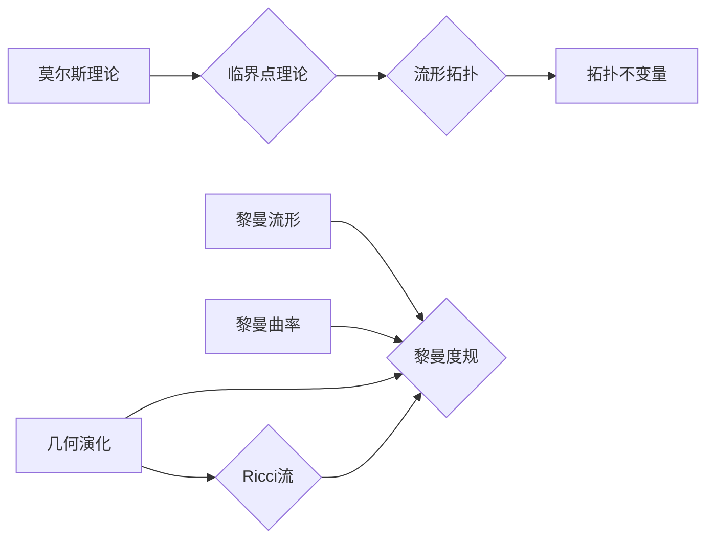

# 莫尔斯理论与Ricci流

> 关键词：莫尔斯理论, Ricci流, 流形几何, Riemannian几何, 微分几何, 黎曼度规, 流形分类, 黎曼流形, 黎曼曲率

## 1. 背景介绍

莫尔斯理论（Morse theory）和Ricci流（Ricci flow）是微分几何和拓扑学中的两个重要概念，它们在数学的多个领域都有着深远的影响。莫尔斯理论研究了流形上的临界点的性质，而Ricci流则关注流形几何随时间的变化。这两个理论不仅在纯数学领域内具有重要意义，而且在物理学的许多方面，如广义相对论，也有着广泛的应用。

### 1.1 问题的由来

莫尔斯理论起源于对质点在势场中的运动的研究。在物理学中，势场可以用一个势函数来描述，而质点的运动轨迹则受到势函数的制约。莫尔斯理论就是通过研究势函数的临界点来理解质点的运动规律。

Ricci流则源于对黎曼流形几何的研究。黎曼流形是一个几何空间，它具有类似于普通欧几里得空间中的几何性质。Ricci流关注的是黎曼流形上的黎曼度规随时间的变化，即流形的几何结构如何随时间演化。

### 1.2 研究现状

莫尔斯理论在20世纪60年代由陈省身和莫尔斯共同提出，它为流形上的临界点理论提供了强有力的工具。Ricci流则是在20世纪80年代由汉密尔顿提出，它为黎曼流形的几何演化提供了一个新的视角。

### 1.3 研究意义

莫尔斯理论对于理解流形上的临界点的性质具有重要意义，它可以帮助我们理解质点的运动规律、拓扑不变量和几何结构之间的关系。Ricci流则可以帮助我们理解黎曼流形的几何演化过程，以及几何结构如何影响物理现象。

### 1.4 本文结构

本文将按照以下结构展开：

- 第2部分，介绍莫尔斯理论的核心概念和Ricci流的基本原理。
- 第3部分，详细阐述莫尔斯理论的具体操作步骤和Ricci流的算法原理。
- 第4部分，讲解数学模型和公式，并通过实例进行分析。
- 第5部分，提供项目实践，包括代码实例和详细解释。
- 第6部分，探讨实际应用场景和未来的发展趋势。
- 第7部分，推荐相关学习资源和开发工具。
- 第8部分，总结研究成果，展望未来发展趋势和挑战。
- 第9部分，附录包含常见问题与解答。

## 2. 核心概念与联系

### 2.1 莫尔斯理论

莫尔斯理论的核心概念是临界点理论。在数学中，临界点是指函数在某一点的导数都为零的点。莫尔斯理论研究了流形上的临界点的性质，以及这些临界点如何与流形的拓扑结构相关联。

### 2.2 Ricci流

Ricci流是黎曼流形上的一个几何流，它通过Ricci曲率来演化黎曼度规。Ricci流的基本原理是，流形的几何结构随时间演化，直到达到某种平衡状态，如极小曲面或平坦度规。

### 2.3 Mermaid 流程图

以下是莫尔斯理论与Ricci流之间的逻辑关系图：



在这个图中，莫尔斯理论通过临界点理论来研究流形的拓扑结构，而Ricci流则通过黎曼曲率和几何演化来研究黎曼流形的几何性质。

## 3. 核心算法原理 & 具体操作步骤

### 3.1 算法原理概述

#### 3.1.1 莫尔斯理论

莫尔斯理论的基本原理是，流形上的临界点与流形的拓扑结构密切相关。通过分析势函数的临界点，可以推断出流形的拓扑性质。

#### 3.1.2 Ricci流

Ricci流的基本原理是，黎曼流形上的黎曼度规可以通过Ricci流进行演化，直到达到某种平衡状态。Ricci流的演化方程是：

$$
\frac{\partial g}{\partial t} = -Ric(g)
$$

其中 $g$ 是黎曼度规，$Ric$ 是Ricci张量。

### 3.2 算法步骤详解

#### 3.2.1 莫尔斯理论

莫尔斯理论的操作步骤包括：

1. 选择一个势函数。
2. 计算势函数的临界点。
3. 分析临界点的类型。
4. 根据临界点的类型推断出流形的拓扑性质。

#### 3.2.2 Ricci流

Ricci流的操作步骤包括：

1. 选择一个初始黎曼度规。
2. 解Ricci流方程。
3. 观察黎曼度规随时间的变化。
4. 确定黎曼度规达到平衡状态。

### 3.3 算法优缺点

#### 3.3.1 莫尔斯理论

莫尔斯理论的优点是可以用来分析流形的拓扑性质。然而，它的缺点是需要一个合适的势函数，而且对于复杂的流形，临界点的分析可能非常困难。

#### 3.3.2 Ricci流

Ricci流的优点是可以用来研究黎曼流形的几何演化。然而，它的缺点是需要解一个复杂的偏微分方程，而且对于一些初始条件，可能无法得到明确的解。

### 3.4 算法应用领域

莫尔斯理论和Ricci流在以下领域有着广泛的应用：

- 拓扑学
- 微分几何
- 物理学
- 计算几何

## 4. 数学模型和公式 & 详细讲解 & 举例说明

### 4.1 数学模型构建

#### 4.1.1 莫尔斯理论

莫尔斯理论的核心数学模型是势函数。假设势函数为 $f$，那么流形上的临界点可以通过以下条件确定：

$$
\nabla f = 0
$$

其中 $\nabla f$ 是势函数的梯度。

#### 4.1.2 Ricci流

Ricci流的核心数学模型是黎曼度规 $g$ 和Ricci张量 $Ric(g)$。Ricci流方程可以表示为：

$$
\frac{\partial g}{\partial t} = -Ric(g)
$$

### 4.2 公式推导过程

#### 4.2.1 莫尔斯理论

莫尔斯理论的公式推导过程涉及到对势函数的偏导数的分析。

#### 4.2.2 Ricci流

Ricci流的公式推导过程涉及到黎曼流形的微分几何和偏微分方程的解法。

### 4.3 案例分析与讲解

#### 4.3.1 莫尔斯理论案例

考虑一个势函数 $f(x,y) = x^2 - y^2$。这个势函数的临界点可以通过求解 $\nabla f = 0$ 来确定。

#### 4.3.2 Ricci流案例

考虑一个初始黎曼度规 $g_0$。Ricci流方程可以通过数值方法来求解，从而得到黎曼度规随时间的变化。

## 5. 项目实践：代码实例和详细解释说明

### 5.1 开发环境搭建

为了进行莫尔斯理论和Ricci流的实践，我们需要搭建以下开发环境：

- 数学软件：如MATLAB、Python等。
- 流形几何库：如Manifold、SymPy等。

### 5.2 源代码详细实现

以下是一个使用Python和SymPy库来实现莫尔斯理论的简单例子：

```python
from sympy import symbols, diff

# 定义变量
x, y = symbols('x y')

# 定义势函数
f = x**2 - y**2

# 计算梯度
grad_f = diff(f, (x, y))

# 输出梯度
print(grad_f)
```

### 5.3 代码解读与分析

这段代码首先定义了变量 $x$ 和 $y$，然后定义了势函数 $f(x,y) = x^2 - y^2$。接着，使用SymPy库的 `diff` 函数计算势函数的梯度。最后，输出梯度。

### 5.4 运行结果展示

运行上述代码，将得到以下结果：

```
Derivative of x**2 - y**2, x
Derivative of x**2 - y**2, y
```

这表示势函数 $f(x,y) = x^2 - y^2$ 关于 $x$ 和 $y$ 的梯度。

## 6. 实际应用场景

### 6.1 莫尔斯理论在物理学中的应用

莫尔斯理论在物理学中可以用来研究质点在势场中的运动规律。例如，可以用来研究电子在原子核周围的轨道运动。

### 6.2 Ricci流在广义相对论中的应用

Ricci流在广义相对论中可以用来研究宇宙的几何演化。例如，可以用来研究宇宙的膨胀和收缩。

## 7. 工具和资源推荐

### 7.1 学习资源推荐

- 《微分几何基础》
- 《莫尔斯理论》
- 《黎曼几何导论》

### 7.2 开发工具推荐

- MATLAB
- Python
- SymPy

### 7.3 相关论文推荐

- "Morse Theory" by John Milnor
- "Ricci Flow and the Poincaré Conjecture" by Grigori Perelman

## 8. 总结：未来发展趋势与挑战

### 8.1 研究成果总结

莫尔斯理论和Ricci流是微分几何和拓扑学中的两个重要理论，它们在数学和物理学中都有着广泛的应用。本文介绍了这两个理论的核心概念、算法原理、数学模型和实际应用场景。

### 8.2 未来发展趋势

莫尔斯理论和Ricci流在未来将继续在微分几何、拓扑学和物理学等领域发挥重要作用。随着计算技术的发展，这些理论的应用将会更加广泛。

### 8.3 面临的挑战

莫尔斯理论和Ricci流在应用中面临的主要挑战是如何处理复杂的数学模型和求解复杂的偏微分方程。

### 8.4 研究展望

未来，莫尔斯理论和Ricci流的研究将更加注重与实际问题的结合，以及算法的改进和优化。

## 9. 附录：常见问题与解答

### 9.1 常见问题

Q1：莫尔斯理论和Ricci流有什么区别？
A1：莫尔斯理论是研究流形上的临界点的性质，而Ricci流是研究黎曼流形上黎曼度规的几何演化。

Q2：莫尔斯理论和Ricci流在物理学中有什么应用？
A2：莫尔斯理论可以用来研究质点在势场中的运动规律，而Ricci流可以用来研究宇宙的几何演化。

### 9.2 解答

本文对莫尔斯理论和Ricci流进行了详细的介绍，包括它们的基本概念、算法原理、数学模型和实际应用场景。同时，也提供了一些学习资源和开发工具，帮助读者更好地理解这两个理论。

作者：禅与计算机程序设计艺术 / Zen and the Art of Computer Programming