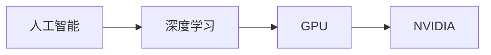

# NVIDIA 如何改变了 AI 算力格局

## 1. 背景介绍

### 1.1 问题的由来

近年来，人工智能 (AI) 以前所未有的速度发展，这在很大程度上归功于深度学习的突破。然而，深度学习模型的训练需要巨大的计算能力，这使得传统的 CPU 难以满足需求。这一瓶颈催生了对更高效、更强大算力的迫切需求。

### 1.2 研究现状

为了解决 AI 算力问题，学术界和工业界进行了大量的研究和开发。其中，图形处理单元 (GPU) 因其并行计算能力而成为训练深度学习模型的首选硬件。NVIDIA 作为全球领先的 GPU 制造商，凭借其在高性能计算和 AI 领域的深厚积累，推出了一系列针对 AI 优化的硬件和软件产品，极大地推动了 AI 的发展。

### 1.3 研究意义

NVIDIA 对 AI 算力格局的改变具有深远意义。首先，它为 AI 研究和应用提供了强大的算力支持，使得训练更大、更复杂的模型成为可能，从而推动了 AI 算法的进步和应用领域的拓展。其次，NVIDIA 的软硬件生态系统促进了 AI 技术的普及和应用，降低了 AI 开发的门槛，使得更多的人能够参与到 AI 创新中来。

### 1.4 本文结构

本文将深入探讨 NVIDIA 如何改变 AI 算力格局。首先，我们将介绍 NVIDIA 在 AI 领域的硬件和软件产品，并分析其技术优势。然后，我们将探讨 NVIDIA 的生态系统建设，以及其对 AI 产业发展的影响。最后，我们将展望 NVIDIA 在未来 AI 算力格局中的地位和作用。

## 2. 核心概念与联系

在深入探讨 NVIDIA 如何改变 AI 算力格局之前，我们先来了解一些核心概念及其之间的联系。

### 2.1 人工智能 (AI)

人工智能 (Artificial Intelligence, AI) 是指由人工制造出来的系统所表现出来的智能。通常情况下，AI 是指通过普通计算机程序来呈现人类智能的技术。

### 2.2 深度学习 (Deep Learning)

深度学习是机器学习的一种，它使用包含多个隐藏层的人工神经网络来学习数据的表示。深度学习在图像识别、语音识别、自然语言处理等领域取得了突破性进展。

### 2.3 图形处理单元 (GPU)

图形处理单元 (Graphics Processing Unit, GPU) 是一种专门为执行复杂的数学和图形计算而设计的电子电路。GPU 的并行处理能力使其非常适合用于加速深度学习模型的训练。

### 2.4 NVIDIA

NVIDIA Corporation 是一家全球领先的科技公司，专注于设计和制造图形处理单元 (GPU) 以及相关软件。NVIDIA 的 GPU 被广泛应用于游戏、专业可视化、数据中心和人工智能等领域。

### 2.5 核心概念关系图



## 3.  核心算法原理 & 具体操作步骤

### 3.1 算法原理概述

NVIDIA 通过其 GPU 架构和软件平台，为 AI 计算提供了强大的支持。其核心算法原理可以概括为以下几点：

* **并行计算：** GPU 拥有大量的计算核心，可以同时执行多个计算任务，从而大幅提升计算速度。
* **高带宽内存：** GPU 配备了高带宽的显存，可以快速读取和写入数据，避免了内存瓶颈。
* **专用指令集：** NVIDIA GPU 支持专门针对深度学习优化的指令集，例如 CUDA 和 Tensor Core，可以加速深度学习模型的训练和推理。
* **软件优化：** NVIDIA 提供了 CUDA、cuDNN、TensorRT 等软件平台，为开发者提供了便捷的开发工具和优化的深度学习库。

### 3.2 算法步骤详解

NVIDIA GPU 加速 AI 计算的具体步骤如下：

1. **数据加载：** 将训练数据从存储器加载到 GPU 显存中。
2. **数据预处理：** 对数据进行预处理，例如数据增强、格式转换等。
3. **模型训练：** 使用 GPU 并行计算能力，加速深度学习模型的训练过程。
4. **模型优化：** 使用 NVIDIA TensorRT 等工具对训练好的模型进行优化，提高推理速度和效率。
5. **模型部署：** 将优化后的模型部署到各种设备上，例如服务器、边缘设备等。

### 3.3 算法优缺点

**优点：**

* **高性能：** GPU 的并行计算能力可以大幅提升 AI 计算速度。
* **高效率：** NVIDIA 的软件平台和优化工具可以提高 AI 开发效率。
* **生态系统完善：** NVIDIA 拥有庞大的开发者生态系统，提供了丰富的资源和支持。

**缺点：**

* **成本高昂：** 高性能 GPU 的价格相对较高。
* **功耗较大：** GPU 的功耗较大，需要考虑散热问题。

### 3.4 算法应用领域

NVIDIA 的 AI 算力解决方案被广泛应用于以下领域：

* **计算机视觉：** 图像识别、目标检测、图像分割等。
* **自然语言处理：** 语音识别、机器翻译、文本生成等。
* **数据分析：** 数据挖掘、预测分析、推荐系统等。
* **自动驾驶：** 环境感知、路径规划、决策控制等。


## 4. 数学模型和公式 & 详细讲解 & 举例说明

### 4.1 数学模型构建

为了更好地理解 NVIDIA GPU 如何加速 AI 计算，我们可以使用一个简单的数学模型来描述矩阵乘法运算。矩阵乘法是深度学习中最常见的计算操作之一。

假设有两个矩阵 A 和 B，它们的维度分别为 m x n 和 n x p。则它们的乘积矩阵 C 的维度为 m x p，其中：

$$C_{i,j} = \sum_{k=1}^{n} A_{i,k} * B_{k,j}$$

### 4.2 公式推导过程

在传统的 CPU 上，矩阵乘法需要进行 m x n x p 次乘法运算和 (m x (n-1) x p) 次加法运算。而在 GPU 上，由于其并行计算能力，可以将矩阵乘法分解成多个小的计算任务，并同时进行计算。

例如，假设 GPU 拥有 k 个计算核心，则可以将矩阵 A 划分成 k 个子矩阵，并将每个子矩阵分配给一个计算核心进行计算。每个计算核心只需要计算一部分矩阵乘积，最后将所有计算结果合并即可得到最终结果。

### 4.3 案例分析与讲解

以图像分类任务为例，假设输入图像的维度为 224 x 224 x 3，卷积核的维度为 3 x 3 x 3 x 64，则一次卷积运算需要进行的乘法运算次数为：

$$224 * 224 * 3 * 3 * 3 * 64 = 86,704,128$$

如果使用 NVIDIA Tesla V100 GPU，其拥有 5120 个 CUDA 核心，则可以将卷积运算分解成 5120 个小的计算任务，每个计算核心只需要进行 16,944 次乘法运算。

### 4.4 常见问题解答

**问：NVIDIA GPU 与 CPU 相比，加速比是多少？**

答：NVIDIA GPU 的加速比取决于具体的应用场景和硬件配置。一般来说，GPU 的加速比可以达到 CPU 的数十倍甚至数百倍。

**问：NVIDIA GPU 是否支持所有深度学习框架？**

答：是的，NVIDIA GPU 支持所有主流的深度学习框架，例如 TensorFlow、PyTorch、Caffe 等。


## 5. 项目实践：代码实例和详细解释说明

### 5.1 开发环境搭建

要使用 NVIDIA GPU 进行 AI 开发，需要搭建相应的开发环境。以下是一个简单的开发环境搭建步骤：

1. 安装 NVIDIA 显卡驱动程序。
2. 安装 CUDA 工具包。
3. 安装 cuDNN 库。
4. 安装深度学习框架，例如 TensorFlow 或 PyTorch。

### 5.2 源代码详细实现

以下是一个使用 TensorFlow 框架进行图像分类的简单示例代码：

```python
import tensorflow as tf

# 定义模型
model = tf.keras.models.Sequential([
  tf.keras.layers.Conv2D(32, (3, 3), activation='relu', input_shape=(28, 28, 1)),
  tf.keras.layers.MaxPooling2D((2, 2)),
  tf.keras.layers.Conv2D(64, (3, 3), activation='relu'),
  tf.keras.layers.MaxPooling2D((2, 2)),
  tf.keras.layers.Flatten(),
  tf.keras.layers.Dense(10, activation='softmax')
])

# 编译模型
model.compile(optimizer='adam',
              loss='sparse_categorical_crossentropy',
              metrics=['accuracy'])

# 加载数据集
(x_train, y_train), (x_test, y_test) = tf.keras.datasets.mnist.load_data()

# 预处理数据
x_train = x_train.astype('float32') / 255.0
x_test = x_test.astype('float32') / 255.0

# 训练模型
model.fit(x_train, y_train, epochs=5)

# 评估模型
loss, accuracy = model.evaluate(x_test, y_test, verbose=2)
print('Loss:', loss)
print('Accuracy:', accuracy)
```

### 5.3 代码解读与分析

* `tf.keras.layers.Conv2D` 定义了一个二维卷积层，用于提取图像特征。
* `tf.keras.layers.MaxPooling2D` 定义了一个最大池化层，用于降低特征图的维度。
* `tf.keras.layers.Flatten` 将多维特征图转换为一维向量。
* `tf.keras.layers.Dense` 定义了一个全连接层，用于分类。
* `model.compile` 用于配置模型的训练参数，例如优化器、损失函数等。
* `model.fit` 用于训练模型。
* `model.evaluate` 用于评估模型的性能。

### 5.4 运行结果展示

在训练完成后，可以使用 `model.evaluate` 方法评估模型的性能。例如，以下代码展示了模型在测试集上的损失和准确率：

```
Loss: 0.030223249942064285
Accuracy: 0.9901999855041504
```


## 6. 实际应用场景

### 6.1 计算机视觉

* **图像识别：** NVIDIA GPU 可以加速图像分类、目标检测、图像分割等任务，应用于人脸识别、自动驾驶、医疗影像分析等领域。
* **视频分析：** NVIDIA GPU 可以加速视频分类、目标跟踪、行为识别等任务，应用于安防监控、智能交通、视频内容分析等领域。

### 6.2 自然语言处理

* **语音识别：** NVIDIA GPU 可以加速语音识别模型的训练和推理，应用于智能语音助手、语音输入法、智能客服等领域。
* **机器翻译：** NVIDIA GPU 可以加速机器翻译模型的训练和推理，应用于跨语言交流、文本翻译等领域。

### 6.3 数据分析

* **数据挖掘：** NVIDIA GPU 可以加速数据清洗、特征提取、模型训练等任务，应用于用户画像、风险控制、精准营销等领域。
* **预测分析：** NVIDIA GPU 可以加速时间序列预测、回归分析等任务，应用于金融预测、销量预测、天气预报等领域。

### 6.4 未来应用展望

随着 AI 技术的不断发展，NVIDIA GPU 在以下领域具有广阔的应用前景：

* **边缘计算：** NVIDIA Jetson 系列嵌入式平台可以将 AI 算力扩展到边缘设备，例如无人机、机器人、智能摄像头等。
* **量子计算：** NVIDIA cuQuantum SDK 可以加速量子计算算法的开发和模拟，推动量子计算技术的发展。


## 7. 工具和资源推荐

### 7.1 学习资源推荐

* **NVIDIA 深度学习学院 (DLI)：** 提供深度学习相关的在线课程和实践项目。
* **Coursera：** 提供由 NVIDIA 专家讲授的深度学习课程。
* **Udacity：** 提供由 NVIDIA 赞助的自动驾驶汽车工程师纳米学位课程。

### 7.2 开发工具推荐

* **CUDA Toolkit：** NVIDIA GPU 的并行计算平台和编程模型。
* **cuDNN：** 用于深度神经网络的 GPU 加速库。
* **TensorRT：** 用于高性能深度学习推理的 SDK。

### 7.3 相关论文推荐

* [AlexNet](https://papers.nips.cc/paper/2012/hash/c399862d3b9d6b76c8436e924a68c45b-Abstract.html)： 使用深度卷积神经网络进行 ImageNet 分类。
* [ResNet](https://arxiv.org/abs/1512.03385)： 深度残差学习用于图像识别。
* [BERT](https://arxiv.org/abs/1810.04805)： 用于语言理解的深度双向 Transformer。

### 7.4 其他资源推荐

* **NVIDIA 开发者论坛：** NVIDIA 开发者交流的平台。
* **GitHub：** 寻找开源深度学习项目和代码示例。


## 8. 总结：未来发展趋势与挑战

### 8.1 研究成果总结

NVIDIA 通过其高性能 GPU、软件平台和生态系统建设，极大地推动了 AI 的发展。NVIDIA GPU 的并行计算能力、高带宽内存和专用指令集，使其成为训练和推理深度学习模型的理想选择。

### 8.2 未来发展趋势

* **更高性能的 GPU：** NVIDIA 将继续推出更高性能的 GPU，以满足不断增长的 AI 算力需求。
* **更完善的软件生态系统：** NVIDIA 将继续优化其软件平台和工具，为开发者提供更便捷的开发体验。
* **更广泛的应用领域：** 随着 AI 技术的普及，NVIDIA GPU 将应用于更多领域，例如边缘计算、量子计算等。

### 8.3 面临的挑战

* **功耗和散热：** 高性能 GPU 的功耗和散热问题需要得到解决。
* **成本控制：** 高性能 GPU 的成本仍然较高，需要降低成本以推动 AI 技术的普及。
* **人才竞争：** AI 领域的人才竞争日益激烈，NVIDIA 需要吸引和培养更多优秀人才。

### 8.4 研究展望

NVIDIA 将继续引领 AI 算力技术的发展，为 AI 研究和应用提供更强大的支持。随着 AI 技术的不断进步，NVIDIA GPU 将在更多领域发挥重要作用，推动人类社会进入智能时代。

## 9. 附录：常见问题与解答

**问：如何选择合适的 NVIDIA GPU？**

答：选择合适的 NVIDIA GPU 需要考虑以下因素：

* **应用场景：** 不同的应用场景对 GPU 的性能要求不同。
* **预算：** 不同型号的 GPU 价格差异较大。
* **功耗和散热：** 需要考虑 GPU 的功耗和散热需求。

**问：如何学习 NVIDIA GPU 编程？**

答：NVIDIA 提供了丰富的学习资源，例如 NVIDIA 深度学习学院 (DLI) 和 CUDA Toolkit 文档。

**问：NVIDIA GPU 是否支持云计算平台？**

答：是的，NVIDIA GPU 支持所有主流的云计算平台，例如 Amazon Web Services (AWS)、Microsoft Azure、Google Cloud Platform (GCP) 等。

作者：禅与计算机程序设计艺术 / Zen and the Art of Computer Programming
