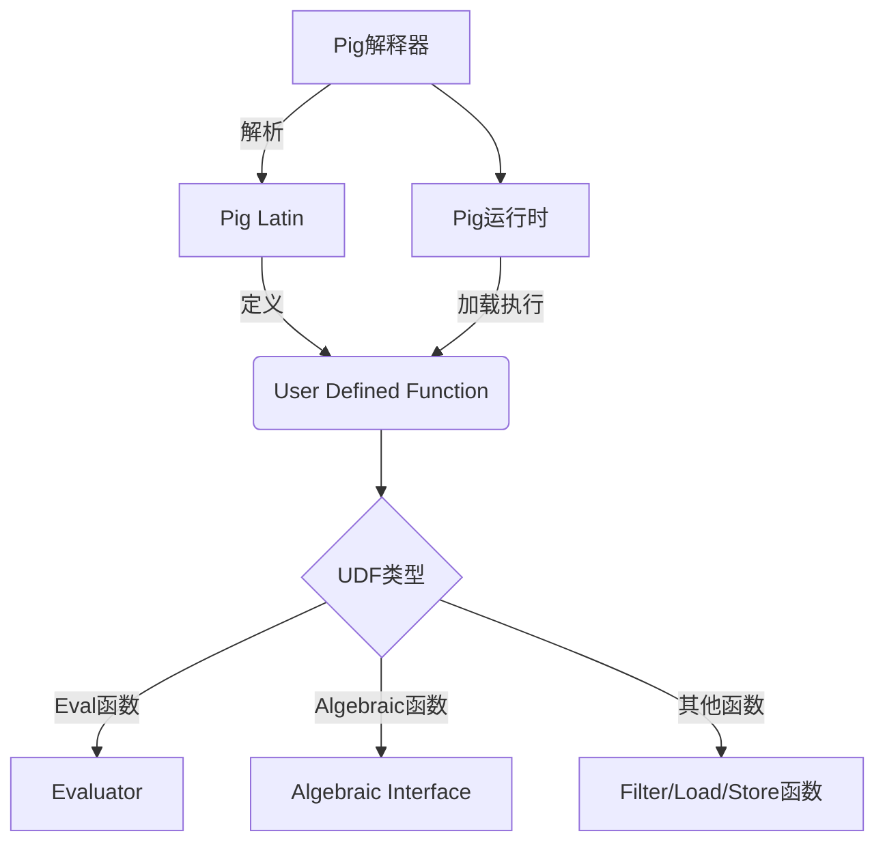

# Pig UDF原理与代码实例讲解

## 1. 背景介绍

### 1.1 问题的由来

在大数据处理领域,Apache Pig作为一种高级数据流语言,被广泛应用于构建数据分析程序。它提供了一种简单且强大的方式来探索和处理海量数据。然而,在实际应用中,开发人员经常会遇到Pig内置函数无法满足特定需求的情况。这时,用户自定义函数(User Defined Function,UDF)就显得尤为重要。

UDF允许开发人员使用Java、Python、Ruby等语言编写自定义代码,扩展Pig的功能,从而解决复杂的数据处理任务。无论是执行自定义数据清洗、转换、过滤还是聚合操作,UDF都可以发挥关键作用。

### 1.2 研究现状

目前,Pig UDF已经被广泛应用于各种数据处理场景,如电商数据分析、日志处理、推荐系统等。越来越多的开发人员开始关注如何高效地编写和优化UDF,以提高数据处理的性能和可扩展性。

然而,由于缺乏系统的指导和最佳实践,许多开发人员在编写UDF时仍然面临诸多挑战,如代码可读性差、性能低下、调试困难等。因此,探索Pig UDF的原理和优化技巧,对于提高开发效率和系统性能至关重要。

### 1.3 研究意义

深入理解Pig UDF的原理和实现细节,对于开发高质量、高性能的数据处理应用程序具有重要意义。本文将从以下几个方面阐述Pig UDF的重要性:

1. **扩展性**:通过编写UDF,开发人员可以根据特定需求扩展Pig的功能,实现更加灵活和强大的数据处理能力。

2. **性能优化**:掌握UDF的内部原理和优化技巧,可以显著提升数据处理的效率和性能,尤其是在处理海量数据时。

3. **代码复用**:将常用的数据处理逻辑封装为UDF,可以提高代码的可重用性,降低开发和维护成本。

4. **社区贡献**:分享高质量的UDF实现,有助于推动Pig社区的发展,促进知识和经验的交流。

### 1.4 本文结构

本文将全面探讨Pig UDF的原理和实现细节,内容安排如下:

1. 背景介绍
2. 核心概念与联系
3. 核心算法原理与具体操作步骤
4. 数学模型和公式详细讲解与举例说明
5. 项目实践:代码实例和详细解释说明
6. 实际应用场景
7. 工具和资源推荐
8. 总结:未来发展趋势与挑战
9. 附录:常见问题与解答

## 2. 核心概念与联系

在深入探讨Pig UDF的原理之前,我们需要先了解一些核心概念及其之间的联系。



1. **Pig Latin**: Pig提供了一种名为Pig Latin的数据流语言,用于定义数据处理流程。它支持多种操作,如加载(LOAD)、过滤(FILTER)、连接(JOIN)、聚合(GROUP)等。

2. **User Defined Function(UDF)**: UDF是Pig中的一个重要概念,允许开发人员使用Java、Python等语言编写自定义函数,扩展Pig的功能。

3. **UDF类型**: Pig支持多种UDF类型,包括Eval函数、Algebraic函数、Filter函数、Load函数和Store函数等。不同类型的UDF用于解决不同的数据处理需求。

4. **Evaluator**: Eval类型的UDF需要实现Evaluator接口,并重写`exec`方法来定义函数的具体逻辑。

5. **Algebraic Interface**: Algebraic类型的UDF需要实现Algebraic接口,用于定义代数运算,如加法、乘法等。

6. **Filter/Load/Store函数**: 这些UDF类型分别用于过滤数据、加载数据和存储数据。

7. **Pig运行时**: Pig运行时负责加载和执行UDF代码。

8. **Pig解释器**: Pig解释器负责解析Pig Latin脚本,并将其转换为可执行的计划。

这些核心概念之间紧密相连,共同构建了Pig UDF的整体架构。理解它们的关系对于编写高质量的UDF至关重要。

## 3. 核心算法原理与具体操作步骤

### 3.1 算法原理概述

Pig UDF的核心算法原理可以概括为以下几个关键步骤:

1. **注册UDF**: 在Pig Latin脚本中,使用`REGISTER`语句注册UDF的JAR包或Python脚本。

2. **定义UDF**: 根据需求,使用Java、Python等语言实现不同类型的UDF,如Eval、Algebraic、Filter等。

3. **调用UDF**: 在Pig Latin脚本中,使用特定的语法调用已注册的UDF,将其应用于数据处理流程。

4. **UDF执行**: Pig运行时加载并执行UDF代码,对输入数据执行相应的操作,如转换、过滤或聚合等。

5. **结果输出**: UDF的执行结果将被Pig运行时收集并输出到指定位置,如HDFS或本地文件系统。

### 3.2 算法步骤详解

现在,让我们更加详细地探讨Pig UDF算法的具体步骤。

#### 步骤1: 注册UDF

在Pig Latin脚本中,使用`REGISTER`语句注册UDF的JAR包或Python脚本。例如:

```pig
REGISTER '/path/to/udf.jar';
```

或者:

```pig
REGISTER '/path/to/udf.py' USING jython;
```

#### 步骤2: 定义UDF

根据需求,使用Java、Python等语言实现不同类型的UDF。以Java为例,我们可以定义一个Eval类型的UDF,用于将输入字符串转换为大写:

```java
import org.apache.pig.EvalFunc;
import org.apache.pig.data.Tuple;

public class UpperCase extends EvalFunc<String> {
    public String exec(Tuple input) throws IOException {
        if (input == null || input.size() == 0) {
            return null;
        }
        try {
            String str = (String) input.get(0);
            return str.toUpperCase();
        } catch (Exception e) {
            throw new IOException("Error in UpperCase UDF: " + e.getMessage());
        }
    }
}
```

#### 步骤3: 调用UDF

在Pig Latin脚本中,使用特定的语法调用已注册的UDF,将其应用于数据处理流程。例如:

```pig
DEFINE UpperCase `com.example.UpperCase`;
data = LOAD 'input.txt' AS (line:chararray);
upper_data = FOREACH data GENERATE UpperCase(line);
STORE upper_data INTO 'output' USING PigStorage();
```

在上面的示例中,我们首先使用`DEFINE`语句定义了一个名为`UpperCase`的UDF,然后在`FOREACH`语句中调用该UDF,将输入数据的每一行转换为大写,最后将结果存储到HDFS上的`output`目录中。

#### 步骤4: UDF执行

Pig运行时将加载并执行UDF代码,对输入数据执行相应的操作。在上面的示例中,`UpperCase`的`exec`方法将被调用,对每一个输入元组执行大写转换操作。

#### 步骤5: 结果输出

UDF的执行结果将被Pig运行时收集并输出到指定位置,如HDFS或本地文件系统。在上面的示例中,转换后的大写字符串将被存储到HDFS上的`output`目录中。

### 3.3 算法优缺点

Pig UDF算法具有以下优点:

1. **扩展性强**: 通过编写UDF,开发人员可以根据特定需求扩展Pig的功能,实现更加灵活和强大的数据处理能力。

2. **简单易用**: Pig Latin语言简洁易懂,调用UDF的语法也非常直观,降低了开发和维护的复杂性。

3. **可重用性高**: UDF可以被多个Pig Latin脚本共享和复用,提高了代码的可维护性和可扩展性。

4. **语言无关性**: Pig支持使用多种编程语言(如Java、Python、Ruby等)来实现UDF,满足了不同开发者的需求。

然而,Pig UDF算法也存在一些缺点和限制:

1. **性能瓶颈**: 由于Pig运行时需要频繁加载和执行UDF代码,在处理海量数据时可能会遇到性能瓶颈。

2. **调试困难**: 由于UDF执行过程是在Pig运行时中进行的,因此调试UDF代码可能会比较困难。

3. **资源消耗**: 每个UDF实例都需要占用一定的内存和CPU资源,在并发执行大量UDF时,可能会导致资源消耗过高。

4. **版本兼容性**: 不同版本的Pig可能对UDF的接口和行为有所改变,因此需要注意版本兼容性问题。

### 3.4 算法应用领域

Pig UDF算法可以应用于各种数据处理场景,包括但不限于:

1. **数据清洗和转换**: 使用UDF可以实现各种数据清洗和转换操作,如字符串处理、日期格式化、数据规范化等。

2. **自定义过滤和聚合**: 通过编写Filter和Algebraic类型的UDF,可以实现自定义的过滤和聚合逻辑,满足特定的业务需求。

3. **数据加载和存储**: 使用Load和Store类型的UDF,可以实现从自定义数据源加载数据或将数据存储到自定义位置。

4. **机器学习和数据挖掘**: UDF可以用于实现各种机器学习和数据挖掘算法,如分类、聚类、关联规则挖掘等。

5. **复杂事件处理**: 利用UDF,可以实现复杂事件处理(CEP)相关的逻辑,如模式匹配、事件过滤和聚合等。

6. **自然语言处理**: UDF可以用于实现自然语言处理相关的功能,如文本分类、情感分析、命名实体识别等。

总的来说,Pig UDF算法为开发人员提供了极大的灵活性,可以应用于各种数据处理场景,满足不同的业务需求。

## 4. 数学模型和公式详细讲解与举例说明

在某些情况下,我们可能需要在Pig UDF中使用数学模型和公式来实现特定的数据处理逻辑。本节将详细讲解一些常见的数学模型和公式,并提供具体的代码示例和案例分析。

### 4.1 数学模型构建

#### 4.1.1 线性回归模型

线性回归是一种常见的监督学习算法,用于建立自变量和因变量之间的线性关系。在Pig UDF中,我们可以实现线性回归算法,用于预测或分析数据。

线性回归模型的数学表达式如下:

$$
y = \beta_0 + \beta_1 x_1 + \beta_2 x_2 + \cdots + \beta_n x_n + \epsilon
$$

其中:

- $y$ 是因变量
- $x_1, x_2, \cdots, x_n$ 是自变量
- $\beta_0, \beta_1, \cdots, \beta_n$ 是回归系数
- $\epsilon$ 是误差项

我们可以使用最小二乘法来估计回归系数,从而获得最佳拟合直线。

#### 4.1.2 逻辑回归模型

逻辑回归是一种用于分类问题的监督学习算法。在Pig UDF中,我们可以实现逻辑回归算法,用于对数据进行二分类或多分类。

逻辑回归模型的数学表达式如下:

$$
P(Y=1|X) = \frac{1}{1 + e^{-(\beta_0 + \beta_1 x_1 + \beta_2 x_2 + \cdots + \beta_n x_n)}}
$$

其中:

- $P(Y=1|X)$ 是给定自变量 $X$ 时,因变量 $Y$ 取值为 1 的概率
- $x_1, x_2, \cdots, x_n$ 是自变量
- $\beta_0, \beta_1, \cdots, \beta_n$ 是