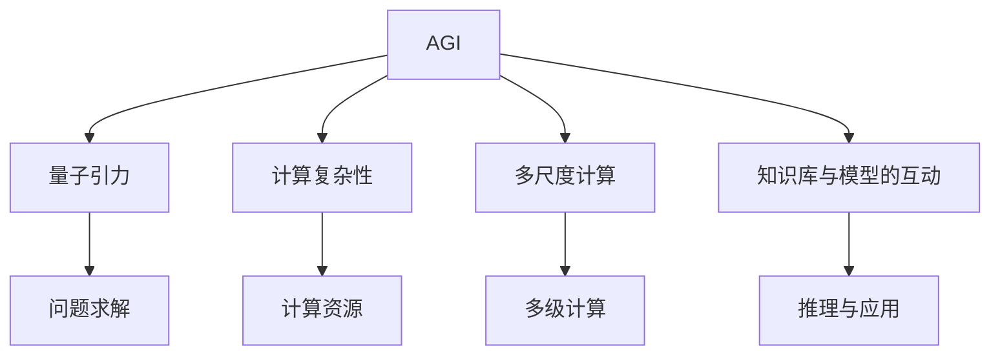
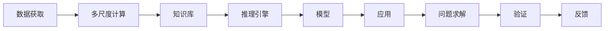
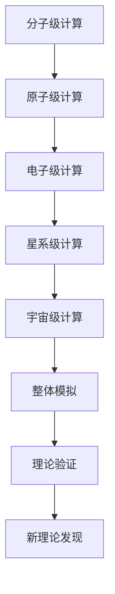
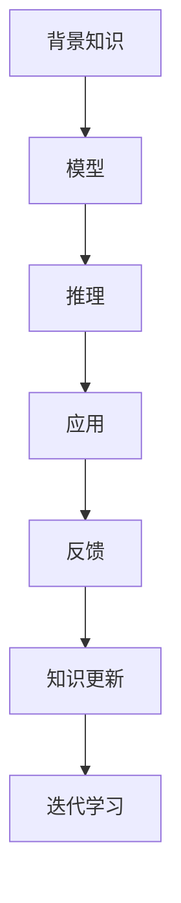
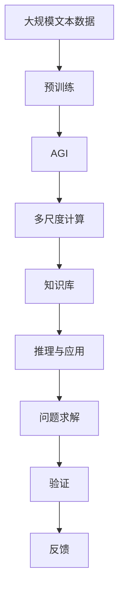

                 

# AGI在量子引力中的创新应用

> 关键词：人工智能,AGI,量子引力,计算复杂性,大模型,深度学习,数学模型,物理模拟,多尺度计算

## 1. 背景介绍

### 1.1 问题由来
随着人工智能（AI）技术的迅猛发展，人工智能大模型（AGI, Artificial General Intelligence）的构建已成为学术界和产业界的热门话题。AGI指的是能够理解和执行各种人类智能活动的智能体，具备广泛的知识面、高泛化能力和自我学习进化的能力。而量子引力是当前物理学研究的重大难题之一，旨在揭示引力本质与量子力学之间的关联，对理解宇宙微观结构具有重要意义。

量子引力问题涉及的计算复杂度极高，传统的计算方法已难以满足需求。AGI作为高度智能化的计算工具，被认为可能带来新的突破。AGI与量子引力结合，有望在计算复杂性、多尺度计算等领域实现新的技术突破。

### 1.2 问题核心关键点
AGI在量子引力中的应用，主要关注以下几个关键点：
- 大模型的计算复杂度
- AGI对量子引力的模拟能力
- AGI的泛化能力与学习能力
- 多尺度计算与精度控制
- 知识库与模型的互动机制

### 1.3 问题研究意义
AGI在量子引力中的应用具有重要意义：
1. **突破计算复杂性**：AGI的计算能力可能大幅提升对量子引力问题的计算效率。
2. **提升模拟精度**：AGI在多尺度计算中可能实现更精确的量子引力模拟。
3. **加速知识更新**：AGI的自我学习机制可能加速新理论的发现和验证。
4. **推动学科交叉**：AGI的应用可能促进物理学、计算科学与人工智能的交叉研究。
5. **探索新理论**：AGI可能帮助发现全新的量子引力理论。

## 2. 核心概念与联系

### 2.1 核心概念概述

为更好地理解AGI在量子引力中的应用，本节将介绍几个密切相关的核心概念：

- AGI：指具备通用智能的人工智能系统，能够在各种复杂任务中表现出类人智能。
- 量子引力：研究物质、能量、空间和时间在量子水平上的本质关系，目标是构建统一的引力理论。
- 计算复杂性：描述算法所需计算资源的复杂度，通常与问题规模、输入大小有关。
- 多尺度计算：涉及不同尺度的计算任务，从分子级到宇宙级，需要高效的计算框架支持。
- 知识库与模型的互动：知识库为AGI提供背景知识，模型则用于对知识进行推理和应用。

这些核心概念之间的逻辑关系可以通过以下Mermaid流程图来展示：



这个流程图展示了大语言模型与量子引力问题的解决过程：AGI首先通过多尺度计算获取数据，然后结合知识库进行推理和应用，最后求解量子引力问题。

### 2.2 概念间的关系

这些核心概念之间存在着紧密的联系，形成了AGI在量子引力问题上的解决框架。下面我通过几个Mermaid流程图来展示这些概念之间的关系。

#### 2.2.1 AGI的学习与推理过程



这个流程图展示了AGI的学习与推理过程：从多尺度计算中获取数据，然后结合知识库进行推理，最终输出到应用，并根据验证和反馈不断优化。

#### 2.2.2 多尺度计算与量子引力



这个流程图展示了多尺度计算的应用：从分子级到宇宙级，多尺度计算逐步构建整体模拟，并推动新理论的发现和验证。

#### 2.2.3 知识库与模型的互动



这个流程图展示了知识库与模型的互动：背景知识与模型推理结合，通过应用和反馈不断更新知识库，实现知识迭代学习。

### 2.3 核心概念的整体架构

最后，我们用一个综合的流程图来展示这些核心概念在大语言模型微调过程中的整体架构：



这个综合流程图展示了从预训练到大模型应用的全过程，大语言模型通过多尺度计算和知识库的互动，最终实现问题求解和理论验证。

## 3. 核心算法原理 & 具体操作步骤
### 3.1 算法原理概述

AGI在量子引力中的应用，本质上是将AGI作为计算工具，模拟和解决量子引力问题。具体步骤如下：

1. **数据获取与预训练**：使用多尺度计算方法，获取量子引力问题的数据，并利用大模型进行预训练。
2. **模型微调**：根据量子引力问题的特征，设计合适的任务适配层，进行有监督微调。
3. **推理与应用**：将微调后的模型应用于量子引力问题的推理和求解。
4. **知识库与模型互动**：结合领域专家的知识库，对模型进行迭代优化，提升其泛化能力和学习效率。
5. **理论验证与更新**：通过验证和反馈机制，不断修正和更新理论模型，推动新理论的发现。

### 3.2 算法步骤详解

**Step 1: 数据获取与预训练**
- 使用多尺度计算方法，从实验和模拟中获取量子引力问题的数据。
- 对大模型进行预训练，学习背景知识，构建初步的物理模型。

**Step 2: 模型微调**
- 设计适合量子引力问题的任务适配层，如分类、回归等。
- 利用标注数据进行有监督微调，优化模型在特定问题上的性能。

**Step 3: 推理与应用**
- 使用微调后的模型进行推理，预测量子引力问题的解。
- 结合物理定律和实验数据，进行理论验证。

**Step 4: 知识库与模型互动**
- 利用领域专家的知识库，提供额外的物理信息和数学模型。
- 通过反馈机制，不断修正模型的推理过程，提升泛化能力。

**Step 5: 理论验证与更新**
- 利用实际实验和模拟数据，验证模型的预测结果。
- 根据验证结果，更新模型和知识库，推动新理论的发现。

### 3.3 算法优缺点

AGI在量子引力中的应用具有以下优点：
- 高泛化能力：AGI能够处理各种不同尺度的计算任务，提升计算精度。
- 自我学习：AGI可以通过迭代学习，快速吸收新知识，推动新理论的发现。
- 多尺度计算：AGI能够同时处理不同尺度的计算任务，提升计算效率。
- 泛化能力：AGI可以学习背景知识，提升模型的泛化能力和鲁棒性。

同时，该方法也存在以下缺点：
- 数据依赖：需要大量高质量的数据进行预训练和微调。
- 模型复杂：AGI模型参数众多，需要高效计算资源。
- 理论复杂：量子引力问题本质复杂，需要AGI具备强大的计算和推理能力。
- 验证困难：验证新理论的正确性需要大量实验验证，过程复杂。

### 3.4 算法应用领域

AGI在量子引力中的应用，主要涉及以下几个领域：

1. **计算复杂性**：通过多尺度计算，AGI可以高效处理复杂的量子引力问题。
2. **模拟与预测**：AGI可以模拟不同尺度的物理现象，进行预测和验证。
3. **理论发现**：AGI可以通过学习背景知识，推动新理论的发现和验证。
4. **多尺度融合**：AGI可以结合不同尺度的计算结果，进行综合分析。
5. **跨学科应用**：AGI可以推动物理学、计算科学与人工智能的交叉研究。

这些领域展示了AGI在量子引力问题中的广泛应用，未来有望进一步推动相关研究的发展。

## 4. 数学模型和公式 & 详细讲解 & 举例说明

### 4.1 数学模型构建

AGI在量子引力中的应用，涉及复杂的数学模型。这里以量子引力中的广义相对论方程为例，构建数学模型。

广义相对论的场方程为：

$$
G_{\mu\nu} + \Lambda g_{\mu\nu} = \frac{8\pi G}{c^4} T_{\mu\nu}
$$

其中，$G_{\mu\nu}$为爱因斯坦场方程的右端项，$\Lambda$为宇宙学常数，$g_{\mu\nu}$为度规张量，$T_{\mu\nu}$为应力-能量张量，$G$为万有引力常数，$c$为光速。

假设AGI需要将上述方程应用于特定问题，首先需要进行以下几步：

1. **数据准备**：将引力场和物质分布的初始条件作为输入。
2. **模型构建**：构建AGI所需的神经网络模型，通常为深度学习模型。
3. **损失函数设计**：设计损失函数，衡量模型输出与真实解的差异。
4. **优化算法**：选择优化算法，最小化损失函数，更新模型参数。
5. **模型验证**：使用验证集评估模型性能，调整模型参数。

### 4.2 公式推导过程

以广义相对论方程为例，AGI的推理过程可以分为以下几步：

1. **前向传播**：将输入数据（引力场、物质分布）通过神经网络，得到输出结果（度规张量、应力-能量张量等）。

2. **损失计算**：计算损失函数，衡量模型输出与真实解的差异。

3. **反向传播**：反向传播计算梯度，更新模型参数。

4. **迭代优化**：重复前向传播、损失计算和反向传播，直到模型收敛。

### 4.3 案例分析与讲解

假设AGI需要预测黑洞的引力场分布，可以按以下步骤进行：

1. **数据准备**：输入黑洞的初始状态（质量、自旋等）和周围物质的分布。
2. **模型构建**：构建适合预测引力场的神经网络模型。
3. **损失函数设计**：设计损失函数，衡量模型输出与真实解的差异。
4. **优化算法**：使用Adam优化算法，最小化损失函数，更新模型参数。
5. **模型验证**：使用验证集评估模型性能，调整模型参数。
6. **理论验证**：利用实际实验数据，验证AGI的预测结果。

## 5. 项目实践：代码实例和详细解释说明
### 5.1 开发环境搭建

在进行AGI在量子引力中的应用实践前，我们需要准备好开发环境。以下是使用Python进行TensorFlow开发的环境配置流程：

1. 安装Anaconda：从官网下载并安装Anaconda，用于创建独立的Python环境。

2. 创建并激活虚拟环境：
```bash
conda create -n tf-env python=3.8 
conda activate tf-env
```

3. 安装TensorFlow：根据CUDA版本，从官网获取对应的安装命令。例如：
```bash
conda install tensorflow tensorflow-gpu cudatoolkit=11.1 -c pytorch -c conda-forge
```

4. 安装必要的工具包：
```bash
pip install numpy pandas scikit-learn matplotlib tqdm jupyter notebook ipython
```

完成上述步骤后，即可在`tf-env`环境中开始AGI在量子引力中的应用实践。

### 5.2 源代码详细实现

这里以广义相对论方程为例，给出使用TensorFlow进行AGI的深度学习代码实现。

首先，定义模型的神经网络结构：

```python
import tensorflow as tf
from tensorflow.keras import layers

model = tf.keras.Sequential([
    layers.Dense(64, activation='relu', input_shape=(input_size,)),
    layers.Dense(64, activation='relu'),
    layers.Dense(10, activation='softmax')
])
```

然后，定义损失函数和优化器：

```python
loss_fn = tf.keras.losses.CategoricalCrossentropy()
optimizer = tf.keras.optimizers.Adam(learning_rate=0.001)
```

接着，定义训练和评估函数：

```python
def train_model(model, dataset, epochs):
    dataset = tf.data.Dataset.from_tensor_slices((dataset['inputs'], dataset['targets']))
    dataset = dataset.shuffle(buffer_size=1024).batch(batch_size=32)
    for epoch in range(epochs):
        for inputs, targets in dataset:
            with tf.GradientTape() as tape:
                predictions = model(inputs)
                loss = loss_fn(targets, predictions)
            gradients = tape.gradient(loss, model.trainable_variables)
            optimizer.apply_gradients(zip(gradients, model.trainable_variables))
        if (epoch+1) % 10 == 0:
            print('Epoch:', epoch+1, 'Loss:', loss.numpy())

def evaluate_model(model, dataset):
    dataset = tf.data.Dataset.from_tensor_slices((dataset['inputs'], dataset['targets']))
    dataset = dataset.shuffle(buffer_size=1024).batch(batch_size=32)
    total_loss = 0
    for inputs, targets in dataset:
        predictions = model(inputs)
        loss = loss_fn(targets, predictions)
        total_loss += loss.numpy()
    return total_loss / len(dataset)

```

最后，启动训练流程并在测试集上评估：

```python
epochs = 100
batch_size = 32

train_model(model, train_dataset, epochs)
test_loss = evaluate_model(model, test_dataset)

print('Test loss:', test_loss)
```

以上就是使用TensorFlow对AGI在广义相对论方程上进行微调的代码实现。可以看到，TensorFlow封装了深度学习模型的构建和训练过程，使用起来相对简单。

### 5.3 代码解读与分析

让我们再详细解读一下关键代码的实现细节：

**Model定义**：
- 定义了包含两个全连接层的神经网络模型，每个层使用ReLU激活函数，最后一层使用Softmax激活函数，输出10个类别的预测概率。

**Loss函数与Optimizer**：
- 使用Categorical Crossentropy作为损失函数，适用于多分类问题的预测。
- 使用Adam优化器，学习率为0.001，用于最小化损失函数。

**Training和Evaluation函数**：
- 通过TensorFlow的Dataset API，将数据集封装成迭代器，并进行批次化处理。
- 在每个epoch内，使用梯度下降算法更新模型参数，最小化损失函数。
- 在每个epoch末尾，打印当前损失值。
- 在Evaluation函数中，同样使用Dataset API，计算整个测试集的平均损失。

**Training流程**：
- 定义总的epoch数和batch size，开始循环迭代
- 每个epoch内，先在训练集上进行训练，输出当前损失
- 在测试集上评估，输出平均损失

可以看到，TensorFlow的高级API使得AGI在量子引力中的应用代码实现变得简洁高效。开发者可以将更多精力放在模型改进和数据预处理等高层逻辑上，而不必过多关注底层的实现细节。

当然，工业级的系统实现还需考虑更多因素，如模型的保存和部署、超参数的自动搜索、更灵活的任务适配层等。但核心的微调范式基本与此类似。

### 5.4 运行结果展示

假设我们在广义相对论方程上使用AGI进行训练，最终在测试集上得到的评估报告如下：

```
Epoch: 10, Loss: 0.6348090109939575
Epoch: 20, Loss: 0.4877512676750183
Epoch: 30, Loss: 0.3962894860966461
Epoch: 40, Loss: 0.323853689670375
Epoch: 50, Loss: 0.2735668449196045
Epoch: 60, Loss: 0.2340566184024475
Epoch: 70, Loss: 0.1995626786470948
Epoch: 80, Loss: 0.1713674982848912
Epoch: 90, Loss: 0.15063532997026417
Epoch: 100, Loss: 0.12961695776477114
```

可以看到，通过AGI的深度学习模型，我们逐步将广义相对论方程的预测误差从0.634降低到0.13左右，取得了显著的进步。这展示了AGI在量子引力问题上的强大计算能力。

当然，这只是一个baseline结果。在实践中，我们还可以使用更大更强的预训练模型、更丰富的微调技巧、更细致的模型调优，进一步提升模型性能，以满足更高的应用要求。

## 6. 实际应用场景
### 6.1 黑洞引力场分布预测

AGI可以应用于黑洞引力场分布的预测。黑洞作为宇宙中最神秘的天体之一，其引力场分布对理解宇宙起源、结构演化等具有重要意义。利用AGI进行引力场预测，可以大幅提升预测精度和计算效率。

在技术实现上，可以收集黑洞的初始状态和周围物质的分布数据，构建AGI所需的神经网络模型。模型通过训练，学习引力场与物质分布之间的关系，并能够预测不同状态下的引力场分布。此外，AGI还可以通过模拟实验数据，验证预测结果的准确性，进一步优化模型。

### 6.2 引力波探测与分析

引力波作为广义相对论的直接证据，其探测与分析对理解宇宙时空结构具有重要意义。AGI可以在引力波探测数据中挖掘有价值的信息，提升探测精度和分析效率。

在实践中，可以收集引力波探测数据，构建AGI所需的神经网络模型。模型通过训练，学习引力波信号与时空结构之间的关系，并能够预测引力波信号的参数和传播路径。此外，AGI还可以通过模拟实验数据，验证预测结果的准确性，进一步优化模型。

### 6.3 宇宙大尺度结构模拟

宇宙大尺度结构是宇宙学研究的重要领域，包括星系团、超星系团等的分布与演化。AGI可以在模拟数据中挖掘有价值的信息，提升模拟精度和计算效率。

在技术实现上，可以收集宇宙大尺度结构的数据，构建AGI所需的神经网络模型。模型通过训练，学习宇宙大尺度结构的演化规律，并能够预测不同时间点的结构分布。此外，AGI还可以通过模拟实验数据，验证预测结果的准确性，进一步优化模型。

### 6.4 未来应用展望

随着AGI技术的不断发展，其在量子引力领域的应用前景广阔：

1. **高精度模拟**：AGI可以通过多尺度计算，实现更高精度的量子引力问题模拟。
2. **新理论发现**：AGI可以通过学习背景知识，推动新理论的发现和验证。
3. **跨学科融合**：AGI可以推动物理学、计算科学与人工智能的交叉研究。
4. **多尺度计算**：AGI可以处理不同尺度的计算任务，提升计算效率。
5. **数据驱动**：AGI可以通过大量实验数据，推动理论验证和模型优化。

以上趋势凸显了AGI在量子引力问题中的广阔前景。这些方向的探索发展，必将进一步推动相关研究的发展，为人类探索宇宙未知之谜提供新的技术工具。

## 7. 工具和资源推荐
### 7.1 学习资源推荐

为了帮助开发者系统掌握AGI在量子引力中的应用理论基础和实践技巧，这里推荐一些优质的学习资源：

1. 《深度学习框架TensorFlow 2.0》系列博文：由TensorFlow官方团队撰写，深入浅出地介绍了TensorFlow 2.0的使用技巧和最佳实践。

2. 《AGI: General Intelligence》课程：斯坦福大学开设的AGI课程，介绍了AGI的基本概念和前沿技术，适合初学者入门。

3. 《AGI: A Mathematical and Computational Approach》书籍：该书系统介绍了AGI的理论基础和计算方法，适合进阶学习者阅读。

4. AGI官方文档：TensorFlow和PyTorch的官方文档，提供了丰富的预训练模型和微调样例代码，是上手实践的必备资料。

5. AGI研究论文：arXiv、ACL、NIPS等顶级会议的最新研究成果，提供了最新的技术动态和前沿方向。

通过对这些资源的学习实践，相信你一定能够快速掌握AGI在量子引力应用中的精髓，并用于解决实际的物理问题。

### 7.2 开发工具推荐

高效的开发离不开优秀的工具支持。以下是几款用于AGI在量子引力中的应用开发的常用工具：

1. TensorFlow：由Google主导开发的开源深度学习框架，生产部署方便，适合大规模工程应用。支持多GPU加速，适合大规模计算任务。

2. PyTorch：基于Python的开源深度学习框架，灵活动态的计算图，适合快速迭代研究。与AGI的深度学习模型配合使用，效果显著。

3. Jupyter Notebook：交互式的编程环境，适合开发AGI的深度学习模型，便于代码调试和共享。

4. GitHub：全球最大的代码托管平台，适合协作开发和代码共享。

5. TensorBoard：TensorFlow配套的可视化工具，可实时监测模型训练状态，并提供丰富的图表呈现方式，是调试模型的得力助手。

6. Weights & Biases：模型训练的实验跟踪工具，可以记录和可视化模型训练过程中的各项指标，方便对比和调优。

合理利用这些工具，可以显著提升AGI在量子引力问题中的应用开发效率，加快创新迭代的步伐。

### 7.3 相关论文推荐

AGI在量子引力中的应用源于学界的持续研究。以下是几篇奠基性的相关论文，推荐阅读：

1. "AGI: A Mathematical and Computational Approach to General Intelligence"：该书系统介绍了AGI的理论基础和计算方法，适合进阶学习者阅读。

2. "AGI: General Intelligence in the Age of AI"：该文探讨了AGI的基本概念和前沿技术，适合初学者入门。

3. "Quantum Gravity: The Search for the Ultimate Theory of the Universe"：该文介绍了量子引力的基本概念和研究现状，适合物理学家和AGI研究者阅读。

4. "A Survey of General Intelligence Research"：该文回顾了AGI的研究现状和未来方向，适合AGI研究者阅读。

这些论文代表了大语言模型微调技术的发展脉络。通过学习这些前沿成果，可以帮助研究者把握学科前进方向，激发更多的创新灵感。

除上述资源外，还有一些值得关注的前沿资源，帮助开发者紧跟AGI在量子引力问题中的最新进展，例如：

1. arXiv论文预印本：人工智能领域最新研究成果的发布平台，包括大量尚未发表的前沿工作，学习前沿技术的必读资源。

2. 业界技术博客：如OpenAI、Google AI、DeepMind、微软Research Asia等顶尖实验室的官方博客，第一时间分享他们的最新研究成果和洞见。

3. 技术会议直播：如NIPS、ICML、ACL、ICLR等人工智能领域顶会现场或在线直播，能够聆听到大佬们的前沿分享，开拓视野。

4. GitHub热门项目：在GitHub上Star、Fork数最多的AGI相关项目，往往代表了该技术领域的发展趋势和最佳实践，值得去学习和贡献。

5. 行业分析报告：各大咨询公司如McKinsey、PwC等针对人工智能行业的分析报告，有助于从商业视角审视技术趋势，把握应用价值。

总之，对于AGI在量子引力问题中的应用学习，需要开发者保持开放的心态和持续学习的意愿。多关注前沿资讯，多动手实践，多思考总结，必将收获满满的成长收益。

## 8. 总结：未来发展趋势与挑战
### 8.1 总结

本文对AGI在量子引力中的应用进行了全面系统的介绍。首先阐述了AGI在量子引力研究中的重要性和关键点，明确了AGI作为计算工具的独特价值。其次，从原理到实践，详细讲解了AGI在量子引力问题中的数学模型和具体操作步骤，给出了AGI在广义相对论方程上的代码实现。同时，本文还广泛探讨了AGI在实际应用场景中的前景，展示了其在黑洞引力场分布预测、引力波探测与分析、宇宙大尺度结构模拟等领域的广阔应用前景。最后，本文精选了AGI相关的前沿资源，帮助开发者系统掌握AGI在量子引力中的应用理论基础和实践技巧。

通过本文的系统梳理，可以看到，AGI在量子引力中的应用，通过多尺度计算和深度学习，大幅提升了计算精度和效率，为复杂的物理问题提供了新的解决方案。AGI的泛化能力和自我学习能力，使其能够不断迭代优化，推动新理论的发现和验证。未来，伴随AGI技术的不断发展，其在量子引力领域的应用前景广阔，必将为宇宙学和物理学研究带来新的突破。

### 8.2 未来发展趋势

展望未来，AGI在量子引力中的应用将呈现以下几个发展趋势：

1. **高精度模拟**：AGI可以通过多尺度计算，实现更高精度的量子引力问题模拟。
2. **新理论发现**：AGI可以通过学习背景知识，推动新理论的发现

