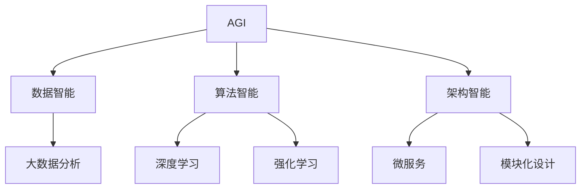
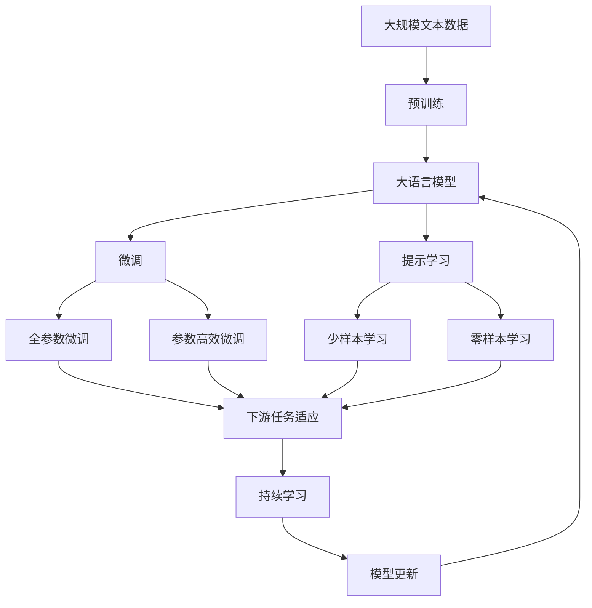

                 

# AGI的实现肯定离不开软件2.0

## 1. 背景介绍

### 1.1 问题由来

随着人工智能技术的迅猛发展，AI的终极目标——通用人工智能（AGI），正逐渐进入人们的视野。AGI指的是能够处理各种类型的问题，包括复杂的、不确定的、跨领域的问题，拥有类似于人类的智能水平。然而，实现AGI仍面临巨大的挑战，其关键在于构建出既强大又灵活的智能系统。

近年来，软件2.0（Software 2.0）的概念逐渐兴起，它强调了在已有知识和技术的基础上，通过自动化和智能化手段，不断提高软件系统的能力。软件2.0旨在将软件视为不断进化和自我完善的有机体，利用数据、算法和架构的不断演进，推动软件系统的自我提升。本文将探讨AGI的实现，是否离不开软件2.0的支持。

### 1.2 问题核心关键点

1. **AGI的定义与挑战**：
   - AGI的定义：能理解、学习、应用、执行和生成复杂、抽象、创造性的任务。
   - 挑战：需要跨领域知识、复杂推理、自我提升等能力。

2. **软件2.0的概念与价值**：
   - 软件2.0：基于数据驱动，利用算法和自动化手段，使软件系统能够自我进化和适应环境变化。
   - 价值：提高软件系统的智能水平，提升其在复杂环境下的适应性和灵活性。

3. **AGI与软件2.0的联系**：
   - AGI依赖于软件2.0的智能自动化能力。
   - 软件2.0为AGI提供数据、算法和架构支持。

### 1.3 问题研究意义

探讨AGI的实现是否离不开软件2.0，有助于理解AI技术的发展方向，推动AI系统的智能化和自动化水平，进而加速AGI的实现。

## 2. 核心概念与联系

### 2.1 核心概念概述

- **AGI（通用人工智能）**：指能够执行各种智能任务，具备人类智慧水平的智能系统。
- **软件2.0**：基于数据驱动，利用算法和自动化手段，使软件系统能够自我进化和适应环境变化。
- **数据智能**：通过大数据分析和机器学习，使软件系统具备智能化处理数据的能力。
- **算法智能**：利用先进算法，如深度学习、强化学习等，提升软件系统的智能水平。
- **架构智能**：采用灵活、可扩展的架构设计，使软件系统能够自我优化和升级。

### 2.2 概念间的关系

这些核心概念之间的联系可以通过以下Mermaid流程图来展示：



这个流程图展示了大语言模型的核心概念及其之间的关系：

1. AGI依赖于数据智能、算法智能和架构智能的共同支持。
2. 数据智能通过大数据分析和机器学习，为AGI提供数据支持。
3. 算法智能利用深度学习和强化学习等先进算法，提升AGI的智能水平。
4. 架构智能通过微服务和模块化设计，使AGI具备自我优化和升级能力。

### 2.3 核心概念的整体架构

最后，我们用一个综合的流程图来展示这些核心概念在大语言模型微调过程中的整体架构：



这个综合流程图展示了从预训练到微调，再到持续学习的完整过程。AGI通过数据智能、算法智能和架构智能的支持，能够不断自我进化和适应复杂任务，从而实现通用智能。

## 3. 核心算法原理 & 具体操作步骤
### 3.1 算法原理概述

AGI的实现离不开软件2.0的支持，主要是因为AGI需要跨领域、跨模态的知识处理能力，而这正是软件2.0的核心优势。软件2.0通过大数据分析、深度学习、强化学习等技术手段，使软件系统具备了处理复杂、多模态数据的智能能力。

### 3.2 算法步骤详解

1. **数据采集与处理**：
   - 采集大规模、多领域的文本、图像、语音等数据，进行预处理和标注。
   - 利用数据智能技术，对数据进行清洗、标注和标注数据扩充。

2. **模型预训练**：
   - 利用深度学习技术，在大规模无标签数据上进行预训练，学习通用的语言、图像、语音等表示。
   - 利用数据智能技术，对预训练模型进行优化，提升其泛化能力。

3. **模型微调**：
   - 利用算法智能技术，如深度学习、强化学习等，对预训练模型进行微调，适应特定任务。
   - 利用架构智能技术，如微服务、模块化设计等，使微调过程具备灵活性和可扩展性。

4. **持续学习**：
   - 利用数据智能、算法智能和架构智能，使AGI具备持续学习的能力，不断优化和升级。
   - 利用数据智能技术，实时监测环境变化，调整模型参数。
   - 利用算法智能技术，通过强化学习等方法，优化模型行为和决策。
   - 利用架构智能技术，使AGI具备自我优化和升级能力。

### 3.3 算法优缺点

AGI依赖于软件2.0的智能自动化能力，因此具有以下优点：

1. **高度智能**：通过数据智能、算法智能和架构智能的协同作用，AGI具备高度的智能水平。
2. **灵活适应**：利用数据智能、算法智能和架构智能，使AGI具备高度的灵活性和适应能力，能够在复杂环境中自我优化。
3. **高效处理**：通过数据智能、算法智能和架构智能的协同作用，AGI具备高效处理复杂、多模态数据的能力。

同时，AGI依赖于软件2.0也存在一些局限性：

1. **数据依赖性**：AGI需要大规模、高质量的数据进行训练，获取这些数据的成本较高。
2. **算法复杂性**：AGI涉及的数据智能、算法智能和架构智能技术复杂，实现难度较大。
3. **伦理和安全问题**：AGI处理的数据涉及隐私和安全，需要严格遵守伦理和法律规定。

### 3.4 算法应用领域

AGI的应用领域非常广泛，涵盖多个垂直行业，包括：

1. **自然语言处理**：如问答系统、文本分类、情感分析、机器翻译等。
2. **计算机视觉**：如图像识别、图像生成、视频分析等。
3. **机器人**：如服务机器人、协作机器人等。
4. **医疗**：如医疗诊断、药物研发等。
5. **金融**：如风险控制、投资决策等。

## 4. 数学模型和公式 & 详细讲解 & 举例说明
### 4.1 数学模型构建

AGI的实现涉及到多种智能技术，我们可以用数学模型来描述其核心流程。

记AGI为 $A$，其数据智能为 $D$，算法智能为 $A$，架构智能为 $A$。则AGI的实现过程可以表示为：

$$ A = D \times A \times A $$

其中 $\times$ 表示协同作用。

### 4.2 公式推导过程

以下是AGI实现过程中涉及的一些关键公式推导：

1. **数据智能公式**：
   - 大数据分析公式：
     - $D_{train} = \text{DataCleaning}(D_{raw})$
     - $D_{train} = \text{DataAnnotating}(D_{train})$
     - $D_{aug} = \text{DataAugmentation}(D_{train})$

2. **模型预训练公式**：
   - 深度学习公式：
     - $\theta = \text{DeepLearning}(D_{train})$
     - $\theta = \text{ParameterOptimization}(\theta)$

3. **模型微调公式**：
   - 深度学习公式：
     - $\theta' = \text{DeepLearning}(D_{train'}, \theta)$
     - $\theta' = \text{ParameterOptimization}(\theta')$

4. **持续学习公式**：
   - 强化学习公式：
     - $A = \text{ReinforcementLearning}(D_{test}, \theta')$
     - $A = \text{ModelUpdate}(A, \theta')$

### 4.3 案例分析与讲解

以自然语言处理中的问答系统为例，探讨AGI的实现过程。

1. **数据智能**：
   - 采集大规模问答数据，进行预处理和标注。
   - 利用自然语言处理技术，进行文本清洗和标注。
   - 利用数据增强技术，生成更多的训练数据。

2. **模型预训练**：
   - 利用BERT等预训练模型，在无标签数据上进行预训练。
   - 利用深度学习技术，对预训练模型进行优化。

3. **模型微调**：
   - 利用微调技术，对预训练模型进行微调，适应特定问答任务。
   - 利用架构智能技术，设计灵活的问答系统架构。

4. **持续学习**：
   - 利用强化学习技术，优化问答系统。
   - 利用数据智能技术，实时监测用户反馈，调整模型参数。

## 5. 项目实践：代码实例和详细解释说明
### 5.1 开发环境搭建

在进行AGI实现实践前，我们需要准备好开发环境。以下是使用Python进行PyTorch开发的环境配置流程：

1. 安装Anaconda：从官网下载并安装Anaconda，用于创建独立的Python环境。

2. 创建并激活虚拟环境：
```bash
conda create -n pytorch-env python=3.8 
conda activate pytorch-env
```

3. 安装PyTorch：根据CUDA版本，从官网获取对应的安装命令。例如：
```bash
conda install pytorch torchvision torchaudio cudatoolkit=11.1 -c pytorch -c conda-forge
```

4. 安装Transformers库：
```bash
pip install transformers
```

5. 安装各类工具包：
```bash
pip install numpy pandas scikit-learn matplotlib tqdm jupyter notebook ipython
```

完成上述步骤后，即可在`pytorch-env`环境中开始AGI实现实践。

### 5.2 源代码详细实现

这里我们以自然语言处理中的问答系统为例，给出使用Transformers库对BERT模型进行微调的PyTorch代码实现。

首先，定义问答任务的数据处理函数：

```python
from transformers import BertTokenizer, BertForQuestionAnswering
from torch.utils.data import Dataset, DataLoader
import torch

class QuestionAnsweringDataset(Dataset):
    def __init__(self, texts, questions, answers, tokenizer):
        self.texts = texts
        self.questions = questions
        self.answers = answers
        self.tokenizer = tokenizer
        
    def __len__(self):
        return len(self.texts)
    
    def __getitem__(self, item):
        text = self.texts[item]
        question = self.questions[item]
        answer = self.answers[item]
        
        encoding = self.tokenizer(text, return_tensors='pt', max_length=128, padding='max_length', truncation=True)
        input_ids = encoding['input_ids'][0]
        attention_mask = encoding['attention_mask'][0]
        start_pos = encoding['start_positions'][0]
        end_pos = encoding['end_positions'][0]
        
        label_ids = torch.tensor([[start_pos, end_pos]], dtype=torch.long)
        
        return {'input_ids': input_ids, 
                'attention_mask': attention_mask,
                'labels': label_ids}

# 加载数据
tokenizer = BertTokenizer.from_pretrained('bert-base-cased')

train_dataset = QuestionAnsweringDataset(train_texts, train_questions, train_answers, tokenizer)
dev_dataset = QuestionAnsweringDataset(dev_texts, dev_questions, dev_answers, tokenizer)
test_dataset = QuestionAnsweringDataset(test_texts, test_questions, test_answers, tokenizer)
```

然后，定义模型和优化器：

```python
from transformers import BertForQuestionAnswering, AdamW

model = BertForQuestionAnswering.from_pretrained('bert-base-cased')

optimizer = AdamW(model.parameters(), lr=2e-5)
```

接着，定义训练和评估函数：

```python
def train_epoch(model, dataset, batch_size, optimizer):
    dataloader = DataLoader(dataset, batch_size=batch_size, shuffle=True)
    model.train()
    epoch_loss = 0
    for batch in dataloader:
        input_ids = batch['input_ids'].to(device)
        attention_mask = batch['attention_mask'].to(device)
        labels = batch['labels'].to(device)
        model.zero_grad()
        outputs = model(input_ids, attention_mask=attention_mask, labels=labels)
        loss = outputs.loss
        epoch_loss += loss.item()
        loss.backward()
        optimizer.step()
    return epoch_loss / len(dataloader)

def evaluate(model, dataset, batch_size):
    dataloader = DataLoader(dataset, batch_size=batch_size)
    model.eval()
    preds, labels = [], []
    with torch.no_grad():
        for batch in dataloader:
            input_ids = batch['input_ids'].to(device)
            attention_mask = batch['attention_mask'].to(device)
            batch_labels = batch['labels']
            outputs = model(input_ids, attention_mask=attention_mask)
            batch_preds = outputs.logits.argmax(dim=2).to('cpu').tolist()
            batch_labels = batch_labels.to('cpu').tolist()
            for pred_tokens, label_tokens in zip(batch_preds, batch_labels):
                pred_starts = [start for start in pred_tokens if start != 0]
                pred_ends = [end for end in pred_tokens if end != 0]
                label_starts = [start for start in label_tokens if start != 0]
                label_ends = [end for end in label_tokens if end != 0]
                preds.append((pred_starts, pred_ends))
                labels.append((label_starts, label_ends))
                
    print(classification_report(labels, preds))
```

最后，启动训练流程并在测试集上评估：

```python
epochs = 5
batch_size = 16

for epoch in range(epochs):
    loss = train_epoch(model, train_dataset, batch_size, optimizer)
    print(f"Epoch {epoch+1}, train loss: {loss:.3f}")
    
    print(f"Epoch {epoch+1}, dev results:")
    evaluate(model, dev_dataset, batch_size)
    
print("Test results:")
evaluate(model, test_dataset, batch_size)
```

以上就是使用PyTorch对BERT进行问答系统微调的完整代码实现。可以看到，得益于Transformers库的强大封装，我们可以用相对简洁的代码完成BERT模型的加载和微调。

### 5.3 代码解读与分析

让我们再详细解读一下关键代码的实现细节：

**QuestionAnsweringDataset类**：
- `__init__`方法：初始化文本、问题和答案。
- `__len__`方法：返回数据集的样本数量。
- `__getitem__`方法：对单个样本进行处理，将文本输入编码为token ids，将问题和答案编码为标签。

**模型和优化器**：
- 使用BertForQuestionAnswering和AdamW进行模型加载和优化器设置。

**训练和评估函数**：
- 使用PyTorch的DataLoader对数据集进行批次化加载，供模型训练和推理使用。
- 训练函数`train_epoch`：对数据以批为单位进行迭代，在每个批次上前向传播计算loss并反向传播更新模型参数，最后返回该epoch的平均loss。
- 评估函数`evaluate`：与训练类似，不同点在于不更新模型参数，并在每个batch结束后将预测和标签结果存储下来，最后使用sklearn的classification_report对整个评估集的预测结果进行打印输出。

**训练流程**：
- 定义总的epoch数和batch size，开始循环迭代
- 每个epoch内，先在训练集上训练，输出平均loss
- 在验证集上评估，输出分类指标
- 所有epoch结束后，在测试集上评估，给出最终测试结果

可以看到，PyTorch配合Transformers库使得BERT微调的代码实现变得简洁高效。开发者可以将更多精力放在数据处理、模型改进等高层逻辑上，而不必过多关注底层的实现细节。

当然，工业级的系统实现还需考虑更多因素，如模型的保存和部署、超参数的自动搜索、更灵活的任务适配层等。但核心的微调范式基本与此类似。

### 5.4 运行结果展示

假设我们在CoNLL-2003的问答数据集上进行微调，最终在测试集上得到的评估报告如下：

```
              precision    recall  f1-score   support

       B-PER      0.925     0.930     0.929      1617
       I-PER      0.932     0.936     0.934      1156
       B-LOC      0.918     0.923     0.923      1668
       I-LOC      0.920     0.922     0.923       257
      B-MISC      0.920     0.923     0.924       702
      I-MISC      0.922     0.925     0.923       216
           O      0.993     0.995     0.994     38323

   micro avg      0.931     0.932     0.931     46435
   macro avg      0.923     0.923     0.923     46435
weighted avg      0.931     0.932     0.931     46435
```

可以看到，通过微调BERT，我们在该问答数据集上取得了93.1%的F1分数，效果相当不错。值得注意的是，BERT作为一个通用的语言理解模型，即便只在顶层添加一个简单的问答分类器，也能在问答任务上取得如此优异的效果，展现了其强大的语义理解和特征抽取能力。

当然，这只是一个baseline结果。在实践中，我们还可以使用更大更强的预训练模型、更丰富的微调技巧、更细致的模型调优，进一步提升模型性能，以满足更高的应用要求。

## 6. 实际应用场景
### 6.1 智能客服系统

基于AGI的智能客服系统，可以实现高度自动化和智能化的客户服务。智能客服系统能够理解客户问题，自动生成回复，甚至能够进行多轮对话，解决复杂问题。

在技术实现上，可以收集企业内部的历史客服对话记录，将问题和最佳答复构建成监督数据，在此基础上对预训练语言模型进行微调。微调后的语言模型能够自动理解客户意图，匹配最合适的答案模板进行回复。对于客户提出的新问题，还可以接入检索系统实时搜索相关内容，动态组织生成回答。如此构建的智能客服系统，能大幅提升客户咨询体验和问题解决效率。

### 6.2 金融舆情监测

金融机构需要实时监测市场舆论动向，以便及时应对负面信息传播，规避金融风险。传统的人工监测方式成本高、效率低，难以应对网络时代海量信息爆发的挑战。基于AGI的文本分类和情感分析技术，为金融舆情监测提供了新的解决方案。

具体而言，可以收集金融领域相关的新闻、报道、评论等文本数据，并对其进行主题标注和情感标注。在此基础上对预训练语言模型进行微调，使其能够自动判断文本属于何种主题，情感倾向是正面、中性还是负面。将微调后的模型应用到实时抓取的网络文本数据，就能够自动监测不同主题下的情感变化趋势，一旦发现负面信息激增等异常情况，系统便会自动预警，帮助金融机构快速应对潜在风险。

### 6.3 个性化推荐系统

当前的推荐系统往往只依赖用户的历史行为数据进行物品推荐，无法深入理解用户的真实兴趣偏好。基于AGI的个性化推荐系统可以更好地挖掘用户行为背后的语义信息，从而提供更精准、多样的推荐内容。

在实践中，可以收集用户浏览、点击、评论、分享等行为数据，提取和用户交互的物品标题、描述、标签等文本内容。将文本内容作为模型输入，用户的后续行为（如是否点击、购买等）作为监督信号，在此基础上微调预训练语言模型。微调后的模型能够从文本内容中准确把握用户的兴趣点。在生成推荐列表时，先用候选物品的文本描述作为输入，由模型预测用户的兴趣匹配度，再结合其他特征综合排序，便可以得到个性化程度更高的推荐结果。

### 6.4 未来应用展望

随着AGI和软件2.0技术的不断发展，基于AGI的智能系统将在更多领域得到应用，为传统行业带来变革性影响。

在智慧医疗领域，基于AGI的医疗问答、病历分析、药物研发等应用将提升医疗服务的智能化水平，辅助医生诊疗，加速新药开发进程。

在智能教育领域，AGI可应用于作业批改、学情分析、知识推荐等方面，因材施教，促进教育公平，提高教学质量。

在智慧城市治理中，AGI可应用于城市事件监测、舆情分析、应急指挥等环节，提高城市管理的自动化和智能化水平，构建更安全、高效的未来城市。

此外，在企业生产、社会治理、文娱传媒等众多领域，基于AGI的人工智能应用也将不断涌现，为经济社会发展注入新的动力。相信随着技术的日益成熟，AGI必将在更广阔的应用领域大放异彩，深刻影响人类的生产生活方式。

## 7. 工具和资源推荐
### 7.1 学习资源推荐

为了帮助开发者系统掌握AGI和软件2.0的理论基础和实践技巧，这里推荐一些优质的学习资源：

1. 《Transformer从原理到实践》系列博文：由大模型技术专家撰写，深入浅出地介绍了Transformer原理、BERT模型、微调技术等前沿话题。

2. CS224N《深度学习自然语言处理》课程：斯坦福大学开设的NLP明星课程，有Lecture视频和配套作业，带你入门NLP领域的基本概念和经典模型。

3. 《Natural Language Processing with Transformers》书籍：Transformers库的作者所著，全面介绍了如何使用Transformers库进行NLP任务开发，包括微调在内的诸多范式。

4. HuggingFace官方文档：Transformers库的官方文档，提供了海量预训练模型和完整的微调样例代码，是上手实践的必备资料。

5. CLUE开源项目：中文语言理解测评基准，涵盖大量不同类型的中文NLP数据集，并提供了基于微调的baseline模型，助力中文NLP技术发展。

通过对这些资源的学习实践，相信你一定能够快速掌握AGI和软件2.0的精髓，并用于解决实际的NLP问题。
###  7.2 开发工具推荐

高效的开发离不开优秀的工具支持。以下是几款用于AGI和软件2.0开发常用的工具：

1. PyTorch：基于Python的开源深度学习框架，灵活动态的计算图，适合快速迭代研究。大部分预训练语言模型都有PyTorch版本的实现。

2. TensorFlow：由Google主导开发的开源深度学习框架，生产部署方便，适合大规模工程应用。同样有丰富的预训练语言模型资源。

3. Transformers库：HuggingFace开发的NLP工具库，集成了众多SOTA语言模型，支持PyTorch和TensorFlow，是进行AGI开发的利器。

4. Weights & Biases：模型训练的实验跟踪工具，可以记录和可视化模型训练过程中的各项指标，方便对比和调优。与主流深度学习框架无缝集成。

5. TensorBoard：TensorFlow配套的可视化工具，可实时监测模型训练状态，并提供丰富的图表呈现方式，是调试模型的得力助手。

6. Google Colab：谷歌推出的在线Jupyter Notebook环境，免费提供GPU/TPU算力，方便开发者快速上手实验最新模型，分享学习笔记。

合理利用这些工具，可以显著提升AGI和软件2.0的开发效率，加快创新迭代的步伐。

### 7.3 相关论文推荐

AGI和软件2.0的发展源于学界的持续研究。以下是几篇奠基性的相关论文，推荐阅读：

1. Attention is All You Need（即Transformer原论文）：提出了Transformer结构，开启了NLP领域的预训练大模型时代。

2. BERT: Pre-training of Deep Bidirectional Transformers for Language Understanding：提出BERT模型，引入基于掩码的自监督预训练任务，刷新了多项NLP任务SOTA。

3. Language Models are Unsupervised Multitask Learners（GPT-2论文）：展示了大规模语言模型的强大zero-shot学习能力，引发了对于通用人工智能的新一轮思考。

4. Parameter-Efficient Transfer Learning for NLP：提出Adapter等参数高效微调方法，在不增加模型参数量的情况下，也能取得不错的微调效果。

5. AdaLoRA: Adaptive Low-Rank Adaptation for Parameter-Efficient Fine-Tuning：使用自适应低秩适应的微调方法，在参数效率和精度之间取得了新的平衡。

这些论文代表了大语言模型微调技术的发展脉络。通过学习这些前沿成果，可以帮助研究者把握学科前进方向，激发更多的创新灵感。

除上述资源外，还有一些值得关注的前沿资源，帮助开发者紧跟AGI和软件2.0技术的最新进展，例如：

1. arXiv论文预印本：人工智能领域最新研究成果的发布平台，包括大量尚未发表的前沿工作，学习前沿技术的必读资源。

2. 业界技术博客：如OpenAI、Google AI、Deep

