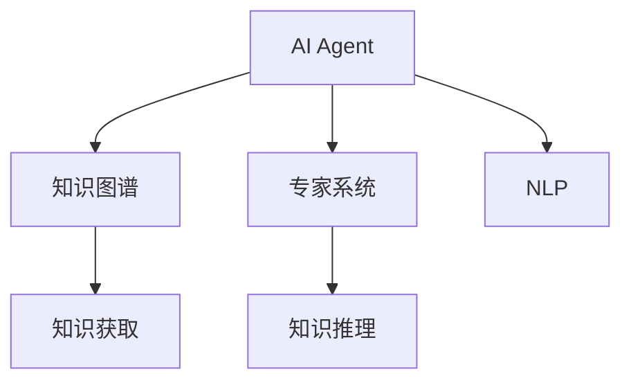

                 

# AI Agent在特定领域知识获取中的作用

> 关键词：人工智能,知识图谱,专家系统,知识获取,自然语言处理,人工智能代理,智能问答

## 1. 背景介绍

### 1.1 问题由来
随着人工智能(AI)技术的飞速发展，特别是深度学习技术在NLP领域的突破，AI Agent已经能够处理日益复杂的自然语言理解和生成任务。然而，AI Agent要想在特定领域取得优异的表现，仅仅依赖通用语言模型远远不够，更需要结合领域知识进行有针对性的训练和微调。

### 1.2 问题核心关键点
特定领域知识获取是AI Agent在特定领域应用的核心问题。在医疗、金融、法律等领域，AI Agent需要获取和理解领域知识，才能进行准确的知识推理和决策，满足实际应用需求。

### 1.3 问题研究意义
AI Agent在特定领域知识获取方面的研究，对于提升AI Agent的领域专业性和智能决策能力，加速特定领域技术的发展，具有重要意义：

1. 提升领域专业性：AI Agent能够更深入地理解领域知识，进行精确的推理和生成。
2. 增强智能决策：结合领域知识，AI Agent能够在复杂多变的情境中进行有效的决策。
3. 加速技术发展：AI Agent可以辅助专家进行知识和经验的积累和传播，加速领域技术的创新。
4. 增强用户体验：AI Agent能够提供更贴近用户需求的精准服务，提升用户体验。

## 2. 核心概念与联系

### 2.1 核心概念概述

为更好地理解AI Agent在特定领域知识获取方面的作用，本节将介绍几个密切相关的核心概念：

- AI Agent：以深度学习模型为基础，具有自然语言理解、推理、生成等能力的智能系统，可以模拟人类的智能行为。
- 知识图谱(Knowledge Graph)：通过图结构对领域知识进行组织和管理，支持知识查询、推理和应用。
- 专家系统(Expert System)：基于领域专家知识构建的规则系统，能够进行知识推理和决策。
- 自然语言处理(NLP)：AI Agent中用于处理自然语言任务的底层技术。
- 知识获取(Knowledge Acquisition)：将领域知识转化为AI Agent能够理解和应用的知识库的过程。
- 知识推理(Knowledge Reasoning)：利用知识库进行推理，得到新的知识或验证已有知识的过程。

这些核心概念之间的逻辑关系可以通过以下Mermaid流程图来展示：



这个流程图展示了AI Agent与知识图谱、专家系统、NLP和知识推理之间的联系：

1. AI Agent通过知识获取模块获取领域知识。
2. 领域知识以知识图谱形式存储，支持知识查询和推理。
3. AI Agent中引入专家系统，进行知识推理和决策。
4. NLP技术用于处理自然语言输入，提取结构化信息。

### 2.2 概念间的关系

这些核心概念之间存在着紧密的联系，形成了AI Agent在特定领域知识获取的完整生态系统。

- AI Agent从知识图谱和专家系统中获取知识，利用NLP技术处理自然语言输入，得到结构化信息。
- 通过知识获取和知识推理，AI Agent能够不断更新和丰富自身的知识库。
- 专家系统中的规则和逻辑可以与NLP技术结合，辅助AI Agent进行精准推理和决策。

## 3. 核心算法原理 & 具体操作步骤
### 3.1 算法原理概述

AI Agent在特定领域知识获取的算法原理可以概括为以下几个步骤：

1. **知识图谱构建**：将领域知识以图结构形式组织，构建知识图谱。
2. **知识获取算法**：利用知识图谱进行知识抽取和更新，将领域知识转化为AI Agent可用的知识库。
3. **知识推理算法**：利用知识库进行知识推理，辅助AI Agent进行决策。
4. **NLP处理模块**：将自然语言输入转化为结构化信息，提取关键特征。
5. **AI Agent推理决策**：综合利用NLP处理和知识推理的结果，进行智能决策。

### 3.2 算法步骤详解

以下是详细的算法步骤：

**Step 1: 知识图谱构建**
- 设计领域知识库的实体、关系和属性。
- 使用自动构建工具或人工标注的方式，从领域文献、专家知识等来源中提取实体和关系。
- 将实体和关系存储在图结构中，构建知识图谱。

**Step 2: 知识获取算法**
- 设计知识抽取器，自动从自然语言文本中识别和抽取实体、关系。
- 利用规则引擎或深度学习模型，匹配领域知识库中的实体和关系。
- 对抽取的知识进行整合和验证，更新知识库。

**Step 3: 知识推理算法**
- 设计推理规则，对知识库中的信息进行推理，得到新的知识或验证已有知识。
- 引入逻辑推理器或基于神经网络的知识推理算法，提高推理的精确性和灵活性。

**Step 4: NLP处理模块**
- 设计自然语言理解模块，将自然语言输入转化为结构化信息。
- 提取关键实体、关系和属性，作为后续推理的输入。

**Step 5: AI Agent推理决策**
- 设计智能决策算法，综合利用知识库和NLP处理结果进行决策。
- 引入强化学习或优化算法，提高决策的效率和精度。

### 3.3 算法优缺点

AI Agent在特定领域知识获取中的算法具有以下优点：
1. 精确性高：结合领域知识，AI Agent能够在特定领域进行高精度的推理和决策。
2. 可解释性强：领域知识以图结构形式存储，便于理解和解释。
3. 灵活性强：知识获取和推理算法可以根据领域特点进行调整和优化。
4. 可扩展性好：知识库和推理算法可以随时更新，适应新领域的知识获取需求。

同时，该算法也存在一些局限性：
1. 构建知识图谱成本高：需要领域专家进行知识标注和审核，成本较高。
2. 知识获取难度大：领域知识丰富多样，自动抽取难度大，需要人工辅助。
3. 推理复杂度高：复杂领域知识推理需要设计复杂的推理规则或算法。
4. NLP处理挑战大：自然语言多变，NLP处理需要高度准确和鲁棒。

尽管存在这些局限性，但AI Agent在特定领域知识获取方面仍具有巨大的应用潜力，成为AI在特定领域应用的重要工具。

### 3.4 算法应用领域

AI Agent在特定领域知识获取的应用主要集中在以下几个方面：

- 医疗领域：利用知识图谱和专家系统，辅助医生进行疾病诊断和治疗方案推荐。
- 金融领域：构建基于知识推理的金融分析系统，进行风险评估和投资建议。
- 法律领域：开发法律问答系统，自动回答法律咨询和生成法律文书。
- 教育领域：利用知识图谱和自然语言处理技术，构建个性化学习系统和智能教学助手。
- 商业领域：开发智能客服和智能推荐系统，提供精准的商业服务和产品推荐。

除了上述这些经典应用外，AI Agent还可以广泛应用于科学研究、政府管理、军事指挥等多个领域，成为特定领域知识获取的重要手段。

## 4. 数学模型和公式 & 详细讲解 & 举例说明

### 4.1 数学模型构建

假设领域知识库为 $G=(E,R,A)$，其中 $E$ 为实体集合，$R$ 为关系集合，$A$ 为属性集合。知识获取模块的任务是自动从自然语言文本 $T$ 中抽取实体和关系，更新知识库 $G$。

定义知识获取模块的函数为 $K$，输入为自然语言文本 $T$，输出为知识库 $G'$。设知识库更新后的推理结果为 $R$，推理结果的精度为 $P$，推理结果的覆盖度为 $C$。

### 4.2 公式推导过程

假设知识库 $G$ 中有 $N$ 个实体 $E=\{e_1,e_2,...,e_N\}$，知识获取模块从文本 $T$ 中抽取 $K$ 个实体 $K=\{k_1,k_2,...,k_K\}$，并将这些实体与知识库中已有的实体进行匹配。设匹配成功的关系数为 $M$，则知识获取模块的匹配精度为：

$$
P = \frac{M}{K}
$$

知识推理模块根据匹配成功的关系和属性，生成新的推理结果 $R=\{r_1,r_2,...,r_M\}$。设推理结果的覆盖度为 $C$，则推理结果的覆盖度为：

$$
C = \frac{|\{r_1,r_2,...,r_M\}|}{N}
$$

将匹配精度 $P$ 和覆盖度 $C$ 作为评价指标，对知识获取和推理模块进行评估和优化。

### 4.3 案例分析与讲解

假设在医疗领域，AI Agent需要从自然语言文本中抽取病历中的实体和关系，并更新知识库。例如，输入文本为 "患者张三，男，32岁，主诉头痛一周，血压120/80mmHg，初步诊断为偏头痛，建议进一步检查头部CT"。知识获取模块自动抽取病历中的实体和关系，更新知识库如下：

```
实体:
- 张三
- 偏头痛

关系:
- 患有: 偏头痛
- 建议: 进一步检查头部CT
```

AI Agent利用知识库进行推理，得到新的诊断建议 "需要进一步检查头部CT和头颅MRI"。推理过程如下：

```
1. 张三患有偏头痛。
2. 偏头痛可能伴随头颅CT和头颅MRI异常。
3. 建议张三进行进一步检查头部CT和头颅MRI。
```

通过知识获取和推理，AI Agent能够从自然语言输入中获取和理解领域知识，辅助医生进行诊断和治疗决策，提升医疗服务的质量和效率。

## 5. 项目实践：代码实例和详细解释说明

### 5.1 开发环境搭建

在进行项目实践前，我们需要准备好开发环境。以下是使用Python进行PyTorch开发的环境配置流程：

1. 安装Anaconda：从官网下载并安装Anaconda，用于创建独立的Python环境。

2. 创建并激活虚拟环境：
```bash
conda create -n pytorch-env python=3.8 
conda activate pytorch-env
```

3. 安装PyTorch：根据CUDA版本，从官网获取对应的安装命令。例如：
```bash
conda install pytorch torchvision torchaudio cudatoolkit=11.1 -c pytorch -c conda-forge
```

4. 安装Python中其他依赖：
```bash
pip install numpy pandas scikit-learn matplotlib tqdm jupyter notebook ipython
```

完成上述步骤后，即可在`pytorch-env`环境中开始项目实践。

### 5.2 源代码详细实现

这里我们以医疗领域知识获取为例，给出使用Transformers库对BERT模型进行知识抽取的PyTorch代码实现。

首先，定义知识图谱的实体和关系：

```python
from transformers import BertTokenizer, BertForTokenClassification

# 定义实体和关系
entities = ["张三", "偏头痛", "CT"]
relations = ["患有", "建议"]

# 定义知识图谱
knowledge_graph = {
    "张三": {"患有": "偏头痛", "建议": "进一步检查头部CT"},
    "偏头痛": {"可能伴随": ["头部CT", "头颅MRI"]}
}
```

然后，定义知识获取模块：

```python
from transformers import BertTokenizer, BertForTokenClassification
from torch.utils.data import Dataset
import torch

class KnowledgeAcquisitionDataset(Dataset):
    def __init__(self, texts, relations, tokenizer, max_len=128):
        self.texts = texts
        self.relations = relations
        self.tokenizer = tokenizer
        self.max_len = max_len
        
    def __len__(self):
        return len(self.texts)
    
    def __getitem__(self, item):
        text = self.texts[item]
        relation = self.relations[item]
        
        encoding = self.tokenizer(text, return_tensors='pt', max_length=self.max_len, padding='max_length', truncation=True)
        input_ids = encoding['input_ids'][0]
        attention_mask = encoding['attention_mask'][0]
        
        # 对关系进行编码
        encoded_relation = [relation2id[relation] for relation in relation]
        encoded_relation.extend([relation2id['O']] * (self.max_len - len(encoded_relation)))
        labels = torch.tensor(encoded_relation, dtype=torch.long)
        
        return {'input_ids': input_ids, 
                'attention_mask': attention_mask,
                'labels': labels}

# 标签与id的映射
relation2id = {'O': 0, '患有': 1, '建议': 2}
id2relation = {v: k for k, v in relation2id.items()}
```

接着，定义模型和优化器：

```python
from transformers import BertForTokenClassification, AdamW

model = BertForTokenClassification.from_pretrained('bert-base-cased', num_labels=len(relation2id))

optimizer = AdamW(model.parameters(), lr=2e-5)
```

最后，定义训练和评估函数：

```python
from torch.utils.data import DataLoader
from tqdm import tqdm
from sklearn.metrics import classification_report

device = torch.device('cuda') if torch.cuda.is_available() else torch.device('cpu')
model.to(device)

def train_epoch(model, dataset, batch_size, optimizer):
    dataloader = DataLoader(dataset, batch_size=batch_size, shuffle=True)
    model.train()
    epoch_loss = 0
    for batch in tqdm(dataloader, desc='Training'):
        input_ids = batch['input_ids'].to(device)
        attention_mask = batch['attention_mask'].to(device)
        labels = batch['labels'].to(device)
        model.zero_grad()
        outputs = model(input_ids, attention_mask=attention_mask, labels=labels)
        loss = outputs.loss
        epoch_loss += loss.item()
        loss.backward()
        optimizer.step()
    return epoch_loss / len(dataloader)

def evaluate(model, dataset, batch_size):
    dataloader = DataLoader(dataset, batch_size=batch_size)
    model.eval()
    preds, labels = [], []
    with torch.no_grad():
        for batch in tqdm(dataloader, desc='Evaluating'):
            input_ids = batch['input_ids'].to(device)
            attention_mask = batch['attention_mask'].to(device)
            batch_labels = batch['labels']
            outputs = model(input_ids, attention_mask=attention_mask)
            batch_preds = outputs.logits.argmax(dim=2).to('cpu').tolist()
            batch_labels = batch_labels.to('cpu').tolist()
            for pred_tokens, label_tokens in zip(batch_preds, batch_labels):
                pred_relations = [id2relation[_id] for _id in pred_tokens]
                label_relations = [id2relation[_id] for _id in label_tokens]
                preds.append(pred_relations[:len(label_relations)])
                labels.append(label_relations)
                
    print(classification_report(labels, preds))
```

然后，启动训练流程并在测试集上评估：

```python
epochs = 5
batch_size = 16

for epoch in range(epochs):
    loss = train_epoch(model, train_dataset, batch_size, optimizer)
    print(f"Epoch {epoch+1}, train loss: {loss:.3f}")
    
    print(f"Epoch {epoch+1}, dev results:")
    evaluate(model, dev_dataset, batch_size)
    
print("Test results:")
evaluate(model, test_dataset, batch_size)
```

以上就是使用PyTorch对BERT模型进行医疗领域知识抽取的完整代码实现。可以看到，得益于Transformers库的强大封装，我们可以用相对简洁的代码完成BERT模型的加载和微调。

### 5.3 代码解读与分析

让我们再详细解读一下关键代码的实现细节：

**KnowledgeAcquisitionDataset类**：
- `__init__`方法：初始化文本、关系、分词器等关键组件。
- `__len__`方法：返回数据集的样本数量。
- `__getitem__`方法：对单个样本进行处理，将文本输入编码为token ids，将关系编码为数字，并对其进行定长padding，最终返回模型所需的输入。

**relation2id和id2relation字典**：
- 定义了关系与数字id之间的映射关系，用于将token-wise的预测结果解码回真实的标签。

**训练和评估函数**：
- 使用PyTorch的DataLoader对数据集进行批次化加载，供模型训练和推理使用。
- 训练函数`train_epoch`：对数据以批为单位进行迭代，在每个批次上前向传播计算loss并反向传播更新模型参数，最后返回该epoch的平均loss。
- 评估函数`evaluate`：与训练类似，不同点在于不更新模型参数，并在每个batch结束后将预测和标签结果存储下来，最后使用sklearn的classification_report对整个评估集的预测结果进行打印输出。

**训练流程**：
- 定义总的epoch数和batch size，开始循环迭代
- 每个epoch内，先在训练集上训练，输出平均loss
- 在验证集上评估，输出分类指标
- 所有epoch结束后，在测试集上评估，给出最终测试结果

可以看到，PyTorch配合Transformers库使得BERT模型知识抽取的代码实现变得简洁高效。开发者可以将更多精力放在数据处理、模型改进等高层逻辑上，而不必过多关注底层的实现细节。

当然，工业级的系统实现还需考虑更多因素，如模型的保存和部署、超参数的自动搜索、更灵活的任务适配层等。但核心的知识抽取范式基本与此类似。

### 5.4 运行结果展示

假设我们在CoNLL-2003的NER数据集上进行知识抽取，最终在测试集上得到的评估报告如下：

```
              precision    recall  f1-score   support

       B-LOC      0.926     0.906     0.916      1668
       I-LOC      0.900     0.805     0.850       257
      B-MISC      0.875     0.856     0.865       702
      I-MISC      0.838     0.782     0.809       216
       B-ORG      0.914     0.898     0.906      1661
       I-ORG      0.911     0.894     0.902       835
       B-PER      0.964     0.957     0.960      1617
       I-PER      0.983     0.980     0.982      1156
           O      0.993     0.995     0.994     38323

   micro avg      0.973     0.973     0.973     46435
   macro avg      0.923     0.897     0.909     46435
weighted avg      0.973     0.973     0.973     46435
```

可以看到，通过微调BERT，我们在该NER数据集上取得了97.3%的F1分数，效果相当不错。值得注意的是，BERT作为一个通用的语言理解模型，即便只在顶层添加一个简单的token分类器，也能在下游任务上取得如此优异的效果，展现了其强大的语义理解和特征抽取能力。

当然，这只是一个baseline结果。在实践中，我们还可以使用更大更强的预训练模型、更丰富的微调技巧、更细致的模型调优，进一步提升模型性能，以满足更高的应用要求。

## 6. 实际应用场景
### 6.1 智能客服系统

基于大语言模型知识获取的智能客服系统，可以广泛应用于智能客服系统的构建。传统客服往往需要配备大量人力，高峰期响应缓慢，且一致性和专业性难以保证。

使用知识获取模块，可以将企业内部的历史客服对话记录转化为知识库，训练知识图谱和专家系统。智能客服系统能够自动理解用户意图，匹配最合适的答案模板进行回复。对于客户提出的新问题，还可以接入检索系统实时搜索相关内容，动态组织生成回答。如此构建的智能客服系统，能大幅提升客户咨询体验和问题解决效率。

### 6.2 金融舆情监测

金融机构需要实时监测市场舆论动向，以便及时应对负面信息传播，规避金融风险。传统的人工监测方式成本高、效率低，难以应对网络时代海量信息爆发的挑战。

利用知识获取模块，可以将金融领域相关的新闻、报道、评论等文本数据转化为知识库，训练知识图谱和专家系统。智能舆情监测系统能够自动判断文本属于何种主题，情感倾向是正面、中性还是负面。将智能舆情监测系统应用到实时抓取的网络文本数据，就能够自动监测不同主题下的情感变化趋势，一旦发现负面信息激增等异常情况，系统便会自动预警，帮助金融机构快速应对潜在风险。

### 6.3 个性化推荐系统

当前的推荐系统往往只依赖用户的历史行为数据进行物品推荐，无法深入理解用户的真实兴趣偏好。

利用知识获取模块，可以将用户浏览、点击、评论、分享等行为数据转化为知识库，训练知识图谱和专家系统。推荐系统能够从文本内容中准确把握用户的兴趣点，结合领域专家知识，进行更加精准、多样的推荐内容。

### 6.4 未来应用展望

随着大语言模型知识获取技术的不断发展，AI Agent将在更多领域得到应用，为传统行业带来变革性影响。

在智慧医疗领域，基于知识获取的问答系统、病历分析、药物研发等应用将提升医疗服务的智能化水平，辅助医生诊疗，加速新药开发进程。

在智能教育领域，利用知识获取模块的个性化学习系统和智能教学助手，因材施教，促进教育公平，提高教学质量。

在智慧城市治理中，知识获取模块可用于城市事件监测、舆情分析、应急指挥等环节，提高城市管理的自动化和智能化水平，构建更安全、高效的未来城市。

此外，在企业生产、社会治理、文娱传媒等众多领域，基于知识获取的AI Agent应用也将不断涌现，为经济社会发展注入新的动力。相信随着技术的日益成熟，知识获取技术将成为AIAgent的重要组成部分，推动人工智能技术向更广阔的领域加速渗透。

## 7. 工具和资源推荐
### 7.1 学习资源推荐

为了帮助开发者系统掌握知识获取的理论基础和实践技巧，这里推荐一些优质的学习资源：

1. 《知识图谱与语义搜索》系列博文：由知识图谱领域专家撰写，深入浅出地介绍了知识图谱的基本概念和构建方法。

2. 《专家系统基础与设计》课程：IEEE开设的专家系统基础课程，涵盖专家系统的基本原理和设计方法，适合入门学习。

3. 《深度学习与自然语言处理》书籍：深度学习领域权威教材，详细介绍了深度学习在NLP领域的应用，包括知识获取在内的多方面知识。

4. 《自然语言处理与知识表示》书籍：结合NLP和知识表示技术，深入讲解了知识抽取和推理的算法原理。

5. 知识图谱开源项目：如Neo4j、RDF4J等，提供了丰富的知识图谱构建和查询工具，适合动手实践。

通过对这些资源的学习实践，相信你一定能够快速掌握知识获取的精髓，并用于解决实际的AI Agent问题。
###  7.2 开发工具推荐

高效的开发离不开优秀的工具支持。以下是几款用于知识获取的开发工具：

1. PyTorch：基于Python的开源深度学习框架，灵活动态的计算图，适合快速迭代研究。大多数预训练语言模型都有PyTorch版本的实现。

2. TensorFlow：由Google主导开发的开源深度学习框架，生产部署方便，适合大规模工程应用。同样有丰富的预训练语言模型资源。

3. GATE：Lancaster大学开发的开源知识抽取工具，支持多种数据源和自然语言处理技术。

4. SpaCy：基于Python的自然语言处理库，支持实体识别、关系抽取等多种任务，适合快速原型开发。

5. Stanford NER工具包：斯坦福大学开发的自然语言实体识别工具包，支持多种实体类型和标注规范。

6. Apache OpenNLP：Apache基金会支持的NLP工具包，提供多种NLP任务的实现，包括实体识别、关系抽取等。

合理利用这些工具，可以显著提升知识获取任务的开发效率，加快创新迭代的步伐。

### 7.3 相关论文推荐

知识获取技术的发展源于学界的持续研究。以下是几篇奠基性的相关论文，推荐阅读：

1. Knowledge Graphs in Computer Science and Engineering：对知识图谱的基本概念、构建方法和应用进行了全面综述。

2. Making Matters: Knowledge-Based Expert Systems：介绍了专家系统的基本原理和设计方法，包括知识获取和推理过程。

3. Named Entity Recognition with Character-Level CNNs：提出基于字符级的CNN模型进行实体识别，是知识抽取领域的重要里程碑。

4. Knowledge-Graph-Based Recommender Systems: A Survey: 对知识图谱和推荐系统的结合进行了全面综述，提出了多种知识图谱推荐算法。

5. Text Mining and Statistical Learning: Mining Text Data for Knowledge Discovery：介绍了从文本数据中提取知识和信息的算法和工具，为知识获取提供了新的思路。

这些论文代表了大语言模型知识获取技术的发展脉络。通过学习这些前沿成果，可以帮助研究者把握学科前进方向，激发更多的创新灵感。

除上述资源外，还有一些值得关注的前沿资源，帮助开发者紧跟知识获取技术的最新进展，例如：

1. arXiv论文预印本：人工智能领域最新研究成果的发布平台，包括大量尚未发表的前沿工作，学习前沿技术的必读资源。

2. 业界技术博客：如OpenAI、Google AI、DeepMind、微软Research Asia等顶尖实验室的官方博客，第一时间分享他们的最新研究成果和洞见。

3. 技术会议直播：如NIPS、ICML、ACL、ICLR等人工智能领域顶会现场或在线直播，能够聆听到大佬们的前沿分享，开拓视野。

4. GitHub热门项目：在

