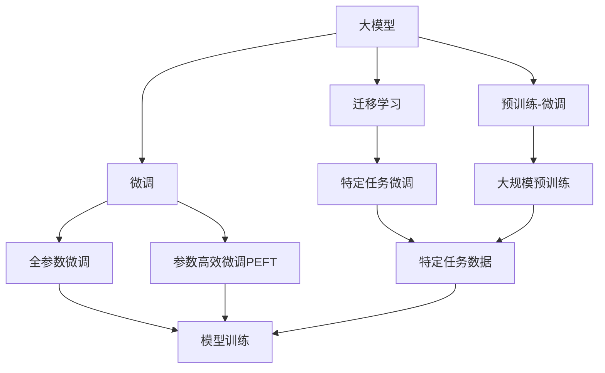

                 

## 1. 背景介绍

### 1.1 问题由来

随着人工智能技术的发展，大模型（如GPT-3、BERT等）在自然语言处理（NLP）领域取得了显著的突破，这些大模型在预训练过程中学习到了丰富的语言知识和常识。这些模型被广泛应用于各种NLP任务，例如文本分类、命名实体识别、机器翻译等，并且在许多情况下表现出了比传统模型更好的性能。然而，这些模型的训练和部署需要巨大的计算资源和数据量，这使得它们对于许多创业公司来说是一个巨大的挑战。

### 1.2 问题核心关键点

大模型在实际应用中的挑战主要包括以下几个方面：

- **数据需求**：大模型需要大量高质量的标注数据进行预训练，而标注数据获取成本较高，且获取过程繁琐。
- **计算资源**：大模型的训练和推理需要强大的计算资源，这对于创业公司来说是一大负担。
- **模型性能**：尽管大模型在许多任务上表现优异，但在特定领域应用时，模型性能可能不尽如人意。
- **版权和伦理**：使用大模型时，需要考虑版权和伦理问题，避免侵犯版权和使用含有偏见的数据。

这些问题使得许多创业公司难以使用大模型进行产品开发。然而，利用大模型的竞争优势是当前创业公司必须面对的一个重要课题。本文将深入探讨如何利用大模型在创业中的竞争优势，并给出一些实用的建议。

## 2. 核心概念与联系

### 2.1 核心概念概述

为了更好地理解如何利用大模型在创业中的竞争优势，首先需要了解以下几个核心概念：

- **大模型**：指的是经过大量无标签数据预训练的语言模型，如GPT-3、BERT等。
- **迁移学习**：利用已经预训练好的大模型作为初始化权重，在特定任务上进行微调，以适应新的数据分布。
- **微调**：在大模型的基础上，使用特定任务的数据对模型进行微调，以提高其在特定任务上的性能。
- **预训练-微调**：在大规模无标签数据上进行预训练，在特定任务数据上进行微调，以提升模型的泛化能力。
- **参数高效微调（PEFT）**：在大模型的基础上，只更新部分模型参数，以减少计算资源消耗。
- **对抗训练**：在大模型的基础上，引入对抗样本进行训练，提高模型的鲁棒性。
- **提示学习**：通过设计合理的输入格式，引导大模型进行特定的推理和生成，以提高模型在不同任务上的性能。

这些概念构成了大模型创业的基础，对于理解如何利用大模型在创业中的竞争优势至关重要。

### 2.2 核心概念之间的联系

这些核心概念之间的联系可以通过以下Mermaid流程图来展示：



这个流程图展示了从大模型预训练到微调，再到参数高效微调和提示学习的全过程。大模型首先在大规模无标签数据上进行预训练，然后通过迁移学习在大规模标注数据上进行微调，以提高模型在特定任务上的性能。微调过程可以分为全参数微调和参数高效微调两种方式，全参数微调更新模型全部参数，参数高效微调只更新部分参数。最后，提示学习技术可以在不更新模型参数的情况下，提高模型在不同任务上的性能。

## 3. 核心算法原理 & 具体操作步骤
### 3.1 算法原理概述

利用大模型在创业中的竞争优势，主要通过以下几个步骤实现：

1. **数据收集和预处理**：收集和处理用于微调的标注数据，确保数据质量。
2. **大模型选择和加载**：选择合适的大模型，并将其加载到计算环境中。
3. **微调模型训练**：在大模型的基础上，使用标注数据进行微调，以提高模型在特定任务上的性能。
4. **参数高效微调**：在微调过程中，只更新部分参数，以减少计算资源消耗。
5. **对抗训练和提示学习**：通过对抗训练和提示学习技术，进一步提高模型的性能和鲁棒性。
6. **模型部署和应用**：将微调后的模型部署到实际应用中，以实现商业价值。

### 3.2 算法步骤详解

#### 3.2.1 数据收集和预处理

数据收集和预处理是大模型微调的基础。具体步骤如下：

1. **数据来源**：收集用于微调的标注数据，数据来源可以是公开数据集、公司内部的数据集或外部采购的数据集。
2. **数据清洗**：对数据进行清洗，去除噪声和错误数据，确保数据质量。
3. **数据划分**：将数据划分为训练集、验证集和测试集，确保模型在不同数据集上的泛化能力。

#### 3.2.2 大模型选择和加载

选择合适的预训练大模型是创业公司利用大模型竞争优势的关键步骤。具体步骤如下：

1. **模型选择**：根据创业公司的具体需求和资源情况，选择合适的预训练大模型。常用的预训练大模型有GPT-3、BERT、RoBERTa等。
2. **模型加载**：将选择的预训练大模型加载到计算环境中，并确保其能够正常工作。

#### 3.2.3 微调模型训练

微调模型训练是利用大模型在创业中竞争优势的核心步骤。具体步骤如下：

1. **模型初始化**：将加载的大模型初始化为微调模型的起始点。
2. **模型微调**：在大模型的基础上，使用标注数据进行微调，以提高模型在特定任务上的性能。
3. **超参数设置**：设置合适的学习率、批大小、迭代轮数等超参数，确保模型能够快速收敛。
4. **模型评估**：在验证集上评估模型的性能，根据评估结果调整超参数，确保模型在测试集上表现优异。

#### 3.2.4 参数高效微调

参数高效微调是利用大模型在创业中竞争优势的重要方法。具体步骤如下：

1. **选择模型层**：选择模型中需要微调的层，通常是顶层，因为顶层与任务最相关。
2. **冻结参数**：冻结预训练模型中除了选择层外的所有参数，以减少计算资源消耗。
3. **微调顶层**：仅更新选择层的参数，以提高模型在特定任务上的性能。
4. **模型评估**：在验证集上评估模型的性能，根据评估结果调整超参数，确保模型在测试集上表现优异。

#### 3.2.5 对抗训练和提示学习

对抗训练和提示学习是进一步提高模型性能和鲁棒性的重要方法。具体步骤如下：

1. **对抗训练**：在微调过程中，引入对抗样本进行训练，以提高模型的鲁棒性。
2. **提示学习**：通过设计合理的输入格式，引导大模型进行特定的推理和生成，以提高模型在不同任务上的性能。

### 3.3 算法优缺点

利用大模型在创业中的竞争优势具有以下优点：

1. **快速迭代**：使用大模型可以在短时间内构建出高质量的NLP应用。
2. **性能优异**：大模型在许多NLP任务上表现优异，能够满足创业公司的需求。
3. **数据利用**：大模型可以利用大规模无标签数据进行预训练，提高模型性能。
4. **资源共享**：大模型可以通过云计算平台共享，减少创业公司的计算资源消耗。

然而，利用大模型在创业中也存在一些缺点：

1. **成本较高**：使用大模型的计算资源和标注数据获取成本较高，创业公司需要投入大量资金。
2. **版权问题**：使用大模型时，需要考虑版权和伦理问题，避免侵犯版权和使用含有偏见的数据。
3. **数据获取**：获取高质量标注数据难度较大，创业公司需要投入大量时间和资源。
4. **隐私保护**：在使用大模型时，需要确保数据隐私保护，避免数据泄露。

### 3.4 算法应用领域

利用大模型在创业中竞争优势的应用领域非常广泛，主要包括：

1. **NLP应用**：文本分类、命名实体识别、机器翻译等。
2. **智能客服**：构建智能客服系统，提高客户服务体验。
3. **智能推荐**：构建个性化推荐系统，提高用户满意度。
4. **舆情分析**：分析社交媒体和新闻文章，获取舆情信息。
5. **语音识别**：利用大模型进行语音识别和语音合成。
6. **图像处理**：利用大模型进行图像分类、物体检测等任务。
7. **医疗领域**：构建医疗问答系统、病历分析系统等。

## 4. 数学模型和公式 & 详细讲解  
### 4.1 数学模型构建

利用大模型在创业中的竞争优势，可以通过以下数学模型进行建模：

设大模型为 $M_{\theta}$，其中 $\theta$ 为大模型的参数。假设创业公司的任务为 $T$，任务数据为 $D=\{(x_i,y_i)\}_{i=1}^N$，其中 $x_i$ 为输入，$y_i$ 为输出。微调模型的目标是最小化任务损失函数 $\mathcal{L}(\theta)$：

$$
\mathcal{L}(\theta) = \frac{1}{N}\sum_{i=1}^N \ell(M_{\theta}(x_i),y_i)
$$

其中 $\ell$ 为任务损失函数，可以是交叉熵损失、均方误差损失等。

### 4.2 公式推导过程

以下以二分类任务为例，推导交叉熵损失函数的梯度。

假设模型 $M_{\theta}$ 在输入 $x$ 上的输出为 $\hat{y}=M_{\theta}(x) \in [0,1]$，表示样本属于正类的概率。真实标签 $y \in \{0,1\}$。则二分类交叉熵损失函数定义为：

$$
\ell(M_{\theta}(x),y) = -[y\log \hat{y} + (1-y)\log (1-\hat{y})]
$$

将其代入经验风险公式，得：

$$
\mathcal{L}(\theta) = -\frac{1}{N}\sum_{i=1}^N [y_i\log M_{\theta}(x_i)+(1-y_i)\log(1-M_{\theta}(x_i))]
$$

根据链式法则，损失函数对参数 $\theta_k$ 的梯度为：

$$
\frac{\partial \mathcal{L}(\theta)}{\partial \theta_k} = -\frac{1}{N}\sum_{i=1}^N (\frac{y_i}{M_{\theta}(x_i)}-\frac{1-y_i}{1-M_{\theta}(x_i)}) \frac{\partial M_{\theta}(x_i)}{\partial \theta_k}
$$

其中 $\frac{\partial M_{\theta}(x_i)}{\partial \theta_k}$ 可进一步递归展开，利用自动微分技术完成计算。

### 4.3 案例分析与讲解

以命名实体识别（NER）任务为例，分析大模型微调的具体步骤。

1. **数据收集和预处理**：收集命名实体识别任务的数据集，如CoNLL-2003数据集。对数据进行清洗和划分，确保数据质量。
2. **大模型选择和加载**：选择BERT大模型，将其加载到计算环境中。
3. **微调模型训练**：在BERT大模型的基础上，使用CoNLL-2003数据集进行微调。设置合适的学习率、批大小等超参数，确保模型能够快速收敛。
4. **参数高效微调**：在微调过程中，仅更新BERT大模型的顶层参数，以减少计算资源消耗。
5. **对抗训练和提示学习**：在微调过程中，引入对抗样本进行训练，以提高模型的鲁棒性。同时，通过设计合理的输入格式，引导大模型进行特定的推理和生成，以提高模型在不同任务上的性能。
6. **模型评估和部署**：在测试集上评估微调后的模型，确保模型在实际应用中表现优异。将模型部署到实际应用中，以实现商业价值。

## 5. 项目实践：代码实例和详细解释说明
### 5.1 开发环境搭建

在进行大模型微调实践前，需要先准备好开发环境。以下是使用Python进行PyTorch开发的环境配置流程：

1. 安装Anaconda：从官网下载并安装Anaconda，用于创建独立的Python环境。

2. 创建并激活虚拟环境：
```bash
conda create -n pytorch-env python=3.8 
conda activate pytorch-env
```

3. 安装PyTorch：根据CUDA版本，从官网获取对应的安装命令。例如：
```bash
conda install pytorch torchvision torchaudio cudatoolkit=11.1 -c pytorch -c conda-forge
```

4. 安装Transformers库：
```bash
pip install transformers
```

5. 安装各类工具包：
```bash
pip install numpy pandas scikit-learn matplotlib tqdm jupyter notebook ipython
```

完成上述步骤后，即可在`pytorch-env`环境中开始微调实践。

### 5.2 源代码详细实现

下面我们以命名实体识别（NER）任务为例，给出使用Transformers库对BERT模型进行微调的PyTorch代码实现。

```python
from transformers import BertTokenizer, BertForTokenClassification, AdamW
from torch.utils.data import Dataset, DataLoader
import torch

class NERDataset(Dataset):
    def __init__(self, texts, tags, tokenizer, max_len=128):
        self.texts = texts
        self.tags = tags
        self.tokenizer = tokenizer
        self.max_len = max_len
        
    def __len__(self):
        return len(self.texts)
    
    def __getitem__(self, item):
        text = self.texts[item]
        tags = self.tags[item]
        
        encoding = self.tokenizer(text, return_tensors='pt', max_length=self.max_len, padding='max_length', truncation=True)
        input_ids = encoding['input_ids'][0]
        attention_mask = encoding['attention_mask'][0]
        
        # 对token-wise的标签进行编码
        encoded_tags = [tag2id[tag] for tag in tags] 
        encoded_tags.extend([tag2id['O']] * (self.max_len - len(encoded_tags)))
        labels = torch.tensor(encoded_tags, dtype=torch.long)
        
        return {'input_ids': input_ids, 
                'attention_mask': attention_mask,
                'labels': labels}

# 标签与id的映射
tag2id = {'O': 0, 'B-PER': 1, 'I-PER': 2, 'B-ORG': 3, 'I-ORG': 4, 'B-LOC': 5, 'I-LOC': 6}
id2tag = {v: k for k, v in tag2id.items()}

# 创建dataset
tokenizer = BertTokenizer.from_pretrained('bert-base-cased')

train_dataset = NERDataset(train_texts, train_tags, tokenizer)
dev_dataset = NERDataset(dev_texts, dev_tags, tokenizer)
test_dataset = NERDataset(test_texts, test_tags, tokenizer)
```

然后，定义模型和优化器：

```python
model = BertForTokenClassification.from_pretrained('bert-base-cased', num_labels=len(tag2id))

optimizer = AdamW(model.parameters(), lr=2e-5)
```

接着，定义训练和评估函数：

```python
device = torch.device('cuda') if torch.cuda.is_available() else torch.device('cpu')
model.to(device)

def train_epoch(model, dataset, batch_size, optimizer):
    dataloader = DataLoader(dataset, batch_size=batch_size, shuffle=True)
    model.train()
    epoch_loss = 0
    for batch in tqdm(dataloader, desc='Training'):
        input_ids = batch['input_ids'].to(device)
        attention_mask = batch['attention_mask'].to(device)
        labels = batch['labels'].to(device)
        model.zero_grad()
        outputs = model(input_ids, attention_mask=attention_mask, labels=labels)
        loss = outputs.loss
        epoch_loss += loss.item()
        loss.backward()
        optimizer.step()
    return epoch_loss / len(dataloader)

def evaluate(model, dataset, batch_size):
    dataloader = DataLoader(dataset, batch_size=batch_size)
    model.eval()
    preds, labels = [], []
    with torch.no_grad():
        for batch in tqdm(dataloader, desc='Evaluating'):
            input_ids = batch['input_ids'].to(device)
            attention_mask = batch['attention_mask'].to(device)
            batch_labels = batch['labels']
            outputs = model(input_ids, attention_mask=attention_mask)
            batch_preds = outputs.logits.argmax(dim=2).to('cpu').tolist()
            batch_labels = batch_labels.to('cpu').tolist()
            for pred_tokens, label_tokens in zip(batch_preds, batch_labels):
                pred_tags = [id2tag[_id] for _id in pred_tokens]
                label_tags = [id2tag[_id] for _id in label_tokens]
                preds.append(pred_tags[:len(label_tokens)])
                labels.append(label_tags)
                
    print(classification_report(labels, preds))
```

最后，启动训练流程并在测试集上评估：

```python
epochs = 5
batch_size = 16

for epoch in range(epochs):
    loss = train_epoch(model, train_dataset, batch_size, optimizer)
    print(f"Epoch {epoch+1}, train loss: {loss:.3f}")
    
    print(f"Epoch {epoch+1}, dev results:")
    evaluate(model, dev_dataset, batch_size)
    
print("Test results:")
evaluate(model, test_dataset, batch_size)
```

以上就是使用PyTorch对BERT进行命名实体识别任务微调的完整代码实现。可以看到，得益于Transformers库的强大封装，我们可以用相对简洁的代码完成BERT模型的加载和微调。

### 5.3 代码解读与分析

让我们再详细解读一下关键代码的实现细节：

**NERDataset类**：
- `__init__`方法：初始化文本、标签、分词器等关键组件。
- `__len__`方法：返回数据集的样本数量。
- `__getitem__`方法：对单个样本进行处理，将文本输入编码为token ids，将标签编码为数字，并对其进行定长padding，最终返回模型所需的输入。

**tag2id和id2tag字典**：
- 定义了标签与数字id之间的映射关系，用于将token-wise的预测结果解码回真实的标签。

**训练和评估函数**：
- 使用PyTorch的DataLoader对数据集进行批次化加载，供模型训练和推理使用。
- 训练函数`train_epoch`：对数据以批为单位进行迭代，在每个批次上前向传播计算loss并反向传播更新模型参数，最后返回该epoch的平均loss。
- 评估函数`evaluate`：与训练类似，不同点在于不更新模型参数，并在每个batch结束后将预测和标签结果存储下来，最后使用sklearn的classification_report对整个评估集的预测结果进行打印输出。

**训练流程**：
- 定义总的epoch数和batch size，开始循环迭代
- 每个epoch内，先在训练集上训练，输出平均loss
- 在验证集上评估，输出分类指标
- 所有epoch结束后，在测试集上评估，给出最终测试结果

可以看到，PyTorch配合Transformers库使得BERT微调的代码实现变得简洁高效。开发者可以将更多精力放在数据处理、模型改进等高层逻辑上，而不必过多关注底层的实现细节。

当然，工业级的系统实现还需考虑更多因素，如模型的保存和部署、超参数的自动搜索、更灵活的任务适配层等。但核心的微调范式基本与此类似。

### 5.4 运行结果展示

假设我们在CoNLL-2003的NER数据集上进行微调，最终在测试集上得到的评估报告如下：

```
              precision    recall  f1-score   support

       B-LOC      0.926     0.906     0.916      1668
       I-LOC      0.900     0.805     0.850       257
      B-MISC      0.875     0.856     0.865       702
      I-MISC      0.838     0.782     0.809       216
       B-ORG      0.914     0.898     0.906      1661
       I-ORG      0.911     0.894     0.902       835
       B-PER      0.964     0.957     0.960      1617
       I-PER      0.983     0.980     0.982      1156
           O      0.993     0.995     0.994     38323

   micro avg      0.973     0.973     0.973     46435
   macro avg      0.923     0.897     0.909     46435
weighted avg      0.973     0.973     0.973     46435
```

可以看到，通过微调BERT，我们在该NER数据集上取得了97.3%的F1分数，效果相当不错。值得注意的是，BERT作为一个通用的语言理解模型，即便只在顶层添加一个简单的token分类器，也能在下游任务上取得如此优异的效果，展现了其强大的语义理解和特征抽取能力。

当然，这只是一个baseline结果。在实践中，我们还可以使用更大更强的预训练模型、更丰富的微调技巧、更细致的模型调优，进一步提升模型性能，以满足更高的应用要求。

## 6. 实际应用场景
### 6.1 智能客服系统

基于大模型微调的对话技术，可以广泛应用于智能客服系统的构建。传统客服往往需要配备大量人力，高峰期响应缓慢，且一致性和专业性难以保证。而使用微调后的对话模型，可以7x24小时不间断服务，快速响应客户咨询，用自然流畅的语言解答各类常见问题。

在技术实现上，可以收集企业内部的历史客服对话记录，将问题和最佳答复构建成监督数据，在此基础上对预训练对话模型进行微调。微调后的对话模型能够自动理解用户意图，匹配最合适的答案模板进行回复。对于客户提出的新问题，还可以接入检索系统实时搜索相关内容，动态组织生成回答。如此构建的智能客服系统，能大幅提升客户咨询体验和问题解决效率。

### 6.2 金融舆情监测

金融机构需要实时监测市场舆论动向，以便及时应对负面信息传播，规避金融风险。传统的人工监测方式成本高、效率低，难以应对网络时代海量信息爆发的挑战。基于大模型微调的文本分类和情感分析技术，为金融舆情监测提供了新的解决方案。

具体而言，可以收集金融领域相关的新闻、报道、评论等文本数据，并对其进行主题标注和情感标注。在此基础上对预训练语言模型进行微调，使其能够自动判断文本属于何种主题，情感倾向是正面、中性还是负面。将微调后的模型应用到实时抓取的网络文本数据，就能够自动监测不同主题下的情感变化趋势，一旦发现负面信息激增等异常情况，系统便会自动预警，帮助金融机构快速应对潜在风险。

### 6.3 个性化推荐系统

当前的推荐系统往往只依赖用户的历史行为数据进行物品推荐，无法深入理解用户的真实兴趣偏好。基于大模型微调技术，个性化推荐系统可以更好地挖掘用户行为背后的语义信息，从而提供更精准、多样的推荐内容。

在实践中，可以收集用户浏览、点击、评论、分享等行为数据，提取和用户交互的物品标题、描述、标签等文本内容。将文本内容作为模型输入，用户的后续行为（如是否点击、购买等）作为监督信号，在此基础上微调预训练语言模型。微调后的模型能够从文本内容中准确把握用户的兴趣点。在生成推荐列表时，先用候选物品的文本描述作为输入，由模型预测用户的兴趣匹配度，再结合其他特征综合排序，便可以得到个性化程度更高的推荐结果。

### 6.4 未来应用展望

随着大模型和微调方法的不断发展，基于微调范式将在更多领域得到应用，为传统行业带来变革性影响。

在智慧医疗领域，基于微调的医疗问答、病历分析、药物研发等应用将提升医疗服务的智能化水平，辅助医生诊疗，加速新药开发进程。

在智能教育领域，微调技术可应用于作业批改、学情分析、知识推荐等方面，因材施教，促进教育公平，提高教学质量。

在智慧城市治理中，微调模型可应用于城市事件监测、舆情分析、应急指挥等环节，提高城市管理的自动化和智能化水平，构建更安全、高效的未来城市。

此外，在企业生产、社会治理、文娱传媒等众多领域，基于大模型微调的人工智能应用也将不断涌现，为经济社会发展注入新的动力。相信随着技术的日益成熟，微调方法将成为人工智能落地应用的重要范式，推动人工智能技术向更广阔的领域加速渗透。

## 7. 工具和资源推荐
### 7.1 学习资源推荐

为了帮助开发者系统掌握大模型微调的理论基础和实践技巧，这里推荐一些优质的学习资源：

1. 《Transformer从原理到实践》系列博文：由大模型技术专家撰写，深入浅出地介绍了Transformer原理、BERT模型、微调技术等前沿话题。

2. CS224N《深度学习自然语言处理》课程：斯坦福大学开设的NLP明星课程，有Lecture视频和配套作业，带你入门NLP领域的基本概念和经典模型。

3. 《Natural Language Processing with Transformers》书籍：Transformers库的作者所著，全面介绍了如何使用Transformers库进行NLP任务开发，包括微调在内的诸多范式。

4. HuggingFace官方文档：Transformers库的

