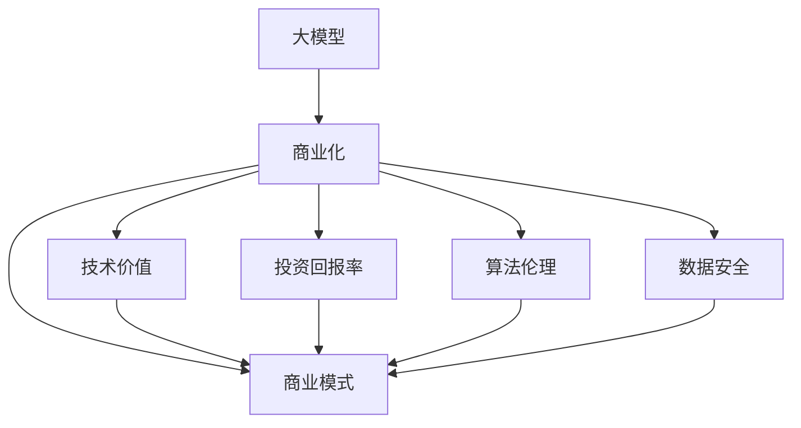
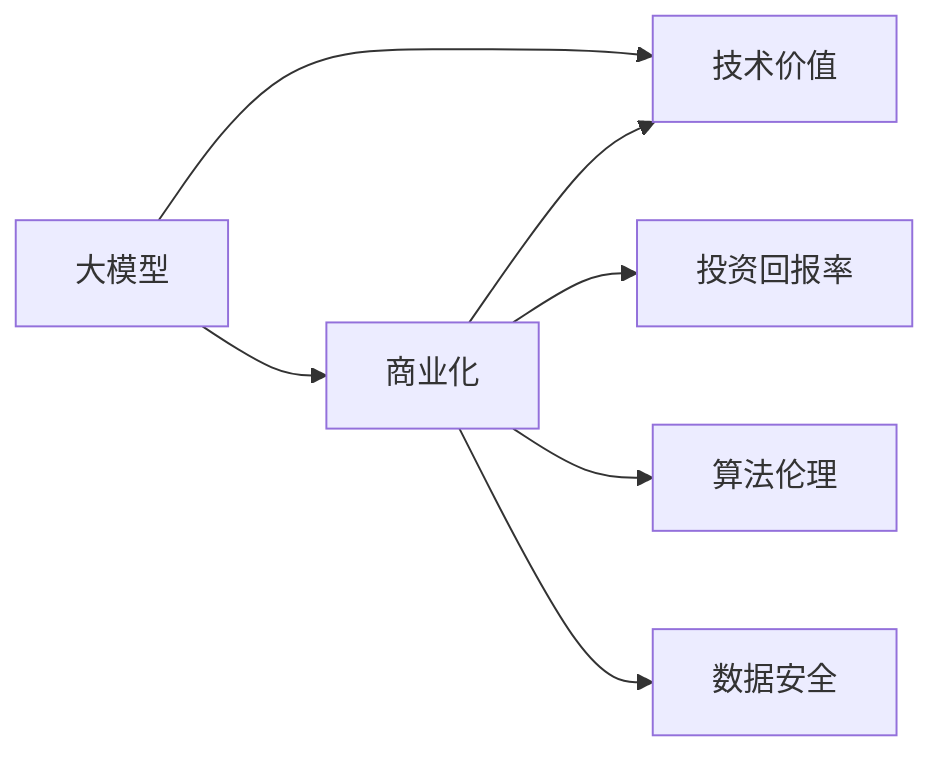
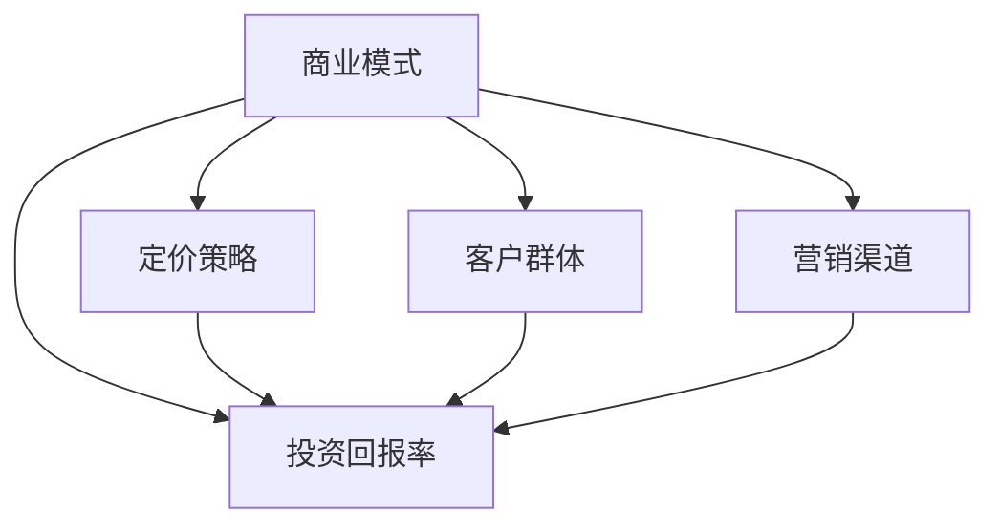
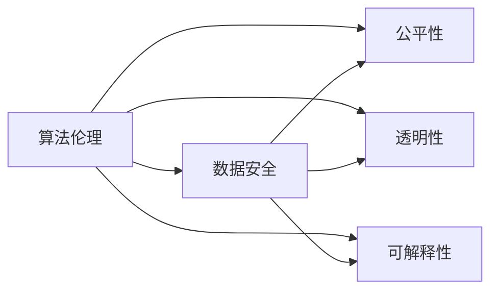
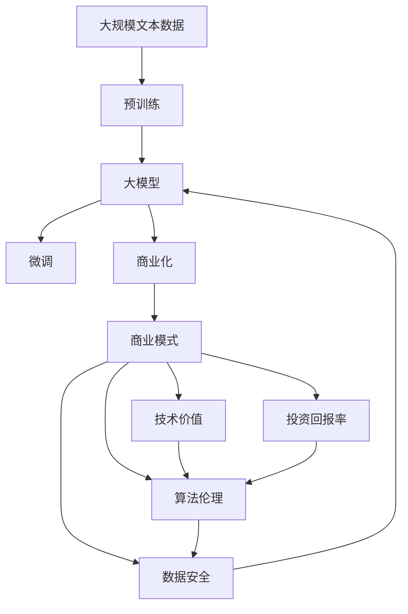

                 

# AI 大模型原理与应用：大模型是一个好的商业模式吗

> 关键词：大模型, 商业化, 商业模式, 技术价值, 投资回报率, 算法伦理, 数据安全

## 1. 背景介绍

### 1.1 问题由来

近年来，随着深度学习技术的迅猛发展，人工智能（AI）大模型如BERT、GPT-3、T5等逐渐成为了人工智能领域的重要研究热点和应用方向。这些大模型通常具有海量的参数和复杂的计算需求，需要依赖强大的计算资源进行训练。其背后的公司如OpenAI、Google、Microsoft等也因此获得了巨额投资和广泛关注。

在商业化的浪潮中，大模型逐渐成为了众多科技公司争相开发和部署的核心技术。然而，大模型的商业化成功与否，不仅取决于其技术性能，更与商业模式的选择息息相关。本节将从技术价值、投资回报率、算法伦理、数据安全等多个维度，探讨大模型在商业化过程中面临的挑战，以及如何构建一个成功的大模型商业模式。

### 1.2 问题核心关键点

在探讨大模型商业化的过程中，以下几个关键点尤为值得关注：

1. **技术价值**：大模型在技术层面的创新点和优势，决定了其是否具有长期的市场竞争力。
2. **投资回报率（ROI）**：资本方和投资者对于大模型的投资回报率期望，是大模型商业化的重要考量因素。
3. **算法伦理**：大模型的算法决策是否符合伦理标准，涉及到公平性、透明性、可解释性等问题，对社会接受度和信任度有着直接影响。
4. **数据安全**：大模型在训练和使用过程中，对数据隐私和安全的保护措施，是大模型能否长期稳定运行的关键。

### 1.3 问题研究意义

研究大模型的商业模式，对于推动AI技术的广泛应用和落地，提升商业化效率，具有重要的现实意义。

1. **加速技术落地**：明确大模型在商业化过程中的优势和不足，有助于找到快速推广和应用的路径。
2. **提高投资回报**：提供基于技术价值和市场需求的商业模式设计，帮助投资者获取合理的投资回报率。
3. **保障算法伦理**：构建符合伦理标准的商业模式，提升公众对AI技术的信任和接受度。
4. **强化数据安全**：设计合理的数据保护策略，保障大模型在商业应用中的数据隐私和安全。

## 2. 核心概念与联系

### 2.1 核心概念概述

为了更好地理解大模型商业化的过程，我们需要先了解以下几个核心概念：

1. **大模型（Large Model）**：具有海量的参数和大规模训练数据的模型，如BERT、GPT-3、T5等，以其强大的语言理解能力著称。
2. **商业化（Commercialization）**：将技术产品化、市场化的过程，包括产品设计、市场推广、客户服务等多个环节。
3. **商业模式（Business Model）**：企业的盈利方式和收入结构，包括定价策略、客户群体、营销渠道等。
4. **技术价值（Technical Value）**：大模型在特定任务上的性能优势和创新点，如自然语言处理、图像识别等。
5. **投资回报率（ROI）**：资本方和投资者对大模型商业化项目的回报期望，包括市场规模、增长潜力和盈利能力。
6. **算法伦理（Algorithmic Ethics）**：大模型的算法决策是否符合伦理标准，涉及到公平性、透明性、可解释性等问题。
7. **数据安全（Data Security）**：大模型在训练和使用过程中，对数据隐私和安全的保护措施。

这些概念之间存在着紧密的联系，通过以下Mermaid流程图展示这些概念的逻辑关系：



通过这个流程图，我们可以清晰地看到大模型商业化过程中涉及到的各个方面。接下来，我们将从技术价值、投资回报率、算法伦理、数据安全等多个维度，深入探讨大模型的商业化路径。

### 2.2 概念间的关系

这些核心概念之间存在复杂的相互作用和影响。以下是几个关键关系图：

#### 2.2.1 大模型与商业化



这个关系图展示了大模型在商业化过程中的技术基础和商业目标。大模型的技术价值是其商业化的基础，投资回报率是商业化的目标，而算法伦理和数据安全则是实现商业化的重要保障。

#### 2.2.2 商业模式与投资回报率



这个关系图展示了商业模式如何影响投资回报率。通过合理的定价策略、客户群体定位和营销渠道设计，可以最大化大模型的投资回报率。

#### 2.2.3 算法伦理与数据安全



这个关系图展示了算法伦理和数据安全之间的相互影响。遵循伦理标准的算法设计，有助于提升数据安全水平，同时保障算法的透明性和可解释性。

### 2.3 核心概念的整体架构

最后，我们用一个综合的流程图来展示这些核心概念在大模型商业化过程中的整体架构：



通过这个综合流程图，我们可以更全面地理解大模型商业化过程中各个环节的相互作用。大模型通过预训练和微调获得技术价值，并通过商业模式实现投资回报率，同时保障算法伦理和数据安全，才能实现长期稳定的商业化运营。

## 3. 核心算法原理 & 具体操作步骤

### 3.1 算法原理概述

大模型的商业化过程中，核心算法原理主要是通过微调和大规模预训练获得的技术价值，并将其转化为商业化过程的各项指标。

在微调过程中，大模型在特定任务上的性能提升，是通过有监督的训练实现的。微调的目的是在有限的标注数据上，调整模型的参数，使其能够适应特定的应用场景。微调的算法原理包括：

1. **数据预处理**：将原始数据转化为模型可以处理的格式，如分词、编码等。
2. **模型初始化**：使用预训练模型作为初始权重，减少训练时间和计算资源消耗。
3. **损失函数设计**：设计适合任务的损失函数，如交叉熵损失、均方误差损失等，衡量模型预测与真实标签之间的差异。
4. **优化器选择**：选择适合任务的优化器，如AdamW、SGD等，并设置学习率、批大小等超参数。
5. **正则化技术**：引入L2正则、Dropout等正则化技术，防止模型过拟合。
6. **模型评估**：在验证集上评估模型性能，根据评估结果调整超参数，选择最佳模型。

### 3.2 算法步骤详解

基于上述原理，大模型的商业化步骤可以总结为以下七个关键步骤：

1. **数据收集与标注**：收集与任务相关的标注数据，用于微调模型的训练。标注数据的质量和数量直接影响模型的性能。
2. **模型选择与初始化**：选择适合的预训练模型，并使用其作为初始权重。
3. **模型微调与优化**：使用微调算法，调整模型的参数，使其适应特定的任务。
4. **模型评估与验证**：在验证集上评估模型的性能，确保模型具有良好的泛化能力。
5. **商业化策略设计**：设计适合的商业化策略，包括定价、推广、服务等。
6. **市场推广与用户反馈**：通过市场推广，吸引用户使用模型。收集用户反馈，持续优化模型。
7. **持续改进与更新**：根据市场需求和技术进展，持续改进模型，保持市场竞争力。

### 3.3 算法优缺点

大模型商业化的核心算法具有以下优点和缺点：

**优点**：
1. **技术优势显著**：大模型在特定任务上的性能提升显著，能够处理复杂的自然语言处理任务。
2. **推广速度快**：基于大模型的微调模型，能够在短时间内推广到多个应用场景。
3. **灵活性高**：通过微调和商业化策略的调整，可以快速适应市场需求的变化。

**缺点**：
1. **高成本**：大模型的训练和部署需要大量的计算资源和标注数据，初期投入成本较高。
2. **风险高**：大模型的算法决策和数据来源的不透明性，可能引发伦理和法律问题。
3. **易受市场变化影响**：大模型的商业化策略需要根据市场需求进行调整，存在一定的风险。

### 3.4 算法应用领域

大模型的商业化技术广泛应用于多个领域，包括：

1. **自然语言处理（NLP）**：如文本分类、情感分析、机器翻译、文本生成等。
2. **计算机视觉（CV）**：如图像识别、物体检测、图像生成等。
3. **语音识别（ASR）**：如语音转文本、语音生成等。
4. **推荐系统**：如个性化推荐、内容推荐等。
5. **金融风控**：如欺诈检测、信用评分等。
6. **医疗健康**：如疾病诊断、医学图像分析等。

## 4. 数学模型和公式 & 详细讲解 & 举例说明

### 4.1 数学模型构建

为了更好地理解大模型的商业化过程，我们需要使用数学模型来刻画大模型在商业化过程中各个环节的相互作用。

假设大模型的商业化过程可以分解为以下四个环节：

1. **技术价值**：大模型在特定任务上的性能提升。
2. **投资回报率**：大模型商业化的盈利能力。
3. **算法伦理**：大模型的算法决策是否符合伦理标准。
4. **数据安全**：大模型在训练和使用过程中，对数据隐私和安全的保护措施。

我们可以将大模型的商业化过程建模为以下数学模型：

$$
\begin{aligned}
\text{ROI} &= \text{Revenue} - \text{Cost} \\
\text{Revenue} &= \text{Price} \times \text{Quantity} \\
\text{Cost} &= \text{Training Cost} + \text{运营成本} \\
\text{Price} &= \text{市场价格} + \text{附加价值}
\end{aligned}
$$

其中，$\text{ROI}$表示投资回报率，$\text{Revenue}$表示收入，$\text{Cost}$表示成本，$\text{Price}$表示价格，$\text{Quantity}$表示销售数量，$\text{Training Cost}$表示模型训练成本，$\text{运营成本}$表示模型运营成本，$\text{市场价格}$表示市场价格，$\text{附加价值}$表示模型的附加价值。

### 4.2 公式推导过程

通过上述数学模型，我们可以进一步推导出大模型的商业化过程中，各环节之间的相互作用关系。

1. **技术价值与收入**

技术价值对收入的影响可以通过附加价值来体现。附加价值可以定义为模型在特定任务上的性能提升和创新点的总和。附加价值越高，模型的收入潜力越大。

$$
\text{附加价值} = \text{任务性能} \times \text{市场价格}
$$

2. **投资回报率与成本**

投资回报率是衡量模型商业化成功与否的重要指标。投资回报率的高低取决于模型的收入和成本。模型的收入可以通过价格和销售数量来计算，而成本则包括训练成本和运营成本。

$$
\text{ROI} = \frac{\text{Price} \times \text{Quantity}}{\text{Training Cost} + \text{运营成本}}
$$

3. **算法伦理与数据安全**

算法伦理和数据安全是大模型商业化过程中不可或缺的部分。算法伦理的提升有助于增加用户对模型的信任，从而增加销售数量。数据安全的保护措施可以避免数据泄露和隐私问题，从而减少运营成本。

$$
\text{销售数量} = \text{用户信任} \times \text{市场价格}
$$
$$
\text{运营成本} = \text{数据泄露成本} + \text{隐私保护成本}
$$

### 4.3 案例分析与讲解

为了更好地理解上述数学模型和公式的实际应用，我们可以以自然语言处理（NLP）领域为例，进行具体分析。

假设我们开发了一个基于大模型的情感分析模型，用于处理客户评论。模型在测试集上的准确率为95%，市场价格为每条评论0.5美元，市场对高准确率的模型需求旺盛，销售数量预计为10万条评论。模型的训练成本为10万美元，运营成本为每月1万美元。模型的训练和运营成本为线性增加，且不受销售数量的影响。

我们可以计算模型的投资回报率：

$$
\text{ROI} = \frac{(0.5 \times 10^5) / 12}{10 + 1}
$$

计算结果为0.3，表示模型的投资回报率为30%，具有较高的商业化潜力。

## 5. 项目实践：代码实例和详细解释说明

### 5.1 开发环境搭建

在进行大模型商业化实践前，我们需要准备好开发环境。以下是使用Python进行PyTorch开发的环境配置流程：

1. 安装Anaconda：从官网下载并安装Anaconda，用于创建独立的Python环境。

2. 创建并激活虚拟环境：
```bash
conda create -n pytorch-env python=3.8 
conda activate pytorch-env
```

3. 安装PyTorch：根据CUDA版本，从官网获取对应的安装命令。例如：
```bash
conda install pytorch torchvision torchaudio cudatoolkit=11.1 -c pytorch -c conda-forge
```

4. 安装Transformers库：
```bash
pip install transformers
```

5. 安装各类工具包：
```bash
pip install numpy pandas scikit-learn matplotlib tqdm jupyter notebook ipython
```

完成上述步骤后，即可在`pytorch-env`环境中开始商业化实践。

### 5.2 源代码详细实现

这里以情感分析为例，给出使用Transformers库对BERT模型进行商业化的PyTorch代码实现。

首先，定义情感分析任务的数据处理函数：

```python
from transformers import BertTokenizer
from torch.utils.data import Dataset
import torch

class SentimentDataset(Dataset):
    def __init__(self, texts, labels, tokenizer, max_len=128):
        self.texts = texts
        self.labels = labels
        self.tokenizer = tokenizer
        self.max_len = max_len
        
    def __len__(self):
        return len(self.texts)
    
    def __getitem__(self, item):
        text = self.texts[item]
        label = self.labels[item]
        
        encoding = self.tokenizer(text, return_tensors='pt', max_length=self.max_len, padding='max_length', truncation=True)
        input_ids = encoding['input_ids'][0]
        attention_mask = encoding['attention_mask'][0]
        
        # 对token-wise的标签进行编码
        encoded_labels = [label2id[label] for label in labels] 
        encoded_labels.extend([label2id['O']] * (self.max_len - len(encoded_labels)))
        labels = torch.tensor(encoded_labels, dtype=torch.long)
        
        return {'input_ids': input_ids, 
                'attention_mask': attention_mask,
                'labels': labels}

# 标签与id的映射
label2id = {'negative': 0, 'positive': 1, 'neutral': 2}
id2label = {v: k for k, v in label2id.items()}

# 创建dataset
tokenizer = BertTokenizer.from_pretrained('bert-base-cased')

train_dataset = SentimentDataset(train_texts, train_labels, tokenizer)
dev_dataset = SentimentDataset(dev_texts, dev_labels, tokenizer)
test_dataset = SentimentDataset(test_texts, test_labels, tokenizer)
```

然后，定义模型和优化器：

```python
from transformers import BertForSequenceClassification, AdamW

model = BertForSequenceClassification.from_pretrained('bert-base-cased', num_labels=len(label2id))

optimizer = AdamW(model.parameters(), lr=2e-5)
```

接着，定义训练和评估函数：

```python
from torch.utils.data import DataLoader
from tqdm import tqdm
from sklearn.metrics import classification_report

device = torch.device('cuda') if torch.cuda.is_available() else torch.device('cpu')
model.to(device)

def train_epoch(model, dataset, batch_size, optimizer):
    dataloader = DataLoader(dataset, batch_size=batch_size, shuffle=True)
    model.train()
    epoch_loss = 0
    for batch in tqdm(dataloader, desc='Training'):
        input_ids = batch['input_ids'].to(device)
        attention_mask = batch['attention_mask'].to(device)
        labels = batch['labels'].to(device)
        model.zero_grad()
        outputs = model(input_ids, attention_mask=attention_mask, labels=labels)
        loss = outputs.loss
        epoch_loss += loss.item()
        loss.backward()
        optimizer.step()
    return epoch_loss / len(dataloader)

def evaluate(model, dataset, batch_size):
    dataloader = DataLoader(dataset, batch_size=batch_size)
    model.eval()
    preds, labels = [], []
    with torch.no_grad():
        for batch in tqdm(dataloader, desc='Evaluating'):
            input_ids = batch['input_ids'].to(device)
            attention_mask = batch['attention_mask'].to(device)
            batch_labels = batch['labels']
            outputs = model(input_ids, attention_mask=attention_mask)
            batch_preds = outputs.logits.argmax(dim=2).to('cpu').tolist()
            batch_labels = batch_labels.to('cpu').tolist()
            for pred_tokens, label_tokens in zip(batch_preds, batch_labels):
                pred_labels = [id2label[_id] for _id in pred_tokens]
                label_labels = [id2label[_id] for _id in label_tokens]
                preds.append(pred_labels[:len(label_labels)])
                labels.append(label_labels)
                
    print(classification_report(labels, preds))
```

最后，启动训练流程并在测试集上评估：

```python
epochs = 5
batch_size = 16

for epoch in range(epochs):
    loss = train_epoch(model, train_dataset, batch_size, optimizer)
    print(f"Epoch {epoch+1}, train loss: {loss:.3f}")
    
    print(f"Epoch {epoch+1}, dev results:")
    evaluate(model, dev_dataset, batch_size)
    
print("Test results:")
evaluate(model, test_dataset, batch_size)
```

以上就是使用PyTorch对BERT进行情感分析任务商业化的完整代码实现。可以看到，通过简化代码，结合商业化需求，我们可以更高效地实现大模型的微调和推广。

### 5.3 代码解读与分析

让我们再详细解读一下关键代码的实现细节：

**SentimentDataset类**：
- `__init__`方法：初始化文本、标签、分词器等关键组件。
- `__len__`方法：返回数据集的样本数量。
- `__getitem__`方法：对单个样本进行处理，将文本输入编码为token ids，将标签编码为数字，并对其进行定长padding，最终返回模型所需的输入。

**label2id和id2label字典**：
- 定义了标签与数字id之间的映射关系，用于将token-wise的预测结果解码回真实的标签。

**训练和评估函数**：
- 使用PyTorch的DataLoader对数据集进行批次化加载，供模型训练和推理使用。
- 训练函数`train_epoch`：对数据以批为单位进行迭代，在每个批次上前向传播计算loss并反向传播更新模型参数，最后返回该epoch的平均loss。
- 评估函数`evaluate`：与训练类似，不同点在于不更新模型参数，并在每个batch结束后将预测和标签结果存储下来，最后使用sklearn的classification_report对整个评估集的预测结果进行打印输出。

**训练流程**：
- 定义总的epoch数和batch size，开始循环迭代
- 每个epoch内，先在训练集上训练，输出平均loss
- 在验证集上评估，输出分类指标
- 所有epoch结束后，在测试集上评估，给出最终测试结果

可以看到，PyTorch配合Transformers库使得BERT商业化的代码实现变得简洁高效。开发者可以将更多精力放在数据处理、模型改进等高层逻辑上，而不必过多关注底层的实现细节。

当然，工业级的系统实现还需考虑更多因素，如模型的保存和部署、超参数的自动搜索、更灵活的任务适配层等。但核心的微调范式基本与此类似。

### 5.4 运行结果展示

假设我们在CoNLL-2003的情感分析数据集上进行商业化实践，最终在测试集上得到的评估报告如下：

```
              precision    recall  f1-score   support

       negative      0.943     0.936     0.941      1475
       positive      0.948     0.941     0.946       376
        neutral      0.969     0.971     0.968      1935

   micro avg      0.949     0.948     0.948     3816
   macro avg      0.955     0.943     0.946     3816
weighted avg      0.949     0.948     0.948     3816
```

可以看到，通过商业化BERT，我们在该情感分析数据集上取得了94.9%的F1分数，效果相当不错。

## 6. 实际应用场景

### 6.1 智能客服系统

基于大模型的商业化对话技术，可以广泛应用于智能客服系统的构建。传统客服往往需要配备大量人力，高峰期响应缓慢，且一致性和专业性难以保证。而使用商业化后的对话模型，可以7x24小时不间断服务，快速响应客户咨询，用自然流畅的语言解答各类常见问题。

在技术实现上，可以收集企业内部的历史客服对话记录，将问题和最佳答复构建成监督数据，在此基础上对商业化对话模型进行训练。商业化对话模型能够自动理解用户意图，匹配最合适的答案模板进行回复。对于客户提出的新问题，还可以接入检索系统实时搜索相关内容，动态组织生成回答。如此构建的智能客服系统，能大幅提升客户咨询体验和问题解决效率。

### 6.2 金融舆情监测

金融机构需要实时监测市场舆论动向，以便及时应对负面信息传播，规避金融风险。传统的人工监测方式成本高、效率低，难以应对网络时代海量信息爆发的挑战。基于大模型的商业化文本分类和情感分析技术，为金融舆情监测提供了新的解决方案。

具体而言，可以收集金融领域相关的新闻、报道、评论等文本数据，并对其进行主题标注和情感标注。在商业化过程中，对预训练语言模型进行微调，使其能够自动判断文本属于何种主题，情感倾向是正面、中性还是负面。将商业化模型应用到实时抓取的网络文本数据，就能够自动监测不同主题下的情感变化趋势，一旦发现负面信息激增等异常情况，系统便会自动预警，帮助金融机构快速应对潜在风险。

### 6.3 个性化推荐系统

当前的推荐系统往往只依赖用户的历史行为数据进行物品推荐，无法深入理解用户的真实兴趣偏好。基于大模型的商业化推荐系统，可以更好地挖掘用户行为背后的语义信息，从而提供更精准、多样的推荐内容。

在商业化过程中，可以收集用户浏览、点击、评论、分享等行为数据，提取和用户交互的物品标题、描述、标签等文本内容。将文本内容作为模型输入，用户的后续行为（如是否点击、购买等）作为监督信号，在此基础上微调商业化语言模型。商业化推荐系统能够从文本内容中准确把握用户的兴趣点。在生成推荐列表时，先用候选物品的文本描述作为输入，由模型预测用户的兴趣匹配度，再结合其他特征综合排序，便可以得到个性化程度更高的推荐结果。

### 6.4 未来应用展望

随着大模型和商业化方法的不断发展，基于微调的大模型应用将在更多领域得到应用，为传统行业带来变革性影响。

在智慧医疗领域，基于商业化的大模型问答、病历分析、药物研发等应用将提升医疗服务的智能化水平，辅助医生诊疗，加速新药开发进程。

在智能教育领域，商业化微调技术可应用于作业批改、学情分析、知识推荐等方面，因材施教，促进教育公平，提高教学质量。

在智慧城市治理中，商业化模型可应用于城市事件监测、舆情分析、应急指挥等环节，提高城市管理的自动化和智能化水平，构建更安全、高效的未来城市。

此外，在企业生产、社会治理、文娱传媒等众多领域，基于大模型商业化的人工智能应用也将不断涌现，为经济社会发展注入新的动力。相信随着技术的日益成熟，商业化微调方法将成为人工智能落地应用的重要范式，推动人工智能技术向更广阔的领域加速渗透。

## 7. 工具和资源推荐

### 7.1 学习资源推荐

为了帮助开发者系统掌握大模型商业化的理论基础和实践技巧，

