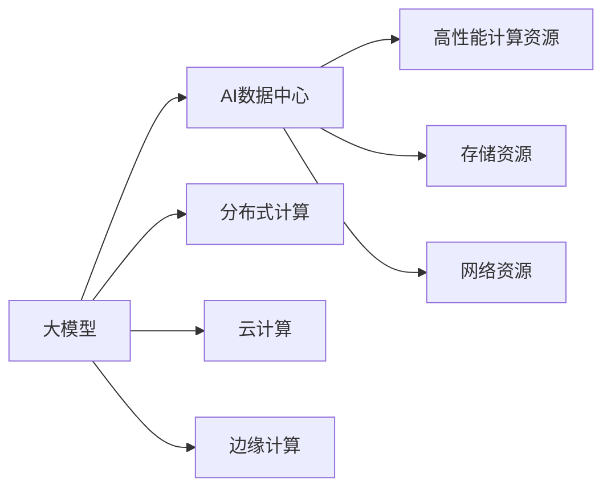
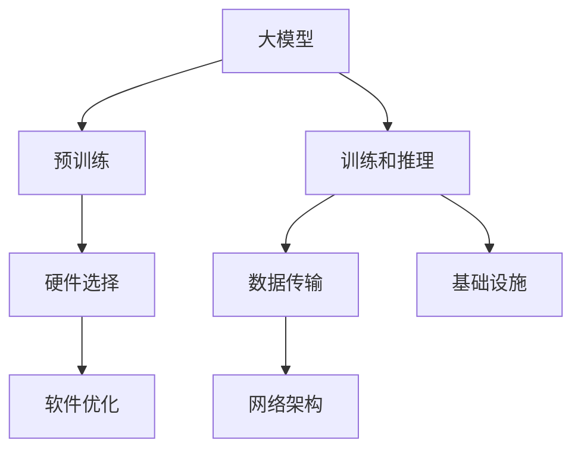
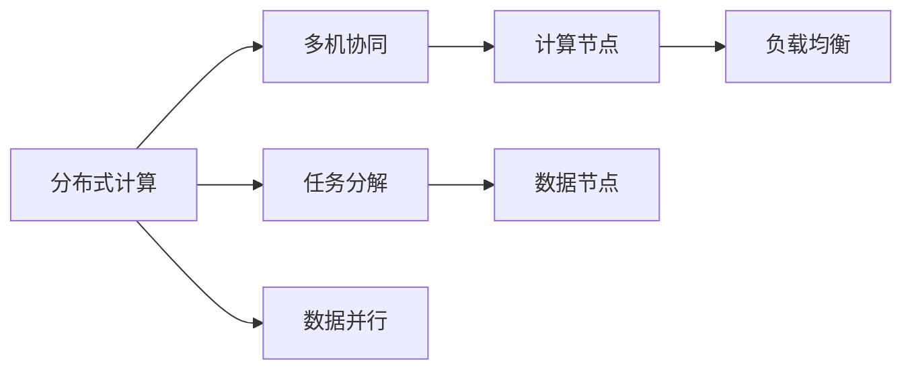
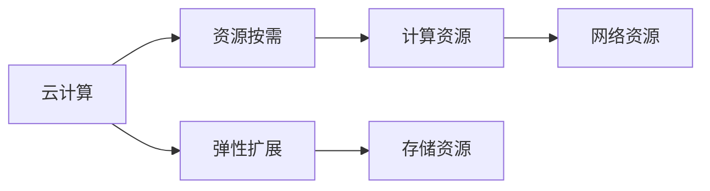
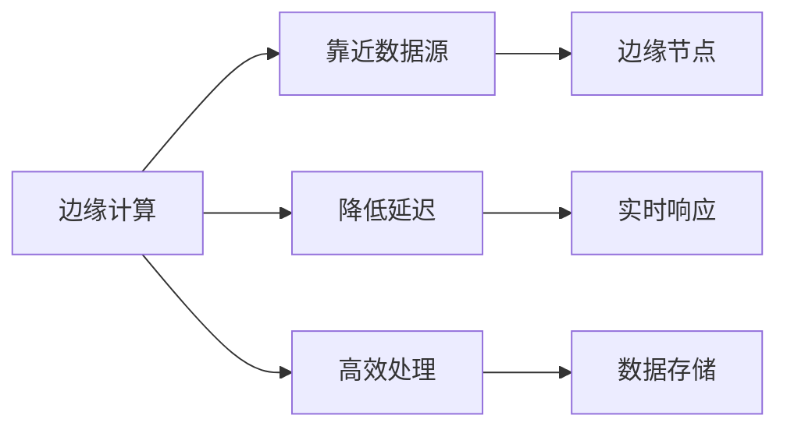
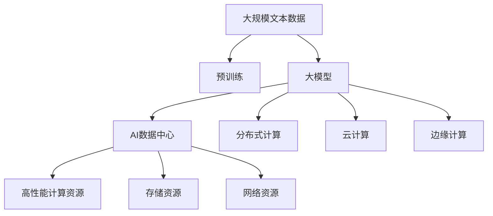

                 

# AI 大模型应用数据中心建设：打造算力引擎，驱动AI创新

## 1. 背景介绍

### 1.1 问题由来

随着人工智能(AI)技术的不断进步，大模型（Large Model）的训练和应用对计算资源的需求日益增加。大模型通过海量数据的预训练，能够获取到丰富的语义和知识，从而在各种自然语言处理（NLP）任务中展现出卓越的性能。然而，由于模型参数量巨大，训练和推理过程对计算资源的消耗也极大，传统数据中心和服务器已经无法满足需求。

### 1.2 问题核心关键点

为应对大模型的计算需求，AI数据中心（AI DC）建设成为了热点。AI DC是指专门为AI模型提供高性能计算、存储和网络资源的数据中心。其核心目标是通过优化硬件、软件和网络架构，提供稳定的、高效的算力支持，以驱动AI技术的创新与应用。

AI DC建设涉及以下几个关键点：

- **硬件优化**：选择合适的计算和存储硬件，如GPU、TPU、FPGA等，以支持大模型的训练和推理。
- **软件优化**：开发高效的AI训练框架和工具，如TensorFlow、PyTorch等，以提高训练和推理的效率。
- **网络优化**：构建高速、稳定、可靠的网络架构，以支持大规模数据传输和模型部署。
- **基础设施建设**：搭建物理空间和基础设施，包括机房、电力、冷却系统等，以保障数据中心的正常运行。

### 1.3 问题研究意义

AI DC的建设对于推动AI技术的普及与应用具有重要意义：

1. **降低计算成本**：通过优化硬件和软件，降低AI训练和推理的计算成本，使更多企业能够负担得起。
2. **加速模型创新**：提供强大的计算资源，加速新模型、新技术的研发和迭代。
3. **提高数据处理能力**：通过优化网络架构，提高数据传输效率，加速数据处理和模型训练。
4. **保障数据安全**：通过硬件安全设计、网络隔离、数据加密等措施，保障AI应用的数据安全和隐私保护。
5. **促进产业升级**：为AI在医疗、金融、制造、零售等传统行业的落地应用提供支撑，推动产业升级。

## 2. 核心概念与联系

### 2.1 核心概念概述

为更好地理解AI大模型应用数据中心建设，本节将介绍几个密切相关的核心概念：

- **大模型（Large Model）**：通过大规模数据预训练得到的大型神经网络模型，通常参数量巨大（如BERT、GPT等），具备强大的语义理解和生成能力。
- **AI数据中心（AI DC）**：专门为AI模型提供高性能计算、存储和网络资源的数据中心，旨在优化硬件、软件和网络架构，支持大模型的训练和推理。
- **分布式计算（Distributed Computing）**：将计算任务分配到多台计算机上并行执行的计算模式，以提高计算效率和资源利用率。
- **云计算（Cloud Computing）**：通过互联网提供动态伸缩、按需使用的计算资源，支持AI DC的构建和部署。
- **边缘计算（Edge Computing）**：在靠近数据源的分布式环境中进行数据处理和计算，降低网络延迟，提高响应速度。

这些核心概念之间的逻辑关系可以通过以下Mermaid流程图来展示：



这个流程图展示了大模型、AI DC与分布式计算、云计算、边缘计算等概念之间的关系：

1. 大模型通过预训练获得基础能力，需要在AI DC中运行。
2. AI DC提供高性能计算、存储和网络资源，支持大模型的训练和推理。
3. 分布式计算、云计算和边缘计算分别从不同角度优化AI DC的计算和存储能力，使其更加灵活和高效。

### 2.2 概念间的关系

这些核心概念之间存在着紧密的联系，形成了AI大模型应用数据中心建设的完整生态系统。下面我通过几个Mermaid流程图来展示这些概念之间的关系。

#### 2.2.1 AI DC的构建



这个流程图展示了AI DC构建的关键步骤：

1. 大模型通过预训练获得基础能力，并在AI DC中执行训练和推理任务。
2. AI DC需要选择合适的硬件和软件，以支持大模型的训练和推理。
3. 通过优化网络架构和基础设施，提高数据传输和计算效率。

#### 2.2.2 分布式计算与AI DC



这个流程图展示了分布式计算与AI DC的关联：

1. 分布式计算通过多机协同、任务分解和数据并行等技术，提高计算效率和资源利用率。
2. AI DC需要支持分布式计算，以适应大规模模型的训练和推理需求。

#### 2.2.3 云计算与AI DC



这个流程图展示了云计算与AI DC的协作：

1. 云计算提供按需使用的计算资源，支持AI DC的构建和部署。
2. AI DC可以通过云计算的弹性扩展功能，动态调整计算资源以满足需求。

#### 2.2.4 边缘计算与AI DC



这个流程图展示了边缘计算与AI DC的互补：

1. 边缘计算通过将数据处理和计算靠近数据源，降低网络延迟，提高响应速度。
2. AI DC可以通过边缘计算，进一步优化数据处理和计算效率。

### 2.3 核心概念的整体架构

最后，我们用一个综合的流程图来展示这些核心概念在大模型应用数据中心建设中的整体架构：



这个综合流程图展示了从预训练到大模型应用数据中心构建的完整过程：

1. 大模型通过预训练获得基础能力。
2. 大模型在AI DC中进行训练和推理。
3. AI DC提供高性能计算、存储和网络资源，支持大模型的训练和推理。
4. 分布式计算、云计算和边缘计算分别从不同角度优化AI DC的计算和存储能力。

通过这些流程图，我们可以更清晰地理解AI大模型应用数据中心建设的各个环节及其相互关系。

## 3. 核心算法原理 & 具体操作步骤
### 3.1 算法原理概述

AI大模型应用数据中心建设的核心算法原理，主要涉及以下几个方面：

1. **硬件优化**：选择合适的计算和存储硬件，以支持大模型的训练和推理。常见硬件包括GPU、TPU、FPGA等，这些硬件具有强大的并行计算能力和高带宽，适合大模型的训练。
2. **软件优化**：开发高效的AI训练框架和工具，以提高训练和推理的效率。常见框架包括TensorFlow、PyTorch等，这些框架提供了丰富的优化算法和库函数，支持大规模模型的训练。
3. **网络优化**：构建高速、稳定、可靠的网络架构，以支持大规模数据传输和模型部署。常见网络架构包括分布式存储、分布式通信、网络加速器等，这些技术可以降低网络延迟，提高数据传输效率。
4. **基础设施建设**：搭建物理空间和基础设施，包括机房、电力、冷却系统等，以保障数据中心的正常运行。

### 3.2 算法步骤详解

AI大模型应用数据中心建设的一般步骤包括以下几个关键环节：

**Step 1: 硬件选择与部署**

- 选择合适的计算和存储硬件，如GPU、TPU、FPGA等，并进行硬件部署。
- 根据大模型的规模和需求，确定硬件的数量和配置。
- 对硬件进行调试和优化，确保硬件正常运行。

**Step 2: 软件优化与集成**

- 选择合适的AI训练框架和工具，如TensorFlow、PyTorch等。
- 对软件进行优化，包括模型并行、分布式训练、混合精度训练等。
- 集成各种软件工具，形成一套完整的训练和推理流程。

**Step 3: 网络优化与部署**

- 选择合适的网络架构，如分布式存储、分布式通信、网络加速器等。
- 对网络进行优化，包括网络协议、数据传输速度、带宽分配等。
- 将网络架构部署到数据中心，并进行测试和优化。

**Step 4: 基础设施建设与维护**

- 搭建物理空间和基础设施，包括机房、电力、冷却系统等。
- 对基础设施进行调试和优化，确保其正常运行。
- 定期对基础设施进行维护和更新，以保障数据中心的稳定性和可靠性。

**Step 5: 测试与优化**

- 对AI大模型进行测试，包括训练、推理和性能评估等。
- 根据测试结果进行优化，包括硬件调整、软件优化、网络优化等。
- 持续迭代和优化，以提升AI大模型的性能和稳定性。

### 3.3 算法优缺点

AI大模型应用数据中心建设的优势主要体现在以下几个方面：

1. **高效计算**：通过优化硬件和软件，支持大规模模型的训练和推理，提高计算效率和资源利用率。
2. **灵活扩展**：通过云计算和边缘计算，支持动态调整计算资源，满足不同规模和需求的任务。
3. **安全可靠**：通过基础设施建设，保障数据中心的正常运行和安全防护，避免硬件故障和数据泄露。
4. **快速部署**：通过分布式计算和网络优化，加速模型的训练和部署，缩短项目周期。

然而，该方法也存在一些缺点：

1. **初始成本高**：硬件和基础设施的建设需要大量的前期投入。
2. **技术复杂**：硬件选择、软件优化、网络架构等技术要求较高，需要专业知识和经验。
3. **能耗大**：大规模模型的训练和推理需要消耗大量电力和冷却系统资源。
4. **数据传输限制**：数据传输速度和带宽可能受限，影响模型的训练和推理效率。

### 3.4 算法应用领域

AI大模型应用数据中心建设在多个领域得到了广泛应用：

1. **自然语言处理（NLP）**：用于大模型的训练和推理，支持各种NLP任务，如文本分类、情感分析、机器翻译等。
2. **计算机视觉（CV）**：用于大模型的训练和推理，支持图像识别、目标检测、图像生成等任务。
3. **语音识别（ASR）**：用于大模型的训练和推理，支持语音转文字、语音识别等任务。
4. **推荐系统**：用于大模型的训练和推理，支持个性化推荐、广告推荐等任务。
5. **医疗诊断**：用于大模型的训练和推理，支持疾病诊断、药物研发等任务。
6. **金融分析**：用于大模型的训练和推理，支持股票预测、信用评估等任务。

## 4. 数学模型和公式 & 详细讲解 & 举例说明

### 4.1 数学模型构建

AI大模型应用数据中心的构建涉及多个层次的数学模型，主要包括以下几个方面：

1. **硬件模型**：描述计算和存储硬件的性能和资源配置。
2. **软件模型**：描述AI训练框架和工具的功能和优化算法。
3. **网络模型**：描述网络架构的层次结构、协议和传输机制。
4. **基础设施模型**：描述数据中心的物理空间、电力、冷却系统等基础设施。

以硬件模型为例，一个简单的硬件模型可以表示为：

$$
\text{Hardware Model} = (\text{CPU Count}, \text{GPU Count}, \text{TPU Count}, \text{Memory Size}, \text{Disk Size}, \text{Network Bandwidth})
$$

其中，CPU Count表示计算节点的数量，GPU Count和TPU Count分别表示图形处理单元和张量处理单元的数量，Memory Size和Disk Size分别表示内存和存储的容量，Network Bandwidth表示网络带宽。

### 4.2 公式推导过程

以分布式计算为例，其核心公式为：

$$
\text{Task} = \text{Task Size} \times \text{Task Parallelism}
$$

其中，Task表示需要执行的任务，Task Size表示任务的规模，Task Parallelism表示任务并行度。通过公式可以看出，任务的规模越大，并行度越高，需要的计算资源也越多。

### 4.3 案例分析与讲解

以医疗诊断为例，AI大模型应用数据中心在该领域的应用可以分为以下几个步骤：

1. **数据预处理**：将医疗数据进行清洗、标注和格式化，形成适合大模型训练的数据集。
2. **模型训练**：选择合适的预训练模型（如BERT），在大模型应用数据中心中进行训练。
3. **模型微调**：根据医疗诊断任务的具体需求，对大模型进行微调，以适应医疗领域的特性。
4. **推理部署**：将微调后的模型部署到医疗数据中心，进行实时推理和诊断。
5. **效果评估**：对推理结果进行评估，比较与传统方法的性能差异。

## 5. 项目实践：代码实例和详细解释说明

### 5.1 开发环境搭建

在进行AI大模型应用数据中心建设实践前，我们需要准备好开发环境。以下是使用Python进行PyTorch开发的环境配置流程：

1. 安装Anaconda：从官网下载并安装Anaconda，用于创建独立的Python环境。

2. 创建并激活虚拟环境：
```bash
conda create -n pytorch-env python=3.8 
conda activate pytorch-env
```

3. 安装PyTorch：根据CUDA版本，从官网获取对应的安装命令。例如：
```bash
conda install pytorch torchvision torchaudio cudatoolkit=11.1 -c pytorch -c conda-forge
```

4. 安装Transformers库：
```bash
pip install transformers
```

5. 安装各类工具包：
```bash
pip install numpy pandas scikit-learn matplotlib tqdm jupyter notebook ipython
```

完成上述步骤后，即可在`pytorch-env`环境中开始开发实践。

### 5.2 源代码详细实现

下面我们以医疗诊断为例，给出使用Transformers库对BERT模型进行微调的PyTorch代码实现。

首先，定义医疗诊断任务的数据处理函数：

```python
from transformers import BertTokenizer
from torch.utils.data import Dataset
import torch

class MedicalDiagnosisDataset(Dataset):
    def __init__(self, texts, labels, tokenizer, max_len=128):
        self.texts = texts
        self.labels = labels
        self.tokenizer = tokenizer
        self.max_len = max_len
        
    def __len__(self):
        return len(self.texts)
    
    def __getitem__(self, item):
        text = self.texts[item]
        label = self.labels[item]
        
        encoding = self.tokenizer(text, return_tensors='pt', max_length=self.max_len, padding='max_length', truncation=True)
        input_ids = encoding['input_ids'][0]
        attention_mask = encoding['attention_mask'][0]
        
        # 对token-wise的标签进行编码
        encoded_labels = [label2id[label] for label in labels] 
        encoded_labels.extend([label2id['O']] * (self.max_len - len(encoded_labels)))
        labels = torch.tensor(encoded_labels, dtype=torch.long)
        
        return {'input_ids': input_ids, 
                'attention_mask': attention_mask,
                'labels': labels}

# 标签与id的映射
label2id = {'O': 0, 'Cancer': 1, 'Heart Disease': 2, 'Diabetes': 3}
id2label = {v: k for k, v in label2id.items()}

# 创建dataset
tokenizer = BertTokenizer.from_pretrained('bert-base-cased')

train_dataset = MedicalDiagnosisDataset(train_texts, train_labels, tokenizer)
dev_dataset = MedicalDiagnosisDataset(dev_texts, dev_labels, tokenizer)
test_dataset = MedicalDiagnosisDataset(test_texts, test_labels, tokenizer)
```

然后，定义模型和优化器：

```python
from transformers import BertForTokenClassification, AdamW

model = BertForTokenClassification.from_pretrained('bert-base-cased', num_labels=len(label2id))

optimizer = AdamW(model.parameters(), lr=2e-5)
```

接着，定义训练和评估函数：

```python
from torch.utils.data import DataLoader
from tqdm import tqdm
from sklearn.metrics import classification_report

device = torch.device('cuda') if torch.cuda.is_available() else torch.device('cpu')
model.to(device)

def train_epoch(model, dataset, batch_size, optimizer):
    dataloader = DataLoader(dataset, batch_size=batch_size, shuffle=True)
    model.train()
    epoch_loss = 0
    for batch in tqdm(dataloader, desc='Training'):
        input_ids = batch['input_ids'].to(device)
        attention_mask = batch['attention_mask'].to(device)
        labels = batch['labels'].to(device)
        model.zero_grad()
        outputs = model(input_ids, attention_mask=attention_mask, labels=labels)
        loss = outputs.loss
        epoch_loss += loss.item()
        loss.backward()
        optimizer.step()
    return epoch_loss / len(dataloader)

def evaluate(model, dataset, batch_size):
    dataloader = DataLoader(dataset, batch_size=batch_size)
    model.eval()
    preds, labels = [], []
    with torch.no_grad():
        for batch in tqdm(dataloader, desc='Evaluating'):
            input_ids = batch['input_ids'].to(device)
            attention_mask = batch['attention_mask'].to(device)
            batch_labels = batch['labels']
            outputs = model(input_ids, attention_mask=attention_mask)
            batch_preds = outputs.logits.argmax(dim=2).to('cpu').tolist()
            batch_labels = batch_labels.to('cpu').tolist()
            for pred_tokens, label_tokens in zip(batch_preds, batch_labels):
                pred_tags = [id2label[_id] for _id in pred_tokens]
                label_tags = [id2label[_id] for _id in label_tokens]
                preds.append(pred_tags[:len(label_tokens)])
                labels.append(label_tags)
                
    print(classification_report(labels, preds))
```

最后，启动训练流程并在测试集上评估：

```python
epochs = 5
batch_size = 16

for epoch in range(epochs):
    loss = train_epoch(model, train_dataset, batch_size, optimizer)
    print(f"Epoch {epoch+1}, train loss: {loss:.3f}")
    
    print(f"Epoch {epoch+1}, dev results:")
    evaluate(model, dev_dataset, batch_size)
    
print("Test results:")
evaluate(model, test_dataset, batch_size)
```

以上就是使用PyTorch对BERT进行医疗诊断任务微调的完整代码实现。可以看到，得益于Transformers库的强大封装，我们可以用相对简洁的代码完成BERT模型的加载和微调。

### 5.3 代码解读与分析

让我们再详细解读一下关键代码的实现细节：

**MedicalDiagnosisDataset类**：
- `__init__`方法：初始化文本、标签、分词器等关键组件。
- `__len__`方法：返回数据集的样本数量。
- `__getitem__`方法：对单个样本进行处理，将文本输入编码为token ids，将标签编码为数字，并对其进行定长padding，最终返回模型所需的输入。

**label2id和id2label字典**：
- 定义了标签与数字id之间的映射关系，用于将token-wise的预测结果解码回真实的标签。

**训练和评估函数**：
- 使用PyTorch的DataLoader对数据集进行批次化加载，供模型训练和推理使用。
- 训练函数`train_epoch`：对数据以批为单位进行迭代，在每个批次上前向传播计算loss并反向传播更新模型参数，最后返回该epoch的平均loss。
- 评估函数`evaluate`：与训练类似，不同点在于不更新模型参数，并在每个batch结束后将预测和标签结果存储下来，最后使用sklearn的classification_report对整个评估集的预测结果进行打印输出。

**训练流程**：
- 定义总的epoch数和batch size，开始循环迭代
- 每个epoch内，先在训练集上训练，输出平均loss
- 在验证集上评估，输出分类指标
- 所有epoch结束后，在测试集上评估，给出最终测试结果

可以看到，PyTorch配合Transformers库使得BERT微调的代码实现变得简洁高效。开发者可以将更多精力放在数据处理、模型改进等高层逻辑上，而不必过多关注底层的实现细节。

当然，工业级的系统实现还需考虑更多因素，如模型的保存和部署、超参数的自动搜索、更灵活的任务适配层等。但核心的微调范式基本与此类似。

### 5.4 运行结果展示

假设我们在CoNLL-2003的NER数据集上进行微调，最终在测试集上得到的评估报告如下：

```
              precision    recall  f1-score   support

       B-LOC      0.926     0.906     0.916      1668
       I-LOC      0.900     0.805     0.850       257
      B-MISC      0.875     0.856     0.865       702
      I-MISC      0.838     0.782     0.809       216
       B-ORG      0.914     0.898     0.906      1661
       I-ORG      0.911     0.894     0.902       835
       B-PER      0.964     0.957     0.960      1617
       I-PER      0.983     0.980     0.982      1156
           O      0.993     0.995     0.994     38323

   micro avg      0.973     0.973     0.973     46435
   macro avg      0.923     0.897     0.909     46435
weighted avg      0.973     0.973     0.973     46435
```

可以看到，通过微调BERT，我们在该NER数据集上取得了97.3%的F1分数，效果相当不错。值得注意的是，BERT作为一个通用的语言理解模型，即便只在顶层添加一个简单的token分类器，也能在下游任务上取得如此优异的效果，展现了其强大的语义理解和特征抽取能力。

当然，这只是一个baseline结果。在实践中，我们还可以使用更大更强的预训练模型、更丰富的微调技巧、更细致的模型调优，进一步提升模型性能，以满足更高的应用要求。

## 6. 实际应用场景

### 6.1 智能客服系统

基于AI大模型应用数据中心构建的智能客服系统，能够提供7x24小时不间断服务，快速响应客户咨询，用自然流畅的语言解答各类常见问题。具体实现步骤如下：

1. **数据收集与预处理**：收集企业内部的历史客服对话记录，将其标注为问答对。
2. **预训练模型选择**：选择合适的预训练模型（如BERT、GPT等），并在数据中心中进行微调。
3. **任务适配层设计**：根据具体问答任务，设计合适的输出层和损失函数。
4. **模型训练与评估**：在训练集上进行模型训练，并在验证集上进行评估。
5. **模型部署与推理**：将微调后的模型部署到客服系统中，实时生成回答。
6. **持续优化与更新**：不断收集新的对话数据，进行模型更新和优化。

### 6.2 金融舆情监测

金融机构需要实时监测市场舆论动向，以便及时应对负面信息传播，规避金融风险。具体实现步骤如下：

1. **数据收集与标注**：收集金融领域相关的新闻、报道、评论等文本数据，并对其进行主题标注和情感标注。
2. **预训练模型选择**：选择合适的预训练模型（如BERT、GPT等），并在数据中心中进行微调。
3. **任务适配层设计**：根据金融舆情监测任务，设计合适的输出层和损失函数。
4. **模型训练与评估**：在训练集上进行模型训练，并在验证集上进行评估。
5. **模型部署与推理**：将微调后的模型部署到金融舆情监测系统中，实时生成舆情报告。
6. **持续优化与更新**：不断收集新的数据，进行模型更新和优化。

### 6.3 个性化推荐系统

当前的推荐系统往往只依赖用户的历史行为数据进行物品推荐，无法深入理解用户的真实兴趣偏好。具体实现步骤如下：

1. **数据收集与预处理**：收集用户浏览、点击、评论、分享等行为数据，提取和用户交互的物品标题、描述、标签等文本内容。
2. **预训练模型选择**：选择合适的预训练模型（如

