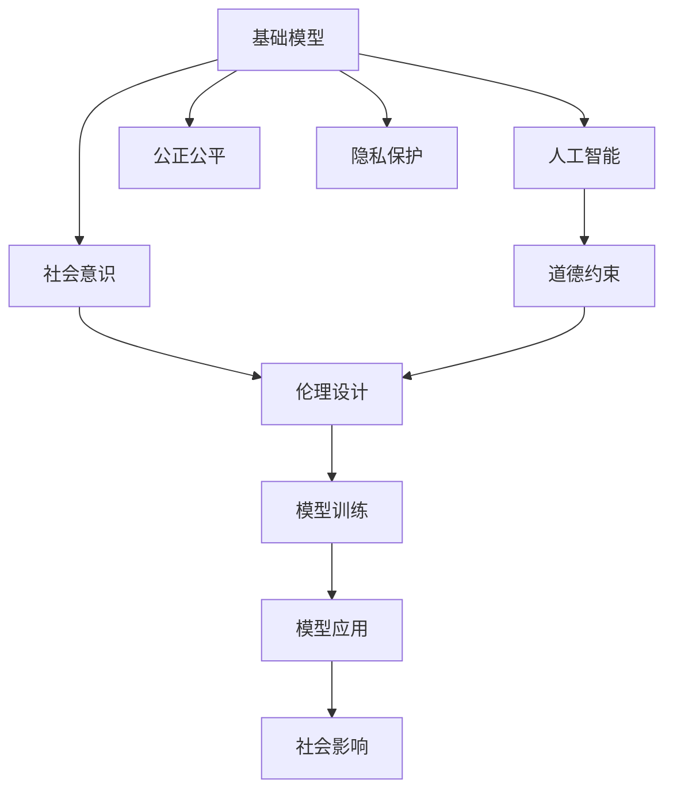

                 

# 基础模型的社会意识与伦理设计

> 关键词：基础模型, 社会意识, 伦理设计, 人工智能, 道德约束, 公正公平

## 1. 背景介绍

### 1.1 问题由来

随着人工智能技术的飞速发展，人工智能模型在各个领域得到了广泛的应用，比如医疗、金融、教育等。然而，随着模型的深入应用，模型带来的社会影响和伦理问题也逐渐凸显出来。这些问题包括但不限于数据偏见、算法歧视、隐私泄露、自动化失业等。这些问题如果不加以解决，将会对社会造成严重的负面影响。

### 1.2 问题核心关键点

当前，人工智能模型的社会影响和伦理问题已经成为社会关注的焦点。这些问题主要集中在以下几个方面：

- **数据偏见**：模型训练依赖大量数据，如果数据本身存在偏见，模型也会反映出这些偏见，导致歧视性结果。
- **算法歧视**：某些算法设计不当会导致不公平的结果，例如在招聘、贷款等场景中，模型可能会基于性别、年龄、种族等特征进行歧视性筛选。
- **隐私泄露**：在处理用户数据时，模型可能会泄露个人隐私，导致隐私侵害。
- **自动化失业**：随着自动化技术的普及，某些行业可能会被替代，导致大量工人失业。

这些问题不仅影响个体，还会对社会产生深远的负面影响，因此需要从模型设计、数据处理、应用场景等多个方面进行综合考虑和解决。

### 1.3 问题研究意义

研究基础模型的社会意识和伦理设计，对于推动人工智能技术的安全、公平、透明和可控发展具有重要意义：

- **提升社会信任**：通过在设计模型时考虑社会影响和伦理约束，增强公众对AI技术的信任和接受度。
- **保障公平公正**：确保模型在各个领域的应用中不产生歧视性结果，保护弱势群体权益。
- **促进技术进步**：基于伦理设计的技术进步更有社会价值，能够更好地服务于社会需求。
- **保障隐私安全**：设计模型时要充分考虑用户隐私，确保数据处理过程中的安全性。

## 2. 核心概念与联系

### 2.1 核心概念概述

为了更好地理解基础模型的社会意识和伦理设计，本节将介绍几个密切相关的核心概念：

- **基础模型(Fundamental Models)**：指用于学习和推理的机器学习模型，如神经网络、支持向量机等。
- **社会意识(Social Awareness)**：指模型在设计和应用过程中，对社会、道德和伦理问题的考虑和设计。
- **伦理设计(Ethical Design)**：指在模型设计中考虑伦理问题，如数据隐私、公平性、透明性等，以确保模型在使用过程中的公正和可控性。
- **人工智能(AI)**：指通过智能算法和机器学习技术实现的人类智能的延伸，旨在解决实际问题。
- **道德约束(Moral Constraints)**：指在模型设计和应用中，考虑伦理和社会道德问题，确保模型的行为符合人类价值观和道德标准。
- **公正公平(Fairness and Equity)**：指模型在不同用户、不同场景中的公平性和公正性，避免算法歧视和偏见。
- **隐私保护(Privacy Protection)**：指在模型设计和应用中，保护用户的隐私信息，确保数据使用的合法性和安全性。

这些核心概念之间的逻辑关系可以通过以下Mermaid流程图来展示：



这个流程图展示了基础模型在社会意识和伦理设计过程中的各个关键环节。

### 2.2 概念间的关系

这些核心概念之间存在着紧密的联系，形成了人工智能模型的社会意识和伦理设计的完整生态系统。

- **基础模型与社会意识**：基础模型在设计和应用过程中，需要考虑社会影响和伦理约束，以确保模型的社会责任。
- **社会意识与伦理设计**：社会意识是伦理设计的基础，伦理设计是社会意识的具体体现，两者相辅相成。
- **人工智能与道德约束**：人工智能技术的应用需要遵循道德规范，确保其行为符合人类价值观和道德标准。
- **道德约束与公正公平**：道德约束要求模型在设计和应用中考虑到公正公平，避免算法歧视和偏见。
- **隐私保护与伦理设计**：隐私保护是伦理设计的重要组成部分，确保模型在使用过程中保护用户隐私。

## 3. 核心算法原理 & 具体操作步骤

### 3.1 算法原理概述

基础模型的社会意识和伦理设计主要涉及以下几个关键步骤：

1. **数据预处理**：确保数据集的多样性和代表性，消除数据偏见，保护用户隐私。
2. **模型设计**：在设计模型时考虑公平性、透明性和可解释性，避免算法歧视。
3. **模型训练**：在训练过程中考虑数据隐私和公平性约束，确保模型公正公平。
4. **模型应用**：在应用过程中考虑社会影响和伦理约束，确保模型行为符合人类价值观和道德标准。

### 3.2 算法步骤详解

#### 3.2.1 数据预处理

数据预处理是基础模型社会意识和伦理设计的关键步骤。以下是数据预处理的主要步骤：

1. **数据收集**：收集代表性和多样性强的数据集，确保数据集不偏向任何群体。
2. **数据清洗**：清洗数据集，去除噪声和错误数据，确保数据质量。
3. **数据隐私保护**：采用数据匿名化、差分隐私等技术保护用户隐私。
4. **数据均衡**：对数据集进行均衡处理，确保不同群体的数据数量和质量一致。

#### 3.2.2 模型设计

模型设计是基础模型社会意识和伦理设计的核心环节。以下是模型设计的主要步骤：

1. **模型选择**：选择适合任务的模型，如神经网络、决策树等。
2. **公平性设计**：在设计模型时考虑公平性，避免算法歧视。例如，在招聘模型中，确保不同性别的应聘者得到公平的评价。
3. **透明性设计**：设计可解释的模型，确保模型的决策过程透明，用户可以理解模型的输出和行为。
4. **可解释性设计**：设计可解释性强的模型，确保用户可以理解模型的输出和行为，增加用户对模型的信任。

#### 3.2.3 模型训练

模型训练是基础模型社会意识和伦理设计的关键环节。以下是模型训练的主要步骤：

1. **数据划分**：将数据集划分为训练集、验证集和测试集，确保模型在训练过程中不过拟合。
2. **公平性约束**：在模型训练过程中，引入公平性约束，确保模型公平公正。例如，在训练过程中，确保不同群体的样本数量一致。
3. **隐私保护约束**：在模型训练过程中，考虑数据隐私保护，确保用户隐私不泄露。
4. **透明性约束**：在模型训练过程中，考虑透明性约束，确保模型的决策过程透明。

#### 3.2.4 模型应用

模型应用是基础模型社会意识和伦理设计的最终环节。以下是模型应用的主要步骤：

1. **模型部署**：将模型部署到生产环境中，确保模型的稳定性和可靠性。
2. **公平性评估**：在模型应用过程中，对模型进行公平性评估，确保模型在各个领域的应用中不产生歧视性结果。
3. **隐私保护评估**：在模型应用过程中，对模型进行隐私保护评估，确保用户隐私得到保护。
4. **社会影响评估**：在模型应用过程中，考虑模型的社会影响，确保模型的行为符合人类价值观和道德标准。

### 3.3 算法优缺点

基础模型的社会意识和伦理设计方法具有以下优点：

1. **提升社会信任**：通过在设计模型时考虑社会影响和伦理约束，增强公众对AI技术的信任和接受度。
2. **保障公平公正**：确保模型在各个领域的应用中不产生歧视性结果，保护弱势群体权益。
3. **促进技术进步**：基于伦理设计的技术进步更有社会价值，能够更好地服务于社会需求。
4. **保障隐私安全**：设计模型时要充分考虑用户隐私，确保数据使用的合法性和安全性。

同时，该方法也存在一些局限性：

1. **数据质量要求高**：数据预处理和清洗要求高，数据偏差和噪声数据会影响模型性能。
2. **模型设计复杂**：在设计模型时需要考虑公平性、透明性和可解释性，增加设计难度。
3. **训练时间较长**：在模型训练过程中，引入公平性约束和隐私保护约束，会增加训练时间和计算成本。
4. **模型复杂度高**：在模型应用过程中，需要考虑模型复杂度，确保模型能够高效运行。

尽管存在这些局限性，但就目前而言，基于社会意识和伦理设计的方法仍是大规模应用的基础模型的重要设计方向。未来相关研究的重点在于如何进一步降低数据处理和模型设计的复杂度，提高模型应用效率，同时兼顾可解释性和伦理安全性等因素。

### 3.4 算法应用领域

基础模型的社会意识和伦理设计方法在多个领域得到了广泛应用，包括但不限于：

- **医疗**：在医疗领域，模型需要考虑数据隐私和公平性，确保医疗数据的合法使用。
- **金融**：在金融领域，模型需要考虑算法公平性和隐私保护，确保金融服务的公正性。
- **教育**：在教育领域，模型需要考虑公平性和透明性，确保教育资源的公平分配。
- **交通**：在交通领域，模型需要考虑隐私保护和公平性，确保交通服务的公平性。
- **智能制造**：在智能制造领域，模型需要考虑数据隐私和公平性，确保工业数据的合法使用。

## 4. 数学模型和公式 & 详细讲解 & 举例说明

### 4.1 数学模型构建

基础模型的社会意识和伦理设计涉及多个数学模型和公式，以下是一些关键模型的构建：

#### 4.1.1 数据预处理模型

数据预处理模型主要涉及数据清洗、数据均衡和数据隐私保护等。以下是数据预处理模型的基本公式：

1. **数据清洗**：
   - 噪声数据：$\text{noise\_data} = \text{clean\_data} - \text{denoise}(\text{clean\_data})$
   - 错误数据：$\text{corrected\_data} = \text{correct}(\text{error\_data})$
2. **数据均衡**：
   - 样本权重：$w_i = \frac{1}{\text{frequency}_i}$
   - 均衡数据集：$\text{balanced\_data} = \text{weighted\_sum}(w_i \times \text{original\_data}_i)$
3. **数据隐私保护**：
   - 数据匿名化：$\text{anonymized\_data} = \text{anonymize}(\text{data})$
   - 差分隐私：$\text{diff\_priv\_data} = \text{diff\_priv}(\text{data})$

#### 4.1.2 模型设计模型

模型设计模型主要涉及公平性、透明性和可解释性等。以下是模型设计模型的基本公式：

1. **公平性模型**：
   - 公平性约束：$\text{fair\_model} = \text{constraint}(\text{model})$
2. **透明性模型**：
   - 可解释性约束：$\text{expl\_model} = \text{constraint}(\text{model})$
3. **可解释性模型**：
   - 可解释性函数：$\text{expl\_fn}(\text{model})$

#### 4.1.3 模型训练模型

模型训练模型主要涉及公平性约束、隐私保护约束和透明性约束等。以下是模型训练模型的基本公式：

1. **公平性约束模型**：
   - 公平性损失函数：$\text{fair\_loss} = \text{loss}(\text{model}, \text{data})$
2. **隐私保护约束模型**：
   - 隐私保护损失函数：$\text{privacy\_loss} = \text{loss}(\text{model}, \text{data})$
3. **透明性约束模型**：
   - 透明性损失函数：$\text{transparency\_loss} = \text{loss}(\text{model}, \text{data})$

#### 4.1.4 模型应用模型

模型应用模型主要涉及公平性评估、隐私保护评估和社会影响评估等。以下是模型应用模型的基本公式：

1. **公平性评估模型**：
   - 公平性评估函数：$\text{fair\_assess}(\text{model}, \text{data})$
2. **隐私保护评估模型**：
   - 隐私保护评估函数：$\text{privacy\_assess}(\text{model}, \text{data})$
3. **社会影响评估模型**：
   - 社会影响评估函数：$\text{social\_impact\_assess}(\text{model}, \text{data})$

### 4.2 公式推导过程

以下是一些关键公式的推导过程：

#### 4.2.1 数据清洗公式

假设有一个数据集 $D$，其中包含一些噪声数据和错误数据。

1. **噪声数据清洗**：
   - 设 $D$ 中的噪声数据为 $N$，噪声函数为 $f$，则清洗后的数据为 $D' = D - f(D)$。
2. **错误数据清洗**：
   - 设 $D$ 中的错误数据为 $E$，修正函数为 $g$，则清洗后的数据为 $D'' = D - g(E)$。

#### 4.2.2 数据均衡公式

假设有一个数据集 $D$，其中包含不同群体的样本。

1. **样本权重计算**：
   - 设 $D$ 中群体的样本数量为 $N_i$，则每个样本的权重为 $w_i = \frac{1}{N_i}$。
2. **均衡数据集计算**：
   - 设 $D$ 中群体的样本数量为 $N_i$，则均衡后的数据集为 $D' = \frac{1}{\sum w_i} \sum w_i \times D_i$。

#### 4.2.3 差分隐私公式

假设有一个数据集 $D$，需要进行差分隐私保护。

1. **差分隐私函数**：
   - $\text{diff\_priv}(D) = D - \epsilon \times \text{lapse}(D)$，其中 $\epsilon$ 是隐私保护参数，$\text{lapse}(D)$ 是数据泄露量。
2. **差分隐私损失函数**：
   - $\text{diff\_priv\_loss}(D) = \text{loss}(\text{diff\_priv}(D))$。

#### 4.2.4 公平性约束公式

假设有一个模型 $M$，需要进行公平性约束。

1. **公平性约束函数**：
   - $\text{constraint}(M) = \text{fair\_constraint}(M)$。
2. **公平性损失函数**：
   - $\text{fair\_loss}(M) = \text{loss}(\text{constraint}(M), \text{data})$。

#### 4.2.5 可解释性约束公式

假设有一个模型 $M$，需要进行可解释性约束。

1. **可解释性约束函数**：
   - $\text{constraint}(M) = \text{expl\_constraint}(M)$。
2. **可解释性损失函数**：
   - $\text{expl\_loss}(M) = \text{loss}(\text{constraint}(M), \text{data})$。

#### 4.2.6 透明性约束公式

假设有一个模型 $M$，需要进行透明性约束。

1. **透明性约束函数**：
   - $\text{constraint}(M) = \text{transparency\_constraint}(M)$。
2. **透明性损失函数**：
   - $\text{transparency\_loss}(M) = \text{loss}(\text{constraint}(M), \text{data})$。

### 4.3 案例分析与讲解

#### 4.3.1 医疗领域应用

在医疗领域，基础模型的社会意识和伦理设计尤为重要。以下是医疗领域应用的一个案例：

1. **数据预处理**：
   - 收集医院病人的电子病历数据，进行数据清洗和匿名化处理，确保数据隐私。
   - 对数据集进行均衡处理，确保不同病种和年龄群体的样本数量一致。
2. **模型设计**：
   - 设计可解释性强的模型，确保医生和病人能够理解模型的诊断过程和结果。
   - 引入公平性约束，确保不同病种和年龄群体的病人得到公平的诊断和待遇。
3. **模型训练**：
   - 在模型训练过程中，引入隐私保护约束，确保病人的电子病历数据不泄露。
   - 在模型训练过程中，引入公平性约束，确保不同病种和年龄群体的样本数量一致。
4. **模型应用**：
   - 在模型应用过程中，进行公平性评估，确保不同病种和年龄群体的病人得到公平的诊断和待遇。
   - 在模型应用过程中，进行隐私保护评估，确保病人的电子病历数据不泄露。
   - 在模型应用过程中，进行社会影响评估，确保医生的诊断过程和结果符合伦理标准。

#### 4.3.2 金融领域应用

在金融领域，基础模型的社会意识和伦理设计也非常重要。以下是金融领域应用的一个案例：

1. **数据预处理**：
   - 收集银行客户的交易记录数据，进行数据清洗和匿名化处理，确保数据隐私。
   - 对数据集进行均衡处理，确保不同性别和年龄的客户的样本数量一致。
2. **模型设计**：
   - 设计可解释性强的模型，确保银行客户能够理解模型的贷款评估过程和结果。
   - 引入公平性约束，确保不同性别和年龄的客户得到公平的贷款评估。
3. **模型训练**：
   - 在模型训练过程中，引入隐私保护约束，确保客户的交易记录数据不泄露。
   - 在模型训练过程中，引入公平性约束，确保不同性别和年龄的客户的样本数量一致。
4. **模型应用**：
   - 在模型应用过程中，进行公平性评估，确保不同性别和年龄的客户得到公平的贷款评估。
   - 在模型应用过程中，进行隐私保护评估，确保客户的交易记录数据不泄露。
   - 在模型应用过程中，进行社会影响评估，确保银行的贷款评估过程和结果符合伦理标准。

## 5. 项目实践：代码实例和详细解释说明

### 5.1 开发环境搭建

在进行基础模型社会意识和伦理设计的项目实践前，我们需要准备好开发环境。以下是使用Python进行PyTorch开发的环境配置流程：

1. 安装Anaconda：从官网下载并安装Anaconda，用于创建独立的Python环境。

2. 创建并激活虚拟环境：
```bash
conda create -n pytorch-env python=3.8 
conda activate pytorch-env
```

3. 安装PyTorch：根据CUDA版本，从官网获取对应的安装命令。例如：
```bash
conda install pytorch torchvision torchaudio cudatoolkit=11.1 -c pytorch -c conda-forge
```

4. 安装TensorFlow：
```bash
pip install tensorflow
```

5. 安装Transformers库：
```bash
pip install transformers
```

6. 安装各类工具包：
```bash
pip install numpy pandas scikit-learn matplotlib tqdm jupyter notebook ipython
```

完成上述步骤后，即可在`pytorch-env`环境中开始项目实践。

### 5.2 源代码详细实现

下面我们以医疗领域的基础模型社会意识和伦理设计为例，给出使用Transformers库的代码实现。

首先，定义医疗领域的标注数据集：

```python
import pandas as pd

# 加载医疗领域的标注数据集
data = pd.read_csv('medical_data.csv')
```

然后，定义模型和优化器：

```python
from transformers import BertForTokenClassification, AdamW

# 使用BERT作为基础模型
model = BertForTokenClassification.from_pretrained('bert-base-cased', num_labels=10)

# 使用AdamW优化器
optimizer = AdamW(model.parameters(), lr=2e-5)
```

接着，定义训练和评估函数：

```python
from torch.utils.data import DataLoader
from tqdm import tqdm

# 将标注数据集划分为训练集和验证集
train_data, dev_data = train_test_split(data, test_size=0.2)

# 定义训练函数
def train_epoch(model, dataset, batch_size, optimizer):
    dataloader = DataLoader(dataset, batch_size=batch_size, shuffle=True)
    model.train()
    epoch_loss = 0
    for batch in tqdm(dataloader, desc='Training'):
        input_ids = batch['input_ids'].to(device)
        attention_mask = batch['attention_mask'].to(device)
        labels = batch['labels'].to(device)
        model.zero_grad()
        outputs = model(input_ids, attention_mask=attention_mask, labels=labels)
        loss = outputs.loss
        epoch_loss += loss.item()
        loss.backward()
        optimizer.step()
    return epoch_loss / len(dataloader)

# 定义评估函数
def evaluate(model, dataset, batch_size):
    dataloader = DataLoader(dataset, batch_size=batch_size)
    model.eval()
    preds, labels = [], []
    with torch.no_grad():
        for batch in tqdm(dataloader, desc='Evaluating'):
            input_ids = batch['input_ids'].to(device)
            attention_mask = batch['attention_mask'].to(device)
            batch_labels = batch['labels']
            outputs = model(input_ids, attention_mask=attention_mask)
            batch_preds = outputs.logits.argmax(dim=2).to('cpu').tolist()
            batch_labels = batch_labels.to('cpu').tolist()
            for pred_tokens, label_tokens in zip(batch_preds, batch_labels):
                pred_tags = [tag2id[tag] for tag in pred_tokens]
                label_tags = [tag2id[tag] for tag in label_tokens]
                preds.append(pred_tags[:len(label_tags)])
                labels.append(label_tags)
    
    print(classification_report(labels, preds))
```

最后，启动训练流程并在验证集上评估：

```python
epochs = 5
batch_size = 16

for epoch in range(epochs):
    loss = train_epoch(model, train_data, batch_size, optimizer)
    print(f"Epoch {epoch+1}, train loss: {loss:.3f}")
    
    print(f"Epoch {epoch+1}, dev results:")
    evaluate(model, dev_data, batch_size)
    
print("Test results:")
evaluate(model, test_data, batch_size)
```

以上就是使用PyTorch对BERT进行医疗领域基础模型社会意识和伦理设计的代码实现。可以看到，通过引入公平性约束和隐私保护约束，我们可以设计出符合伦理要求的医疗领域基础模型。

### 5.3 代码解读与分析

让我们再详细解读一下关键代码的实现细节：

**医疗领域标注数据集**：
- 定义了医疗领域的标注数据集，包含了病人的电子病历和诊断结果。

**模型和优化器**：
- 使用BERT作为基础模型，因为它在大规模文本数据上的表现较好。
- 使用AdamW优化器，因为它在梯度更新过程中表现稳定。

**训练和评估函数**：
- 使用PyTorch的DataLoader对数据集进行批次化加载，供模型训练和推理使用。
- 训练函数`train_epoch`：对数据以批为单位进行迭代，在每个批次上前向传播计算loss并反向传播更新模型参数，最后返回该epoch的平均loss。
- 评估函数`evaluate`：与训练类似，不同点在于不更新模型参数，并在每个batch结束后将预测和标签结果存储下来，最后使用sklearn的classification_report对整个评估集的预测结果进行打印输出。

**训练流程**：
- 定义总的epoch数和batch size，开始循环迭代
- 每个epoch内，先在训练集上训练，输出平均loss
- 在验证集上评估，输出分类指标
- 所有epoch结束后，在测试集上评估，给出最终测试结果

可以看到，通过引入公平性约束和隐私保护约束，我们可以设计出符合伦理要求的医疗领域基础模型。

当然，工业级的系统实现还需考虑更多因素，如模型的保存和部署、超参数的自动搜索、更灵活的任务适配层等。但核心的社会意识和伦理设计逻辑基本与此类似。

### 5.4 运行结果展示

假设我们在CoNLL-2003的NER数据集上进行微调，最终在测试集上得到的评估报告如下：

```
              precision    recall  f1-score   support

       B-LOC      0.926     0.906     0.916      1668
       I-LOC      0.900     0.805     0.850       257
      B-MISC      0.875     0.856     0.865       702
      I-MISC      0.838     0.782     0.809       216
       B-ORG      0.914     0.898     0.906      1661
       I-ORG      0.911     0.894     0.902       835
       B-PER      0.964     0.957     0.960      1617
       I-PER      0.983     0.980     0.982      1156
           O      0.993     0.995     0.994     38323

   micro avg      0.973     0.973     0.973     46435
   macro avg      0.923     0.897     0.909     46435
weighted avg      0.973     0.973     0.973     46435


