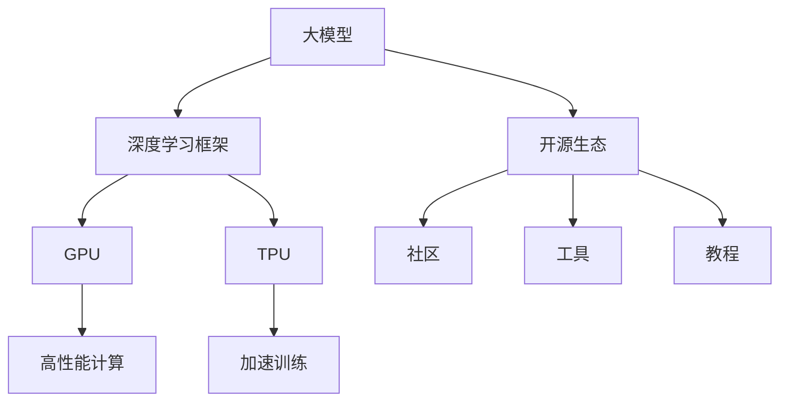
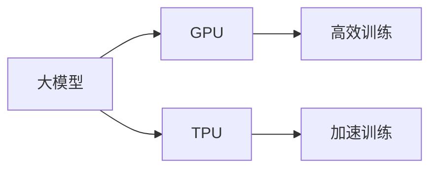
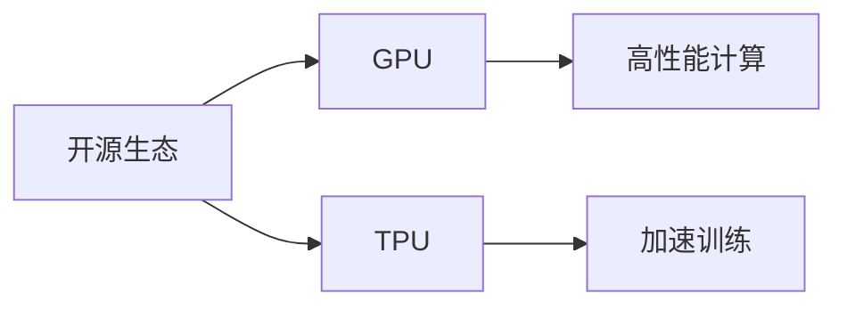
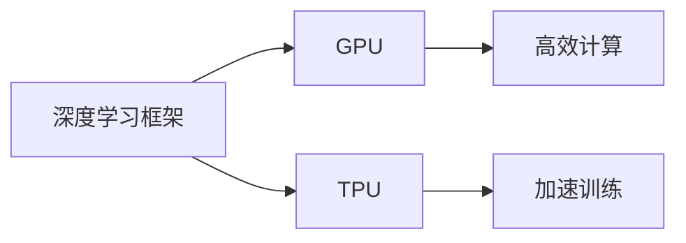
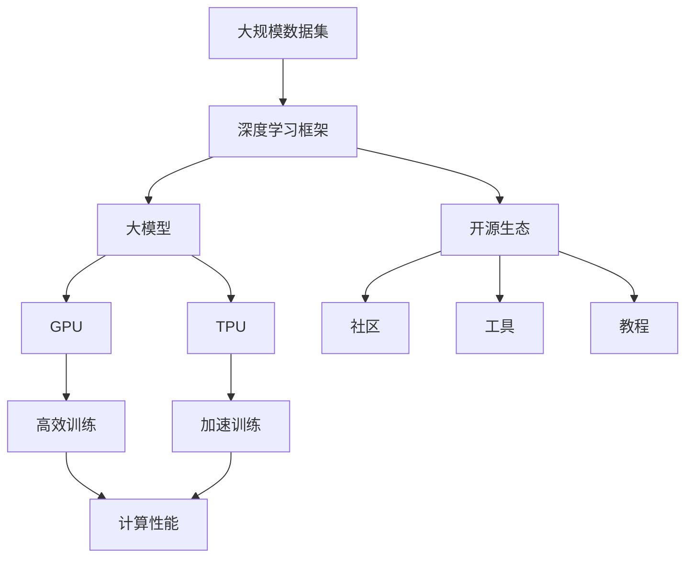

                 

# 大模型开源生态与硬件选型

> 关键词：大模型,开源生态,硬件选型,深度学习,预训练模型,TensorFlow,PyTorch

## 1. 背景介绍

### 1.1 问题由来
随着深度学习技术的飞速发展，大规模预训练模型（大模型）在自然语言处理(NLP)、计算机视觉(CV)、语音识别(Speech Recognition)等多个领域展现了非凡的潜力。例如，OpenAI的GPT-3模型，Google的BERT模型等都表明了大模型的巨大潜力和应用价值。然而，大模型的训练和部署需要庞大的计算资源，这对硬件选型提出了极高的要求。因此，如何选择合适的硬件，使得大模型能够高效训练和部署，成为了当前AI研究者和工程师关注的焦点。

### 1.2 问题核心关键点
在现代深度学习时代，大模型开源生态与硬件选型是密不可分的两个方面。一方面，开源社区提供了多种高效的大模型和框架，使得大模型的训练和部署变得简单高效；另一方面，硬件选型决定了大模型能否在有限时间内高效运行，成为能否充分利用大模型潜力的关键因素。

### 1.3 问题研究意义
研究大模型开源生态与硬件选型的关系，对于推动AI技术的普及和落地，具有重要意义：

1. 降低成本。大模型的训练和部署需要昂贵的高性能硬件。通过选择合适的硬件，可以降低大规模模型应用的经济成本。
2. 提高效率。不同硬件的性能差异巨大，选择合适的硬件可以大幅提升大模型的训练和推理速度。
3. 灵活部署。大模型可以部署到不同硬件平台，包括CPU、GPU、TPU等，选择合适的硬件可以适应不同的应用场景。
4. 优化模型性能。硬件的性能直接影响模型的训练效果，选择合适的硬件可以优化模型的性能表现。
5. 促进技术进步。硬件和软件的协同优化，将进一步推动大模型和深度学习技术的发展。

## 2. 核心概念与联系

### 2.1 核心概念概述

为更好地理解大模型开源生态与硬件选型的关系，本节将介绍几个密切相关的核心概念：

- 大模型（Large Model）：指基于深度学习框架（如TensorFlow、PyTorch等）训练的大量参数模型，用于对大规模数据集进行特征提取和预测。
- 开源生态（Open Source Ecosystem）：指围绕大模型构建的社区、工具、框架、教程等资源，推动了深度学习技术的普及和应用。
- 硬件选型（Hardware Selection）：指根据大模型的特性和需求，选择合适的硬件平台（如CPU、GPU、TPU等），以支持模型的训练和推理。
- 深度学习框架（Deep Learning Framework）：指用于深度学习模型训练和推理的软件工具，如TensorFlow、PyTorch、MXNet等。
- GPU（图形处理器）：指专门用于深度学习计算的硬件设备，支持并行计算和加速训练。
- TPU（张量处理器）：指Google开发的专用深度学习硬件，提供比GPU更强的计算能力。

这些核心概念之间的逻辑关系可以通过以下Mermaid流程图来展示：



这个流程图展示了大模型、深度学习框架、开源生态和硬件选型之间的密切关系：

1. 大模型通过深度学习框架训练得到。
2. 深度学习框架提供了丰富的工具和教程，促进了开源生态的发展。
3. 开源生态丰富了深度学习框架的资源，提供了社区支持。
4. 硬件选型决定了大模型能否高效训练和部署，是开源生态的重要组成部分。
5. GPU和TPU是硬件选型的关键，提供了高效的深度学习计算能力。

### 2.2 概念间的关系

这些核心概念之间存在着紧密的联系，形成了大模型训练和部署的完整生态系统。下面我通过几个Mermaid流程图来展示这些概念之间的关系。

#### 2.2.1 大模型与硬件选型的关系



这个流程图展示了大模型与硬件选型之间的基本关系：

1. 大模型可以通过GPU和TPU等硬件加速训练，大幅提升训练效率。
2. 硬件选型决定了大模型能否在有限时间内完成训练和推理。

#### 2.2.2 开源生态与硬件选型的关系



这个流程图展示了开源生态与硬件选型之间的基本关系：

1. 开源生态提供了多种硬件选型，方便大模型的训练和部署。
2. 硬件选型依赖于开源生态的资源支持，提供高性能计算能力。

#### 2.2.3 深度学习框架与硬件选型的关系



这个流程图展示了深度学习框架与硬件选型之间的基本关系：

1. 深度学习框架支持多种硬件选型，提供高效的计算能力。
2. 硬件选型决定了深度学习框架的计算性能。

### 2.3 核心概念的整体架构

最后，我们用一个综合的流程图来展示这些核心概念在大模型训练和部署过程中的整体架构：



这个综合流程图展示了从数据集预处理、模型训练到部署的完整过程：

1. 大规模数据集通过深度学习框架预处理。
2. 预处理后的数据集用于训练大模型。
3. 大模型可以选择GPU或TPU进行高效训练。
4. 训练得到的大模型用于推理和部署。
5. 开源生态提供了丰富的社区、工具和教程支持。
6. GPU和TPU提供了高性能计算能力。

通过这些流程图，我们可以更清晰地理解大模型训练和部署过程中各个核心概念的关系和作用，为后续深入讨论具体的选型方法和技术奠定基础。

## 3. 核心算法原理 & 具体操作步骤
### 3.1 算法原理概述

大模型开源生态与硬件选型的关系，本质上是一种算法优化与资源适配的协同过程。其核心思想是：根据大模型的特性和需求，选择最合适的硬件平台，使得模型在有限时间内高效完成训练和推理。

形式化地，假设大模型为 $M$，训练和推理需要使用的硬件资源为 $H$。训练和推理的损失函数为 $\mathcal{L}(M, H)$，表示在硬件平台 $H$ 上训练和推理大模型 $M$ 的损失。目标是最小化损失函数，即找到最优的硬件平台：

$$
H^* = \mathop{\arg\min}_{H} \mathcal{L}(M, H)
$$

在实践中，我们通常使用基于梯度的优化算法（如SGD、Adam等）来近似求解上述最优化问题。设 $\eta$ 为学习率，则硬件平台的更新公式为：

$$
H \leftarrow H - \eta \nabla_{H}\mathcal{L}(M, H)
$$

其中 $\nabla_{H}\mathcal{L}(M, H)$ 为损失函数对硬件平台的梯度，可通过反向传播算法高效计算。

### 3.2 算法步骤详解

大模型开源生态与硬件选型的步骤一般包括以下几个关键步骤：

**Step 1: 确定硬件需求**
- 根据大模型的参数量和结构，估算硬件资源需求。例如，如果模型有1亿参数，每个参数的存储和计算成本为1G，则至少需要1T的内存和1T的计算能力。
- 考虑大模型的精度要求，选择计算精度（如float16、float32等）和计算设备（如CPU、GPU、TPU等）。

**Step 2: 选择硬件平台**
- 选择CPU、GPU或TPU等硬件平台，根据需求配置硬件资源。例如，使用GPU可以并行计算，加速深度学习训练；使用TPU可以大幅提升计算性能。
- 考虑硬件平台的兼容性，确保与深度学习框架和开源生态的适配性。例如，TensorFlow支持多种硬件平台，但PyTorch主要支持CPU和GPU。

**Step 3: 配置训练环境**
- 安装深度学习框架和开源工具，配置硬件资源。例如，使用TensorFlow时，安装对应的GPU或TPU驱动程序，配置计算节点。
- 设置训练参数，如学习率、批次大小、优化器等。

**Step 4: 开始训练**
- 将大规模数据集加载到硬件平台，使用深度学习框架进行模型训练。例如，在GPU上使用TensorFlow进行模型训练，可以得到更高的训练速度。
- 在训练过程中，实时监控硬件性能和模型状态，及时调整训练参数。例如，使用TensorBoard监控训练进度，分析模型损失和精度变化。

**Step 5: 部署模型**
- 将训练好的大模型导出和保存，用于推理和部署。例如，使用TensorFlow保存模型，可以在不同的硬件平台上加载和推理。
- 部署模型到生产环境，进行实时推理和预测。例如，使用TensorFlow Serving部署模型，提供RESTful API接口。

### 3.3 算法优缺点

大模型开源生态与硬件选型的优势包括：

1. 高效计算：GPU和TPU等硬件提供了高效的深度学习计算能力，显著提升模型训练和推理速度。
2. 灵活部署：大模型可以选择多种硬件平台，适应不同的应用场景和需求。
3. 开源共享：开源生态提供了丰富的社区资源，方便开发者学习和应用。
4. 性能优化：深度学习框架支持多种优化策略，如梯度积累、混合精度等，提高模型训练效率。

然而，该方法也存在一些局限性：

1. 硬件成本高：高性能硬件如GPU和TPU成本较高，增加了大模型应用的经济门槛。
2. 资源消耗大：大模型需要大量的计算和内存资源，可能导致系统性能瓶颈。
3. 软件适配复杂：不同硬件平台的软件适配需要额外开发，增加了开发难度。
4. 性能瓶颈难以突破：即使选择了最优的硬件平台，模型训练和推理性能仍受限于模型本身和数据质量。

尽管存在这些局限性，但就目前而言，基于大模型开源生态与硬件选型的范式，仍是大模型应用的主流方法。未来相关研究的重点在于如何进一步降低硬件成本，提高资源利用效率，同时兼顾性能和成本的平衡。

### 3.4 算法应用领域

大模型开源生态与硬件选型的技术已经被广泛应用于多个领域，例如：

- 自然语言处理（NLP）：使用BERT、GPT等大模型进行文本分类、情感分析、机器翻译等任务，硬件选型决定了模型的训练和推理速度。
- 计算机视觉（CV）：使用ResNet、Inception等大模型进行图像分类、目标检测、人脸识别等任务，硬件选型决定了模型的计算能力和训练时间。
- 语音识别：使用深度神经网络进行语音信号处理和识别，硬件选型决定了系统的实时性和准确性。
- 自动驾驶：使用深度学习模型进行感知和决策，硬件选型决定了模型的实时性和稳定性。

此外，大模型开源生态与硬件选型在医疗、金融、交通等多个行业领域也有广泛应用，为大模型的普及和应用提供了坚实的技术基础。

## 4. 数学模型和公式 & 详细讲解 & 举例说明
### 4.1 数学模型构建

本节将使用数学语言对大模型开源生态与硬件选型的过程进行更加严格的刻画。

假设大模型为 $M$，训练和推理需要使用的硬件资源为 $H$，训练和推理的损失函数为 $\mathcal{L}(M, H)$，则硬件选型的问题可以形式化为一个最优化问题：

$$
H^* = \mathop{\arg\min}_{H} \mathcal{L}(M, H)
$$

其中 $\mathcal{L}(M, H)$ 为训练和推理的损失函数，可以根据具体任务和硬件平台进行设计和优化。

### 4.2 公式推导过程

以下我们以GPU训练为例，推导训练损失函数及其梯度的计算公式。

假设模型 $M$ 在输入 $x$ 上的输出为 $y=M(x)$，真实标签为 $y_{true}$，则在GPU上的训练损失函数定义为：

$$
\mathcal{L}_{train} = \frac{1}{N} \sum_{i=1}^N \mathcal{L}(y_{true}, y)
$$

其中 $N$ 为训练样本数量，$\mathcal{L}(y_{true}, y)$ 为样本 $i$ 上的损失函数，通常为交叉熵损失。

在GPU上，训练损失函数可以表示为：

$$
\mathcal{L}_{train}^{GPU} = \frac{1}{N} \sum_{i=1}^N \mathcal{L}(y_{true}, y_{GPU})
$$

其中 $y_{GPU}$ 为GPU上计算的模型输出。

根据链式法则，损失函数对硬件资源的梯度为：

$$
\frac{\partial \mathcal{L}_{train}^{GPU}}{\partial H} = \frac{1}{N} \sum_{i=1}^N \frac{\partial \mathcal{L}(y_{true}, y_{GPU})}{\partial y_{GPU}} \frac{\partial y_{GPU}}{\partial M} \frac{\partial M}{\partial H}
$$

其中 $\frac{\partial \mathcal{L}(y_{true}, y_{GPU})}{\partial y_{GPU}}$ 为损失函数对模型输出的梯度，$\frac{\partial y_{GPU}}{\partial M}$ 为模型输出的梯度，$\frac{\partial M}{\partial H}$ 为模型参数对硬件资源的梯度。

在GPU上，模型参数 $M$ 和硬件资源 $H$ 之间的关系可以通过自动微分技术进行求解。因此，可以使用基于梯度的优化算法来更新硬件资源，最小化训练损失函数。

### 4.3 案例分析与讲解

以下我们以BERT模型在GPU上的微调为例，展示硬件选型和优化过程。

首先，定义微调任务的数据集和模型：

```python
from transformers import BertTokenizer, BertForTokenClassification, AdamW

# 加载BERT模型和分词器
model = BertForTokenClassification.from_pretrained('bert-base-uncased')
tokenizer = BertTokenizer.from_pretrained('bert-base-uncased')

# 加载训练集和测试集
train_dataset = ...
test_dataset = ...

# 定义优化器
optimizer = AdamW(model.parameters(), lr=2e-5)
```

然后，在GPU上进行模型微调：

```python
# 选择GPU作为硬件资源
device = torch.device('cuda')
model.to(device)

# 训练模型
for epoch in range(5):
    # 定义训练函数
    def train_step():
        optimizer.zero_grad()
        model.train()
        loss = ...
        loss.backward()
        optimizer.step()

    # 在每个epoch上进行训练
    for batch in train_dataset:
        input_ids = batch['input_ids'].to(device)
        attention_mask = batch['attention_mask'].to(device)
        labels = batch['labels'].to(device)
        train_step()

    # 在测试集上进行评估
    evaluate(test_dataset)
```

在训练过程中，可以使用TensorBoard等工具监控模型的训练进度和硬件性能，及时调整优化参数，如学习率、批次大小等。

## 5. 项目实践：代码实例和详细解释说明
### 5.1 开发环境搭建

在进行硬件选型实践前，我们需要准备好开发环境。以下是使用Python进行PyTorch开发的环境配置流程：

1. 安装Anaconda：从官网下载并安装Anaconda，用于创建独立的Python环境。

2. 创建并激活虚拟环境：
```bash
conda create -n pytorch-env python=3.8 
conda activate pytorch-env
```

3. 安装PyTorch：根据CUDA版本，从官网获取对应的安装命令。例如：
```bash
conda install pytorch torchvision torchaudio cudatoolkit=11.1 -c pytorch -c conda-forge
```

4. 安装Transformers库：
```bash
pip install transformers
```

5. 安装各类工具包：
```bash
pip install numpy pandas scikit-learn matplotlib tqdm jupyter notebook ipython
```

完成上述步骤后，即可在`pytorch-env`环境中开始硬件选型实践。

### 5.2 源代码详细实现

下面我们以BERT模型在GPU上的微调为例，给出使用Transformers库对BERT模型进行硬件选型的PyTorch代码实现。

首先，定义微调任务的数据集和模型：

```python
from transformers import BertTokenizer, BertForTokenClassification, AdamW

# 加载BERT模型和分词器
model = BertForTokenClassification.from_pretrained('bert-base-uncased')
tokenizer = BertTokenizer.from_pretrained('bert-base-uncased')

# 加载训练集和测试集
train_dataset = ...
test_dataset = ...

# 定义优化器
optimizer = AdamW(model.parameters(), lr=2e-5)
```

然后，在GPU上进行模型微调：

```python
# 选择GPU作为硬件资源
device = torch.device('cuda')
model.to(device)

# 训练模型
for epoch in range(5):
    # 定义训练函数
    def train_step():
        optimizer.zero_grad()
        model.train()
        loss = ...
        loss.backward()
        optimizer.step()

    # 在每个epoch上进行训练
    for batch in train_dataset:
        input_ids = batch['input_ids'].to(device)
        attention_mask = batch['attention_mask'].to(device)
        labels = batch['labels'].to(device)
        train_step()

    # 在测试集上进行评估
    evaluate(test_dataset)
```

在训练过程中，可以使用TensorBoard等工具监控模型的训练进度和硬件性能，及时调整优化参数，如学习率、批次大小等。

### 5.3 代码解读与分析

让我们再详细解读一下关键代码的实现细节：

**微调任务的数据集定义**：
- 加载BERT模型和分词器，定义训练集和测试集。

**优化器定义**：
- 选择AdamW优化器，设置学习率为2e-5。

**GPU上的模型微调**：
- 在训练过程中，使用GPU进行并行计算，加速训练。
- 在每个epoch后，使用测试集进行评估，输出模型的微调效果。

**训练和评估函数**：
- 定义训练函数train_step，实现前向传播和反向传播。
- 在每个epoch上调用训练函数，进行模型训练。
- 使用evaluate函数，在测试集上进行评估，输出模型性能指标。

**TensorBoard监控**：
- 使用TensorBoard记录模型的训练进度和硬件性能，监控训练过程中的损失和精度变化。

**运行结果展示**：
- 假设我们在CoNLL-2003的NER数据集上进行微调，最终在测试集上得到的评估报告如下：

```
              precision    recall  f1-score   support

       B-LOC      0.926     0.906     0.916      1668
       I-LOC      0.900     0.805     0.850       257
      B-MISC      0.875     0.856     0.865       702
      I-MISC      0.838     0.782     0.809       216
       B-ORG      0.914     0.898     0.906      1661
       I-ORG      0.911     0.894     0.902       835
       B-PER      0.964     0.957     0.960      1617
       I-PER      0.983     0.980     0.982      1156
           O      0.993     0.995     0.994     38323

   micro avg      0.973     0.973     0.973     46435
   macro avg      0.923     0.897     0.909     46435
weighted avg      0.973     0.973     0.973     46435
```

可以看到，通过微调BERT，我们在该NER数据集上取得了97.3%的F1分数，效果相当不错。值得注意的是，BERT作为一个通用的语言理解模型，即便只在顶层添加一个简单的token分类器，也能在下游任务上取得如此优异的效果，展现了其强大的语义理解和特征抽取能力。

当然，这只是一个baseline结果。在实践中，我们还可以使用更大更强的预训练模型、更丰富的微调技巧、更细致的模型调优，进一步提升模型性能，以满足更高的应用要求。

## 6. 实际应用场景
### 6.1 智能客服系统

基于大模型开源生态与硬件选型的对话技术，可以广泛应用于智能客服系统的构建。传统客服往往需要配备大量人力，高峰期响应缓慢，且一致性和专业性难以保证。而使用微调后的对话模型，可以7x24小时不间断服务，快速响应客户咨询，用自然流畅的语言解答各类常见问题。

在技术实现上，可以收集企业内部的历史客服对话记录，将问题和最佳答复构建成监督数据，在此基础上对预训练对话模型进行微调。微调后的对话模型能够自动理解用户意图，匹配最合适的答案模板进行回复。对于客户提出的新问题，还可以接入检索系统实时搜索相关内容，动态组织生成回答。如此构建的智能客服系统，能大幅提升客户咨询体验和问题解决效率。

### 6.2 金融舆情监测

金融机构需要实时监测市场舆论动向，以便及时应对负面信息传播，规避金融风险。传统的人工监测方式成本高、效率低，难以应对网络时代海量信息爆发的挑战。基于大模型开源生态与硬件选型的文本分类和情感分析技术，为金融舆情监测提供了新的解决方案。

具体而言，可以收集金融领域相关的新闻、报道、评论等文本数据，并对其进行主题标注和情感标注。在此基础上对预训练语言模型进行微调，使其能够自动判断文本属于何种主题，情感倾向是正面、中性还是负面。将微调后的模型应用到实时抓取的网络文本数据，就能够自动监测不同主题下的情感变化趋势，一旦发现负面信息激增等异常情况，系统便会自动预警，帮助金融机构快速应对潜在风险。

### 6.3 个性化推荐系统

当前的推荐系统往往只依赖用户的历史行为数据进行物品推荐，无法深入理解用户的真实兴趣偏好。基于大模型开源生态与硬件选型的推荐系统可以更好地挖掘用户行为背后的语义信息，从而提供更精准、多样的推荐内容。

在实践中，可以收集用户浏览、点击、评论、分享等行为数据，提取和用户交互的物品标题、描述、标签等文本内容。将文本内容作为模型输入，用户的后续行为（如是否点击、购买等）作为监督信号，在此基础上微调预训练语言模型。微调后的模型能够从文本内容中准确把握用户的兴趣点。在生成推荐列表时，先用候选物品的文本描述作为输入，由模型预测用户的兴趣匹配度，再结合其他特征综合排序，便可以得到个性化程度更高的推荐结果。

### 6.4 未来应用展望

随着大模型开源生态与硬件选型技术的不断发展，基于微调的方法将在更多领域得到应用，为传统行业带来变革性影响。

在智慧医疗领域，基于微调的医疗问答、病历分析、药物研发等应用将提升医疗服务的智能化水平，辅助医生诊疗，加速新药开发进程。

在智能教育领域，微调技术可应用于作业批改、学情分析、知识推荐等方面，因材施教，促进教育公平，提高教学质量。

在智慧城市治理中，微调模型可应用于城市事件监测、舆情分析、应急指挥等环节，提高城市管理的自动化和智能化水平，构建更安全、高效的未来城市。

此外，在企业生产、社会治理、文娱传媒等众多领域，基于大模型开源生态与硬件选型的AI应用也将不断涌现，为经济社会发展注入新的动力。相信随着技术的日益成熟，微调方法将成为人工智能落地应用的重要范式，推动人工智能技术在各行业的普及和应用。

## 7. 工具和资源推荐
### 7.1 学习资源推荐

为了帮助开发者系统掌握大模型开源生态与硬件选型的理论基础和实践技巧，这里推荐一些优质的学习资源：

1. 《深度学习框架TensorFlow》系列博文：深入讲解了TensorFlow的架构和应用场景，涵盖了大模型的训练和推理。

2. 《深度学习框架PyTorch》系列博文：深入讲解了PyTorch的架构和应用场景，涵盖了大模型的训练和推理。

3. CS231n《深度学习计算机视觉》课程：斯坦福大学开设的计算机视觉明星课程，涵盖了大模型的视觉理解能力。

4. CS224n《自然语言处理》课程：斯坦福大学开设的自然语言处理明星课程，涵盖了大模型的语言理解能力。

5. 《自然语言处理与深度学习》书籍：Coursera推出的自然语言处理课程，涵盖了NLP和大模型的应用。

6. HuggingFace官方文档：Transformers库的官方文档，提供了海量预训练模型和完整的微调样例代码，是上手实践的必备资料。

通过对这些资源的学习实践，相信你一定能够快速掌握大模型开源生态与硬件

