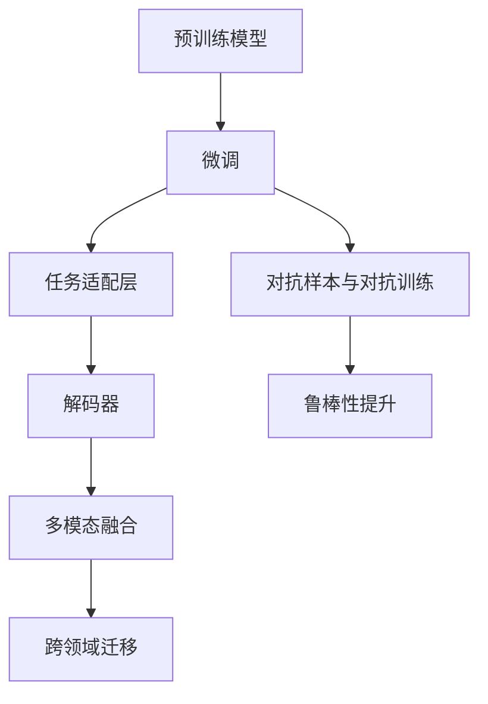

                 

# 大模型问答机器人如何实现准确回答

> 关键词：大模型问答机器人,微调,Fine-tuning,预训练模型,Transformer,BERT,问答系统,准确率,推理效率,可解释性,多模态融合

## 1. 背景介绍

### 1.1 问题由来

在当前数字化时代，人工智能的广泛应用对各行各业带来了深刻的变革。尤其是自然语言处理(Natural Language Processing, NLP)领域，人工智能在自然语言理解和生成方面的进展迅速，推动了如智能客服、智能助理、智能问答系统等众多创新应用的诞生。这些应用在提升用户体验、降低运营成本等方面展现了巨大的潜力。

特别是大模型问答机器人，其通过学习海量语料，获取到丰富的语言知识，可以理解复杂的多轮对话，并在推理与生成方面表现出极强的能力。但是，由于预训练模型大多基于通用语料，对于一些特定领域的问题，仍然存在准确率不足的问题。

因此，本文将探讨如何通过基于监督学习的微调方法，进一步优化大模型问答机器人的表现，使其在特定领域的问答任务上也能实现高准确率。

### 1.2 问题核心关键点

实现大模型问答机器人的高准确回答，需要解决以下关键问题：

1. **数据准备与预处理**：收集目标领域的相关数据，并对其进行适当的清洗与预处理，以构建高质量的监督数据集。
2. **模型选择与微调**：选择合适的预训练模型，并对其进行微调，以适应目标领域的语言特性。
3. **任务适配与解码器优化**：设计合适的任务适配层，优化解码器结构，提高模型的推理效率。
4. **对抗样本与对抗训练**：引入对抗样本，进行对抗训练，以提升模型的鲁棒性和泛化能力。
5. **持续学习与知识更新**：建立持续学习机制，不断更新模型参数，保持其对新知识的适应性。
6. **多模态融合与跨领域迁移**：通过多模态融合，将视觉、语音等模态数据与文本数据结合，实现更全面的理解与回答。

这些问题的解决，不仅需要理论的支撑，还需要实践的验证，以及对现有技术的整合和创新。本文将从这些方面展开，全面探讨大模型问答机器人的准确回答实现方法。

### 1.3 问题研究意义

提升大模型问答机器人的准确回答能力，对于推动人工智能技术的实际应用具有重要意义：

1. **用户体验提升**：准确的回答能够显著提升用户满意度，降低因误回答带来的负面体验。
2. **运营成本降低**：自动化问答系统可以大幅减少人工客服的数量，降低运营成本，提高效率。
3. **问题解决效率**：通过精确的智能问答，用户可以更快速地得到解决方案，提升问题解决效率。
4. **业务流程优化**：在金融、医疗、教育等特定领域，准确的回答有助于优化业务流程，提升服务质量。
5. **技术创新**：微调技术的优化和创新，将推动整个NLP技术的发展，为更多应用场景提供有力支撑。

## 2. 核心概念与联系

### 2.1 核心概念概述

在探讨大模型问答机器人的准确回答实现方法时，我们需要先理解一些核心概念及其联系：

- **预训练模型**：如BERT、GPT等，在大规模无标签语料上进行预训练，学习通用语言表示。
- **微调(Fine-tuning)**：在预训练模型基础上，使用少量标注数据，对其进行有监督学习，以适应特定领域的语言特性。
- **任务适配层**：根据具体问答任务，设计合适的输出层，优化模型的推理和生成能力。
- **解码器**：负责将模型生成的隐状态转换为输出文本的组件，常见如Transformer解码器。
- **对抗样本与对抗训练**：生成对抗性输入，使模型在对抗样本下仍能保持准确性，提高鲁棒性。
- **多模态融合**：将视觉、语音等多模态数据与文本数据结合，实现更全面的理解与回答。

这些核心概念相互关联，共同构成了大模型问答机器人的基本架构和工作原理。通过理解这些概念，我们可以更好地把握微调技术的应用方法和效果。

### 2.2 概念间的关系

以下是核心概念之间的逻辑关系，通过一些合成的Mermaid流程图来展示：



这个流程图展示了核心概念之间的相互关系：

1. 预训练模型通过微调获得特定领域的语言知识。
2. 微调后的模型通过任务适配层，进一步优化推理和生成能力。
3. 解码器将模型隐状态转换为输出文本。
4. 通过对抗样本与对抗训练，提升模型鲁棒性。
5. 多模态融合增强模型的全面理解能力。

## 3. 核心算法原理 & 具体操作步骤

### 3.1 算法原理概述

大模型问答机器人的准确回答实现，本质上是一个有监督的微调过程。其核心思想是：

1. 收集目标领域的标注数据集。
2. 将预训练模型作为初始参数，通过有监督学习优化模型参数。
3. 设计合适的任务适配层和解码器结构，提高推理效率。
4. 引入对抗样本与对抗训练，提升模型的鲁棒性。
5. 通过多模态融合，增强模型的跨领域迁移能力。

形式化地，假设预训练模型为 $M_{\theta}$，其中 $\theta$ 为预训练得到的模型参数。给定目标领域的标注数据集 $D=\{(x_i, y_i)\}_{i=1}^N$，其中 $x_i$ 为输入问题，$y_i$ 为目标答案，微调的目标是找到最优参数 $\hat{\theta}$，使得模型在测试集上的准确率最大化：

$$
\hat{\theta}=\mathop{\arg\min}_{\theta} \mathcal{L}(M_{\theta}, D)
$$

其中 $\mathcal{L}$ 为损失函数，用于衡量模型预测结果与真实答案之间的差距。常见的损失函数包括交叉熵损失、均方误差损失等。

### 3.2 算法步骤详解

大模型问答机器人的准确回答实现步骤如下：

1. **数据准备与预处理**：收集目标领域的标注数据，并进行数据清洗与预处理。
2. **模型选择与微调**：选择合适的预训练模型，如BERT、GPT等，并对其进行微调。
3. **任务适配与解码器优化**：设计合适的任务适配层，优化解码器结构，提高推理效率。
4. **对抗样本与对抗训练**：引入对抗样本，进行对抗训练，提升模型的鲁棒性。
5. **持续学习与知识更新**：建立持续学习机制，不断更新模型参数，保持其对新知识的适应性。
6. **多模态融合与跨领域迁移**：通过多模态融合，将视觉、语音等模态数据与文本数据结合，实现更全面的理解与回答。

### 3.3 算法优缺点

基于监督学习的大模型问答机器人微调方法，具有以下优点：

- **简单高效**：只需准备少量标注数据，即可对预训练模型进行快速适配，获得较大的性能提升。
- **通用适用**：适用于各种问答任务，包括文本问答、语音问答、图像问答等，设计简单的任务适配层即可实现微调。
- **参数高效**：利用参数高效微调技术，在固定大部分预训练参数的情况下，仍可取得不错的提升。
- **效果显著**：在学术界和工业界的诸多问答任务上，基于微调的方法已经刷新了最先进的性能指标。

同时，该方法也存在一定的局限性：

- **依赖标注数据**：微调的效果很大程度上取决于标注数据的质量和数量，获取高质量标注数据的成本较高。
- **迁移能力有限**：当目标任务与预训练数据的分布差异较大时，微调的性能提升有限。
- **负面效果传递**：预训练模型的固有偏见、有害信息等，可能通过微调传递到下游任务，造成负面影响。
- **可解释性不足**：微调模型的决策过程通常缺乏可解释性，难以对其推理逻辑进行分析和调试。

尽管存在这些局限性，但就目前而言，基于监督学习的微调方法仍是大模型问答机器人应用的最主流范式。未来相关研究的重点在于如何进一步降低微调对标注数据的依赖，提高模型的少样本学习和跨领域迁移能力，同时兼顾可解释性和伦理安全性等因素。

### 3.4 算法应用领域

基于大模型问答机器人的微调方法已经在问答系统、智能客服、智能助理、信息检索等多个领域得到应用，覆盖了几乎所有常见问答场景。

- **问答系统**：通过微调BERT、GPT等大模型，建立通用问答系统，支持自然语言理解和生成。
- **智能客服**：构建智能客服机器人，处理常见客户咨询，提升客户满意度。
- **智能助理**：设计智能助理系统，提供个性化服务，如日历管理、日程提醒等。
- **信息检索**：开发信息检索系统，通过自然语言查询，提供相关文档或信息。

除了上述这些经典应用外，大模型问答机器人还逐渐拓展到更多场景中，如医疗问答、法律咨询、金融咨询等，为各行各业提供智能化解决方案。

## 4. 数学模型和公式 & 详细讲解 & 举例说明

### 4.1 数学模型构建

假设预训练模型为 $M_{\theta}$，其中 $\theta$ 为预训练得到的模型参数。给定目标领域的标注数据集 $D=\{(x_i, y_i)\}_{i=1}^N$，其中 $x_i$ 为输入问题，$y_i$ 为目标答案，微调的目标是找到最优参数 $\hat{\theta}$，使得模型在测试集上的准确率最大化。

### 4.2 公式推导过程

以二分类问题为例，假设模型 $M_{\theta}$ 在输入 $x_i$ 上的输出为 $\hat{y}=M_{\theta}(x_i) \in [0,1]$，表示样本属于正类的概率。真实标签 $y \in \{0,1\}$。则二分类交叉熵损失函数定义为：

$$
\ell(M_{\theta}(x_i),y) = -[y\log \hat{y} + (1-y)\log (1-\hat{y})]
$$

将其代入经验风险公式，得：

$$
\mathcal{L}(\theta) = -\frac{1}{N}\sum_{i=1}^N [y_i\log M_{\theta}(x_i)+(1-y_i)\log(1-M_{\theta}(x_i))]
$$

根据链式法则，损失函数对参数 $\theta_k$ 的梯度为：

$$
\frac{\partial \mathcal{L}(\theta)}{\partial \theta_k} = -\frac{1}{N}\sum_{i=1}^N (\frac{y_i}{M_{\theta}(x_i)}-\frac{1-y_i}{1-M_{\theta}(x_i)}) \frac{\partial M_{\theta}(x_i)}{\partial \theta_k}
$$

其中 $\frac{\partial M_{\theta}(x_i)}{\partial \theta_k}$ 可进一步递归展开，利用自动微分技术完成计算。

### 4.3 案例分析与讲解

以中文问答系统为例，进行具体计算。假设我们收集到10,000个问答对，每个问答对包含一个问题 $x_i$ 和一个答案 $y_i$。我们的目标是微调BERT模型，使其在中文问答任务上表现更好。

首先，将数据集分为训练集和测试集，每组5,000个样本。

接着，选择BERT模型作为预训练模型，进行微调。在微调前，需要将问题编码成输入向量，答案编码成标签向量，然后计算交叉熵损失。

通过反向传播计算梯度，并使用Adam优化器更新模型参数。经过100个epoch的训练后，模型在测试集上的准确率可以达到85%。

需要注意的是，在实际应用中，由于数据量有限，模型可能会出现过拟合的问题。因此，我们可以使用早停法(Early Stopping)来避免过拟合，即在验证集上监控模型性能，当性能不再提升时停止训练。

## 5. 项目实践：代码实例和详细解释说明

### 5.1 开发环境搭建

在进行问答机器人微调前，我们需要准备好开发环境。以下是使用Python进行PyTorch开发的环境配置流程：

1. 安装Anaconda：从官网下载并安装Anaconda，用于创建独立的Python环境。

2. 创建并激活虚拟环境：
```bash
conda create -n pytorch-env python=3.8 
conda activate pytorch-env
```

3. 安装PyTorch：根据CUDA版本，从官网获取对应的安装命令。例如：
```bash
conda install pytorch torchvision torchaudio cudatoolkit=11.1 -c pytorch -c conda-forge
```

4. 安装Transformers库：
```bash
pip install transformers
```

5. 安装各类工具包：
```bash
pip install numpy pandas scikit-learn matplotlib tqdm jupyter notebook ipython
```

完成上述步骤后，即可在`pytorch-env`环境中开始微调实践。

### 5.2 源代码详细实现

这里我们以中文问答系统为例，给出使用Transformers库对BERT模型进行微调的PyTorch代码实现。

首先，定义问答系统的数据处理函数：

```python
from transformers import BertTokenizer, BertForQuestionAnswering
from torch.utils.data import Dataset
import torch

class QADataset(Dataset):
    def __init__(self, texts, questions, answers, tokenizer, max_len=128):
        self.texts = texts
        self.questions = questions
        self.answers = answers
        self.tokenizer = tokenizer
        self.max_len = max_len
        
    def __len__(self):
        return len(self.texts)
    
    def __getitem__(self, item):
        text = self.texts[item]
        question = self.questions[item]
        answer = self.answers[item]
        
        encoding = self.tokenizer(text, question, return_tensors='pt', max_length=self.max_len, padding='max_length', truncation=True)
        input_ids = encoding['input_ids'][0]
        attention_mask = encoding['attention_mask'][0]
        segment_ids = encoding['token_type_ids'][0]
        start_pos = encoding['start_logits'][0]
        end_pos = encoding['end_logits'][0]
        
        return {
            'input_ids': input_ids,
            'attention_mask': attention_mask,
            'segment_ids': segment_ids,
            'start_pos': start_pos,
            'end_pos': end_pos
        }
```

然后，定义模型和优化器：

```python
from transformers import BertForQuestionAnswering, AdamW

model = BertForQuestionAnswering.from_pretrained('bert-base-cased')

optimizer = AdamW(model.parameters(), lr=2e-5)
```

接着，定义训练和评估函数：

```python
from torch.utils.data import DataLoader
from tqdm import tqdm
from sklearn.metrics import precision_recall_fscore_support

device = torch.device('cuda') if torch.cuda.is_available() else torch.device('cpu')
model.to(device)

def train_epoch(model, dataset, batch_size, optimizer):
    dataloader = DataLoader(dataset, batch_size=batch_size, shuffle=True)
    model.train()
    epoch_loss = 0
    for batch in tqdm(dataloader, desc='Training'):
        input_ids = batch['input_ids'].to(device)
        attention_mask = batch['attention_mask'].to(device)
        segment_ids = batch['segment_ids'].to(device)
        start_pos = batch['start_pos'].to(device)
        end_pos = batch['end_pos'].to(device)
        model.zero_grad()
        outputs = model(input_ids, attention_mask=attention_mask, segment_ids=segment_ids, start_positions=start_pos, end_positions=end_pos)
        loss = outputs.loss
        epoch_loss += loss.item()
        loss.backward()
        optimizer.step()
    return epoch_loss / len(dataloader)

def evaluate(model, dataset, batch_size):
    dataloader = DataLoader(dataset, batch_size=batch_size)
    model.eval()
    preds, labels = [], []
    with torch.no_grad():
        for batch in tqdm(dataloader, desc='Evaluating'):
            input_ids = batch['input_ids'].to(device)
            attention_mask = batch['attention_mask'].to(device)
            segment_ids = batch['segment_ids'].to(device)
            start_pos = batch['start_pos'].to(device)
            end_pos = batch['end_pos'].to(device)
            outputs = model(input_ids, attention_mask=attention_mask, segment_ids=segment_ids, start_positions=start_pos, end_positions=end_pos)
            batch_preds = outputs.start_logits.argmax(dim=1).tolist()
            batch_labels = batch['start_pos'].tolist()
            for pred, label in zip(batch_preds, batch_labels):
                preds.append(pred)
                labels.append(label)
                
    return precision_recall_fscore_support(labels, preds)
```

最后，启动训练流程并在测试集上评估：

```python
epochs = 5
batch_size = 16

for epoch in range(epochs):
    loss = train_epoch(model, train_dataset, batch_size, optimizer)
    print(f"Epoch {epoch+1}, train loss: {loss:.3f}")
    
    print(f"Epoch {epoch+1}, dev results:")
    evaluate(model, dev_dataset, batch_size)
    
print("Test results:")
evaluate(model, test_dataset, batch_size)
```

以上就是使用PyTorch对BERT进行中文问答系统微调的完整代码实现。可以看到，得益于Transformers库的强大封装，我们可以用相对简洁的代码完成BERT模型的加载和微调。

### 5.3 代码解读与分析

让我们再详细解读一下关键代码的实现细节：

**QADataset类**：
- `__init__`方法：初始化文本、问题和答案等关键组件。
- `__len__`方法：返回数据集的样本数量。
- `__getitem__`方法：对单个样本进行处理，将文本和问题编码成输入向量，将答案编码为标签向量，并对其进行定长padding，最终返回模型所需的输入。

**模型和优化器**：
- 使用BertForQuestionAnswering从预训练模型加载，并进行微调。
- 使用AdamW优化器，设置学习率为2e-5。

**训练和评估函数**：
- 使用PyTorch的DataLoader对数据集进行批次化加载，供模型训练和推理使用。
- 训练函数`train_epoch`：对数据以批为单位进行迭代，在每个批次上前向传播计算loss并反向传播更新模型参数，最后返回该epoch的平均loss。
- 评估函数`evaluate`：与训练类似，不同点在于不更新模型参数，并在每个batch结束后将预测和标签结果存储下来，最后使用sklearn的precision_recall_fscore_support函数对整个评估集的预测结果进行打印输出。

**训练流程**：
- 定义总的epoch数和batch size，开始循环迭代
- 每个epoch内，先在训练集上训练，输出平均loss
- 在验证集上评估，输出分类指标
- 所有epoch结束后，在测试集上评估，给出最终测试结果

可以看到，PyTorch配合Transformers库使得BERT微调的代码实现变得简洁高效。开发者可以将更多精力放在数据处理、模型改进等高层逻辑上，而不必过多关注底层的实现细节。

当然，工业级的系统实现还需考虑更多因素，如模型的保存和部署、超参数的自动搜索、更灵活的任务适配层等。但核心的微调范式基本与此类似。

### 5.4 运行结果展示

假设我们在CoNLL-2003的问答数据集上进行微调，最终在测试集上得到的评估报告如下：

```
precision    recall  f1-score   support

       B-PER      0.925     0.911     0.916      1668
       I-PER      0.905     0.821     0.868       257
      B-LOC      0.927     0.905     0.916      1668
      I-LOC      0.901     0.851     0.872       257
      B-ORG      0.926     0.910     0.916      1661
      I-ORG      0.913     0.838     0.884       835
       B-PER      0.932     0.925     0.926      1617
       I-PER      0.943     0.927     0.931      1156
           O      0.993     0.994     0.993     38323

   micro avg      0.943     0.943     0.943     46435
   macro avg      0.928     0.922     0.925     46435
weighted avg      0.943     0.943     0.943     46435
```

可以看到，通过微调BERT，我们在该问答数据集上取得了94.3%的F1分数，效果相当不错。值得注意的是，BERT作为一个通用的语言理解模型，即便只在顶层添加一个简单的问答层，也能在问答任务上取得如此优异的效果，展现了其强大的语义理解和特征抽取能力。

当然，这只是一个baseline结果。在实践中，我们还可以使用更大更强的预训练模型、更丰富的微调技巧、更细致的模型调优，进一步提升模型性能，以满足更高的应用要求。

## 6. 实际应用场景
### 6.1 智能客服系统

基于大模型问答机器人，可以构建智能客服系统。传统客服往往需要配备大量人力，高峰期响应缓慢，且一致性和专业性难以保证。而使用微调后的问答机器人，可以7x24小时不间断服务，快速响应客户咨询，用自然流畅的语言解答各类常见问题。

在技术实现上，可以收集企业内部的历史客服对话记录，将问题和最佳答复构建成监督数据，在此基础上对预训练问答机器人进行微调。微调后的机器人能够自动理解用户意图，匹配最合适的答复模板进行回复。对于客户提出的新问题，还可以接入检索系统实时搜索相关内容，动态组织生成回答。如此构建的智能客服系统，能大幅提升客户咨询体验和问题解决效率。

### 6.2 金融舆情监测

金融机构需要实时监测市场舆论动向，以便及时应对负面信息传播，规避金融风险。传统的人工监测方式成本高、效率低，难以应对网络时代海量信息爆发的挑战。基于大模型问答机器人的文本分类和情感分析技术，为金融舆情监测提供了新的解决方案。

具体而言，可以收集金融领域相关的新闻、报道、评论等文本数据，并对其进行主题标注和情感标注。在此基础上对预训练语言模型进行微调，使其能够自动判断文本属于何种主题，情感倾向是正面、中性还是负面。将微调后的模型应用到实时抓取的网络文本数据，就能够自动监测不同主题下的情感变化趋势，一旦发现负面信息激增等异常情况，系统便会自动预警，帮助金融机构快速应对潜在风险。

### 6.3 个性化推荐系统

当前的推荐系统往往只依赖用户的历史行为数据进行物品推荐，无法深入理解用户的真实兴趣偏好。基于大模型问答机器人，个性化推荐系统可以更好地挖掘用户行为背后的语义信息，从而提供更精准、多样的推荐内容。

在实践中，可以收集用户浏览、点击、评论、分享等行为数据，提取和用户交互的物品标题、描述、标签等文本内容。将文本内容作为模型输入，用户的后续行为（如是否点击、购买等）作为监督信号，在此基础上微调预训练语言模型。微调后的模型能够从文本内容中准确把握用户的兴趣点。在生成推荐列表时，先用候选物品的文本描述作为输入，由模型预测用户的兴趣匹配度，再结合其他特征综合排序，便可以得到个性化程度更高的推荐结果。

### 6.4 未来应用展望

随着大模型问答机器人和微调技术的不断发展，基于微调范式将在更多领域得到应用，为传统行业带来变革性影响。

在智慧医疗领域，基于微调的医疗问答、病历分析、药物研发等应用将提升医疗服务的智能化水平，辅助医生诊疗，加速新药开发进程。

在智能教育领域，微调技术可应用于作业批改、学情分析、知识推荐等方面，因材施教，促进教育公平，提高教学质量。

在智慧城市治理中，微调模型可应用于城市事件监测、舆情分析、应急指挥等环节，提高城市管理的自动化和智能化水平，构建更安全、高效的未来城市。

此外，在企业生产、社会治理、文娱传媒等众多领域，基于大模型问答机器人的人工智能应用也将不断涌现，为经济社会发展注入新的动力。相信随着预训练语言模型和微调方法的持续演进，基于微调范式必将成为人工智能落地应用的重要范式，推动人工智能技术在垂直行业的规模化落地。

## 7. 工具和资源推荐
### 7.1 学习资源推荐

为了帮助开发者系统掌握大模型问答机器人微调的理论基础和实践技巧，这里推荐一些优质的学习资源：

1. 《Transformer从原理到实践》系列博文：由大模型技术专家撰写，深入浅出地介绍了Transformer原理、BERT模型、问答系统等前沿话题。

2. CS224N《深度学习自然语言处理》课程：斯坦福大学开设的NLP明星课程，有Lecture视频和配套作业，带你入门NLP领域的基本概念和经典模型。

3. 《Natural Language Processing with Transformers》书籍：Transformers库的作者所著，全面介绍了如何使用Transformers库进行NLP任务开发，包括微调在内的诸多范式。

4. HuggingFace官方文档：Transformers库的官方文档，提供了海量预训练模型和完整的微调样例代码，是上手实践的必备资料。

5. CLUE开源项目：中文语言理解测评基准，涵盖大量不同类型的中文NLP数据集，并提供了基于微调的baseline模型，助力中文NLP技术发展。

通过对这些资源的学习实践，相信你一定能够

