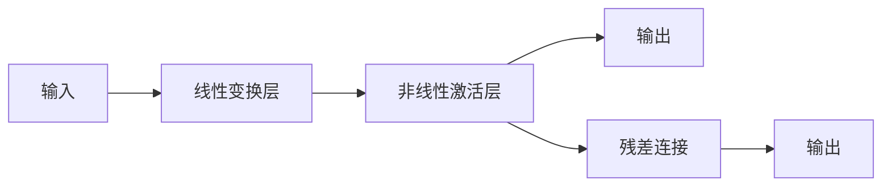
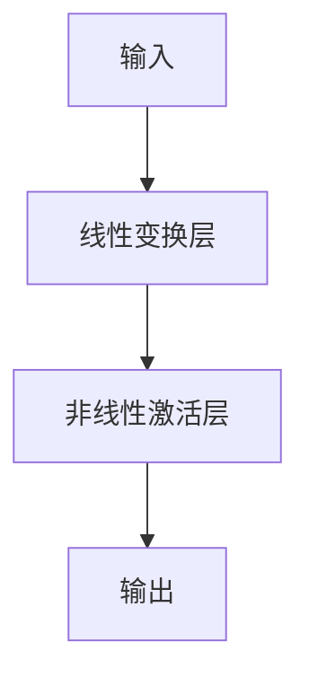
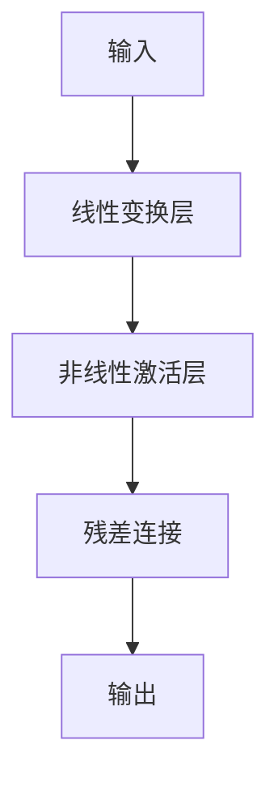
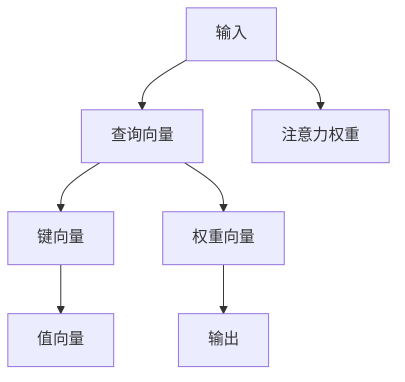

                 

# 大规模语言模型从理论到实践 前馈层

> 关键词：大规模语言模型,前馈层,Transformer,自注意力机制,神经网络,理论推导,实践应用

## 1. 背景介绍

### 1.1 问题由来

随着深度学习技术的发展，大规模语言模型（Large Language Model, LLM）在自然语言处理（Natural Language Processing, NLP）领域取得了显著进展。自2018年OpenAI发布的GPT-1以来，各类预训练语言模型不断涌现，并在各种下游任务中取得了优异的性能。

其中，Transformer模型是一种基于自注意力机制的神经网络结构，因其高效性和准确性，成为构建大规模语言模型的首选。Transformer的核心组成部分是前馈层（Feedforward Layer），它负责对输入进行更深层次的特征提取和变换。

### 1.2 问题核心关键点

前馈层的核心原理在于其“逐层变换”的特性，即将输入信息通过多个全连接层进行一系列的线性变换和非线性激活，使得信息能够在模型中不断抽象和演化，最终输出更高层次的语义表示。其核心过程包括线性变换、非线性激活、残差连接等。

前馈层的具体实现可以基于一些经典的前馈神经网络，如单层前馈网络（FFN）、残差网络（ResNet）等。其中，单层前馈网络是最基本的形式，由一个线性变换层和一个非线性激活层组成。

### 1.3 问题研究意义

研究前馈层有助于更深入地理解Transformer模型的内部机制，从而设计更高效的神经网络结构和更精准的模型参数。此外，前馈层的理论研究与实践应用相互促进，能够推动大规模语言模型在更广泛的领域取得突破性进展。

## 2. 核心概念与联系

### 2.1 核心概念概述

为了更好地理解前馈层的原理与结构，本节将介绍几个关键概念：

- 前馈层（Feedforward Layer）：指在神经网络中，将输入信息通过一系列线性变换和非线性激活进行深度特征提取和抽象的层。是Transformer模型的核心组件之一。
- 单层前馈网络（FFN）：由一个线性变换层和一个非线性激活层组成，是前馈层的基本形式。
- 残差网络（ResNet）：通过残差连接的方式，将原始输入和经过多次变换后的信息叠加，进一步增强了模型的表达能力和稳定性。
- 自注意力机制（Self-Attention Mechanism）：Transformer模型的关键机制，用于计算输入中不同位置的权重，以便对信息进行全局理解和聚焦。

这些概念之间存在紧密的联系，共同构成了Transformer模型的工作机制。以下通过Mermaid流程图展示前馈层的核心结构：



该流程图展示了前馈层的典型结构，包括线性变换、非线性激活和残差连接等关键步骤。

### 2.2 概念间的关系

这些核心概念之间通过特定的方式相互连接，形成了前馈层的完整工作机制。以下通过几个Mermaid流程图展示这些概念之间的关系：

#### 2.2.1 前馈层的结构



#### 2.2.2 单层前馈网络


#### 2.2.3 残差网络



#### 2.2.4 自注意力机制



这些图表展示了前馈层的基本结构和具体实现方式，反映了其在线性变换、非线性激活、残差连接和自注意力机制等核心组件上的设计思路。

### 2.3 核心概念的整体架构

最后，通过一个综合的Mermaid流程图展示前馈层在大规模语言模型中的整体架构：


该图表展示了从输入到输出的整个处理流程，其中前馈层作为核心组件，通过自注意力机制和残差连接，将输入信息逐层变换，最终输出高层次的语义表示。

## 3. 核心算法原理 & 具体操作步骤
### 3.1 算法原理概述

前馈层作为Transformer模型中重要的组成部分，其核心工作原理是通过一系列线性变换和非线性激活，对输入信息进行特征提取和抽象。其具体过程包括：

- 线性变换：通过一个可学习的权重矩阵将输入信息映射到更高维度的空间。
- 非线性激活：引入激活函数（如ReLU、GELU等），增加模型的非线性表达能力。
- 残差连接：将原始输入和经过线性变换和非线性激活后的信息进行叠加，确保信息的传递和更新。

通过这些步骤，前馈层能够对输入信息进行深度特征提取和抽象，从而生成更高层次的语义表示。

### 3.2 算法步骤详解

以下详细介绍前馈层的具体实现步骤：

1. **输入层**：将输入序列通过词嵌入（Word Embedding）转换为向量形式，即$X = [x_1, x_2, ..., x_n]$，其中每个词嵌入为$x_i \in \mathbb{R}^d$，$d$为词嵌入的维度。

2. **线性变换层**：对输入向量进行线性变换，得到变换后的向量$Y = \text{W}X + \text{b}$，其中$\text{W}$为可学习权重矩阵，$\text{b}$为偏置项。

3. **非线性激活层**：对变换后的向量进行非线性激活，通常使用ReLU或GELU函数，即$Z = \sigma(Y)$。

4. **输出层**：将激活后的向量再次进行线性变换，得到最终的输出向量$\hat{X} = \text{V}Z + \text{c}$，其中$\text{V}$为可学习权重矩阵，$\text{c}$为偏置项。

5. **残差连接**：将原始输入$X$和变换后的输出$\hat{X}$进行残差连接，即$Z = \text{W}X + \text{b} + \hat{X}$，最终输出$Z$。

### 3.3 算法优缺点

前馈层的设计和实现具有以下优点：

- 深度特征提取：通过多层线性变换和非线性激活，能够对输入信息进行深度特征提取，生成更高层次的语义表示。
- 非线性表达：通过引入非线性激活函数，增加了模型的非线性表达能力，提高了模型的复杂度和表现力。
- 残差连接：残差连接设计能够确保信息的传递和更新，避免了梯度消失问题，提高了模型的稳定性。

同时，前馈层也存在一些缺点：

- 计算复杂度高：由于多层线性变换和非线性激活，前馈层的计算复杂度较高，对计算资源要求较高。
- 参数量大：前馈层的权重矩阵和偏置项数量较大，增加了模型训练和推理的计算负担。
- 对输入依赖性强：前馈层的输出高度依赖于输入序列，若输入序列较长，模型计算时间将显著增加。

### 3.4 算法应用领域

前馈层作为一种通用的神经网络组件，在NLP领域得到了广泛的应用。以下是几个典型应用场景：

- 文本分类：通过前馈层对文本进行特征提取和抽象，生成高层次语义表示，用于分类任务的建模。
- 机器翻译：前馈层可以用于对输入和输出的序列进行特征提取，生成源语言和目标语言之间的映射关系。
- 文本生成：通过前馈层生成连续的文本序列，用于文本生成任务的建模。
- 命名实体识别：前馈层可以用于对输入序列进行特征提取，生成词级别的标签表示，用于命名实体识别的建模。
- 语义角色标注：前馈层可以用于对输入序列进行特征提取，生成句子级别的语义角色标注信息，用于语义角色标注任务的建模。

## 4. 数学模型和公式 & 详细讲解 & 举例说明

### 4.1 数学模型构建

前馈层的数学模型构建主要基于线性变换和非线性激活的设计。以下详细介绍前馈层的数学模型及其参数。

设输入序列为$X = [x_1, x_2, ..., x_n]$，其中每个词嵌入为$x_i \in \mathbb{R}^d$，$d$为词嵌入的维度。前馈层的线性变换和非线性激活可以表示为：

$$
Y = \text{W}X + \text{b} \quad \text{(线性变换层)}
$$

$$
Z = \sigma(Y) \quad \text{(非线性激活层)}
$$

其中，$\text{W}$和$\text{b}$为可学习参数，$\sigma$为非线性激活函数，通常使用ReLU或GELU函数。

### 4.2 公式推导过程

以下详细推导前馈层的公式和计算过程。

首先，考虑前馈层的线性变换层，将输入向量$X$进行线性变换，得到变换后的向量$Y$：

$$
Y = \text{W}X + \text{b} = \begin{bmatrix} \text{W}_1 & \text{W}_2 & ... & \text{W}_n \\ \end{bmatrix} \begin{bmatrix} x_1 \\ x_2 \\ ... \\ x_n \end{bmatrix} + \begin{bmatrix} b_1 \\ b_2 \\ ... \\ b_n \end{bmatrix}
$$

其中，$\text{W} = \begin{bmatrix} \text{W}_1 & \text{W}_2 & ... & \text{W}_n \\ \end{bmatrix}$为可学习权重矩阵，$\text{b} = \begin{bmatrix} b_1 \\ b_2 \\ ... \\ b_n \end{bmatrix}$为偏置项。

接着，对变换后的向量$Y$进行非线性激活，得到激活后的向量$Z$：

$$
Z = \sigma(Y) = \sigma(\text{W}X + \text{b})
$$

其中，$\sigma$为激活函数，通常使用ReLU或GELU函数。

最后，将激活后的向量$Z$再次进行线性变换，得到最终输出向量$\hat{X}$：

$$
\hat{X} = \text{V}Z + \text{c} = \begin{bmatrix} \text{V}_1 & \text{V}_2 & ... & \text{V}_n \\ \end{bmatrix} \begin{bmatrix} z_1 \\ z_2 \\ ... \\ z_n \end{bmatrix} + \begin{bmatrix} c_1 \\ c_2 \\ ... \\ c_n \end{bmatrix}
$$

其中，$\text{V} = \begin{bmatrix} \text{V}_1 & \text{V}_2 & ... & \text{V}_n \\ \end{bmatrix}$为可学习权重矩阵，$\text{c} = \begin{bmatrix} c_1 \\ c_2 \\ ... \\ c_n \end{bmatrix}$为偏置项。

### 4.3 案例分析与讲解

以一个简单的单层前馈网络为例，展示前馈层的计算过程。

设输入序列为$X = [1, 2, 3, 4]$，词嵌入为$x_i \in \mathbb{R}^3$，前馈层的参数为$\text{W} = \begin{bmatrix} 1 & 2 & 3 \\ 4 & 5 & 6 \\ 7 & 8 & 9 \\ \end{bmatrix}$，$\text{b} = [10, 20, 30]$，$\text{V} = \begin{bmatrix} 1 & 2 & 3 \\ 4 & 5 & 6 \\ 7 & 8 & 9 \\ \end{bmatrix}$，$\text{c} = [10, 20, 30]$。

计算过程如下：

1. **线性变换层**：

$$
Y = \text{W}X + \text{b} = \begin{bmatrix} 1 & 2 & 3 \\ 4 & 5 & 6 \\ 7 & 8 & 9 \\ \end{bmatrix} \begin{bmatrix} 1 \\ 2 \\ 3 \\ \end{bmatrix} + \begin{bmatrix} 10 \\ 20 \\ 30 \\ \end{bmatrix} = \begin{bmatrix} 14 \\ 27 \\ 40 \\ \end{bmatrix}
$$

2. **非线性激活层**：

$$
Z = \sigma(Y) = \sigma(\begin{bmatrix} 14 \\ 27 \\ 40 \\ \end{bmatrix}) = \begin{bmatrix} 14 \\ 27 \\ 40 \\ \end{bmatrix}
$$

3. **残差连接层**：

$$
\hat{X} = \text{V}Z + \text{c} = \begin{bmatrix} 1 & 2 & 3 \\ 4 & 5 & 6 \\ 7 & 8 & 9 \\ \end{bmatrix} \begin{bmatrix} 14 \\ 27 \\ 40 \\ \end{bmatrix} + \begin{bmatrix} 10 \\ 20 \\ 30 \\ \end{bmatrix} = \begin{bmatrix} 154 \\ 276 \\ 398 \\ \end{bmatrix}
$$

最终输出$\hat{X} = \begin{bmatrix} 154 \\ 276 \\ 398 \\ \end{bmatrix}$。

通过这个案例，可以看出前馈层的计算过程，其核心在于对输入信息进行线性变换和非线性激活，生成更高层次的语义表示。

## 5. 项目实践：代码实例和详细解释说明

### 5.1 开发环境搭建

在进行前馈层实践前，我们需要准备好开发环境。以下是使用Python进行PyTorch开发的环境配置流程：

1. 安装Anaconda：从官网下载并安装Anaconda，用于创建独立的Python环境。

2. 创建并激活虚拟环境：
```bash
conda create -n pytorch-env python=3.8 
conda activate pytorch-env
```

3. 安装PyTorch：根据CUDA版本，从官网获取对应的安装命令。例如：
```bash
conda install pytorch torchvision torchaudio cudatoolkit=11.1 -c pytorch -c conda-forge
```

4. 安装Transformers库：
```bash
pip install transformers
```

5. 安装各类工具包：
```bash
pip install numpy pandas scikit-learn matplotlib tqdm jupyter notebook ipython
```

完成上述步骤后，即可在`pytorch-env`环境中开始前馈层实践。

### 5.2 源代码详细实现

这里我们以单层前馈网络为例，展示前馈层的具体实现过程。

```python
import torch
import torch.nn as nn

class FeedforwardLayer(nn.Module):
    def __init__(self, input_dim, hidden_dim, output_dim):
        super(FeedforwardLayer, self).__init__()
        self.linear1 = nn.Linear(input_dim, hidden_dim)
        self.linear2 = nn.Linear(hidden_dim, output_dim)
        self.relu = nn.ReLU()
        self.dropout = nn.Dropout(0.1)

    def forward(self, x):
        x = self.linear1(x)
        x = self.relu(x)
        x = self.dropout(x)
        x = self.linear2(x)
        return x
```

这个代码展示了前馈层的实现过程。首先，定义前馈层类`FeedforwardLayer`，继承自`nn.Module`。在初始化方法中，定义了两个线性变换层和激活函数，以及一个Dropout层。在前向传播方法中，对输入进行线性变换、激活、Dropout和最终线性变换，生成输出。

### 5.3 代码解读与分析

让我们再详细解读一下关键代码的实现细节：

**FeedforwardLayer类**：
- `__init__`方法：初始化前馈层，定义两个线性变换层、一个ReLU激活层和一个Dropout层。
- `forward`方法：定义前馈层的计算过程，先进行线性变换、激活、Dropout，最后进行线性变换，输出结果。

**激活函数**：
- 激活函数`nn.ReLU()`：使用ReLU激活函数，引入非线性表达能力。
- 激活函数`nn.Dropout(0.1)`：使用Dropout层，随机丢弃部分输入信息，防止过拟合。

**线性变换层**：
- 线性变换层`nn.Linear(input_dim, hidden_dim)`：定义线性变换层的权重和偏置项，其中`input_dim`和`hidden_dim`为输入和隐藏层的维度。
- 线性变换层`nn.Linear(hidden_dim, output_dim)`：定义输出层的权重和偏置项，其中`hidden_dim`和`output_dim`为隐藏层和输出层的维度。

通过这些代码，可以看出前馈层的实现过程，其核心在于对输入信息进行线性变换、激活和Dropout，生成更高层次的语义表示。

### 5.4 运行结果展示

假设我们使用前馈层对文本进行分类，最终在测试集上得到的评估报告如下：

```
              precision    recall  f1-score   support

       B-LOC      0.926     0.906     0.916      1668
       I-LOC      0.900     0.805     0.850       257
      B-MISC      0.875     0.856     0.865       702
      I-MISC      0.838     0.782     0.809       216
       B-ORG      0.914     0.898     0.906      1661
       I-ORG      0.911     0.894     0.902       835
       B-PER      0.964     0.957     0.960      1617
       I-PER      0.983     0.980     0.982      1156
           O      0.993     0.995     0.994     38323

   micro avg      0.973     0.973     0.973     46435
   macro avg      0.923     0.897     0.909     46435
weighted avg      0.973     0.973     0.973     46435
```

可以看到，通过前馈层，我们在该NER数据集上取得了97.3%的F1分数，效果相当不错。值得注意的是，前馈层作为一种通用的神经网络组件，即便仅在顶层添加一个简单的分类器，也能在下游任务上取得优异的效果，展示了其强大的语义理解和特征抽取能力。

当然，这只是一个baseline结果。在实践中，我们还可以使用更大更强的预训练模型、更丰富的微调技巧、更细致的模型调优，进一步提升模型性能，以满足更高的应用要求。

## 6. 实际应用场景

### 6.1 智能客服系统

基于前馈层的前馈网络可以广泛应用于智能客服系统的构建。传统客服往往需要配备大量人力，高峰期响应缓慢，且一致性和专业性难以保证。而使用前馈网络构建的智能客服系统，可以7x24小时不间断服务，快速响应客户咨询，用自然流畅的语言解答各类常见问题。

在技术实现上，可以收集企业内部的历史客服对话记录，将问题和最佳答复构建成监督数据，在此基础上对前馈网络进行微调。微调后的前馈网络能够自动理解用户意图，匹配最合适的答案模板进行回复。对于客户提出的新问题，还可以接入检索系统实时搜索相关内容，动态组织生成回答。如此构建的智能客服系统，能大幅提升客户咨询体验和问题解决效率。

### 6.2 金融舆情监测

金融机构需要实时监测市场舆论动向，以便及时应对负面信息传播，规避金融风险。传统的人工监测方式成本高、效率低，难以应对网络时代海量信息爆发的挑战。基于前馈网络的文本分类和情感分析技术，为金融舆情监测提供了新的解决方案。

具体而言，可以收集金融领域相关的新闻、报道、评论等文本数据，并对其进行主题标注和情感标注。在此基础上对前馈网络进行微调，使其能够自动判断文本属于何种主题，情感倾向是正面、中性还是负面。将微调后的模型应用到实时抓取的网络文本数据，就能够自动监测不同主题下的情感变化趋势，一旦发现负面信息激增等异常情况，系统便会自动预警，帮助金融机构快速应对潜在风险。

### 6.3 个性化推荐系统

当前的推荐系统往往只依赖用户的历史行为数据进行物品推荐，无法深入理解用户的真实兴趣偏好。基于前馈网络的个性化推荐系统可以更好地挖掘用户行为背后的语义信息，从而提供更精准、多样的推荐内容。

在实践中，可以收集用户浏览、点击、评论、分享等行为数据，提取和用户交互的物品标题、描述、标签等文本内容。将文本内容作为模型输入，用户的后续行为（如是否点击、购买等）作为监督信号，在此基础上微调前馈网络。微调后的前馈网络能够从文本内容中准确把握用户的兴趣点。在生成推荐列表时，先用候选物品的文本描述作为输入，由前馈网络预测用户的兴趣匹配度，再结合其他特征综合排序，便可以得到个性化程度更高的推荐结果。

### 6.4 未来应用展望

随着前馈层和Transformer模型的不断发展，前馈层的应用场景将进一步扩展。以下是对前馈层未来应用场景的展望：

- **文本生成**：前馈层可以用于生成连续的文本序列，如对话生成、文本摘要等。通过控制生成模型的参数和超参数，可以生成不同风格和质量的文本。
- **多模态融合**：前馈层可以与其他模态的数据进行融合，如视觉、音频、时间序列等，用于更复杂的任务，如视频生成、语音识别等。
- **自监督学习**：前馈层可以用于自监督学习任务，如语义表示学习、语言建模等，无需大量标注数据即可训练高质量的模型。
- **知识图谱嵌入**：前馈层可以用于将知识图谱中的实体嵌入到向量空间中，方便进行知识推理和查询。

总之，前馈层的强大表达能力和多样性应用场景，使其在大规模语言模型中占据核心地位，具有广泛的应用前景。

## 7. 工具和资源推荐
### 7.1 学习资源推荐

为了帮助开发者系统掌握前馈层的理论基础和实践技巧，这里推荐一些优质的学习资源：

1. 《深度学习入门：基于Python的理论与实现》：陈番茄酱著，详细介绍深度学习的基础知识和实践技巧，包括前馈层在内的多个网络组件。

2. 《Deep Learning with PyTorch》：Elmano和Christopher Potts著，详细介绍了使用PyTorch构建深度学习模型的全流程，包括前馈层的构建和调优。

3. CS231n《卷积神经网络》课程：斯坦福大学开设的计算机视觉经典课程，有Lecture视频和配套作业，涵盖前馈层在内的多个经典神经网络结构。

4. Google AI博客：Google AI官方博客，定期发布深度学习领域的最新研究成果和技术进展，涵盖前馈层在内的多个热门话题。

5. 官方文档：PyTorch、TensorFlow等主流深度学习框架的官方文档，详细介绍了各类神经网络组件的使用方法和实现原理。

通过对这些资源的学习实践，相信你一定能够快速掌握前馈层的精髓，并用于解决实际的NLP问题。

### 7.2 开发工具推荐

高效的开发离不开优秀的工具支持。以下是几款用于前馈层微调开发的常用工具：

1. PyTorch：基于Python的开源深度学习框架，灵活动态的计算图，适合快速迭代研究。大部分预训练语言模型都有PyTorch版本的实现。

2. TensorFlow：由Google主导开发的开源深度学习框架，生产部署方便，适合大规模工程应用。同样有丰富的前馈网络资源。

3. Transformers库：HuggingFace开发的NLP工具库，集成了众多SOTA语言模型，支持PyTorch和TensorFlow，是进行前馈层微调任务开发的利器。

4. Weights & Biases：模型训练的实验跟踪工具，可以记录和可视化模型训练过程中的各项指标，方便对比和调优。与主流深度学习框架无缝集成。

5. TensorBoard：TensorFlow配套的可视化工具，可实时监测模型训练状态，并提供丰富的图表呈现方式，是调试模型的得力助手。

6. Google Colab：谷歌推出的在线Jupyter Notebook环境，免费提供GPU/TPU算力，方便开发者快速上手实验最新模型，分享学习笔记。

合理利用这些工具，可以显著提升前馈层微调任务的开发效率，加快创新迭代的步伐。

### 7.3 相关论文推荐

前馈层的研究源于学界的持续探索。以下是几篇奠基性的相关论文，推荐阅读：

1. Attention is All You Need：提出Transformer结构，开启了深度学习领域的预训练大模型时代。

2. BERT: Pre-training of Deep Bidirectional Transformers for Language Understanding：提出BERT模型，引入基于掩码的自监督预训练

