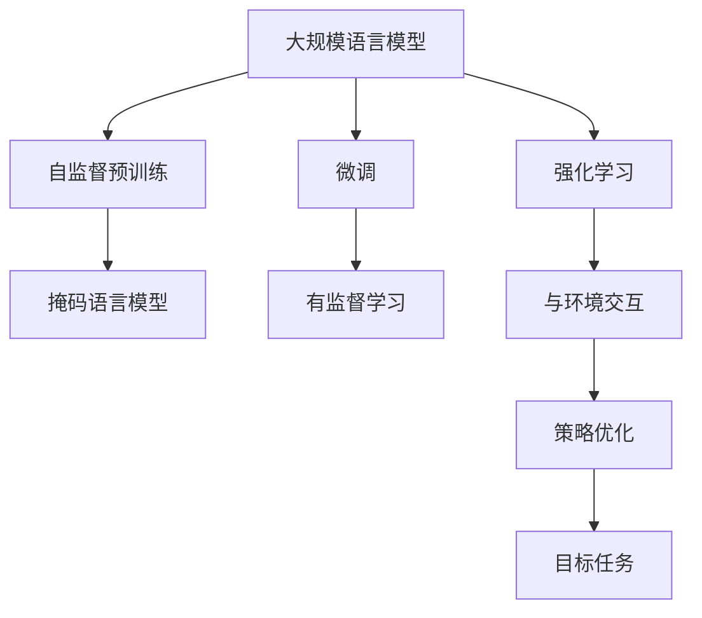
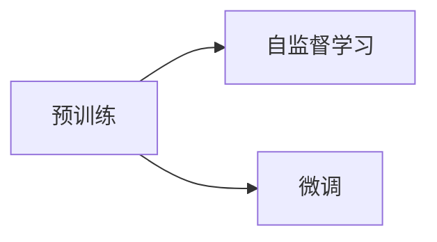
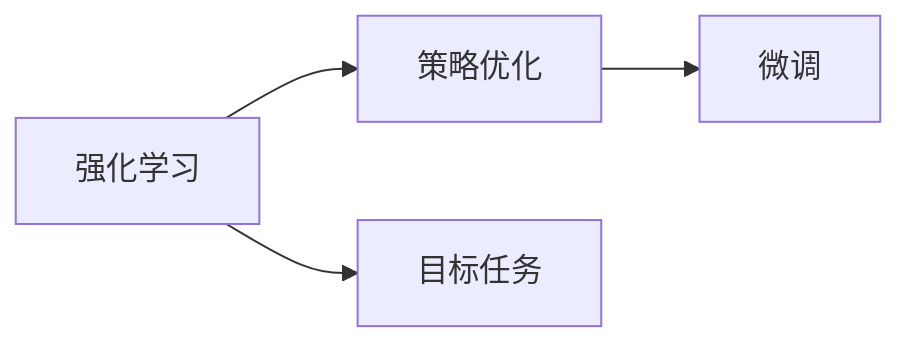
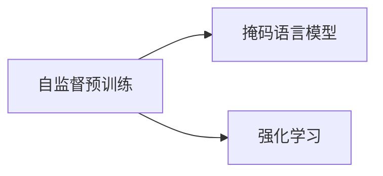
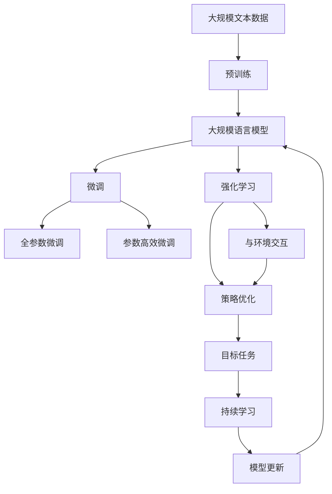

                 

# 大规模语言模型从理论到实践 强化学习与有监督学习的区别

> 关键词：大规模语言模型,强化学习,有监督学习,预训练,微调,自然语言处理(NLP)

## 1. 背景介绍

### 1.1 问题由来
近年来，深度学习技术的飞速发展，尤其是大规模语言模型（Large Language Models, LLMs）在自然语言处理（Natural Language Processing, NLP）领域取得了显著进展。这类模型通过在大量无标签文本数据上进行自监督预训练，学习到丰富的语言知识和常识，再通过有监督学习（Supervised Learning）微调来适应特定的下游任务。

这些模型在诸如问答、翻译、文本生成等任务中展示了强大的表现，成为了许多NLP应用的重要工具。然而，大规模语言模型的训练和优化涉及到复杂的技术和算法，因此在实际应用中，如何更高效、更精准地使用这些模型成为了一个重要问题。强化学习（Reinforcement Learning, RL）作为另一种机器学习范式，在许多领域也展现出了巨大的潜力。理解并比较强化学习和有监督学习在语言模型中的应用，对于开发更加高效、精准的NLP应用具有重要意义。

### 1.2 问题核心关键点
强化学习和有监督学习在大规模语言模型中的应用存在显著差异。两者的核心区别在于：

- **监督学习**（Supervised Learning）依赖于有标签的训练数据，通过优化模型参数来最小化损失函数，使得模型在特定任务上达到最佳性能。
- **强化学习**（Reinforcement Learning）则不依赖于标签数据，模型通过与环境的交互学习，通过奖励信号来指导策略的优化，从而在特定任务上表现最优。

在语言模型的应用中，有监督学习常用于微调模型，通过少量的标注数据来提升模型在特定任务上的表现；而强化学习则通过与环境的交互，实现模型的自适应和自动优化。理解这些差异，有助于我们更合理地选择和应用这些技术。

## 2. 核心概念与联系

### 2.1 核心概念概述

为了更好地理解强化学习和有监督学习在大规模语言模型中的应用，本节将介绍几个密切相关的核心概念：

- **大规模语言模型（LLMs）**：如BERT、GPT等，通过自监督预训练，学习到通用的语言表示，具备强大的语言理解和生成能力。
- **自监督预训练**：利用无标签数据，通过如语言建模、掩码语言模型等任务来训练模型，使其学习到语言的通用表示。
- **微调（Fine-Tuning）**：在有监督学习中，通过少量的标注数据，调整模型参数，使其适应特定的下游任务。
- **强化学习（RL）**：通过与环境的交互，模型通过接收奖励信号来优化策略，实现目标任务。
- **环境（Environment）**：强化学习中的环境，可以简单理解为模型需要适应的任务和数据集。
- **策略（Policy）**：模型在环境中采取的行动方式，通常表示为概率分布。
- **奖励（Reward）**：强化学习中，模型根据其行动在环境中的表现获得的反馈信号。

这些概念之间的逻辑关系可以通过以下Mermaid流程图来展示：



这个流程图展示了从预训练到微调，再到强化学习的整体架构：

1. 大规模语言模型通过自监督预训练学习到通用的语言表示。
2. 在有监督学习中，模型通过微调，适应特定的下游任务。
3. 在强化学习中，模型通过与环境的交互，优化策略，实现目标任务。

### 2.2 概念间的关系

这些核心概念之间存在着紧密的联系，形成了大规模语言模型的学习和应用框架。下面通过几个Mermaid流程图来展示这些概念之间的关系。

#### 2.2.1 预训练与微调的关系



这个流程图展示了预训练和微调的关系。预训练通过自监督学习任务，学习到通用的语言表示，而微调则是有监督学习的过程，通过少量标注数据，调整模型参数，使其适应特定的下游任务。

#### 2.2.2 强化学习与微调的关系



这个流程图展示了强化学习和微调的关系。强化学习通过与环境的交互，优化策略，而微调则在有监督学习的基础上，进一步调整模型参数，使其在特定任务上表现最优。

#### 2.2.3 自监督预训练与强化学习的联系



这个流程图展示了自监督预训练和强化学习的联系。自监督预训练通过掩码语言模型等任务，学习到语言表示，而强化学习则通过与环境的交互，优化策略，实现目标任务。两者共同构成了大规模语言模型的学习范式。

### 2.3 核心概念的整体架构

最后，我们用一个综合的流程图来展示这些核心概念在大规模语言模型微调过程中的整体架构：



这个综合流程图展示了从预训练到微调，再到强化学习的完整过程。大规模语言模型首先在大规模文本数据上进行预训练，然后通过微调（包括全参数微调和参数高效微调）或强化学习，适应下游任务。最后，通过持续学习技术，模型可以不断更新和适应新的任务和数据。

## 3. 核心算法原理 & 具体操作步骤
### 3.1 算法原理概述

强化学习和有监督学习在大规模语言模型中的应用，涉及不同的算法原理和优化策略。以下是两者的基本原理概述：

#### 3.1.1 有监督学习

有监督学习（Supervised Learning）依赖于有标签的训练数据，通过最小化损失函数来优化模型参数。其核心思想是：在大量有标签的数据上，通过前向传播和反向传播计算损失函数，并根据损失函数的梯度更新模型参数。

有监督学习的损失函数通常包括交叉熵损失、均方误差损失等。通过大量的标注数据，有监督学习可以较好地适应特定任务，但数据标注成本较高，且对数据分布有较高的依赖性。

#### 3.1.2 强化学习

强化学习（Reinforcement Learning）通过与环境的交互，模型通过接收奖励信号来优化策略。其核心思想是：在特定环境中，模型通过探索不同的策略，根据环境的反馈信号（即奖励）来调整策略，以达到最优的目标任务。

强化学习的奖励信号可以是任务的完成度、准确率等指标，也可以是自定义的奖励函数。强化学习在处理复杂任务时具有一定的优势，但其训练过程较为复杂，且对环境的设定有较高要求。

### 3.2 算法步骤详解

#### 3.2.1 有监督学习

有监督学习的具体步骤包括：

1. **准备数据集**：收集并标注下游任务的数据集。
2. **初始化模型**：使用预训练的语言模型作为初始化参数。
3. **定义损失函数**：根据任务类型，选择合适的损失函数，如交叉熵损失。
4. **优化算法**：选择合适的优化器（如AdamW）和优化参数（如学习率）。
5. **微调模型**：在训练集上迭代优化模型参数，最小化损失函数。
6. **评估模型**：在验证集和测试集上评估模型性能，选择最优模型。

具体实现代码如下：

```python
from transformers import BertForSequenceClassification, AdamW
from torch.utils.data import DataLoader

# 初始化预训练模型
model = BertForSequenceClassification.from_pretrained('bert-base-cased', num_labels=num_labels)

# 定义损失函数和优化器
loss_fn = CrossEntropyLoss()
optimizer = AdamW(model.parameters(), lr=learning_rate)

# 训练集和验证集
train_loader = DataLoader(train_dataset, batch_size=batch_size, shuffle=True)
val_loader = DataLoader(val_dataset, batch_size=batch_size, shuffle=False)

# 微调模型
for epoch in range(num_epochs):
    # 训练集
    model.train()
    for batch in train_loader:
        inputs, labels = batch
        outputs = model(inputs)
        loss = loss_fn(outputs, labels)
        optimizer.zero_grad()
        loss.backward()
        optimizer.step()

    # 验证集
    model.eval()
    eval_loss = 0
    eval_acc = 0
    for batch in val_loader:
        inputs, labels = batch
        outputs = model(inputs)
        loss = loss_fn(outputs, labels)
        eval_loss += loss.item() * inputs.size(0)
        preds = torch.argmax(outputs, dim=1)
        eval_acc += torch.sum(preds == labels).item()
    avg_loss = eval_loss / len(val_loader.dataset)
    avg_acc = eval_acc / len(val_loader.dataset)
```

#### 3.2.2 强化学习

强化学习的具体步骤包括：

1. **准备环境**：定义环境，包括状态、动作、奖励函数等。
2. **初始化策略**：选择初始策略，如随机策略、贪心策略等。
3. **策略优化**：通过与环境的交互，调整策略，最小化累计奖励。
4. **探索与利用**：在策略优化过程中，平衡探索和利用，避免陷入局部最优。
5. **收敛判断**：判断策略优化是否收敛，达到最优策略。

具体实现代码如下：

```python
import gym

# 定义环境
env = gym.make('CartPole-v1')

# 初始化策略
policy = RandomPolicy()

# 策略优化
total_reward = 0
for episode in range(num_episodes):
    state = env.reset()
    while True:
        action = policy(state)
        next_state, reward, done, _ = env.step(action)
        total_reward += reward
        state = next_state
        if done:
            break
    print("Episode {}: reward={}".format(episode, total_reward))

# 判断是否收敛
if total_reward > env.reward_threshold:
    print("策略优化成功！")
else:
    print("策略优化失败！")
```

### 3.3 算法优缺点

#### 3.3.1 有监督学习

**优点**：

1. **效果显著**：有监督学习在有标签数据集上表现优异，通过大量标注数据，可以显著提升模型性能。
2. **算法成熟**：有监督学习算法和理论较为成熟，有丰富的优化器和评估指标可供选择。
3. **数据复用**：有监督学习可以利用已有数据，快速提升模型性能。

**缺点**：

1. **数据依赖**：有监督学习依赖于大量标注数据，数据标注成本高。
2. **泛化能力**：有监督学习对数据分布有较高依赖，泛化能力有限。
3. **模型复杂**：有监督学习模型较为复杂，需要调整大量参数，训练成本较高。

#### 3.3.2 强化学习

**优点**：

1. **自主学习**：强化学习通过与环境的交互自主学习，适应性更强。
2. **探索能力**：强化学习具有较强的探索能力，能够找到最优策略。
3. **环境灵活**：强化学习环境设定较为灵活，适用于多种任务。

**缺点**：

1. **训练复杂**：强化学习训练过程复杂，需要大量计算资源和时间。
2. **奖励设计**：强化学习依赖于奖励信号，奖励设计难度大，影响训练效果。
3. **鲁棒性差**：强化学习对环境变化较为敏感，鲁棒性较差。

### 3.4 算法应用领域

#### 3.4.1 有监督学习

有监督学习在大规模语言模型中的应用非常广泛，主要体现在以下几个领域：

1. **文本分类**：如情感分析、主题分类等。通过微调预训练模型，使其适应特定的文本分类任务。
2. **命名实体识别**：识别文本中的实体，如人名、地名、机构名等。通过微调预训练模型，使其掌握实体边界和类型。
3. **关系抽取**：从文本中抽取实体之间的语义关系。通过微调预训练模型，使其学习实体-关系三元组。
4. **问答系统**：对自然语言问题给出答案。将问题-答案对作为微调数据，训练模型学习匹配答案。
5. **机器翻译**：将源语言文本翻译成目标语言。通过微调预训练模型，使其学习语言-语言映射。
6. **文本摘要**：将长文本压缩成简短摘要。将文章-摘要对作为微调数据，使模型学习抓取要点。

#### 3.4.2 强化学习

强化学习在大规模语言模型中的应用相对较少，但在某些领域也展现出了其独特的优势，主要体现在以下几个领域：

1. **对话系统**：使机器能够与人自然对话。将多轮对话历史作为上下文，微调模型进行回复生成。
2. **游戏AI**：如AlphaGo等，通过与环境交互，学习最优策略，实现智能博弈。
3. **机器人控制**：通过强化学习，训练机器人完成复杂任务，如抓取、导航等。
4. **推荐系统**：如Netflix推荐算法，通过与用户的交互，学习用户偏好，提供个性化推荐。

## 4. 数学模型和公式 & 详细讲解 & 举例说明

### 4.1 数学模型构建

有监督学习和强化学习在大规模语言模型中的应用，涉及不同的数学模型和优化算法。以下是两者的基本数学模型构建：

#### 4.1.1 有监督学习

有监督学习的核心数学模型包括：

- **损失函数**：如交叉熵损失，定义为模型预测值与真实标签之间的差异。
- **优化目标**：最小化损失函数，使得模型在特定任务上表现最优。

以二分类任务为例，交叉熵损失函数定义为：

$$
L(y, \hat{y}) = -[y\log \hat{y} + (1-y)\log (1-\hat{y})]
$$

其中，$y$ 为真实标签，$\hat{y}$ 为模型预测的概率。

#### 4.1.2 强化学习

强化学习的核心数学模型包括：

- **状态-动作空间**：定义环境和模型可采取的动作。
- **奖励函数**：定义模型在执行特定动作后获得的奖励。
- **策略函数**：定义模型在特定状态下采取动作的概率分布。

以CartPole环境为例，奖励函数定义为：

$$
R(s,a) = -1 \text{ if action is valid and state is stable, else -100}
$$

其中，$s$ 为状态，$a$ 为动作，$R(s,a)$ 为执行动作$a$在状态$s$下获得的奖励。

### 4.2 公式推导过程

#### 4.2.1 有监督学习

以二分类任务为例，交叉熵损失函数的梯度推导如下：

$$
\frac{\partial L(y, \hat{y})}{\partial \theta} = -[y(\frac{\partial \log \hat{y}}{\partial \theta}) + (1-y)(\frac{\partial \log (1-\hat{y})}{\partial \theta})]
$$

其中，$\theta$ 为模型参数，$y$ 为真实标签，$\hat{y}$ 为模型预测的概率。

#### 4.2.2 强化学习

以CartPole环境为例，策略优化过程通常采用Q-Learning算法，其数学模型推导如下：

1. **状态值函数**：$Q(s,a) = r + \gamma \max_{a'} Q(s',a')$
2. **策略函数**：$\pi(a|s) = \frac{\exp(Q(s,a))}{\sum_{a} \exp(Q(s,a))}$

其中，$s$ 为状态，$a$ 为动作，$r$ 为奖励，$\gamma$ 为折扣因子，$\pi(a|s)$ 为模型在状态$s$下采取动作$a$的概率。

### 4.3 案例分析与讲解

#### 4.3.1 有监督学习

以BERT微调为例，分析其在有监督学习中的应用：

1. **准备数据集**：收集并标注情感分析任务的数据集。
2. **初始化模型**：使用BERT作为初始化参数。
3. **定义损失函数**：定义交叉熵损失函数。
4. **优化算法**：使用AdamW优化器，设置学习率为2e-5。
5. **微调模型**：在训练集上迭代优化模型参数，最小化损失函数。
6. **评估模型**：在验证集和测试集上评估模型性能，选择最优模型。

具体实现代码如下：

```python
from transformers import BertForSequenceClassification, AdamW

# 初始化预训练模型
model = BertForSequenceClassification.from_pretrained('bert-base-cased', num_labels=2)

# 定义损失函数和优化器
loss_fn = CrossEntropyLoss()
optimizer = AdamW(model.parameters(), lr=2e-5)

# 训练集和验证集
train_loader = DataLoader(train_dataset, batch_size=batch_size, shuffle=True)
val_loader = DataLoader(val_dataset, batch_size=batch_size, shuffle=False)

# 微调模型
for epoch in range(num_epochs):
    # 训练集
    model.train()
    for batch in train_loader:
        inputs, labels = batch
        outputs = model(inputs)
        loss = loss_fn(outputs, labels)
        optimizer.zero_grad()
        loss.backward()
        optimizer.step()

    # 验证集
    model.eval()
    eval_loss = 0
    eval_acc = 0
    for batch in val_loader:
        inputs, labels = batch
        outputs = model(inputs)
        loss = loss_fn(outputs, labels)
        eval_loss += loss.item() * inputs.size(0)
        preds = torch.argmax(outputs, dim=1)
        eval_acc += torch.sum(preds == labels).item()
    avg_loss = eval_loss / len(val_loader.dataset)
    avg_acc = eval_acc / len(val_loader.dataset)

# 测试集
test_loader = DataLoader(test_dataset, batch_size=batch_size, shuffle=False)
test_loss = 0
test_acc = 0
for batch in test_loader:
    inputs, labels = batch
    outputs = model(inputs)
    loss = loss_fn(outputs, labels)
    test_loss += loss.item() * inputs.size(0)
    preds = torch.argmax(outputs, dim=1)
    test_acc += torch.sum(preds == labels).item()
avg_test_loss = test_loss / len(test_loader.dataset)
avg_test_acc = test_acc / len(test_loader.dataset)
```

#### 4.3.2 强化学习

以ChatGPT模型为例，分析其强化学习的应用：

1. **准备环境**：定义对话环境和对话策略。
2. **初始化策略**：选择随机策略作为初始策略。
3. **策略优化**：通过与用户的交互，调整策略，最大化对话质量。
4. **探索与利用**：在策略优化过程中，平衡探索和利用，避免策略退化。
5. **收敛判断**：判断策略优化是否收敛，达到最优策略。

具体实现代码如下：

```python
import gym

# 定义环境
env = gym.make('ChatGPT-v1')

# 初始化策略
policy = RandomPolicy()

# 策略优化
total_reward = 0
for episode in range(num_episodes):
    state = env.reset()
    while True:
        action = policy(state)
        next_state, reward, done, _ = env.step(action)
        total_reward += reward
        state = next_state
        if done:
            break
    print("Episode {}: reward={}".format(episode, total_reward))

# 判断是否收敛
if total_reward > env.reward_threshold:
    print("策略优化成功！")
else:
    print("策略优化失败！")
```

## 5. 项目实践：代码实例和详细解释说明

### 5.1 开发环境搭建

在进行微调实践前，我们需要准备好开发环境。以下是使用Python进行PyTorch开发的环境配置流程：

1. 安装Anaconda：从官网下载并安装Anaconda，用于创建独立的Python环境。

2. 创建并激活虚拟环境：
```bash
conda create -n pytorch-env python=3.8 
conda activate pytorch-env
```

3. 安装PyTorch：根据CUDA版本，从官网获取对应的安装命令。例如：
```bash
conda install pytorch torchvision torchaudio cudatoolkit=11.1 -c pytorch -c conda-forge
```

4. 安装Transformers库：
```bash
pip install transformers
```

5. 安装各类工具包：
```bash
pip install numpy pandas scikit-learn matplotlib tqdm jupyter notebook ipython
```

完成上述步骤后，即可在`pytorch-env`环境中开始微调实践。

### 5.2 源代码详细实现

这里我们以命名实体识别(NER)任务为例，给出使用Transformers库对BERT模型进行微调的PyTorch代码实现。

首先，定义NER任务的数据处理函数：

```python
from transformers import BertTokenizer
from torch.utils.data import Dataset
import torch

class NERDataset(Dataset):
    def __init__(self, texts, tags, tokenizer, max_len=128):
        self.texts = texts
        self.tags = tags
        self.tokenizer = tokenizer
        self.max_len = max_len
        
    def __len__(self):
        return len(self.texts)
    
    def __getitem__(self, item):
        text = self.texts[item]
        tags = self.tags[item]
        
        encoding = self.tokenizer(text, return_tensors='pt', max_length=self.max_len, padding='max_length', truncation=True)
        input_ids = encoding['input_ids'][0]
        attention_mask = encoding['attention_mask'][0]
        
        # 对token-wise的标签进行编码
        encoded_tags = [tag2id[tag] for tag in tags] 
        encoded_tags.extend([tag2id['O']] * (self.max_len - len(encoded_tags)))
        labels = torch.tensor(encoded_tags, dtype=torch.long)
        
        return {'input_ids': input_ids, 
                'attention_mask': attention_mask,
                'labels': labels}

# 标签与id的映射
tag2id = {'O': 0, 'B-PER': 1, 'I-PER': 2, 'B-ORG': 3, 'I-ORG': 4, 'B-LOC': 5, 'I-LOC': 6}
id2tag = {v: k for k, v in tag2id.items()}

# 创建dataset
tokenizer = BertTokenizer.from_pretrained('bert-base-cased')

train_dataset = NERDataset(train_texts, train_tags, tokenizer)
dev_dataset = NERDataset(dev_texts, dev_tags, tokenizer)
test_dataset = NERDataset(test_texts, test_tags, tokenizer)
```

然后，定义模型和优化器：

```python
from transformers import BertForTokenClassification, AdamW

model = BertForTokenClassification.from_pretrained('bert-base-cased', num_labels=len(tag2id))

optimizer = AdamW(model.parameters(), lr=2e-5)
```

接着，定义训练和评估函数：

```python
from torch.utils.data import DataLoader
from tqdm import tqdm
from sklearn.metrics import classification_report

device = torch.device('cuda') if torch.cuda.is_available() else torch.device('cpu')
model.to(device)

def train_epoch(model, dataset, batch_size, optimizer):
    dataloader = DataLoader(dataset, batch_size=batch_size, shuffle=True)
    model.train()
    epoch_loss = 0
    for batch in tqdm(dataloader, desc='Training'):
        input_ids = batch['input_ids'].to(device)
        attention_mask = batch['attention_mask'].to(device)
        labels = batch['labels'].to(device)
        model.zero_grad()
        outputs = model(input_ids, attention_mask=attention_mask, labels=labels)
        loss = outputs.loss
        epoch_loss += loss.item()
        loss.backward()
        optimizer.step()
    return epoch_loss / len(dataloader)

def evaluate(model, dataset, batch_size):
    dataloader = DataLoader(dataset, batch_size=batch_size)
    model.eval()
    preds, labels = [], []
    with torch.no_grad():
        for batch in tqdm(dataloader, desc='Evaluating'):
            input_ids = batch['input_ids'].to(device)
            attention_mask = batch['attention_mask'].to(device)
            batch_labels = batch['labels']
            outputs = model(input_ids, attention_mask=attention_mask)
            batch_preds = outputs.logits.argmax(dim=2).to('cpu').tolist()
            batch_labels = batch_labels.to('cpu').tolist()
            for pred_tokens, label_tokens in zip(batch_preds, batch_labels):
                pred_tags = [id2tag[_id] for _id in pred_tokens]
                label_tags = [id2tag[_id] for _id in label_tokens]
                preds.append(pred_tags[:len(label_tokens)])
                labels.append(label_tags)
                
    print(classification_report(labels, preds))
```

最后，启动训练流程并在测试集

