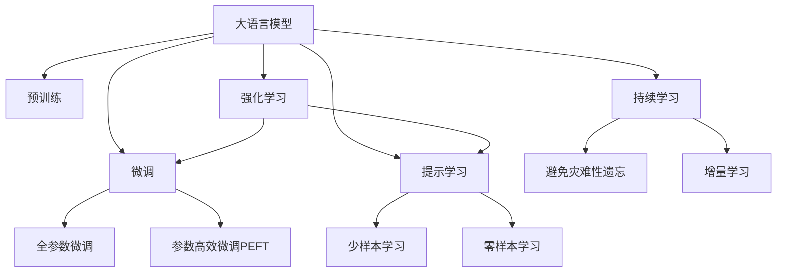
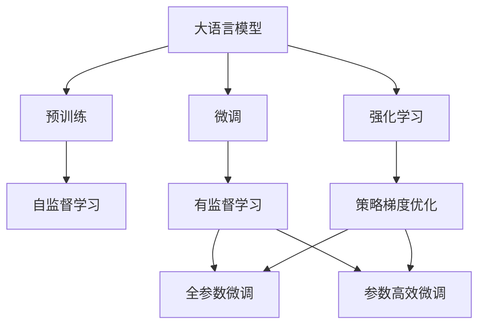
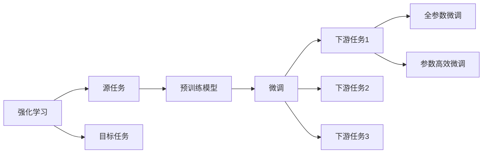
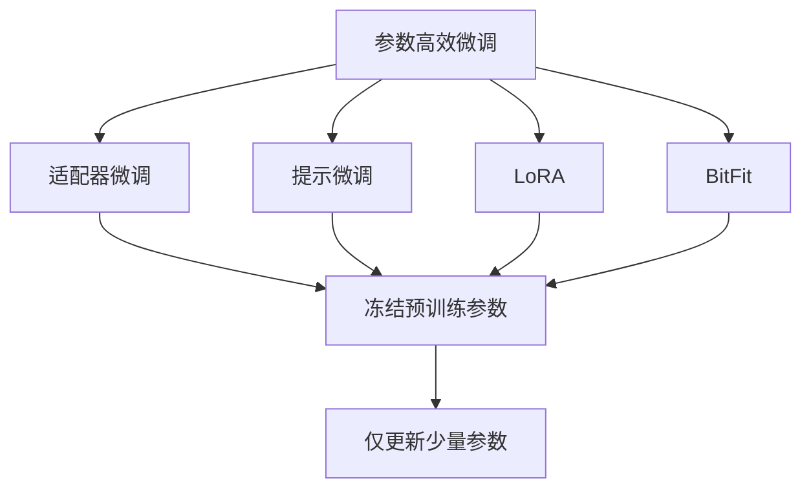
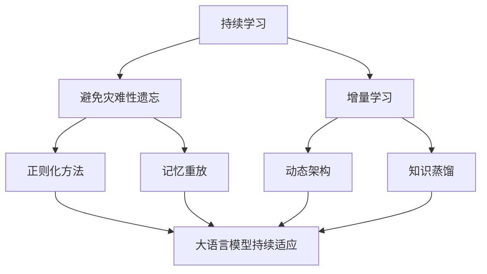
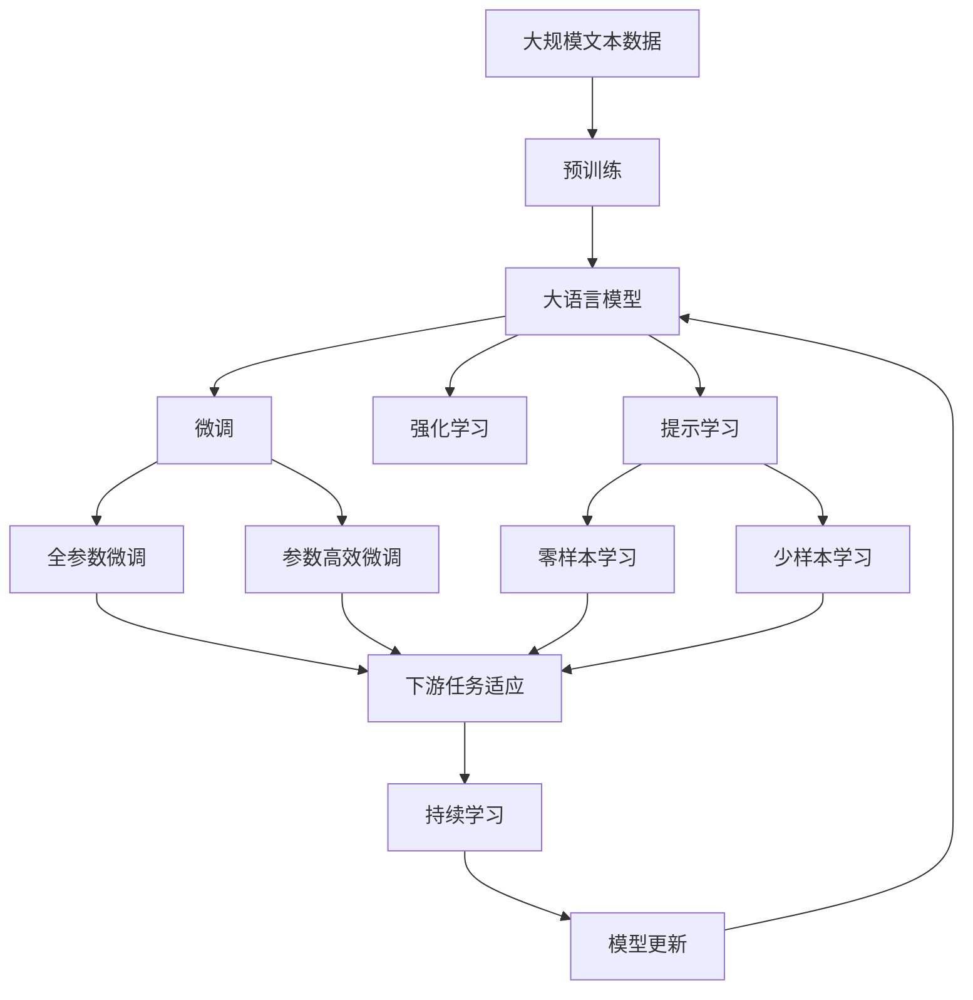

                 

# 大规模语言模型从理论到实践 策略梯度

> 关键词：大规模语言模型, 策略梯度, 强化学习, 深度学习, 自适应优化, 自然语言处理(NLP), 代码实现, 优化器设计

## 1. 背景介绍

### 1.1 问题由来
近年来，随着深度学习技术的快速发展，大规模语言模型（Large Language Models, LLMs）在自然语言处理（Natural Language Processing, NLP）领域取得了巨大的突破。这些大模型通过在大规模无标签文本数据上进行预训练，学习到了丰富的语言知识和常识，可以通过少量的有标签样本在下游任务上进行微调，获得优异的性能。其中最具代表性的大模型包括OpenAI的GPT系列模型、Google的BERT、T5等。

然而，由于预训练语料的广泛性和泛化能力的不足，这些通用的大语言模型在特定领域应用时，效果往往难以达到实际应用的要求。因此，如何针对特定任务进行大模型微调，提升模型性能，成为了当前大语言模型研究和应用的一个热点问题。本文聚焦于基于策略梯度的强化学习微调方法，但同时也会兼顾参数高效微调和提示学习等前沿技术，以期对大语言模型微调实践提供更全面的指导。

### 1.2 问题核心关键点
目前，大语言模型微调的主流范式是基于监督学习的微调方法。即收集该任务的少量标注数据，将预训练模型当作初始化参数，通过有监督地训练来优化模型在该任务上的性能。

微调的关键在于如何避免过拟合，同时最大程度发挥预训练模型学到的知识。目前主流的做法包括：
- 选择合适的学习率。相比从头训练，微调通常需要更小的学习率，以免破坏预训练的权重。
- 应用正则化技术。如L2正则、Dropout、Early Stopping等，防止模型过度适应小规模训练集。
- 保留预训练的部分层。如Transformer的底层，只微调顶层，减少需优化的参数。
- 数据增强。通过对训练样本改写、回译等方式丰富训练集多样性。
- 对抗训练。加入对抗样本，提高模型鲁棒性。
- 提示学习。通过在输入文本中添加提示模板（Prompt Template），引导模型按期望方式输出，减少微调参数。

目前，基于大模型微调的方法已经在问答、对话、摘要、翻译、情感分析等诸多NLP任务上取得了优异的效果，成为NLP技术落地应用的重要手段。

### 1.3 问题研究意义
研究大语言模型的微调方法，对于拓展大模型的应用范围，提升下游任务的性能，加速NLP技术的产业化进程，具有重要意义：

1. 降低应用开发成本。基于成熟的大模型进行微调，可以显著减少从头开发所需的数据、计算和人力等成本投入。
2. 提升模型效果。微调使得通用大模型更好地适应特定任务，在应用场景中取得更优表现。
3. 加速开发进度。standing on the shoulders of giants，微调使得开发者可以更快地完成任务适配，缩短开发周期。
4. 带来技术创新。微调范式促进了对预训练-微调的深入研究，催生了提示学习、少样本学习等新的研究方向。
5. 赋能产业升级。微调使得NLP技术更容易被各行各业所采用，为传统行业数字化转型升级提供新的技术路径。

## 2. 核心概念与联系

### 2.1 核心概念概述

为更好地理解基于策略梯度的强化学习微调方法，本节将介绍几个密切相关的核心概念：

- 大语言模型(Large Language Model, LLM)：以自回归(如GPT)或自编码(如BERT)模型为代表的大规模预训练语言模型。通过在大规模无标签文本语料上进行预训练，学习通用的语言表示，具备强大的语言理解和生成能力。

- 预训练(Pre-training)：指在大规模无标签文本语料上，通过自监督学习任务训练通用语言模型的过程。常见的预训练任务包括言语建模、遮挡语言模型等。预训练使得模型学习到语言的通用表示。

- 微调(Fine-tuning)：指在预训练模型的基础上，使用下游任务的少量标注数据，通过有监督学习优化模型在特定任务上的性能。通常只需要调整顶层分类器或解码器，并以较小的学习率更新全部或部分的模型参数。

- 强化学习(Reinforcement Learning, RL)：一种通过试错来学习最优决策策略的学习方法。强化学习框架中的智能体(Agent)通过与环境的交互，逐步学习到最优的策略以最大化累计回报。

- 策略梯度(Strategy Gradient)：一种强化学习算法，通过直接对策略参数进行梯度下降优化，使得策略参数与累计回报最大化。

- 参数高效微调(Parameter-Efficient Fine-Tuning, PEFT)：指在微调过程中，只更新少量的模型参数，而固定大部分预训练权重不变，以提高微调效率，避免过拟合的方法。

- 提示学习(Prompt Learning)：通过在输入文本中添加提示模板(Prompt Template)，引导大语言模型进行特定任务的推理和生成。可以在不更新模型参数的情况下，实现零样本或少样本学习。

- 少样本学习(Few-shot Learning)：指在只有少量标注样本的情况下，模型能够快速适应新任务的学习方法。在大语言模型中，通常通过在输入中提供少量示例来实现，无需更新模型参数。

- 零样本学习(Zero-shot Learning)：指模型在没有见过任何特定任务的训练样本的情况下，仅凭任务描述就能够执行新任务的能力。大语言模型通过预训练获得的广泛知识，使其能够理解任务指令并生成相应输出。

- 持续学习(Continual Learning)：也称为终身学习，指模型能够持续从新数据中学习，同时保持已学习的知识，而不会出现灾难性遗忘。这对于保持大语言模型的时效性和适应性至关重要。

这些核心概念之间的逻辑关系可以通过以下Mermaid流程图来展示：



这个流程图展示了大语言模型的核心概念及其之间的关系：

1. 大语言模型通过预训练获得基础能力。
2. 微调是对预训练模型进行任务特定的优化，可以分为全参数微调和参数高效微调（PEFT）。
3. 强化学习是一种基于策略梯度的学习方式，可以与微调结合，实现更加灵活的优化策略。
4. 提示学习是一种不更新模型参数的方法，可以实现少样本学习和零样本学习。
5. 少样本学习和零样本学习依赖于预训练模型的知识表示能力。
6. 持续学习旨在使模型能够不断学习新知识，同时避免遗忘旧知识。

这些概念共同构成了大语言模型的学习和应用框架，使其能够在各种场景下发挥强大的语言理解和生成能力。通过理解这些核心概念，我们可以更好地把握大语言模型的工作原理和优化方向。

### 2.2 概念间的关系

这些核心概念之间存在着紧密的联系，形成了大语言模型的学习和应用生态系统。下面我通过几个Mermaid流程图来展示这些概念之间的关系。

#### 2.2.1 大语言模型的学习范式



这个流程图展示了大语言模型的三种主要学习范式：预训练、微调和强化学习。预训练主要采用自监督学习方法，而微调则是有监督学习的过程。强化学习框架中的策略梯度优化则是一种更灵活的优化方式。

#### 2.2.2 微调与强化学习的结合



这个流程图展示了强化学习与微调的基本原理。强化学习中的智能体在目标任务上通过与环境的交互，逐步学习到最优的策略，从而实现微调目标。

#### 2.2.3 参数高效微调方法



这个流程图展示了几种常见的参数高效微调方法，包括适配器微调、提示微调、LoRA和BitFit。这些方法的共同特点是冻结大部分预训练参数，只更新少量参数，从而提高微调效率。

#### 2.2.4 持续学习在大语言模型中的应用



这个流程图展示了持续学习在大语言模型中的应用。持续学习的主要目标是避免灾难性遗忘和实现增量学习。通过正则化方法、记忆重放、动态架构和知识蒸馏等技术，可以使大语言模型持续适应新的任务和数据。

### 2.3 核心概念的整体架构

最后，我们用一个综合的流程图来展示这些核心概念在大语言模型微调过程中的整体架构：



这个综合流程图展示了从预训练到微调，再到持续学习的完整过程。大语言模型首先在大规模文本数据上进行预训练，然后通过微调（包括全参数微调和参数高效微调）或强化学习（包括策略梯度优化）进行优化，最后通过持续学习技术，模型可以不断更新和适应新的任务和数据。 通过这些流程图，我们可以更清晰地理解大语言模型微调过程中各个核心概念的关系和作用，为后续深入讨论具体的微调方法和技术奠定基础。

## 3. 核心算法原理 & 具体操作步骤
### 3.1 算法原理概述

基于策略梯度的强化学习微调方法，本质上是一个带有策略梯度优化的强化学习过程。其核心思想是：将预训练的大语言模型视作一个智能体，通过与下游任务环境的交互，逐步学习到最优的策略，从而适应特定任务。

形式化地，假设预训练模型为 $M_{\theta}$，其中 $\theta$ 为预训练得到的模型参数。给定下游任务 $T$ 的少量标注数据集 $D=\{(x_i, y_i)\}_{i=1}^N$，微调的目标是找到最优策略 $\pi$，使得：

$$
\pi^* = \mathop{\arg\min}_{\pi} \mathcal{J}(\pi)
$$

其中 $\mathcal{J}(\pi)$ 为下游任务 $T$ 上的累计回报函数，用于衡量智能体在策略 $\pi$ 下的长期性能。常见的累计回报函数包括累计准确率、累计损失等。

通过策略梯度算法，微调过程不断更新策略参数，最大化累计回报函数，使得模型输出逼近任务标签。由于 $\theta$ 已经通过预训练获得了较好的初始化，因此即便在少量标注样本下进行微调，也能较快收敛到理想的策略参数 $\pi^*$。

### 3.2 算法步骤详解

基于策略梯度的强化学习微调一般包括以下几个关键步骤：

**Step 1: 准备预训练模型和数据集**
- 选择合适的预训练语言模型 $M_{\theta}$ 作为初始化策略，如 BERT、GPT等。
- 准备下游任务 $T$ 的少量标注数据集 $D$，划分为训练集、验证集和测试集。一般要求标注数据与预训练数据的分布不要差异过大。

**Step 2: 定义策略和累计回报函数**
- 根据任务类型，设计合适的策略 $\pi$，例如在分类任务中，策略 $\pi$ 可以表示为在输入 $x$ 上输出标签的概率分布。
- 定义累计回报函数 $\mathcal{J}(\pi)$，例如在分类任务中，累计回报函数可以定义为预测标签与真实标签的一致性。

**Step 3: 设置策略梯度优化器**
- 选择合适的优化算法及其参数，如策略梯度算法中的REINFORCE算法，设置学习率 $\eta$、批大小 $B$ 等。
- 设置正则化技术及强度，包括权重衰减、Dropout、Early Stopping等。

**Step 4: 执行策略梯度训练**
- 将训练集数据分批次输入模型，计算策略 $\pi$ 在每个样本上的回报值。
- 计算策略梯度 $\nabla_{\pi} \mathcal{J}(\pi)$，根据设定的优化算法更新策略参数。
- 周期性在验证集上评估策略 $\pi$ 的性能，根据性能指标决定是否触发 Early Stopping。
- 重复上述步骤直到满足预设的迭代轮数或 Early Stopping 条件。

**Step 5: 测试和部署**
- 在测试集上评估微调后的策略 $\pi^*$ 的性能，对比微调前后的性能提升。
- 使用微调后的策略 $\pi^*$ 对新样本进行推理预测，集成到实际的应用系统中。
- 持续收集新的数据，定期重新微调策略 $\pi^*$，以适应数据分布的变化。

以上是基于策略梯度的强化学习微调大语言模型的一般流程。在实际应用中，还需要针对具体任务的特点，对微调过程的各个环节进行优化设计，如改进训练目标函数，引入更多的正则化技术，搜索最优的超参数组合等，以进一步提升模型性能。

### 3.3 算法优缺点

基于策略梯度的强化学习微调方法具有以下优点：
1. 灵活性强。策略梯度优化算法能够直接优化策略参数，灵活应对不同任务和数据分布。
2. 模型鲁棒性好。策略梯度优化算法能够通过与环境的交互，逐步学习到鲁棒性更强的策略，避免过拟合。
3. 参数高效。通过参数高效微调技术，可以在固定大部分预训练参数的情况下，仍可取得不错的提升。
4. 适应性强。策略梯度优化算法能够动态调整策略参数，适应数据分布的变化。

同时，该方法也存在一定的局限性：
1. 依赖标注数据。强化学习依赖于与环境的交互，需要大量标注数据来指导模型学习。
2. 需要较长的训练时间。策略梯度优化算法需要大量的交互次数，训练时间较长。
3. 模型复杂度高。策略梯度优化算法需要设计合适的策略和回报函数，增加了模型的复杂度。
4. 可解释性不足。强化学习模型往往被视为"黑盒"，难以解释其内部工作机制。

尽管存在这些局限性，但就目前而言，基于策略梯度的强化学习微调方法仍是大语言模型微调的重要范式。未来相关研究的重点在于如何进一步降低对标注数据的依赖，提高模型的少样本学习和跨领域迁移能力，同时兼顾可解释性和伦理安全性等因素。

### 3.4 算法应用领域

基于大语言模型微调的强化学习策略梯度方法，在NLP领域已经得到了广泛的应用，覆盖了几乎所有常见任务，例如：

- 文本分类：如情感分析、主题分类、意图识别等。通过微调使模型学习文本-标签映射。
- 命名实体识别：识别文本中的人名、地名、机构名等特定实体。通过微调使模型掌握实体边界和类型。
- 关系抽取：从文本中抽取实体之间的语义关系。通过微调使模型学习实体-关系三元组。
- 问答系统：对自然语言问题给出答案。将问题-答案对作为微调数据，训练模型学习匹配答案。
- 机器翻译：将源语言文本翻译成目标语言。通过微调使模型学习语言-语言映射。
- 文本摘要：将长文本压缩成简短摘要。将文章-摘要对作为微调数据，使模型学习抓取要点。
- 对话系统：使机器能够与人自然对话。将多轮对话历史作为上下文，微调模型进行回复生成。

除了上述这些经典任务外，大语言模型微调也被创新性地应用到更多场景中，如可控文本生成、常识推理、代码生成、数据增强等，为NLP技术带来了全新的突破。随着预训练模型和微调方法的不断进步，相信NLP技术将在更广阔的应用领域大放异彩。

## 4. 数学模型和公式 & 详细讲解  
### 4.1 数学模型构建

本节将使用数学语言对基于策略梯度的强化学习微调过程进行更加严格的刻画。

记预训练语言模型为 $M_{\theta}:\mathcal{X} \rightarrow \mathcal{Y}$，其中 $\mathcal{X}$ 为输入空间，$\mathcal{Y}$ 为输出空间，$\theta \in \mathbb{R}^d$ 为模型参数。假设微调任务的训练集为 $D=\{(x_i, y_i)\}_{i=1}^N$，其中 $x_i \in \mathcal{X}, y_i \in \mathcal{Y}$。

定义模型 $M_{\theta}$ 在输入 $x$ 上的输出为 $\hat{y}=M_{\theta}(x) \in \mathcal{Y}$。假设策略 $\pi$ 在输入 $x$ 上输出标签的概率分布为 $p_{\pi}(\hat{y}|x)$，其中 $p_{\pi}(\hat{y}|x)$ 为模型在策略 $\pi$ 下的条件概率分布。

定义累计回报函数 $\mathcal{J}(\pi)$，例如在分类任务中，累计回报函数可以定义为：

$$
\mathcal{J}(\pi) = \frac{1}{N} \sum_{i=1}^N \mathbb{E}_{\pi} \left[ \log p_{\pi}(y_i|x_i) \right]
$$

其中 $\mathbb{E}_{\pi} \left[ \cdot \right]$ 表示在策略 $\pi$ 下对随机变量 $p_{\pi}(\cdot|x_i)$ 求期望。

策略梯度算法用于优化策略参数 $\theta$，使得累计回报函数最大化。策略梯度算法的目标是最小化策略与真实分布的KL散度，即：

$$
\min_{\theta} KL(p_{\pi}(\hat{y}|x) || p_{\theta}(\hat{y}|x))
$$

其中 $KL(p_{\pi}(\hat{y}|x) || p_{\theta}(\hat{y}|x))$ 表示策略 $\pi$ 与模型 $M_{\theta}$ 的条件概率分布之间的KL散度。

通过策略梯度算法，微调过程不断更新策略参数，最小化KL散度，使得模型输出逼近真实标签。由于 $\theta$ 已经通过预训练获得了较好的初始化，因此即便在少量标注样本下进行微调，也能较快收敛到理想的策略参数 $\pi^*$。

### 4.2 公式推导过程

以下我们以二分类任务为例，推导策略梯度算法的公式及其梯度的计算方法。

假设模型 $M_{\theta}$ 在输入 $x$ 上的输出为 $\hat{y}=M_{\theta}(x) \in [0,1]$，表示样本属于正类的概率。真实标签 $y \in \{0,1\}$。则二分类策略梯度算法可以表示为：

$$
\pi^* = \mathop{\arg\min}_{\pi} KL(p_{\pi}(\hat{y}|x) || p_{\theta}(\hat{y}|x))
$$

将 $p_{\pi}(\hat{y}|x)$ 展开为 $\pi$ 的函数，得到：

$$
p_{\pi}(\hat{y}|x) = \sum_{k=0}^1 \pi_k \cdot p_k(\hat{y}|x)
$$

其中 $\pi_k$ 表示策略 $\pi$ 在 $k$ 类上的概率，$p_k(\hat{y}|x)$ 表示在输入 $x$ 上输出 $k$ 类的条件概率。

将 $KL(p_{\pi}(\hat{y}|x) || p_{\theta}(\hat{y}|x))$ 展开，得到：

$$
KL(p_{\pi}(\hat{y}|x) || p_{\theta}(\hat{y}|x)) = -\frac{1}{N} \sum_{i=1}^N \mathbb{E}_{\pi} \left[ \log p_{\theta}(y_i|x_i) \right]
$$

令 $p_{\theta}(y_i|x_i) = \pi_i p_k(\hat{y}|x)$，则：

$$
KL(p_{\pi}(\hat{y}|x) || p_{\theta}(\hat{y}|x)) = -\frac{1}{N} \sum_{i=1}^N \mathbb{E}_{\pi} \left[ \log \pi_i p_k(\hat{y}|x) \right]
$$

进一步，根据策略梯度算法的目标函数：

$$
\pi^* = \mathop{\arg\min}_{\pi} KL(p_{\pi}(\hat{y}|x) || p_{\theta}(\hat{y}|x))
$$

得到策略梯度公式：

$$
\nabla_{\pi} KL(p_{\pi}(\hat{y}|x) || p_{\theta}(\hat{y}|x)) = -\frac{1}{N} \sum_{i=1}^N \nabla_{\pi} \log \pi_i p_k(\hat{y}|x)
$$

其中 $\nabla_{\pi} \log \pi_i p_k(\hat{y}|x)$ 为策略梯度向量，表示在策略 $\pi$ 下对概率 $\pi_i$ 的梯度。

在得到策略梯度后，即可带入策略梯度算法，通过梯度下降等优化算法更新策略参数 $\pi$。重复上述过程直至收敛，最终得到适应下游任务的最优策略 $\pi^*$。

## 5. 项目实践：代码实例和详细解释说明
### 5.1 开发环境搭建

在进行微调实践前，我们需要准备好开发环境。以下是使用Python进行PyTorch开发的环境配置流程：

1. 安装Anaconda：从官网下载并安装Anaconda，用于创建独立的Python环境。

2. 创建并激活虚拟环境：
```bash
conda create -n pytorch-env python=3.8 
conda activate pytorch-env
```

3. 安装PyTorch：根据CUDA版本，从官网获取对应的安装命令。例如：
```bash
conda install pytorch torchvision torchaudio cudatoolkit=11.1 -c pytorch -c conda-forge
```

4. 安装Transformers库：
```bash
pip install transformers
```

5. 安装各类工具包：
```bash
pip install numpy pandas scikit-learn matplotlib tqdm jupyter notebook ipython
```

完成上述步骤后，即可在`pytorch-env`环境中开始微调实践。

### 5.2 源代码详细实现

这里我们以命名实体识别(NER)任务为例，给出使用Transformers库对BERT模型进行微调的PyTorch代码实现。

首先，定义NER任务的数据处理函数：

```python
from transformers import BertTokenizer
from torch.utils.data import Dataset
import torch

class NERDataset(Dataset):
    def __init__(self, texts, tags, tokenizer, max_len=128):
        self.texts = texts
        self.tags = tags
        self.tokenizer = tokenizer
        self.max_len = max_len
        
    def __len__(self):
        return len(self.texts)
    
    def __getitem__(self, item):
        text = self.texts[item]
        tags = self.tags[item]
        
        encoding = self.tokenizer(text, return_tensors='pt', max_length=self.max_len, padding='max_length', truncation=True)
        input_ids = encoding['input_ids'][0]
        attention_mask = encoding['attention_mask'][0]
        
        # 对token-wise的标签进行编码
        encoded_tags = [tag2id

