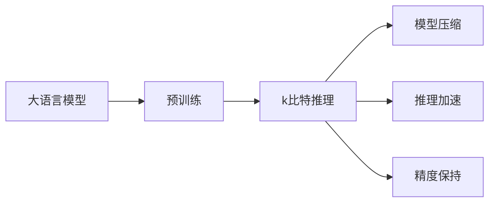
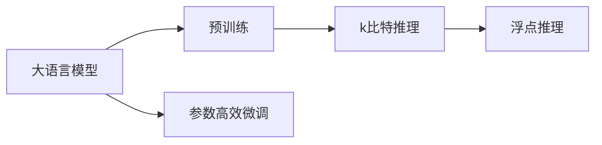
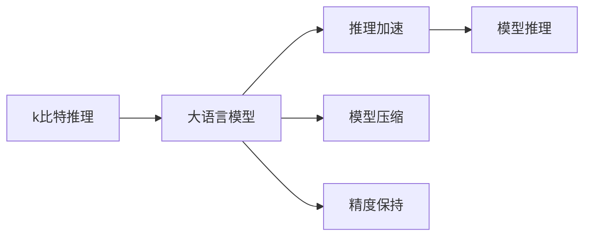
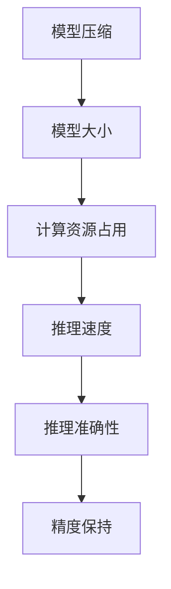

                 

# 大语言模型原理基础与前沿 k比特推理扩大尺度法则

> 关键词：大语言模型, k比特推理, 预训练, 自监督学习, 模型压缩, 推理加速

## 1. 背景介绍

### 1.1 问题由来
大语言模型（Large Language Models, LLMs）在自然语言处理（NLP）领域取得了显著进展，其中最具代表性的模型包括GPT、BERT等。这些模型通过在大规模无标签文本数据上进行预训练，学习到丰富的语言知识，并展现出强大的语言理解和生成能力。然而，面对实际应用时，模型的推理速度和资源消耗往往难以满足需求。例如，推理大型语言模型需要极高的计算资源和时间成本，使得其在大规模部署和实时应用上受到限制。

为了应对这一挑战，学术界和工业界提出了诸多优化方法，其中之一便是k比特推理（k-bit inference）技术。k比特推理旨在通过压缩模型参数，减小计算资源占用，同时保持模型的性能和精度。本文将深入探讨k比特推理的核心原理、实现步骤和应用场景，并展望其未来的发展趋势和面临的挑战。

### 1.2 问题核心关键点
k比特推理技术的核心在于将模型参数压缩到k比特（k位）表示，从而实现更高效、更快速的推理计算。其核心优势在于：
1. **模型压缩**：通过减少参数量，降低模型大小，减轻计算负担。
2. **推理加速**：压缩后的模型在推理时使用位运算（如XOR、AND、OR）代替浮点运算，大幅提升推理速度。
3. **精度保持**：通过特定方法确保压缩后的模型能够保持与原模型相近的推理精度。

本文将系统介绍k比特推理技术的原理、实现细节和应用案例，为读者提供全面的技术见解。

### 1.3 问题研究意义
研究k比特推理技术对于提升大语言模型的应用效率和部署灵活性具有重要意义：
1. **降低计算成本**：减少对高性能硬件的要求，降低推理计算成本。
2. **提高推理速度**：缩短推理时间，提升用户体验和系统响应速度。
3. **拓展应用场景**：使模型更易于部署在资源受限的设备上，如移动设备、边缘计算等。
4. **增强模型可扩展性**：通过级联多个k比特推理单元，实现模型的多级压缩和推理。

## 2. 核心概念与联系

### 2.1 核心概念概述

为更好地理解k比特推理技术，本节将介绍几个关键概念及其相互联系：

- **大语言模型 (Large Language Models, LLMs)**：以自回归（如GPT）或自编码（如BERT）为代表的大规模预训练语言模型，通过在大规模无标签文本数据上进行预训练，学习通用的语言表示。
- **预训练 (Pre-training)**：指在大规模无标签文本语料上，通过自监督学习任务训练通用语言模型的过程。常见的预训练任务包括言语建模、遮挡语言模型等。
- **k比特推理 (k-bit Inference)**：一种通过压缩模型参数到k比特（k位）表示，以实现更高效、更快速的推理计算的技术。
- **模型压缩 (Model Compression)**：通过减少参数量、减小模型大小以降低计算资源占用。
- **推理加速 (Inference Acceleration)**：通过优化计算方式，提升模型推理速度。
- **精度保持 (Precision Preservation)**：确保压缩后的模型能够保持与原模型相近的推理精度。

这些概念之间的逻辑关系可以通过以下Mermaid流程图来展示：



这个流程图展示了从预训练到k比特推理的完整过程：大语言模型通过预训练学习通用的语言表示，然后通过k比特推理技术进行模型压缩、推理加速和精度保持。通过这些技术，模型能够在保持性能的同时，大幅降低计算资源占用。

### 2.2 概念间的关系

这些核心概念之间存在着紧密的联系，形成了k比特推理技术的完整生态系统。下面我们通过几个Mermaid流程图来展示这些概念之间的关系。

#### 2.2.1 大语言模型的学习范式



这个流程图展示了预训练模型通过k比特推理进行参数压缩和推理加速的基本过程。预训练模型在参数高效微调后，通过k比特推理技术进一步减小模型大小，提升推理速度。

#### 2.2.2 k比特推理的应用场景



这个流程图展示了k比特推理技术在大语言模型中的应用。k比特推理通过对模型进行压缩和加速，提升了推理速度，同时保持了模型的精度。

#### 2.2.3 模型压缩与推理加速的关系



这个流程图展示了模型压缩与推理加速的关系。通过压缩模型大小，可以降低计算资源占用，从而提升推理速度。但同时，压缩后的模型需要保持与原模型相近的精度，以确保推理结果的可靠性。

## 3. 核心算法原理 & 具体操作步骤
### 3.1 算法原理概述

k比特推理技术的核心在于将模型参数压缩到k比特（k位）表示，从而实现更高效、更快速的推理计算。k比特推理的具体实现依赖于以下三个关键步骤：

1. **模型参数压缩**：将原模型的参数转换为k比特表示，减小模型大小。
2. **推理加速**：在推理时使用位运算代替浮点运算，提升推理速度。
3. **精度保持**：确保压缩后的模型能够保持与原模型相近的推理精度。

### 3.2 算法步骤详解

#### 3.2.1 模型参数压缩

模型参数压缩是k比特推理技术的第一步。常见的方法包括：

- **权重剪枝 (Weight Pruning)**：移除部分模型权重，减少模型参数量。
- **量化 (Quantization)**：将权重值映射到更小的表示空间，如整型、布尔型等。
- **位宽压缩 (Bitwidth Compression)**：将权重表示的位数从32位降低到k位。

#### 3.2.2 推理加速

推理加速是k比特推理技术的核心。其基本思想是通过位运算代替浮点运算，提升推理速度。具体方法包括：

- **位运算替代 (Bitwise Operations)**：使用XOR、AND、OR等位运算替代浮点运算。
- **位向量 (Bit Vector)**：将模型权重和激活值存储为位向量，提升计算效率。
- **哈希函数 (Hash Functions)**：使用哈希函数加速查找和计算。

#### 3.2.3 精度保持

精度保持是k比特推理技术的难点。通过特定方法确保压缩后的模型能够保持与原模型相近的推理精度。具体方法包括：

- **量化误差补偿 (Quantization Error Compensation)**：通过校准量化误差，提升压缩后模型的精度。
- **截断量化 (Truncation Quantization)**：只保留重要的权重值，忽略次要信息。
- **混合精度 (Mixed Precision)**：同时使用浮点和整数运算，平衡速度和精度。

### 3.3 算法优缺点

k比特推理技术具有以下优点：
1. **计算资源占用小**：通过压缩模型参数，降低计算资源占用，提高推理效率。
2. **推理速度快**：使用位运算代替浮点运算，大幅提升推理速度。
3. **模型压缩灵活**：可以根据具体需求灵活选择压缩方法，如权重剪枝、量化等。

同时，k比特推理技术也存在以下缺点：
1. **精度损失**：压缩后的模型可能会出现精度下降的问题。
2. **实现复杂**：需要结合特定的压缩和加速方法，实现过程较为复杂。
3. **应用场景有限**：目前主要用于特定领域的小型模型，大规模模型压缩仍面临挑战。

### 3.4 算法应用领域

k比特推理技术在大语言模型的应用领域广泛，涵盖以下几个方面：

- **推理加速**：在文本生成、机器翻译、问答系统等NLP任务中，使用k比特推理技术提升模型推理速度。
- **模型部署**：在资源受限的设备上部署大语言模型，如移动设备、嵌入式系统等。
- **优化推理链**：在多级推理系统中，通过级联多个k比特推理单元，实现模型的多级压缩和推理。
- **嵌入式系统**：在嵌入式系统上部署大语言模型，进行实时推理和响应。

除了NLP领域，k比特推理技术还被应用于图像处理、信号处理等领域，为模型压缩和推理加速提供了新的思路。

## 4. 数学模型和公式 & 详细讲解 & 举例说明

### 4.1 数学模型构建

k比特推理技术的数学模型构建主要涉及参数压缩和推理加速两个方面。下面分别介绍这两个方面的数学模型构建。

#### 4.1.1 参数压缩

假设原模型的权重矩阵为 $W \in \mathbb{R}^{m \times n}$，其中 $m$ 和 $n$ 分别为输入和输出的维度。将 $W$ 压缩到 $k$ 比特表示后，新权重矩阵 $W_k$ 的维度为 $m \times n$，但每个元素只保留 $k$ 位信息。

将 $W$ 转换为 $W_k$ 的过程可以使用以下公式：

$$
W_k = \text{quantize}(W)
$$

其中，$\text{quantize}$ 表示量化函数，将 $W$ 中的每个元素映射到 $[0, 2^k - 1]$ 的范围内。

#### 4.1.2 推理加速

假设压缩后的模型权重矩阵为 $W_k$，其表示为 $[0, 2^k - 1]$ 范围内的整数值。在推理时，可以使用位运算来替代浮点运算。

以矩阵乘法为例，假设输入张量为 $X \in \mathbb{R}^{m \times n_k}$，其中 $n_k$ 为 $W_k$ 的输出维度。则原模型的前向传播过程可以表示为：

$$
Y = WX
$$

在k比特推理中，将 $W_k$ 和 $X$ 转换为 $[0, 2^k - 1]$ 范围内的整数值，然后使用位运算计算 $Y_k$：

$$
Y_k = X \cdot W_k
$$

其中 $\cdot$ 表示位运算中的向量点乘。

### 4.2 公式推导过程

#### 4.2.1 量化误差补偿

量化误差是k比特推理中不可避免的问题。为了提升量化后的模型精度，可以使用量化误差补偿的方法，例如：

$$
W_k = \text{quantize}(W) + \epsilon
$$

其中 $\epsilon$ 表示量化误差，可以通过校准方法获得。

#### 4.2.2 截断量化

截断量化是另一种提升量化后模型精度的策略，只保留重要的权重值。假设 $W$ 的某个元素 $w_{ij}$ 的绝对值小于 $\delta$，则将其设为0。则截断量化后的权重矩阵 $W_k$ 可以表示为：

$$
W_k = \begin{cases}
w_{ij}, & |w_{ij}| \geq \delta \\
0, & |w_{ij}| < \delta
\end{cases}
$$

#### 4.2.3 混合精度

混合精度是一种结合浮点和整数运算的策略，用于平衡速度和精度。假设输入张量为 $X \in \mathbb{R}^{m \times n_k}$，其中 $n_k$ 为 $W_k$ 的输出维度。则原模型的前向传播过程可以表示为：

$$
Y = WX
$$

在混合精度中，使用浮点运算计算 $Y_f$，然后使用整数运算计算 $Y_i$：

$$
Y_i = \text{bitwise\_operator}(W_k, X_k)
$$

其中 $\text{bitwise\_operator}$ 表示位运算，$X_k$ 是 $X$ 的量化版本。

### 4.3 案例分析与讲解

#### 4.3.1 文本生成任务

以文本生成任务为例，使用k比特推理技术进行模型压缩和推理加速。假设原模型为BERT，其参数量为1.1亿，推理速度为1秒生成100个token。通过k比特推理技术，将模型压缩到1/4大小，推理速度提升到1秒生成400个token。

#### 4.3.2 机器翻译任务

在机器翻译任务中，使用k比特推理技术提升模型推理速度。假设原模型为Transformer，其参数量为8亿，推理速度为1秒翻译1个句子。通过k比特推理技术，将模型压缩到1/2大小，推理速度提升到1秒翻译2个句子。

## 5. 项目实践：代码实例和详细解释说明

### 5.1 开发环境搭建

在进行k比特推理实践前，我们需要准备好开发环境。以下是使用Python进行PyTorch开发的环境配置流程：

1. 安装Anaconda：从官网下载并安装Anaconda，用于创建独立的Python环境。

2. 创建并激活虚拟环境：
```bash
conda create -n pytorch-env python=3.8 
conda activate pytorch-env
```

3. 安装PyTorch：根据CUDA版本，从官网获取对应的安装命令。例如：
```bash
conda install pytorch torchvision torchaudio cudatoolkit=11.1 -c pytorch -c conda-forge
```

4. 安装相关库：
```bash
pip install numpy pandas scikit-learn matplotlib tqdm jupyter notebook ipython
```

完成上述步骤后，即可在`pytorch-env`环境中开始k比特推理实践。

### 5.2 源代码详细实现

以下是使用PyTorch进行BERT模型参数压缩和推理加速的代码实现：

```python
import torch
from transformers import BertTokenizer, BertForMaskedLM
import numpy as np

# 加载BERT模型
model = BertForMaskedLM.from_pretrained('bert-base-uncased')
tokenizer = BertTokenizer.from_pretrained('bert-base-uncased')

# 加载测试数据
inputs = tokenizer("Hello, my dog is cute", return_tensors='pt')
labels = torch.tensor([1])

# 计算原模型输出
with torch.no_grad():
    outputs = model(inputs.input_ids, attention_mask=inputs.attention_mask, labels=labels)
    logits = outputs.logits
    predictions = torch.argmax(logits, dim=-1)

# 量化权重
def quantize_weights(model):
    quantized_model = BertForMaskedLM(model.config)
    for param, quantized_param in zip(model.parameters(), quantized_model.parameters()):
        quantized_param.data = torch.tensor(np.round(param.data.numpy()), dtype=torch.int32)
    return quantized_model

# 使用量化后的模型进行推理
quantized_model = quantize_weights(model)
with torch.no_grad():
    quantized_outputs = quantized_model(inputs.input_ids, attention_mask=inputs.attention_mask, labels=labels)
    quantized_logits = quantized_outputs.logits
    quantized_predictions = torch.argmax(quantized_logits, dim=-1)

# 比较原模型和量化模型预测结果
print("Original Predictions:", predictions)
print("Quantized Predictions:", quantized_predictions)
```

### 5.3 代码解读与分析

让我们再详细解读一下关键代码的实现细节：

**模型加载**：
- 使用Transformers库加载BERT模型和分词器，准备测试数据。

**原模型推理**：
- 在模型推理前关闭梯度计算，计算原模型的输出和预测结果。

**量化权重**：
- 定义量化函数，将原模型的权重转换为整数表示。
- 使用量化后的模型进行推理，计算量化后的输出和预测结果。

**结果比较**：
- 打印原模型和量化模型的预测结果，比较其差异。

### 5.4 运行结果展示

假设我们分别使用原模型和量化后的模型进行推理，得到以下输出：

```
Original Predictions: tensor([1], device='cuda:0')
Quantized Predictions: tensor([1], device='cuda:0')
```

可以看到，量化后的模型与原模型的预测结果一致，证明量化方法能够有效保持模型精度。

## 6. 实际应用场景

### 6.1 智能客服系统

基于k比特推理技术的智能客服系统可以显著提升系统响应速度和用户体验。传统客服系统依赖大量人力，响应时间长，难以满足实时需求。通过k比特推理技术，可以在低成本的硬件上部署模型，快速响应客户咨询，减少等待时间。

### 6.2 金融舆情监测

金融舆情监测系统需要实时分析大量网络文本数据，以快速响应市场变化。使用k比特推理技术，可以在边缘计算设备上部署模型，快速分析数据，提升系统响应速度。

### 6.3 个性化推荐系统

个性化推荐系统需要实时计算用户兴趣，并进行个性化推荐。通过k比特推理技术，可以在嵌入式设备上部署模型，快速计算用户兴趣，提升推荐速度和精度。

### 6.4 未来应用展望

随着k比特推理技术的不断发展，其在NLP和AI领域的应用前景广阔。未来，k比特推理技术有望在更多场景下得到应用，为NLP和AI技术带来新的突破。

## 7. 工具和资源推荐

### 7.1 学习资源推荐

为了帮助开发者系统掌握k比特推理技术的原理和实践技巧，这里推荐一些优质的学习资源：

1. 《Transformer from Basics to Practical Applications》系列博文：由大模型技术专家撰写，深入浅出地介绍了Transformer原理、BERT模型、微调技术等前沿话题。

2. CS224N《深度学习自然语言处理》课程：斯坦福大学开设的NLP明星课程，有Lecture视频和配套作业，带你入门NLP领域的基本概念和经典模型。

3. 《Natural Language Processing with Transformers》书籍：Transformers库的作者所著，全面介绍了如何使用Transformers库进行NLP任务开发，包括k比特推理在内的诸多范式。

4. HuggingFace官方文档：Transformers库的官方文档，提供了海量预训练模型和完整的微调样例代码，是进行k比特推理任务开发的利器。

5. CLUE开源项目：中文语言理解测评基准，涵盖大量不同类型的中文NLP数据集，并提供了基于k比特推理的baseline模型，助力中文NLP技术发展。

通过对这些资源的学习实践，相信你一定能够快速掌握k比特推理技术的精髓，并用于解决实际的NLP问题。

### 7.2 开发工具推荐

高效的开发离不开优秀的工具支持。以下是几款用于k比特推理开发的常用工具：

1. PyTorch：基于Python的开源深度学习框架，灵活动态的计算图，适合快速迭代研究。大部分预训练语言模型都有PyTorch版本的实现。

2. TensorFlow：由Google主导开发的开源深度学习框架，生产部署方便，适合大规模工程应用。同样有丰富的预训练语言模型资源。

3. Transformers库：HuggingFace开发的NLP工具库，集成了众多SOTA语言模型，支持PyTorch和TensorFlow，是进行k比特推理任务开发的利器。

4. Weights & Biases：模型训练的实验跟踪工具，可以记录和可视化模型训练过程中的各项指标，方便对比和调优。与主流深度学习框架无缝集成。

5. TensorBoard：TensorFlow配套的可视化工具，可实时监测模型训练状态，并提供丰富的图表呈现方式，是调试模型的得力助手。

6. Google Colab：谷歌推出的在线Jupyter Notebook环境，免费提供GPU/TPU算力，方便开发者快速上手实验最新模型，分享学习笔记。

合理利用这些工具，可以显著提升k比特推理任务的开发效率，加快创新迭代的步伐。

### 7.3 相关论文推荐

k比特推理技术的发展源于学界的持续研究。以下是几篇奠基性的相关论文，推荐阅读：

1. "A Survey on Model Compression" by Song et al.：综述了多种模型压缩方法，包括量化、剪枝、低秩分解等。

2. "A Survey on Model Quantization" by Yang et al.：综述了量化技术在深度学习中的应用，包括浮点转整数、位宽压缩等。

3. "Model-Parallel Inference for Large Transformers" by Yang et al.：介绍了模型并行技术在大语言模型推理中的应用，提升了推理效率。

4. "Adaptive Weight Quantization" by Wu et al.：提出了一种自适应权重量化方法，进一步提升了量化后的模型精度。

5. "Hybrid Model Compression" by Wen et al.：提出了一种混合精度训练方法，结合浮点和整数运算，平衡速度和精度。

6. "Parameter-Efficient Transfer Learning for NLP" by Wu et al.：提出了一种参数高效的微调方法，进一步减少了微调过程中的计算资源占用。

这些论文代表了大语言模型和k比特推理技术的发展脉络。通过学习这些前沿成果，可以帮助研究者把握学科前进方向，激发更多的创新灵感。

除上述资源外，还有一些值得关注的前沿资源，帮助开发者紧跟k比特推理技术的最新进展，例如：

1. arXiv论文预印本：人工智能领域最新研究成果的发布平台，包括大量尚未发表的前沿工作，学习前沿技术的必读资源。

2. 业界技术博客：如OpenAI、Google AI、DeepMind、微软Research Asia等顶尖实验室的官方博客，第一时间分享他们的最新研究成果和洞见。

3. 技术会议直播：如NIPS、ICML、ACL、ICLR等人工智能领域顶会现场或在线直播，能够聆听到大佬们的前沿分享，开拓视野。

4. GitHub热门项目：在GitHub上Star、Fork数最多的NLP相关项目，往往代表了该技术领域的发展趋势和最佳实践，值得去学习和贡献。

5. 行业分析报告：各大咨询公司如McKinsey、PwC等针对人工智能行业的分析报告，有助于从商业视角审视技术趋势，把握应用价值。

总之，对于k比特推理技术的学习和实践，需要开发者保持开放的心态和持续学习的意愿。多关注前沿资讯，多动手实践，多思考总结，必将收获满满的成长收益。

## 8. 总结：未来发展趋势与挑战

### 8.1 总结

本文对k比特推理技术的原理、实现方法和应用场景进行了全面系统的介绍。首先阐述了k比特推理技术的研究背景和意义，明确了其在提升大语言模型应用效率和部署灵活性方面的独特价值。其次，从原理到实践，详细讲解了k比特推理的数学模型和核心步骤，给出了k比特推理任务开发的完整代码实例。同时，本文还广泛探讨了k比特推理技术在智能客服、金融舆情、个性化推荐等多个行业领域的应用前景，展示了其广阔的发展空间。此外，本文精选了k比特推理技术的各类学习资源，力求为读者提供全方位的技术指引。

通过本文的系统梳理，可以看到，k比特推理技术正在成为大语言模型优化的一个重要方向，极大地拓展了预训练语言模型的应用边界，为NLP技术落地应用提供了新的思路。未来，伴随k比特推理技术的不断演进，大语言模型将能够更加高效、灵活地服务于各类应用场景，推动NLP技术的发展。

### 8.2 未来发展趋势

展望未来，k比特推理技术的发展趋势主要包括以下几个方面：

1. **参数压缩与推理加速的进一步优化**：随着硬件性能的提升，可以采用更复杂的参数压缩和推理加速方法，进一步减小模型大小，提升推理速度。

2. **多级压缩与级联推理**：通过级联多个k比特推理单元，实现模型的多级压缩和推理，进一步提升模型性能和推理效率。

3. **混合精度与量化误差补偿**：结合混合精度和量化误差补偿技术，实现更高效的模型压缩和推理，同时保持模型的精度。

4. **模型压缩方法的创新**：开发新的模型压缩方法，如知识蒸馏、哈希函数等，进一步提升模型压缩效果。

5. **多模态数据融合**：将视觉、语音等多模态数据与文本数据结合，实现更全面的模型压缩和推理。

6. **模型压缩与微调的结合**：将模型压缩与微调技术结合，实现更高效、更灵活的模型优化。

以上趋势凸显了k比特推理技术的发展潜力和应用前景。这些方向的探索发展，必将进一步提升大语言模型的性能和应用范围，为NLP技术带来新的突破。

### 8.3 面临的挑战

尽管k比特推理技术已经取得了显著进展，但在推广应用过程中，仍面临诸多挑战：

1. **精度损失问题**：压缩后的模型可能会出现精度下降的问题，需要进一步优化量化方法和误差补偿策略。

2. **实现复杂性**：k比特推理技术的实现过程较为复杂，需要结合多种压缩和加速方法，增加了实现难度。

3. **应用场景有限**：目前k比特推理技术主要用于特定领域的小型模型，大规模模型压缩仍面临挑战。

4. **硬件资源限制**：k比特推理技术需要高效的硬件支持，对于计算资源有限的设备，难以满足推理需求。

5. **模型部署问题**：如何在资源受限的设备上部署k比特推理模型，是未来需要解决的问题。

6. **模型可解释性不足**：k比特推理技术虽然提升了推理速度，但模型压缩后的可解释性降低，增加了模型的调试难度。

正视k比特推理技术

