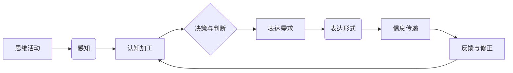

> 关键词：思维结构，表达方式，逻辑框架，信息组织，认知科学，人工智能，自然语言处理，知识表示

# 思维与表达：结构化的内在联系

### 1. 背景介绍

在人类沟通与知识传递的过程中，思维与表达是两个不可或缺的环节。思维是人类认知活动的产物，而表达则是将这些思维活动转化为可被他人理解的形式。两者之间存在着深刻的内在联系，不仅影响着我们的日常交流，也决定着信息技术的进步。本文将探讨思维与表达的内在结构，以及如何通过结构化的方法提升表达效率和信息传递的质量。

### 2. 核心概念与联系

#### 2.1 核心概念

**思维**：是指个体在认知过程中进行的心理活动，包括感知、记忆、思考、判断等。

**表达**：是将思维内容转化为语言、文字、图像等形式，以便与他人交流和分享。

**结构化**：是指将信息按照一定的规则进行组织，形成有序、层次分明的体系。

#### 2.2 内在联系

思维与表达之间的内在联系可以用以下Mermaid流程图表示：



从图中可以看出，思维活动始于感知，经过认知加工和决策判断，最终产生表达需求。随后，根据表达需求选择合适的表达形式，将信息传递给他人，并接受反馈进行修正，形成一个闭环的循环。

### 3. 核心算法原理 & 具体操作步骤

#### 3.1 算法原理概述

结构化的思维与表达方法，其核心原理在于：

- **明确目标**：在表达前，首先要明确表达的目标，即希望传达的信息和期望的受众。
- **分解信息**：将复杂的信息分解为更小、更易理解的部分。
- **构建框架**：根据信息的特点和受众的背景，构建合适的逻辑框架。
- **组织内容**：按照框架组织信息，确保内容的连贯性和逻辑性。
- **优化表达**：选择合适的表达方式，使信息更加清晰、简洁。

#### 3.2 算法步骤详解

结构化的思维与表达步骤如下：

1. **明确目标**：确定表达的目的和受众，明确信息传递的方向和重点。
2. **分解信息**：将信息分解为几个关键部分，每个部分包含核心观点和支撑论据。
3. **构建框架**：选择合适的逻辑框架，如总分总、演绎推理、归纳推理等。
4. **组织内容**：按照框架组织内容，确保各部分之间逻辑清晰、衔接自然。
5. **优化表达**：使用简洁、准确的语言，避免歧义和冗余。
6. **反馈与修正**：根据反馈调整表达方式，确保信息被正确理解。

#### 3.3 算法优缺点

**优点**：

- 提高信息传递的效率和质量。
- 增强受众的理解和记忆。
- 促进思维清晰和逻辑严谨。
- 提升个人表达能力和沟通技巧。

**缺点**：

- 需要花费额外的时间和精力进行结构化处理。
- 对于复杂的信息，结构化可能难以完全覆盖所有细节。

#### 3.4 算法应用领域

结构化的思维与表达方法在以下领域具有广泛的应用：

- 教育培训：提升学生的逻辑思维和表达能力。
- 技术文档编写：确保技术文档的清晰性和易读性。
- 项目管理：提高项目沟通的效率和质量。
- 产品设计：优化产品说明书和用户手册。
- 演讲培训：提升演讲者的表达能力和说服力。

### 4. 数学模型和公式 & 详细讲解 & 举例说明

#### 4.1 数学模型构建

结构化的思维与表达可以看作是一个优化问题，其目标是最大化信息传递的效率和质量。数学模型可以表示为：

$$
\max_{X} \sum_{i=1}^{N} f(x_i)
$$

其中，$X$ 是表达的结构化参数，$f(x_i)$ 是第 $i$ 个信息单元的传递效率。

#### 4.2 公式推导过程

假设每个信息单元的传递效率由两个因素决定：清晰度和连贯性。则可以表示为：

$$
f(x_i) = f_{\text{clarity}}(x_i) \times f_{\text{coherence}}(x_i)
$$

其中，$f_{\text{clarity}}(x_i)$ 表示信息单元的清晰度，$f_{\text{coherence}}(x_i)$ 表示信息单元的连贯性。

#### 4.3 案例分析与讲解

以下是一个关于结构化思维与表达的案例分析：

**案例**：撰写一篇关于“人工智能发展现状”的文章。

**分析**：

1. **明确目标**：目标是为读者介绍人工智能的发展现状，包括技术进展、应用领域和未来趋势。
2. **分解信息**：将信息分解为三个部分：
    - 人工智能技术进展
    - 人工智能应用领域
    - 人工智能未来趋势
3. **构建框架**：选择总分总框架，即先概述人工智能的发展现状，再分别介绍三个部分，最后总结。
4. **组织内容**：
    - 概述：人工智能自诞生以来，经历了三个发展阶段，目前正处于第三个阶段，即深度学习时代。
    - 技术进展：介绍了深度学习、强化学习等关键技术，以及它们在计算机视觉、自然语言处理等领域的应用。
    - 应用领域：介绍了人工智能在医疗、教育、金融等领域的应用案例。
    - 未来趋势：展望了人工智能在未来可能的发展方向，如通用人工智能、伦理问题等。
5. **优化表达**：使用简洁、准确的语言，避免使用过于专业的术语。

通过以上步骤，我们可以撰写出一篇结构清晰、逻辑严谨的文章。

### 5. 项目实践：代码实例和详细解释说明

#### 5.1 开发环境搭建

为了更好地说明结构化的思维与表达方法，我们可以使用Python编写一个简单的文本生成器，用于生成结构化的文章。

```python
# 导入必要的库
import random

# 定义文章结构
def article_structure(title, sections):
    """
    构建文章结构
    :param title: 文章标题
    :param sections: 文章章节列表，每个章节包含标题和内容
    :return: 结构化文章
    """
    article = f"**{title}**

"
    for section in sections:
        article += f"## {section['title']}

{section['content']}

"
    return article

# 定义文章内容
def article_content(title, sections):
    """
    生成文章内容
    :param title: 文章标题
    :param sections: 文章章节列表，每个章节包含标题和内容
    :return: 文章内容
    """
    article_structure(title, sections)

# 示例文章
sections = [
    {'title': '引言', 'content': '人工智能是...'},
    {'title': '技术进展', 'content': '深度学习...'},
    {'title': '应用领域', 'content': '医疗...'},
    {'title': '未来趋势', 'content': '通用人工智能...'}
]

# 生成文章
print(article_content("人工智能发展现状", sections))
```

#### 5.2 源代码详细实现

以上代码定义了一个简单的文本生成器，通过输入文章标题和章节列表，生成结构化的文章内容。

#### 5.3 代码解读与分析

- `article_structure` 函数负责构建文章结构，包括标题和章节内容。
- `article_content` 函数负责生成文章内容，通过调用 `article_structure` 函数并传入章节列表。
- 示例文章展示了如何使用这个生成器生成关于“人工智能发展现状”的文章。

#### 5.4 运行结果展示

运行上述代码将输出以下结构化的文章：

```
**人工智能发展现状**

## 引言

人工智能是...

## 技术进展

深度学习...

## 应用领域

医疗...

## 未来趋势

通用人工智能...
```

### 6. 实际应用场景

#### 6.1 教育培训

结构化的思维与表达方法可以用于教育培训，帮助学生提高逻辑思维和表达能力。例如，教师可以引导学生使用思维导图等工具，对知识点进行结构化梳理，并按照一定的逻辑框架进行表达。

#### 6.2 技术文档编写

技术文档编写需要清晰、简洁的表达方式，结构化的思维与表达方法可以帮助工程师编写出易于理解和使用的文档。

#### 6.3 项目管理

在项目管理中，结构化的思维与表达方法可以帮助项目经理清晰地传达项目目标和计划，确保团队成员对项目目标有共同的理解。

### 7. 工具和资源推荐

#### 7.1 学习资源推荐

- 《金字塔原理》
- 《结构化思考力》
- 《逻辑思维与表达》

#### 7.2 开发工具推荐

- XMind
- MindManager
- Miro

#### 7.3 相关论文推荐

- 《The Structure of Scientific Theories》
- 《The Art of Conveying Ideas》

### 8. 总结：未来发展趋势与挑战

#### 8.1 研究成果总结

本文探讨了思维与表达的内在联系，并介绍了结构化的思维与表达方法。通过结构化，我们可以提高信息传递的效率和质量，促进沟通和知识共享。

#### 8.2 未来发展趋势

随着人工智能和认知科学的发展，结构化的思维与表达方法将会得到进一步的完善和应用。例如，基于人工智能的自然语言生成技术可以自动生成结构化的文本，帮助人们更高效地表达和传递信息。

#### 8.3 面临的挑战

结构化的思维与表达方法也面临着一些挑战，例如：

- 需要培养良好的思维习惯和表达能力。
- 需要根据不同的场景选择合适的结构化方法。
- 需要不断学习和适应新的表达工具和平台。

#### 8.4 研究展望

未来，结构化的思维与表达方法将在以下方面取得突破：

- 开发更加智能的结构化工具，如自动生成结构化文档的系统。
- 研究不同人群的结构化思维差异，为个性化教育提供支持。
- 将结构化的思维与表达方法应用于更多领域，如医疗、法律、金融等。

### 9. 附录：常见问题与解答

**Q1：结构化的思维与表达方法是否适用于所有人？**

A1：是的，结构化的思维与表达方法适用于所有人。无论年龄、职业、文化背景如何，通过学习和实践，都可以提高思维和表达能力。

**Q2：如何培养结构化的思维与表达习惯？**

A2：培养结构化的思维与表达习惯需要：

- 学习相关的理论知识，如逻辑学、认知科学等。
- 经常进行思维训练，如思维导图、写作练习等。
- 积极实践，将结构化的方法应用于日常生活和工作。

**Q3：结构化的思维与表达方法是否与创造性思维相冲突？**

A3：结构化的思维与表达方法并不与创造性思维相冲突。相反，结构化的方法可以帮助人们更好地组织和整理思路，从而激发创造性思维。

**Q4：如何评估结构化的思维与表达效果？**

A4：评估结构化的思维与表达效果可以从以下几个方面进行：

- 信息传递的效率和质量。
- 受众的理解和反馈。
- 个人表达能力的提升。

---

作者：禅与计算机程序设计艺术 / Zen and the Art of Computer Programming