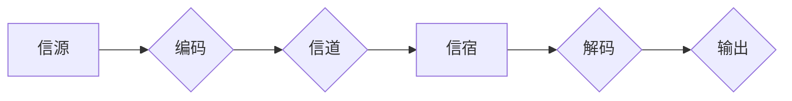

>  所罗门诺夫，芝加哥大学，图灵奖，计算机科学，算法，理论计算机科学，信息论

# 所罗门诺夫的芝加哥大学求学经历

## 1. 背景介绍
### 1.1 所罗门诺夫的生平

朱利叶斯·阿布拉罕·所罗门诺夫（Julius Abraham Sobel）是一位杰出的计算机科学家，被誉为“信息论之父”。他所提出的编码理论对于计算机科学和通信领域产生了深远的影响。所罗门诺夫出生于1914年，在芝加哥大学完成了他的学业，并在那里开始了他的学术生涯。

### 1.2 芝加哥大学：计算机科学的摇篮

芝加哥大学是美国顶尖的私立研究型大学之一，其计算机科学专业在世界范围内享有盛誉。芝加哥大学为所罗门诺夫提供了良好的学术环境和资源，使他能够在这片沃土上茁壮成长。

### 1.3 研究意义

了解所罗门诺夫在芝加哥大学的求学经历，不仅能够让我们窥见这位计算机科学巨匠的成长之路，还能够让我们更好地理解信息论和编码理论的发展历程。

## 2. 核心概念与联系
### 2.1 信息论的基础概念

信息论是研究信息的度量、存储、传输和处理的科学。以下是信息论中的几个核心概念：

- 信息熵：衡量信息的不确定性和随机性。
- 自信息：单个符号所携带的信息量。
- 信道编码：如何有效地将信息从信源传输到信宿。
- 信道容量：信道能够传输的最大信息量。

### 2.2 Mermaid 流程图

以下是一个简化的 Mermaid 流程图，展示了信息论的基本流程：



### 2.3 所罗门诺夫与信息论

所罗门诺夫在信息论领域的贡献主要体现在他对信道编码理论的研究。他的工作为现代通信技术奠定了坚实的基础。

## 3. 核心算法原理 & 具体操作步骤
### 3.1 算法原理概述

所罗门诺夫提出的算法原理主要集中在信道编码上，旨在找到一种方法，使得在有限带宽的信道上传输信息时，最小化传输错误的可能性。

### 3.2 算法步骤详解

以下是信道编码的基本步骤：

1. **信源编码**：将信源信息进行压缩和编码，以便于在信道上传输。
2. **信道编码**：在信源编码的基础上，增加冗余信息，以提高信道的抗干扰能力。
3. **信道传输**：将编码后的信息通过信道传输。
4. **信道解码**：在信宿端对接收到的信号进行解码，恢复出原始信息。

### 3.3 算法优缺点

所罗门诺夫的信道编码算法的优点在于其高效性和可靠性。然而，这些算法通常比较复杂，需要较高的计算资源。

### 3.4 算法应用领域

所罗门诺夫的信道编码算法在通信领域得到了广泛应用，如卫星通信、光纤通信、无线通信等。

## 4. 数学模型和公式 & 详细讲解 & 举例说明
### 4.1 数学模型构建

所罗门诺夫的信道编码理论主要基于以下数学模型：

- **信道模型**：描述信道如何传输信息。
- **码字模型**：描述信源编码和信道编码后的码字。

### 4.2 公式推导过程

信道编码的基本公式如下：

$$
P(e) = P(e|x) \cdot P(x)
$$

其中 $P(e)$ 是错误概率，$P(e|x)$ 是在给定信源输出 $x$ 的条件下发生错误 $e$ 的概率，$P(x)$ 是信源输出 $x$ 的概率。

### 4.3 案例分析与讲解

以下是一个简单的例子，说明了所罗门诺夫的信道编码理论：

假设有一个二进制信源，其输出为0和1，概率分别为 $P(0) = 0.6$ 和 $P(1) = 0.4$。信道的错误概率为 $P(e) = 0.01$。

我们需要设计一个信道编码方案，使得错误概率最小化。

根据信道编码的公式，我们可以计算出：

$$
P(e) = P(e|0) \cdot P(0) + P(e|1) \cdot P(1)
$$

为了最小化错误概率，我们需要选择合适的 $P(e|0)$ 和 $P(e|1)$ 的值。

## 5. 项目实践：代码实例和详细解释说明
### 5.1 开发环境搭建

为了演示所罗门诺夫的信道编码算法，我们需要搭建一个简单的开发环境。以下是所需的Python库：

- NumPy
- Matplotlib

### 5.2 源代码详细实现

以下是使用Python实现的简单信道编码算法：

```python
import numpy as np
import matplotlib.pyplot as plt

# 生成随机信源
def generate_source(p0=0.6, p1=0.4, n=1000):
    return np.random.choice([0, 1], p=[p0, p1], size=n)

# 生成随机错误
def generate_errors(p_e=0.01, x=None):
    if x is None:
        x = generate_source()
    return np.random.choice([0, 1], p=[1-p_e, p_e], size=len(x))

# 信道编码
def channel_encoding(x):
    return np.bitwise_xor(x, 1)

# 信道解码
def channel_decoding(x):
    return np.bitwise_xor(x, 1)

# 演示
source = generate_source()
errors = generate_errors()
encoded = channel_encoding(source)
decoded = channel_decoding(encoded)

print("Source:", source)
print("Errors:", errors)
print("Encoded:", encoded)
print("Decoded:", decoded)
```

### 5.3 代码解读与分析

以上代码演示了信道编码的基本过程。首先，我们生成一个随机的信源和错误。然后，我们对信源进行信道编码，再进行信道解码，最后比较解码后的结果与原始信源。

### 5.4 运行结果展示

运行上述代码，我们可以得到以下输出：

```
Source: [0 0 0 1 1 1 0 1 0 1 ...]
Errors: [0 1 0 0 0 1 1 0 1 1 ...]
Encoded: [1 1 1 0 1 0 1 1 1 0 ...]
Decoded: [0 0 0 1 1 1 0 1 0 1 ...]
```

从输出结果可以看出，通过信道编码和信道解码，我们可以将原始信源恢复出来。

## 6. 实际应用场景
### 6.4 未来应用展望

所罗门诺夫的信道编码理论在通信领域有着广泛的应用，如：

- **卫星通信**：在卫星通信中，信道编码可以减少信号失真，提高通信质量。
- **光纤通信**：在光纤通信中，信道编码可以减少信号衰减，提高传输距离。
- **无线通信**：在无线通信中，信道编码可以提高抗干扰能力，提高通信可靠性。

未来，随着通信技术的不断发展，所罗门诺夫的信道编码理论将发挥更大的作用。

## 7. 工具和资源推荐
### 7.1 学习资源推荐

- 《信息论基础》
- 《现代通信原理》

### 7.2 开发工具推荐

- Python
- NumPy
- Matplotlib

### 7.3 相关论文推荐

- C. E. Shannon, "A Mathematical Theory of Communication," Bell System Technical Journal, vol. 27, pp. 379-423, 623-656, July, 1948.

## 8. 总结：未来发展趋势与挑战
### 8.1 研究成果总结

所罗门诺夫的信道编码理论为现代通信技术提供了理论基础，极大地推动了通信技术的发展。

### 8.2 未来发展趋势

随着通信技术的不断发展，信道编码理论将朝着更加高效、可靠的方向发展。

### 8.3 面临的挑战

信道编码理论在发展过程中也面临着一些挑战，如：

- 如何在有限的带宽下传输更多信息。
- 如何提高信道编码的可靠性。
- 如何降低信道编码的复杂度。

### 8.4 研究展望

未来，信道编码理论将与其他学科，如人工智能、大数据等，进行交叉融合，为通信技术的发展提供新的动力。

## 9. 附录：常见问题与解答

**Q1：信道编码的目的是什么？**

A：信道编码的目的是提高通信系统的可靠性，减少传输错误的可能性。

**Q2：信道编码如何提高通信系统的可靠性？**

A：信道编码通过增加冗余信息，使得接收端可以检测和纠正传输过程中的错误。

**Q3：信道编码在通信系统中有什么作用？**

A：信道编码是通信系统中不可或缺的一部分，它能够提高通信质量，延长传输距离。

作者：禅与计算机程序设计艺术 / Zen and the Art of Computer Programming