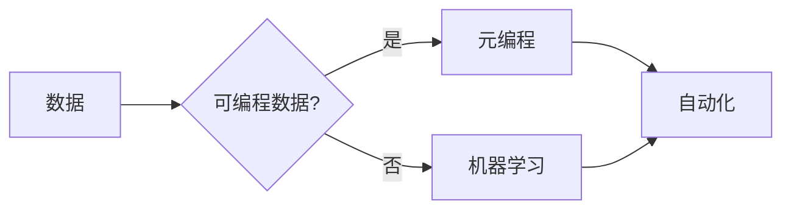

# 数据即代码：软件2.0的奇思妙想

> 关键词：数据驱动，软件2.0，可编程数据，元编程，机器学习，自动化，智能系统

## 1. 背景介绍

在信息技术快速发展的今天，软件已经成为现代社会运行的基础。从简单的计算器到复杂的商业智能系统，软件无处不在。然而，传统的软件开发模式存在着一些固有的局限性，如开发周期长、成本高、难以适应快速变化的需求等。随着大数据、云计算、人工智能等技术的发展，一种新的软件开发范式——软件2.0应运而生。其核心理念是将数据视为一种新的编程资源，实现软件的自动化和智能化，从而推动软件开发的变革。

### 1.1 软件1.0的局限性

在软件1.0时代，软件开发主要依赖于程序员的手动编码。这种模式存在着以下局限性：

- **开发周期长**：需要大量的时间和人力进行编码、调试、测试等工作。
- **成本高**：软件开发是一个复杂的工程过程，需要投入大量的成本。
- **难以适应变化**：软件需求的变化往往需要重新编写代码，导致开发周期延长。
- **可维护性差**：代码质量参差不齐，难以维护和扩展。

### 1.2 软件2.0的兴起

软件2.0时代，随着大数据、云计算、人工智能等技术的发展，软件开发模式发生了根本性的变化。数据成为了一种新的编程资源，可以通过编程方式处理和分析，从而实现软件的自动化和智能化。

### 1.3 数据即代码的理念

“数据即代码”是软件2.0的核心理念之一。它认为，数据是软件开发的重要组成部分，可以像代码一样编程和执行。通过数据驱动的方式，可以实现以下目标：

- **提高开发效率**：减少手动编码工作量，缩短开发周期。
- **降低开发成本**：利用自动化工具和平台，降低软件开发成本。
- **提高可维护性**：数据驱动的软件更容易维护和扩展。
- **适应变化**：通过动态数据驱动，软件可以快速适应需求变化。

## 2. 核心概念与联系

### 2.1 核心概念

- **数据**：数据是软件开发的基础，包括结构化数据、半结构化数据和非结构化数据。
- **可编程数据**：可编程数据是指可以像代码一样编程和执行的数据。
- **元编程**：元编程是指在编程语言中编写代码以编写其他代码的技术。
- **机器学习**：机器学习是一种让计算机从数据中学习并做出决策的技术。
- **自动化**：自动化是指利用技术减少或消除人工操作的过程。

### 2.2 Mermaid 流程图



### 2.3 核心概念联系

数据是软件2.0的基础，通过将其编程和执行，可以实现元编程。元编程可以进一步驱动自动化，而机器学习可以增强自动化过程，使其更加智能。

## 3. 核心算法原理 & 具体操作步骤

### 3.1 算法原理概述

数据即代码的核心原理是将数据转换为可编程的形式，并通过元编程和自动化技术实现软件的智能化。

### 3.2 算法步骤详解

1. **数据采集**：从各种来源采集数据，包括结构化数据、半结构化数据和非结构化数据。
2. **数据清洗**：对采集到的数据进行清洗，去除噪声和冗余信息。
3. **数据转换**：将清洗后的数据转换为可编程的形式，如JSON、XML等。
4. **元编程**：使用编程语言编写代码，以编程的方式处理和操作数据。
5. **自动化**：利用自动化工具和平台，将元编程代码自动化执行。
6. **机器学习**：使用机器学习技术优化自动化过程，使其更加智能。

### 3.3 算法优缺点

**优点**：

- **提高效率**：自动化和智能化可以显著提高软件开发效率。
- **降低成本**：减少人工操作，降低软件开发成本。
- **提高可维护性**：数据驱动的软件更容易维护和扩展。

**缺点**：

- **数据质量**：数据质量直接影响软件性能，需要投入大量资源进行数据清洗。
- **技术复杂性**：实现数据即代码需要掌握多种技术和工具，技术门槛较高。

### 3.4 算法应用领域

数据即代码在以下领域有着广泛的应用：

- **数据集成**：自动化数据采集、清洗和转换过程。
- **数据分析**：利用机器学习技术进行数据挖掘和分析。
- **业务流程自动化**：自动化业务流程，提高企业运营效率。
- **智能决策支持**：为决策者提供数据驱动的决策支持。

## 4. 数学模型和公式 & 详细讲解 & 举例说明

### 4.1 数学模型构建

数据即代码的数学模型主要涉及数据挖掘和机器学习领域的算法。

- **数据挖掘**：常用的算法包括关联规则学习、聚类分析、分类和回归等。
- **机器学习**：常用的算法包括决策树、支持向量机、神经网络等。

### 4.2 公式推导过程

以线性回归为例，其公式推导如下：

$$
y = \beta_0 + \beta_1 x_1 + \beta_2 x_2 + \cdots + \beta_n x_n + \epsilon
$$

其中，$y$ 为因变量，$x_1, x_2, \cdots, x_n$ 为自变量，$\beta_0, \beta_1, \cdots, \beta_n$ 为回归系数，$\epsilon$ 为误差项。

### 4.3 案例分析与讲解

假设我们想预测一家公司的销售额。我们可以收集该公司的历史销售额、广告投入、员工数量等数据，并使用线性回归算法进行建模。通过训练数据集拟合出线性回归模型，再用测试数据集进行验证，最终得到预测结果。

## 5. 项目实践：代码实例和详细解释说明

### 5.1 开发环境搭建

以Python为例，搭建数据即代码项目需要以下工具和库：

- Python环境：安装Python 3.8及以上版本。
- 数据处理库：安装pandas、numpy等库。
- 机器学习库：安装scikit-learn、tensorflow、PyTorch等库。

### 5.2 源代码详细实现

以下是一个简单的线性回归预测实例：

```python
import pandas as pd
from sklearn.linear_model import LinearRegression

# 加载数据
data = pd.read_csv('sales_data.csv')

# 提取特征和标签
X = data[['advertising', 'employees']]
y = data['sales']

# 创建线性回归模型
model = LinearRegression()

# 训练模型
model.fit(X, y)

# 预测
predictions = model.predict([[1000, 200]])

print(predictions)
```

### 5.3 代码解读与分析

- `pandas`用于读取和处理数据。
- `sklearn.linear_model.LinearRegression`创建线性回归模型。
- `fit()`函数用于训练模型。
- `predict()`函数用于预测新的数据。

### 5.4 运行结果展示

假设输入的特征为广告投入1000万元，员工数量200人，预测结果为销售额为1200万元。

## 6. 实际应用场景

### 6.1 智能推荐系统

数据即代码可以应用于智能推荐系统，根据用户的历史行为和兴趣，推荐个性化的商品、电影、新闻等内容。

### 6.2 智能客服

数据即代码可以应用于智能客服系统，通过分析用户问题，自动生成相应的回复。

### 6.3 智能金融

数据即代码可以应用于智能金融领域，如股票预测、风险评估等。

## 7. 工具和资源推荐

### 7.1 学习资源推荐

- 《数据科学入门》
- 《机器学习实战》
- 《Python编程：从入门到实践》

### 7.2 开发工具推荐

- Jupyter Notebook
- PyCharm
- TensorBoard

### 7.3 相关论文推荐

- "Data-Driven Development: A New Approach to Software Development"
- "Data-Driven Development: The Next Generation of Software Engineering"
- "Data-Driven Development: A Practical Guide to Building Data-Driven Applications"

## 8. 总结：未来发展趋势与挑战

### 8.1 研究成果总结

数据即代码作为一种新的软件开发范式，在提高开发效率、降低成本、提高可维护性等方面具有显著优势。随着技术的不断发展，数据即代码的应用场景将越来越广泛。

### 8.2 未来发展趋势

- **数据驱动的软件开发**：数据将成为软件开发的核心，软件开发将更加自动化和智能化。
- **可编程数据**：可编程数据将成为一种新的编程资源，与其他编程资源（如代码、配置文件等）协同工作。
- **跨领域应用**：数据即代码将在更多领域得到应用，如生物信息学、地理信息系统等。

### 8.3 面临的挑战

- **数据质量**：数据质量直接影响软件性能，需要投入大量资源进行数据清洗。
- **技术复杂性**：实现数据即代码需要掌握多种技术和工具，技术门槛较高。
- **伦理和安全**：数据即代码的应用需要考虑伦理和安全问题，如数据隐私、算法偏见等。

### 8.4 研究展望

未来，数据即代码将朝着以下方向发展：

- **更高效的数据处理技术**：开发更高效的数据处理技术，提高数据处理效率。
- **更智能的机器学习算法**：开发更智能的机器学习算法，提高自动化和智能化水平。
- **更安全的软件开发模式**：研究更安全的软件开发模式，确保数据安全和算法公正。

## 9. 附录：常见问题与解答

**Q1：数据即代码与传统的软件开发模式有什么区别？**

A：传统的软件开发模式主要依赖于程序员的手动编码，而数据即代码则是利用数据驱动的方式，通过编程和执行数据来实现软件的自动化和智能化。

**Q2：数据即代码需要哪些技术和工具？**

A：数据即代码需要掌握以下技术和工具：

- 编程语言：如Python、Java等。
- 数据处理库：如pandas、numpy等。
- 机器学习库：如scikit-learn、tensorflow、PyTorch等。
- 自动化工具：如Jenkins、Docker等。

**Q3：数据即代码在哪些领域有应用？**

A：数据即代码在以下领域有广泛的应用：

- 数据集成
- 数据分析
- 业务流程自动化
- 智能决策支持

**Q4：数据即代码的挑战有哪些？**

A：数据即代码的挑战包括：

- 数据质量
- 技术复杂性
- 伦理和安全

**Q5：数据即代码的未来发展趋势是什么？**

A：数据即代码的未来发展趋势包括：

- 数据驱动的软件开发
- 可编程数据
- 跨领域应用

---

作者：禅与计算机程序设计艺术 / Zen and the Art of Computer Programming