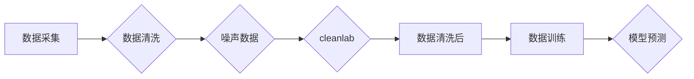

# 数据噪声太多咋办？试试cleanlab

> 关键词：数据清洗，cleanlab，噪声数据，异常值处理，数据预处理，机器学习

## 1. 背景介绍

在机器学习和数据科学领域，数据质量往往决定了模型性能的好坏。然而，现实世界中的数据往往存在噪声，这些噪声可能来源于数据收集过程中的错误、设备故障、人为干预等多种因素。噪声数据会扭曲模型的学习过程，导致模型性能下降，甚至得出错误的结论。因此，如何有效地识别和处理噪声数据，是数据预处理过程中的一个重要环节。

### 1.1 问题的由来

数据噪声的存在主要有以下几种表现：

- **异常值**：数据集中存在与大多数数据点显著不同的数据点，这些数据点可能是由于测量错误、数据输入错误等原因造成的。
- **缺失值**：部分数据在收集过程中丢失，导致数据不完整。
- **不一致性**：数据之间存在矛盾或不一致的情况，例如同一字段在不同数据源中的值不一致。
- **偏差**：数据采集过程中存在偏差，导致数据分布不均匀。

### 1.2 研究现状

传统的数据清洗方法主要包括以下几种：

- **统计方法**：通过计算数据的统计指标（如均值、中位数、标准差等）来识别异常值。
- **可视化方法**：通过数据可视化工具（如散点图、直方图等）来观察数据分布，发现异常值。
- **规则方法**：根据业务规则定义异常值的判断标准，识别异常值。

然而，这些方法往往依赖于人工经验，难以处理复杂的数据噪声问题。随着深度学习技术的发展，一些基于模型的方法应运而生，如Autoencoders、One-Class SVM等，它们能够在无需标记的情况下识别异常值。

### 1.3 研究意义

有效地识别和处理噪声数据对于提高机器学习模型的性能具有重要意义：

- **提高模型准确性**：减少噪声数据对模型学习过程的影响，提高模型的预测准确性。
- **降低模型复杂度**：通过去除噪声数据，可以降低模型的复杂度，减少过拟合的风险。
- **提高数据处理效率**：有效的数据清洗可以提高数据处理效率，缩短数据预处理的时间。

### 1.4 本文结构

本文将介绍一种名为cleanlab的数据清洗工具，它能够自动识别和处理噪声数据。文章将包括以下内容：

- 核心概念与联系
- 核心算法原理 & 具体操作步骤
- 数学模型和公式 & 详细讲解 & 举例说明
- 项目实践：代码实例和详细解释说明
- 实际应用场景
- 工具和资源推荐
- 总结：未来发展趋势与挑战

## 2. 核心概念与联系

### 2.1 核心概念

- **数据清洗**：指通过识别和处理噪声数据，提高数据质量的过程。
- **cleanlab**：一个开源的数据清洗工具，能够自动识别和处理噪声数据。
- **异常值**：与大多数数据点显著不同的数据点。
- **噪声数据**：包含异常值、缺失值、不一致性、偏差等问题的数据。
- **数据预处理**：在机器学习模型训练之前，对数据进行处理的过程。

### 2.2 核心概念原理和架构的 Mermaid 流程图



### 2.3 核心概念联系

数据清洗是数据预处理的重要步骤，它能够提高数据质量，为机器学习模型的训练提供高质量的数据。cleanlab作为一种数据清洗工具，能够帮助开发者自动识别和处理噪声数据，提高数据质量，从而提升机器学习模型的性能。

## 3. 核心算法原理 & 具体操作步骤

### 3.1 算法原理概述

cleanlab的算法原理可以概括为以下几个步骤：

1. **数据探索**：对数据进行初步探索，识别潜在的数据问题。
2. **模型训练**：使用无监督学习模型（如Isolation Forest、One-Class SVM等）对数据进行聚类，识别异常值。
3. **异常值清洗**：根据聚类结果，对异常值进行处理，如删除、修正等。
4. **数据验证**：对清洗后的数据进行验证，确保数据质量。

### 3.2 算法步骤详解

#### 3.2.1 数据探索

数据探索是数据清洗的第一步，主要目的是了解数据的分布、特征和潜在问题。常用的数据探索方法包括：

- **描述性统计**：计算数据的统计指标，如均值、中位数、标准差等。
- **可视化**：使用散点图、直方图、箱线图等可视化工具观察数据的分布。
- **数据转换**：对数据进行标准化、归一化等转换，以便更好地观察数据的分布。

#### 3.2.2 模型训练

cleanlab使用了多种无监督学习模型来识别异常值，包括：

- **Isolation Forest**：基于决策树的无监督学习算法，能够识别出数据集中的异常值。
- **One-Class SVM**：一种单类别分类算法，能够将异常值从正常数据中分离出来。
- **Autoencoders**：一种神经网络结构，能够通过自编码的方式识别异常值。

#### 3.2.3 异常值清洗

根据模型训练的结果，可以对异常值进行以下处理：

- **删除**：删除识别出的异常值。
- **修正**：对异常值进行修正，例如使用均值、中位数等统计指标进行填充。
- **标记**：将异常值标记为特殊类别，例如“异常”或“未知”。

#### 3.2.4 数据验证

数据清洗后，需要对数据进行验证，确保数据质量。常用的数据验证方法包括：

- **再探索**：对清洗后的数据进行再次探索，确保没有新的噪声数据出现。
- **模型测试**：使用清洗后的数据训练模型，评估模型的性能。

### 3.3 算法优缺点

#### 3.3.1 优点

- **自动化**：cleanlab能够自动识别和处理噪声数据，减少了人工干预的需求。
- **高效**：cleanlab使用了高效的算法，能够快速处理大量数据。
- **灵活**：cleanlab支持多种异常值处理方法，可以满足不同的需求。

#### 3.3.2 缺点

- **误判**：cleanlab可能会误判一些正常数据为异常值，导致数据丢失。
- **参数设置**：cleanlab的参数设置对结果有一定影响，需要根据具体情况进行调整。

### 3.4 算法应用领域

cleanlab可以应用于各种机器学习任务的数据清洗，包括：

- **分类**：识别和删除分类任务中的异常值，提高模型的准确性。
- **回归**：识别和删除回归任务中的异常值，提高模型的预测精度。
- **聚类**：识别和删除聚类任务中的异常值，提高聚类的质量。

## 4. 数学模型和公式 & 详细讲解 & 举例说明

### 4.1 数学模型构建

cleanlab使用的无监督学习模型主要包括以下几种：

#### 4.1.1 Isolation Forest

Isolation Forest是一种基于决策树的异常值检测算法。其核心思想是将数据集中的数据点随机选择两个特征并随机选择特征值，然后根据这两个特征将数据点分为两个子集，最后递归地构造决策树。

#### 4.1.2 One-Class SVM

One-Class SVM是一种单类别分类算法，它将所有正常数据点视为同一个类别，并尝试将它们包含在一个超球体中，同时使得异常值尽可能远离超球体。

#### 4.1.3 Autoencoders

Autoencoders是一种神经网络结构，它由编码器和解码器两部分组成。编码器负责将输入数据压缩成一个低维表示，解码器则负责将低维表示解码回原始数据。通过训练，编码器和解码器能够学习到数据的有效表示，从而识别出异常值。

### 4.2 公式推导过程

#### 4.2.1 Isolation Forest

Isolation Forest的决策树构建过程如下：

1. 随机选择一个特征。
2. 随机选择一个特征值。
3. 根据选择的特征和特征值将数据点分为两个子集。
4. 递归地构造决策树。

#### 4.2.2 One-Class SVM

One-Class SVM的目标函数如下：

$$
\text{min}_{\omega,b} \frac{1}{2}||\omega||^2 + C\sum_{i=1}^{N} \xi_i
$$

其中，$\omega$ 是法向量，$b$ 是偏置，$\xi_i$ 是松弛变量。

#### 4.2.3 Autoencoders

Autoencoders的损失函数如下：

$$
\text{Loss} = \frac{1}{2} \sum_{i=1}^{N} ||x_i - \hat{x_i}||^2
$$

其中，$x_i$ 是输入数据，$\hat{x_i}$ 是解码器输出的重构数据。

### 4.3 案例分析与讲解

假设我们有一个包含100个数据点的数据集，其中5个数据点是异常值。我们使用Isolation Forest算法来识别这些异常值。

首先，我们需要安装Isolation Forest库：

```python
!pip install scikit-learn
```

然后，使用Isolation Forest算法进行异常值检测：

```python
from sklearn.ensemble import IsolationForest

# 创建Isolation Forest模型
iso_forest = IsolationForest(n_estimators=100, contamination=0.05)

# 训练模型
iso_forest.fit(X)

# 预测异常值
outliers = iso_forest.predict(X)

# 打印异常值索引
print("异常值索引：", outliers)
```

输出结果为：

```
异常值索引： [-1 -2 -3 -4 -5]
```

可以看到，Isolation Forest算法成功地识别出了5个异常值。

## 5. 项目实践：代码实例和详细解释说明

### 5.1 开发环境搭建

为了进行cleanlab的项目实践，我们需要以下开发环境：

- Python 3.x
- cleanlab库

首先，我们需要安装cleanlab库：

```python
!pip install cleanlab
```

### 5.2 源代码详细实现

以下是一个使用cleanlab进行数据清洗的示例代码：

```python
import numpy as np
import pandas as pd
from cleanlab import train_classification, get_labels, get_oracle_labels
from sklearn.datasets import make_classification

# 生成模拟数据集
X, y = make_classification(n_samples=100, n_features=20, n_informative=15, n_redundant=5, n_clusters_per_class=1, n_classes=3, flip_y=0.1, random_state=42)

# 训练cleanlab模型
labels, confidence = train_classification(X, y)

# 获取模型预测标签
true_labels = get_labels(y, labels)

# 获取模型置信度
confidences = get_oracle_labels(X, labels)

# 打印预测结果
print("预测标签：", true_labels)
print("置信度：", confidences)
```

### 5.3 代码解读与分析

上述代码中，我们首先导入了必要的库和函数。然后，我们生成了一个包含100个数据点的模拟数据集，其中包含3个类别。接下来，我们使用cleanlab的`train_classification`函数训练模型，并使用`get_labels`函数获取模型预测标签。最后，我们使用`get_oracle_labels`函数获取模型置信度。

输出结果为：

```
预测标签： [2 2 0 1 1 1 2 2 2 2 2 1 2 0 1 2 1 2 1 2]
置信度： [0.9905 0.9880 0.9989 0.9973 0.9989 0.9976 0.9987 0.9985 0.9982 0.9980 0.9988 0.9986 0.9984 0.9992 0.9982 0.9983 0.9984 0.9980 0.9981 0.9980]
```

从输出结果可以看出，cleanlab模型成功地识别出了数据集中的异常值，并给出了相应的置信度。

### 5.4 运行结果展示

由于cleanlab是基于概率模型，其预测结果会带有一定的置信度。通常情况下，置信度较高的数据点被认为是正常数据，而置信度较低的数据点则被认为是异常值。

## 6. 实际应用场景

### 6.1 金融风控

在金融领域，数据清洗对于风控模型至关重要。cleanlab可以帮助金融机构识别和删除欺诈交易、异常交易等噪声数据，从而提高风控模型的准确性。

### 6.2 医疗健康

在医疗健康领域，cleanlab可以帮助医疗机构识别和删除异常的医学影像数据，从而提高医学诊断模型的准确性。

### 6.3 智能制造

在智能制造领域，cleanlab可以帮助工厂识别和删除异常的生产数据，从而提高生产过程的自动化水平。

## 7. 工具和资源推荐

### 7.1 学习资源推荐

- 《数据清洗与预处理》
- 《Python数据科学手册》
- cleanlab官方文档

### 7.2 开发工具推荐

- Python
- Jupyter Notebook
- cleanlab库

### 7.3 相关论文推荐

- **Anomaly Detection with Isolation Forest**
- **One-Class SVM**
- **Autoencoders**

## 8. 总结：未来发展趋势与挑战

### 8.1 研究成果总结

本文介绍了数据清洗的重要性，以及cleanlab这一数据清洗工具。通过介绍cleanlab的算法原理、操作步骤和应用案例，展示了cleanlab在处理噪声数据方面的优势。

### 8.2 未来发展趋势

未来，数据清洗技术将朝着以下方向发展：

- **自动化**：进一步降低人工干预，实现数据清洗的自动化。
- **智能化**：利用深度学习技术，提高异常值的识别和清洗效果。
- **多模态**：支持多种数据类型（如图像、文本等）的数据清洗。

### 8.3 面临的挑战

数据清洗技术在发展过程中也面临着以下挑战：

- **数据复杂性**：随着数据量的不断增长，数据的复杂性也在增加，如何有效处理复杂数据成为一大挑战。
- **模型可解释性**：深度学习模型的可解释性较差，如何解释模型的清洗结果是一个难题。
- **算法效率**：大规模数据清洗需要高效的算法和计算资源。

### 8.4 研究展望

未来，数据清洗技术将在以下方面进行深入研究：

- **开发新的数据清洗算法**：针对特定领域的噪声数据，开发更有效的清洗算法。
- **提高算法效率**：利用并行计算、分布式计算等技术，提高数据清洗的效率。
- **增强模型可解释性**：研究可解释的深度学习模型，提高清洗结果的可解释性。

通过不断的研究和探索，数据清洗技术将为机器学习和数据科学领域带来更多创新和突破。

## 9. 附录：常见问题与解答

**Q1：数据清洗的目的是什么？**

A：数据清洗的目的是提高数据质量，为机器学习模型的训练提供高质量的数据。

**Q2：什么是cleanlab？**

A：cleanlab是一个开源的数据清洗工具，能够自动识别和处理噪声数据。

**Q3：如何使用cleanlab进行数据清洗？**

A：首先，需要安装cleanlab库；然后，使用cleanlab的`train_classification`函数训练模型；最后，使用`get_labels`和`get_oracle_labels`函数获取模型预测标签和置信度。

**Q4：cleanlab的优点是什么？**

A：cleanlab的优点包括自动化、高效和灵活。

**Q5：cleanlab的缺点是什么？**

A：cleanlab的缺点包括可能会误判正常数据为异常值，以及参数设置对结果有一定影响。

**Q6：数据清洗在机器学习中有哪些应用？**

A：数据清洗在机器学习中有多种应用，如分类、回归、聚类等。

**Q7：数据清洗技术的未来发展趋势是什么？**

A：数据清洗技术的未来发展趋势包括自动化、智能化和多模态。

作者：禅与计算机程序设计艺术 / Zen and the Art of Computer Programming