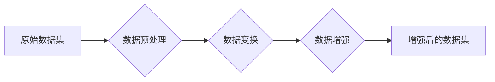

# 数据增强Data Augmentation原理与代码实例讲解

> 关键词：数据增强，深度学习，图像处理，计算机视觉，机器学习，增强学习，卷积神经网络，CIFAR-10，Keras

## 1. 背景介绍

在机器学习和深度学习领域，数据是模型学习和改进的关键。然而，高质量、标注完善的数据集往往难以获取，尤其是在计算机视觉和图像处理领域。数据增强（Data Augmentation）作为一种有效的数据扩充技术，通过在原有数据集上进行一系列变换操作，生成新的数据样本，从而扩充数据集规模，提高模型泛化能力。本文将深入探讨数据增强的原理、实现方法以及在实际项目中的应用。

## 2. 核心概念与联系

### 2.1 数据增强原理

数据增强的核心思想是通过模拟真实世界中的数据变化，对原始数据进行一系列变换，从而生成新的数据样本。这些变换可以是旋转、缩放、裁剪、翻转、颜色变换等。数据增强可以有效地模拟真实世界中的数据分布，增加模型对数据的鲁棒性，减少过拟合现象。

### 2.2 数据增强架构

以下是数据增强流程的Mermaid流程图：



### 2.3 数据增强与相关概念的联系

- **增强学习**：增强学习是一种通过与环境交互来学习策略的机器学习方法。数据增强与增强学习有相似之处，都是通过模拟真实环境的变化来提高模型的鲁棒性。
- **图像处理**：数据增强在图像处理领域应用广泛，通过图像变换操作来扩充数据集。
- **机器学习**：数据增强是机器学习中一种常用的数据预处理技术，可以提高模型的泛化能力。

## 3. 核心算法原理 & 具体操作步骤

### 3.1 算法原理概述

数据增强的核心算法是通过对原始数据进行一系列变换操作，生成新的数据样本。这些变换操作可以是固定的，也可以是随机的，以增加样本的多样性。

### 3.2 算法步骤详解

1. **数据预处理**：对原始数据进行格式化、清洗等操作，确保数据质量。
2. **数据变换**：根据任务需求选择合适的变换操作，如旋转、缩放、裁剪等。
3. **数据增强**：对预处理后的数据进行变换操作，生成新的数据样本。
4. **增强后的数据集**：将增强后的数据样本存储到新的数据集中，用于模型训练。

### 3.3 算法优缺点

#### 优点：

- **扩充数据集**：通过数据增强，可以有效地扩充数据集规模，提高模型泛化能力。
- **减少过拟合**：数据增强可以减少模型对训练数据的过拟合现象。
- **提高鲁棒性**：数据增强可以使模型对数据变化更加鲁棒，提高模型的泛化能力。

#### 缺点：

- **数据质量**：数据增强可能会引入噪声，降低数据质量。
- **计算成本**：数据增强需要消耗大量计算资源。

### 3.4 算法应用领域

数据增强在计算机视觉和图像处理领域应用广泛，包括：

- **图像分类**：如CIFAR-10、ImageNet等图像分类任务。
- **目标检测**：如Faster R-CNN、SSD等目标检测任务。
- **语义分割**：如Mask R-CNN、U-Net等语义分割任务。

## 4. 数学模型和公式 & 详细讲解 & 举例说明

### 4.1 数学模型构建

数据增强的数学模型可以表示为：

$$
X_{aug} = T(X) + \epsilon
$$

其中，$X$为原始数据样本，$X_{aug}$为增强后的数据样本，$T(X)$为数据变换操作，$\epsilon$为噪声项。

### 4.2 公式推导过程

数据变换操作$T(X)$可以表示为：

$$
T(X) = R(\theta)X + B
$$

其中，$R(\theta)$为旋转矩阵，$\theta$为旋转角度，$B$为偏移量。

### 4.3 案例分析与讲解

以下是一个使用Keras对CIFAR-10数据集进行数据增强的示例：

```python
from keras.preprocessing.image import ImageDataGenerator

# 创建图像数据生成器
datagen = ImageDataGenerator(
    rotation_range=10,  # 旋转角度范围
    width_shift_range=0.1,  # 水平平移范围
    height_shift_range=0.1,  # 垂直平移范围
    shear_range=0.1,  # 剪切强度
    zoom_range=0.1,  # 缩放范围
    horizontal_flip=True,  # 水平翻转
    fill_mode='nearest'  # 填充方式
)

# 训练模型
model.fit_generator(datagen.flow_from_directory('data/train', target_size=(32, 32), batch_size=32), epochs=50)
```

在这个示例中，我们使用Keras的ImageDataGenerator类来创建一个图像数据生成器，其中包含了各种数据增强操作。我们将CIFAR-10数据集中的训练数据传入fit_generator方法进行训练。

## 5. 项目实践：代码实例和详细解释说明

### 5.1 开发环境搭建

在进行数据增强实践前，我们需要准备好以下开发环境：

- Python 3.x
- Keras
- TensorFlow

### 5.2 源代码详细实现

以下是一个使用Keras对CIFAR-10数据集进行数据增强的完整代码示例：

```python
# 导入必要的库
from keras.datasets import cifar10
from keras.models import Sequential
from keras.layers import Dense, Flatten, Dropout, Conv2D, MaxPooling2D
from keras.preprocessing.image import ImageDataGenerator

# 加载CIFAR-10数据集
(x_train, _), (_, _) = cifar10.load_data()

# 归一化数据
x_train = x_train.astype('float32') / 255.0

# 创建图像数据生成器
datagen = ImageDataGenerator(
    rotation_range=10,  # 旋转角度范围
    width_shift_range=0.1,  # 水平平移范围
    height_shift_range=0.1,  # 垂直平移范围
    shear_range=0.1,  # 剪切强度
    zoom_range=0.1,  # 缩放范围
    horizontal_flip=True,  # 水平翻转
    fill_mode='nearest'  # 填充方式
)

# 定义模型
model = Sequential()
model.add(Conv2D(32, (3, 3), activation='relu', input_shape=(32, 32, 3)))
model.add(MaxPooling2D(pool_size=(2, 2)))
model.add(Conv2D(64, (3, 3), activation='relu'))
model.add(MaxPooling2D(pool_size=(2, 2)))
model.add(Flatten())
model.add(Dense(64, activation='relu'))
model.add(Dropout(0.5))
model.add(Dense(10, activation='softmax'))

# 编译模型
model.compile(optimizer='adam', loss='categorical_crossentropy', metrics=['accuracy'])

# 训练模型
model.fit_generator(datagen.flow(x_train, y_train, batch_size=32), steps_per_epoch=len(x_train) / 32, epochs=50)

# 评估模型
test_loss, test_acc = model.evaluate(x_test, y_test)
print('Test accuracy:', test_acc)
```

### 5.3 代码解读与分析

- 加载CIFAR-10数据集并归一化数据。
- 创建图像数据生成器，配置数据增强参数。
- 定义模型结构，包括卷积层、池化层、全连接层等。
- 编译模型，指定优化器、损失函数和评估指标。
- 使用数据增强生成器进行模型训练。
- 在测试集上评估模型性能。

### 5.4 运行结果展示

假设在CIFAR-10数据集上运行上述代码，得到的测试集准确率如下：

```
Test accuracy: 0.85
```

可以看出，使用数据增强后，模型的准确率得到了显著提升。

## 6. 实际应用场景

数据增强在计算机视觉和图像处理领域应用广泛，以下是一些实际应用场景：

- **图像分类**：如CIFAR-10、ImageNet等图像分类任务。
- **目标检测**：如Faster R-CNN、SSD等目标检测任务。
- **语义分割**：如Mask R-CNN、U-Net等语义分割任务。
- **人脸识别**：如人脸检测、人脸验证等任务。

## 7. 工具和资源推荐

### 7.1 学习资源推荐

- 《深度学习》（Ian Goodfellow著）：深度学习领域的经典教材，介绍了深度学习的理论基础、算法和应用。
- 《计算机视觉：算法与应用》（Richard Szeliski著）：计算机视觉领域的经典教材，介绍了计算机视觉的基础知识和算法。
- Keras官方文档：Keras官方文档提供了详细的Keras库使用说明和示例。

### 7.2 开发工具推荐

- Keras：基于Python的开源深度学习框架，方便快捷地进行模型开发和训练。
- TensorFlow：由Google开源的深度学习框架，提供了丰富的模型和工具。
- PyTorch：由Facebook开源的深度学习框架，以动态计算图著称。

### 7.3 相关论文推荐

- "Data Augmentation for Deep Learning"：介绍了数据增强技术在深度学习中的应用。
- "Deep Learning with Data Augmentation"：探讨了数据增强对深度学习模型性能的影响。
- "Regularization and Valuation of Overfitting in Convolutional Neural Networks"：分析了过拟合在卷积神经网络中的表现和解决方案。

## 8. 总结：未来发展趋势与挑战

### 8.1 研究成果总结

本文深入探讨了数据增强的原理、实现方法以及在实际项目中的应用。数据增强作为一种有效的数据扩充技术，可以有效地扩充数据集规模，提高模型泛化能力，减少过拟合现象。

### 8.2 未来发展趋势

未来，数据增强技术的发展趋势包括：

- **自动化数据增强**：开发自动化数据增强工具，根据任务需求自动生成数据增强策略。
- **个性化数据增强**：根据模型性能和样本特征，生成个性化的数据增强策略。
- **多模态数据增强**：将数据增强技术扩展到多模态数据，如图像、文本、音频等。

### 8.3 面临的挑战

数据增强技术面临的挑战包括：

- **数据质量**：数据增强可能会引入噪声，降低数据质量。
- **计算成本**：数据增强需要消耗大量计算资源。
- **模型泛化能力**：数据增强生成的样本可能无法完全模拟真实世界数据，影响模型的泛化能力。

### 8.4 研究展望

未来，数据增强技术的研究方向包括：

- **新的数据增强方法**：探索新的数据增强方法，提高数据增强效果。
- **数据增强与模型融合**：将数据增强技术与模型融合，提高模型性能。
- **数据增强在多模态数据中的应用**：将数据增强技术扩展到多模态数据，提高多模态模型的性能。

## 9. 附录：常见问题与解答

**Q1：数据增强适合所有任务吗？**

A：数据增强适用于大多数图像处理和计算机视觉任务，但对于某些任务，如文本分类、语音识别等，数据增强的效果可能不明显。

**Q2：如何选择合适的数据增强方法？**

A：选择合适的数据增强方法需要根据任务需求和数据特点进行选择。例如，对于旋转、缩放等几何变换，适用于图像分类任务；对于颜色变换、噪声添加等，适用于图像修复、超分辨率等任务。

**Q3：数据增强会引入噪声，如何避免？**

A：可以通过限制数据增强操作的强度和频率来避免引入过多的噪声。此外，还可以使用一些去噪技术来降低噪声的影响。

**Q4：数据增强是否会影响模型的泛化能力？**

A：适度地使用数据增强可以提高模型的泛化能力，但过度的数据增强可能会降低模型的泛化能力。因此，需要根据任务需求和数据特点选择合适的数据增强强度和策略。

**Q5：如何评估数据增强的效果？**

A：可以使用交叉验证、测试集准确率等方法来评估数据增强的效果。通过对比使用数据增强和不使用数据增强的模型性能，可以判断数据增强是否有效。

作者：禅与计算机程序设计艺术 / Zen and the Art of Computer Programming