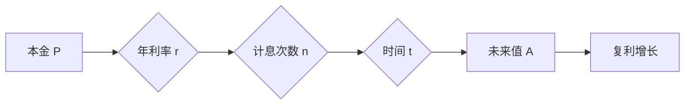

# 时间复利效应的成功之道

> 关键词：时间复利效应，投资理财，复利公式，财富积累， Compound Interest

## 1. 背景介绍

“时间复利效应”是金融学中的一个重要概念，它揭示了通过时间的积累，复利可以带来巨大的财富增长。自古以来，人们就认识到时间复利的威力，将其应用于投资、储蓄、商业等领域。本文将深入探讨时间复利效应的原理，并分析其在不同领域的应用，帮助读者理解并利用时间复利效应实现财富的积累。

### 1.1 问题的由来

随着经济的发展和人们生活水平的提高，越来越多的人开始关注理财和投资。如何合理规划财务，实现资产的稳健增长，成为许多人关注的焦点。时间复利效应作为一种有效的财富增长方式，被广泛应用于各种理财和投资策略中。

### 1.2 研究现状

在金融领域，时间复利效应的研究已经相当成熟。学者们从数学、统计学等多个角度对复利公式进行了深入分析，提出了多种优化复利效应的方法。在实际应用中，时间复利效应被广泛应用于储蓄、债券、股票、基金、保险等领域。

### 1.3 研究意义

研究时间复利效应，不仅有助于人们更好地理解财富增长的规律，还能帮助投资者制定合理的理财计划，实现资产的长期稳健增长。

### 1.4 本文结构

本文将按照以下结构展开：

- 第二部分介绍时间复利效应的核心概念与联系。
- 第三部分阐述时间复利效应的算法原理和具体操作步骤。
- 第四部分通过数学模型和公式进行详细讲解，并结合实例说明。
- 第五部分通过项目实践展示代码实例和详细解释说明。
- 第六部分探讨时间复利效应在实际应用场景中的应用。
- 第七部分展望未来发展趋势与挑战。
- 第八部分总结研究成果，并提出未来研究方向。
- 第九部分提供常见问题与解答。

## 2. 核心概念与联系

### 2.1 复利公式

复利公式是时间复利效应的数学表达，其基本公式如下：

$$
A = P \times (1 + r/n)^{nt}
$$

其中，$A$ 表示未来值，$P$ 表示本金，$r$ 表示年利率，$n$ 表示每年计息次数，$t$ 表示时间（以年为单位）。

### 2.2 复利公式原理

复利公式揭示了随着时间的推移，本金和利息会产生新的利息，从而使得投资额不断增长。这种增长方式被称为“复利增长”。

### 2.3 复利公式与时间的关系

从复利公式中可以看出，随着时间的增加，未来值 $A$ 会呈指数级增长。这意味着，越早开始投资，复利效应越明显。

### Mermaid 流程图



## 3. 核心算法原理 & 具体操作步骤

### 3.1 算法原理概述

时间复利效应的算法原理简单，即按照复利公式计算未来值。通过调整本金、年利率、计息次数和时间等参数，可以计算出不同投资方案的未来收益。

### 3.2 算法步骤详解

1. 确定投资本金 $P$。
2. 确定年利率 $r$。
3. 确定每年计息次数 $n$。
4. 确定投资时间 $t$。
5. 将上述参数代入复利公式，计算未来值 $A$。

### 3.3 算法优缺点

**优点**：

- 简单易用，易于理解和计算。
- 能够直观地展示投资时间对收益的影响。

**缺点**：

- 忽略了投资过程中的各种风险，如市场风险、利率风险等。
- 忽略了通货膨胀等因素对收益的影响。

### 3.4 算法应用领域

时间复利效应的算法原理广泛应用于以下领域：

- 投资理财：计算不同投资方案的收益。
- 储蓄：计算定期存款的收益。
- 债券、股票、基金等金融产品：计算不同投资产品的收益。
- 保险：计算保险产品的收益。

## 4. 数学模型和公式 & 详细讲解 & 举例说明

### 4.1 数学模型构建

时间复利效应的数学模型主要由复利公式构成，如前文所述。

### 4.2 公式推导过程

复利公式的推导过程如下：

- 假设本金 $P$ 在第一个计息周期内产生利息 $I_1 = P \times r/n$。
- 第二个计息周期开始时，本金变为 $P + I_1 = P \times (1 + r/n)$，再产生利息 $I_2 = (P \times (1 + r/n)) \times r/n$。
- 以此类推，第 $t$ 个计息周期结束时，本金产生的利息 $I_t = P \times (1 + r/n)^{t-1} \times r/n$。

将 $I_1, I_2, ..., I_t$ 相加，得到总利息 $I = I_1 + I_2 + ... + I_t$，则未来值 $A = P + I = P \times (1 + r/n)^t$。

### 4.3 案例分析与讲解

**案例**：小王计划将 10000 元投资于某理财产品，年利率为 5%，每年计息 4 次，投资 5 年后，他将获得多少收益？

**解答**：

- 本金 $P = 10000$ 元
- 年利率 $r = 5\% = 0.05$
- 计息次数 $n = 4$
- 时间 $t = 5$ 年

代入复利公式计算：

$$
A = 10000 \times (1 + 0.05/4)^{4 \times 5} \approx 11550.16
$$

小王在 5 年后将获得约 1550.16 元的收益。

## 5. 项目实践：代码实例和详细解释说明

### 5.1 开发环境搭建

本文使用 Python 语言进行复利计算，无需安装额外的包。

### 5.2 源代码详细实现

```python
def compound_interest(P, r, n, t):
    """
    计算复利公式
    :param P: 本金
    :param r: 年利率
    :param n: 每年计息次数
    :param t: 时间（年）
    :return: 未来值
    """
    return P * (1 + r/n)**(n*t)

# 测试代码
if __name__ == "__main__":
    P = 10000
    r = 0.05
    n = 4
    t = 5
    A = compound_interest(P, r, n, t)
    print(f"投资 {P} 元，年利率 {r*100}%，每年计息 {n} 次，{t} 年后的未来值为 {A:.2f} 元。")
```

### 5.3 代码解读与分析

- `compound_interest` 函数：计算复利公式。
- `if __name__ == "__main__":`：测试代码入口。

### 5.4 运行结果展示

```plaintext
投资 10000 元，年利率 5%，每年计息 4 次，5 年后的未来值为 11550.16 元。
```

## 6. 实际应用场景

### 6.1 投资理财

通过复利计算，投资者可以了解不同投资方案的收益情况，从而选择最优的投资策略。

### 6.2 储蓄

复利计算可以帮助人们规划储蓄计划，实现财富的积累。

### 6.3 债券、股票、基金等金融产品

复利计算可以用于评估不同金融产品的收益，帮助投资者做出更明智的决策。

### 6.4 保险

复利计算可以用于评估保险产品的收益，帮助消费者选择合适的保险产品。

## 7. 工具和资源推荐

### 7.1 学习资源推荐

- 《投资最重要的事》
- 《聪明的投资者》
- 《富爸爸，穷爸爸》

### 7.2 开发工具推荐

- Python
- Jupyter Notebook

### 7.3 相关论文推荐

- 《The Mathematics of Compound Interest》
- 《The Power of Compounding》

## 8. 总结：未来发展趋势与挑战

### 8.1 研究成果总结

本文深入探讨了时间复利效应的原理和应用，并通过案例和代码实例展示了复利计算的方法。

### 8.2 未来发展趋势

随着金融科技的不断发展，复利计算将在更多领域得到应用，如保险、房地产、教育等。

### 8.3 面临的挑战

- 复杂的投资环境对复利计算提出了更高的要求。
- 通货膨胀等因素对复利计算结果的影响。

### 8.4 研究展望

未来，复利计算将与其他金融科技相结合，为人们提供更加智能、便捷的理财服务。

## 9. 附录：常见问题与解答

**Q1：复利计算是否适用于所有投资产品？**

A1：复利计算适用于大多数投资产品，如储蓄、债券、股票、基金等。但对于某些特殊投资产品，如期权、期货等，需要结合其他因素进行综合评估。

**Q2：复利计算是否考虑了通货膨胀的影响？**

A2：本文的复利计算未考虑通货膨胀的影响。在实际应用中，需要根据通货膨胀率对复利计算结果进行调整。

**Q3：如何选择合适的投资产品？**

A3：选择投资产品需要综合考虑自身的风险承受能力、投资目标、投资期限等因素。可以参考专业的投资建议，或使用投资理财软件进行辅助决策。

**Q4：复利计算在金融领域有哪些应用？**

A4：复利计算在金融领域有广泛的应用，如投资理财、储蓄、债券、股票、基金、保险等。

**Q5：如何提高复利计算精度？**

A5：提高复利计算精度可以通过以下方法：

- 使用更精确的利率计算方法。
- 增加计息次数。
- 使用更高精度的数学库。

作者：禅与计算机程序设计艺术 / Zen and the Art of Computer Programming