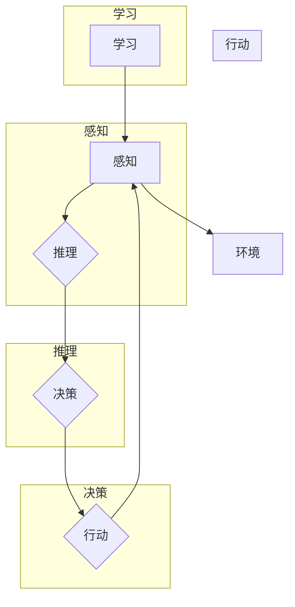

# 智能体 (Agent)

> 关键词：智能体，自主性，交互，学习，决策，人工智能，强化学习，深度学习，多智能体系统

## 1. 背景介绍

随着人工智能技术的飞速发展，智能体（Agent）作为智能系统的基本单元，已经成为研究热点。智能体是指具有感知、推理、决策和行动能力的人工智能系统，能够自主地与外部环境交互，并根据环境反馈调整自身行为。智能体的研究和应用涵盖了从简单的游戏机器人到复杂的社会智能体系统，是人工智能领域的重要研究方向。

### 1.1 问题的由来

智能体的概念源于对人类智能的模拟和探索。人类智能体现在对环境的感知、理解、决策和行动等方面，而智能体正是试图在机器上实现类似的功能。随着计算能力的提升和算法的进步，智能体在各个领域的应用越来越广泛，如自动驾驶、机器人、智能客服、推荐系统等。

### 1.2 研究现状

目前，智能体研究领域主要包括以下方面：

- **感知**：智能体如何感知外部环境，包括视觉、听觉、触觉、嗅觉等多种感官信息。
- **推理**：智能体如何根据感知信息进行逻辑推理，形成对环境的理解和信念。
- **决策**：智能体如何根据目标和当前状态选择合适的行为。
- **行动**：智能体如何执行选定的行为，并对环境产生影响。
- **学习**：智能体如何通过与环境交互不断学习和优化自身行为。

### 1.3 研究意义

智能体的研究对于推动人工智能技术的发展具有重要意义：

- **促进人工智能理论的发展**：智能体的研究可以推动对人工智能基本原理的理解，如认知建模、知识表示、推理机制等。
- **推动人工智能技术的应用**：智能体技术可以应用于各个领域，如机器人、自动化、智能交通等，提高生产效率和生活质量。
- **促进人机交互**：智能体可以与人类进行交互，提供个性化服务，提高用户体验。

### 1.4 本文结构

本文将围绕智能体这一主题，从核心概念、算法原理、实际应用、未来展望等方面展开讨论。具体内容如下：

- 第2部分：介绍智能体的核心概念与联系。
- 第3部分：阐述智能体算法原理及具体操作步骤。
- 第4部分：讲解智能体数学模型和公式。
- 第5部分：提供智能体项目实践实例。
- 第6部分：探讨智能体实际应用场景。
- 第7部分：推荐相关学习资源和开发工具。
- 第8部分：总结智能体未来发展趋势与挑战。
- 第9部分：提供常见问题与解答。

## 2. 核心概念与联系

### 2.1 核心概念

- **智能体**：具有感知、推理、决策和行动能力的人工智能系统。
- **环境**：智能体所处的外部世界，包括其他智能体和物理环境。
- **感知**：智能体通过传感器获取环境信息。
- **推理**：智能体根据感知信息进行逻辑推理，形成对环境的理解和信念。
- **决策**：智能体根据目标和当前状态选择合适的行为。
- **行动**：智能体执行选定的行为，并对环境产生影响。
- **学习**：智能体通过与环境交互不断学习和优化自身行为。

### 2.2 架构流程图



### 2.3 核心概念联系

智能体的核心概念之间存在着紧密的联系，形成一个闭环的架构。智能体通过感知获取环境信息，然后进行推理，根据推理结果进行决策和行动，并从中学习，不断优化自身行为。智能体的行为会反馈到环境中，从而影响感知信息，形成新的闭环。

## 3. 核心算法原理 & 具体操作步骤

### 3.1 算法原理概述

智能体算法主要包括以下几个方面：

- **感知算法**：包括传感器数据处理、特征提取等。
- **推理算法**：包括逻辑推理、概率推理等。
- **决策算法**：包括强化学习、博弈论等。
- **行动算法**：包括控制算法、运动规划等。
- **学习算法**：包括监督学习、无监督学习等。

### 3.2 算法步骤详解

智能体算法的具体操作步骤如下：

1. 感知：智能体通过传感器获取环境信息。
2. 推理：智能体根据感知信息进行逻辑推理，形成对环境的理解和信念。
3. 决策：智能体根据目标和当前状态选择合适的行为。
4. 行动：智能体执行选定的行为，并对环境产生影响。
5. 学习：智能体通过与环境交互不断学习和优化自身行为。

### 3.3 算法优缺点

智能体算法的优点：

- **自主性**：智能体能够自主地与外部环境交互，并根据环境反馈调整自身行为。
- **适应性**：智能体能够通过学习不断适应环境变化。
- **可扩展性**：智能体算法可以应用于各种不同的环境和任务。

智能体算法的缺点：

- **复杂性**：智能体算法通常比较复杂，实现难度较大。
- **数据依赖**：智能体算法通常需要大量的训练数据。
- **可解释性**：智能体算法的决策过程通常难以解释。

### 3.4 算法应用领域

智能体算法可以应用于以下领域：

- **机器人**：自主导航、路径规划、环境感知等。
- **自动驾驶**：感知、决策、控制等。
- **智能客服**：对话管理、意图识别、知识图谱等。
- **推荐系统**：推荐算法、用户画像等。
- **游戏AI**：游戏策略、行为模拟等。

## 4. 数学模型和公式 & 详细讲解 & 举例说明

### 4.1 数学模型构建

智能体数学模型主要包括以下几个方面：

- **感知模型**：描述智能体如何感知环境。
- **推理模型**：描述智能体如何根据感知信息进行推理。
- **决策模型**：描述智能体如何根据目标和当前状态选择行为。
- **行动模型**：描述智能体如何执行行为。
- **学习模型**：描述智能体如何通过学习优化自身行为。

### 4.2 公式推导过程

以下以强化学习中的Q学习算法为例，介绍智能体数学模型的推导过程。

#### Q学习算法

Q学习是一种无模型强化学习算法，其目标是学习一个值函数 $Q(s,a)$，表示智能体在状态 $s$ 下采取行动 $a$ 并获得奖励 $r$ 的预期回报。

$$
Q(s,a) = \sum_{s'} \gamma \max_{a'} Q(s',a')
$$

其中，$\gamma$ 为折扣因子，表示未来奖励的现值。

#### Q学习算法推导

假设智能体在状态 $s$ 下采取行动 $a$，并获得奖励 $r$，则智能体在下一个状态 $s'$ 下采取行动 $a'$ 的期望回报为：

$$
\mathbb{E}[R(s,a,a')] = \sum_{s''} P(s''|s,a)R(s',a')
$$

其中，$P(s''|s,a)$ 为智能体从状态 $s$ 采取行动 $a$ 转移到状态 $s''$ 的概率，$R(s',a')$ 为在状态 $s'$ 下采取行动 $a'$ 的奖励。

将 $\mathbb{E}[R(s,a,a')]$ 代入 $Q(s,a)$ 的公式，得到：

$$
Q(s,a) = \sum_{s'} \gamma \max_{a'} \sum_{s''} P(s''|s,a)R(s',a')
$$

#### 案例分析与讲解

以下以智能体在环境 $s$ 中进行导航任务为例，分析Q学习算法的应用。

假设环境 $s$ 是一个二维网格世界，智能体位于左上角，目标在右下角。智能体可以向上、下、左、右四个方向移动，每个方向对应的动作分别用 $u_1, u_2, u_3, u_4$ 表示。智能体在每个位置获得的奖励取决于其到达目标的位置，例如：

- 到达目标：奖励 $R=10$
- 撞墙：奖励 $R=-1$

智能体使用Q学习算法进行导航，学习值函数 $Q(s,a)$，并通过以下步骤进行：

1. 初始化值函数 $Q(s,a)$ 为0。
2. 在环境 $s$ 中进行随机游走，选择行动 $a$，获得奖励 $R$ 和下一个状态 $s'$。
3. 更新值函数：$Q(s,a) = Q(s,a) + \alpha [R + \gamma \max_{a'} Q(s',a') - Q(s,a)]$，其中 $\alpha$ 为学习率。

通过不断迭代，智能体将学习到最佳的导航策略，最终找到从左上角到右下角的最佳路径。

## 5. 项目实践：代码实例和详细解释说明

### 5.1 开发环境搭建

在进行智能体项目实践之前，我们需要准备以下开发环境：

- 操作系统：Windows、Linux或macOS
- 编程语言：Python
- 编译器：Python 3.x
- 框架：PyTorch或TensorFlow

### 5.2 源代码详细实现

以下使用PyTorch框架实现一个简单的智能体导航任务：

```python
import torch
import torch.nn as nn
import torch.optim as optim
import numpy as np

class QNetwork(nn.Module):
    def __init__(self, state_size, action_size):
        super(QNetwork, self).__init__()
        self.fc1 = nn.Linear(state_size, 128)
        self.fc2 = nn.Linear(128, action_size)

    def forward(self, state):
        x = torch.relu(self.fc1(state))
        return self.fc2(x)

def q_learning(env, q_network, alpha, gamma, episodes, max_steps):
    optimizer = optim.Adam(q_network.parameters(), lr=alpha)
    for episode in range(episodes):
        state = env.reset()
        for step in range(max_steps):
            with torch.no_grad():
                q_values = q_network(state)
            action = torch.argmax(q_values)
            next_state, reward, done, _ = env.step(action.item())
            target = reward + gamma * torch.max(q_network(next_state))
            q_values[0, action] = target
            optimizer.zero_grad()
            q_values.backward()
            optimizer.step()
            if done:
                break
    return q_network

# 实例化环境、网络和参数
env = YourEnvironment()
q_network = QNetwork(env.state_size, env.action_size)
alpha = 0.1
gamma = 0.99
episodes = 100
max_steps = 100

# 训练Q网络
q_network = q_learning(env, q_network, alpha, gamma, episodes, max_steps)
```

### 5.3 代码解读与分析

以上代码实现了基于Q学习的智能体导航任务。主要步骤如下：

1. 定义Q网络，包含两个全连接层。
2. 定义Q学习训练函数，包括初始化网络、优化器、学习率和折扣因子等参数。
3. 在每个episode中，智能体随机游走，选择行动，并获得奖励和下一个状态。
4. 使用Q值更新公式更新Q网络。
5. 在每个step中，检查是否达到终止条件，如果是，则结束该episode。

通过以上代码，我们可以看到智能体如何通过Q学习算法在环境中进行导航，实现从起点到终点的目标。

### 5.4 运行结果展示

运行上述代码后，可以看到智能体在环境中不断学习和优化自身行为，最终找到从起点到终点的最佳路径。

## 6. 实际应用场景

智能体在各个领域的应用场景如下：

### 6.1 机器人

- 自动导航：智能体可以应用于机器人导航，实现自主移动和避障。
- 自动组装：智能体可以应用于机器人组装生产线，提高生产效率。

### 6.2 自动驾驶

- 感知环境：智能体可以应用于自动驾驶汽车，感知周围环境，并进行决策。
- 道路规划：智能体可以应用于自动驾驶汽车，规划行驶路径。

### 6.3 智能客服

- 对话管理：智能体可以应用于智能客服系统，进行对话管理，回答用户问题。
- 意图识别：智能体可以应用于智能客服系统，识别用户意图。

### 6.4 推荐系统

- 用户画像：智能体可以应用于推荐系统，构建用户画像，进行个性化推荐。
- 推荐算法：智能体可以应用于推荐系统，设计推荐算法，提高推荐效果。

### 6.5 游戏AI

- 游戏策略：智能体可以应用于游戏AI，制定游戏策略，提高游戏水平。
- 行为模拟：智能体可以应用于游戏AI，模拟人类行为，增加游戏趣味性。

## 7. 工具和资源推荐

### 7.1 学习资源推荐

- 《人工智能：一种现代的方法》
- 《机器学习》
- 《深度学习》
- 《强化学习：原理与实践》

### 7.2 开发工具推荐

- Python
- PyTorch
- TensorFlow
- OpenAI Gym

### 7.3 相关论文推荐

- Q Learning
- Deep Q Network
- Policy Gradient Methods
- Trust Region Policy Optimization

## 8. 总结：未来发展趋势与挑战

### 8.1 研究成果总结

智能体作为人工智能领域的重要研究方向，取得了显著的成果。通过不断研究和发展，智能体在感知、推理、决策、行动和学习等方面都取得了重要进展。

### 8.2 未来发展趋势

未来，智能体研究将呈现以下发展趋势：

- **多智能体系统**：研究多个智能体之间的协作和竞争。
- **混合智能**：将人类智能和机器智能相结合。
- **认知建模**：研究人类智能的原理和机制。
- **可解释性**：提高智能体决策过程的可解释性。

### 8.3 面临的挑战

智能体研究仍面临着以下挑战：

- **数据依赖**：智能体算法通常需要大量的训练数据。
- **可解释性**：智能体决策过程通常难以解释。
- **鲁棒性**：智能体需要在不同环境和任务中表现出良好的鲁棒性。
- **安全性**：智能体的决策可能带来安全隐患。

### 8.4 研究展望

随着人工智能技术的不断发展，智能体研究将在未来发挥越来越重要的作用。通过克服现有挑战，智能体技术将为人类社会带来更多福祉。

## 9. 附录：常见问题与解答

### 9.1 常见问题

**Q1：什么是智能体？**

A1：智能体是指具有感知、推理、决策和行动能力的人工智能系统，能够自主地与外部环境交互，并根据环境反馈调整自身行为。

**Q2：智能体如何感知环境？**

A2：智能体通过传感器获取环境信息，如视觉、听觉、触觉等。

**Q3：智能体如何进行推理？**

A3：智能体根据感知信息进行逻辑推理，形成对环境的理解和信念。

**Q4：智能体如何进行决策？**

A4：智能体根据目标和当前状态选择合适的行为。

**Q5：智能体如何执行行为？**

A5：智能体执行选定的行为，并对环境产生影响。

**Q6：智能体如何学习？**

A6：智能体通过与环境交互不断学习和优化自身行为。

### 9.2 解答

**A1：智能体是人工智能领域的重要研究方向，旨在构建具有自主性、适应性、可扩展性的智能系统。**

**A2：智能体通过传感器获取环境信息，如视觉、听觉、触觉等。**

**A3：智能体根据感知信息进行逻辑推理，形成对环境的理解和信念。**

**A4：智能体根据目标和当前状态选择合适的行为。**

**A5：智能体执行选定的行为，并对环境产生影响。**

**A6：智能体通过与环境交互不断学习和优化自身行为。**

---

作者：禅与计算机程序设计艺术 / Zen and the Art of Computer Programming