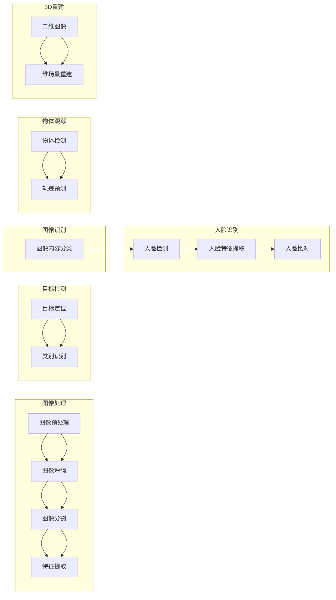

# 机器视觉 (Computer Vision)

> 关键词：计算机视觉，图像处理，深度学习，卷积神经网络，目标检测，图像识别，人脸识别，物体跟踪，深度学习框架

## 1. 背景介绍

机器视觉是人工智能领域的一个重要分支，它涉及到图像的获取、处理、分析和理解。随着深度学习技术的发展，机器视觉已经取得了显著的进步，并在工业自动化、医疗诊断、安全监控、自动驾驶等多个领域得到了广泛应用。本文将深入探讨机器视觉的核心概念、算法原理、实际应用和未来发展趋势。

### 1.1 问题的由来

机器视觉的研究起源于20世纪60年代，当时的主要目标是开发能够模拟人类视觉系统功能的计算机系统。随着数字成像技术的快速发展，机器视觉的应用场景逐渐增多。近年来，随着深度学习技术的突破，机器视觉的精度和效率得到了极大的提升，使得机器视觉技术成为人工智能领域的一个重要研究方向。

### 1.2 研究现状

当前，机器视觉的研究主要集中在以下几个方面：

- 图像处理：对图像进行预处理、增强、分割、特征提取等操作，以获得更有效的图像信息。
- 目标检测：定位图像中的物体并识别其类别。
- 图像识别：将图像中的内容分类到预定义的类别中。
- 人脸识别：从图像中识别并验证人脸的身份。
- 物体跟踪：在视频序列中追踪物体的运动轨迹。
- 3D重建：从二维图像中恢复出场景的三维信息。

### 1.3 研究意义

机器视觉技术的研发对于推动人工智能技术的发展具有重要意义，它不仅可以提高生产效率，降低人工成本，还可以提升人类生活的便利性和安全性。

### 1.4 本文结构

本文将按照以下结构进行展开：

- 第2部分，介绍机器视觉的核心概念和Mermaid流程图。
- 第3部分，阐述机器视觉的核心算法原理和操作步骤。
- 第4部分，讲解数学模型和公式，并举例说明。
- 第5部分，提供项目实践案例，包括开发环境搭建、代码实现和运行结果展示。
- 第6部分，探讨机器视觉的实际应用场景。
- 第7部分，展望机器视觉的未来发展趋势。
- 第8部分，总结研究成果和面临的挑战。
- 第9部分，提供常见问题与解答。

## 2. 核心概念与联系

### 2.1 核心概念

- **图像处理**：对图像进行滤波、增强、分割、特征提取等操作，以获得更有效的图像信息。
- **目标检测**：在图像中定位物体并识别其类别。
- **图像识别**：将图像内容分类到预定义的类别中。
- **人脸识别**：从图像中识别并验证人脸的身份。
- **物体跟踪**：在视频序列中追踪物体的运动轨迹。
- **3D重建**：从二维图像中恢复出场景的三维信息。

### 2.2 Mermaid流程图



### 2.3 核心概念之间的联系

机器视觉的核心概念之间存在着密切的联系。例如，图像处理是目标检测、图像识别和3D重建的基础，而目标检测和图像识别又是人脸识别和物体跟踪的关键步骤。

## 3. 核心算法原理 & 具体操作步骤

### 3.1 算法原理概述

机器视觉的核心算法主要包括以下几种：

- **卷积神经网络（CNN）**：一种特殊的神经网络，用于图像识别、目标检测和分类。
- **滑动窗口法**：用于目标检测，通过在图像上滑动窗口，对每个窗口内的图像进行特征提取和分类。
- **特征匹配**：用于图像识别和物体跟踪，通过比较图像之间的特征，确定它们之间的关系。

### 3.2 算法步骤详解

#### 3.2.1 卷积神经网络

卷积神经网络由多个卷积层、池化层和全连接层组成。卷积层用于提取图像特征，池化层用于减少特征的空间尺寸，全连接层用于进行最终的分类。

#### 3.2.2 滑动窗口法

滑动窗口法的基本步骤如下：

1. 在图像上定义一个固定大小的窗口。
2. 将窗口滑动到图像的每个位置，对窗口内的图像进行特征提取和分类。
3. 根据分类结果，选择最佳窗口。

#### 3.2.3 特征匹配

特征匹配的基本步骤如下：

1. 提取图像的特征向量。
2. 使用某种距离度量方法（如欧几里得距离）计算特征向量之间的距离。
3. 根据距离度量结果，确定图像之间的关系。

### 3.3 算法优缺点

#### 3.3.1 卷积神经网络

优点：

- 能够自动提取图像特征，无需人工设计特征。
- 能够处理复杂的图像数据。

缺点：

- 计算量大，需要大量的计算资源。
- 难以解释模型的决策过程。

#### 3.3.2 滑动窗口法

优点：

- 简单易实现。

缺点：

- 计算量大，效率低。
- 容易错过小物体。

#### 3.3.3 特征匹配

优点：

- 可解释性好。

缺点：

- 需要设计特征提取方法。
- 难以处理高维特征。

### 3.4 算法应用领域

卷积神经网络、滑动窗口法和特征匹配等算法在以下领域得到了广泛应用：

- 目标检测：如人脸检测、车辆检测等。
- 图像识别：如图像分类、物体识别等。
- 物体跟踪：如视频监控、自动驾驶等。

## 4. 数学模型和公式 & 详细讲解 & 举例说明

### 4.1 数学模型构建

机器视觉的数学模型主要包括以下几种：

- **卷积运算**：用于提取图像特征。
- **池化操作**：用于减少特征的空间尺寸。
- **距离度量**：用于特征匹配。

### 4.2 公式推导过程

#### 4.2.1 卷积运算

卷积运算的公式如下：

$$
f(x,y) = \sum_{i=1}^{m} \sum_{j=1}^{n} h_{i,j} * f(x-i+1,y-j+1)
$$

其中，$h_{i,j}$ 是卷积核，$f(x,y)$ 是卷积结果。

#### 4.2.2 池化操作

池化操作的公式如下：

$$
g(x,y) = \max_{i,j} f(x-i+1,y-j+1)
$$

其中，$g(x,y)$ 是池化结果。

#### 4.2.3 距离度量

距离度量的公式如下：

$$
d(f,g) = \sqrt{\sum_{i=1}^{m} \sum_{j=1}^{n} (f(x_i,y_j) - g(x_i,y_j))^2}
$$

其中，$d(f,g)$ 是特征向量 $f$ 和 $g$ 之间的距离。

### 4.3 案例分析与讲解

以下是一个简单的图像识别案例：

- **输入**：一张猫的图像。
- **输出**：图像被分类为“猫”类别。

在这个案例中，我们使用了卷积神经网络进行图像识别。首先，卷积神经网络提取图像的特征，然后全连接层对特征进行分类。最终，模型输出“猫”类别。

## 5. 项目实践：代码实例和详细解释说明

### 5.1 开发环境搭建

为了进行机器视觉项目的实践，我们需要以下开发环境：

- 操作系统：Linux或macOS
- 编程语言：Python
- 深度学习框架：TensorFlow或PyTorch
- 图像处理库：OpenCV

### 5.2 源代码详细实现

以下是一个简单的目标检测项目示例：

```python
import cv2
import numpy as np
import tensorflow as tf

# 加载预训练模型
model = tf.keras.models.load_model('faster_rcnn_model.h5')

# 加载图像
image = cv2.imread('cat.jpg')

# 预处理图像
image = cv2.resize(image, (416, 416))
image = tf.convert_to_tensor(image)
image = tf.expand_dims(image, 0)

# 进行目标检测
predictions = model.predict(image)

# 解析预测结果
boxes = predictions['detection_boxes'][0]
scores = predictions['detection_scores'][0]
classes = predictions['detection_classes'][0]

# 绘制检测结果
for i in range(len(classes)):
    if scores[i] > 0.5:
        box = boxes[i]
        class_id = classes[i]
        cv2.rectangle(image, (int(box[1]*image.shape[1]), int(box[0]*image.shape[0])), 
                      (int(box[3]*image.shape[1]), int(box[2]*image.shape[0])), (0, 255, 0), 2)
        cv2.putText(image, f'Class {class_id}', (int(box[1]*image.shape[1]), int(box[0]*image.shape[0])), 
                    cv2.FONT_HERSHEY_SIMPLEX, 0.9, (36,255,12), 2)

# 显示检测结果
cv2.imshow('检测结果', image)
cv2.waitKey(0)
cv2.destroyAllWindows()
```

### 5.3 代码解读与分析

在这个例子中，我们使用了Faster R-CNN模型进行目标检测。首先，我们加载了一个预训练的Faster R-CNN模型。然后，我们加载了一个图像，并对其进行预处理。接下来，我们使用模型对预处理后的图像进行目标检测，并解析预测结果。最后，我们绘制检测结果并显示图像。

### 5.4 运行结果展示

运行上述代码，我们将在图像中看到猫的检测结果，包括边界框和类别标签。

## 6. 实际应用场景

机器视觉技术在以下领域得到了广泛应用：

- **工业自动化**：用于质量控制、缺陷检测、装配线监控等。
- **医疗诊断**：用于医学图像分析、疾病检测等。
- **安全监控**：用于人脸识别、行为分析等。
- **自动驾驶**：用于车辆检测、障碍物识别、场景理解等。
- **智能家居**：用于人脸识别门禁、智能监控等。

## 7. 工具和资源推荐

### 7.1 学习资源推荐

- 《Deep Learning》
- 《Computer Vision: Algorithms and Applications》
- 《Learning OpenCV 4 Computer Vision with Python》

### 7.2 开发工具推荐

- TensorFlow
- PyTorch
- OpenCV

### 7.3 相关论文推荐

- "Faster R-CNN: Towards Real-Time Object Detection with Region Proposal Networks" by Ross Girshick et al.
- "YOLOv3: An Incremental Improvement" by Joseph Redmon et al.
- "SSD: Single Shot MultiBox Detector" by Wei Liu et al.

## 8. 总结：未来发展趋势与挑战

### 8.1 研究成果总结

机器视觉技术在近年来取得了显著的进步，深度学习模型的广泛应用使得机器视觉的精度和效率得到了极大的提升。然而，机器视觉技术仍然面临着一些挑战，如数据标注成本高、模型可解释性差等。

### 8.2 未来发展趋势

- **模型轻量化**：为了使机器视觉模型在实际应用中更加高效，未来的研究将更加关注模型轻量化和低功耗设计。
- **可解释性**：随着人工智能技术在各个领域的应用，模型的可解释性将越来越重要。
- **多模态学习**：将图像信息与其他模态信息（如文本、语音）进行融合，以获得更全面的信息。

### 8.3 面临的挑战

- **数据标注**：高质量的数据标注是机器视觉模型训练的基础，但数据标注成本高昂。
- **模型可解释性**：当前深度学习模型的可解释性较差，难以理解模型的决策过程。
- **泛化能力**：机器视觉模型在遇到新数据时容易过拟合，需要提高模型的泛化能力。

### 8.4 研究展望

未来，机器视觉技术将继续朝着以下方向发展：

- **数据驱动**：利用更多的数据来训练模型，提高模型的精度和泛化能力。
- **模型优化**：开发更加高效、轻量级的模型，降低模型对算力的需求。
- **跨领域应用**：将机器视觉技术应用于更多领域，推动人工智能技术的广泛应用。

## 9. 附录：常见问题与解答

**Q1：什么是卷积神经网络？**

A：卷积神经网络是一种特殊的神经网络，它由多个卷积层、池化层和全连接层组成。卷积神经网络能够自动提取图像特征，无需人工设计特征。

**Q2：什么是目标检测？**

A：目标检测是在图像中定位物体并识别其类别。常见的目标检测方法包括Faster R-CNN、SSD和YOLO等。

**Q3：什么是图像识别？**

A：图像识别是将图像内容分类到预定义的类别中。常见的图像识别方法包括卷积神经网络、支持向量机等。

**Q4：什么是人脸识别？**

A：人脸识别是从图像中识别并验证人脸的身份。常见的人脸识别方法包括人脸检测、人脸特征提取和人脸比对等。

**Q5：什么是物体跟踪？**

A：物体跟踪是在视频序列中追踪物体的运动轨迹。常见的物体跟踪方法包括基于跟踪器的跟踪和基于深度学习的跟踪等。

**Q6：什么是3D重建？**

A：3D重建是从二维图像中恢复出场景的三维信息。常见的3D重建方法包括多视图几何、深度学习等。

**Q7：机器视觉技术有哪些应用？**

A：机器视觉技术在工业自动化、医疗诊断、安全监控、自动驾驶、智能家居等多个领域得到了广泛应用。

**Q8：机器视觉技术有哪些挑战？**

A：机器视觉技术面临的挑战包括数据标注成本高、模型可解释性差、泛化能力有限等。

**Q9：如何解决机器视觉技术中的挑战？**

A：为了解决机器视觉技术中的挑战，我们可以从以下方面入手：

- 利用更多的数据来训练模型。
- 开发更加高效、轻量级的模型。
- 提高模型的可解释性。
- 提高模型的泛化能力。

**Q10：未来机器视觉技术将如何发展？**

A：未来，机器视觉技术将继续朝着数据驱动、模型优化、跨领域应用等方向发展。

作者：禅与计算机程序设计艺术 / Zen and the Art of Computer Programming