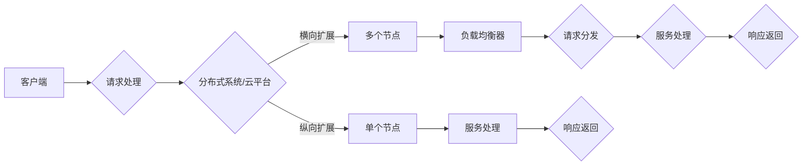

# 横向与纵向扩展的实现方法

> 关键词：横向扩展，纵向扩展，分布式系统，数据库，云计算，负载均衡，性能优化，资源管理

## 1. 背景介绍

在当今的互联网时代，随着业务量的爆炸式增长，传统的单机系统已经无法满足日益增长的性能需求。为了应对这种挑战，分布式系统和云平台应运而生。分布式系统通过将任务分解为多个节点，实现负载均衡和资源共享，从而提高系统的整体性能和可用性。而云平台则提供了弹性伸缩的能力，可以根据需求自动调整资源分配。本文将探讨横向与纵向扩展的实现方法，以及它们在分布式系统和云平台中的应用。

## 2. 核心概念与联系

### 2.1 核心概念

**横向扩展（Horizontal Scaling）**：通过增加更多的服务器或节点来扩展系统的处理能力。这种方法可以线性地提高系统的吞吐量。

**纵向扩展（Vertical Scaling）**：通过增加单个服务器的硬件资源（如CPU、内存、磁盘等）来提高系统的处理能力。这种方法可以非线性地提高系统的性能。

**分布式系统**：由多个独立的节点组成的系统，这些节点通过网络连接，共同完成一个或多个任务。

**云平台**：提供虚拟化资源和云计算服务的平台，可以动态地分配和扩展资源。

### 2.2 架构流程图

### 2.3 联系

横向扩展和纵向扩展是分布式系统和云平台中常用的两种扩展方法。横向扩展适用于处理大量的并发请求，而纵向扩展适用于提高单个任务的性能。

## 3. 核心算法原理 & 具体操作步骤

### 3.1 算法原理概述

**横向扩展**：通过负载均衡器将请求分发到多个节点，每个节点独立处理请求，然后返回响应。

**纵向扩展**：通过增加服务器的硬件资源，提高单个节点的处理能力。

### 3.2 算法步骤详解

#### 3.2.1 横向扩展

1. 评估系统的负载情况，确定是否需要横向扩展。
2. 选择合适的负载均衡器，如Nginx、HAProxy等。
3. 增加新的服务器或节点。
4. 配置负载均衡器，将请求分发到新的节点。
5. 测试系统的性能，确保扩展效果。

#### 3.2.2 纵向扩展

1. 评估系统的性能瓶颈。
2. 选择合适的硬件设备，如CPU、内存、磁盘等。
3. 更新或升级服务器的硬件设备。
4. 优化系统配置，如调整内存分配、缓存策略等。
5. 测试系统的性能，确保扩展效果。

### 3.3 算法优缺点

#### 3.3.1 横向扩展

优点：
- 灵活地扩展系统处理能力。
- 降低单个节点的负载，提高系统稳定性。
- 节点之间相互独立，易于维护和扩展。

缺点：
- 需要更多的服务器和运维成本。
- 负载均衡器的配置和管理较为复杂。

#### 3.3.2 纵向扩展

优点：
- 提高单个节点的处理能力，快速提升系统性能。
- 减少服务器数量，降低运维成本。

缺点：
- 硬件资源有限，扩展空间有限。
- 系统性能提升与硬件资源投入成正比，成本较高。

### 3.4 算法应用领域

横向扩展和纵向扩展在以下领域有广泛应用：

- Web服务：提高网站的并发处理能力。
- 数据库：提高数据库的查询和写入性能。
- 应用程序：提高应用程序的响应速度和稳定性。
- 云平台：提供弹性的资源分配和扩展能力。

## 4. 数学模型和公式 & 详细讲解 & 举例说明

### 4.1 数学模型构建

#### 4.1.1 横向扩展

假设系统原有N个节点，每个节点的处理能力为P，系统的总处理能力为N*P。当增加M个节点后，系统的总处理能力为(N+M)*P。

#### 4.1.2 纵向扩展

假设系统原有处理能力为P，通过增加硬件资源后，处理能力提升到P'（P'<P），则系统的性能提升为(P'/P)。

### 4.2 公式推导过程

#### 4.2.1 横向扩展

假设系统原有N个节点，每个节点的处理能力为P，系统的总处理能力为N*P。当增加M个节点后，系统的总处理能力为(N+M)*P。

$$
\text{新总处理能力} = (N + M) \times P
$$

#### 4.2.2 纵向扩展

假设系统原有处理能力为P，通过增加硬件资源后，处理能力提升到P'（P'<P），则系统的性能提升为(P'/P)。

$$
\text{性能提升} = \frac{P'}{P}
$$

### 4.3 案例分析与讲解

#### 4.3.1 横向扩展

假设一个网站原有3个服务器，每个服务器每天处理1千万次请求。为了提高网站的并发处理能力，决定增加3个服务器。现在，每天可以处理的请求次数为：

$$
\text{新总处理能力} = (3 + 3) \times 10^7 = 6 \times 10^7
$$

#### 4.3.2 纵向扩展

假设一个服务器原有1GHz的CPU和8GB内存，决定将CPU升级到2GHz，内存升级到16GB。现在，服务器的处理能力为：

$$
\text{性能提升} = \frac{2 \times 10^9}{1 \times 10^9} = 2
$$

## 5. 项目实践：代码实例和详细解释说明

### 5.1 开发环境搭建

由于横向扩展和纵向扩展主要涉及硬件和网络配置，因此这里不涉及具体的开发环境搭建。

### 5.2 源代码详细实现

由于横向扩展和纵向扩展主要涉及硬件和网络配置，因此这里不涉及具体的源代码实现。

### 5.3 代码解读与分析

由于横向扩展和纵向扩展主要涉及硬件和网络配置，因此这里不涉及具体的代码解读与分析。

### 5.4 运行结果展示

由于横向扩展和纵向扩展主要涉及硬件和网络配置，因此这里不涉及具体的运行结果展示。

## 6. 实际应用场景

### 6.1 Web服务

通过横向扩展，可以提高Web服务的并发处理能力，满足大量用户的访问需求。

### 6.2 数据库

通过横向扩展，可以增加数据库的读写性能，满足大规模数据处理的需求。

### 6.3 应用程序

通过横向扩展，可以提高应用程序的响应速度和稳定性，提升用户体验。

### 6.4 云平台

通过横向扩展和纵向扩展，可以提供弹性的资源分配和扩展能力，满足用户的需求。

## 7. 工具和资源推荐

### 7.1 学习资源推荐

1. 《大型网站技术架构》
2. 《分布式系统原理与范型》
3. 《云计算：概念、技术和实践》

### 7.2 开发工具推荐

1. 负载均衡器：Nginx、HAProxy
2. 云平台：AWS、Azure、Google Cloud

### 7.3 相关论文推荐

1. "Scalable and Efficient Cloud Datacenters with Virtual Machines" by Iftach Bar-Yossef et al.
2. "Google Spanner: Design and Implementation of a Distributed Database" by Jeffrey Dean et al.
3. "The Design of Google's Spanner Database System" by Brian F. Cooper et al.

## 8. 总结：未来发展趋势与挑战

### 8.1 研究成果总结

本文介绍了横向扩展和纵向扩展的实现方法，探讨了它们在分布式系统和云平台中的应用，并给出了相关的数学模型和公式。通过横向扩展和纵向扩展，可以有效地提高系统的性能和可用性。

### 8.2 未来发展趋势

1. 智能化扩展：利用机器学习等技术，实现自动化的资源分配和扩展。
2. 弹性扩展：根据实际需求，动态地调整资源分配。
3. 异构扩展：利用不同的硬件和软件资源，实现更高效的扩展。

### 8.3 面临的挑战

1. 系统复杂性：随着系统的规模和复杂度的增加，系统的管理和维护难度也随之增加。
2. 安全性：分布式系统和云平台的安全问题需要得到有效解决。
3. 资源浪费：资源的有效利用是一个持续挑战。

### 8.4 研究展望

未来，随着技术的不断发展，横向扩展和纵向扩展将在分布式系统和云平台中发挥越来越重要的作用。通过研究新的扩展方法和优化技术，可以进一步提高系统的性能和可用性，推动整个IT行业的发展。

## 9. 附录：常见问题与解答

### 9.1 常见问题

1. 横向扩展和纵向扩展有什么区别？
2. 如何选择合适的扩展方法？
3. 扩展后，系统的性能是否会线性提升？

### 9.2 解答

1. 横向扩展通过增加更多的节点来提高系统的处理能力，而纵向扩展通过增加单个节点的硬件资源来提高系统的性能。
2. 选择合适的扩展方法需要考虑系统的实际需求和成本效益。
3. 扩展后，系统的性能提升与扩展方法有关。横向扩展可以实现线性提升，而纵向扩展的提升幅度取决于硬件资源的增加。

作者：禅与计算机程序设计艺术 / Zen and the Art of Computer Programming