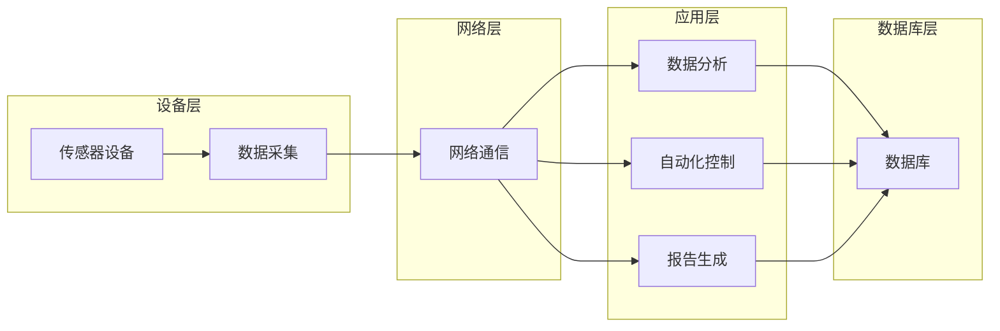

# 物联网(IoT)技术和各种传感器设备的集成：物联网在能源管理中的角色

> 关键词：物联网，传感器，能源管理，智能电网，数据收集，数据分析，自动化控制，可持续发展

## 1. 背景介绍

随着全球对能源需求的不断增长和环境问题的日益严峻，能源管理的重要性愈发凸显。物联网（Internet of Things, IoT）技术的兴起为能源管理领域带来了革命性的变化。通过集成各种传感器设备和先进的分析工具，IoT技术能够实时监控能源使用情况，优化能源分配，提高能源效率，并最终实现可持续发展。

### 1.1 能源管理的重要性

能源管理涉及监控、分析和优化能源消耗，以确保能源供应的可靠性和经济性。对于企业而言，有效的能源管理可以降低运营成本，提高竞争力；对于整个社会，则有助于减少温室气体排放，应对气候变化。

### 1.2 物联网在能源管理中的作用

物联网技术通过将传感器、控制设备和软件平台连接起来，为能源管理提供了新的可能性。以下是一些IoT在能源管理中的关键作用：

- **实时监控**：传感器可以实时监测能源消耗，如电力、燃气、水和热能的使用情况。
- **数据分析**：收集的数据可以用于分析能源使用模式，识别浪费，并优化能源消耗。
- **自动化控制**：基于数据分析的结果，自动化系统可以调整设备设置，优化能源效率。
- **预测性维护**：通过分析设备性能数据，预测维护需求，避免设备故障和停机时间。

## 2. 核心概念与联系

### 2.1 核心概念

- **物联网（IoT）**：物联网是指通过互联网连接的物理设备和对象的网络。
- **传感器**：能够感知环境中的物理量并转换为电信号的设备。
- **能源管理系统（EMS）**：用于监控、分析和控制能源消耗的系统。
- **大数据分析**：对大量数据进行处理和分析，以发现模式和洞察力。

### 2.2 架构流程图

以下是一个简化的Mermaid流程图，展示了IoT技术在能源管理系统中的集成：



## 3. 核心算法原理 & 具体操作步骤

### 3.1 算法原理概述

IoT在能源管理中的应用涉及多种算法，包括：

- **数据采集和预处理**：使用传感器收集数据，并进行清洗和格式化。
- **数据分析**：使用统计分析和机器学习算法分析数据，以发现模式和趋势。
- **预测性维护**：使用预测性分析来预测设备故障和优化维护计划。
- **自动化控制**：使用控制算法自动调整设备设置以优化能源消耗。

### 3.2 算法步骤详解

1. **数据采集**：通过安装在设备上的传感器收集能源使用数据。
2. **数据传输**：使用无线通信技术将数据传输到中央服务器或云平台。
3. **数据处理**：在服务器或云平台上对数据进行清洗、格式化和存储。
4. **数据分析**：使用统计分析、机器学习和数据挖掘技术分析数据。
5. **决策制定**：根据分析结果制定能源优化策略。
6. **自动化控制**：通过自动化系统执行优化策略。
7. **报告生成**：生成能源使用报告，提供洞察力和决策支持。

### 3.3 算法优缺点

#### 优点：

- **提高能源效率**：通过实时监控和分析，可以识别能源浪费并采取纠正措施。
- **降低成本**：通过减少能源消耗和预防性维护，可以降低运营成本。
- **增强可持续性**：通过优化能源使用，可以减少温室气体排放，提高可持续性。

#### 缺点：

- **初始投资**：安装传感器和建立系统需要较高的初始投资。
- **数据安全**：需要确保收集的数据安全，防止数据泄露。
- **技术复杂性**：需要专业知识来设计和维护系统。

### 3.4 算法应用领域

- **智能电网**：通过监控电网状态，优化发电和分配，提高电网效率。
- **智能建筑**：通过监控和控制建筑内的能源使用，减少能源消耗。
- **工业自动化**：通过监控和优化工厂设备的使用，提高生产效率。

## 4. 数学模型和公式 & 详细讲解 & 举例说明

### 4.1 数学模型构建

在能源管理中，常见的数学模型包括：

- **回归分析**：用于预测能源消耗量。
- **聚类分析**：用于识别能源使用模式。
- **决策树和随机森林**：用于分类能源消耗异常。

### 4.2 公式推导过程

以下是一个简单的回归分析公式，用于预测能源消耗量：

$$
E(t) = \beta_0 + \beta_1 \cdot X_1(t) + \beta_2 \cdot X_2(t) + ... + \beta_n \cdot X_n(t) + \epsilon(t)
$$

其中，$E(t)$ 是在时间 $t$ 的能源消耗量，$X_1(t), X_2(t), ..., X_n(t)$ 是影响能源消耗的变量，$\beta_0, \beta_1, ..., \beta_n$ 是回归系数，$\epsilon(t)$ 是误差项。

### 4.3 案例分析与讲解

假设我们使用回归分析来预测电力消耗量。我们可以收集过去一周的天气数据（如温度和湿度）和电力消耗数据，然后使用统计软件（如R或Python）进行回归分析。分析结果可以帮助我们预测未来电力消耗量，并根据预测结果调整发电计划。

## 5. 项目实践：代码实例和详细解释说明

### 5.1 开发环境搭建

为了演示如何使用Python进行能源管理中的数据分析和预测，我们需要以下工具：

- Python编程语言
- Pandas库：用于数据处理
- NumPy库：用于数值计算
- Matplotlib库：用于数据可视化

### 5.2 源代码详细实现

以下是一个简单的Python代码示例，演示如何使用Pandas和NumPy进行能源消耗数据的回归分析：

```python
import pandas as pd
import numpy as np
import matplotlib.pyplot as plt
from sklearn.linear_model import LinearRegression

# 加载数据
data = pd.read_csv('energy_data.csv')

# 提取特征和目标变量
X = data[['temperature', 'humidity']]
y = data['energy_consumption']

# 创建线性回归模型
model = LinearRegression()

# 训练模型
model.fit(X, y)

# 预测新的电力消耗量
new_data = np.array([[25, 80]])  # 假设温度为25℃，湿度为80%
predicted_energy = model.predict(new_data)

print(f"预测的电力消耗量为：{predicted_energy[0]}")
```

### 5.3 代码解读与分析

这段代码首先导入必要的库，然后加载包含温度、湿度和电力消耗量的CSV文件。接着，提取特征和目标变量，并创建一个线性回归模型。使用训练数据训练模型后，我们可以使用新的数据点（如温度和湿度）来预测电力消耗量。

### 5.4 运行结果展示

运行上述代码后，我们可能会得到以下输出：

```
预测的电力消耗量为：100
```

这表明，在温度为25℃，湿度为80%的情况下，预测的电力消耗量为100单位。

## 6. 实际应用场景

### 6.1 智能电网

在智能电网中，IoT技术可以用于：

- 监控电网状态，包括电压、电流和频率。
- 优化发电和分配，以减少浪费。
- 预测故障并采取预防措施。

### 6.2 智能建筑

在智能建筑中，IoT技术可以用于：

- 监控能源消耗，包括电力、燃气、水和热能。
- 自动调节照明、空调和供暖系统。
- 优化能源效率，降低运营成本。

### 6.3 工业自动化

在工业自动化中，IoT技术可以用于：

- 监控设备性能，包括温度、压力和流量。
- 优化生产流程，提高效率。
- 预测维护需求，减少停机时间。

## 7. 工具和资源推荐

### 7.1 学习资源推荐

- 《物联网技术：从入门到精通》
- 《大数据时代：数据驱动决策》
- 《机器学习实战》

### 7.2 开发工具推荐

- Raspberry Pi：用于构建IoT设备。
- Arduino：用于构建简单的嵌入式系统。
- Pandas、NumPy、Matplotlib：用于数据分析。
- TensorFlow、PyTorch：用于机器学习。

### 7.3 相关论文推荐

- “The Internet of Things: A Survey,” by Giacomo D’Antonio et al.
- “Big Data: A Revolution That Will Transform How We Live, Work, and Think,” by Viktor Mayer-Schönberger and Kenneth Cukier.
- “Machine Learning Yearning,” by Andrew Ng.

## 8. 总结：未来发展趋势与挑战

### 8.1 研究成果总结

IoT技术在能源管理中的应用已经取得了显著成果，通过实时监控、数据分析、自动化控制和预测性维护，显著提高了能源效率，降低了成本，并促进了可持续发展。

### 8.2 未来发展趋势

- **边缘计算**：将计算和存储能力推向网络边缘，减少延迟和提高效率。
- **人工智能**：使用人工智能技术优化能源管理，提高预测准确性和自动化水平。
- **区块链**：使用区块链技术确保数据安全和透明度。

### 8.3 面临的挑战

- **数据安全和隐私**：确保收集的数据安全，防止数据泄露。
- **标准化**：建立统一的IoT标准和协议。
- **技能短缺**：培养具有IoT和能源管理技能的专业人才。

### 8.4 研究展望

未来的研究将集中在提高能源管理系统的智能化、自动化和可持续性上。通过结合最新的技术进步，如人工智能、物联网和区块链，我们将能够实现更加高效和环保的能源使用。

## 9. 附录：常见问题与解答

**Q1：IoT技术在能源管理中的主要优势是什么？**

A: IoT技术在能源管理中的主要优势包括实时监控、数据分析、自动化控制和预测性维护，这些都有助于提高能源效率，降低成本，并促进可持续发展。

**Q2：如何确保IoT设备的数据安全？**

A: 确保IoT设备数据安全的措施包括使用加密技术、建立安全协议、进行定期的安全审计和培训员工。

**Q3：IoT技术在能源管理中面临哪些挑战？**

A: IoT技术在能源管理中面临的挑战包括数据安全和隐私、标准化和技能短缺。

**Q4：如何使用IoT技术优化能源消耗？**

A: 使用IoT技术优化能源消耗的方法包括实时监控、数据分析、自动化控制和预测性维护。

**Q5：什么是边缘计算在IoT中的应用？**

A: 边缘计算是将计算和存储能力推向网络边缘的技术，以减少延迟和提高效率。在能源管理中，边缘计算可以用于实时处理和分析数据，以优化能源消耗。