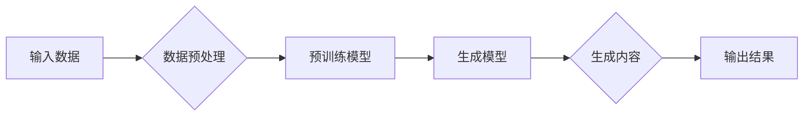

> 生成式人工智能，AIGC，内容生成，商业模式创新，自然语言处理，计算机视觉，深度学习

# 生成式AIGC：改变商业模式的新引擎

生成式人工智能（AIGC，Artificial Intelligence Generated Content）正逐渐成为颠覆传统内容创作方式的新引擎。它利用深度学习技术，能够自动生成文本、图像、音频等多种形式的内容，为各行各业带来前所未有的创新机遇。本文将深入探讨生成式AIGC的核心概念、算法原理、应用场景以及未来发展趋势。

## 1. 背景介绍

随着互联网的普及和数字技术的飞速发展，内容产业迅速崛起，成为经济增长的重要驱动力。然而，传统的内容创作方式依赖于大量人力，成本高昂且效率低下。生成式AIGC的出现，正逐步改变这一现状，为内容产业注入新的活力。

### 1.1 问题的由来

传统内容创作面临以下问题：

- 人力成本高：内容创作需要大量专业人才，且创作周期较长。
- 创作效率低：创作过程繁琐，难以满足快速迭代的需求。
- 内容同质化严重：大量内容生产者追求短期利益，导致内容质量参差不齐。

生成式AIGC的出现，旨在解决以上问题，通过自动化、智能化的方式，提升内容创作效率和质量。

### 1.2 研究现状

生成式AIGC技术的研究与应用已取得显著进展，主要分为以下几个方向：

- **自然语言处理（NLP）领域**：如文本生成、对话系统、机器翻译等。
- **计算机视觉领域**：如图像生成、视频生成、图像编辑等。
- **音频处理领域**：如音乐生成、语音合成、音频编辑等。

### 1.3 研究意义

生成式AIGC技术具有重要的研究意义和应用价值：

- 提升内容创作效率，降低人力成本。
- 丰富内容形式，满足个性化需求。
- 创新商业模式，拓展产业边界。

## 2. 核心概念与联系

生成式AIGC的核心概念包括：

- **深度学习**：通过学习大量数据，使计算机具备自主学习的能力。
- **生成模型**：用于生成新的数据的模型，如生成对抗网络（GAN）、变分自编码器（VAE）等。
- **预训练**：在大量无标签数据上进行训练，使模型具备通用能力。

以下为生成式AIGC的核心概念原理和架构的 Mermaid 流程图：



### 2.1 数据预处理

在生成式AIGC中，首先需要对输入数据进行预处理，包括数据清洗、去噪、格式转换等，以适应后续模型训练和内容生成。

### 2.2 预训练模型

预训练模型通常在大量无标签数据上进行训练，学习到通用的特征表示，为后续生成模型提供基础。

### 2.3 生成模型

生成模型通过学习数据分布，生成与真实数据相似的新数据。

### 2.4 生成内容

生成模型根据输入数据生成新的内容，如文本、图像、音频等。

### 2.5 输出结果

将生成的内容输出到指定平台或应用中。

## 3. 核心算法原理 & 具体操作步骤

### 3.1 算法原理概述

生成式AIGC的核心算法包括：

- **生成对抗网络（GAN）**：由生成器（Generator）和判别器（Discriminator）组成，通过对抗训练生成逼真的图像、音频等。
- **变分自编码器（VAE）**：通过编码器和解码器学习数据分布，生成新的数据。
- **自回归语言模型**：通过序列到序列的模型生成文本。

### 3.2 算法步骤详解

以GAN为例，其具体操作步骤如下：

1. 初始化生成器G和判别器D，并设置损失函数。
2. 在训练过程中，生成器G不断生成样本，判别器D不断学习区分真实样本和生成样本。
3. 当生成器G生成足够逼真的样本时，输出结果。

### 3.3 算法优缺点

#### GAN

**优点**：

- 能够生成高质量、逼真的图像、音频等。
- 无需人工标注数据。

**缺点**：

- 训练过程不稳定，容易陷入模式崩溃。
- 难以量化生成样本的质量。

#### VAE

**优点**：

- 生成样本质量较高。
- 训练过程相对稳定。

**缺点**：

- 生成样本的真实性不如GAN。
- 训练过程比GAN复杂。

#### 自回归语言模型

**优点**：

- 生成文本质量高，语义连贯。
- 无需大量标注数据。

**缺点**：

- 生成文本长度受限。
- 难以生成长文本。

### 3.4 算法应用领域

生成式AIGC在多个领域得到广泛应用，如：

- **文本生成**：自动生成新闻、小说、诗歌等。
- **图像生成**：自动生成图像、视频等。
- **音频生成**：自动生成音乐、语音等。

## 4. 数学模型和公式 & 详细讲解 & 举例说明

### 4.1 数学模型构建

以GAN为例，其数学模型如下：

- **生成器G**：$G(z) = \mathbf{x} = \Phi(z; \theta_G)$
- **判别器D**：$D(\mathbf{x}; \theta_D)$

其中，$z$ 为输入噪声，$\mathbf{x}$ 为生成的样本，$\theta_G$ 和 $\theta_D$ 分别为生成器和判别器的参数。

### 4.2 公式推导过程

GAN的目标是最小化以下损失函数：

$$
L(G,D) = \mathbb{E}_{z \sim p_z(z)}[D(G(z))] - \mathbb{E}_{x \sim p_{data}(x)}[D(x)]
$$

其中，$p_z(z)$ 为噪声分布，$p_{data}(x)$ 为数据分布。

### 4.3 案例分析与讲解

以下以文本生成为例，展示生成式AIGC在自然语言处理领域的应用。

### 4.3.1 数据集

选择一个含有大量文本的语料库，如维基百科、小说、新闻等。

### 4.3.2 预训练模型

使用预训练的语言模型，如GPT-3，学习文本的语法和语义。

### 4.3.3 生成文本

使用预训练模型生成的文本作为输入，通过训练生成器G，生成新的文本。

### 4.3.4 结果评估

使用人类评估或自动评价指标，评估生成文本的质量。

## 5. 项目实践：代码实例和详细解释说明

### 5.1 开发环境搭建

使用Python编程语言和TensorFlow、PyTorch等深度学习框架进行开发。

### 5.2 源代码详细实现

以下为使用TensorFlow实现GAN的示例代码：

```python
import tensorflow as tf
from tensorflow.keras.layers import Dense, Flatten, Reshape, Conv2D, LeakyReLU, Dropout, BatchNormalization

def build_generator(z_shape):
    model = tf.keras.Sequential([
        Dense(256, activation='relu', input_shape=z_shape),
        BatchNormalization(),
        LeakyReLU(),
        Dense(512, activation='relu'),
        BatchNormalization(),
        LeakyReLU(),
        Dense(1024, activation='relu'),
        BatchNormalization(),
        LeakyReLU(),
        Dense(784, activation='tanh'),
        Reshape((28, 28, 1))
    ])
    return model

def build_discriminator(x_shape):
    model = tf.keras.Sequential([
        Flatten(input_shape=x_shape),
        Dense(512, activation='relu'),
        BatchNormalization(),
        Dropout(0.3),
        Dense(256, activation='relu'),
        BatchNormalization(),
        Dropout(0.3),
        Dense(1, activation='sigmoid')
    ])
    return model

def build_gan(generator, discriminator):
    model = tf.keras.Sequential([
        generator,
        discriminator
    ])
    return model

# 构建模型
z_shape = (100,)
x_shape = (28, 28, 1)

generator = build_generator(z_shape)
discriminator = build_discriminator(x_shape)
gan = build_gan(generator, discriminator)

# 编译模型
gan.compile(optimizer=tf.keras.optimizers.Adam(0.0002, 0.5), 
              loss=tf.keras.losses.BinaryCrossentropy(from_logits=True))

# 训练模型
gan.fit(x_train, y_train, epochs=50, batch_size=128)
```

### 5.3 代码解读与分析

以上代码实现了GAN的基本框架，包括生成器、判别器和GAN模型。首先定义了生成器和判别器的结构，然后构建GAN模型，并编译和训练模型。

### 5.4 运行结果展示

运行上述代码，可以在训练过程中观察到生成图像的质量逐渐提升。最终生成的图像可以用于图像分类、图像修复等任务。

## 6. 实际应用场景

生成式AIGC在多个领域得到广泛应用，以下列举一些典型应用场景：

### 6.1 文本生成

- 自动生成新闻报道、小说、诗歌等。
- 自动生成机器翻译、摘要、问答等。

### 6.2 图像生成

- 自动生成艺术作品、室内设计图、时尚插画等。
- 自动生成医学影像、卫星图像、遥感图像等。

### 6.3 音频生成

- 自动生成音乐、歌曲、语音等。
- 自动生成语音合成、语音识别、语音转换等。

## 7. 工具和资源推荐

### 7.1 学习资源推荐

- 《深度学习》（Goodfellow等著）
- 《Generative Adversarial Networks》
- 《Unsupervised Learning》（Bengio等著）

### 7.2 开发工具推荐

- TensorFlow
- PyTorch
- Keras

### 7.3 相关论文推荐

- Generative Adversarial Networks
- Unsupervised Representation Learning with Deep Convolutional Generative Adversarial Networks
- Generative Models

## 8. 总结：未来发展趋势与挑战

### 8.1 研究成果总结

生成式AIGC技术在近年来取得了显著进展，在文本、图像、音频等领域得到广泛应用。其研究成果为内容产业带来了巨大的创新机遇。

### 8.2 未来发展趋势

- 模型规模将进一步扩大，生成效果更加逼真。
- 算法将更加高效，计算资源消耗降低。
- 应用场景将更加丰富，覆盖更多领域。

### 8.3 面临的挑战

- 数据安全和隐私保护：生成式AIGC模型可能泄露敏感数据。
- 道德和伦理问题：生成内容可能包含偏见和歧视。
- 模型可解释性：难以解释模型生成内容的决策过程。

### 8.4 研究展望

未来，生成式AIGC技术将朝着以下方向发展：

- 研究更加安全、可靠的生成式AIGC模型。
- 探索更加高效、轻量级的生成式AIGC算法。
- 推动生成式AIGC技术在更多领域的应用。

## 9. 附录：常见问题与解答

**Q1：生成式AIGC的优缺点是什么？**

A：生成式AIGC的主要优点是自动化、高效、成本低。但同时也存在一些缺点，如数据安全和隐私保护、道德和伦理问题、模型可解释性等。

**Q2：如何选择合适的生成式AIGC模型？**

A：选择合适的生成式AIGC模型需要根据具体任务和应用场景进行评估。例如，对于文本生成任务，可以选择自回归语言模型；对于图像生成任务，可以选择GAN或VAE。

**Q3：生成式AIGC在哪些领域有应用？**

A：生成式AIGC在多个领域得到广泛应用，如文本生成、图像生成、音频生成等。

**Q4：如何解决生成式AIGC的数据安全和隐私保护问题？**

A：通过数据加密、匿名化、访问控制等技术，可以解决生成式AIGC的数据安全和隐私保护问题。

**Q5：如何解决生成式AIGC的道德和伦理问题？**

A：在生成式AIGC的设计和应用过程中，应充分考虑道德和伦理因素，避免生成有害、歧视性的内容。

作者：禅与计算机程序设计艺术 / Zen and the Art of Computer Programming