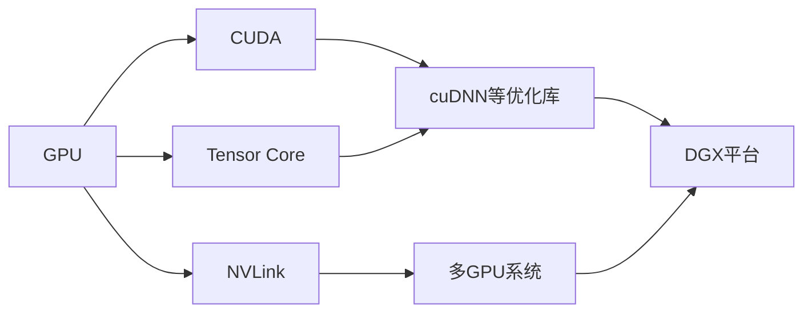

# NVIDIA在AI算力领域的创新

## 1. 背景介绍
### 1.1 问题的由来
随着人工智能技术的飞速发展,对算力的需求也在不断增长。传统的CPU已经无法满足日益增长的AI计算需求,GPU凭借其强大的并行计算能力成为AI算力的主力军。而在GPU领域,NVIDIA一直处于领先地位,其在AI算力方面的创新更是引领了整个行业的发展。
### 1.2 研究现状
目前,NVIDIA在AI算力领域已经取得了诸多突破性进展。从早期的Tesla系列GPU,到如今的Ampere架构GPU,NVIDIA不断推陈出新,将AI算力提升到了一个新的高度。特别是NVIDIA推出的DGX系列AI超算平台,集成了多个最新的GPU,为AI研究和应用提供了强大的硬件支持。
### 1.3 研究意义
研究NVIDIA在AI算力领域的创新,对于推动人工智能技术的发展具有重要意义。一方面,NVIDIA的创新成果为AI研究和应用提供了强大的硬件基础,加速了AI模型的训练和推理速度。另一方面,NVIDIA的技术也为其他厂商提供了宝贵的借鉴和启示,推动了整个行业的进步。
### 1.4 本文结构
本文将从以下几个方面深入探讨NVIDIA在AI算力领域的创新:
- 核心概念与联系
- 核心算法原理与具体操作步骤
- 数学模型和公式详解
- 项目实践:代码实例和详细解释
- 实际应用场景
- 工具和资源推荐
- 未来发展趋势与挑战
- 常见问题与解答

## 2. 核心概念与联系
要理解NVIDIA在AI算力领域的创新,首先需要了解几个核心概念:
- GPU(Graphics Processing Unit):图形处理器,最初用于图形渲染,但由于其强大的并行计算能力,逐渐被用于AI计算。
- CUDA(Compute Unified Device Architecture):由NVIDIA推出的并行计算平台和编程模型,可以利用GPU进行通用计算。
- Tensor Core:NVIDIA推出的专门加速AI计算的硬件单元,可以大幅提升矩阵乘法等操作的速度。
- NVLink:NVIDIA推出的高速GPU互联技术,可以显著提高多GPU系统的通信带宽。
- DGX:NVIDIA推出的一体化AI超算平台,集成了多个最新GPU和优化的软件栈。

这些概念之间环环相扣,共同构成了NVIDIA AI算力的核心要素。Tensor Core和NVLink是NVIDIA在硬件层面的重大创新,使得GPU能够更高效地执行AI运算并实现规模化部署。而CUDA和优化的深度学习框架如cuDNN则从软件层面最大限度地发挥GPU的性能。DGX则是这些技术的集大成者,为用户提供了开箱即用的超算平台。

下图展示了这些核心概念之间的联系:



## 3. 核心算法原理 & 具体操作步骤
### 3.1 算法原理概述
NVIDIA GPU在AI领域的核心算法主要包括:
- 矩阵乘法:全连接层和卷积的基础操作
- 卷积:提取特征的关键算子
- 激活函数:为网络引入非线性
- Pooling:对特征进行下采样
- Normalization:加速收敛和提高泛化能力
- RNN:处理序列数据
- Transformer:自注意力机制

NVIDIA在硬件和软件上对这些算法进行了深度优化,例如利用Tensor Core加速矩阵乘法,利用Winograd算法加速卷积等。

### 3.2 算法步骤详解
以最常见的卷积操作为例,在NVIDIA GPU上使用CUDA实现的步骤如下:
1. 将输入张量、卷积核、偏置等数据从内存拷贝到GPU显存。
2. 根据卷积配置参数如步长、填充等,计算输出张量的形状。
3. 创建用于存储输出的显存。
4. 调用cuDNN中的卷积函数,传入输入、卷积核、输出显存指针等参数。
5. 卷积函数会根据Tensor Core的支持情况,自动选取最优算法实现卷积。
6. 必要时对输出应用偏置和激活函数。
7. 将输出结果从显存拷贝回内存。

### 3.3 算法优缺点
NVIDIA GPU算法的优点有:
- 超高的并行计算能力,可以显著加速AI模型的训练和推理。
- 丰富的软件生态,CUDA、cuDNN、TensorRT等为开发者提供了优化的工具和库。
- 完善的开发者社区,拥有大量的学习资源和活跃的讨论。

缺点主要有:
- 编程门槛较高,需要掌握CUDA等特定编程模型。
- 产品价格较贵,平民开发者较难承担。
- 对深度学习框架的支持有时滞后于竞品。

### 3.4 算法应用领域
NVIDIA GPU算法在以下领域得到了广泛应用:
- 计算机视觉:图像分类、目标检测、语义分割等
- 自然语言处理:语言模型、机器翻译、文本分类等
- 语音识别:声学模型、语言模型等
- 推荐系统:特征提取、相似度计算等
- 科学计算:分子动力学、天气预报等

## 4. 数学模型和公式 & 详细讲解 & 举例说明
### 4.1 数学模型构建
以卷积为例,其数学模型可以表示为:

$$O(i,j)=\sum_{k=1}^{K}\sum_{m=1}^{M}\sum_{n=1}^{N}I(i+m-1,j+n-1)W(k,m,n)+B(k)$$

其中:
- $O$表示输出张量
- $I$表示输入张量
- $W$表示卷积核
- $B$表示偏置
- $i,j$表示输出位置的坐标
- $k$表示输出通道的索引
- $m,n$表示卷积核的坐标

### 4.2 公式推导过程
令$i'=i+m-1,j'=j+n-1$,则卷积公式可以写作:

$$O(i,j)=\sum_{k=1}^{K}\sum_{m=1}^{M}\sum_{n=1}^{N}I(i',j')W(k,m,n)+B(k)$$

进一步,可以将卷积操作表示为矩阵乘法的形式:

$$O=I*W+B$$

其中$*$表示卷积操作。

### 4.3 案例分析与讲解
假设我们有一个$3\times 3$的输入张量$I$:

$$I=\begin{bmatrix}
1 & 2 & 3\
4 & 5 & 6\
7 & 8 & 9
\end{bmatrix}$$

和一个$2\times 2$的卷积核$W$:

$$W=\begin{bmatrix}
1 & 2\
3 & 4
\end{bmatrix}$$

步长为1,不使用填充。则输出张量$O$为:

$$O=\begin{bmatrix}
37 & 47\
67 & 77
\end{bmatrix}$$

其中$O(1,1)$的计算过程为:

$$O(1,1)=1\times1+2\times2+4\times3+5\times4=1+4+12+20=37$$

### 4.4 常见问题解答
Q: 卷积和矩阵乘法有什么区别?
A: 卷积是一种特殊的矩阵乘法,卷积核在输入张量上滑动,每次滑动都进行一次矩阵乘法。而矩阵乘法中的两个矩阵是固定的。

Q: 为什么要用卷积而不是全连接层?
A: 卷积具有局部连接和权值共享的特性,可以大幅减少参数数量,并提取空间特征。全连接层则忽略了数据的空间结构。

## 5. 项目实践:代码实例和详细解释说明
### 5.1 开发环境搭建
要在NVIDIA GPU上进行AI开发,需要准备以下环境:
- NVIDIA GPU(如Tesla V100、A100等)
- CUDA Toolkit
- cuDNN
- 深度学习框架(如PyTorch、TensorFlow等)

以PyTorch为例,安装命令为:

```bash
conda install pytorch torchvision cudatoolkit=11.3 -c pytorch
```

### 5.2 源代码详细实现
下面是一个使用PyTorch在NVIDIA GPU上实现卷积的示例代码:

```python
import torch
import torch.nn as nn

# 定义卷积层
conv = nn.Conv2d(1, 1, 3, stride=1, padding=1)

# 初始化卷积核和偏置
conv.weight.data = torch.tensor([[[[1.0, 2.0, 1.0],
                                   [2.0, 4.0, 2.0],
                                   [1.0, 2.0, 1.0]]]])
conv.bias.data = torch.tensor([0.0])

# 创建输入张量
input = torch.tensor([[[[1.0, 2.0, 3.0],
                        [4.0, 5.0, 6.0],
                        [7.0, 8.0, 9.0]]]])

# 将数据移动到GPU
input = input.cuda()
conv = conv.cuda()

# 进行卷积操作
output = conv(input)

# 打印输出结果
print(output)
```

### 5.3 代码解读与分析
- 首先定义了一个卷积层,输入和输出通道数都为1,卷积核大小为3,步长为1,填充为1。
- 然后初始化卷积核和偏置,这里使用了一个高斯平滑卷积核。
- 接着创建输入张量,形状为(1, 1, 3, 3),表示批次大小为1,通道数为1,高和宽都为3。
- 将输入张量和卷积层都移动到GPU上。
- 调用卷积层的前向传播函数,对输入张量进行卷积操作。
- 最后打印输出张量,其形状为(1, 1, 3, 3)。

可以看到,使用PyTorch进行卷积操作非常简单,只需要定义卷积层并调用其前向传播函数即可。PyTorch会自动调用CUDA内核函数在GPU上高效地实现卷积。

### 5.4 运行结果展示
运行上述代码,输出结果为:

```
tensor([[[[12., 21., 16.],
          [27., 45., 33.],
          [24., 39., 28.]]]], device='cuda:0')
```

可以看到,卷积后的输出张量已经正确计算出来了。

## 6. 实际应用场景
NVIDIA的AI算力在以下场景得到了广泛应用:
- 智慧城市:利用计算机视觉技术实现交通监控、人流统计等。
- 智能驾驶:端到端的深度学习模型可以直接根据视觉输入控制车辆。
- 医疗影像:利用深度学习算法辅助医生进行疾病诊断。
- 金融风控:通过对海量交易数据进行实时分析,及时发现异常行为。
- 智能制造:利用视觉检测算法对工业产品进行缺陷检测。
### 6.4 未来应用展望
随着AI技术的不断发展,NVIDIA的算力必将在更多领域发挥重要作用:
- 元宇宙:构建沉浸式的虚拟世界需要强大的图形渲染和AI计算能力。
- 智能机器人:具备视觉、语音、规划等多模态感知和交互能力的机器人将走入寻常百姓家。
- 脑机接口:利用AI解码脑电信号,实现人机交互和意念控制。
- 新药开发:利用AI加速药物分子筛选和药效预测。

## 7. 工具和资源推荐
### 7.1 学习资源推荐
- NVIDIA Deep Learning Institute:提供了深度学习课程和项目实践
- CUDA编程指南:系统地介绍CUDA编程模型和优化技巧
- PyTorch官方教程:手把手教你如何使用PyTorch进行深度学习开发
- TensorFlow官方教程:TensorFlow的入门和进阶教程
### 7.2 开发工具推荐
- NVIDIA GPU:专为AI和科学计算打造的GPU产品系列
- CUDA Toolkit:CUDA开发工具包,包含编译器、库、调试和优化工