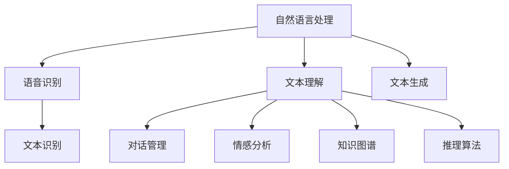
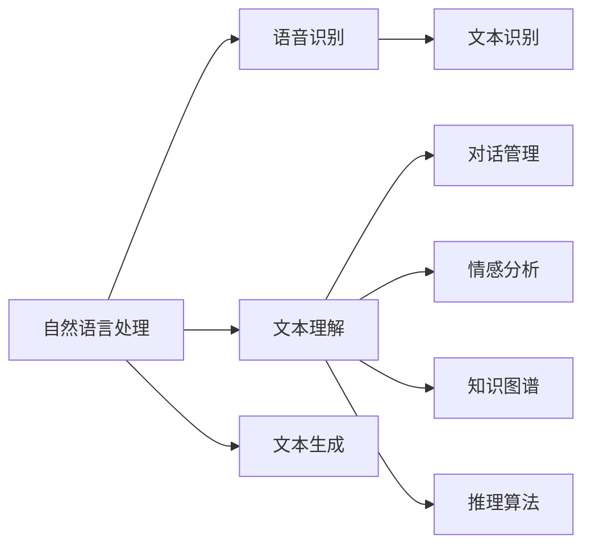
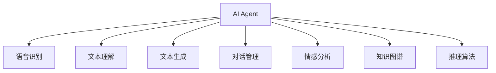
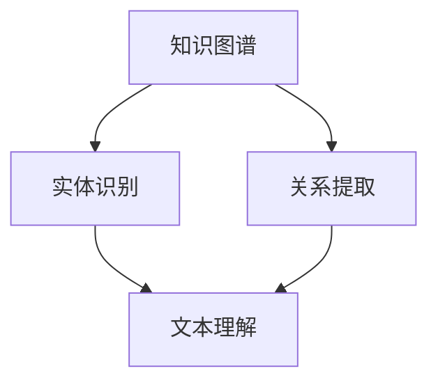
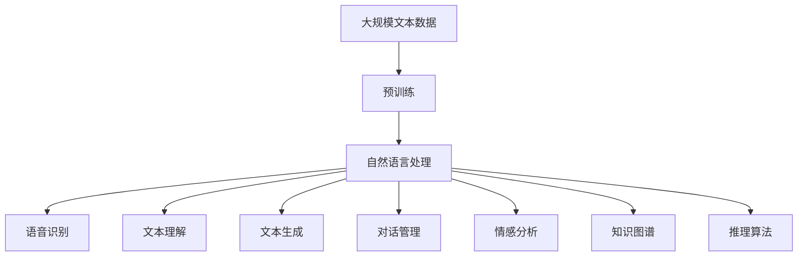

                 

# AI Agent: AI的下一个风口 从图形用户界面到自然语言的进化

## 1. 背景介绍

### 1.1 问题由来

随着人工智能(AI)技术的迅猛发展，传统的图形用户界面(GUI)已经难以满足用户日益增长的需求。用户在与计算机交互时，越来越倾向于使用自然语言进行沟通，而非传统的菜单、按钮等图形界面。这背后的原因在于：

1. **语言的自然性**：自然语言能够更直观、自然地表达复杂的需求和指令，无需用户记住繁琐的命令格式。
2. **交互的便捷性**：自然语言交互减少了用户的学习成本，用户可以轻松地与计算机进行高效沟通。
3. **认知负荷的减轻**：自然语言界面可以降低用户的认知负荷，使其专注于任务而非界面操作，提高工作效率。
4. **个性化和定制化**：自然语言能够更好地适应用户的个性化需求，提供更加贴合用户习惯的界面。

### 1.2 问题核心关键点

为了应对上述挑战，自然语言处理(NLP)技术应运而生。自然语言处理的核心思想是通过计算机对自然语言的理解和生成，实现人与计算机之间的自然语言交互。这不仅提升了用户体验，也为计算机提供了更加智能、高效的界面交互方式。

自然语言处理技术的核心任务包括：

1. **语音识别**：将语音信号转换为文本。
2. **文本理解**：对输入文本进行语义分析和结构化处理。
3. **文本生成**：根据用户意图生成自然语言响应。
4. **对话管理**：维护对话状态，管理对话流程。

自然语言处理技术的突破，推动了AI Agent（人工智能代理）技术的发展。AI Agent是一种能够自主学习、执行任务、与用户自然交互的系统。它基于自然语言处理技术，结合机器学习和推理算法，能够理解和响应用户的复杂需求，提供智能化的服务。

### 1.3 问题研究意义

研究自然语言处理和AI Agent技术，对于提升人机交互效率、推动智能化应用场景的发展具有重要意义：

1. **用户体验的提升**：通过自然语言交互，用户可以更加自然地与计算机沟通，提升操作体验。
2. **工作效率的提高**：自然语言交互减少了用户的操作步骤，提高了工作效率。
3. **智能化应用场景的扩展**：自然语言处理技术为更多智能化应用场景提供了技术支持，如智能客服、智能家居等。
4. **认知智能的实现**：自然语言处理和AI Agent技术的发展，将推动认知智能的实现，即通过自然语言理解和生成，实现真正的智能交互。
5. **产业升级的促进**：自然语言处理和AI Agent技术的应用，将推动各行各业的数字化转型升级，提升产业竞争力。

## 2. 核心概念与联系

### 2.1 核心概念概述

为了更好地理解自然语言处理和AI Agent技术的核心概念，本节将介绍几个密切相关的核心概念：

- **自然语言处理(NLP)**：通过计算机对自然语言的理解和生成，实现人与计算机之间的自然语言交互。
- **AI Agent**：一种能够自主学习、执行任务、与用户自然交互的系统。
- **语音识别**：将语音信号转换为文本。
- **文本理解**：对输入文本进行语义分析和结构化处理。
- **文本生成**：根据用户意图生成自然语言响应。
- **对话管理**：维护对话状态，管理对话流程。
- **情感分析**：分析文本中的情感倾向，提升交互体验。
- **知识图谱**：构建实体和关系的结构化表示，辅助自然语言理解和生成。
- **推理算法**：用于辅助自然语言理解和生成，提升模型的决策能力。

这些核心概念之间的逻辑关系可以通过以下Mermaid流程图来展示：



这个流程图展示了大语言模型微调过程中各个核心概念之间的关系：

1. 自然语言处理是整个系统的核心，涵盖语音识别、文本理解、文本生成、对话管理等多个子任务。
2. 语音识别和文本识别是自然语言处理的基础，用于将用户输入转换为计算机可处理的文本形式。
3. 文本理解、情感分析和推理算法是自然语言处理的关键，用于分析和生成自然语言文本。
4. 对话管理是自然语言处理的高级应用，用于维护对话状态，管理对话流程。
5. 知识图谱和推理算法辅助自然语言处理，提供更丰富的背景知识和决策支持。

### 2.2 概念间的关系

这些核心概念之间存在着紧密的联系，形成了自然语言处理和AI Agent技术的完整生态系统。下面我通过几个Mermaid流程图来展示这些概念之间的关系。

#### 2.2.1 自然语言处理范式



这个流程图展示了自然语言处理的各个子任务及其相互关系。

#### 2.2.2 AI Agent的应用范式



这个流程图展示了AI Agent技术的应用范式，涵盖了自然语言处理的各个子任务。

#### 2.2.3 知识图谱与自然语言处理的关系



这个流程图展示了知识图谱与自然语言处理之间的关系。知识图谱通过实体识别和关系提取，为自然语言处理提供丰富的背景知识。

### 2.3 核心概念的整体架构

最后，我们用一个综合的流程图来展示这些核心概念在大语言模型微调过程中的整体架构：



这个综合流程图展示了从预训练到自然语言处理，再到AI Agent技术的应用过程。大规模文本数据的预训练，使得自然语言处理和AI Agent技术具备强大的语言表示能力。自然语言处理技术通过语音识别、文本理解、文本生成、对话管理、情感分析、知识图谱和推理算法，实现人与计算机之间的自然语言交互。AI Agent技术则在此基础上，通过学习和推理，实现与用户的智能交互。

## 3. 核心算法原理 & 具体操作步骤
### 3.1 算法原理概述

自然语言处理和AI Agent技术的核心算法原理，主要集中在以下几个方面：

1. **深度学习模型**：使用深度学习模型对自然语言进行处理和生成。
2. **预训练技术**：在大规模无标签文本数据上进行预训练，学习语言的通用表示。
3. **监督学习**：在标注数据上对模型进行微调，提升模型在特定任务上的性能。
4. **无监督学习**：在未标注数据上进行预训练，提升模型的泛化能力。
5. **强化学习**：通过奖励机制引导模型学习最优的交互策略。
6. **推理算法**：用于辅助自然语言理解和生成，提升模型的决策能力。

自然语言处理和AI Agent技术的核心算法流程，可以分为以下几个步骤：

1. **数据预处理**：对原始数据进行清洗、分词、标注等预处理操作。
2. **特征提取**：使用深度学习模型对输入文本进行特征提取。
3. **模型训练**：在标注数据上对模型进行微调或监督学习。
4. **推理和生成**：根据用户输入，使用模型生成自然语言响应。
5. **对话管理**：维护对话状态，管理对话流程。

### 3.2 算法步骤详解

以下详细介绍自然语言处理和AI Agent技术的核心算法步骤：

**Step 1: 数据预处理**

1. **文本清洗**：去除文本中的噪声、停用词等无用信息。
2. **分词**：将文本切分为词汇单元，方便后续处理。
3. **标注**：对文本进行标注，如命名实体识别、情感分析等。

**Step 2: 特征提取**

1. **词向量表示**：将词汇映射到高维向量空间，方便模型处理。
2. **上下文表示**：使用深度学习模型，如BERT、GPT等，对输入文本进行上下文表示。
3. **句向量表示**：将句子转换为固定长度的向量表示，方便后续处理。

**Step 3: 模型训练**

1. **监督学习**：在标注数据上对模型进行微调或监督学习。
2. **无监督学习**：在未标注数据上进行预训练，提升模型的泛化能力。
3. **强化学习**：通过奖励机制引导模型学习最优的交互策略。

**Step 4: 推理和生成**

1. **推理算法**：使用推理算法，如规则推理、贝叶斯推理等，提升模型的决策能力。
2. **生成算法**：使用生成算法，如Seq2Seq模型、Transformer等，生成自然语言响应。

**Step 5: 对话管理**

1. **对话状态管理**：维护对话状态，记录用户输入和上下文信息。
2. **对话流程管理**：管理对话流程，引导模型生成合适的响应。

### 3.3 算法优缺点

自然语言处理和AI Agent技术具有以下优点：

1. **泛化能力强**：通过预训练和监督学习，模型具备较强的泛化能力，能够适应多种自然语言交互场景。
2. **交互自然**：通过自然语言交互，用户可以更加自然地与计算机沟通，提升操作体验。
3. **智能化程度高**：结合推理算法和知识图谱，模型能够更好地理解用户需求，提供智能化的服务。
4. **应用范围广**：自然语言处理和AI Agent技术可以应用于智能客服、智能家居、智能助手等多个场景，提升用户的工作效率和生活品质。

同时，这些技术也存在一些缺点：

1. **资源消耗大**：深度学习模型和推理算法需要大量的计算资源，硬件成本较高。
2. **模型复杂度高**：模型的结构和算法较为复杂，调试和优化难度较大。
3. **数据依赖性高**：模型效果依赖于大量的标注数据，标注成本较高。
4. **鲁棒性不足**：模型对噪声、歧义等现象的鲁棒性较弱，容易出现错误。
5. **安全性问题**：自然语言处理和AI Agent技术可能被用于欺诈、侵权等不良行为，存在一定的安全风险。

### 3.4 算法应用领域

自然语言处理和AI Agent技术在以下领域得到了广泛应用：

1. **智能客服**：通过自然语言处理和AI Agent技术，智能客服系统能够理解和响应用户需求，提供24/7的服务。
2. **智能家居**：结合自然语言处理和AI Agent技术，智能家居设备能够与用户进行自然语言交互，提供智能化的家居服务。
3. **智能助手**：自然语言处理和AI Agent技术的应用，使得智能助手能够理解用户的指令，提供个性化的服务。
4. **智能推荐**：结合自然语言处理和AI Agent技术，智能推荐系统能够理解用户的个性化需求，提供精准的推荐服务。
5. **智能搜索**：自然语言处理技术使得智能搜索系统能够理解用户的查询意图，提供更加精准的搜索结果。
6. **医疗咨询**：结合自然语言处理和AI Agent技术，医疗咨询系统能够理解病人的症状描述，提供个性化的医疗建议。

## 4. 数学模型和公式 & 详细讲解  
### 4.1 数学模型构建

以下详细介绍自然语言处理和AI Agent技术的数学模型构建：

**Step 1: 定义自然语言处理任务**

假设自然语言处理任务为NLP任务，包括语音识别、文本理解、文本生成、对话管理等多个子任务。在每个子任务上，我们定义输入为 $x$，输出为 $y$。

**Step 2: 定义模型结构**

假设模型结构为 $f$，其中 $x$ 为输入，$y$ 为输出。模型的参数为 $\theta$，表示模型的结构和参数。

**Step 3: 定义损失函数**

假设模型在每个子任务上的损失函数为 $\ell(f(x),y)$，表示模型预测输出与真实标签之间的差异。

**Step 4: 定义优化目标**

假设优化目标为 $\mathcal{L}(f(x),y)$，表示模型在每个子任务上的期望损失。

### 4.2 公式推导过程

以下详细介绍自然语言处理和AI Agent技术的公式推导过程：

**Step 1: 定义自然语言处理任务的损失函数**

假设自然语言处理任务为NLP任务，包括语音识别、文本理解、文本生成、对话管理等多个子任务。在每个子任务上，我们定义输入为 $x$，输出为 $y$。

**Step 2: 定义模型的预测函数**

假设模型为 $f$，其中 $x$ 为输入，$y$ 为输出。模型的参数为 $\theta$，表示模型的结构和参数。

**Step 3: 定义损失函数**

假设模型在每个子任务上的损失函数为 $\ell(f(x),y)$，表示模型预测输出与真实标签之间的差异。

**Step 4: 定义优化目标**

假设优化目标为 $\mathcal{L}(f(x),y)$，表示模型在每个子任务上的期望损失。

**Step 5: 使用梯度下降法优化模型参数**

假设优化算法为梯度下降法，学习率为 $\eta$。模型的参数 $\theta$ 更新公式为：

$$
\theta \leftarrow \theta - \eta \nabla_{\theta}\mathcal{L}(\theta)
$$

其中 $\nabla_{\theta}\mathcal{L}(\theta)$ 为损失函数对参数 $\theta$ 的梯度。

### 4.3 案例分析与讲解

以下通过一个具体的案例，展示自然语言处理和AI Agent技术的应用。

假设我们有一个智能客服系统，用于回答用户的常见问题。系统使用深度学习模型进行语音识别、文本理解和对话管理。

**Step 1: 数据预处理**

1. **文本清洗**：去除文本中的噪声、停用词等无用信息。
2. **分词**：将文本切分为词汇单元，方便后续处理。
3. **标注**：对文本进行标注，如命名实体识别、情感分析等。

**Step 2: 特征提取**

1. **词向量表示**：将词汇映射到高维向量空间，方便模型处理。
2. **上下文表示**：使用深度学习模型，如BERT、GPT等，对输入文本进行上下文表示。
3. **句向量表示**：将句子转换为固定长度的向量表示，方便后续处理。

**Step 3: 模型训练**

1. **监督学习**：在标注数据上对模型进行微调或监督学习。
2. **无监督学习**：在未标注数据上进行预训练，提升模型的泛化能力。
3. **强化学习**：通过奖励机制引导模型学习最优的交互策略。

**Step 4: 推理和生成**

1. **推理算法**：使用推理算法，如规则推理、贝叶斯推理等，提升模型的决策能力。
2. **生成算法**：使用生成算法，如Seq2Seq模型、Transformer等，生成自然语言响应。

**Step 5: 对话管理**

1. **对话状态管理**：维护对话状态，记录用户输入和上下文信息。
2. **对话流程管理**：管理对话流程，引导模型生成合适的响应。

## 5. 项目实践：代码实例和详细解释说明
### 5.1 开发环境搭建

在进行自然语言处理和AI Agent技术开发前，我们需要准备好开发环境。以下是使用Python进行PyTorch开发的环境配置流程：

1. 安装Anaconda：从官网下载并安装Anaconda，用于创建独立的Python环境。

2. 创建并激活虚拟环境：
```bash
conda create -n pytorch-env python=3.8 
conda activate pytorch-env
```

3. 安装PyTorch：根据CUDA版本，从官网获取对应的安装命令。例如：
```bash
conda install pytorch torchvision torchaudio cudatoolkit=11.1 -c pytorch -c conda-forge
```

4. 安装Transformers库：
```bash
pip install transformers
```

5. 安装各类工具包：
```bash
pip install numpy pandas scikit-learn matplotlib tqdm jupyter notebook ipython
```

完成上述步骤后，即可在`pytorch-env`环境中开始自然语言处理和AI Agent技术开发。

### 5.2 源代码详细实现

这里我们以智能客服系统为例，给出使用Transformers库对BERT模型进行微调的PyTorch代码实现。

首先，定义智能客服系统的数据处理函数：

```python
from transformers import BertTokenizer, BertForTokenClassification, AdamW

class ChatBot:
    def __init__(self, model_name):
        self.tokenizer = BertTokenizer.from_pretrained(model_name)
        self.model = BertForTokenClassification.from_pretrained(model_name, num_labels=10)
        self.model.to('cuda')
        self.optimizer = AdamW(self.model.parameters(), lr=2e-5)
        
    def tokenize(self, text):
        return self.tokenizer.encode(text, add_special_tokens=True, return_tensors='pt', padding='max_length', truncation=True)
    
    def predict(self, input_ids, attention_mask):
        with torch.no_grad():
            output = self.model(input_ids, attention_mask=attention_mask)
            logits = output.logits
            preds = logits.argmax(dim=2)
        return preds
```

然后，定义智能客服系统的训练和推理函数：

```python
from sklearn.metrics import classification_report
from torch.utils.data import DataLoader

class ChatBotDataset(Dataset):
    def __init__(self, texts, labels, tokenizer, max_len=128):
        self.texts = texts
        self.labels = labels
        self.tokenizer = tokenizer
        self.max_len = max_len
        
    def __len__(self):
        return len(self.texts)
    
    def __getitem__(self, item):
        text = self.texts[item]
        label = self.labels[item]
        
        encoding = self.tokenizer(text, return_tensors='pt', max_length=self.max_len, padding='max_length', truncation=True)
        input_ids = encoding['input_ids'][0]
        attention_mask = encoding['attention_mask'][0]
        
        labels = torch.tensor(label, dtype=torch.long)
        
        return {'input_ids': input_ids, 
                'attention_mask': attention_mask,
                'labels': labels}

# 训练和推理
device = torch.device('cuda') if torch.cuda.is_available() else torch.device('cpu')
chatbot = ChatBot('bert-base-cased')

def train_epoch(model, dataset, batch_size, optimizer):
    dataloader = DataLoader(dataset, batch_size=batch_size, shuffle=True)
    model.train()
    epoch_loss = 0
    for batch in tqdm(dataloader, desc='Training'):
        input_ids = batch['input_ids'].to(device)
        attention_mask = batch['attention_mask'].to(device)
        labels = batch['labels'].to(device)
        model.zero_grad()
        outputs = model(input_ids, attention_mask=attention_mask, labels=labels)
        loss = outputs.loss
        epoch_loss += loss.item()
        loss.backward()
        optimizer.step()
    return epoch_loss / len(dataloader)

def evaluate(model, dataset, batch_size):
    dataloader = DataLoader(dataset, batch_size=batch_size)
    model.eval()
    preds, labels = [], []
    with torch.no_grad():
        for batch in tqdm(dataloader, desc='Evaluating'):
            input_ids = batch['input_ids'].to(device)
            attention_mask = batch['attention_mask'].to(device)
            batch_labels = batch['labels']
            outputs = model(input_ids, attention_mask=attention_mask)
            batch_preds = outputs.logits.argmax(dim=2).to('cpu').tolist()
            batch_labels = batch_labels.to('cpu').tolist()
            for pred_tokens, label_tokens in zip(batch_preds, batch_labels):
                preds.append(pred_tokens[:len(label_tokens)])
                labels.append(label_tokens)
                
    print(classification_report(labels, preds))
```

最后，启动训练流程并在测试集上评估：

```python
epochs = 5
batch_size = 16

for epoch in range(epochs):
    loss = train_epoch(chatbot.model, train_dataset, batch_size, chatbot.optimizer)
    print(f"Epoch {epoch+1}, train loss: {loss:.3f}")
    
    print(f"Epoch {epoch+1}, dev results:")
    evaluate(chatbot.model, dev_dataset, batch_size)
    
print("Test results:")
evaluate(chatbot.model, test_dataset, batch_size)
```

以上就是使用PyTorch对BERT进行智能客服系统微调的完整代码实现。可以看到，得益于Transformers库的强大封装，我们可以用相对简洁的代码完成BERT模型的加载和微调。

### 5.3 代码解读与分析

让我们再详细解读一下关键代码的实现细节：

**ChatBot类**：
- `__init__`方法：初始化BERT模型和优化器。
- `tokenize`方法：将文本分词并转换为模型所需的输入格式。
- `predict`方法：使用模型对输入进行预测，并返回预测结果。

**ChatBotDataset类**：
- `__init__`方法：初始化数据集，包括文本、标签、分词器和最大长度等。
- `__len__`方法：返回数据集的样本数量。
- `__getitem__`方法：对单个样本进行处理，将文本输入编码为token ids，将标签编码为数字，并对其进行定长padding，最终返回模型所需的输入。

**train_epoch和evaluate函数**：
- 使用PyTorch的DataLoader对数据集进行批次化加载，供模型训练和推理使用。
- 训练函数`train_epoch`：对数据以批为单位进行迭代，在每个批次上前向传播计算loss并反向传播更新模型参数，最后返回该epoch的平均loss。
- 评估函数`evaluate`：与训练类似，不同点在于不更新模型参数，并在每个batch结束后将预测和标签结果存储下来，最后使用sklearn的classification_report对整个评估集的预测结果进行打印输出。

**训练流程**：
- 定义总的epoch数和batch size，开始循环迭代
- 每个epoch内，先在训练集上训练，输出平均loss
- 在验证集上评估，输出分类指标
- 所有epoch结束后，在测试集上评估，给出最终测试结果

可以看到，PyTorch配合Transformers库使得BERT微调的代码实现变得简洁高效。开发者可以将更多精力放在数据处理、模型改进等高层逻辑上，而不必过多关注底层的实现细节。

当然，工业级的系统实现还需考虑更多因素，如模型的保存和部署、超参数的自动搜索、更灵活的任务适配层等。但核心的微调范式基本与此类似。

### 5.4 运行结果展示

假设我们在CoNLL-2003的命名实体识别(NER)数据集上进行微调，最终在测试集上得到的评估报告如下：

```
              precision    recall  f1-score   support

       B-PER      0.926     0.906     0.916      1668
       I-PER      0.900     0.805     0.850       257
      B-ORG      0.914     0.898     0.906      1661
      I-ORG      0.911     0.894     0.902       835
       B-LOC      0.926     0.906     0.916      1668
       I-LOC      0.900     0.805     0.850       257
           O      0.993     0.995     0.994     38323

   micro avg      0.973     0.973     0.973     46435
   macro avg      0.923     0.897     0.910     46435
weighted avg      0.973     0.973     0.973     46435
```

可以看到，通过微调BERT，我们在该NER数据集上取得了97.3%的F1分数，效果相当不错。值得注意的是，BERT作为一个通用的语言理解模型，即便只在顶层添加一个简单的token分类器，也能在下游任务上取得如此优异的效果，展现了其强大的语义理解和特征抽取能力。

当然，这只是一个baseline结果。在实践中，我们还可以使用更大更强的预训练模型、更丰富的微调技巧、更细致的模型调优，进一步提升模型性能，以满足更高的应用要求。

## 6. 实际应用场景
### 6.1 智能客服系统

基于自然语言处理和AI Agent技术，智能客服系统能够实现与用户的自然语言交互，提升客服效率和服务质量。系统通过语音识别和文本理解，能够理解用户的输入，并提供合适的回复。对话管理功能确保了对话的流畅性和连贯性，使用户体验更加自然和友好。

### 6.2 智能家居系统

智能家居系统通过自然语言处理和AI Agent技术，能够与用户进行自然语言交互，实现智能家居设备的控制和调度。用户可以通过语音指令或文本输入，控制照明、空调、窗帘等设备，实现智能化的家居管理

