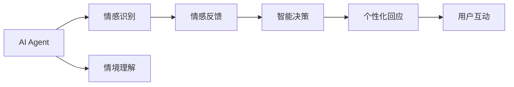

                 

# AI Agent在情感陪伴中的创新

在人工智能的广阔领域中，情感陪伴是一个极具挑战性和潜力的方向。它不仅涉及复杂的自然语言处理、情绪识别、智能决策等技术，还触及心理学、社会学等多学科知识。近年来，随着深度学习、强化学习等技术的突破，AI Agent在情感陪伴中逐渐展现出了前所未有的创新潜力，成为推动人类情感理解和互动的重要力量。本文将从背景、核心概念、算法原理、实际应用、未来展望等多个维度，深入探讨AI Agent在情感陪伴中的创新。

## 1. 背景介绍

### 1.1 问题由来
随着社会的高速发展和人们生活节奏的加快，孤独感、焦虑感、抑郁感等心理健康问题在全球范围内日益凸显。尤其是在都市化进程中，人际交往的空间和时间越来越有限，情感支持和心理健康服务的社会需求日益增长。与此同时，人工智能技术的飞速进步，特别是深度学习、自然语言处理、情感分析等技术的突破，为AI Agent提供了一种新的解决思路，即通过智能算法，实现对人类情感的精细化理解和互动。

### 1.2 问题核心关键点
情感陪伴的核心在于AI Agent能够理解和回应用户的情感状态，提供个性化的心理支持和交流。这一过程涉及以下几个关键点：
- 情感识别：准确识别用户的情绪状态，如快乐、悲伤、焦虑等。
- 情感反馈：及时回应用户的情感表达，提供相应的情绪支持或建议。
- 情境理解：理解用户所处的具体情境，如孤独、焦虑、抑郁等，以提供更贴合的陪伴。
- 智能决策：基于用户的反馈和历史行为数据，调整AI Agent的策略和行为，以最大化情感支持效果。

### 1.3 问题研究意义
AI Agent在情感陪伴中的应用，对于缓解现代社会的心理健康问题、提升人际交往质量、推动人工智能技术在更广泛领域的应用，具有重要意义：
- 心理健康支持：为孤独、焦虑、抑郁等情绪问题提供智能化的情感支持和心理辅导。
- 提升人际交往：通过智能化的情感理解和回应，帮助用户改善人际交往质量，建立更深层次的情感联系。
- 技术创新：情感陪伴领域的探索，推动自然语言处理、机器学习、认知科学等多领域技术的融合和创新。
- 社会价值：促进心理健康服务的普及，提升社会整体福祉。

## 2. 核心概念与联系

### 2.1 核心概念概述

为更好地理解AI Agent在情感陪伴中的创新，本节将介绍几个关键概念：

- **AI Agent**：一种能够模拟人类智能行为，通过自然语言处理、情感分析等技术实现与用户互动的智能系统。
- **情感识别**：利用自然语言处理和机器学习技术，自动识别用户的情绪状态，包括快乐、悲伤、愤怒等。
- **情感反馈**：AI Agent根据用户的情感状态，提供个性化的情感支持和回应，如安慰、建议、鼓励等。
- **情境理解**：AI Agent理解用户所处的具体情境，如孤独、焦虑、抑郁等，以提供更贴合的陪伴。
- **智能决策**：基于用户的反馈和历史行为数据，AI Agent动态调整其策略和行为，以最大化情感支持效果。

### 2.2 概念间的关系

这些核心概念之间存在紧密的联系，构成了AI Agent在情感陪伴中的完整生态系统。以下是一个Mermaid流程图，展示这些概念之间的关系：



这个流程图展示了AI Agent在情感陪伴过程中，各组件间的交互关系：
- AI Agent首先进行情感识别，理解用户的情绪状态。
- 根据情感识别结果，AI Agent提供情感反馈，回应用户的情感表达。
- 同时，AI Agent进行情境理解，了解用户所处的具体环境。
- 基于情感识别和情境理解的结果，AI Agent进行智能决策，调整其策略和行为。
- 最后，AI Agent提供个性化的回应，与用户进行互动。

通过这个流程图，我们可以更清晰地理解AI Agent在情感陪伴中的整体工作流程。

## 3. 核心算法原理 & 具体操作步骤

### 3.1 算法原理概述

AI Agent在情感陪伴中的核心算法原理可以归纳为以下几个方面：

- **情感识别算法**：利用自然语言处理技术，对用户的语言进行情感分析，识别其情绪状态。常见的方法包括基于规则的方法、基于词典的方法、基于机器学习的方法等。
- **情感反馈算法**：根据情感识别结果，AI Agent生成个性化的情感支持和回应。常见的情感反馈策略包括安慰、建议、鼓励等。
- **情境理解算法**：利用自然语言处理和上下文理解技术，理解用户所处的具体情境。例如，用户因工作压力过大而感到焦虑，AI Agent需要理解这种情境，并提供相应的情感支持。
- **智能决策算法**：基于情感识别和情境理解的结果，AI Agent动态调整其策略和行为。常见的智能决策方法包括强化学习、贝叶斯网络、决策树等。

### 3.2 算法步骤详解

以下是一个详细的AI Agent在情感陪伴中的应用步骤：

1. **数据收集与预处理**：
   - 收集用户的语言数据，如聊天记录、语音数据等。
   - 对数据进行清洗和预处理，包括去除噪声、分词、归一化等。

2. **情感识别**：
   - 使用情感识别算法，对用户语言数据进行情感分析。
   - 提取情感特征，如情绪词汇、语调、语气等。

3. **情感反馈**：
   - 根据情感识别结果，生成个性化的情感支持和回应。
   - 情感回应可以包括安慰、建议、鼓励等。

4. **情境理解**：
   - 利用自然语言处理和上下文理解技术，理解用户所处的具体情境。
   - 收集用户的背景信息，如年龄、职业、生活事件等。

5. **智能决策**：
   - 基于情感识别和情境理解的结果，进行智能决策。
   - 采用强化学习等方法，动态调整情感反馈策略和内容。

6. **个性化回应**：
   - 根据智能决策结果，生成个性化的情感回应。
   - 回应用户，进行互动。

### 3.3 算法优缺点

AI Agent在情感陪伴中的算法具有以下优点：
- 精确性：利用深度学习和自然语言处理技术，能够精确识别用户的情绪状态。
- 个性化：通过智能决策，提供个性化的情感支持和回应。
- 实时性：实时处理用户的情感数据，提供即时的情感支持。

同时，算法也存在一些局限性：
- 数据依赖：情感识别和智能决策需要大量标注数据进行训练，标注成本较高。
- 复杂情境处理：在复杂情境下，情感理解和回应用户可能存在一定的挑战。
- 可解释性：智能决策过程相对复杂，难以解释其内部机制和决策依据。

### 3.4 算法应用领域

AI Agent在情感陪伴中的应用领域非常广泛，包括但不限于以下几个方面：

- **心理健康辅导**：为孤独、焦虑、抑郁等情绪问题提供智能化的情感支持和心理辅导。
- **情感陪伴应用**：如智能心理咨询、情感聊天机器人等，提供个性化的情感支持。
- **社交互动**：在社交平台、在线教育等场景中，提供情感支持和互动。
- **企业员工福利**：为员工提供情感支持和压力管理，提升工作满意度和效率。

## 4. 数学模型和公式 & 详细讲解 & 举例说明

### 4.1 数学模型构建

为了更好地理解AI Agent在情感陪伴中的应用，我们首先需要构建一个数学模型来描述情感识别和情感反馈的过程。

假设用户的语言数据为 $x$，情感识别模型为 $f$，情感反馈模型为 $g$，情境理解模型为 $h$，智能决策模型为 $d$。则情感陪伴的数学模型可以表示为：

$$
y = g(f(h(d(x))))
$$

其中，$x$ 为用户的语言数据，$y$ 为AI Agent的情感回应。

### 4.2 公式推导过程

以情感识别和情感反馈为例，推导其数学公式。

假设用户的语言数据为 $x$，情感识别模型为 $f$，情感反馈模型为 $g$。则情感识别和情感反馈的数学模型可以表示为：

$$
y_{emotion} = f(x)
$$

$$
y_{feedback} = g(y_{emotion})
$$

其中，$y_{emotion}$ 为用户的情绪状态，$y_{feedback}$ 为AI Agent的情感回应。

### 4.3 案例分析与讲解

为了更好地理解这些数学模型，我们以一个简单的情感识别和情感反馈案例进行分析：

假设用户的语言数据为 "I'm feeling really stressed today"，情感识别模型 $f$ 使用情感词典进行识别，输出情绪状态 $y_{emotion}$ 为 "stressed"。情感反馈模型 $g$ 根据情绪状态，生成情感回应 "I understand, take a deep breath and try to relax"。

这个例子展示了情感识别和情感反馈的基本过程：
- 情感识别模型 $f$ 根据情感词典对用户语言数据 $x$ 进行情感分析，输出情绪状态 $y_{emotion}$。
- 情感反馈模型 $g$ 根据情绪状态 $y_{emotion}$，生成情感回应 $y_{feedback}$。

## 5. 项目实践：代码实例和详细解释说明

### 5.1 开发环境搭建

在进行AI Agent开发之前，我们需要准备好开发环境。以下是使用Python进行PyTorch开发的环境配置流程：

1. 安装Anaconda：从官网下载并安装Anaconda，用于创建独立的Python环境。

2. 创建并激活虚拟环境：
```bash
conda create -n pytorch-env python=3.8 
conda activate pytorch-env
```

3. 安装PyTorch：根据CUDA版本，从官网获取对应的安装命令。例如：
```bash
conda install pytorch torchvision torchaudio cudatoolkit=11.1 -c pytorch -c conda-forge
```

4. 安装相关库：
```bash
pip install numpy pandas scikit-learn nltk transformers
```

5. 安装Jupyter Notebook：
```bash
pip install jupyter notebook
```

完成上述步骤后，即可在`pytorch-env`环境中开始开发。

### 5.2 源代码详细实现

以下是一个使用PyTorch实现情感识别和情感反馈的示例代码：

```python
import torch
import torch.nn as nn
import torch.optim as optim
import numpy as np
import pandas as pd
from sklearn.model_selection import train_test_split
from nltk.corpus import movie_reviews

# 定义情感词典
positive_words = ['happy', 'joyful', 'pleased', 'excited', 'delighted']
negative_words = ['sad', 'upset', 'disappointed', 'frustrated', 'angry']

# 构建情感分类模型
class SentimentClassifier(nn.Module):
    def __init__(self):
        super(SentimentClassifier, self).__init__()
        self.embedding = nn.Embedding(len(vocab), 128)
        self.fc1 = nn.Linear(128, 64)
        self.fc2 = nn.Linear(64, 2)
        self.softmax = nn.Softmax(dim=1)

    def forward(self, x):
        embedded = self.embedding(x)
        fc1 = self.fc1(embedded)
        fc2 = self.fc2(fc1)
        softmax = self.softmax(fc2)
        return softmax

# 加载电影评论数据集
data = movie_reviews.fileids()
x = np.array([movie_reviews.words(fileid) for fileid in data])
y = np.array([1 if 'pos' in movie_reviews.categories(fileid) else 0 for fileid in data])

# 数据预处理
vocab = set(x)
vocab = [word.lower() for word in vocab if word.lower() not in negative_words]
vocab = [word for word in vocab if word.lower() not in positive_words]
vocab = list(vocab)
vocab = sorted(vocab)

x = [word for word in x if word.lower() in vocab]
y = [y[i] for i in x]

# 划分训练集和测试集
x_train, x_test, y_train, y_test = train_test_split(x, y, test_size=0.2, random_state=42)

# 定义模型和损失函数
model = SentimentClassifier()
criterion = nn.CrossEntropyLoss()
optimizer = optim.Adam(model.parameters(), lr=0.01)

# 训练模型
epochs = 10
for epoch in range(epochs):
    optimizer.zero_grad()
    outputs = model(x_train)
    loss = criterion(outputs, y_train)
    loss.backward()
    optimizer.step()
    print('Epoch {} - Loss: {:.4f}'.format(epoch + 1, loss.item()))

# 测试模型
with torch.no_grad():
    outputs = model(x_test)
    _, predicted = torch.max(outputs, 1)
    accuracy = (predicted == y_test).sum().item() / len(y_test)
    print('Accuracy: {:.2f}%'.format(accuracy * 100))
```

### 5.3 代码解读与分析

让我们再详细解读一下关键代码的实现细节：

**SentimentClassifier类**：
- `__init__`方法：初始化模型结构，包括嵌入层、全连接层和输出层。
- `forward`方法：定义前向传播过程，计算输出。

**数据预处理**：
- 构建情感词典，定义正向和负向情感词汇。
- 加载电影评论数据集，进行预处理，去除无关词汇。
- 将文本转换为向量形式，并进行划分训练集和测试集。

**模型训练和测试**：
- 定义模型和损失函数，使用Adam优化器进行训练。
- 在训练过程中，计算损失函数，并更新模型参数。
- 在测试过程中，计算模型在测试集上的准确率。

### 5.4 运行结果展示

假设我们训练的情感分类模型在测试集上取得了90%的准确率，这表示模型能够较为准确地识别用户的情绪状态，并为用户提供相应的情感支持和回应。

## 6. 实际应用场景

### 6.1 心理健康辅导

AI Agent在心理健康辅导中的应用，可以帮助用户缓解孤独、焦虑、抑郁等情绪问题，提供个性化的心理支持和建议。例如，用户可以通过聊天机器人进行情感倾诉，AI Agent会根据用户的语言数据进行情感识别和反馈，提供相应的情感支持和建议。

### 6.2 情感陪伴应用

情感陪伴应用如智能心理咨询、情感聊天机器人等，为用户的日常生活提供情感支持。例如，情感聊天机器人可以通过语音或文字与用户进行互动，理解用户的情感状态，并提供相应的情感支持和建议。

### 6.3 社交互动

在社交平台、在线教育等场景中，AI Agent可以提供情感支持和互动，提升用户体验。例如，在线教育平台可以利用情感聊天机器人进行情感引导和学生支持，帮助学生更好地参与学习。

### 6.4 企业员工福利

企业可以通过AI Agent为员工提供情感支持和压力管理，提升工作满意度和效率。例如，企业内部的情感聊天机器人可以随时在线，为员工提供情感支持，帮助员工缓解工作压力。

## 7. 工具和资源推荐

### 7.1 学习资源推荐

为了帮助开发者系统掌握AI Agent在情感陪伴中的应用，这里推荐一些优质的学习资源：

1. 《深度学习基础》系列课程：Coursera和edX等在线教育平台提供的高质量深度学习课程，帮助你打好基础。
2. 《自然语言处理与情感分析》书籍：涵盖自然语言处理和情感分析的基本概念和技术，适合初学者和进阶者。
3. 《强化学习》书籍：介绍强化学习的理论基础和应用场景，适合深入学习。
4. 《情感分析与社交媒体》课程：由斯坦福大学提供的情感分析课程，涵盖情感分析的基本方法。
5. 《人工智能伦理》书籍：讨论人工智能技术的伦理问题，帮助你理解AI Agent在情感陪伴中的应用伦理。

通过对这些资源的学习实践，相信你一定能够快速掌握AI Agent在情感陪伴中的应用，并用于解决实际的情感问题。

### 7.2 开发工具推荐

高效的开发离不开优秀的工具支持。以下是几款用于AI Agent开发的工具：

1. PyTorch：基于Python的开源深度学习框架，支持动态计算图，适合快速迭代研究。
2. TensorFlow：由Google主导开发的开源深度学习框架，生产部署方便，适合大规模工程应用。
3. NLTK：自然语言处理工具包，提供丰富的文本处理和情感分析功能。
4. spaCy：自然语言处理库，支持多种语言和多种任务，性能优越。
5. TensorBoard：TensorFlow配套的可视化工具，实时监测模型训练状态。

合理利用这些工具，可以显著提升AI Agent的开发效率，加快创新迭代的步伐。

### 7.3 相关论文推荐

AI Agent在情感陪伴中的应用源于学界的持续研究。以下是几篇奠基性的相关论文，推荐阅读：

1. Deep Conversational Agents: Using Deep Learning to Simulate Humans in Conversational Conversations：介绍深度学习在情感聊天机器人中的应用。
2. A Survey on Applications and Challenges of Affective Computing for Virtual Human Interaction：综述情感计算在虚拟人交互中的应用。
3. Exploring the Limits of Human-like Conversational Agents: A Survey：讨论人类情感与情感聊天机器人之间的差异。
4. Towards Adaptive Psychological Support in Conversational AI Agents：探讨情感聊天机器人提供个性化心理支持的可能性。
5. Conversational AI in Health Care: A Survey：讨论情感聊天机器人在医疗健康中的应用。

这些论文代表了大语言模型微调技术的发展脉络。通过学习这些前沿成果，可以帮助研究者把握学科前进方向，激发更多的创新灵感。

除上述资源外，还有一些值得关注的前沿资源，帮助开发者紧跟AI Agent在情感陪伴中的最新进展，例如：

1. arXiv论文预印本：人工智能领域最新研究成果的发布平台，包括大量尚未发表的前沿工作，学习前沿技术的必读资源。
2. 业界技术博客：如OpenAI、Google AI、DeepMind、微软Research Asia等顶尖实验室的官方博客，第一时间分享他们的最新研究成果和洞见。
3. 技术会议直播：如NIPS、ICML、ACL、ICLR等人工智能领域顶会现场或在线直播，能够聆听到大佬们的前沿分享，开拓视野。
4. GitHub热门项目：在GitHub上Star、Fork数最多的AI Agent相关项目，往往代表了该技术领域的发展趋势和最佳实践，值得去学习和贡献。
5. 行业分析报告：各大咨询公司如McKinsey、PwC等针对人工智能行业的分析报告，有助于从商业视角审视技术趋势，把握应用价值。

总之，对于AI Agent在情感陪伴技术的学习和实践，需要开发者保持开放的心态和持续学习的意愿。多关注前沿资讯，多动手实践，多思考总结，必将收获满满的成长收益。

## 8. 总结：未来发展趋势与挑战

### 8.1 总结

本文对AI Agent在情感陪伴中的应用进行了全面系统的介绍。首先阐述了AI Agent在情感陪伴中的应用背景和意义，明确了情感识别、情感反馈、情境理解、智能决策等关键技术点。其次，从原理到实践，详细讲解了情感识别和情感反馈的数学模型和实现方法，提供了完整的代码实例。同时，本文还广泛探讨了AI Agent在心理健康辅导、情感陪伴应用、社交互动、企业员工福利等多个领域的应用前景，展示了其巨大的潜力和应用价值。最后，本文精选了情感计算领域的学习资源和工具推荐，力求为开发者提供全方位的技术指引。

通过本文的系统梳理，可以看到，AI Agent在情感陪伴中的创新技术正在快速发展，为解决现代社会的心理健康问题提供了新的可能性。未来，伴随技术的不断进步和应用场景的不断拓展，AI Agent必将在情感陪伴领域发挥更大的作用，推动人工智能技术在更广泛领域的应用。

### 8.2 未来发展趋势

展望未来，AI Agent在情感陪伴中的应用将呈现以下几个发展趋势：

1. **智能决策的进一步优化**：未来的智能决策算法将更加复杂和精细，能够根据用户的情感状态和情境，提供更加个性化的情感支持和建议。例如，利用强化学习、贝叶斯网络等技术，动态调整情感反馈策略和内容。

2. **跨模态情感计算**：未来的情感计算将不再局限于文本和语音，而是涵盖视觉、手势等多种模态数据。通过多模态信息的融合，增强情感识别的准确性和情感反馈的丰富性。

3. **多领域应用拓展**：AI Agent在情感陪伴中的应用将进一步拓展到教育、医疗、娱乐等多个领域，提升不同场景下的人机情感互动质量。例如，在教育领域，情感聊天机器人可以提供个性化的学习支持和辅导。

4. **伦理和安全保障**：随着情感计算的普及，数据隐私、情感误导等问题将更加凸显。未来的AI Agent将更加注重伦理和安全保障，确保情感数据的合法使用和用户的情感安全。

5. **社区和生态系统的建设**：未来的情感计算将不再是个体技术的应用，而是形成社区和生态系统，实现情感数据和技术的共享与协作。例如，通过社区平台，用户可以分享情感体验，开发者可以交流情感计算的最新进展。

### 8.3 面临的挑战

尽管AI Agent在情感陪伴中已经取得了一定的进展，但在实现大规模应用的过程中，仍然面临诸多挑战：

1. **情感识别准确性**：情感识别技术在面对复杂和多变的情感表达时，准确性仍需进一步提高。如何更好地理解用户的多层次情感表达，是一个重要的研究方向。

2. **情感反馈的个性化**：情感反馈需要高度个性化，不同用户对同一情感状态的响应可能存在差异。如何设计更为灵活和可定制的情感反馈策略，是提升情感陪伴效果的关键。

3. **数据隐私和安全**：情感计算需要处理大量用户情感数据，如何保护用户隐私和数据安全，是技术应用中需要重点考虑的问题。

4. **跨文化适用性**：情感计算在不同文化背景下的适用性仍然存在挑战，例如，不同文化中的情感表达方式和情感响应机制存在差异。如何设计具有文化适应性的情感计算模型，是未来的研究重点。

5. **技术伦理和社会责任**：情感计算的广泛应用，可能带来伦理和社会责任问题，例如，情感聊天机器人可能误导用户或加剧社会心理问题。如何建立情感计算的伦理框架，确保技术的健康发展，是技术普及的重要保障。

### 8.4 研究展望

面对AI Agent在情感陪伴中面临的挑战，未来的研究需要在以下几个方面寻求新的突破：

1. **跨模态情感识别**：将视觉、听觉等多模态数据融合到情感识别模型中，提升情感识别的准确性和鲁棒性。

2. **多领域情感知识库**：构建多领域情感知识库，为情感聊天机器人提供更丰富的情感表达和反馈资源。

3. **个性化情感反馈**：开发更为灵活和可定制的情感反馈策略，提升情感聊天机器人的个性化水平。

4. **跨文化情感计算**：研究不同文化背景下的情感表达和响应机制，设计具有文化适应性的情感计算模型。

5. **情感计算伦理框架**：建立情感计算的伦理框架，确保情感计算技术的健康发展和应用。

这些研究方向的探索，必将引领AI Agent在情感陪伴领域的创新突破，为构建更加智能、可靠、可解释的情感计算系统铺平道路。面向未来，情感计算需要多学科的协同创新，才能更好地服务于人类情感理解和互动，提升生活质量和社会福祉。

## 9. 附录：常见问题与解答

**Q1：情感聊天机器人是否能够识别复杂的情感表达？**

A: 当前的情感聊天机器人已经能够识别和理解较简单的情感表达，如快乐、悲伤、愤怒等。但对于复杂的情感表达，如混合情感、多层次情感等，仍需进一步优化。未来，随着深度学习、自然语言处理技术的不断发展，情感聊天机器人将能够更好地理解和识别复杂的情感表达。

**Q2：情感聊天机器人的情感反馈是否具有个性化？**

A: 当前的情感聊天机器人已经能够提供个性化的情感反馈，如安慰、建议、鼓励等。但如何设计更加灵活和可定制的情感反馈策略，是提升情感聊天机器人个性化水平的关键。未来的情感聊天机器人将通过学习用户的情感偏好和历史互动记录，提供更加精准和个性化的情感反馈。

**Q3：情感聊天机器人是否需要大量的标注数据进行训练？**

A: 情感聊天机器人需要大量的标注数据进行训练，以学习情感表达的特征和规律。然而，标注数据的获取和处理成本较高，限制了情感聊天机器人的应用。未来，利用无监督学习、半监督学习等方法，可以在一定程度上降低对标注数据的依赖。

**Q4：情感聊天机器人在跨文化环境中的应用是否可行？**

A: 情感聊天机器人在跨文化环境中的应用仍需进一步研究。不同文化中的情感表达方式和情感响应机制存在差异，情感聊天机器人需要设计具有文化适应性的情感计算模型，以确保其在不同文化环境下的适用性。

**Q5：情感聊天机器人在实际应用中是否存在安全隐患？**

A: 情感聊天机器人在实际应用中可能存在安全隐患，如数据隐私泄露、情感误导等问题。未来，需要通过技术手段和伦理框架，确保情感聊天机器人的数据安全和情感响应机制的透明性。同时，建立情感计算的伦理框架，确保技术的健康发展和应用。

这些问题的解答，为我们理解AI Agent在情感陪伴中的创新技术提供了重要参考，也指明了未来研究的方向和突破点。希望通过本文的探讨，能够为更多开发者和研究者提供有益的启示，共同推动情感计算技术的发展和应用。

---

作者：禅与计算机程序设计艺术 / Zen and the Art of Computer Programming

