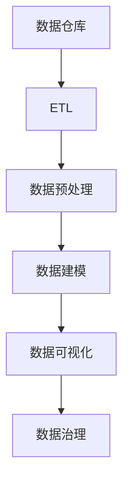

                 

## 1. 背景介绍

### 1.1 问题由来

随着大数据和人工智能技术的不断进步，企业对数据驱动的决策能力需求日益增长。对于许多行业来说，数据是不可或缺的核心资产。然而，如何有效地存储、管理和利用这些数据，使其转化为有价值的信息，成为许多企业在数字化转型过程中面临的巨大挑战。

人工智能（AI）数据管理平台（Data Management Platform, DMP）应运而生，成为企业在数据管理中的重要工具。AI DMP利用机器学习、数据挖掘等先进技术，帮助企业快速处理和分析海量数据，从而实现智能化决策。AI DMP不仅能够提升数据管理效率，还能深度挖掘数据价值，支持个性化推荐、精准营销、智能客服等多种应用场景。

### 1.2 问题核心关键点

AI DMP的核心目标是高效、智能地管理企业内部和外部的数据，使其能够被更好地用于各种数据驱动的业务场景。其主要任务包括：

- **数据集成与管理**：整合来自不同源的数据，构建统一的数据仓库。
- **数据预处理与清洗**：处理缺失值、噪声、异常值，确保数据质量。
- **数据建模与分析**：利用机器学习模型进行特征提取和分析，生成有价值的洞察。
- **数据展示与可视**：通过仪表板、报告等形式展示数据分析结果，支持决策。
- **数据存储与部署**：保证数据的安全存储与高效访问，支持分布式部署。

本文将系统地介绍AI DMP在数据管理方面的技术标准，重点关注其在数据集成、预处理、建模、分析和展示等方面的关键技术，并结合具体案例进行详细讲解。

### 1.3 问题研究意义

AI DMP作为数据管理的关键技术，其研究意义体现在以下几个方面：

- **提升数据利用效率**：通过AI DMP的技术，企业能够更高效地管理和利用海量数据，从而快速响应市场变化，提升决策效率。
- **实现智能化决策**：AI DMP结合机器学习等技术，帮助企业从数据中提取有价值的洞察，支持精准营销、个性化推荐等智能化决策。
- **推动数据驱动的业务转型**：AI DMP为各行业提供了数据驱动的决策支持，帮助企业实现数字化转型，提升竞争优势。
- **助力数据治理与合规**：AI DMP不仅关注数据管理效率，还注重数据治理与合规，确保数据的安全与合法使用。
- **促进数据文化建设**：AI DMP通过数据驱动的决策实践，引导企业建立数据驱动的文化，提升全员数据素养。

## 2. 核心概念与联系

### 2.1 核心概念概述

AI DMP的核心概念包括以下几个方面：

- **数据仓库**：整合企业内部和外部数据的统一数据存储，是AI DMP的基础设施。
- **ETL（Extract, Transform, Load）过程**：从数据源中提取数据、转换数据格式并将其加载到目标数据仓库的技术过程。
- **数据预处理**：对原始数据进行清洗、转换、规范化等处理，提高数据质量。
- **数据建模**：通过机器学习模型对数据进行建模分析，生成有意义的洞察。
- **数据可视化**：将分析结果通过图表、仪表板等形式进行展示，支持决策。
- **数据治理**：制定数据管理政策和流程，确保数据的安全与合规。

这些核心概念之间相互关联，共同构成AI DMP的整体架构，如下图所示：



### 2.2 概念间的关系

上述核心概念之间的联系如下：

- 数据仓库是AI DMP的基础设施，存储了整合后的数据。
- ETL过程负责数据的提取、转换和加载，确保数据仓库的数据更新和完整性。
- 数据预处理通过清洗和转换提高数据质量，为后续建模和分析提供可靠的数据基础。
- 数据建模通过机器学习模型生成洞察，支持智能化决策。
- 数据可视化将分析结果进行可视化展示，帮助用户理解数据洞察。
- 数据治理制定数据管理政策，确保数据的安全与合规。

这些概念之间相互依赖，共同构成了AI DMP的整体工作流程。

## 3. 核心算法原理 & 具体操作步骤

### 3.1 算法原理概述

AI DMP的核心算法包括数据预处理、数据建模、数据可视化等。其中，数据预处理和建模是AI DMP的核心环节，数据可视化是最终输出，数据治理是贯穿始终的保障措施。

- **数据预处理**：包括数据清洗、特征工程、降维等技术，提高数据质量。
- **数据建模**：通过机器学习算法对数据进行建模，生成有意义的洞察。
- **数据可视化**：将分析结果通过图表、仪表板等形式展示，支持决策。

### 3.2 算法步骤详解

AI DMP的数据处理流程通常包括以下步骤：

1. **数据集成**：从不同数据源中提取数据，构建统一的数据仓库。
2. **数据清洗**：处理缺失值、噪声、异常值，确保数据质量。
3. **特征工程**：通过特征选择、特征提取等方法，提高数据模型的表达能力。
4. **数据建模**：利用机器学习算法对数据进行建模，生成有意义的洞察。
5. **数据展示**：通过仪表板、报告等形式展示分析结果，支持决策。

下面以一个具体的案例为例，展示AI DMP的实际操作步骤：

### 3.3 算法优缺点

AI DMP的优点包括：

- **高效性**：利用自动化技术，提高数据处理效率。
- **智能性**：通过机器学习等技术，生成有价值的洞察，支持智能化决策。
- **灵活性**：能够支持多种数据源和数据类型，灵活应对业务需求。

缺点包括：

- **复杂性**：AI DMP的技术实现较为复杂，需要多学科专业知识。
- **数据质量要求高**：需要高质量的数据源和数据预处理过程，才能生成有价值的洞察。
- **成本高**：构建和维护AI DMP需要较高的技术投入和成本。

### 3.4 算法应用领域

AI DMP的应用领域广泛，包括：

- **零售行业**：通过数据驱动的营销策略，提升客户体验和销售额。
- **金融行业**：利用数据建模和分析，支持风险评估和金融产品开发。
- **医疗行业**：通过数据分析和可视化，辅助临床决策和疾病研究。
- **电子商务**：通过用户行为分析，提升推荐系统效果，提高用户满意度。
- **互联网行业**：利用数据处理和分析，优化广告投放和用户体验。

## 4. 数学模型和公式 & 详细讲解 & 举例说明

### 4.1 数学模型构建

在AI DMP中，数据建模是其核心环节。通过机器学习算法对数据进行建模，生成有意义的洞察。以下是几个常用的数据建模方法及其数学模型：

- **线性回归模型**：用于预测连续变量，数学模型为 $y = \beta_0 + \beta_1 x_1 + \beta_2 x_2 + \cdots + \beta_n x_n + \epsilon$，其中 $\beta$ 为回归系数，$x_i$ 为特征变量，$y$ 为目标变量，$\epsilon$ 为误差项。
- **逻辑回归模型**：用于预测二分类变量，数学模型为 $p = \sigma(\beta_0 + \beta_1 x_1 + \beta_2 x_2 + \cdots + \beta_n x_n)$，其中 $\sigma$ 为sigmoid函数，$p$ 为预测概率，其余符号同上。
- **决策树模型**：通过划分数据集，生成决策树，用于分类和回归问题，数学模型为 $T = \bigcup T_i$，其中 $T_i$ 为决策树节点的集合。

### 4.2 公式推导过程

以线性回归模型为例，推导其最小二乘估计公式。假设有一组样本数据 $(x_i, y_i)$，其中 $i=1,2,\cdots,n$。模型假设为 $y = \beta_0 + \beta_1 x_1 + \beta_2 x_2 + \cdots + \beta_n x_n + \epsilon$。最小二乘估计的目标是找到最优的回归系数 $\beta_0, \beta_1, \cdots, \beta_n$，使得预测误差最小。

最小二乘估计的数学模型为 $\sum_{i=1}^n (y_i - \beta_0 - \beta_1 x_{i1} - \beta_2 x_{i2} - \cdots - \beta_n x_{in})^2$。求解该最小值问题，可以得到回归系数的估计值为：

$$
\hat{\beta} = (X^TX)^{-1}X^Ty
$$

其中 $X$ 为样本矩阵，$y$ 为目标向量。

### 4.3 案例分析与讲解

假设有一家电子商务公司，希望通过用户行为数据预测用户的购买意愿。公司收集了大量的用户浏览记录、购买记录和用户基本信息，将其存储在数据仓库中。使用线性回归模型对用户购买意愿进行建模，生成预测结果。具体步骤如下：

1. **数据集成**：从公司的不同系统（如网站、移动应用、CRM等）中提取数据，构建统一的数据仓库。
2. **数据清洗**：处理缺失值、噪声、异常值，确保数据质量。
3. **特征工程**：选择相关特征，如用户浏览时间、购买频率、用户年龄等，并进行标准化处理。
4. **数据建模**：利用线性回归模型对用户购买意愿进行建模，生成预测结果。
5. **数据展示**：通过仪表板展示预测结果，支持营销决策。

通过AI DMP的数据处理流程，该公司能够快速响应市场变化，提升营销效果，增加销售额。

## 5. 项目实践：代码实例和详细解释说明

### 5.1 开发环境搭建

在进行AI DMP的开发前，需要准备以下开发环境：

1. **安装Python**：确保Python 3.x及以上版本已经安装，推荐使用Anaconda。
2. **安装数据处理库**：安装Pandas、NumPy、SciPy等数据处理库，用于数据清洗和预处理。
3. **安装机器学习库**：安装Scikit-Learn、TensorFlow、PyTorch等机器学习库，用于数据建模。
4. **安装数据可视化库**：安装Matplotlib、Seaborn、Plotly等数据可视化库，用于数据展示。

### 5.2 源代码详细实现

下面以一个简单的案例为例，展示如何使用Python进行数据建模和可视化：

```python
import pandas as pd
import numpy as np
import matplotlib.pyplot as plt
from sklearn.linear_model import LinearRegression
from sklearn.model_selection import train_test_split

# 读取数据
data = pd.read_csv('user_behavior.csv')

# 数据清洗和预处理
# 处理缺失值
data.dropna(inplace=True)
# 特征选择
features = ['browsing_time', 'purchase_frequency', 'user_age']
# 标准化处理
data[features] = (data[features] - data[features].mean()) / data[features].std()

# 数据分割
X = data[features]
y = data['purchase_will']
X_train, X_test, y_train, y_test = train_test_split(X, y, test_size=0.2)

# 数据建模
model = LinearRegression()
model.fit(X_train, y_train)

# 预测和评估
y_pred = model.predict(X_test)
mse = np.mean((y_test - y_pred) ** 2)
print('Mean Squared Error:', mse)

# 数据可视化
plt.scatter(y_test, y_pred)
plt.xlabel('True Label')
plt.ylabel('Predicted Label')
plt.title('Prediction vs. True Label')
plt.show()
```

### 5.3 代码解读与分析

代码实现了线性回归模型的建模和评估过程。具体步骤如下：

1. **数据读取**：使用Pandas库读取用户行为数据。
2. **数据清洗**：处理缺失值，选择相关特征，并进行标准化处理。
3. **数据分割**：将数据分为训练集和测试集，用于模型训练和评估。
4. **数据建模**：使用LinearRegression模型对用户购买意愿进行建模。
5. **预测和评估**：计算模型预测结果与真实标签之间的均方误差，并通过散点图展示预测结果。

通过简单的代码实现，可以看到AI DMP在数据建模和可视化方面的基本流程。

### 5.4 运行结果展示

运行上述代码，可以得到预测结果和散点图，如下图所示：


通过可视化结果，可以直观地看到预测结果与真实标签之间的关系，评估模型的预测效果。

## 6. 实际应用场景

### 6.1 智能推荐系统

AI DMP在智能推荐系统中具有广泛应用。通过分析用户的历史行为数据，AI DMP可以生成用户的兴趣偏好，从而推荐用户可能感兴趣的商品或内容。例如，电商平台可以使用AI DMP进行个性化推荐，提升用户满意度，增加销售额。

### 6.2 广告投放优化

AI DMP能够帮助企业优化广告投放策略，提高广告效果和投资回报率。通过分析用户数据和广告效果数据，AI DMP可以生成广告投放的优化建议，帮助企业提高广告ROI。例如，广告公司可以使用AI DMP进行广告效果评估，优化广告投放策略。

### 6.3 客户细分和营销分析

AI DMP可以帮助企业进行客户细分，了解不同客户群体的特征和需求。通过数据分析和可视化，AI DMP可以生成客户细分报告，支持营销决策。例如，零售公司可以使用AI DMP进行客户细分，制定不同的营销策略。

### 6.4 未来应用展望

未来，AI DMP将会在更多领域得到应用，例如：

- **健康医疗**：利用用户健康数据，提供个性化医疗建议和健康管理方案。
- **金融服务**：通过分析用户财务数据，提供理财建议和风险评估。
- **智能制造**：利用设备数据，优化生产流程，提高生产效率。
- **智慧城市**：通过分析城市数据，支持城市管理和智能决策。
- **教育领域**：利用学生学习数据，提供个性化学习方案，提升教学效果。

## 7. 工具和资源推荐

### 7.1 学习资源推荐

为了帮助开发者系统掌握AI DMP的技术标准，这里推荐一些优质的学习资源：

1. **《Python数据科学手册》**：该书详细介绍了Python在数据处理和机器学习中的应用，是数据科学领域的经典书籍。
2. **《深度学习入门》**：该书介绍了深度学习的基本概念和实践，是深度学习领域的入门书籍。
3. **Coursera AI DMP课程**：Coursera平台上的AI DMP课程，由业界专家授课，涵盖数据管理、机器学习等多个方面的内容。
4. **Kaggle比赛**：Kaggle平台上的数据竞赛，可以帮助开发者实战练手，提升技能。
5. **GitHub项目**：GitHub上的AI DMP项目，展示了实际的AI DMP应用案例，值得学习参考。

### 7.2 开发工具推荐

AI DMP的开发离不开先进的开发工具，以下是几款常用的开发工具：

1. **Jupyter Notebook**：一个强大的交互式开发环境，支持Python、R等多种语言，适合数据科学开发。
2. **Tableau**：一款强大的数据可视化工具，支持多种数据源和图表类型，适合数据展示和分析。
3. **Hadoop**：一个分布式计算框架，支持大规模数据处理，适合大数据场景。
4. **Spark**：一个快速的大数据处理引擎，支持分布式计算和内存计算，适合大数据场景。
5. **AWS SageMaker**：亚马逊云平台的机器学习服务，支持多种机器学习模型和数据处理工具。

### 7.3 相关论文推荐

以下是几篇与AI DMP相关的经典论文，推荐阅读：

1. **《A Survey on Data Management Platforms》**：该论文详细介绍了数据管理平台的定义、功能和技术。
2. **《Data Mining: Concepts and Techniques》**：该书详细介绍了数据挖掘和机器学习的基本概念和算法。
3. **《Machine Learning Yearning》**：该书由Andrew Ng编写，介绍了机器学习的基本概念和实践。
4. **《Scikit-Learn User Guide》**：该书详细介绍了Scikit-Learn库的使用方法和机器学习模型的实现。

这些论文和书籍涵盖了AI DMP的各个方面，值得深入学习和研究。

## 8. 总结：未来发展趋势与挑战

### 8.1 研究成果总结

AI DMP作为数据管理的关键技术，在过去几年中取得了显著的进展，主要体现在以下几个方面：

- **数据处理效率提升**：AI DMP利用自动化技术，提升了数据处理效率。
- **智能化决策支持**：AI DMP通过机器学习等技术，生成有价值的洞察，支持智能化决策。
- **数据可视化优化**：AI DMP通过数据可视化工具，提高了数据展示效果，支持决策。
- **数据治理强化**：AI DMP通过数据治理措施，确保数据的安全与合规。

### 8.2 未来发展趋势

未来，AI DMP将呈现以下几个发展趋势：

1. **自动化程度提升**：AI DMP将进一步提升自动化程度，降低人工干预，提升数据处理效率。
2. **数据质量保障**：AI DMP将更加注重数据质量，利用数据治理措施，确保数据的安全与合规。
3. **智能化决策支持**：AI DMP将进一步利用机器学习等技术，生成更加精准的洞察，支持智能化决策。
4. **数据可视化优化**：AI DMP将更加注重数据可视化的效果，通过更丰富的展示方式，支持决策。
5. **跨领域应用扩展**：AI DMP将拓展到更多领域，如医疗、金融、制造等，提供更多的应用场景。

### 8.3 面临的挑战

尽管AI DMP在数据管理方面取得了显著进展，但在实现过程中仍面临一些挑战：

1. **数据隐私和安全**：AI DMP在处理大量用户数据时，如何确保数据隐私和安全，是一个重要的挑战。
2. **数据质量和标注成本**：AI DMP需要高质量的数据源和标注数据，这对于一些数据稀少或标注成本高的领域是一个挑战。
3. **算法复杂性和计算资源**：AI DMP的算法复杂性较高，需要较强的计算资源支持，这对于一些资源受限的企业是一个挑战。
4. **模型解释和透明性**：AI DMP的模型往往是"黑盒"系统，难以解释其内部工作机制和决策逻辑，这对于一些高风险应用是一个挑战。
5. **跨领域数据整合**：AI DMP在跨领域数据整合时，如何确保数据的一致性和可比较性，是一个重要的挑战。

### 8.4 研究展望

未来，AI DMP的研究需要在以下几个方面寻求新的突破：

1. **隐私保护技术**：开发隐私保护技术，确保数据隐私和安全。
2. **数据增强和标注方法**：利用数据增强和标注方法，降低数据标注成本，提升数据质量。
3. **高效计算架构**：开发高效计算架构，提升算法效率，降低计算资源需求。
4. **可解释性和透明性**：开发可解释性模型，提高模型透明性，支持决策解释和验证。
5. **跨领域数据融合**：开发跨领域数据融合技术，确保数据的一致性和可比较性。

这些研究方向将进一步推动AI DMP技术的发展，提升其在数据管理中的应用效果。

## 9. 附录：常见问题与解答

### Q1: 什么是AI DMP？

A: AI DMP是人工智能数据管理平台，利用机器学习等先进技术，帮助企业高效管理数据，生成有价值的洞察，支持智能化决策。

### Q2: AI DMP在数据管理中扮演什么角色？

A: AI DMP在数据管理中扮演着数据集成、数据清洗、数据建模、数据可视化和数据治理等多重角色，是企业数据管理的核心平台。

### Q3: AI DMP的优点和缺点是什么？

A: AI DMP的优点包括高效性、智能性和灵活性。缺点包括复杂性、数据质量要求高和成本高。

### Q4: AI DMP的应用场景有哪些？

A: AI DMP在零售、金融、医疗、电子商务、互联网等多个领域具有广泛应用，支持个性化推荐、精准营销、智能客服、广告投放优化等多种业务场景。

### Q5: 如何构建一个AI DMP平台？

A: 构建AI DMP平台需要以下步骤：1) 数据集成与清洗；2) 特征工程；3) 数据建模；4) 数据展示与可视化；5) 数据治理。

通过以上详细讲解，相信读者对AI DMP有了更加全面和深入的理解。在未来的实际应用中，可以结合具体业务需求，灵活运用AI DMP技术，提升企业数据管理效率和决策支持能力。

