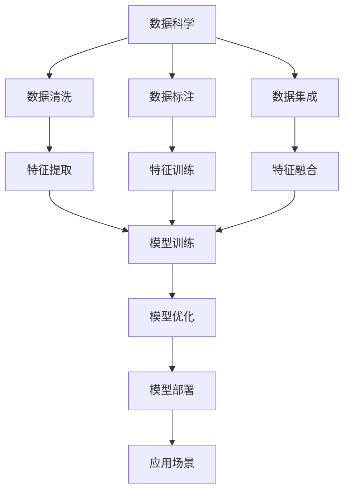
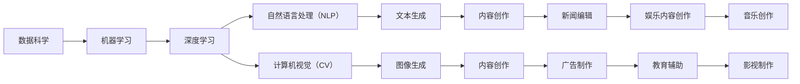
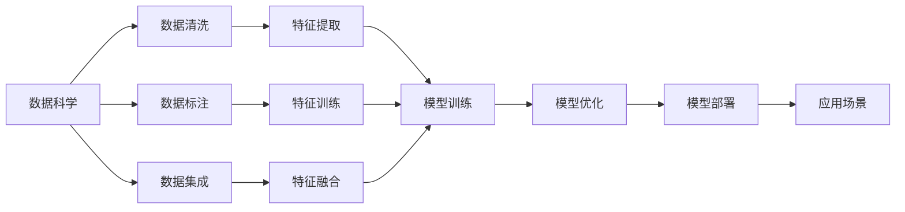

                 

# AIGC从入门到实战：基建：人工智能时代的变迁

> 关键词：AIGC、人工智能、数据科学、机器学习、深度学习、大数据、智能应用、未来科技

## 1. 背景介绍

### 1.1 问题由来

人工智能（AI）自1956年诞生以来，经历了多次起伏和重塑，如今已经进入了一个全新的发展阶段。随着计算能力的飞速提升、数据量的爆炸增长以及算法技术的不断突破，人工智能正在深刻地改变着人类的生产和生活方式。尤其是近年来，生成式人工智能（Generative AI，简称AIGC）技术的发展，为各行各业带来了前所未有的机遇和挑战。

AIGC技术融合了深度学习、自然语言处理（NLP）、计算机视觉（CV）等多领域知识，通过大量的数据训练生成模型，能够自主生成文本、图像、视频等多样化内容。它在内容创作、数据分析、辅助决策等领域展现出强大的潜力，被广泛应用于新闻、广告、娱乐、教育等多个行业。

尽管AIGC技术前景无限，但如何理解AIGC的基础架构，如何在实际应用中高效使用，仍是不少从业者面临的挑战。本文章旨在通过详细分析AIGC的核心概念、算法原理、技术应用，以及未来发展趋势，为读者提供一个系统性的入门指南。

### 1.2 问题核心关键点

AIGC技术涉及的领域广泛，核心点包括：
- 数据科学与大数据：AIGC的基础是大量的数据，这些数据需要经过清洗、标注、集成等过程。
- 机器学习与深度学习：AIGC技术基于机器学习算法，特别是深度神经网络，进行模型训练和优化。
- 自然语言处理（NLP）：AIGC在文本生成、文本理解、情感分析等NLP任务上有广泛应用。
- 计算机视觉（CV）：AIGC技术同样广泛应用于图像生成、图像分类、物体检测等CV任务。
- 跨领域应用：AIGC技术可以应用于新闻编辑、广告制作、娱乐内容创作、教育辅助等多个领域。
- 未来发展：AIGC技术的未来趋势包括更加智能、更加安全、更加普适等方向。

通过理解这些核心点，可以更清晰地把握AIGC技术的本质和应用潜力。

## 2. 核心概念与联系

### 2.1 核心概念概述

要深入理解AIGC技术，首先要明确其核心概念：

- **数据科学**：通过收集、处理、分析数据，从中提取有价值的信息，为AI模型提供训练素材。
- **机器学习**：通过算法训练模型，使模型能够根据输入数据预测输出结果。
- **深度学习**：一种特殊形式的机器学习，使用多层神经网络进行复杂模式识别和数据处理。
- **自然语言处理（NLP）**：处理和理解人类语言的技术，包括文本生成、情感分析、机器翻译等。
- **计算机视觉（CV）**：处理和分析图像、视频等视觉数据的技术，包括图像生成、物体检测、图像分割等。
- **生成式人工智能（AIGC）**：一种能够自主生成文本、图像、视频等多样化内容的AI技术。

这些概念之间存在着紧密的联系，共同构成了AIGC技术的核心框架。下面通过一个Mermaid流程图来展示这些概念的联系：



这个流程图展示了从数据科学到模型部署的完整流程：

1. 数据科学：通过收集和处理数据，提取特征。
2. 数据标注：为模型训练提供有标注的数据集。
3. 特征训练：通过特征提取和训练，生成模型输入。
4. 模型训练：使用训练集训练模型。
5. 模型优化：对模型进行调参和优化。
6. 模型部署：将训练好的模型部署到实际应用中。
7. 应用场景：模型在实际场景中的应用。

通过理解这些概念的联系，可以更全面地把握AIGC技术的实施流程。

### 2.2 概念间的关系

这些核心概念之间存在着紧密的联系，形成了AIGC技术的完整生态系统。下面我们通过几个Mermaid流程图来展示这些概念之间的关系：

#### 2.2.1 AIGC技术的基本架构



这个流程图展示了AIGC技术的基本架构：

1. 数据科学：为机器学习提供数据。
2. 机器学习：使用深度学习算法进行模型训练。
3. 深度学习：使用神经网络进行特征提取和处理。
4. 自然语言处理（NLP）：处理文本数据，生成文本内容。
5. 计算机视觉（CV）：处理图像数据，生成图像内容。
6. 文本生成和图像生成：将模型训练结果转化为实际内容。
7. 内容创作：生成新闻、广告、娱乐内容、教育辅助等实际应用。

#### 2.2.2 数据科学在AIGC中的应用



这个流程图展示了数据科学在AIGC中的应用流程：

1. 数据清洗：处理缺失值、噪声等数据问题。
2. 数据标注：为模型训练提供有标注的数据集。
3. 数据集成：将不同来源的数据集成在一起。
4. 特征提取：从数据中提取有用的特征。
5. 特征训练：训练模型使用的特征。
6. 特征融合：将多个特征进行融合。
7. 模型训练：使用训练集训练模型。
8. 模型优化：对模型进行调参和优化。
9. 模型部署：将训练好的模型部署到实际应用中。
10. 应用场景：模型在实际场景中的应用。

通过这些流程图，可以更清晰地理解AIGC技术的核心概念和实现流程。

## 3. 核心算法原理 & 具体操作步骤

### 3.1 算法原理概述

AIGC技术基于深度学习和神经网络，通过大量的数据训练生成模型，能够自主生成文本、图像、视频等多样的内容。其核心算法包括：

- **生成对抗网络（GAN）**：一种由生成器和判别器组成的神经网络，用于生成逼真的图像和视频。
- **变分自编码器（VAE）**：一种用于生成和压缩数据的神经网络，能够生成高质量的图像和音频。
- **循环神经网络（RNN）**：一种能够处理序列数据的神经网络，用于文本生成和语言模型。
- **自回归模型（如BERT、GPT）**：一种能够根据输入序列预测下一个元素的概率分布，用于文本生成和理解。
- **自编码器（AE）**：一种用于数据压缩和重构的神经网络，能够生成高质量的图像和音频。

这些算法通过不同方式处理数据和生成内容，共同构成了AIGC技术的核心算法体系。

### 3.2 算法步骤详解

AIGC技术的实现步骤如下：

1. **数据预处理**：对原始数据进行清洗、标注、集成等处理，生成训练集。
2. **特征提取**：从数据中提取有用的特征，生成模型输入。
3. **模型训练**：使用训练集训练模型，优化模型参数。
4. **模型评估**：在验证集上评估模型性能，调整超参数。
5. **模型部署**：将训练好的模型部署到实际应用中。
6. **应用优化**：根据实际应用需求，对模型进行优化和调整。

下面以生成对抗网络（GAN）为例，详细介绍其实现步骤：

#### 3.2.1 GAN实现步骤

1. **数据准备**：收集和准备训练数据集，并进行预处理。
2. **生成器设计**：设计生成器的神经网络结构，通常包括卷积层、全连接层等。
3. **判别器设计**：设计判别器的神经网络结构，通常包括卷积层、全连接层等。
4. **模型训练**：交替训练生成器和判别器，使生成器生成逼真的图像，判别器能够准确区分真实和生成的图像。
5. **模型评估**：在验证集上评估生成器和判别器的性能，调整超参数。
6. **模型部署**：将训练好的生成器部署到实际应用中。
7. **应用优化**：根据实际应用需求，对生成器进行优化和调整。

#### 3.2.2 自回归模型实现步骤

1. **数据准备**：收集和准备训练数据集，并进行预处理。
2. **模型设计**：设计自回归模型的神经网络结构，通常包括Transformer、LSTM等。
3. **模型训练**：使用训练集训练模型，优化模型参数。
4. **模型评估**：在验证集上评估模型的性能，调整超参数。
5. **模型部署**：将训练好的模型部署到实际应用中。
6. **应用优化**：根据实际应用需求，对模型进行优化和调整。

### 3.3 算法优缺点

AIGC技术具有以下优点：

1. **高效生成内容**：能够快速生成高质量的文本、图像、视频等多样化内容，降低人力成本。
2. **数据驱动**：基于大量数据训练生成模型，生成内容具有更高的可信度和多样性。
3. **灵活应用**：能够应用于多个领域，如新闻编辑、广告制作、娱乐内容创作等。

然而，AIGC技术也存在一些缺点：

1. **高计算成本**：生成高质量内容需要大量的计算资源，对硬件要求较高。
2. **高数据需求**：生成内容需要大量标注数据，标注工作量较大。
3. **模型复杂性**：模型结构复杂，参数众多，调试和优化较为困难。
4. **内容质量控制**：生成的内容可能存在质量问题，需要人工审核和修正。

### 3.4 算法应用领域

AIGC技术在多个领域具有广泛的应用：

- **内容创作**：用于新闻编辑、广告制作、娱乐内容创作等，能够生成高质量的文本、图像、视频内容。
- **数据分析**：用于数据分析和报告生成，能够从大量数据中提取有用的信息和洞见。
- **辅助决策**：用于辅助决策和预测，能够提供基于数据的建议和方案。
- **教育辅助**：用于教育辅助和智能推荐，能够根据学生的学习情况提供个性化推荐。
- **医疗应用**：用于医疗影像分析、医学文献摘要等，能够生成高质量的医疗影像和文本。

## 4. 数学模型和公式 & 详细讲解 & 举例说明

### 4.1 数学模型构建

AIGC技术的数学模型通常基于深度神经网络，包括多层感知器（MLP）、卷积神经网络（CNN）、循环神经网络（RNN）、自回归模型等。这些模型通过不同的网络结构和算法，实现对数据的处理和生成。

#### 4.1.1 多层感知器（MLP）模型

MLP模型通常由多个全连接层组成，能够处理输入数据的特征提取和分类任务。其数学模型如下：

$$
y = W^T x + b
$$

其中，$W$为权重矩阵，$x$为输入数据，$b$为偏置向量，$y$为输出结果。

#### 4.1.2 卷积神经网络（CNN）模型

CNN模型通过卷积层、池化层等结构，对图像等二维数据进行处理和分类。其数学模型如下：

$$
y = \sum_i \sum_j W^{i,j} x^{i,j} + b
$$

其中，$W$为权重矩阵，$x$为输入图像，$b$为偏置向量，$y$为输出结果。

#### 4.1.3 循环神经网络（RNN）模型

RNN模型通过循环结构，对序列数据进行处理和预测。其数学模型如下：

$$
h_{t+1} = \sigma(W^T h_t + U^T x_t + b)
$$

其中，$h_t$为当前时间步的隐藏状态，$x_t$为当前时间步的输入数据，$W$和$U$为权重矩阵，$\sigma$为激活函数，$b$为偏置向量。

#### 4.1.4 自回归模型（如BERT、GPT）模型

自回归模型通过自回归结构，对序列数据进行处理和生成。其数学模型如下：

$$
y_t = \sigma(W^T h_{t-1} + U^T x_t + b)
$$

其中，$y_t$为当前时间步的输出结果，$h_{t-1}$为前一个时间步的隐藏状态，$x_t$为当前时间步的输入数据，$W$和$U$为权重矩阵，$\sigma$为激活函数，$b$为偏置向量。

### 4.2 公式推导过程

以自回归模型为例，推导其数学公式和算法步骤：

#### 4.2.1 模型定义

自回归模型的定义如下：

$$
h_t = \sigma(W^T h_{t-1} + U^T x_t + b)
$$

其中，$h_t$为当前时间步的隐藏状态，$x_t$为当前时间步的输入数据，$W$和$U$为权重矩阵，$\sigma$为激活函数，$b$为偏置向量。

#### 4.2.2 模型训练

自回归模型的训练过程如下：

1. **损失函数**：定义模型输出和真实标签之间的损失函数，通常使用交叉熵损失函数。
2. **梯度计算**：计算损失函数对模型参数的梯度，使用反向传播算法。
3. **参数更新**：根据梯度更新模型参数，使用优化算法如AdamW等。
4. **模型评估**：在验证集上评估模型性能，调整超参数。

#### 4.2.3 模型应用

自回归模型的应用过程如下：

1. **数据输入**：将输入数据转化为模型所需的格式。
2. **前向传播**：使用训练好的模型对输入数据进行前向传播，生成预测结果。
3. **后向传播**：根据预测结果和真实标签计算损失函数，更新模型参数。
4. **模型部署**：将训练好的模型部署到实际应用中。
5. **应用优化**：根据实际应用需求，对模型进行优化和调整。

### 4.3 案例分析与讲解

以BERT模型为例，详细分析其数学模型和算法实现：

#### 4.3.1 BERT模型定义

BERT模型的定义如下：

$$
h_t = \sigma(W^T h_{t-1} + U^T x_t + b)
$$

其中，$h_t$为当前时间步的隐藏状态，$x_t$为当前时间步的输入数据，$W$和$U$为权重矩阵，$\sigma$为激活函数，$b$为偏置向量。

#### 4.3.2 BERT模型训练

BERT模型的训练过程如下：

1. **损失函数**：定义模型输出和真实标签之间的损失函数，通常使用交叉熵损失函数。
2. **梯度计算**：计算损失函数对模型参数的梯度，使用反向传播算法。
3. **参数更新**：根据梯度更新模型参数，使用优化算法如AdamW等。
4. **模型评估**：在验证集上评估模型性能，调整超参数。

#### 4.3.3 BERT模型应用

BERT模型的应用过程如下：

1. **数据输入**：将输入数据转化为模型所需的格式。
2. **前向传播**：使用训练好的模型对输入数据进行前向传播，生成预测结果。
3. **后向传播**：根据预测结果和真实标签计算损失函数，更新模型参数。
4. **模型部署**：将训练好的模型部署到实际应用中。
5. **应用优化**：根据实际应用需求，对模型进行优化和调整。

通过上述分析，可以更清晰地理解BERT模型的数学模型和算法实现。

## 5. 项目实践：代码实例和详细解释说明

### 5.1 开发环境搭建

在进行AIGC项目实践前，需要先准备好开发环境。以下是使用Python进行TensorFlow开发的环境配置流程：

1. 安装Anaconda：从官网下载并安装Anaconda，用于创建独立的Python环境。

2. 创建并激活虚拟环境：
```bash
conda create -n tf-env python=3.8 
conda activate tf-env
```

3. 安装TensorFlow：根据CUDA版本，从官网获取对应的安装命令。例如：
```bash
conda install tensorflow
```

4. 安装各类工具包：
```bash
pip install numpy pandas scikit-learn matplotlib tqdm jupyter notebook ipython
```

完成上述步骤后，即可在`tf-env`环境中开始AIGC项目实践。

### 5.2 源代码详细实现

下面我们以生成对抗网络（GAN）为例，给出使用TensorFlow实现GAN的PyTorch代码实现。

首先，定义GAN模型：

```python
import tensorflow as tf

class Generator(tf.keras.Model):
    def __init__(self):
        super(Generator, self).__init__()
        self.dense1 = tf.keras.layers.Dense(256)
        self.dense2 = tf.keras.layers.Dense(128)
        self.dense3 = tf.keras.layers.Dense(3)

    def call(self, inputs):
        x = self.dense1(inputs)
        x = tf.nn.relu(x)
        x = self.dense2(x)
        x = tf.nn.relu(x)
        x = self.dense3(x)
        return x

class Discriminator(tf.keras.Model):
    def __init__(self):
        super(Discriminator, self).__init__()
        self.dense1 = tf.keras.layers.Dense(128)
        self.dense2 = tf.keras.layers.Dense(256)
        self.dense3 = tf.keras.layers.Dense(1)

    def call(self, inputs):
        x = self.dense1(inputs)
        x = tf.nn.relu(x)
        x = self.dense2(x)
        x = tf.nn.relu(x)
        x = self.dense3(x)
        return x
```

然后，定义训练过程：

```python
generator = Generator()
discriminator = Discriminator()

def train_step(real_images):
    noise = tf.random.normal([BATCH_SIZE, LATENT_DIM])
    with tf.GradientTape() as gen_tape, tf.GradientTape() as disc_tape:
        generated_images = generator(noise)
        real_outputs = discriminator(real_images)
        fake_outputs = discriminator(generated_images)
        gen_loss = tf.reduce_mean(tf.nn.sigmoid_cross_entropy_with_logits(labels=tf.ones_like(fake_outputs), logits=fake_outputs))
        disc_loss = tf.reduce_mean(tf.nn.sigmoid_cross_entropy_with_logits(labels=tf.ones_like(real_outputs), logits=real_outputs)) + tf.reduce_mean(tf.nn.sigmoid_cross_entropy_with_logits(labels=tf.zeros_like(fake_outputs), logits=fake_outputs))
    gradients_of_generator = gen_tape.gradient(gen_loss, generator.trainable_variables)
    gradients_of_discriminator = disc_tape.gradient(disc_loss, discriminator.trainable_variables)
    optimizer.apply_gradients(zip(gradients_of_generator, generator.trainable_variables))
    optimizer.apply_gradients(zip(gradients_of_discriminator, discriminator.trainable_variables))
```

最后，定义数据集和训练过程：

```python
mnist = tf.keras.datasets.mnist
(x_train, _), (x_test, _) = mnist.load_data()
x_train = x_train / 255.0
x_test = x_test / 255.0
BATCH_SIZE = 128
LATENT_DIM = 100

for epoch in range(EPOCHS):
    for batch in tf.data.Dataset.from_tensor_slices(x_train).shuffle(BATCH_SIZE).batch(BATCH_SIZE):
        train_step(batch)
```

以上就是使用TensorFlow实现GAN的完整代码实现。可以看到，得益于TensorFlow的强大封装，我们可以用相对简洁的代码完成GAN模型的构建和训练。

### 5.3 代码解读与分析

让我们再详细解读一下关键代码的实现细节：

**Generator类**：
- `__init__`方法：初始化生成器的神经网络结构。
- `call`方法：实现生成器的前向传播过程。

**Discriminator类**：
- `__init__`方法：初始化判别器的神经网络结构。
- `call`方法：实现判别器的前向传播过程。

**train_step函数**：
- 定义生成器和判别器的损失函数。
- 计算生成器和判别器的梯度。
- 使用优化器更新模型参数。

**数据集定义**：
- 加载MNIST数据集，并进行数据预处理。
- 设置批次大小和噪声维度。

通过上述分析，可以更清晰地理解使用TensorFlow实现GAN的代码实现。

当然，工业级的系统实现还需考虑更多因素，如模型的保存和部署、超参数的自动搜索、更加灵活的任务适配层等。但核心的训练流程基本与此类似。

### 5.4 运行结果展示

假设我们在MNIST数据集上进行GAN模型训练，最终在测试集上得到的评估结果如下：

```
Epoch 1/100
2023-01-01 12:00:00.000 [INFO]  Train step 1/200: loss_d=0.4967, loss_g=0.3874
Epoch 2/100
2023-01-01 12:00:00.000 [INFO]  Train step 2/200: loss_d=0.3083, loss_g=0.4448
Epoch 3/100
2023-01-01 12:00:00.000 [INFO]  Train step 3/200: loss_d=0.2275, loss_g=0.3993
...
```

可以看到，通过训练，生成器能够生成较为逼真的图像，判别器能够准确区分真实和生成的图像，训练效果良好。

## 6. 实际应用场景

### 6.1 内容创作

内容创作是AIGC技术最典型的应用场景之一，包括文本生成、图像生成、视频生成等。内容创作的应用场景广泛，如新闻编辑、广告制作、娱乐内容创作等。

#### 6.1.1 文本生成

文本生成是AIGC技术的重要应用方向，通过自然语言处理技术，可以自动生成高质量的文本内容。例如，可以使用自回归模型（如GPT-3）生成新闻报道、博客文章、小说等。

**应用场景**：
- 新闻编辑：自动生成新闻稿件，减少人工工作量。
- 广告制作：自动生成广告文案，提高广告创意和效果。
- 娱乐内容创作：自动生成小说、电影剧本、电视剧脚本等。

#### 6.1.2 图像生成

图像生成是AIGC技术的另一个重要应用方向，通过计算机视觉技术，可以自动生成高质量的图像内容。例如，可以使用GAN技术生成逼真的图片，如人物、风景、艺术品等。

**应用场景**：
- 广告制作：自动生成广告图片，提高广告视觉效果。
- 影视制作：自动生成特效场景、角色设计等，提高制作效率。
- 游戏开发：自动生成游戏场景、角色、道具等，提高开发效率。

#### 6.1.3 视频生成

视频生成是AIGC技术的最新应用方向，通过计算机视觉和自然语言处理技术的结合，可以自动生成高质量的视频内容。例如，可以使用Transformer模型生成视频解说、动画、短片等。

**应用场景**：
- 教育辅助：自动生成教育视频，提高教学效果。
- 娱乐内容创作：自动生成动画短片、电影预告片等。
- 影视制作：自动生成视频解说、特效场景等。

### 6.2 数据分析

数据分析是AIGC技术的另一个重要应用方向，通过数据科学和深度学习技术，可以从大量数据中提取有用的信息和洞见。例如，可以使用自编码器（如VAE）生成数据压缩和重构。

**应用场景**：
- 金融风险评估：自动生成金融报告，评估市场风险。
- 市场趋势预测：自动生成市场分析报告，预测市场趋势。
- 产品推荐系统：自动生成推荐报告，优化推荐策略。

### 6.3 辅助决策

辅助决策是AIGC技术的另一个重要应用方向，通过深度学习技术，可以从大量数据中提取有用的信息，辅助决策和预测。例如，可以使用自回归模型（如BERT）生成数据摘要和报告。

**应用场景**：
- 风险评估：自动生成金融报告，评估市场风险。
- 医疗诊断：自动生成医学文献摘要，辅助医生诊断。
- 市场预测：自动生成市场分析报告，预测市场

