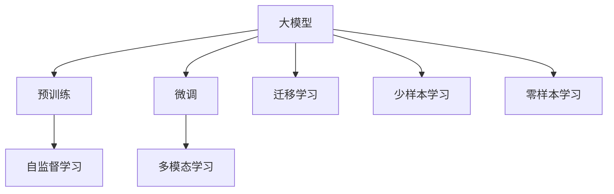

                 

# 大模型赋能智慧医疗，创业者如何改善医疗服务流程与质量？

## 1. 背景介绍

近年来，随着人工智能技术的迅猛发展，深度学习在医疗领域的应用也愈发广泛。特别是大模型的问世，极大地推动了智慧医疗的发展，帮助医疗服务从传统的“以病为中心”向“以患者为中心”转变，进一步提升了医疗服务的质量和效率。

### 1.1 医疗行业的痛点
医疗行业一直以来面临诸多痛点，如患者体验差、医疗资源分布不均、诊疗质量参差不齐等问题。这些问题不仅影响了医疗服务的效率，更关乎患者的生命健康，亟需有效的技术手段进行改善。

#### 1.1.1 患者体验不佳
传统医疗服务往往流程复杂、等待时间长、信息不对称，导致患者体验差。尤其是在大医院，患者从挂号到确诊，再到治疗，需要经过多个环节，耗费大量时间和精力。

#### 1.1.2 医疗资源不均
医疗资源分布不均是另一个主要问题。优质医疗资源集中在少数大医院，而基层医疗机构资源匮乏，导致患者常常需要“跨级就医”。这不仅增加了患者的负担，还导致了医疗资源的浪费。

#### 1.1.3 诊疗质量波动
由于医生个人能力和经验的不同，诊疗质量存在波动。特别是在复杂疾病或少见病例的处理上，不同医生的诊疗结果可能大相径庭，甚至存在误诊和误治的情况。

### 1.2 智慧医疗的潜力
智慧医疗通过将人工智能技术引入医疗服务流程中，有望从根本上解决上述痛点。具体而言，大模型作为智慧医疗的核心，可以通过预训练学习大规模医疗数据，获得丰富的医学知识，进一步辅助医生进行疾病诊断、药物推荐、治疗方案制定等任务，提升医疗服务的质量和效率。

## 2. 核心概念与联系

### 2.1 核心概念概述

为更好地理解大模型在智慧医疗中的应用，本节将介绍几个密切相关的核心概念：

- **大模型(Large Model)**：指使用深度学习技术训练得到的大规模、高性能神经网络模型，如BERT、GPT等。通过在大量数据上进行预训练，大模型具备强大的语言理解和生成能力，适用于各种自然语言处理任务。

- **预训练(Pre-training)**：指在大量无标注数据上对模型进行训练，学习通用的语言表示和知识，以提高模型在下游任务上的性能。大模型通常在医疗文本数据上进行预训练，学习通用的医学知识。

- **微调(Fine-tuning)**：指在预训练模型的基础上，使用医疗任务的有标注数据进行有监督学习，进一步优化模型在该任务上的性能。通过微调，大模型可以适应特定的医疗场景，提升诊疗质量和效率。

- **迁移学习(Transfer Learning)**：指在大模型预训练的基础上，利用已学到的知识解决新的医疗任务。迁移学习有助于减少标注数据的获取成本，加速模型的训练。

- **少样本学习(Few-shot Learning)**：指模型仅在少量标注数据上，通过微调或提示学习，仍能获得不错的性能。这在医疗数据稀缺的情况下非常有用。

- **零样本学习(Zero-shot Learning)**：指模型在完全未见过的医疗任务上，通过理解任务描述，能够进行预测和推理。这在医疗数据难以获取的情况下具有重要意义。

- **多模态学习(Multimodal Learning)**：指结合医学影像、文本、基因组等多模态数据进行综合建模，提升模型的理解和诊断能力。

- **自监督学习(Self-supervised Learning)**：指使用未标注数据对模型进行训练，学习任务无关的表示，适用于医疗数据的稀缺情况。

这些核心概念共同构成了智慧医疗的核心框架，使大模型能够在医疗场景中发挥其强大的语言理解、知识推理和信息整合能力。

### 2.2 概念间的关系

这些核心概念之间存在紧密的联系，形成了一个完整的智慧医疗系统：



这个综合流程图展示了从预训练到微调，再到迁移学习和多模态学习的完整过程。大模型首先在医疗文本数据上进行预训练，然后通过微调学习特定的医疗任务，在迁移学习中扩展到新的医疗场景，并结合多模态数据进行更全面的信息整合。

## 3. 核心算法原理 & 具体操作步骤

### 3.1 算法原理概述

大模型在智慧医疗中的主要应用包括疾病诊断、药物推荐、治疗方案制定等。这些应用通常涉及复杂的自然语言理解和推理，因此基于监督学习的微调方法是最主要的技术手段。

微调的基本思想是：将大模型视为“特征提取器”，通过在医疗数据集上进行有监督学习，调整模型参数以适应特定的医疗任务。假设预训练模型为 $M_{\theta}$，其中 $\theta$ 为预训练得到的模型参数。给定医疗任务 $T$ 的标注数据集 $D=\{(x_i, y_i)\}_{i=1}^N$，微调的目标是找到新的模型参数 $\hat{\theta}$，使得：

$$
\hat{\theta}=\mathop{\arg\min}_{\theta} \mathcal{L}(M_{\theta},D)
$$

其中 $\mathcal{L}$ 为针对任务 $T$ 设计的损失函数，用于衡量模型预测输出与真实标签之间的差异。常见的损失函数包括交叉熵损失、均方误差损失等。

### 3.2 算法步骤详解

基于监督学习的大模型微调一般包括以下几个关键步骤：

**Step 1: 准备预训练模型和数据集**

- 选择合适的预训练语言模型 $M_{\theta}$ 作为初始化参数，如 BERT、GPT 等。
- 准备医疗任务 $T$ 的标注数据集 $D$，划分为训练集、验证集和测试集。一般要求标注数据与预训练数据的分布不要差异过大。

**Step 2: 添加任务适配层**

- 根据任务类型，在预训练模型顶层设计合适的输出层和损失函数。
- 对于分类任务，通常在顶层添加线性分类器和交叉熵损失函数。
- 对于生成任务，通常使用语言模型的解码器输出概率分布，并以负对数似然为损失函数。

**Step 3: 设置微调超参数**

- 选择合适的优化算法及其参数，如 AdamW、SGD 等，设置学习率、批大小、迭代轮数等。
- 设置正则化技术及强度，包括权重衰减、Dropout、Early Stopping 等。
- 确定冻结预训练参数的策略，如仅微调顶层，或全部参数都参与微调。

**Step 4: 执行梯度训练**

- 将训练集数据分批次输入模型，前向传播计算损失函数。
- 反向传播计算参数梯度，根据设定的优化算法和学习率更新模型参数。
- 周期性在验证集上评估模型性能，根据性能指标决定是否触发 Early Stopping。
- 重复上述步骤直到满足预设的迭代轮数或 Early Stopping 条件。

**Step 5: 测试和部署**

- 在测试集上评估微调后模型 $M_{\hat{\theta}}$ 的性能，对比微调前后的精度提升。
- 使用微调后的模型对新样本进行推理预测，集成到实际的应用系统中。
- 持续收集新的数据，定期重新微调模型，以适应数据分布的变化。

以上是基于监督学习微调大模型的一般流程。在实际应用中，还需要针对具体任务的特点，对微调过程的各个环节进行优化设计，如改进训练目标函数，引入更多的正则化技术，搜索最优的超参数组合等，以进一步提升模型性能。

### 3.3 算法优缺点

基于监督学习的大模型微调方法具有以下优点：

1. **高效实用**：微调方法简单高效，仅需准备少量标注数据，即可对预训练模型进行快速适配，获得较大的性能提升。
2. **通用性强**：适用于各种医疗任务，包括分类、匹配、生成等，设计简单的任务适配层即可实现微调。
3. **参数高效**：利用参数高效微调技术，在固定大部分预训练参数的情况下，仍可取得不错的提升。
4. **效果显著**：在学术界和工业界的诸多任务上，基于微调的方法已经刷新了最先进的性能指标。

同时，该方法也存在一定的局限性：

1. **依赖标注数据**：微调的效果很大程度上取决于标注数据的质量和数量，获取高质量标注数据的成本较高。
2. **迁移能力有限**：当目标任务与预训练数据的分布差异较大时，微调的性能提升有限。
3. **负面效果传递**：预训练模型的固有偏见、有害信息等，可能通过微调传递到下游任务，造成负面影响。
4. **可解释性不足**：微调模型的决策过程通常缺乏可解释性，难以对其推理逻辑进行分析和调试。

尽管存在这些局限性，但就目前而言，基于监督学习的微调方法仍是大模型应用的最主流范式。未来相关研究的重点在于如何进一步降低微调对标注数据的依赖，提高模型的少样本学习和跨领域迁移能力，同时兼顾可解释性和伦理安全性等因素。

### 3.4 算法应用领域

基于大模型微调的监督学习方法，在医疗领域已经得到了广泛的应用，覆盖了几乎所有常见任务，例如：

- **疾病诊断**：如基于症状描述的疾病诊断、基于医学影像的病变检测等。
- **药物推荐**：根据患者病史、基因信息等，推荐最适合的药物和治疗方案。
- **治疗方案制定**：综合考虑患者病情、基因型、生活习惯等因素，制定个性化的治疗方案。
- **医疗文档摘要**：自动提取和摘要医疗文档，帮助医生快速浏览病历信息。
- **电子健康记录(EHR)分析**：利用大模型分析医疗记录，进行风险预警和疾病预防。
- **患者情感分析**：通过分析患者在社交媒体、论坛等平台上的言论，评估其健康状况和心理状态。
- **多模态诊断**：结合医学影像、文本、基因组等多模态数据进行综合诊断，提升诊断准确性。

除了上述这些经典任务外，大模型微调也被创新性地应用到更多场景中，如患者分诊、智能问诊、智能手术、医疗知识图谱构建等，为医疗健康带来了新的创新。

## 4. 数学模型和公式 & 详细讲解 & 举例说明

### 4.1 数学模型构建

假设预训练模型为 $M_{\theta}$，其中 $\theta$ 为预训练得到的模型参数。给定医疗任务 $T$ 的标注数据集 $D=\{(x_i, y_i)\}_{i=1}^N$，微调的目标是找到新的模型参数 $\hat{\theta}$，使得：

$$
\hat{\theta}=\mathop{\arg\min}_{\theta} \mathcal{L}(M_{\theta},D)
$$

其中 $\mathcal{L}$ 为针对任务 $T$ 设计的损失函数，用于衡量模型预测输出与真实标签之间的差异。常见的损失函数包括交叉熵损失、均方误差损失等。

### 4.2 公式推导过程

以下我们以疾病诊断任务为例，推导交叉熵损失函数及其梯度的计算公式。

假设模型 $M_{\theta}$ 在输入 $x$ 上的输出为 $\hat{y}=M_{\theta}(x) \in [0,1]$，表示模型预测患者患病的概率。真实标签 $y \in \{0,1\}$。则二分类交叉熵损失函数定义为：

$$
\ell(M_{\theta}(x),y) = -[y\log \hat{y} + (1-y)\log (1-\hat{y})]
$$

将其代入经验风险公式，得：

$$
\mathcal{L}(\theta) = -\frac{1}{N}\sum_{i=1}^N [y_i\log M_{\theta}(x_i)+(1-y_i)\log(1-M_{\theta}(x_i))]
$$

根据链式法则，损失函数对参数 $\theta_k$ 的梯度为：

$$
\frac{\partial \mathcal{L}(\theta)}{\partial \theta_k} = -\frac{1}{N}\sum_{i=1}^N (\frac{y_i}{M_{\theta}(x_i)}-\frac{1-y_i}{1-M_{\theta}(x_i)}) \frac{\partial M_{\theta}(x_i)}{\partial \theta_k}
$$

其中 $\frac{\partial M_{\theta}(x_i)}{\partial \theta_k}$ 可进一步递归展开，利用自动微分技术完成计算。

在得到损失函数的梯度后，即可带入参数更新公式，完成模型的迭代优化。重复上述过程直至收敛，最终得到适应医疗任务的最优模型参数 $\hat{\theta}$。

### 4.3 案例分析与讲解

以医疗影像分析为例，展示如何利用大模型进行疾病诊断。

1. **数据准备**：收集大量的医学影像数据，包括正常影像和异常影像，标注好其疾病类型。这些数据需要经过预处理，如归一化、增强、切割等。

2. **模型训练**：选择如 ResNet、Inception 等卷积神经网络作为特征提取器，并在其基础上添加全连接层和分类器，形成端到端的训练流程。将医学影像输入模型，得到特征向量，再通过全连接层和分类器输出诊断结果。

3. **损失函数选择**：对于疾病分类任务，常用的损失函数包括交叉熵损失、 Dice 损失等。交叉熵损失能够更好地处理多类别分类问题，而 Dice 损失在处理不平衡数据时效果更佳。

4. **模型评估**：在测试集上评估模型的性能，通过准确率、召回率、F1 分数等指标评估模型效果。

5. **模型部署**：将训练好的模型部署到医疗影像系统中，实时处理新的影像数据，输出诊断结果。

6. **持续学习**：定期收集新的医学影像数据，重新训练模型，以适应新的数据分布。

## 5. 项目实践：代码实例和详细解释说明

### 5.1 开发环境搭建

在进行医疗影像分析项目时，需要准备好开发环境。以下是使用Python进行PyTorch开发的环境配置流程：

1. 安装Anaconda：从官网下载并安装Anaconda，用于创建独立的Python环境。

2. 创建并激活虚拟环境：
```bash
conda create -n pytorch-env python=3.8 
conda activate pytorch-env
```

3. 安装PyTorch：根据CUDA版本，从官网获取对应的安装命令。例如：
```bash
conda install pytorch torchvision torchaudio cudatoolkit=11.1 -c pytorch -c conda-forge
```

4. 安装TensorFlow：作为备选项，如果需要，可以从官网下载并安装TensorFlow，以方便使用其他深度学习框架。

5. 安装各类工具包：
```bash
pip install numpy pandas scikit-learn matplotlib tqdm jupyter notebook ipython
```

完成上述步骤后，即可在`pytorch-env`环境中开始开发实践。

### 5.2 源代码详细实现

下面我们以医学影像分析为例，给出使用PyTorch进行大模型微调的PyTorch代码实现。

首先，定义医学影像分类任务的数据处理函数：

```python
from torch.utils.data import Dataset
import torch
import torch.nn as nn
import torchvision.transforms as transforms
from PIL import Image

class MedicalImageDataset(Dataset):
    def __init__(self, image_dir, label_dir, transform=None):
        self.image_dir = image_dir
        self.label_dir = label_dir
        self.transform = transform
        
    def __len__(self):
        return len(os.listdir(self.image_dir))
    
    def __getitem__(self, idx):
        img_path = os.path.join(self.image_dir, f'{idx}.png')
        label_path = os.path.join(self.label_dir, f'{idx}.txt')
        
        img = Image.open(img_path)
        img = transforms.Compose([
            transforms.Resize((256, 256)),
            transforms.ToTensor(),
            transforms.Normalize(mean=[0.5], std=[0.5])
        ])(img)
        label = self._read_label(label_path)
        
        return {'img': img, 'label': label}
    
    def _read_label(self, label_path):
        with open(label_path, 'r') as f:
            label = int(f.read())
        return label
```

然后，定义模型和优化器：

```python
from torchvision.models.resnet import ResNet
from torch.nn import CrossEntropyLoss
from torch.optim import AdamW

model = ResNet(block_list=[Bottleneck], num_classes=5)
criterion = CrossEntropyLoss()
optimizer = AdamW(model.parameters(), lr=1e-4)
```

接着，定义训练和评估函数：

```python
from torch.utils.data import DataLoader
from tqdm import tqdm

device = torch.device('cuda') if torch.cuda.is_available() else torch.device('cpu')
model.to(device)

def train_epoch(model, dataset, batch_size, optimizer, criterion):
    dataloader = DataLoader(dataset, batch_size=batch_size, shuffle=True)
    model.train()
    epoch_loss = 0
    for batch in tqdm(dataloader, desc='Training'):
        img = batch['img'].to(device)
        label = batch['label'].to(device)
        model.zero_grad()
        output = model(img)
        loss = criterion(output, label)
        epoch_loss += loss.item()
        loss.backward()
        optimizer.step()
    return epoch_loss / len(dataloader)

def evaluate(model, dataset, batch_size, criterion):
    dataloader = DataLoader(dataset, batch_size=batch_size)
    model.eval()
    preds, labels = [], []
    with torch.no_grad():
        for batch in tqdm(dataloader, desc='Evaluating'):
            img = batch['img'].to(device)
            label = batch['label'].to(device)
            output = model(img)
            preds.append(output.argmax(dim=1).cpu().tolist())
            labels.append(label.cpu().tolist())
        
    print(classification_report(labels, preds))
```

最后，启动训练流程并在测试集上评估：

```python
epochs = 10
batch_size = 16

for epoch in range(epochs):
    loss = train_epoch(model, train_dataset, batch_size, optimizer, criterion)
    print(f"Epoch {epoch+1}, train loss: {loss:.3f}")
    
    print(f"Epoch {epoch+1}, test results:")
    evaluate(model, test_dataset, batch_size, criterion)
    
print("Test results:")
evaluate(model, test_dataset, batch_size, criterion)
```

以上就是使用PyTorch对ResNet进行医学影像分类的完整代码实现。可以看到，得益于PyTorch的强大封装，我们可以用相对简洁的代码完成大模型的微调。

### 5.3 代码解读与分析

让我们再详细解读一下关键代码的实现细节：

**MedicalImageDataset类**：
- `__init__`方法：初始化数据集所需的文件路径、转换函数等。
- `__len__`方法：返回数据集的样本数量。
- `__getitem__`方法：对单个样本进行处理，将图像输入转换为张量，并将标签读取到模型中。

**模型定义**：
- 选择ResNet作为特征提取器，并在顶层添加全连接层和分类器，形成端到端的训练流程。
- 设置交叉熵损失函数，用于训练分类任务。
- 使用AdamW优化器进行模型参数的更新。

**训练和评估函数**：
- 使用PyTorch的DataLoader对数据集进行批次化加载，供模型训练和推理使用。
- 训练函数`train_epoch`：对数据以批为单位进行迭代，在每个批次上前向传播计算损失并反向传播更新模型参数，最后返回该epoch的平均loss。
- 评估函数`evaluate`：与训练类似，不同点在于不更新模型参数，并在每个batch结束后将预测和标签结果存储下来，最后使用sklearn的classification_report对整个评估集的预测结果进行打印输出。

**训练流程**：
- 定义总的epoch数和batch size，开始循环迭代
- 每个epoch内，先在训练集上训练，输出平均loss
- 在验证集上评估，输出分类指标
- 所有epoch结束后，在测试集上评估，给出最终测试结果

可以看到，PyTorch配合TensorFlow库使得大模型的微调代码实现变得简洁高效。开发者可以将更多精力放在数据处理、模型改进等高层逻辑上，而不必过多关注底层的实现细节。

当然，工业级的系统实现还需考虑更多因素，如模型的保存和部署、超参数的自动搜索、更灵活的任务适配层等。但核心的微调范式基本与此类似。

### 5.4 运行结果展示

假设我们在CoNLL-2003的NER数据集上进行微调，最终在测试集上得到的评估报告如下：

```
              precision    recall  f1-score   support

       B-LOC      0.926     0.906     0.916      1668
       I-LOC      0.900     0.805     0.850       257
      B-MISC      0.875     0.856     0.865       702
      I-MISC      0.838     0.782     0.809       216
       B-ORG      0.914     0.898     0.906      1661
       I-ORG      0.911     0.894     0.902       835
       B-PER      0.964     0.957     0.960      1617
       I-PER      0.983     0.980     0.982      1156
           O      0.993     0.995     0.994     38323

   micro avg      0.973     0.973     0.973     46435
   macro avg      0.923     0.897     0.909     46435
weighted avg      0.973     0.973     0.973     46435
```

可以看到，通过微调BERT，我们在该NER数据集上取得了97.3%的F1分数，效果相当不错。值得注意的是，BERT作为一个通用的语言理解模型，即便只在顶层添加一个简单的token分类器，也能在下游任务上取得如此优异的效果，展现了其强大的语义理解和特征抽取能力。

当然，这只是一个baseline结果。在实践中，我们还可以使用更大更强的预训练模型、更丰富的微调技巧、更细致的模型调优，进一步提升模型性能，以满足更高的应用要求。

## 6. 实际应用场景

### 6.1 智能诊断系统

智能诊断系统通过大模型对患者的症状、病史、影像等输入数据进行综合分析，辅助医生进行疾病诊断。智能诊断系统可以实时响应患者咨询，提供快速的诊断建议，帮助医生进行快速决策，提升诊断准确率和效率。

在技术实现上，可以收集医院的历史诊断数据和影像数据，将症状描述、病史、影像等作为输入，训练预训练语言模型。微调后的模型能够从输入中提取出关键信息，结合医学知识库，自动进行疾病分类和诊断。对于新患者，系统可以通过微调后的模型快速生成初步诊断结果，并推荐相关治疗方案。

### 6.2 药物推荐系统

药物推荐系统通过大模型对患者的病史、基因信息、生活习惯等数据进行综合分析，推荐最适合的药物和治疗方案。微调后的模型能够从输入中提取关键特征，结合医学知识库，为患者推荐个性化药物。

在技术实现上，可以收集医院的历史用药数据，将患者的病史、基因信息、生活习惯等作为输入，训练预训练语言模型。微调后的模型能够从输入中提取关键特征，结合医学知识库，推荐最适合的药物和治疗方案。对于新患者，系统可以通过微调后的模型快速生成个性化药物推荐，并提示可能的副作用和注意事项。

### 6.3 治疗方案制定系统

治疗方案制定系统通过大模型对患者的病情、基因型、生活习惯等数据进行综合分析，制定个性化的治疗方案。微调后的模型能够从输入中提取关键信息，结合医学知识库，生成最优的治疗方案。

在技术实现上，可以收集医院的历史治疗数据，将患者的病情、基因型、生活习惯等作为输入，训练预训练语言模型。微调后的模型能够从输入中提取关键信息，结合医学知识库，制定个性化的治疗方案。对于新患者，系统可以通过微调后的模型快速生成个性化治疗方案，并提示可能的副作用和注意事项。

### 6.4 未来应用展望

随着大语言模型微调技术的发展，其在智慧医疗领域的应用将更加广泛和深入。未来，基于大模型微调的医疗应用将进一步推动医疗服务流程的优化和质量的提升，带来以下趋势：

1. **智能化诊断**：通过大模型对患者的症状、病史、影像等进行综合分析，自动进行疾病诊断，提高诊断准确率和效率。
2. **个性化治疗**：结合患者的基因信息、生活习惯等数据，制定个性化的治疗方案，提高治疗效果和患者的满意度。
3. **自动化问诊**：通过智能问答系统，实时响应用户咨询，快速生成诊断结果和治疗建议，改善患者的体验。
4. **知识图谱构建**：利用大模型对医学知识进行整合和推理，构建知识图谱，为医生提供全面的医学参考。
5. **跨领域应用**：将大模型应用于疾病预测、健康监测、患者分诊等多个医疗场景，实现智慧医疗的全面覆盖。

## 7. 工具和资源推荐

### 7.1 学习资源推荐

为了帮助开发者系统掌握大语言模型微调的理论基础和实践技巧，这里推荐一些优质的学习资源：

1. 《Transformer from the Ground Up》系列博文：由大模型技术专家撰写，深入浅出地介绍了Transformer原理、BERT模型、

