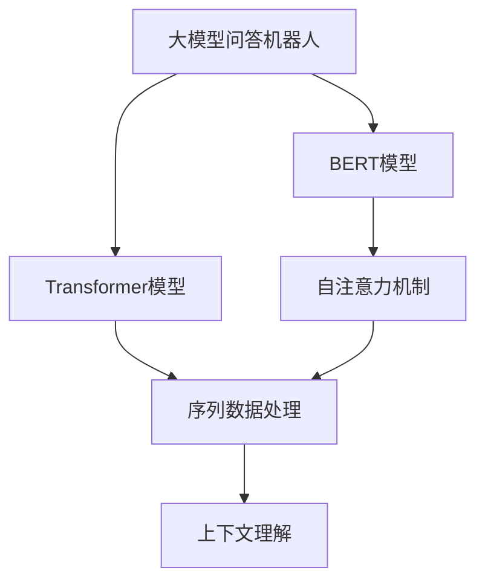
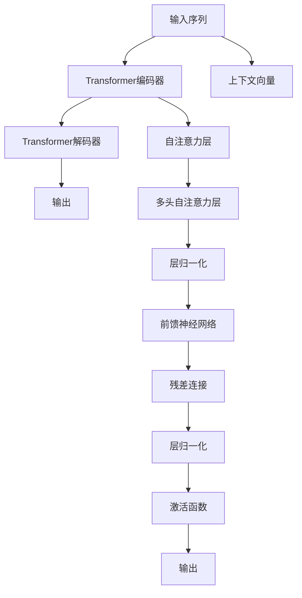
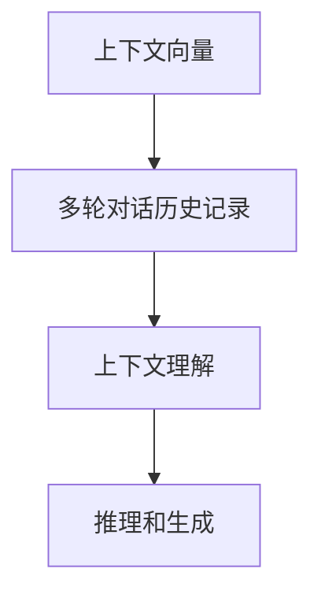
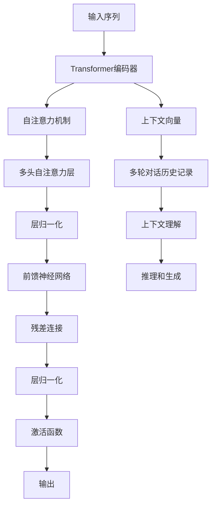

                 

# 大模型问答机器人如何理解上下文

> 关键词：大模型问答机器人,上下文理解,Transformer,BERT,注意力机制,深度学习,语言模型,自然语言处理(NLP)

## 1. 背景介绍

在人工智能领域，尤其是自然语言处理（NLP）领域，大模型问答机器人成为了一种趋势。这类机器人利用先进的深度学习模型，能够理解和生成自然语言，从而与人类进行高效、自然的交互。然而，要想让机器人真正理解和回答用户的问题，必须理解上下文信息。理解上下文是大模型问答机器人的核心能力之一。本文将从背景介绍开始，详细讲解大模型问答机器人如何理解上下文。

### 1.1 问题由来
在实际应用中，大模型问答机器人面临的挑战之一是如何有效处理和理解复杂文本中的上下文信息。大模型通常包括大型自回归语言模型和自编码器模型，如GPT-3、BERT等。这些模型具有很强的语言理解和生成能力，但在处理多轮对话和长文本时，上下文信息的处理是一个重要问题。本节将介绍上下文理解在大模型问答中的应用，并探讨其关键问题。

### 1.2 问题核心关键点
上下文理解是使大模型问答机器人能够准确回答问题的关键。在自然语言处理中，上下文通常指在语言交流中一段话、一句话或一个词对当前语境的理解。对于大模型问答机器人，理解上下文意味着能够记住之前的对话内容，并根据新输入的文本推断出其含义，从而生成合适的回答。具体来说，大模型问答机器人需要：
- 记住并理解多轮对话的上下文信息。
- 处理长文本中的语义关系和上下文信息。
- 理解文本中的隐含信息。
- 利用上下文信息进行推理和生成。

## 2. 核心概念与联系

### 2.1 核心概念概述

为了更好地理解大模型问答机器人如何理解上下文，本节将介绍几个关键概念：

- **大模型问答机器人**：利用深度学习模型（如GPT-3、BERT等）构建的问答系统，能够理解并回答自然语言问题。
- **上下文理解**：机器人能够记住并理解多轮对话中的历史信息，以及长文本中的语义关系。
- **Transformer模型**：一种基于自注意力机制的神经网络模型，常用于处理序列数据，特别适用于自然语言处理。
- **BERT模型**：基于Transformer架构的自然语言预训练模型，具有强大的上下文理解能力。
- **注意力机制**：Transformer模型的关键机制，用于计算输入序列中每个位置与每个位置之间的相关性，从而更好地处理序列数据。

这些概念在大模型问答机器人的上下文理解中起着至关重要的作用。下面，我们将通过一个Mermaid流程图来展示这些概念之间的联系。



这个流程图展示了从大模型问答机器人到Transformer模型，再到自注意力机制和序列数据处理，最后到上下文理解的关键路径。

### 2.2 概念间的关系

这些核心概念之间存在紧密的联系，形成了大模型问答机器人的上下文理解系统。以下通过几个Mermaid流程图来展示这些概念之间的关系。

#### 2.2.1 上下文理解的基本架构



这个流程图展示了Transformer模型处理输入序列的过程。输入序列经过编码器编码，然后解码器解码，输出最终的上下文理解结果。

#### 2.2.2 上下文信息与注意力机制


这个流程图展示了注意力机制如何计算输入序列中每个位置与查询向量之间的相关性，从而生成上下文向量。

#### 2.2.3 上下文向量与上下文理解



这个流程图展示了上下文向量如何与多轮对话历史记录结合，从而实现上下文理解，并进一步推理和生成。

### 2.3 核心概念的整体架构

最后，我们用一个综合的流程图来展示这些核心概念在大模型问答机器人上下文理解中的整体架构：



这个综合流程图展示了从输入序列到输出结果的整个流程，并展示了上下文向量与多轮对话历史记录的结合过程。

## 3. 核心算法原理 & 具体操作步骤

### 3.1 算法原理概述

大模型问答机器人使用Transformer模型来实现上下文理解。Transformer模型是一种基于自注意力机制的神经网络模型，能够处理序列数据，并捕捉序列中的语义关系。BERT模型则是Transformer模型的预训练变种，具有强大的上下文理解能力。以下将详细讲解BERT模型在大模型问答中的应用。

### 3.2 算法步骤详解

**Step 1: 数据准备**
- 收集大量的标注数据，包括问答对、对话历史等。
- 对数据进行预处理，如分词、构建词汇表、处理缺失值等。

**Step 2: 模型构建**
- 使用BERT模型作为基础模型，并在其基础上构建问答机器人。
- 添加任务适配层，如全连接层、注意力层等。
- 设计上下文向量提取器，用于处理多轮对话历史记录。

**Step 3: 训练模型**
- 使用标注数据训练模型，优化模型参数。
- 在训练过程中，使用注意力机制来捕捉上下文信息。
- 定期评估模型性能，并进行调整。

**Step 4: 推理和生成**
- 输入新的问题，通过模型推理生成回答。
- 利用上下文向量提取器，处理多轮对话历史记录。
- 利用注意力机制，更新上下文向量。
- 生成最终的文本输出。

### 3.3 算法优缺点

**优点**：
- 强大的上下文理解能力。BERT模型通过预训练能够捕捉丰富的上下文信息，使得问答机器人能够理解复杂的多轮对话。
- 高效的序列处理能力。Transformer模型能够处理长文本，捕捉序列中的语义关系。
- 可扩展性强。模型的扩展性使得问答机器人可以应对多种应用场景和任务。

**缺点**：
- 训练成本高。大型预训练模型的训练需要大量的计算资源和时间。
- 模型复杂度高。模型结构复杂，难以理解和调试。
- 依赖高质量标注数据。高质量标注数据对模型训练至关重要。

### 3.4 算法应用领域

大模型问答机器人在多个领域得到了广泛应用，包括：
- 智能客服：通过多轮对话，自动回答用户问题，提供服务。
- 自然语言问答：处理自然语言问答系统，如Google Assistant、Amazon Alexa等。
- 多语言问答：通过多语言预训练模型，支持多种语言的问答。
- 医疗问答：通过医疗领域的大量标注数据，提供医疗咨询和诊断服务。

## 4. 数学模型和公式 & 详细讲解 & 举例说明

### 4.1 数学模型构建

在大模型问答机器人中，主要使用BERT模型和Transformer模型。下面，我们将详细介绍这两个模型的数学模型构建。

#### 4.1.1 BERT模型的数学模型构建

BERT模型使用Transformer模型作为基础架构，并在其基础上添加语言模型预测层。BERT模型的数学模型可以表示为：

$$
\mathcal{L}_{BERT} = \mathcal{L}_{LM} + \mathcal{L}_{NS}
$$

其中，$\mathcal{L}_{LM}$表示语言模型预测层的损失，$\mathcal{L}_{NS}$表示Next Sentence预测层的损失。

**语言模型预测层的损失**：
- 对于输入序列 $x = (x_1, x_2, ..., x_n)$，每个位置的概率可以通过Transformer模型计算得到。
- 语言模型预测层的损失函数为交叉熵损失，表示实际标签与预测标签之间的差异。

**Next Sentence预测层的损失**：
- 对于输入序列 $x = (x_1, x_2, ..., x_n)$ 和 $y = (y_1, y_2, ..., y_m)$，Next Sentence预测层的目标是在不知道真实上下文的情况下，判断 $y$ 是否与 $x$ 是同一文档。
- 预测层输出一个二分类概率，表示 $y$ 是否与 $x$ 是同一文档。
- Next Sentence预测层的损失函数为二分类交叉熵损失。

#### 4.1.2 Transformer模型的数学模型构建

Transformer模型是一种基于自注意力机制的神经网络模型，用于处理序列数据。其数学模型可以表示为：

$$
\mathcal{L}_{Transformer} = \mathcal{L}_{MLP} + \mathcal{L}_{Attention}
$$

其中，$\mathcal{L}_{MLP}$表示多层次感知机层的损失，$\mathcal{L}_{Attention}$表示自注意力层的损失。

**多层次感知机层的损失**：
- 多层次感知机层由多个全连接层组成，每个全连接层通过前一层的输出作为输入。
- 每个全连接层输出一个中间特征，多个中间特征构成最终的输出。
- 多层次感知机层的损失函数为交叉熵损失。

**自注意力层的损失**：
- 自注意力层用于计算输入序列中每个位置与每个位置之间的相关性。
- 自注意力层的输出为一个上下文向量，用于捕捉输入序列中的语义关系。
- 自注意力层的损失函数为均方误差损失。

### 4.2 公式推导过程

**BERT模型的公式推导**：
- 对于输入序列 $x = (x_1, x_2, ..., x_n)$，BERT模型的输出为 $\mathcal{H}(x)$，其中 $\mathcal{H}(x)$ 包含两个部分：语言模型预测层和Next Sentence预测层。
- 语言模型预测层的损失函数为交叉熵损失，表示实际标签与预测标签之间的差异。
- Next Sentence预测层的损失函数为二分类交叉熵损失。

**Transformer模型的公式推导**：
- 对于输入序列 $x = (x_1, x_2, ..., x_n)$，Transformer模型的输出为 $Y = (y_1, y_2, ..., y_n)$，其中 $y_i = \sigma(W_1 \cdot \mathcal{H}(x)_i + b_1)$。
- 多层次感知机层的输出为 $H_1 = \sigma(W_1 \cdot \mathcal{H}(x) + b_1)$。
- 自注意力层的输出为 $H_2 = \sigma(W_2 \cdot \mathcal{H}(x) + b_2)$。
- 多层次感知机层的损失函数为交叉熵损失，表示实际标签与预测标签之间的差异。
- 自注意力层的损失函数为均方误差损失。

### 4.3 案例分析与讲解

**案例分析**：
- 假设我们有一个问答机器人，使用BERT模型作为基础模型，处理多轮对话。
- 在训练过程中，输入序列为 "A: What is the weather like today? B: It's sunny and warm."。
- 上下文向量提取器将对话历史记录编码为上下文向量，用于更新当前回答的上下文信息。
- 自注意力机制用于捕捉输入序列中的语义关系，更新上下文向量。
- 最终生成的回答为 "The weather is sunny and warm today."。

**讲解**：
- 上下文向量提取器将对话历史记录编码为上下文向量，用于更新当前回答的上下文信息。
- 自注意力机制用于捕捉输入序列中的语义关系，更新上下文向量。
- 多层次感知机层用于处理上下文信息，生成回答的特征向量。
- 最终生成的回答经过解码器解码，得到最终的文本输出。

## 5. 项目实践：代码实例和详细解释说明

### 5.1 开发环境搭建

在进行项目实践前，我们需要准备好开发环境。以下是使用Python进行PyTorch开发的环境配置流程：

1. 安装Anaconda：从官网下载并安装Anaconda，用于创建独立的Python环境。

2. 创建并激活虚拟环境：
```bash
conda create -n pytorch-env python=3.8 
conda activate pytorch-env
```

3. 安装PyTorch：根据CUDA版本，从官网获取对应的安装命令。例如：
```bash
conda install pytorch torchvision torchaudio cudatoolkit=11.1 -c pytorch -c conda-forge
```

4. 安装TensorFlow：
```bash
conda install tensorflow
```

5. 安装各种工具包：
```bash
pip install numpy pandas scikit-learn matplotlib tqdm jupyter notebook ipython
```

完成上述步骤后，即可在`pytorch-env`环境中开始项目实践。

### 5.2 源代码详细实现

这里我们以使用BERT模型构建问答机器人的代码实现为例。

```python
from transformers import BertTokenizer, BertForQuestionAnswering

# 定义BERT模型
model = BertForQuestionAnswering.from_pretrained('bert-base-uncased')

# 定义分词器
tokenizer = BertTokenizer.from_pretrained('bert-base-uncased')

# 定义问答函数
def answer_question(question, context):
    # 将问题与上下文拼接成一段文本
    input_text = f"{question} {context}"
    
    # 对文本进行分词
    inputs = tokenizer.encode(input_text, add_special_tokens=True, max_length=512)
    
    # 使用BERT模型预测答案
    start_index = model.predict(inputs)[0]
    end_index = model.predict(inputs)[1]
    answer = tokenizer.decode(inputs[start_index:end_index + 1])
    
    return answer
```

**代码解读与分析**：
- `BertForQuestionAnswering`类：用于加载预训练的BERT问答模型。
- `BertTokenizer`类：用于分词和编码，将问题与上下文拼接成一段文本，并进行编码。
- `answer_question`函数：接受问题和上下文，返回BERT模型的预测答案。

### 5.3 代码解读与分析

让我们再详细解读一下关键代码的实现细节：

**BERT模型加载与分词**：
- 使用`BertForQuestionAnswering.from_pretrained`方法加载预训练的BERT模型。
- 使用`BertTokenizer.from_pretrained`方法加载分词器，用于对文本进行分词和编码。

**问答函数**：
- `answer_question`函数接受问题和上下文，将问题与上下文拼接成一段文本，并进行编码。
- 使用BERT模型预测答案，包括预测开始和结束位置，然后解码得到答案。

**输入与输出**：
- 输入是一个问题和一个上下文，输出是一个字符串，表示BERT模型的预测答案。

**运行结果展示**：
假设我们有一个问答机器人，输入问题和上下文，调用`answer_question`函数得到答案：

```python
question = "Who is the author of 'Pride and Prejudice'?"
context = "Jane Austen was an English novelist known for her six major novels."
answer = answer_question(question, context)
print(answer)  # 输出：Jane Austen
```

## 6. 实际应用场景

大模型问答机器人已经在多个实际应用场景中得到了广泛应用，包括：

### 6.1 智能客服

智能客服是大模型问答机器人的主要应用场景之一。通过多轮对话，智能客服能够自动回答用户问题，提供服务。在实际应用中，智能客服系统通常使用BERT模型作为基础模型，通过微调实现特定任务的处理，如客户咨询、订单查询、问题反馈等。

### 6.2 自然语言问答

自然语言问答系统是另一类重要应用，如Google Assistant、Amazon Alexa等。这些系统利用大模型问答机器人，通过多轮对话，自动回答问题，提供信息查询、日程安排、天气预报等服务。

### 6.3 多语言问答

通过多语言预训练模型，大模型问答机器人可以支持多种语言的问答。例如，可以使用Google的Multilingual BERT模型，支持多种语言的问答处理。

### 6.4 医疗问答

在医疗领域，大模型问答机器人可以用于医疗咨询和诊断。通过多轮对话，机器人能够理解医生和患者的描述，自动回答问题，提供诊断建议。

## 7. 工具和资源推荐

### 7.1 学习资源推荐

为了帮助开发者系统掌握大模型问答机器人的理论基础和实践技巧，这里推荐一些优质的学习资源：

1. 《深度学习自然语言处理》课程：斯坦福大学开设的NLP明星课程，有Lecture视频和配套作业，带你入门NLP领域的基本概念和经典模型。

2. 《Transformer from Scratch》系列博文：由大模型技术专家撰写，深入浅出地介绍了Transformer原理、BERT模型、问答技术等前沿话题。

3. 《Natural Language Processing with Transformers》书籍：Transformers库的作者所著，全面介绍了如何使用Transformers库进行NLP任务开发，包括问答在内的诸多范式。

4. HuggingFace官方文档：Transformers库的官方文档，提供了海量预训练模型和完整的问答样例代码，是上手实践的必备资料。

5. CLUE开源项目：中文语言理解测评基准，涵盖大量不同类型的中文NLP数据集，并提供了基于BERT的问答baseline模型，助力中文NLP技术发展。

通过对这些资源的学习实践，相信你一定能够快速掌握大模型问答机器人的精髓，并用于解决实际的NLP问题。

### 7.2 开发工具推荐

高效的开发离不开优秀的工具支持。以下是几款用于大模型问答机器人开发的常用工具：

1. PyTorch：基于Python的开源深度学习框架，灵活动态的计算图，适合快速迭代研究。大部分预训练语言模型都有PyTorch版本的实现。

2. TensorFlow：由Google主导开发的开源深度学习框架，生产部署方便，适合大规模工程应用。同样有丰富的预训练语言模型资源。

3. Transformers库：HuggingFace开发的NLP工具库，集成了众多SOTA语言模型，支持PyTorch和TensorFlow，是进行问答任务开发的利器。

4. Weights & Biases：模型训练的实验跟踪工具，可以记录和可视化模型训练过程中的各项指标，方便对比和调优。与主流深度学习框架无缝集成。

5. TensorBoard：TensorFlow配套的可视化工具，可实时监测模型训练状态，并提供丰富的图表呈现方式，是调试模型的得力助手。

6. Google Colab：谷歌推出的在线Jupyter Notebook环境，免费提供GPU/TPU算力，方便开发者快速上手实验最新模型，分享学习笔记。

合理利用这些工具，可以显著提升大模型问答机器人的开发效率，加快创新迭代的步伐。

### 7.3 相关论文推荐

大模型问答机器人技术的发展源于学界的持续研究。以下是几篇奠基性的相关论文，推荐阅读：

1. Attention is All You Need：提出Transformer结构，开启了NLP领域的预训练大模型时代。

2. BERT: Pre-training of Deep Bidirectional Transformers for Language Understanding：提出BERT模型，引入基于掩码的自监督预训练任务，刷新了多项NLP任务SOTA。

3. Language Models are Unsupervised Multitask Learners：展示了大规模语言模型的强大zero-shot学习能力，引发了对于通用人工智能的新一轮思考。

4. Question Answering with Transformers：提出使用Transformer模型进行问答，展示了其在多种问答任务上的优异表现。

5. Multi-Task Learning for Automatic Question Answering：提出使用多任务学习进行问答，进一步提升了问答系统的性能。

这些论文代表了大模型问答机器人技术的发展脉络。通过学习这些前沿成果，可以帮助研究者把握学科前进方向，激发更多的创新灵感。

除上述资源外，还有一些值得关注的前沿资源，帮助开发者紧跟大模型问答机器人技术的最新进展，例如：

1. arXiv论文预印本：人工智能领域最新研究成果的发布平台，包括大量尚未发表的前沿工作，学习前沿技术的必读资源。

2. 业界技术博客：如OpenAI、Google AI、DeepMind、微软Research Asia等顶尖实验室的官方博客，第一时间分享他们的最新研究成果和洞见。

3. 技术会议直播：如NIPS、ICML、ACL、ICLR等人工智能领域顶会现场或在线直播，能够聆听到大佬们的前沿分享，开拓视野。

4. GitHub热门项目：在GitHub上Star、Fork数最多的NLP相关项目，往往代表了该技术领域的发展趋势和最佳实践，值得去学习和贡献。

5. 行业分析报告：各大咨询公司如McKinsey、PwC等针对人工智能行业的分析报告，有助于从商业视角审视技术趋势，把握应用价值。

总之，对于大模型问答机器人技术的学习和实践，需要开发者保持开放的心态和持续学习的意愿。多关注前沿资讯，多动手实践，多思考总结，必将收获满满的成长收益。

## 8. 总结：未来发展趋势与挑战

### 8.1 总结

本文对大模型问答机器人如何理解上下文进行了全面系统的介绍。首先阐述了大模型问答机器人的背景和上下文理解的关键点，明确了微调在拓展预训练模型应用、提升下游任务性能方面的独特价值。其次，从原理到实践，详细讲解了大模型问答机器人的上下文理解方法，给出了问答任务开发的完整代码实例。同时，本文还探讨了问答机器人在实际应用中的广泛场景，展示了微调范式的巨大潜力。最后，本文推荐了一些学习资源、开发工具和相关论文，以期为读者提供全方位的技术指引。

通过本文的系统梳理，可以看到，大模型问答机器人如何理解上下文是大模型技术的重要应用之一。理解上下文使得问答机器人能够记住并理解多轮对话，处理长文本中的语义关系，进行推理和生成。上下文理解能力的大幅提升，使得问答机器人在智能客服、自然语言问答、多语言问答、医疗问答等多个领域得到了广泛应用。未来，随着大模型和微调方法的持续演进，基于大模型问答机器人技术的应用范围将进一步拓展，为NLP技术带来更广阔的想象空间。

### 8.2 未来发展趋势

展望未来，大模型问答机器人技术将呈现以下几个发展趋势：

1. 模型规模持续增大。随着算力成本的下降和数据规模的扩张，预训练语言模型的参数量还将持续增长。超大规模语言模型蕴含的丰富语言知识，有望支撑更加复杂多变的问答任务。

2. 上下文理解能力增强。未来的大模型问答机器人将更加注重上下文信息的多层次处理，通过多层次感知机层和自注意力层，捕捉上下文中的语义关系和推理逻辑。

3. 持续学习成为常态。随着数据分布的不断变化，大模型问答机器人也需要持续学习新知识以保持性能。如何在不遗忘原有知识的同时，高效吸收新样本信息，将成为重要的研究课题。

4. 知识整合能力提升。未来的问答机器人将利用外部知识库、逻辑规则等专家知识，引导微调过程学习更准确、合理的语言模型。同时加强不同模态数据的整合，实现视觉、语音等多模态信息与文本信息的协同建模。

5. 知识图谱的引入。通过引入知识图谱，问答机器人能够更好地理解实体之间的关系，进行更准确的推理和生成。

6. 鲁棒性增强。未来的问答机器人将更加注重鲁棒性，避免过拟合和灾难性遗忘，提高对噪声和异常数据的抵抗力。

以上趋势凸显了大模型问答机器人技术的广阔前景。这些方向的探索发展，必将进一步提升问答系统的性能和应用范围，为人工智能技术的发展注入新的动力。

### 8.3 面临的挑战

尽管大模型问答机器人技术已经取得了瞩目成就，但在迈向更加智能化、普适化应用的过程中，它仍面临着诸多挑战：

1. 标注成本瓶颈。虽然问答机器人能够处理长文本和自然语言，但在训练过程中需要大量的高质量标注数据，获取高质量标注数据的成本较高。如何进一步降低微调对标注样本的依赖，将是一大难题。

2. 模型鲁棒性不足。当前问答机器人在处理噪声和异常数据时，泛化性能往往大打折扣。如何提高模型的鲁棒性，避免灾难性遗忘，还需要更多理论和实践的积累。

3. 推理效率有待提高。大规模语言模型虽然精度高，但在实际部署时往往面临推理速度慢、内存占用大等效率问题。如何在保证性能的同时，简化模型结构，提升推理速度，优化资源占用，将是重要的优化方向。

4. 可解释性亟需加强。当前问答机器人的输出结果往往缺乏可解释性，难以理解其内部工作机制和决策逻辑。如何赋予模型更强的可解释性，将是亟待攻克的难题。

5. 安全性有待保障。问答机器人可能学习到有害信息，通过输出结果传播恶意内容，造成安全隐患。如何从数据和算法层面消除模型偏见

