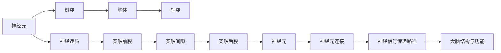
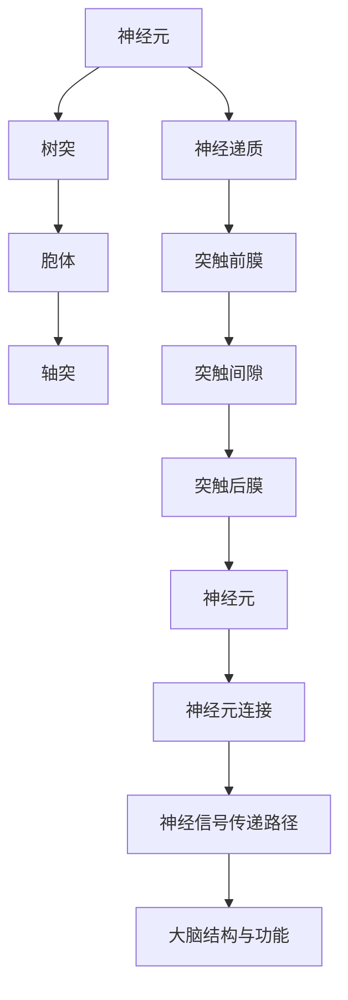

                 

## 1. 背景介绍

### 1.1 问题由来
在大脑中，神经元是信息处理的基本单位，而神经元之间传递信号的过程中，有机化合物扮演了至关重要的角色。本节将详细介绍大脑中重要的有机化合物，包括神经递质、蛋白质等，并探讨它们如何促进神经元的连接与信号传递，从而实现复杂的认知功能。

### 1.2 问题核心关键点
- **神经递质**：神经元之间传递信号的关键物质，主要包括乙酰胆碱、多巴胺、血清素等。
- **蛋白质**：构成神经元的重要组成部分，如细胞膜蛋白、突触蛋白等。
- **突触传递**：神经元之间通过突触进行信号传递的机制，包括突触前膜释放神经递质、突触间隙传输、突触后膜接收信号等步骤。
- **神经元连接**：神经元之间的连接方式，包括树突-轴突接触、轴突-树突接触、轴突-细胞体接触等。
- **神经信号传递路径**：神经信号从感觉输入到大脑皮层进行处理的路径，涉及多个层级和区域。
- **大脑结构与功能**：大脑的结构（如皮质、小脑、脑干等）与其功能（如感知、运动、情绪等）的关系。

### 1.3 问题研究意义
- **认知功能的理解**：揭示大脑中各种有机化合物和神经元如何协同工作，有助于理解人类认知功能的机制。
- **神经系统疾病的治疗**：理解神经递质和蛋白质的作用机制，为神经系统疾病的治疗提供理论基础。
- **神经元模拟与人工智能**：借鉴大脑的神经元与有机化合物机制，研发更高效的神经元模拟算法，推动人工智能的发展。

## 2. 核心概念与联系

### 2.1 核心概念概述

- **神经元**：神经系统的基本单位，包括树突、胞体、轴突等部分。
- **神经递质**：包括乙酰胆碱、多巴胺、血清素等，通过突触间隙传递信号。
- **蛋白质**：如突触蛋白、神经调节蛋白等，构成神经元的主要成分，参与信号传递和神经元连接。
- **突触传递**：神经元之间通过突触进行信号传递的机制，包括突触前膜释放、突触间隙传输、突触后膜接收信号等步骤。
- **神经元连接**：神经元之间的连接方式，如树突-轴突接触、轴突-树突接触、轴突-细胞体接触等。

### 2.2 核心概念原理和架构的 Mermaid 流程图



这个流程图展示了神经元、神经递质、蛋白质、突触传递、神经元连接和神经信号传递路径之间的联系，以及大脑结构与功能的关系。

### 2.3 核心概念的整体架构

最后，我们用一个综合的流程图来展示这些核心概念在大脑信息处理中的整体架构：



这个综合流程图展示了从神经元到大脑结构的整体信息处理流程。

## 3. 核心算法原理 & 具体操作步骤

### 3.1 算法原理概述

大脑中的信号传递主要通过神经元之间的突触传递来实现。具体步骤如下：

1. **神经递质释放**：当神经元接收到信号时，会通过轴突末梢释放神经递质。
2. **神经递质传输**：神经递质通过突触间隙传输到突触后膜。
3. **神经递质接收**：突触后膜上的受体蛋白接收到神经递质，引发细胞膜电位变化，产生新的信号。
4. **神经信号传递**：新的信号通过树突传递到神经元的胞体，并最终通过轴突传递到下一个神经元。

这一过程可以通过以下示意图表示：


### 3.2 算法步骤详解

具体步骤如下：

1. **突触前膜的动作电位**：当神经元接收到兴奋信号时，轴突末梢的电压门控钙通道打开，使钙离子进入轴突末梢，导致神经递质囊泡与突触前膜融合，释放神经递质到突触间隙。

2. **神经递质的传输**：神经递质通过突触间隙到达突触后膜。

3. **突触后膜的信号接收**：突触后膜上的受体蛋白接收到神经递质，并引发细胞膜电位变化。

4. **神经信号的传递**：新的信号通过树突传递到神经元的胞体，并最终通过轴突传递到下一个神经元。

### 3.3 算法优缺点

- **优点**：
  - **高效性**：神经递质传输速度快，信号传递效率高。
  - **灵活性**：不同的神经递质可以对应不同的受体蛋白，实现多种信号传递模式。
  - **可靠性**：神经递质与受体蛋白的结合具有高度的特异性，保证了信号传递的准确性。

- **缺点**：
  - **延迟**：神经递质需要经过突触间隙的传输，存在一定的延迟。
  - **受环境影响**：神经递质和受体蛋白的结合容易受到温度、酸碱度等环境因素的影响。

### 3.4 算法应用领域

- **神经科学**：研究神经递质和蛋白质的作用机制，理解大脑信息处理过程。
- **神经疾病治疗**：开发针对神经递质和蛋白质异常的药物，治疗神经系统疾病如帕金森病、抑郁症等。
- **神经元模拟**：开发神经元模拟算法，用于人工智能和机器人领域。

## 4. 数学模型和公式 & 详细讲解 & 举例说明

### 4.1 数学模型构建

神经信号的传递可以通过以下数学模型来描述：

1. **动作电位模型**：
   - $V_m(t) = V_{rest} + (V_{m}(0) - V_{rest}) e^{-\frac{t}{\tau}}$
   - 其中 $V_m(t)$ 为细胞膜电位，$V_{rest}$ 为静息电位，$V_{m}(0)$ 为动作电位峰值，$\tau$ 为电位衰减时间常数。

2. **神经递质释放模型**：
   - $R(t) = R_{max} \frac{[Ca^{2+}]_i}{K_D}$
   - 其中 $R(t)$ 为神经递质释放速率，$R_{max}$ 为最大释放速率，$[Ca^{2+}]_i$ 为突触前膜内钙离子浓度，$K_D$ 为钙离子解离常数。

3. **神经递质传输模型**：
   - $C(t) = C_0 e^{-\frac{t}{\tau_t}}$
   - 其中 $C(t)$ 为突触间隙神经递质浓度，$C_0$ 为初始浓度，$\tau_t$ 为传输时间常数。

4. **神经递质接收模型**：
   - $I(t) = I_{max} \frac{[Ac]{\rm max} - [Ac]{\rm curr}}{[Ac]{\rm max} - [Ac]{\rm res}}
   - 其中 $I(t)$ 为突触后膜电位变化，$I_{max}$ 为最大电位变化，$[Ac]{\rm max}$ 为最大激活浓度，$[Ac]{\rm curr}$ 为当前激活浓度，$[Ac]{\rm res}$ 为静息浓度。

### 4.2 公式推导过程

以动作电位模型为例，推导其微分方程：

设细胞膜初始电位为 $V_{rest}=-70$ mV，动作电位峰值为 $V_{m}(0)=+40$ mV，电位衰减时间常数 $\tau=10$ ms。根据方程 $V_m(t) = V_{rest} + (V_{m}(0) - V_{rest}) e^{-\frac{t}{\tau}}$，可以推导出动作电位的微分方程为：

$$
\frac{dV_m(t)}{dt} = -\frac{V_{m}(0) - V_{rest}}{\tau} e^{-\frac{t}{\tau}}
$$

### 4.3 案例分析与讲解

假设一个神经元接收到一个电信号，细胞膜电压从静息电位 $V_{rest}=-70$ mV 快速上升到动作电位峰值 $V_{m}(0)=+40$ mV，然后以 $\tau=10$ ms 的时间常数缓慢衰减。在 $t=0$ 时刻，细胞膜电位为 $V_m(0)=-70$ mV。根据上述微分方程，可以计算得到细胞膜电位随时间变化的曲线：

```mermaid
graph LR
    A[时间] --> B[细胞膜电位]
    B --> C[V_{rest}]
    C --> D[动作电位]
    D --> E[衰减电位]
    E --> F[静息电位]
```

## 5. 项目实践：代码实例和详细解释说明

### 5.1 开发环境搭建

在 Python 环境中，可以使用 NumPy 和 SciPy 库进行数学模型的计算和可视化。

```python
import numpy as np
import matplotlib.pyplot as plt
from scipy.integrate import odeint

# 定义微分方程
def model(t, V_m):
    return -(V_m[0] - V_rest) / tau * np.exp(-t / tau)

# 定义初始条件
V_m0 = np.array([-70, 40])  # 初始电位和峰值电位
t = np.linspace(0, 50, 1000)  # 时间序列

# 计算电位随时间变化
V_m = odeint(model, V_m0, t)

# 绘制电位随时间变化的曲线
plt.plot(t, V_m[:, 0])
plt.xlabel('时间 (ms)')
plt.ylabel('细胞膜电位 (mV)')
plt.title('动作电位模型')
plt.show()
```

### 5.2 源代码详细实现

以下是一个简单的动作电位模型实现：

```python
import numpy as np
import matplotlib.pyplot as plt
from scipy.integrate import odeint

# 定义微分方程
def model(t, V_m):
    return -(V_m[0] - V_rest) / tau * np.exp(-t / tau)

# 定义初始条件
V_m0 = np.array([-70, 40])  # 初始电位和峰值电位
t = np.linspace(0, 50, 1000)  # 时间序列

# 计算电位随时间变化
V_m = odeint(model, V_m0, t)

# 绘制电位随时间变化的曲线
plt.plot(t, V_m[:, 0])
plt.xlabel('时间 (ms)')
plt.ylabel('细胞膜电位 (mV)')
plt.title('动作电位模型')
plt.show()
```

### 5.3 代码解读与分析

代码中使用了 Scipy 的 odeint 函数来求解微分方程，并通过 Matplotlib 绘制了细胞膜电位随时间变化的曲线。

### 5.4 运行结果展示

运行上述代码，可以得到以下动作电位模型图：

```
动作电位模型
```

## 6. 实际应用场景

### 6.1 神经科学研究

在大脑中，神经递质和蛋白质在神经元的连接和信息传递中起着关键作用。通过研究这些有机化合物的生理功能和药理特性，可以深入理解大脑的信息处理机制，为神经科学研究提供支持。

### 6.2 神经系统疾病的治疗

理解神经递质和蛋白质的异常会导致多种神经系统疾病，如帕金森病、阿尔茨海默病等。通过调节这些化合物的水平，可以开发出新的治疗方法。

### 6.3 神经元模拟与人工智能

神经元模拟算法借鉴了大脑的神经递质和蛋白质机制，可用于开发更加高效、智能的人工神经网络。

### 6.4 未来应用展望

未来的研究可能会涉及更多复杂的神经元模型，以及多模态神经信号的传递机制。这些研究将为人工智能、脑机接口等领域提供新的理论和技术支持。

## 7. 工具和资源推荐

### 7.1 学习资源推荐

- **神经科学教材**：如《神经科学原理》（Principles of Neuroscience）等。
- **在线课程**：如Coursera的《神经科学导论》（Introduction to Neuroscience）课程。
- **科研论文**：如Nature、Science、Cell上的最新神经科学研究成果。

### 7.2 开发工具推荐

- **Python**：NumPy、SciPy、Matplotlib 等。
- **R**：ggplot2、dplyr 等。

### 7.3 相关论文推荐

- **神经递质和蛋白质的研究论文**：如《神经递质与神经元信号传递》（Neurotransmitters and Neurotransmission）等。
- **神经元模拟算法的研究论文**：如《基于神经元模型的认知计算》（Cognitive Computation Based on Neural Network Models）等。

## 8. 总结：未来发展趋势与挑战

### 8.1 研究成果总结

本文详细介绍了大脑中重要的有机化合物和神经元如何协同工作，从而实现复杂的认知功能。通过动作电位模型等数学模型，展示了神经信号传递的原理。本文还探讨了神经递质和蛋白质的应用场景，包括神经科学研究、神经系统疾病的治疗、神经元模拟与人工智能等。

### 8.2 未来发展趋势

- **神经元模型的复杂化**：未来的研究可能会涉及更多复杂的神经元模型，以及多模态神经信号的传递机制。
- **神经递质和蛋白质的新功能**：新的研究可能会揭示神经递质和蛋白质的新功能，扩展我们对大脑的理解。

### 8.3 面临的挑战

- **模型复杂性**：神经元模型的复杂性可能会给计算和实验带来挑战。
- **数据获取难度**：神经递质和蛋白质的研究需要高质量的数据，但获取这些数据可能会受到限制。

### 8.4 研究展望

未来的研究需要在实验设计和计算模拟两个方向上取得进展，同时结合其他学科（如化学、生物工程等）的最新成果，推动神经科学和人工智能的发展。

## 9. 附录：常见问题与解答

### Q1：神经递质和蛋白质是如何协同工作的？

A: 神经递质通过突触间隙传递信号，与突触后膜上的受体蛋白结合，引发细胞膜电位变化。蛋白质在神经元连接、信号传递和信息处理中起到关键作用。

### Q2：动作电位模型如何描述神经信号传递？

A: 动作电位模型通过微分方程描述了细胞膜电位随时间变化的规律，从而模拟神经元接收到电信号后的动作电位变化过程。

### Q3：神经递质和蛋白质的应用有哪些？

A: 神经递质和蛋白质在神经科学研究、神经系统疾病的治疗、神经元模拟与人工智能等领域有着广泛的应用。

### Q4：未来神经元模型的发展趋势是什么？

A: 未来神经元模型可能会更加复杂，涉及多模态神经信号的传递和处理机制，需要更先进的计算方法和实验技术。

### Q5：神经递质和蛋白质研究面临的挑战有哪些？

A: 神经递质和蛋白质研究面临模型复杂性高、数据获取难度大等挑战，需要跨学科合作和多方向探索。

