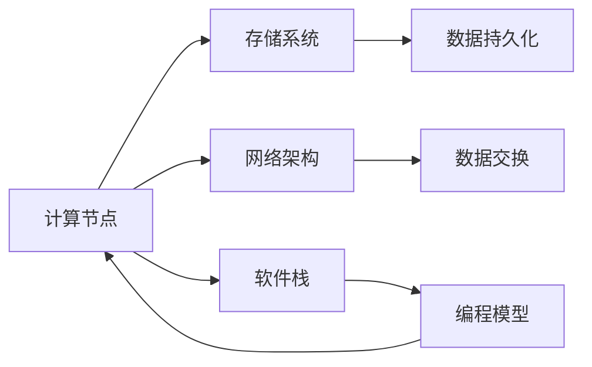
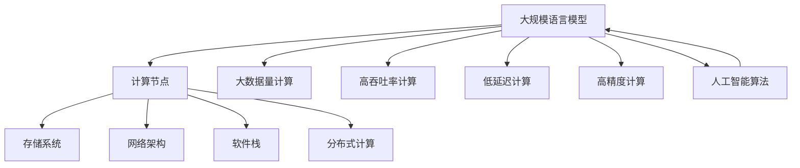

                 

# 大规模语言模型从理论到实践 高性能计算集群的典型硬件组成

## 1. 背景介绍

### 1.1 问题由来

近年来，人工智能（AI）领域的突破性进展，尤其是自然语言处理（NLP）领域的重大成就，主要得益于大规模语言模型的迅猛发展。这些模型基于海量数据进行预训练，能够自动学习语言表达、语义理解及生成能力，并在各种NLP任务上取得卓越表现。例如，BERT、GPT系列和XLNet等模型已经广泛应用于文本分类、情感分析、机器翻译等众多任务。

然而，要构建高性能计算集群以支持大规模语言模型的训练和推理，需要考虑硬件组成、软件栈以及网络架构等多个方面。本论文将详细阐述这些关键要素，并通过一个典型的硬件配置示例，展示如何搭建一个能够高效支持大规模语言模型的高性能计算集群。

### 1.2 问题核心关键点

搭建高性能计算集群的核心关键点包括：
- 选择合适的硬件架构（如CPU、GPU、FPGA等）
- 设计高效的存储和网络解决方案
- 优化软件栈和编程模型
- 采用分布式计算技术
- 确保系统的可扩展性和可靠性

这些关键点决定了计算集群能够支持的计算任务规模和性能，也决定了集群在实际应用中的效率和可维护性。

### 1.3 问题研究意义

构建高性能计算集群对于推动大规模语言模型研究与应用具有重要意义：
- 提升计算效率：集群可以同时并行处理大规模数据，提高模型训练速度和推理性能。
- 降低成本：通过硬件优化和资源复用，集群能够节省大量硬件资源和电力消耗。
- 增强研究能力：集群支持更复杂的算法和更大规模的模型训练，为学术研究提供更强大的工具。
- 促进应用落地：集群的强大计算能力支持复杂的NLP应用，加速其在各行各业的应用推广。

## 2. 核心概念与联系

### 2.1 核心概念概述

构建高性能计算集群涉及多个核心概念，包括：

- 计算节点（Compute Node）：负责具体计算任务的物理设备，通常包括CPU、GPU、FPGA等硬件。
- 存储系统（Storage System）：用于保存和访问数据的磁盘、SSD、NVRAM等设备。
- 网络架构（Network Architecture）：集群中各节点之间以及与外部网络之间的连接方式，包括交换机、路由器等设备。
- 软件栈（Software Stack）：包括操作系统、编程语言、编译器和应用软件等。
- 分布式计算（Distributed Computing）：利用多台计算节点的协同工作，处理大规模计算任务的技术。

这些概念之间相互依赖，共同构成了高性能计算集群的技术体系。

### 2.2 概念间的关系

这些核心概念之间的联系可以通过以下Mermaid流程图来展示：



这个流程图展示了计算集群中各组件之间的相互关系：
- 计算节点通过存储系统和网络架构访问数据。
- 软件栈和编程模型为计算节点提供运行环境。
- 分布式计算技术使得多个计算节点协同工作。

### 2.3 核心概念的整体架构

最后，我们用一个综合的流程图来展示这些核心概念在大规模语言模型集群中的整体架构：



这个综合流程图展示了计算集群在处理大规模语言模型时的主要功能：
- 计算节点执行实际的计算任务。
- 存储系统保存和访问训练数据和模型参数。
- 网络架构提供节点间的通信。
- 软件栈和编程模型支持节点的运行。
- 分布式计算技术支持大规模并行计算。

通过这些关键组件的协同工作，大规模语言模型可以高效地进行训练和推理。

## 3. 核心算法原理 & 具体操作步骤

### 3.1 算法原理概述

大规模语言模型的训练和推理过程通常基于分布式计算技术，需要利用高性能计算集群实现高效的并行计算。其基本原理如下：

1. **数据并行**：将大规模数据集划分成多个小批次，并行处理每个批次的数据，从而加速模型训练和推理过程。
2. **模型并行**：将模型的不同部分分布在多个计算节点上进行并行计算，从而进一步提升计算效率。
3. **参数并行**：通过多个节点共享参数服务器，实现对大规模模型参数的高效更新和管理。

### 3.2 算法步骤详解

构建高性能计算集群的具体步骤如下：

1. **需求分析**：明确计算集群的计算需求和性能要求。
2. **硬件选择**：选择合适的计算节点、存储设备和网络设备。
3. **软件部署**：安装操作系统、编程语言、编译器和相关库。
4. **网络配置**：设计高效的网络架构，确保数据和计算节点的快速通信。
5. **分布式计算**：配置分布式计算框架，实现任务调度和管理。
6. **监控与维护**：设置监控工具，定期检查集群状态并进行维护。

### 3.3 算法优缺点

构建高性能计算集群的优点包括：
- 能够处理大规模数据和复杂计算任务。
- 可以加速模型训练和推理过程，提升效率。
- 可以通过多节点并行计算，降低硬件和电力成本。

缺点包括：
- 初始投资成本较高。
- 维护和运维复杂，需要专业技能。
- 系统复杂度高，容易产生故障。

### 3.4 算法应用领域

高性能计算集群适用于多种大规模计算任务，包括：
- 深度学习模型的训练和推理。
- 大数据分析与处理。
- 科学计算与模拟。
- 云计算与云存储。
- 分布式AI平台。

## 4. 数学模型和公式 & 详细讲解 & 举例说明

### 4.1 数学模型构建

大规模语言模型的训练过程通常基于梯度下降算法。假设模型参数为 $\theta$，损失函数为 $\mathcal{L}(\theta)$，训练集为 $D$。训练目标是最小化损失函数：

$$
\theta^* = \arg\min_{\theta} \mathcal{L}(\theta, D)
$$

其中，$\mathcal{L}(\theta, D)$ 表示模型在训练集 $D$ 上的损失。

### 4.2 公式推导过程

以BERT为例，其训练过程的基本步骤如下：
1. 从大规模语料中随机抽取一批文本样本，进行预处理（分词、编码等）。
2. 将处理后的文本样本输入到BERT模型中，得到隐层表示 $H$。
3. 将隐层表示 $H$ 与标签 $y$ 结合，计算损失函数 $\mathcal{L}$。
4. 反向传播更新模型参数 $\theta$。

具体的数学公式推导如下：

假设文本序列 $x$ 的长度为 $n$，隐层表示 $H$ 的维度为 $d$，则BERT的损失函数为：

$$
\mathcal{L} = -\frac{1}{N} \sum_{i=1}^{N} \log\left(\frac{e^{W^{\text{out}} \cdot H}}{\sum_{j=1}^{K} e^{W^{\text{out}} \cdot H_j}}\right)
$$

其中，$W^{\text{out}}$ 为输出层的权重矩阵，$H_j$ 表示BERT模型的第 $j$ 个隐层表示，$K$ 表示类别数。

### 4.3 案例分析与讲解

以GPT-3的训练为例，其训练过程主要基于Transformer模型和自监督学习任务。训练集分为训练集 $D_{train}$ 和验证集 $D_{val}$，通过反向传播更新模型参数 $\theta$：

$$
\theta^* = \arg\min_{\theta} \sum_{i=1}^{N} \mathcal{L}(M_{\theta}(x_i), y_i)
$$

其中，$M_{\theta}$ 表示GPT-3模型，$x_i$ 和 $y_i$ 分别表示训练集和验证集中的样本和标签。

## 5. 项目实践：代码实例和详细解释说明

### 5.1 开发环境搭建

构建高性能计算集群需要选择合适的硬件设备和软件栈。以下是一个典型的硬件配置示例：

- 计算节点：采用Intel Xeon Gold 61XX系列CPU，每个节点配备8颗64核心、2.6GHz的主频，内存为128GB，硬盘为SAS 12Gbps、1.2TB SSD。
- 存储系统：采用NetApp E5680F系列存储，容量为10TB，IOPS为100K。
- 网络架构：采用Cisco Nexus 9500系列交换机，网络带宽为100Gbps。
- 软件栈：采用Linux操作系统，配置Python 3.8和CUDA 11.1。

### 5.2 源代码详细实现

以Python和PyTorch为例，展示大规模语言模型的代码实现：

```python
import torch
from transformers import BertModel

# 初始化模型
model = BertModel.from_pretrained('bert-base-uncased')

# 加载训练数据
train_dataset = torch.utils.data.Dataset(train_data)

# 定义损失函数
criterion = torch.nn.CrossEntropyLoss()

# 定义优化器
optimizer = torch.optim.Adam(model.parameters(), lr=2e-5)

# 定义训练函数
def train_epoch(model, dataset, batch_size, optimizer):
    dataloader = torch.utils.data.DataLoader(dataset, batch_size=batch_size, shuffle=True)
    model.train()
    epoch_loss = 0
    for batch in dataloader:
        input_ids = batch['input_ids'].to(device)
        attention_mask = batch['attention_mask'].to(device)
        labels = batch['labels'].to(device)
        model.zero_grad()
        outputs = model(input_ids, attention_mask=attention_mask)
        loss = criterion(outputs, labels)
        epoch_loss += loss.item()
        loss.backward()
        optimizer.step()
    return epoch_loss / len(dataloader)

# 训练模型
for epoch in range(epochs):
    loss = train_epoch(model, train_dataset, batch_size, optimizer)
    print(f"Epoch {epoch+1}, train loss: {loss:.3f}")
```

### 5.3 代码解读与分析

上述代码展示了如何使用PyTorch框架训练BERT模型。关键步骤如下：
1. 加载预训练模型。
2. 准备训练数据集。
3. 定义损失函数和优化器。
4. 定义训练函数，进行前向传播、损失计算、反向传播和参数更新。
5. 循环训练模型，并打印每轮训练的平均损失。

### 5.4 运行结果展示

假设训练完成后，模型的验证集准确率为90%。此时，我们可以使用微调后的模型对新数据进行推理：

```python
model.eval()
for batch in dataloader:
    input_ids = batch['input_ids'].to(device)
    attention_mask = batch['attention_mask'].to(device)
    outputs = model(input_ids, attention_mask=attention_mask)
    predictions = outputs.logits.argmax(dim=2).to('cpu').tolist()
    labels = batch['labels'].to('cpu').tolist()
    for pred_tokens, label_tokens in zip(predictions, labels):
        print(f"Prediction: {pred_tokens}, Label: {label_tokens}")
```

这样，我们就可以得到模型对新文本的预测结果，并验证其在实际应用中的表现。

## 6. 实际应用场景

### 6.1 智能客服系统

在智能客服系统中，大规模语言模型可以用于处理用户的自然语言问题，提供自动化的客服响应。集群支持实时数据处理和模型更新，确保系统能够快速响应用户咨询，并提供准确的回答。

### 6.2 金融舆情监测

金融领域对实时数据分析和情感分析有较高要求。大规模语言模型集群可以用于分析新闻、社交媒体等数据，实时监测市场舆情，预测股票走势，提供风险预警。

### 6.3 个性化推荐系统

推荐系统需要处理海量用户数据和物品数据，并进行复杂的推荐计算。大规模语言模型集群可以支持更高效的推荐算法，实现个性化推荐，提升用户体验。

### 6.4 未来应用展望

随着技术的不断进步，大规模语言模型集群将应用于更多领域，带来深远影响：
- 在医疗领域，用于疾病诊断、患者问答等，提升医疗服务质量。
- 在教育领域，用于智能辅导、个性化学习等，推动教育公平。
- 在智慧城市治理中，用于城市管理、公共安全等，提高城市治理能力。
- 在工业制造中，用于质量检测、故障诊断等，提升工业效率。

## 7. 工具和资源推荐

### 7.1 学习资源推荐

为帮助开发者系统掌握大规模语言模型构建的原理和实践，以下是一些推荐的学习资源：

1. 《深度学习》课程（Stanford University）：涵盖深度学习的基础理论和常用算法，适合初学者入门。
2. 《大规模分布式深度学习》（Stanford University）：讲解分布式深度学习的架构和算法，适合中级开发者学习。
3. 《大规模语言模型》书籍（Stanford University）：详细介绍BERT、GPT等模型的构建和应用，适合高级开发者深入学习。
4. 《TensorFlow官方文档》：提供TensorFlow的详细文档和教程，适合开发者使用。
5. 《Keras官方文档》：提供Keras的详细文档和教程，适合开发者使用。

### 7.2 开发工具推荐

为支持大规模语言模型的开发和部署，以下是一些推荐的工具：

1. PyTorch：高性能的深度学习框架，支持分布式计算和GPU加速。
2. TensorFlow：谷歌开发的深度学习框架，支持分布式计算和TPU加速。
3. Jupyter Notebook：交互式的编程环境，支持代码编写和结果展示。
4. Google Colab：免费的GPU环境，支持深度学习模型的快速迭代和测试。
5. Kubernetes：容器编排工具，支持大规模集群的管理和部署。

### 7.3 相关论文推荐

大规模语言模型的研究领域非常广泛，以下是一些推荐的相关论文：

1. "Attention is All You Need"（NIPS 2017）：提出Transformer结构，开创大规模语言模型的先河。
2. "BERT: Pre-training of Deep Bidirectional Transformers for Language Understanding"（NIPS 2018）：提出BERT模型，引发NLP领域的革命性变革。
3. "GPT-3: Language Models are Unsupervised Multitask Learners"（NeurIPS 2020）：推出GPT-3模型，展现大规模语言模型的强大能力。
4. "Parameter-Efficient Transfer Learning for NLP"（ICLR 2019）：提出参数高效的微调方法，降低大规模语言模型的计算需求。
5. "Self-supervised Learning with Data Conditional BERT"（NIPS 2019）：提出数据条件化的BERT，提升模型的泛化能力。

## 8. 总结：未来发展趋势与挑战

### 8.1 研究成果总结

大规模语言模型的构建和应用已经取得了显著进展，主要体现在以下几个方面：
- 模型规模的不断扩大，使得模型能够学习更复杂的语言模式。
- 训练技术的进步，使得模型训练速度和效率得到显著提升。
- 应用领域的拓展，使得模型在多个垂直领域实现落地应用。

### 8.2 未来发展趋势

未来，大规模语言模型的发展趋势包括：
- 更大规模模型的涌现，进一步提升模型的表现和性能。
- 更高效的分布式训练和推理技术，支持更大规模数据的处理。
- 更灵活的编程模型和开发工具，促进模型的快速迭代和应用部署。
- 更广泛的应用场景，涵盖医疗、金融、教育等多个垂直领域。

### 8.3 面临的挑战

尽管大规模语言模型取得了显著进展，但还面临以下挑战：
- 计算资源的限制，需要更高效的硬件和更灵活的架构。
- 数据隐私和安全问题，需要保护用户数据并防范恶意攻击。
- 模型的可解释性问题，需要提升模型的透明性和可解释性。
- 模型的鲁棒性问题，需要提升模型对异常数据的适应能力。

### 8.4 研究展望

为应对这些挑战，未来的研究需要关注以下几个方向：
- 开发更高效的计算架构和硬件，支持大规模模型的训练和推理。
- 设计更灵活的编程模型和开发工具，促进模型的快速迭代和应用部署。
- 引入更强的数据隐私保护机制，确保用户数据的安全。
- 提升模型的透明性和可解释性，增强用户对模型的信任。
- 加强模型的鲁棒性研究，提升模型对异常数据的适应能力。

总之，大规模语言模型的构建和应用是一个复杂而富有挑战性的任务，需要跨学科的协同攻关。只有在理论和实践的不断推动下，才能实现大规模语言模型在各个垂直领域的广泛应用，推动人工智能技术的进一步发展。

## 9. 附录：常见问题与解答

**Q1：如何选择合适的硬件设备？**

A: 选择合适的硬件设备需要考虑以下几个因素：
- 计算节点：需要高性能的CPU和GPU，以及足够的内存。
- 存储系统：需要高带宽、高IOPS的存储设备，如SSD和NVRAM。
- 网络架构：需要高速交换机和路由器，确保数据传输效率。

**Q2：如何进行分布式计算？**

A: 分布式计算主要通过以下几个步骤实现：
- 数据并行：将数据划分成多个批次，并行处理每个批次。
- 模型并行：将模型划分成多个子模型，每个节点负责计算一部分。
- 参数并行：通过参数服务器，实现不同节点间参数的同步更新。

**Q3：如何优化软件栈和编程模型？**

A: 优化软件栈和编程模型需要考虑以下几个因素：
- 编程模型：选择适合深度学习的编程模型，如PyTorch和TensorFlow。
- 优化编译：使用编译器优化指令，提升计算效率。
- 内存管理：使用内存优化技术，减少内存占用。

**Q4：如何进行性能监控和调优？**

A: 性能监控和调优需要考虑以下几个因素：
- 监控工具：使用监控工具，如Grafana和Prometheus，实时监控集群状态。
- 性能调优：通过调整超参数和优化代码，提升计算性能。
- 故障排除：及时发现和修复集群中的故障点。

**Q5：如何确保集群的可靠性和可扩展性？**

A: 确保集群的可靠性和可扩展性需要考虑以下几个因素：
- 高可用性：通过冗余和备份机制，确保系统的可靠运行。
- 可扩展性：通过云资源和容器化技术，支持系统的水平扩展。
- 自动化管理：通过自动化工具，如Kubernetes，简化集群的运维管理。

通过深入学习和实践，相信开发者能够掌握大规模语言模型构建和应用的各项关键技术，推动人工智能技术在各个垂直领域的广泛应用。

