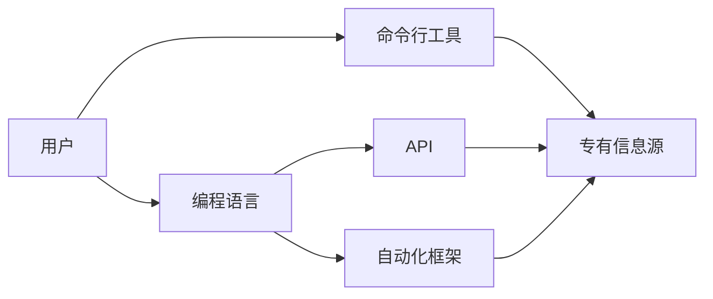

# 工具：代码执行与访问专有信息源

> 关键词：代码执行，专有信息源，API，命令行工具，自动化，数据访问，安全性，编程语言，代码库

## 1. 背景介绍

在当今的数字化时代，代码执行和访问专有信息源已经成为软件开发和数据分析的基础。无论是自动化测试、数据采集、还是构建复杂的软件系统，都需要高效且安全地执行代码并访问专有信息源。本文将深入探讨代码执行与访问专有信息源的方法、工具和技术，旨在为开发者提供全面的指导。

### 1.1 问题的由来

随着软件系统的复杂性不断增加，手动执行代码和访问信息源变得越来越低效。开发者需要一种自动化和智能化的方式来管理这些任务，以确保高效性和可靠性。

### 1.2 研究现状

目前，代码执行和访问专有信息源主要依赖于以下技术：

- **编程语言内置功能**：如Python的`subprocess`模块，允许开发者执行外部程序。
- **命令行工具**：如`curl`、`wget`等，可以用于HTTP请求和文件下载。
- **API**：提供编程接口，允许程序访问远程服务或数据库。
- **自动化框架**：如Selenium、Robot Framework等，用于自动化测试和用户界面操作。

### 1.3 研究意义

研究和掌握代码执行与访问专有信息源的工具和技术，对于提高开发效率、降低成本、确保数据安全和提高系统可靠性具有重要意义。

## 2. 核心概念与联系

### 2.1 核心概念原理

- **代码执行**：指在计算机上运行程序代码的过程。
- **专有信息源**：指受版权保护或商业限制的数据源，如数据库、API、文件等。
- **API**：应用程序编程接口，允许不同软件组件之间相互通信。
- **命令行工具**：通过命令行界面运行的程序，用于执行特定任务。

### 2.2 架构的 Mermaid 流程图



### 2.3 核心概念联系

- 用户通过编程语言编写代码，使用命令行工具或API访问专有信息源。
- 自动化框架可以封装代码执行和访问信息源的过程，提高效率和可维护性。

## 3. 核心算法原理 & 具体操作步骤

### 3.1 算法原理概述

代码执行与访问专有信息源的核心原理是：

- 使用编程语言内置的库或工具执行代码。
- 使用HTTP请求或其他协议访问专有信息源。
- 使用身份验证和安全措施保护访问权限。

### 3.2 算法步骤详解

1. **编写代码**：使用编程语言编写用于执行任务和访问信息的代码。
2. **配置环境**：安装必要的库和工具，如HTTP客户端库、API密钥等。
3. **执行代码**：运行代码，执行任务并访问信息源。
4. **处理结果**：解析和处理执行结果，如保存数据、生成报告等。
5. **监控与日志**：监控代码执行过程，记录日志以供调试和分析。

### 3.3 算法优缺点

**优点**：

- 自动化：提高效率和生产力。
- 灵活性：支持多种编程语言和工具。
- 可维护性：代码和配置易于管理。

**缺点**：

- 学习曲线：需要学习编程语言和工具。
- 安全风险：可能存在安全漏洞。
- 维护成本：需要定期更新和维护代码。

### 3.4 算法应用领域

- 自动化测试
- 数据采集和预处理
- 网络爬虫
- API客户端开发
- 机器人流程自动化(RPA)

## 4. 数学模型和公式 & 详细讲解 & 举例说明

### 4.1 数学模型构建

代码执行和访问专有信息源的数学模型通常涉及以下公式：

- $f(x) = g(h(x))$：表示代码执行过程，其中 $g$ 是编程语言执行函数，$h(x)$ 是输入数据。
- $L(y, \hat{y})$：表示损失函数，用于衡量模型预测结果 $\hat{y}$ 与真实标签 $y$ 之间的差异。

### 4.2 公式推导过程

公式推导过程依赖于具体任务和编程语言。以下以Python中使用`requests`库访问HTTP API为例：

- 导入`requests`库：`import requests`
- 发送GET请求：`response = requests.get(url, params=params)`
- 解析响应数据：`data = response.json()`

### 4.3 案例分析与讲解

假设我们需要访问一个提供天气信息的API，获取特定城市的天气数据：

```python
import requests

# 定义API URL和参数
url = "https://api.weatherapi.com/v1/current.json"
params = {
    "key": "your_api_key",
    "q": "New York",
    "aqi": "no"
}

# 发送请求并获取响应
response = requests.get(url, params=params)

# 解析响应数据
data = response.json()
temperature = data['current']['temp_c']

# 打印温度
print(f"The current temperature in New York is {temperature}°C")
```

在上面的代码中，我们使用`requests`库发送HTTP GET请求，获取特定城市的天气信息，并解析响应数据以提取温度。

## 5. 项目实践：代码实例和详细解释说明

### 5.1 开发环境搭建

为了进行代码执行和访问专有信息源的项目实践，我们需要以下开发环境：

- Python开发环境
- 安装`requests`、`pandas`等库

### 5.2 源代码详细实现

以下是一个简单的Python脚本，用于从API获取天气信息并保存到CSV文件：

```python
import requests
import pandas as pd

# 定义API URL和参数
url = "https://api.weatherapi.com/v1/current.json"
params = {
    "key": "your_api_key",
    "q": "New York",
    "aqi": "no"
}

# 发送请求并获取响应
response = requests.get(url, params=params)

# 解析响应数据
data = response.json()
temperature = data['current']['temp_c']

# 创建DataFrame
df = pd.DataFrame({
    'temperature': [temperature]
})

# 保存到CSV文件
df.to_csv("temperature.csv", index=False)
```

### 5.3 代码解读与分析

- 导入必要的库：`requests`用于HTTP请求，`pandas`用于数据处理。
- 定义API URL和参数：包含API密钥、查询参数等。
- 发送请求并获取响应：使用`requests.get`发送HTTP GET请求。
- 解析响应数据：使用`response.json()`将响应数据转换为JSON对象。
- 创建DataFrame：使用`pandas`创建包含温度数据的DataFrame。
- 保存到CSV文件：使用`df.to_csv`将DataFrame保存到CSV文件。

### 5.4 运行结果展示

执行上述脚本后，你将在当前目录下生成一个名为`temperature.csv`的文件，其中包含从API获取的温度数据。

## 6. 实际应用场景

### 6.1 数据采集

在数据科学领域，自动化数据采集是获取数据的重要手段。通过编写脚本，可以定期从外部API或数据库中获取数据，并将其存储到本地数据库或文件中。

### 6.2 自动化测试

在软件开发过程中，自动化测试是确保软件质量的关键。通过编写测试脚本，可以自动执行测试用例，并生成测试报告。

### 6.3 API客户端开发

API客户端开发是构建应用程序与外部服务交互的关键。通过编写API客户端代码，可以实现对第三方服务的调用和集成。

## 7. 工具和资源推荐

### 7.1 学习资源推荐

- 《Python网络爬虫从入门到实践》
- 《Python编程：从入门到实践》
- 《Effective Python》

### 7.2 开发工具推荐

- PyCharm
- VS Code
- Postman

### 7.3 相关论文推荐

- 《Web Scraping with Python》
- 《Scrapy：高效的网络爬虫框架》
- 《RESTful Web Services: Principles and Practical Patterns》

## 8. 总结：未来发展趋势与挑战

### 8.1 研究成果总结

本文介绍了代码执行与访问专有信息源的方法、工具和技术，并探讨了其应用场景和未来发展趋势。

### 8.2 未来发展趋势

- 更多的编程语言和工具将支持代码执行和访问专有信息源。
- 自动化和智能化程度将进一步提高。
- 安全性和隐私保护将成为重要关注点。

### 8.3 面临的挑战

- 安全风险：需要保护数据和API免受攻击。
- 数据质量：需要确保获取到的数据准确可靠。
- 技术更新：需要不断学习新技术和工具。

### 8.4 研究展望

随着技术的不断发展，代码执行与访问专有信息源将在更多领域得到应用。未来，我们将看到更加高效、安全、智能的工具和技术出现。

## 9. 附录：常见问题与解答

**Q1：如何提高代码执行效率？**

A: 可以通过以下方式提高代码执行效率：
- 使用高效的编程语言和库。
- 优化代码逻辑，减少不必要的计算。
- 使用并行计算和分布式计算技术。

**Q2：如何确保API访问的安全性？**

A: 可以采取以下措施确保API访问的安全性：
- 使用HTTPS协议进行通信。
- 对API密钥进行加密存储。
- 限制API访问权限，防止未授权访问。

**Q3：如何处理大量数据？**

A: 可以使用以下方法处理大量数据：
- 使用分布式系统进行数据处理。
- 使用数据分区和数据流技术。
- 使用内存数据库或NoSQL数据库。

**Q4：如何选择合适的编程语言和工具？**

A: 选择合适的编程语言和工具取决于具体的需求：
- 对于Web开发，可以使用JavaScript、Python或Ruby。
- 对于数据分析，可以使用Python、R或Scala。
- 对于网络爬虫，可以使用Python或Java。

作者：禅与计算机程序设计艺术 / Zen and the Art of Computer Programming