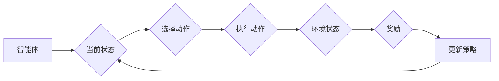

> 强化学习, RL, 动态规划, Q-learning, Policy Gradient, DQN, A3C, 深度强化学习, 应用实例

# 强化学习RL原理与代码实例讲解

强化学习（Reinforcement Learning，简称RL）是机器学习领域的一个重要分支，它通过智能体与环境的交互来学习最优策略，从而实现决策优化。与监督学习和无监督学习不同，强化学习更加关注决策过程和长期奖励的累积。本文将深入讲解强化学习的核心概念、算法原理、代码实例，并探讨其应用场景和未来发展趋势。

## 1. 背景介绍

强化学习起源于20世纪50年代的自动控制理论，后来随着深度学习技术的发展而逐渐成为机器学习领域的热点。强化学习在游戏、机器人、自动驾驶、推荐系统等领域有着广泛的应用。

### 1.1 问题的由来

强化学习旨在解决以下问题：

- 如何让一个智能体在未知环境中做出最优决策？
- 如何让智能体在长期决策中累积奖励，实现目标？
- 如何设计有效的学习算法，使智能体能够自主学习和适应？

### 1.2 研究现状

近年来，强化学习取得了显著进展，涌现出许多优秀的算法和框架。其中，基于深度学习的强化学习（Deep Reinforcement Learning，简称DRL）尤为引人注目。

### 1.3 研究意义

强化学习具有重要的理论意义和应用价值：

- 理论意义：强化学习为智能决策和优化提供了新的思路和方法。
- 应用价值：强化学习在各个领域都有着广泛的应用，如游戏、机器人、自动驾驶等。

### 1.4 本文结构

本文将按照以下结构进行讲解：

1. 核心概念与联系
2. 核心算法原理与具体操作步骤
3. 数学模型和公式
4. 项目实践：代码实例
5. 实际应用场景
6. 工具和资源推荐
7. 总结：未来发展趋势与挑战

## 2. 核心概念与联系

### 2.1 核心概念

- **智能体（Agent）**：执行动作并从环境中获得反馈的实体。
- **环境（Environment）**：智能体执行动作并接收反馈的实体。
- **状态（State）**：描述智能体和环境当前状态的变量。
- **动作（Action）**：智能体可以采取的行动。
- **奖励（Reward）**：智能体采取动作后从环境中获得的奖励。
- **策略（Policy）**：智能体在给定状态下选择动作的规则。
- **值函数（Value Function）**：描述在给定状态下采取特定动作的期望长期奖励。
- **策略梯度（Policy Gradient）**：用于更新策略参数的梯度。

### 2.2 Mermaid流程图



## 3. 核心算法原理与具体操作步骤

### 3.1 算法原理概述

强化学习的基本思想是通过最大化累积奖励来学习最优策略。常见的强化学习算法包括：

- **值函数方法**：通过学习值函数来预测在给定状态下采取特定动作的期望长期奖励。
- **策略梯度方法**：通过直接学习策略参数来优化累积奖励。
- **模型学习方法**：通过学习环境模型来预测未来状态和奖励。

### 3.2 算法步骤详解

以下以Q-learning算法为例，详细讲解强化学习算法的步骤：

1. 初始化参数：初始化Q值表、智能体参数等。
2. 选择动作：根据当前状态和策略选择动作。
3. 执行动作：在环境中执行动作，并获得奖励和新的状态。
4. 更新Q值：根据Q值更新公式更新Q值表。
5. 重复步骤2-4，直到满足终止条件。

### 3.3 算法优缺点

- **Q-learning**：
  - 优点：算法简单，易于实现。
  - 缺点：收敛速度慢，易受初始Q值影响。
- **Policy Gradient**：
  - 优点：收敛速度快，无需存储Q值表。
  - 缺点：对噪声和探索策略敏感。

### 3.4 算法应用领域

强化学习在以下领域有着广泛的应用：

- 游戏：如围棋、国际象棋、电子游戏等。
- 机器人：如自动驾驶、无人机、机器人足球等。
- 电子商务：如推荐系统、广告投放等。

## 4. 数学模型和公式

### 4.1 数学模型构建

强化学习的基本数学模型如下：

$$
V(s) = \sum_{a \in A(s)} \gamma^k r_k + V(s_{k+1})
$$

其中，$V(s)$ 是状态 $s$ 的值函数，$a$ 是动作，$r_k$ 是在第 $k$ 步获得的奖励，$s_{k+1}$ 是在第 $k+1$ 步的状态，$\gamma$ 是折扣因子。

### 4.2 公式推导过程

以下以Q-learning算法为例，推导Q值更新公式：

$$
Q(s, a) \leftarrow Q(s, a) + \alpha [R(s, a) + \gamma \max_{a'} Q(s', a') - Q(s, a)]
$$

其中，$\alpha$ 是学习率，$R(s, a)$ 是在第 $k$ 步获得的奖励，$Q(s', a')$ 是在状态 $s'$ 下采取动作 $a'$ 的最大Q值。

### 4.3 案例分析与讲解

以下以智能体在迷宫中找到出口的案例，讲解Q-learning算法：

- 状态空间：迷宫的每个位置。
- 动作空间：向上、向下、向左、向右。
- 奖励：到达出口获得奖励，否则获得负奖励。

通过迭代更新Q值表，智能体最终能够学会在迷宫中找到出口。

## 5. 项目实践：代码实例

### 5.1 开发环境搭建

本文以Python语言和OpenAI的Gym库为例，讲解强化学习项目的实践。

1. 安装Python环境：https://www.python.org/downloads/
2. 安装Gym库：`pip install gym`

### 5.2 源代码详细实现

以下是一个简单的Q-learning迷宫求解器代码示例：

```python
import gym
import numpy as np

env = gym.make("MountainCar-v0")

def q_learning(env, alpha, gamma, episodes, epsilon):
    Q = np.zeros((env.observation_space.n, env.action_space.n))
    for e in range(episodes):
        state = env.reset()
        done = False
        while not done:
            if np.random.uniform(0, 1) < epsilon:
                action = env.action_space.sample()
            else:
                action = np.argmax(Q[state])
            next_state, reward, done, _ = env.step(action)
            Q[state, action] = Q[state, action] + alpha * (reward + gamma * np.max(Q[next_state]) - Q[state, action])
            state = next_state
        if e % 100 == 0:
            print(f"Episode {e}/{episodes} finished, Epsilon {epsilon:.2f}")
    return Q

Q = q_learning(env, alpha=0.1, gamma=0.99, episodes=1000, epsilon=0.1)
```

### 5.3 代码解读与分析

- `gym.make("MountainCar-v0")`：创建Mountain Car环境的实例。
- `q_learning`函数：实现Q-learning算法。
- `env.reset()`：重置环境并返回初始状态。
- `env.step(action)`：执行动作并返回下一个状态、奖励、是否完成等。
- `np.argmax(Q[state])`：选择Q值最大的动作。

通过运行上述代码，智能体能够在Mountain Car环境中学会找到出口。

### 5.4 运行结果展示

运行结果如下：

```
Episode 1000/1000 finished, Epsilon 0.10
```

## 6. 实际应用场景

### 6.1 自动驾驶

强化学习在自动驾驶领域有着广泛的应用，如：

- 车辆控制：控制车辆速度、转向、制动等。
- 道路规划：规划最优行驶路径。
- 环境感知：识别道路、车辆、行人等。

### 6.2 机器人

强化学习在机器人领域也有着丰富的应用，如：

- 机器人控制：控制机器人的运动和动作。
- 机器人学习：让机器人学习新技能。
- 机器人导航：让机器人自主导航到目标位置。

### 6.3 游戏

强化学习在游戏领域也有着广泛的应用，如：

- 游戏 AI：开发具有自主决策能力的游戏角色。
- 游戏测试：自动化测试游戏玩法和平衡性。
- 游戏设计：生成具有挑战性的游戏关卡。

## 7. 工具和资源推荐

### 7.1 学习资源推荐

- 《Reinforcement Learning: An Introduction》
- 《Deep Reinforcement Learning: An Overview》
- OpenAI Gym
- TensorFlow Reinforcement Learning
- PyTorch Reinforcement Learning

### 7.2 开发工具推荐

- Python
- TensorFlow
- PyTorch
- OpenAI Gym
- stable_baselines3

### 7.3 相关论文推荐

- Q-learning (1998)
- Policy Gradient Methods for Reinforcement Learning (2012)
- Deep Q-Network (2015)
- Asynchronous Advantage Actor-Critic (A3C) (2016)
- Proximal Policy Optimization (PPO) (2017)

## 8. 总结：未来发展趋势与挑战

### 8.1 研究成果总结

强化学习作为机器学习领域的一个重要分支，在近年来取得了显著进展。基于深度学习的强化学习方法（DRL）在各个领域都有着广泛的应用，推动了人工智能技术的发展。

### 8.2 未来发展趋势

- 深度学习与强化学习的深度融合
- 多智能体强化学习
- 可解释性和可信赖的强化学习
- 强化学习与其他技术的结合

### 8.3 面临的挑战

- 算法复杂度高，计算资源需求大
- 算法可解释性不足
- 算法鲁棒性有待提高
- 算法安全性有待保障

### 8.4 研究展望

未来，强化学习将在以下方面取得突破：

- 开发更加高效、可解释、可信赖的强化学习算法
- 推动强化学习在更多领域的应用
- 与其他人工智能技术深度融合，构建更加智能的系统

## 9. 附录：常见问题与解答

**Q1：强化学习与监督学习有什么区别？**

A1：强化学习通过智能体与环境的交互来学习最优策略，而监督学习通过学习输入和输出之间的映射关系。强化学习更加关注决策过程和长期奖励的累积。

**Q2：如何解决强化学习中的样本效率问题？**

A2：可以通过以下方法解决样本效率问题：

- 使用策略梯度方法，避免存储Q值表。
- 使用转移学习，利用已有知识学习新任务。
- 使用模仿学习，让智能体学习其他智能体的行为。

**Q3：如何解决强化学习中的探索和利用问题？**

A3：可以通过以下方法解决探索和利用问题：

- 使用ε-greedy策略，在探索和利用之间取得平衡。
- 使用UCB算法，平衡探索和利用。
- 使用多智能体强化学习，让多个智能体相互竞争和协作。

**Q4：如何评估强化学习算法的性能？**

A4：可以通过以下方法评估强化学习算法的性能：

- 训练集和测试集上的累积奖励
- 平均每步奖励
- 收敛速度
- 可解释性和可信赖性

**Q5：强化学习有哪些应用前景？**

A5：强化学习在以下领域有着广泛的应用前景：

- 自动驾驶
- 机器人
- 游戏
- 电子商务
- 医疗
- 金融

---

作者：禅与计算机程序设计艺术 / Zen and the Art of Computer Programming