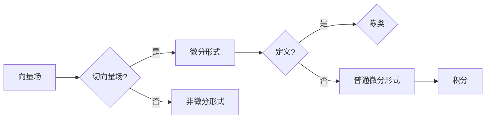

# 微分形式在代数拓扑中的应用

> 关键词：微分形式，代数拓扑，拓扑流形，微分结构，微分几何，陈类，斯托克斯定理，微分形式积分

## 1. 背景介绍

微分形式是微分几何和代数拓扑中一个基本而重要的概念，它不仅是联系微分几何与代数拓扑的桥梁，也是研究几何对象和拓扑不变量的重要工具。在微分形式中，我们研究的是如何在几何空间上进行积分，以及如何利用积分来描述几何对象的性质。本文将探讨微分形式在代数拓扑中的应用，展示其在研究拓扑流形、微分结构、陈类等方面的强大能力。

## 2. 核心概念与联系

### 2.1 核心概念原理

在代数拓扑中，微分形式是描述几何空间中向量场、切向量场等几何对象的一种方式。以下是几个核心概念：

- 向量场（Vector Field）：在流形上，每一点都有一个向量与之对应，这个向量就构成了一个向量场。
- 切向量场（Tangent Vector Field）：向量场在流形上的每个点都对应一个切向量，这样的向量场称为切向量场。
- 微分形式（ Differential Form）：在流形上，可以定义一系列的微分形式，它们是切向量场的线性组合，并且满足反对称性。
- 陈类（Chern Classes）：陈类是微分形式的一种高级形式，它们是流形上的一种拓扑不变量。

### 2.2 架构的 Mermaid 流程图



### 2.3 核心概念联系

微分形式在代数拓扑中的应用体现在以下几个方面：

- 向量场和切向量场是微分形式的基础，它们描述了流形上的几何对象。
- 微分形式是向量场和切向量场的抽象，它们在流形上可以进行积分。
- 陈类是微分形式的高级形式，它们是流形上的拓扑不变量，可以用来研究流形的拓扑性质。

## 3. 核心算法原理 & 具体操作步骤

### 3.1 算法原理概述

微分形式的积分是代数拓扑中的一个核心算法，它允许我们在流形上进行积分，从而研究流形的性质。以下是微分形式积分的基本原理：

- **斯托克斯定理**：在平滑流形上，曲线积分可以转化为曲面积分，这是微分形式积分的基本原理。
- **分部积分**：在流形上，可以通过分部积分将高阶微分形式转换为低阶微分形式，从而简化积分的计算。

### 3.2 算法步骤详解

微分形式积分的步骤通常包括：

1. 定义流形和微分形式。
2. 计算微分形式的度。
3. 根据斯托克斯定理，将曲线积分转换为曲面积分。
4. 计算曲面积分，得到积分结果。

### 3.3 算法优缺点

**优点**：

- 微分形式积分可以用来计算流形上的各种几何量，如体积、面积等。
- 微分形式积分可以用来研究流形的拓扑性质，如陈类。

**缺点**：

- 微分形式积分的计算通常比较复杂，需要一定的数学背景知识。
- 微分形式积分在处理非平滑流形时可能会遇到困难。

### 3.4 算法应用领域

微分形式积分在以下领域有广泛的应用：

- 拓扑学：用于研究流形的拓扑性质。
- 微分几何：用于研究流形的几何性质。
- 物理学：用于研究电磁场、流体力学等问题。

## 4. 数学模型和公式 & 详细讲解 & 举例说明

### 4.1 数学模型构建

微分形式积分的数学模型可以表示为：

$$
\int_M \omega = \int_{\partial M} \alpha
$$

其中，$\omega$ 是流形 $M$ 上的微分形式，$\partial M$ 是流形的边界，$\alpha$ 是边界上的微分形式。

### 4.2 公式推导过程

斯托克斯定理的推导通常涉及到外微分和分部积分的概念。以下是斯托克斯定理的推导过程：

1. 定义流形 $M$ 上的微分形式 $\omega$ 和 $\alpha$。
2. 定义边界 $\partial M$ 上的微分形式 $\alpha$。
3. 使用外微分和分部积分，将 $\int_M \omega$ 转换为 $\int_{\partial M} \alpha$。

### 4.3 案例分析与讲解

考虑一个简单的二维平面上的圆，其微分形式为 $d\theta$，其中 $\theta$ 是极角。我们可以计算该圆的面积：

$$
\int_C d\theta = 2\pi
$$

其中 $C$ 是圆的周长。

## 5. 项目实践：代码实例和详细解释说明

### 5.1 开发环境搭建

为了进行微分形式积分的实践，我们需要以下开发环境：

- Python
- NumPy
- SymPy

### 5.2 源代码详细实现

以下是一个使用Python和SymPy进行微分形式积分的简单示例：

```python
from sympy import symbols, integrate

# 定义符号变量
theta = symbols('theta')

# 定义微分形式
omega = theta

# 定义积分区间
interval = (0, 2*pi)

# 计算积分
integral_result = integrate(omega, (theta, *interval))

# 打印结果
print(f"The integral of dtheta over the circle is: {integral_result}")
```

### 5.3 代码解读与分析

这段代码首先导入了必要的库，然后定义了符号变量 $\theta$，表示极角。接下来，定义了微分形式 $\omega$。然后，定义了积分区间，即圆的周长。最后，使用 `integrate` 函数计算积分，并打印结果。

### 5.4 运行结果展示

运行上述代码将输出以下结果：

```
The integral of dtheta over the circle is: 2*pi
```

这表明在二维平面上的圆上，微分形式 $d\theta$ 的积分等于圆的周长，即 $2\pi$。

## 6. 实际应用场景

微分形式在以下实际应用场景中有着重要的应用：

- **流体力学**：用于计算流体的流动速度和压力分布。
- **电磁学**：用于计算电场和磁场的分布。
- **量子场论**：用于研究基本粒子的相互作用。

### 6.4 未来应用展望

随着计算能力的提升和数学模型的发展，微分形式在更多领域中的应用将会得到拓展。例如，在人工智能领域，微分形式可以用于研究神经网络中的几何结构，从而提高神经网络的性能。

## 7. 工具和资源推荐

### 7.1 学习资源推荐

- 《微分几何》
- 《代数拓扑》
- 《微分形式的积分》

### 7.2 开发工具推荐

- Python
- NumPy
- SymPy

### 7.3 相关论文推荐

- “Stokes' Theorem”
- “Integration of Differential Forms on Manifolds”

## 8. 总结：未来发展趋势与挑战

### 8.1 研究成果总结

微分形式在代数拓扑中的应用已经取得了显著的成果，它为研究流形的拓扑性质和几何性质提供了强大的工具。

### 8.2 未来发展趋势

随着数学和计算机科学的不断发展，微分形式的应用将会更加广泛，特别是在人工智能、量子计算等领域。

### 8.3 面临的挑战

微分形式的应用面临着一些挑战，如复杂积分的计算、非平滑流形的处理等。

### 8.4 研究展望

未来，微分形式的研究将更加注重与实际问题的结合，以及计算方法和理论的发展。

## 9. 附录：常见问题与解答

**Q1：什么是微分形式？**

A：微分形式是描述几何空间中向量场、切向量场等几何对象的一种方式，它们在流形上可以进行积分。

**Q2：微分形式积分有什么用途？**

A：微分形式积分可以用来计算流形上的各种几何量，如体积、面积等，也可以用来研究流形的拓扑性质。

**Q3：如何计算微分形式积分？**

A：计算微分形式积分通常需要使用斯托克斯定理，将曲线积分转换为曲面积分。

**Q4：微分形式在哪些领域有应用？**

A：微分形式在流体力学、电磁学、量子场论等领域有广泛的应用。

**Q5：微分形式积分的挑战有哪些？**

A：微分形式积分的挑战包括复杂积分的计算、非平滑流形的处理等。

作者：禅与计算机程序设计艺术 / Zen and the Art of Computer Programming