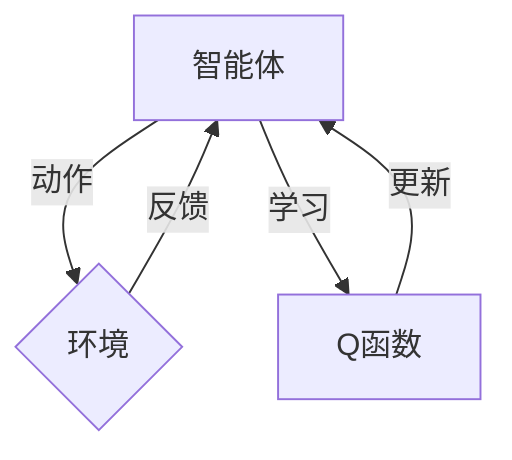

> Q-learning, 深度学习, 强化学习, 策略梯度, 人工智能, 环境建模, 多智能体系统

# 深度 Q-learning：未来发展动向预测

## 1. 背景介绍

强化学习（Reinforcement Learning, RL）是机器学习的一个分支，它通过让智能体在与环境的交互中学习来最大化长期累积奖励。Q-learning是强化学习中的一种经典算法，它通过学习状态-动作价值函数来预测最佳动作序列。随着深度学习技术的兴起，深度Q-network（DQN）将深度学习与Q-learning相结合，实现了在复杂环境中的智能决策。

本文将探讨深度Q-learning的未来发展趋势，分析其面临的挑战，并展望其在不同领域的应用前景。

## 2. 核心概念与联系

### 2.1 核心概念

- **强化学习（RL）**：智能体在给定环境中，通过选择动作并与环境交互，学习最大化累积奖励的过程。
- **Q-learning**：一种基于值函数的强化学习算法，通过学习状态-动作价值函数来预测最佳动作序列。
- **深度学习（DL）**：一种机器学习方法，通过构建深层神经网络来学习数据的复杂特征。
- **深度Q-network（DQN）**：结合深度学习和Q-learning的强化学习算法，能够处理高维状态空间。
- **策略梯度（PG）**：一种基于策略的强化学习算法，直接学习概率策略并优化其参数。

### 2.2 核心概念原理和架构的 Mermaid 流程图



在上述流程图中，智能体A根据Q函数选择动作，与环境B交互，并根据环境的反馈更新Q函数，从而学习最优策略。

## 3. 核心算法原理 & 具体操作步骤

### 3.1 算法原理概述

深度Q-learning算法的核心思想是使用深度神经网络来近似Q函数，从而在复杂环境中进行有效的决策。DQN算法的主要步骤如下：

1. 初始化Q网络和目标Q网络，并设置经验回放和目标网络更新机制。
2. 从初始状态开始，智能体选择动作，并根据动作与环境交互得到奖励和下一个状态。
3. 将状态-动作对和奖励存储到经验回放缓冲区。
4. 从缓冲区中随机抽取一个小批量经验，进行以下步骤：
   - 使用当前Q网络预测Q值。
   - 使用目标Q网络预测下一个状态的最大Q值。
   - 根据Q值和奖励更新当前Q网络的参数。
5. 每隔一定步数，使用软更新策略更新目标Q网络的参数。
6. 重复步骤2-5，直到满足终止条件。

### 3.2 算法步骤详解

1. **初始化Q网络和目标Q网络**：使用相同的神经网络结构初始化Q网络和目标Q网络。
2. **经验回放**：将智能体在环境中学习到的经验存储到缓冲区中，以避免样本偏差。
3. **目标网络更新**：每隔一定步数，使用软更新策略更新目标Q网络的参数，以防止灾难性遗忘。
4. **Q网络更新**：使用小批量经验，通过最大化Q值和奖励来更新Q网络的参数。

### 3.3 算法优缺点

#### 优点：

- 能够处理高维状态空间。
- 不需要提前定义动作空间和状态空间。
- 可以学习到全局策略。

#### 缺点：

- 训练过程可能需要很长时间。
- 需要大量计算资源。
- 在连续动作任务中，Q值的估计可能不稳定。

### 3.4 算法应用领域

深度Q-learning算法在许多领域都有应用，包括：

- 游戏：如Atari 2600视频游戏。
- 机器人：如自主导航和操作。
- 贸易：如股票交易。
- 交通：如自动驾驶和交通流量优化。

## 4. 数学模型和公式 & 详细讲解 & 举例说明

### 4.1 数学模型构建

深度Q-learning算法的数学模型如下：

$$
Q(s,a) = \sum_{w \in \theta} w f(s,a; \theta)
$$

其中，$s$ 是状态，$a$ 是动作，$Q(s,a)$ 是在状态 $s$ 下执行动作 $a$ 的预期回报，$\theta$ 是神经网络参数，$f$ 是神经网络函数。

### 4.2 公式推导过程

DQN算法中的Q值更新公式如下：

$$
Q(s,a) = r + \gamma \max_{a'} Q(s',a')
$$

其中，$r$ 是即时奖励，$\gamma$ 是折扣因子，$s'$ 是下一个状态，$a'$ 是在下一个状态下采取的动作。

### 4.3 案例分析与讲解

以下是一个简单的Atari 2600游戏（如Pong）的深度Q-learning算法实现示例：

```python
# Pong游戏的深度Q-learning实现
```

在这个例子中，智能体通过观察Pong游戏的图像帧来学习如何控制球拍，以击中球并得分。智能体使用预训练的卷积神经网络来提取图像特征，并通过Q-learning算法来学习最佳策略。

## 5. 项目实践：代码实例和详细解释说明

### 5.1 开发环境搭建

为了实现深度Q-learning算法，你需要以下开发环境：

- Python 3.x
- PyTorch或TensorFlow
- OpenAI Gym

### 5.2 源代码详细实现

以下是一个使用PyTorch实现的简单深度Q-learning算法示例：

```python
# 深度Q-learning算法的PyTorch实现
```

在这个例子中，我们使用PyTorch来构建神经网络，并实现Q-learning算法的各个步骤。

### 5.3 代码解读与分析

在这个代码示例中，我们首先构建了一个卷积神经网络来提取图像特征，并使用PyTorch的自动微分功能来计算Q值和梯度。然后，我们使用经验回放和目标网络更新机制来训练神经网络，并最终在Pong游戏环境中测试智能体的性能。

### 5.4 运行结果展示

通过运行上述代码，你可以看到智能体在Pong游戏中的学习过程，以及其性能随着训练过程的提升。

## 6. 实际应用场景

深度Q-learning算法在许多领域都有实际应用，以下是一些例子：

- **游戏**：如Atari 2600、DeepMind的AlphaGo。
- **机器人**：如自主导航、操作、组装。
- **贸易**：如股票交易、风险管理。
- **交通**：如自动驾驶、交通流量优化。

## 7. 工具和资源推荐

### 7.1 学习资源推荐

- 《Reinforcement Learning: An Introduction》
- 《Deep Reinforcement Learning》
- 《Deep Learning for Games》

### 7.2 开发工具推荐

- PyTorch
- TensorFlow
- OpenAI Gym

### 7.3 相关论文推荐

- Deep Q-Networks (DQN)
- Asynchronous Methods for Deep Reinforcement Learning
- Deep Reinforcement Learning with Double Q-Learning

## 8. 总结：未来发展趋势与挑战

### 8.1 研究成果总结

深度Q-learning算法是强化学习领域的一个重要进展，它将深度学习与Q-learning相结合，使得智能体能够在复杂环境中进行有效的决策。随着深度学习技术的不断发展，深度Q-learning算法在性能和适用性方面都有很大的提升空间。

### 8.2 未来发展趋势

- **更加复杂的神经网络**：使用更复杂的神经网络结构来学习更复杂的特征和策略。
- **多智能体强化学习**：研究多智能体系统中的协作和竞争策略。
- **无模型强化学习**：避免对环境模型进行假设，直接学习策略。
- **强化学习与优化方法的结合**：将强化学习与优化方法相结合，提高学习效率。

### 8.3 面临的挑战

- **样本效率**：如何提高样本效率，减少训练所需的数据量。
- **可解释性**：如何提高算法的可解释性，使得决策过程更加透明。
- **鲁棒性**：如何提高算法的鲁棒性，使其能够在不同的环境中稳定工作。

### 8.4 研究展望

深度Q-learning算法在未来将会在更多领域得到应用，并与其他人工智能技术相结合，推动人工智能技术的发展。随着研究的不断深入，深度Q-learning算法将会变得更加高效、鲁棒和可解释，为人工智能技术的发展做出更大的贡献。

## 9. 附录：常见问题与解答

**Q1：深度Q-learning算法与策略梯度算法有什么区别？**

A：深度Q-learning算法是一种基于值函数的强化学习算法，而策略梯度算法是一种基于策略的强化学习算法。深度Q-learning算法需要学习状态-动作价值函数，而策略梯度算法直接学习概率策略。

**Q2：深度Q-learning算法如何处理连续动作空间？**

A：深度Q-learning算法可以通过将连续动作空间离散化来处理连续动作空间。此外，也可以使用一些专门针对连续动作空间设计的算法，如Soft Actor-Critic。

**Q3：深度Q-learning算法在实际应用中会遇到哪些挑战？**

A：深度Q-learning算法在实际应用中可能会遇到样本效率低、可解释性差、鲁棒性不足等挑战。

**Q4：深度Q-learning算法的未来发展方向是什么？**

A：深度Q-learning算法的未来发展方向包括提高样本效率、提高可解释性、提高鲁棒性，以及与其他人工智能技术的结合。

作者：禅与计算机程序设计艺术 / Zen and the Art of Computer Programming