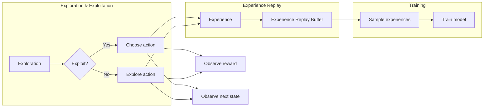

# 深度 Q-learning：防止过拟合的策略

> 关键词：深度Q-learning，过拟合，策略，探索-利用平衡，经验回放，优先级采样，回放缓冲区，探索率衰减

## 1. 背景介绍

深度Q-learning（DQN）是一种结合了深度学习和Q-learning算法的强化学习技术。它在许多复杂环境中的决策制定任务中表现出了出色的性能。然而，DQN及其变体在训练过程中容易受到过拟合的影响，即模型对训练数据过于敏感，导致泛化能力下降。本文将探讨深度Q-learning中防止过拟合的策略，包括探索-利用平衡、经验回放、优先级采样等。

## 2. 核心概念与联系

### 2.1 核心概念原理

**深度Q-learning（DQN）**：DQN通过神经网络来估计动作价值函数 $V(s)$ 和状态-动作价值函数 $Q(s,a)$，其中 $s$ 表示状态，$a$ 表示动作。通过最大化预期奖励 $R(s,a)$，DQN能够在策略迭代中学习最优策略。

**过拟合**：过拟合指的是模型在训练数据上表现良好，但在测试数据上表现不佳，即泛化能力下降。

**探索-利用平衡**：在强化学习中，探索是指尝试新的动作以发现新的状态和奖励，而利用是指根据已有经验选择最优动作。探索-利用平衡是强化学习中的一个关键问题，它需要在探索新动作和利用已有经验之间找到一个合适的平衡点。

**经验回放**：经验回放（Experience Replay）是一种策略，它通过将学习过程中的状态、动作、奖励和下一个状态存储在经验回放缓冲区中，并从缓冲区中随机抽取数据进行训练，以避免模型对特定训练样本的过度依赖。

**优先级采样**：在经验回放中，可以通过为每个经验赋予不同的采样概率来优先处理那些更有价值的数据。

### 2.2 核心概念架构的 Mermaid 流程图



## 3. 核心算法原理 & 具体操作步骤

### 3.1 算法原理概述

DQN的算法原理可以概括为以下步骤：

1. 初始化Q值网络和目标Q值网络。
2. 通过探索-利用策略选择动作。
3. 执行动作，观察奖励和下一个状态。
4. 将经验存储到经验回放缓冲区。
5. 从经验回放缓冲区中随机抽取经验。
6. 使用抽取的经验训练Q值网络。
7. 定期更新目标Q值网络。
8. 重复步骤2-7，直到达到停止条件。

### 3.2 算法步骤详解

1. **初始化**：初始化Q值网络和目标Q值网络。Q值网络用于预测当前状态下的动作值，目标Q值网络用于存储Q值网络的最新权重，以减少梯度发散。

2. **选择动作**：根据探索-利用策略选择动作。在早期，模型可能会选择随机动作进行探索，以发现更多有价值的状态。随着训练的进行，模型会逐渐利用已有经验选择动作。

3. **执行动作**：执行选择的动作，并观察奖励和下一个状态。

4. **存储经验**：将当前状态、执行的动作、观察到的奖励和下一个状态存储到经验回放缓冲区。

5. **训练模型**：从经验回放缓冲区中随机抽取经验，使用这些经验来训练Q值网络。

6. **更新目标网络**：定期更新目标Q值网络的权重，使其接近Q值网络的最新权重。

7. **重复**：重复步骤2-6，直到达到停止条件，如达到预定的训练轮数或达到满意的性能。

### 3.3 算法优缺点

**优点**：

- 能够处理高维输入空间和动作空间。
- 不需要环境模型。
- 能够学习到复杂的策略。

**缺点**：

- 训练过程可能非常缓慢。
- 过拟合是一个常见问题。
- 需要大量的训练数据。

### 3.4 算法应用领域

DQN及其变体在以下领域得到了广泛应用：

- 游戏人工智能。
- 机器人控制。
- 自动驾驶。
- 金融交易。

## 4. 数学模型和公式 & 详细讲解 & 举例说明

### 4.1 数学模型构建

DQN的数学模型可以表示为以下公式：

$$
Q(s,a; \theta) = \sum_{r \in R} \gamma^{|S|} r P(r|s,a) + \alpha Q(S'; \theta)
$$

其中，$s$ 是状态，$a$ 是动作，$r$ 是奖励，$S$ 是下一个状态，$\gamma$ 是折扣因子，$\alpha$ 是学习率，$P(r|s,a)$ 是在状态 $s$ 下执行动作 $a$ 得到奖励 $r$ 的概率，$Q(S'; \theta)$ 是在下一个状态 $S'$ 下的期望Q值。

### 4.2 公式推导过程

DQN的目标是学习一个策略 $\pi(a|s)$，使得状态-动作价值函数 $Q(s,a)$ 最大化。因此，我们可以通过以下公式来定义损失函数：

$$
L(\theta) = \sum_{s \in S} L(Q(s; \theta))
$$

其中，$L(Q(s; \theta))$ 是在状态 $s$ 下的损失函数。对于每个状态，损失函数可以表示为：

$$
L(Q(s; \theta)) = (r + \gamma \max_{a' \in A} Q(s'; \theta) - Q(s,a; \theta))^2
$$

其中，$r$ 是在状态 $s$ 下执行动作 $a$ 得到的奖励，$\gamma$ 是折扣因子，$Q(s'; \theta)$ 是在下一个状态 $S'$ 下的期望Q值。

### 4.3 案例分析与讲解

假设有一个简单的环境，其中有两个状态：$s_0$ 和 $s_1$，以及两个动作：$a_0$ 和 $a_1$。奖励函数定义为 $r(s_0,a_0) = 1$，$r(s_0,a_1) = -1$，$r(s_1,a_0) = 0$，$r(s_1,a_1) = 0$。折扣因子 $\gamma = 0.9$，学习率 $\alpha = 0.1$。

初始时，Q值网络的权重是随机的。在第1次迭代中，环境处于状态 $s_0$，根据探索-利用策略，选择动作 $a_0$。执行动作后，观察到奖励 $r = 1$ 和下一个状态 $s_1$。将这个经验存储到经验回放缓冲区。

在第2次迭代中，从缓冲区中随机抽取状态 $s_0$ 和动作 $a_0$，使用这个经验来更新Q值网络的权重。

通过重复这个过程，Q值网络的权重会逐渐收敛到最优值，从而学习到最优策略。

## 5. 项目实践：代码实例和详细解释说明

### 5.1 开发环境搭建

为了进行深度Q-learning的实践，你需要以下开发环境：

- Python 3.6或更高版本
- TensorFlow或PyTorch
- Gym环境（用于创建环境）

### 5.2 源代码详细实现

以下是一个使用PyTorch实现的简单深度Q-learning示例：

```python
import torch
import torch.nn as nn
import torch.optim as optim
from gym import make

class DQN(nn.Module):
    def __init__(self, input_dim, output_dim):
        super(DQN, self).__init__()
        self.fc1 = nn.Linear(input_dim, 24)
        self.fc2 = nn.Linear(24, 24)
        self.fc3 = nn.Linear(24, output_dim)

    def forward(self, x):
        x = torch.relu(self.fc1(x))
        x = torch.relu(self.fc2(x))
        return self.fc3(x)

def train(dqn, optimizer, criterion, device, env, episodes):
    dqn.to(device)
    for episode in range(episodes):
        state = env.reset()
        state = torch.from_numpy(state).float().unsqueeze(0).to(device)
        done = False
        while not done:
            action = dqn(state).argmax().item()
            next_state, reward, done, _ = env.step(action)
            next_state = torch.from_numpy(next_state).float().unsqueeze(0).to(device)
            optimizer.zero_grad()
            loss = criterion(dqn(state), next_state, reward, dqn(next_state), done)
            loss.backward()
            optimizer.step()
            state = next_state
        print(f'Episode: {episode}, Loss: {loss.item()}')

def main():
    env = make('CartPole-v0')
    input_dim = env.observation_space.shape[0]
    output_dim = env.action_space.n
    dqn = DQN(input_dim, output_dim)
    optimizer = optim.Adam(dqn.parameters(), lr=0.001)
    criterion = nn.MSELoss()
    train(dqn, optimizer, criterion, torch.device('cuda' if torch.cuda.is_available() else 'cpu'), env, episodes=1000)

if __name__ == '__main__':
    main()
```

### 5.3 代码解读与分析

在上面的代码中，我们首先定义了一个DQN网络，它由三个全连接层组成。然后，我们定义了`train`函数，它用于训练DQN网络。在`main`函数中，我们创建了一个CartPole环境，并使用`train`函数进行训练。

### 5.4 运行结果展示

在运行上面的代码后，你可以在控制台看到训练过程中的损失值和每轮迭代的次数。通过观察损失值的收敛情况，你可以评估DQN网络的学习效果。

## 6. 实际应用场景

深度Q-learning及其变体在以下实际应用场景中得到了广泛应用：

- **游戏**：例如Atari 2600游戏、围棋、电子竞技等。
- **机器人控制**：例如无人驾驶、机器人导航、机器人操作等。
- **自动化**：例如工业自动化、智能仓库管理等。
- **金融**：例如股票交易、风险控制、信用评分等。

## 7. 工具和资源推荐

### 7.1 学习资源推荐

- 《Reinforcement Learning: An Introduction》
- 《Deep Reinforcement Learning》
- 《Deep Learning with Python》

### 7.2 开发工具推荐

- TensorFlow
- PyTorch
- Gym

### 7.3 相关论文推荐

- "Deep Q-Network" by Volodymyr Mnih et al.
- "Playing Atari with Deep Reinforcement Learning" by Volodymyr Mnih et al.
- "Human-Level Control through Deep Reinforcement Learning" by Volodymyr Mnih et al.

## 8. 总结：未来发展趋势与挑战

### 8.1 研究成果总结

深度Q-learning及其变体在强化学习领域取得了显著的成果，为解决复杂决策问题提供了新的思路。通过结合深度学习和Q-learning算法，DQN能够处理高维输入空间和动作空间，并在许多领域取得了成功。

### 8.2 未来发展趋势

未来，深度Q-learning及其变体可能会在以下方面取得进展：

- 更好的探索-利用策略
- 更有效的经验回放技术
- 更强大的神经网络架构
- 更广泛的应用领域

### 8.3 面临的挑战

尽管深度Q-learning取得了显著的成果，但它仍然面临以下挑战：

- 过拟合问题
- 训练过程缓慢
- 需要大量的训练数据
- 缺乏可解释性

### 8.4 研究展望

为了克服这些挑战，未来的研究需要关注以下方面：

- 开发更有效的正则化技术
- 设计更高效的训练方法
- 探索新的神经网络架构
- 提高模型的可解释性

通过不断的研究和创新，深度Q-learning有望在更多领域取得突破，为构建更智能、更强大的系统做出贡献。

## 9. 附录：常见问题与解答

**Q1：什么是过拟合？**

A1：过拟合是指模型在训练数据上表现良好，但在测试数据上表现不佳，即泛化能力下降。

**Q2：如何防止过拟合？**

A2：防止过拟合的方法包括：
- 使用正则化技术，如L1正则化、L2正则化、Dropout等。
- 使用交叉验证。
- 使用更多的数据。
- 简化模型结构。

**Q3：什么是经验回放？**

A3：经验回放是一种策略，它通过将学习过程中的状态、动作、奖励和下一个状态存储在经验回放缓冲区中，并从缓冲区中随机抽取数据进行训练，以避免模型对特定训练样本的过度依赖。

**Q4：什么是优先级采样？**

A4：优先级采样是一种经验回放技术，它通过为每个经验赋予不同的采样概率来优先处理那些更有价值的数据。

**Q5：深度Q-learning的优缺点是什么？**

A5：深度Q-learning的优点是能够处理高维输入空间和动作空间，不需要环境模型，能够学习到复杂的策略。缺点是训练过程可能非常缓慢，过拟合是一个常见问题，需要大量的训练数据。

---

作者：禅与计算机程序设计艺术 / Zen and the Art of Computer Programming