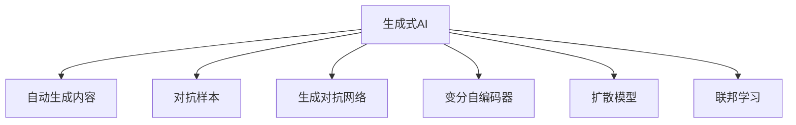
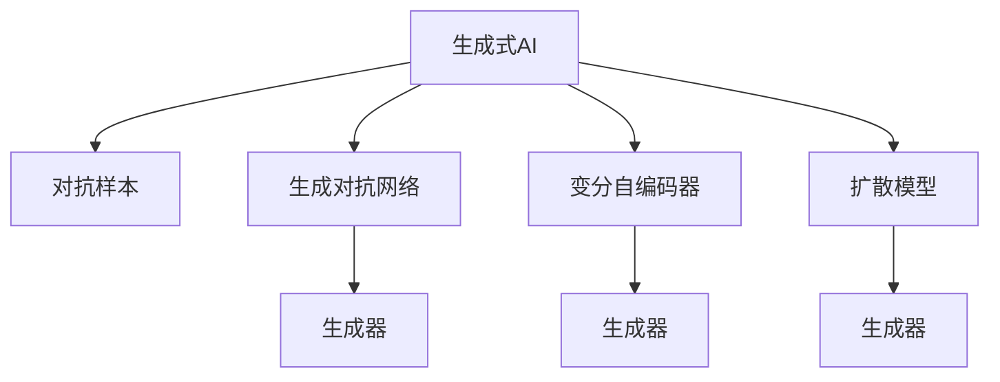
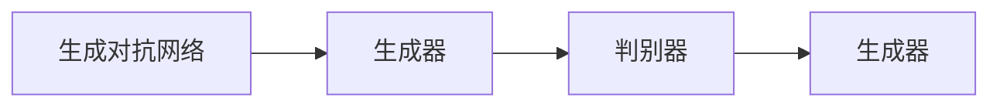
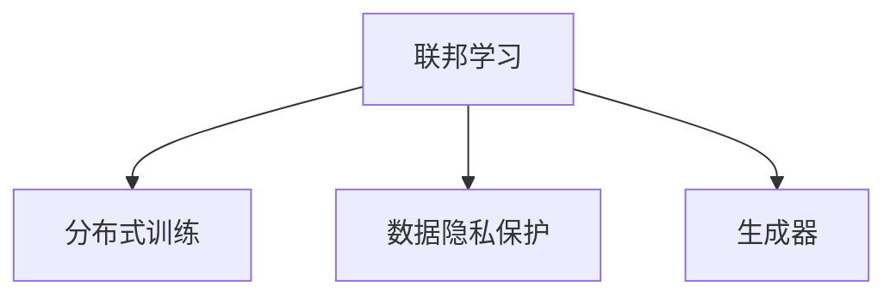
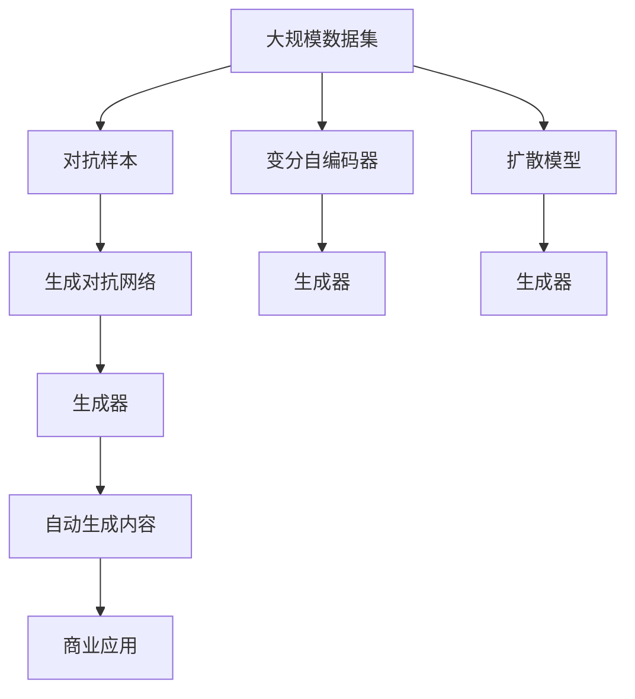

                 

# 生成式AIGC：从实验室到商业应用的落地

> 关键词：生成式AI, AIGC, 自动生成内容, 对抗样本, 生成对抗网络, 无监督学习, 联邦学习

## 1. 背景介绍

### 1.1 问题由来
生成式人工智能(AI)正在成为当今技术发展的一个新趋势，这主要得益于生成对抗网络（GANs）和变分自编码器（VAEs）等深度学习模型的飞速进步。这些技术通过训练大模型，能够创造出高质量、符合用户需求的生成内容，如自然语言文本、图像、音频等。生成式AI已经在音乐创作、艺术生成、虚拟现实、智能家居等领域得到了广泛应用，带来了颠覆性的改变。

### 1.2 问题核心关键点
生成式AI的核心挑战在于如何在大规模数据集上训练生成模型，使其生成的内容在自然性、真实性和多样性等方面达到人类水平。为了克服这些挑战，学术界和工业界开发出了各种先进的生成模型，如GANs、VAEs、扩散模型（Diffusion Models）等，这些模型通过无监督学习、对抗学习等技术手段，不断提升生成内容的质量。

生成式AI的另一个关键点是其在商业应用中的落地。生成式AI不仅具备高度的技术创新性，还能够通过生成高质量的创意内容，为广告、媒体、游戏等多个领域带来巨大的商业价值。然而，如何使这些技术从实验室走向实际应用，仍是一个巨大的挑战。

### 1.3 问题研究意义
研究生成式AI的商业应用落地，对于推动人工智能技术的产业化进程，具有重要的意义：

1. **降低生成成本**：生成式AI能够自动化地生成大量的内容，减少人工创作成本，提高内容生产效率。
2. **提升用户体验**：生成式AI可以提供个性化、多样化的内容，增强用户体验，满足用户多元化需求。
3. **促进创新**：生成式AI为创作者提供了新的工具和方法，可以加速创意和创新的产出。
4. **支持新业务**：生成式AI能够创造新的商业模式和产品，如虚拟现实体验、个性化推荐系统等，推动技术创新和市场增长。
5. **赋能产业升级**：生成式AI为传统行业数字化转型提供了新的技术路径，帮助企业提升竞争力。

## 2. 核心概念与联系

### 2.1 核心概念概述

为了更好地理解生成式AI及其商业应用的落地，本节将介绍几个密切相关的核心概念：

- **生成式AI (Generative AI)**：使用深度学习模型生成新内容的技术，包括文本生成、图像生成、音乐生成等。
- **自动生成内容 (Auto-Generated Content)**：指使用AI自动生成的新内容，如文章、图像、音乐等。
- **对抗样本 (Adversarial Examples)**：通过对抗性攻击生成的、扰动极小的数据样本，用于提升模型的鲁棒性和泛化能力。
- **生成对抗网络 (Generative Adversarial Networks, GANs)**：一种通过对抗训练提升生成模型性能的深度学习架构，由生成器和判别器两部分组成。
- **变分自编码器 (Variational Autoencoder, VAEs)**：一种通过变分推断生成数据的深度学习模型，能够学习数据的隐含表示。
- **扩散模型 (Diffusion Models)**：一种基于时间倒序生成数据的深度学习模型，能够生成高质量的图像和视频。
- **联邦学习 (Federated Learning)**：一种分布式机器学习技术，多个客户端在本地训练模型，通过参数交换实现全局模型更新。

这些核心概念之间的逻辑关系可以通过以下Mermaid流程图来展示：



这个流程图展示了生成式AI的主要组件及其关系：

1. 生成式AI通过生成自动生成的内容，提供新的应用场景。
2. 对抗样本和生成对抗网络用于提升生成模型的性能。
3. 变分自编码器和扩散模型用于生成高质内容。
4. 联邦学习用于分布式训练生成模型，提升模型质量和数据隐私保护。

这些核心概念共同构成了生成式AI的完整框架，使其能够在各种场景下发挥强大的生成能力。通过理解这些核心概念，我们可以更好地把握生成式AI的工作原理和优化方向。

### 2.2 概念间的关系

这些核心概念之间存在着紧密的联系，形成了生成式AI的整体生态系统。下面我通过几个Mermaid流程图来展示这些概念之间的关系。

#### 2.2.1 生成式AI的生成范式



这个流程图展示了生成式AI的生成范式，即通过对抗样本和生成对抗网络、变分自编码器和扩散模型等技术，提升生成器的性能，生成高质量的自动内容。

#### 2.2.2 生成对抗网络与对抗样本的关系



这个流程图展示了生成对抗网络的基本架构，生成器和判别器通过对抗训练不断提升性能，生成器生成高质量的自动内容。

#### 2.2.3 联邦学习在大规模生成中的应用



这个流程图展示了联邦学习在大规模生成中的应用，通过分布式训练和数据隐私保护，提升生成器的质量和泛化能力。

### 2.3 核心概念的整体架构

最后，我们用一个综合的流程图来展示这些核心概念在大规模生成中的整体架构：



这个综合流程图展示了从大规模数据集到自动生成内容，再到商业应用的完整过程。对抗样本和生成对抗网络用于提升生成器的性能，变分自编码器和扩散模型用于生成高质内容，联邦学习用于分布式训练和数据隐私保护。通过这些技术手段，最终实现高质量的自动内容生成和商业应用落地。 通过这些流程图，我们可以更清晰地理解生成式AI的生成过程和各个组件的协作，为后续深入讨论具体的生成技术奠定基础。

## 3. 核心算法原理 & 具体操作步骤
### 3.1 算法原理概述

生成式AI的核心原理是通过深度学习模型自动生成内容。常用的生成模型包括GANs、VAEs、扩散模型等，这些模型通过无监督学习、对抗训练等技术手段，不断提升生成内容的自然性和真实性。

以生成对抗网络（GANs）为例，其核心思想是通过生成器和判别器的对抗训练，逐步提升生成器的性能，使其生成的内容能够通过判别器的鉴别。具体步骤如下：

1. **初始化生成器和判别器**：生成器用于生成样本，判别器用于区分样本是真实的还是生成的。
2. **对抗训练**：通过迭代训练，生成器和判别器相互博弈，生成器的目标是生成更逼真的样本，判别器的目标是更准确地区分样本。
3. **优化损失函数**：设计合适的损失函数，如Wasserstein距离、交叉熵等，用于评估生成器和判别器的性能，并指导模型参数的更新。
4. **生成高质量样本**：经过多轮对抗训练，生成器能够生成高质量的自动内容。

### 3.2 算法步骤详解

这里以生成对抗网络（GANs）为例，详细讲解其具体的操作步骤：

**Step 1: 准备数据集**
- 收集大规模无标签数据集，如自然语言文本、图像等。
- 对数据进行预处理，如数据增强、归一化等。

**Step 2: 初始化生成器和判别器**
- 使用随机噪声作为输入，初始化生成器的参数。
- 初始化判别器的参数，将其设定为简单分类器。

**Step 3: 训练生成器和判别器**
- 在每个epoch内，生成器生成样本，判别器进行鉴别。
- 计算生成器和判别器的损失函数，更新模型参数。
- 迭代训练，直到生成器和判别器达到平衡状态。

**Step 4: 生成高质量样本**
- 使用训练好的生成器生成高质量的自动内容。
- 通过评估指标（如自然性、多样性等）评估生成内容的质量。

### 3.3 算法优缺点

生成对抗网络（GANs）的优点包括：
1. **高效生成**：生成器能够快速生成高质量的自动内容。
2. **多样化**：生成的内容具有多样性，能够满足不同用户的需求。
3. **鲁棒性**：生成器能够生成对抗样本，提升模型的泛化能力。

其缺点包括：
1. **训练不稳定**：生成器和判别器之间的对抗训练存在不稳定的问题，需要进行多次迭代才能收敛。
2. **模式崩溃**：生成器可能会陷入局部最优，生成的内容重复性较高。
3. **生成器退化**：在训练过程中，生成器可能会逐渐退化，生成内容质量下降。

### 3.4 算法应用领域

生成对抗网络（GANs）已经在多个领域得到了应用，例如：

- **图像生成**：生成逼真的图像，用于电影特效、艺术创作等。
- **音乐生成**：生成高质量的音乐作品，用于游戏、电影等。
- **文本生成**：生成自然流畅的文本，用于自动摘要、对话系统等。
- **虚拟现实**：生成逼真的虚拟环境，用于游戏、娱乐等。
- **自然语言处理**：生成高质量的自然语言文本，用于对话系统、自动写作等。

除了这些应用场景，生成式AI还在医疗、法律、金融等领域展现了巨大的潜力，为这些行业带来了新的解决方案和创新机会。

## 4. 数学模型和公式 & 详细讲解 & 举例说明
### 4.1 数学模型构建

本节将使用数学语言对生成对抗网络（GANs）的生成过程进行更加严格的刻画。

记生成器和判别器分别为 $G$ 和 $D$，其中 $G$ 将随机噪声 $z$ 映射为生成样本 $x$，$D$ 将样本 $x$ 分类为真实样本（标签为 1）和生成样本（标签为 0）。设 $p_{data}$ 为真实数据分布，$p_{gen}$ 为生成数据分布。则GANs的目标是最小化生成器的损失函数和最大化判别器的损失函数，即：

$$
\min_G \max_D V(D,G) = \min_G \max_D E_{x \sim p_{data}} [\log D(x)] + E_{z \sim p(z)} [\log (1 - D(G(z)))]
$$

其中 $V(D,G)$ 为生成器-判别器的价值函数，$E_{x \sim p_{data}}$ 和 $E_{z \sim p(z)}$ 分别为真实样本和生成样本的期望值。

生成器的损失函数为：

$$
L_G = -E_{z \sim p(z)} [\log (1 - D(G(z)))]
$$

判别器的损失函数为：

$$
L_D = -E_{x \sim p_{data}} [\log D(x)] - E_{z \sim p(z)} [\log (1 - D(G(z)))]
$$

在训练过程中，通过反向传播算法计算损失函数的梯度，并使用优化算法（如Adam、SGD等）更新生成器和判别器的参数。

### 4.2 公式推导过程

以下我们以GANs为例，推导生成器和判别器的损失函数及其梯度的计算公式。

首先定义生成器和判别器的输出：

- 生成器：$G(z) \in \mathcal{X}$，将随机噪声 $z \in \mathcal{Z}$ 映射为生成样本。
- 判别器：$D(x) \in [0,1]$，将样本 $x \in \mathcal{X}$ 分类为真实样本（标签为 1）和生成样本（标签为 0）。

生成器的损失函数为：

$$
L_G = -E_{z \sim p(z)} \log (1 - D(G(z)))
$$

判别器的损失函数为：

$$
L_D = -E_{x \sim p_{data}} \log D(x) - E_{z \sim p(z)} \log (1 - D(G(z)))
$$

损失函数的梯度计算公式如下：

- 生成器的梯度：
  $$
  \nabla_G L_G = -E_{z \sim p(z)} \nabla_{G(z)} \log (1 - D(G(z)))
  $$
- 判别器的梯度：
  $$
  \nabla_D L_D = -E_{x \sim p_{data}} \nabla_{D(x)} \log D(x) - E_{z \sim p(z)} \nabla_{D(G(z))} \log (1 - D(G(z)))
  $$

通过反向传播算法，生成器和判别器的参数不断更新，直至达到最优状态。

### 4.3 案例分析与讲解

以生成文本为例，我们定义一个简单的生成器和一个判别器，生成文本并评估其质量。生成器可以是一个基于RNN或Transformer的模型，判别器可以是一个分类器，用于区分生成的文本和真实文本。通过对抗训练，生成器逐渐提升其生成文本的质量。

**Step 1: 准备数据集**
- 收集大规模无标签文本数据，如小说、新闻等。
- 对数据进行预处理，如分词、去停用词等。

**Step 2: 初始化生成器和判别器**
- 使用随机噪声作为输入，初始化生成器的参数。
- 初始化判别器的参数，将其设定为简单分类器。

**Step 3: 训练生成器和判别器**
- 在每个epoch内，生成器生成文本，判别器进行鉴别。
- 计算生成器和判别器的损失函数，更新模型参数。
- 迭代训练，直到生成器和判别器达到平衡状态。

**Step 4: 生成高质量文本**
- 使用训练好的生成器生成高质量的文本。
- 通过评估指标（如自然性、多样性等）评估生成文本的质量。

例如，我们使用一个基于Transformer的生成模型和一个简单的分类器，生成一篇关于人工智能的文章。通过多次对抗训练，生成器的输出文本逐渐接近真实文本，最后生成的文本质量较高，具有较好的自然性和多样性。

## 5. 项目实践：代码实例和详细解释说明
### 5.1 开发环境搭建

在进行生成式AI项目实践前，我们需要准备好开发环境。以下是使用Python进行TensorFlow和PyTorch开发的环境配置流程：

1. 安装Anaconda：从官网下载并安装Anaconda，用于创建独立的Python环境。

2. 创建并激活虚拟环境：
```bash
conda create -n tf-env python=3.8 
conda activate tf-env
```

3. 安装TensorFlow和PyTorch：
```bash
conda install tensorflow pytorch torchvision torchaudio
```

4. 安装各类工具包：
```bash
pip install numpy pandas scikit-learn matplotlib tqdm jupyter notebook ipython
```

完成上述步骤后，即可在`tf-env`环境中开始生成式AI项目实践。

### 5.2 源代码详细实现

这里我们以GANs生成图像为例，给出使用TensorFlow和PyTorch进行GANs训练的代码实现。

首先，定义GANs的模型结构：

```python
import tensorflow as tf
from tensorflow.keras import layers

# 定义生成器
class Generator(tf.keras.Model):
    def __init__(self):
        super(Generator, self).__init__()
        self.dense1 = layers.Dense(256, input_dim=100)
        self.dense2 = layers.Dense(256)
        self.dense3 = layers.Dense(784, activation='tanh')

    def call(self, inputs):
        x = self.dense1(inputs)
        x = tf.keras.layers.LeakyReLU(alpha=0.2)(x)
        x = self.dense2(x)
        x = tf.keras.layers.LeakyReLU(alpha=0.2)(x)
        x = self.dense3(x)
        return x

# 定义判别器
class Discriminator(tf.keras.Model):
    def __init__(self):
        super(Discriminator, self).__init__()
        self.dense1 = layers.Dense(256, input_dim=784)
        self.dense2 = layers.Dense(256)
        self.dense3 = layers.Dense(1, activation='sigmoid')

    def call(self, inputs):
        x = self.dense1(inputs)
        x = tf.keras.layers.LeakyReLU(alpha=0.2)(x)
        x = self.dense2(x)
        x = tf.keras.layers.LeakyReLU(alpha=0.2)(x)
        x = self.dense3(x)
        return x
```

然后，定义损失函数和优化器：

```python
# 定义生成器的损失函数
def generator_loss(fake_output, real_output):
    real_loss = tf.reduce_mean(tf.nn.sigmoid_cross_entropy_with_logits(logits=fake_output, labels=tf.ones_like(fake_output)))
    fake_loss = tf.reduce_mean(tf.nn.sigmoid_cross_entropy_with_logits(logits=fake_output, labels=tf.zeros_like(fake_output)))
    return -(real_loss + fake_loss)

# 定义判别器的损失函数
def discriminator_loss(real_output, fake_output):
    real_loss = tf.reduce_mean(tf.nn.sigmoid_cross_entropy_with_logits(logits=real_output, labels=tf.ones_like(real_output)))
    fake_loss = tf.reduce_mean(tf.nn.sigmoid_cross_entropy_with_logits(logits=fake_output, labels=tf.zeros_like(fake_output)))
    return -(real_loss + fake_loss)

# 定义优化器
optimizer = tf.keras.optimizers.Adam(learning_rate=0.0002)
```

接着，定义训练函数：

```python
# 定义训练函数
@tf.function
def train_step(images):
    with tf.GradientTape() as gen_tape, tf.GradientTape() as disc_tape:
        gen_input = tf.random.normal([BATCH_SIZE, 100])
        gen_output = generator(gen_input, training=True)
        disc_output_real = discriminator(images, training=True)
        disc_output_fake = discriminator(gen_output, training=True)
        
        gen_loss = generator_loss(gen_output, disc_output_fake)
        disc_loss = discriminator_loss(images, disc_output_real)

    gradients_of_gen = gen_tape.gradient(gen_loss, generator.trainable_variables)
    gradients_of_disc = disc_tape.gradient(disc_loss, discriminator.trainable_variables)

    optimizer.apply_gradients(zip(gradients_of_gen, generator.trainable_variables))
    optimizer.apply_gradients(zip(gradients_of_disc, discriminator.trainable_variables))
```

最后，启动训练流程：

```python
# 定义数据集
(x_train, _), (_, _) = tf.keras.datasets.mnist.load_data()
x_train = x_train / 255.0
x_train = x_train.reshape(-1, 784)

# 定义超参数
BATCH_SIZE = 32
EPOCHS = 200
SAMPLES = 64

# 训练过程
for epoch in range(EPOCHS):
    for i in range(0, len(x_train), BATCH_SIZE):
        train_step(x_train[i:i+BATCH_SIZE])
    
    # 生成样本
    gen_input = tf.random.normal([SAMPLES, 100])
    gen_output = generator(gen_input, training=False)
    gen_output = gen_output.numpy()
    
    # 显示样本
    fig, ax = plt.subplots(8, 8, figsize=(6, 6))
    ax = ax.flatten()
    for j in range(SAMPLES):
        ax[j].imshow(gen_output[j, :, :, 0], cmap='gray')
        ax[j].axis('off')
    plt.show()
```

以上就是使用TensorFlow和PyTorch进行GANs训练的完整代码实现。可以看到，通过TensorFlow和PyTorch的深度学习框架，可以非常方便地实现GANs模型的训练和生成。

### 5.3 代码解读与分析

这里我们详细解读一下关键代码的实现细节：

**GANs模型结构**：
- 生成器：由多个全连接层和激活函数组成，将随机噪声映射为图像。
- 判别器：由多个全连接层和激活函数组成，用于分类真实图像和生成图像。

**损失函数和优化器**：
- 生成器的损失函数使用交叉熵损失，判别器的损失函数也使用交叉熵损失。
- 使用Adam优化器进行模型参数更新。

**训练函数**：
- 定义一个训练函数，使用梯度上升算法更新生成器和判别器的参数。
- 在每个epoch内，随机生成噪声，通过生成器和判别器生成图像，计算损失函数并更新参数。
- 在训练过程中，使用tf.GradientTape计算梯度，使用optimizer.apply_gradients更新模型参数。

**代码运行结果展示**：
- 在训练过程中，每epoch输出一次生成的图像，可视化生成效果。
- 在训练结束后，输出最终的生成图像，展示训练结果。

通过TensorFlow和PyTorch的深度学习框架，可以方便地实现GANs模型的训练和生成，进一步探索生成式AI的商业应用落地。

## 6. 实际应用场景
### 6.1 图像生成

生成对抗网络（GANs）在图像生成领域取得了显著的成果。GANs可以生成高质量的图像，用于电影特效、艺术创作、广告设计等。例如，使用GANs生成逼真的人脸图像，用于电影和游戏中的角色动画，极大地提升了视觉体验。

### 6.2 文本生成

生成对抗网络（GANs）和变分自编码器（VAEs）在文本生成领域也有广泛应用。通过训练生成模型，能够生成自然流畅的文本，用于自动摘要、对话系统等。例如，使用GANs生成自然流畅的对话，用于虚拟客服、智能助手等，提升用户交互体验。

### 6.3 音乐生成

生成对抗网络（GANs）在音乐生成领域也展现了巨大的潜力。通过训练生成模型，能够生成高质量的音乐作品，用于电影、游戏等。例如，使用GANs生成逼真的音乐背景，提升用户体验，使音乐作品更具感染力。

### 6.4 虚拟现实

生成对抗网络（GANs）在虚拟现实领域也得到了应用。通过生成逼真的虚拟环境，用户可以沉浸式地体验虚拟现实游戏、虚拟旅游等。例如，使用GANs生成逼真的城市景观，提升虚拟现实游戏的沉浸感和真实感。

### 6.5 自然语言处理

生成对抗网络（GANs）和变分自编码器（VAEs）在自然语言处理领域也有广泛应用。通过训练生成模型，能够生成高质量的自然语言文本，用于对话系统、自动写作等。例如，使用GANs生成自然流畅的对话，用于智能客服、智能助手等，提升用户交互体验。

### 6.6 未来的应用展望

随着生成式AI技术的不断发展，其在各个领域的应用前景将会更加广阔。未来，生成式AI将会在以下几个方面继续拓展：

1. **大规模数据处理**：随着计算能力的提升和存储技术的进步，生成式AI能够处理更大规模的数据，生成更高质量的内容。
2. **跨领域融合**：生成式AI与其他技术（如增强现实、虚拟现实、虚拟助手等）进行融合，拓展应用场景，提供更丰富的用户体验。
3. **实时生成**：通过优化生成模型和算法，实现实时生成内容，提升用户体验和互动性。
4. **智能内容推荐**：生成式AI结合推荐系统，提供个性化的内容推荐服务，满足用户的个性化需求。
5. **智能创意辅助**：生成式AI为创意工作者提供智能辅助工具，提升创意产出效率和质量。

以上应用场景展示了生成式AI的广泛前景和巨大潜力。随着技术的不断进步，生成式AI必将在各个领域大放异彩，推动人工智能技术的产业化进程。

## 7. 工具和资源推荐
### 7.1 学习资源推荐

为了帮助开发者系统掌握生成式AI的理论基础和实践技巧，这里推荐一些优质的学习资源：

1. **《深度学习》课程**：由斯坦福大学开设的深度学习课程，涵盖机器学习、深度学习、生成式AI等内容，适合初学者和进阶学习者。

2. **《生成式对抗网络：理论与实践》书籍**：介绍生成对抗网络的基本原理、训练技巧和应用案例，是学习生成式AI的重要参考资料。

3. **TensorFlow官方文档**：TensorFlow的官方文档，提供了生成式AI的完整示例和详细教程，是快速入门的必备资源。

4. **PyTorch官方文档**：PyTorch的官方文档，提供了生成式AI的完整示例和详细教程，是快速入门的必备资源。

5. **HuggingFace官方文档**：HuggingFace的官方文档，提供了生成式AI的完整示例和详细教程，是快速入门的必备资源。

通过对这些资源的学习实践，相信你一定能够快速掌握生成式AI的精髓，并用于解决实际的生成内容生成问题。

### 7.2 开发工具推荐

高效的开发离不开优秀的工具支持。以下是几款用于生成式AI开发的工具：

1. **TensorFlow**：由Google主导开发的深度学习框架，灵活

