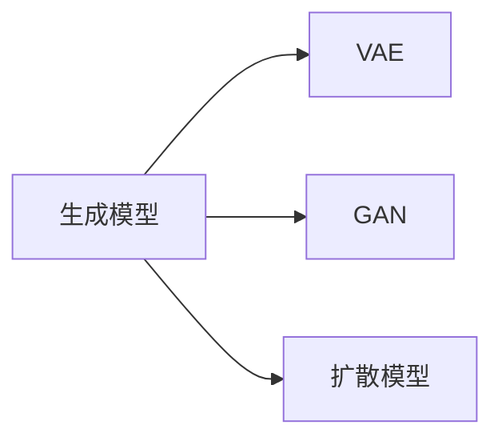
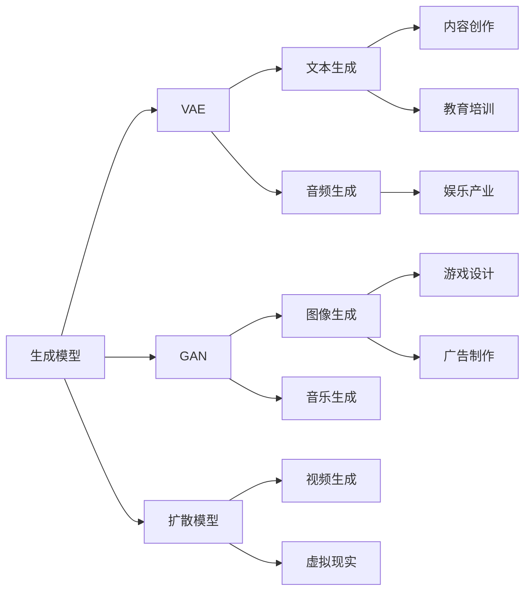

                 

# 生成式AI：金矿还是泡沫？第六部分：AIGC将是未来10年的长坡厚雪

## 1. 背景介绍

### 1.1 问题由来
随着AI技术的发展，尤其是深度学习、计算机视觉和自然语言处理等领域的突破，生成式AI（Generative AI，简称AIGC）的概念逐渐被提上日程。AIGC的核心理念是使用AI技术生成具有高度逼真、智能化的内容，如文本、图像、音频等，广泛应用于内容创作、娱乐、教育等多个领域。

但与此同时，AIGC技术也引发了广泛的伦理、法律和社会关注，不少人质疑其带来的威胁和风险，甚至将其比作未来的"泡沫"。如何看待AIGC技术，它的未来发展趋势如何？这些问题已成为当前AI领域的重要研究课题。

### 1.2 问题核心关键点
AIGC技术涉及生成模型、深度学习、优化算法、数据集等多个关键技术领域，通过在特定任务上进行训练，使用生成模型生成与输入数据高度相似或相关的输出。AIGC技术的核心点在于其生成内容的真实性和创造力，具体表现为以下几个方面：

- **生成模型**：如变分自编码器（VAE）、生成对抗网络（GAN）、扩散模型等，是AIGC技术的核心引擎，负责生成高质量的输出内容。
- **深度学习**：通过神经网络对大量数据进行学习，提取出有效的特征和模式，用于指导生成模型的训练。
- **优化算法**：如梯度下降、Adam等，在训练过程中不断调整模型参数，使其生成的输出更接近目标。
- **数据集**：用于训练生成模型的数据集，如ImageNet、COCO等，这些数据集中的高质量样本能够提升生成模型的表现。

AIGC技术在内容创作、游戏设计、教育培训等多个领域展现了巨大潜力，但同时也存在生成结果不真实、数据隐私问题、版权争议等风险，需要进行综合权衡和评估。

## 2. 核心概念与联系

### 2.1 核心概念概述
为了更好地理解AIGC技术，下面我们将介绍几个关键概念：

- **生成模型**：用于生成具有一定随机性的输出，如图像、音乐、文本等，具有高度逼真和智能化的特性。
- **变分自编码器（VAE）**：一种生成模型，通过学习数据的概率分布，生成新的样本。
- **生成对抗网络（GAN）**：由生成器和判别器两个网络组成，生成器和判别器相互竞争，最终生成的样本逼近真实数据。
- **扩散模型**：通过逐步增加噪声的方式生成高质量的图像和视频，具有较低的计算复杂度和较高的图像质量。

### 2.2 概念间的关系

AIGC技术的核心在于生成模型的设计，不同的生成模型具有不同的特点和适用场景。它们之间的关系可以用以下的Mermaid流程图来展示：



这个流程图展示了三种主要生成模型之间的关系：VAE、GAN和扩散模型。它们通过不同的方式生成内容，各有优缺点，具体应用场景也不同。

### 2.3 核心概念的整体架构

下面我们将用一个大图展示AIGC技术的整体架构：



这个大图展示了生成模型在不同领域的应用。其中VAE用于文本生成，GAN用于图像生成，扩散模型用于视频生成，音频生成则可以使用VAE和GAN技术。这些生成技术在内容创作、游戏设计、广告制作、教育培训等多个领域得到广泛应用，展现了AIGC技术的巨大潜力。

## 3. 核心算法原理 & 具体操作步骤
### 3.1 算法原理概述

AIGC技术基于生成模型，使用深度学习算法对大量数据进行学习，提取出有效的特征和模式，用于指导生成模型的训练。其核心算法包括：

- 变分自编码器（VAE）：通过学习数据的概率分布，生成新的样本。
- 生成对抗网络（GAN）：由生成器和判别器两个网络组成，生成器和判别器相互竞争，最终生成的样本逼近真实数据。
- 扩散模型：通过逐步增加噪声的方式生成高质量的图像和视频。

### 3.2 算法步骤详解

以VAE为例，下面详细介绍VAE的基本原理和操作步骤：

**步骤1：数据准备**
收集大量高质量的数据，如文本、图像、音频等。

**步骤2：特征提取**
使用深度学习模型，如卷积神经网络（CNN）、循环神经网络（RNN）等，对数据进行特征提取，得到数据的高维表示。

**步骤3：VAE训练**
使用VAE模型对提取的特征进行编码和解码。VAE包括两个部分：编码器（encoder）和解码器（decoder）。编码器将输入数据转换为潜在空间的表示，解码器将潜在空间的表示转换为输出数据。

**步骤4：损失函数**
定义VAE的损失函数，包括重构误差和潜在空间的先验分布损失。重构误差表示VAE生成的输出与原数据之间的差距，潜在空间的先验分布损失则用于限制潜在空间的分布。

**步骤5：优化算法**
使用梯度下降等优化算法，不断调整模型参数，最小化损失函数，使得生成的数据尽可能逼近原数据。

### 3.3 算法优缺点
AIGC技术具有以下优点：

- **生成内容高质量**：生成模型可以生成高度逼真的内容，如逼真的图像、真实的音频、自然流畅的文本等。
- **应用广泛**：AIGC技术可以应用于内容创作、游戏设计、教育培训等多个领域，具有广泛的应用前景。
- **自动化生成**：AIGC技术可以自动生成大量高质量的内容，极大地提高内容创作的效率。

但同时，AIGC技术也存在以下缺点：

- **数据隐私问题**：生成模型的训练需要大量的数据，可能涉及用户隐私。
- **生成结果不真实**：部分生成模型可能无法生成高质量的、真实可信的内容。
- **版权争议**：生成模型生成的内容可能存在版权问题，引发法律争议。

### 3.4 算法应用领域

AIGC技术在多个领域展现出巨大的潜力：

- **内容创作**：生成高质量的文章、新闻、音乐、影视等。
- **游戏设计**：生成游戏角色、场景、故事情节等。
- **广告制作**：生成逼真的广告视频和图像，提高广告的吸引力。
- **教育培训**：生成虚拟教师、模拟实验等，提高教学效果。

## 4. 数学模型和公式 & 详细讲解 & 举例说明
### 4.1 数学模型构建

变分自编码器（VAE）是一种生成模型，其基本思想是通过学习数据的概率分布，生成新的样本。其数学模型可以表示为：

$$
p(z|x) = \mathcal{N}(z|\mu_x, \Sigma_x), \quad p(x|z) = \mathcal{N}(x|h(z), \Sigma_x), \quad p(x) = \mathcal{N}(x|0, I)
$$

其中，$z$表示潜在空间的表示，$x$表示输入数据，$\mu_x$和$\Sigma_x$分别表示编码器输出的均值和方差，$h(z)$表示解码器输出的均值，$\Sigma_x$表示解码器输出的方差。

### 4.2 公式推导过程

以VAE的编码器为例，其训练过程可以表示为：

1. 定义VAE的损失函数：
$$
\mathcal{L} = \mathbb{E}_{p(z|x)}[\log p(x|z)] + D_{KL}(p(z|x) || q(z|x))
$$

其中，$D_{KL}(p(z|x) || q(z|x))$表示KL散度，用于约束潜在空间的分布。

2. 对损失函数进行优化：
$$
\mathcal{L} = -\frac{1}{2}\log |\Sigma_x| - \frac{1}{2}\operatorname{Tr}[(\mu_x-x)^\top \Sigma_x^{-1}(\mu_x-x)] - \frac{1}{2}\log |\Sigma_x|
$$

3. 计算梯度并更新参数：
$$
\nabla_{\theta} \mathcal{L} = \nabla_{\mu_x} \mathcal{L} + \nabla_{\Sigma_x} \mathcal{L}
$$

其中，$\nabla_{\mu_x}$和$\nabla_{\Sigma_x}$分别表示$\mu_x$和$\Sigma_x$的梯度。

### 4.3 案例分析与讲解

以VAE生成文本为例，下面详细介绍VAE的基本实现和案例分析。

**案例1：文本生成**
假设我们有一个文本数据集，包含大量新闻报道。我们的目标是使用VAE生成新的新闻报道。

1. 数据准备：将文本数据集输入到预训练的语言模型中，得到其词向量表示。
2. 特征提取：使用RNN对词向量进行编码，得到一个高维表示。
3. VAE训练：定义VAE的编码器和解码器，使用损失函数进行训练。
4. 生成新的文本：使用训练好的VAE模型生成新的文本。

**案例2：图像生成**
假设我们有一个图像数据集，包含大量人脸照片。我们的目标是使用GAN生成新的人脸照片。

1. 数据准备：将图像数据集输入到预训练的卷积神经网络中，得到其特征表示。
2. 特征提取：使用卷积神经网络对特征进行编码，得到一个高维表示。
3. GAN训练：定义GAN的生成器和判别器，使用损失函数进行训练。
4. 生成新的图像：使用训练好的GAN模型生成新的图像。

## 5. 项目实践：代码实例和详细解释说明
### 5.1 开发环境搭建

在进行AIGC技术开发时，需要使用Python、PyTorch、TensorFlow等工具。下面详细介绍开发环境的搭建步骤：

1. 安装Python：从官网下载并安装Python 3.x版本。
2. 安装PyTorch：使用以下命令进行安装：
```
pip install torch torchvision torchaudio
```
3. 安装TensorFlow：使用以下命令进行安装：
```
pip install tensorflow tensorflow-gpu tensorflow-text
```

### 5.2 源代码详细实现

以VAE生成文本为例，下面详细介绍VAE的实现步骤和代码：

**步骤1：准备数据**
首先，我们需要准备文本数据集，并将其转换为模型所需的格式。

```python
import torch
import torch.nn as nn
from torch.utils.data import DataLoader

# 准备数据集
texts = []
for text in texts_dataset:
    texts.append(text)
    
# 定义数据集
class TextDataset(Dataset):
    def __init__(self, texts):
        self.texts = texts
    
    def __len__(self):
        return len(self.texts)
    
    def __getitem__(self, idx):
        return self.texts[idx]

# 定义模型参数
latent_dim = 100  # 潜在空间的维度
embedding_dim = 100  # 词向量的维度
hidden_dim = 256  # RNN的隐藏层维度

# 定义VAE模型
class VAE(nn.Module):
    def __init__(self):
        super(VAE, self).__init__()
        self.encoder = nn.RNN(embedding_dim, hidden_dim)
        self.mean_net = nn.Linear(hidden_dim, latent_dim)
        self.std_net = nn.Linear(hidden_dim, latent_dim)
    
    def encode(self, x):
        output, _ = self.encoder(x)
        mean = self.mean_net(output)
        std = self.std_net(output)
        return mean, std
    
    def reparameterize(self, mean, std):
        eps = torch.randn_like(std)
        return eps * std + mean
    
    def decode(self, z):
        output = torch.sigmoid(self.decoder(z))
        return output
    
    def forward(self, x):
        mean, std = self.encode(x)
        z = self.reparameterize(mean, std)
        output = self.decode(z)
        return output, mean, std

# 定义优化器
optimizer = torch.optim.Adam(model.parameters(), lr=0.001)

# 定义损失函数
criterion = nn.MSELoss()
```

**步骤2：训练模型**
定义训练函数，使用梯度下降等优化算法不断调整模型参数，最小化损失函数。

```python
def train(model, train_loader, criterion, optimizer, n_epochs=100):
    for epoch in range(n_epochs):
        for batch in train_loader:
            input, target = batch
            optimizer.zero_grad()
            output, mean, std = model(input)
            loss = criterion(output, target)
            loss.backward()
            optimizer.step()
        print(f"Epoch {epoch+1}, loss: {loss:.3f}")
```

**步骤3：生成新文本**
定义生成函数，使用训练好的VAE模型生成新的文本。

```python
def generate_text(model, latent_dim, temperature=1.0):
    z = torch.randn(1, latent_dim)
    output = model.decode(z)
    output = output.data.numpy().tolist()
    return ''.join(output)

# 训练模型
model = VAE()
train_loader = DataLoader(texts_dataset, batch_size=32)
train(model, train_loader, criterion, optimizer)

# 生成新文本
new_text = generate_text(model, latent_dim)
print(new_text)
```

### 5.3 代码解读与分析

在上面的代码中，我们使用了RNN对文本进行编码，得到了潜在空间的表示。然后定义了VAE的编码器和解码器，使用重构误差和KL散度作为损失函数进行训练。最后使用训练好的模型生成新的文本。

VAE的生成过程主要包括以下几个步骤：

1. 随机生成潜在空间的表示$z$。
2. 使用解码器将潜在空间的表示转换为输出。
3. 对输出进行采样，得到新的文本。

VAE的生成效果取决于模型参数和训练数据的质量。在实际应用中，需要不断优化模型和训练数据，以生成更高质量的文本。

## 6. 实际应用场景

### 6.1 内容创作

AIGC技术在内容创作领域展现出巨大的潜力。例如，使用VAE生成新闻报道、使用GAN生成影视作品、使用扩散模型生成音乐等。这些生成的内容不仅能够降低内容创作成本，还能提升内容的多样性和丰富性。

**案例1：生成新闻报道**
假设我们需要生成一篇关于新冠疫情的新闻报道。首先，我们将已有的新闻报道数据集输入到VAE中，训练生成模型。然后，使用生成模型生成新的新闻报道，并进行后续的编辑和修改，以得到高质量的输出。

**案例2：生成影视作品**
使用GAN生成影视作品时，首先需要准备一个高质量的影视数据集，然后使用GAN进行训练。训练过程中，判别器和生成器相互竞争，最终生成的影视作品将具有高度的真实感和逼真度。

### 6.2 游戏设计

游戏设计是AIGC技术的重要应用领域之一。例如，使用VAE生成游戏角色、使用GAN生成游戏场景、使用扩散模型生成游戏情节等。这些生成的内容可以大大提高游戏设计和开发的效率。

**案例1：生成游戏角色**
使用VAE生成游戏角色时，首先需要准备一个高质量的游戏角色数据集，然后使用VAE进行训练。训练过程中，VAE可以学习到游戏角色的关键特征和动作，从而生成逼真、多样化的游戏角色。

**案例2：生成游戏场景**
使用GAN生成游戏场景时，首先需要准备一个高质量的游戏场景数据集，然后使用GAN进行训练。训练过程中，GAN可以生成高度逼真的游戏场景，从而提升游戏的视觉体验。

### 6.3 广告制作

广告制作是AIGC技术的另一个重要应用领域。例如，使用VAE生成广告视频、使用GAN生成广告图像等。这些生成的内容可以提高广告的吸引力，提升广告效果。

**案例1：生成广告视频**
使用VAE生成广告视频时，首先需要准备一个高质量的广告视频数据集，然后使用VAE进行训练。训练过程中，VAE可以学习到广告视频的关键特征和情节，从而生成高度逼真的广告视频。

**案例2：生成广告图像**
使用GAN生成广告图像时，首先需要准备一个高质量的广告图像数据集，然后使用GAN进行训练。训练过程中，GAN可以生成高度逼真的广告图像，从而提升广告的吸引力。

## 7. 工具和资源推荐

### 7.1 学习资源推荐

为了帮助开发者深入理解AIGC技术的原理和实践，下面推荐一些优质的学习资源：

1. **《生成对抗网络：理论与实践》**：介绍了GAN的基本原理、算法和应用，是理解GAN技术的入门教材。
2. **《生成自编码器：原理与实践》**：介绍了VAE的基本原理、算法和应用，是理解VAE技术的入门教材。
3. **《深度学习基础》**：深入浅出地介绍了深度学习的基本概念和算法，是深度学习的入门教材。
4. **《计算机视觉：现代方法》**：介绍了计算机视觉的基本原理和应用，是计算机视觉的入门教材。
5. **《自然语言处理综论》**：介绍了自然语言处理的基本概念和算法，是自然语言处理的入门教材。

通过学习这些教材，可以全面掌握AIGC技术的核心原理和应用方法。

### 7.2 开发工具推荐

在开发AIGC技术时，需要使用一些高效的开发工具。下面推荐一些常用的开发工具：

1. **PyTorch**：深度学习框架，提供了丰富的深度学习模型和工具，是AIGC技术开发的主流框架。
2. **TensorFlow**：深度学习框架，提供了丰富的深度学习模型和工具，是AIGC技术开发的备选框架。
3. **Jupyter Notebook**：交互式开发环境，方便开发者进行代码调试和数据分析。
4. **Git**：版本控制系统，方便开发者进行代码版本控制和管理。

这些工具可以大大提升AIGC技术的开发效率，让开发者更加专注于算法和模型设计。

### 7.3 相关论文推荐

为了深入理解AIGC技术的最新进展，下面推荐一些高质量的相关论文：

1. **《Generative Adversarial Nets》**：提出GAN的基本原理和算法，是GAN技术的奠基性论文。
2. **《Auto-Encoding Variational Bayes》**：提出VAE的基本原理和算法，是VAE技术的奠基性论文。
3. **《Denoising Auto-Encoders with Mixture Density Layers and a Variational Bound on the Likelihood》**：提出扩散模型和VAE的结合方法，提升了图像生成质量。
4. **《A Style-Based Generator Architecture for Generative Adversarial Networks》**：提出风格生成模型，提升了GAN的生成质量和多样性。
5. **《Deep Adversarial Generation of Anatomical Images》**：提出生成解剖学图像的GAN模型，提升了医学图像的生成效果。

这些论文代表了AIGC技术的最新进展，可以帮助开发者全面掌握该技术的核心算法和应用方法。

## 8. 总结：未来发展趋势与挑战

### 8.1 研究成果总结

AIGC技术在内容创作、游戏设计、广告制作等多个领域展现出巨大的潜力，但也面临数据隐私、版权争议等诸多挑战。未来，AIGC技术需要在优化算法、提升生成质量、保护数据隐私等方面不断努力，以实现更广泛的应用和更广泛的影响。

### 8.2 未来发展趋势

未来，AIGC技术将呈现以下几个发展趋势：

1. **生成模型多样化**：未来的生成模型将更加多样化，不仅包括VAE、GAN、扩散模型等，还将出现更多新型生成模型，如变分自编码器（VAE）、自回归模型（AR）等。
2. **生成质量提升**：未来的生成模型将生成更高质量、更逼真的内容，如更真实的图像、更自然的文本等。
3. **跨领域应用拓展**：未来的AIGC技术将广泛应用于多个领域，如医疗、教育、娱乐等，带来更广泛的影响。
4. **人机协同增强**：未来的AIGC技术将与人工智能、机器学习等技术进一步融合，提升生成内容的智能化水平。

### 8.3 面临的挑战

虽然AIGC技术展现出巨大的潜力，但也面临诸多挑战：

1. **数据隐私问题**：AIGC技术的生成需要大量的高质量数据，可能涉及用户隐私，如何保护用户隐私是重要的研究方向。
2. **生成结果不真实**：部分生成模型可能无法生成高质量的、真实可信的内容，如何提升生成质量是重要的研究方向。
3. **版权争议**：AIGC技术生成的内容可能存在版权问题，如何避免版权争议是重要的研究方向。
4. **计算资源消耗**：AIGC技术的训练和推理需要大量的计算资源，如何降低计算资源消耗是重要的研究方向。
5. **伦理和道德问题**：AIGC技术可能引发伦理和道德问题，如虚假信息传播、误导性输出等，如何避免这些问题是重要的研究方向。

### 8.4 研究展望

未来的AIGC技术需要在多个方向进行深入研究，以解决上述挑战：

1. **数据隐私保护**：开发数据隐私保护技术，如差分隐私、联邦学习等，保护用户隐私。
2. **生成质量提升**：开发更高效的生成模型和优化算法，提升生成质量和逼真度。
3. **版权争议避免**：开发版权识别和保护技术，避免版权争议。
4. **计算资源优化**：优化生成模型的计算图和推理算法，降低计算资源消耗。
5. **伦理和道德研究**：研究AIGC技术的伦理和道德问题，制定相关规范和标准。

只有不断解决这些挑战，AIGC技术才能真正发挥其潜力，为社会带来更多的价值。

## 9. 附录：常见问题与解答

**Q1：AIGC技术是否容易被复制？**

A: AIGC技术的生成模型可以被复制，但高质量的生成模型需要大量的高质量数据和计算资源进行训练，难以被轻易复制。同时，不同的生成模型具有不同的特点和应用场景，需要根据具体任务进行选择。

**Q2：AIGC技术是否会导致版权问题？**

A: AIGC技术生成的内容可能存在版权问题，需要在生成过程中加入版权信息，避免生成侵权内容。同时，开发者需要遵守相关法律法规，确保生成的内容不涉及版权侵权。

**Q3：AIGC技术是否会引发伦理问题？**

A: AIGC技术生成的内容可能引发伦理问题，如虚假信息传播、误导性输出等。开发者需要在生成过程中加入伦理审查机制，确保生成的内容符合伦理规范和社会价值观。

**Q4：AIGC技术是否会引发就业问题？**

A: AIGC技术可能会替代一些简单的内容创作工作，但同时也会创造更多的就业机会。开发者需要根据具体任务进行评估，合理应用AIGC技术。

总之，AIGC技术在内容创作、游戏设计、广告制作等多个领域展现出巨大的潜力，但也面临诸多挑战。只有不断解决这些挑战，AIGC技术才能真正发挥其潜力，为社会带来更多的价值。

---

作者：禅与计算机程序设计艺术 / Zen and the Art of Computer Programming

