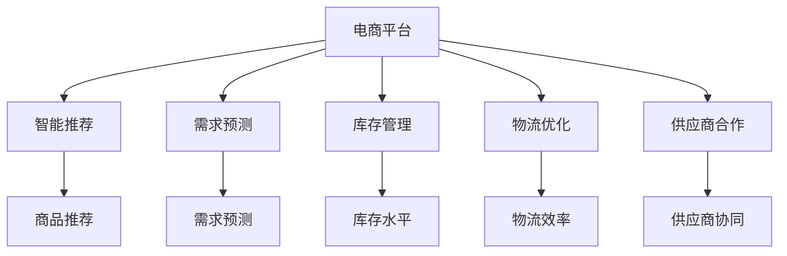
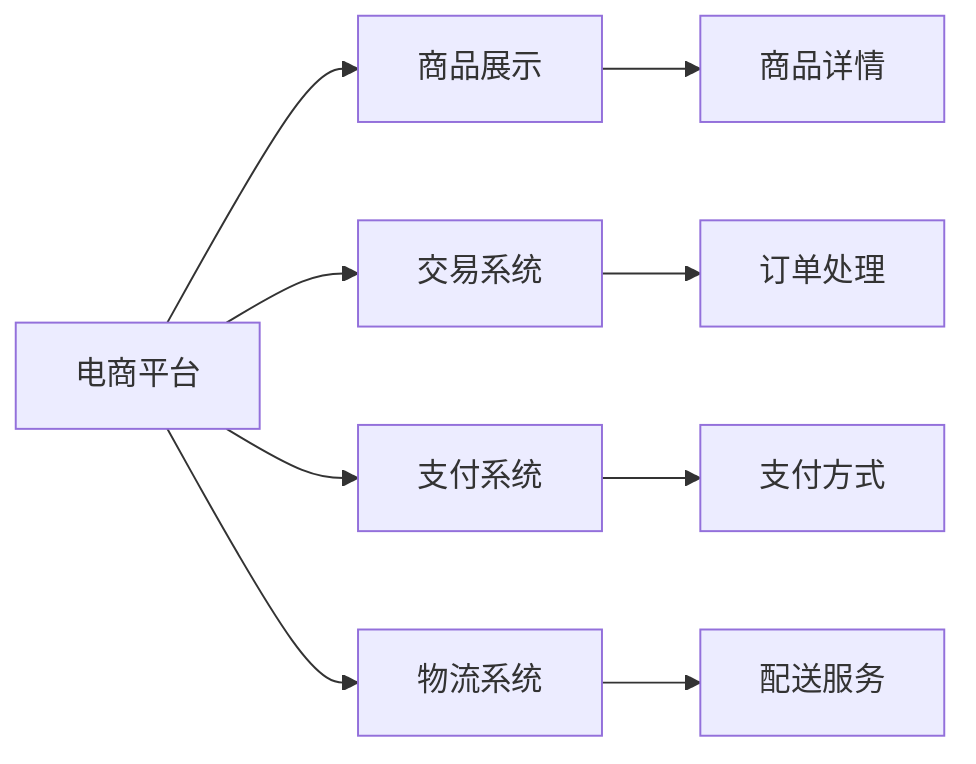
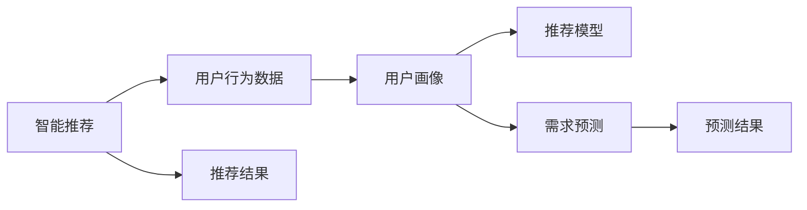
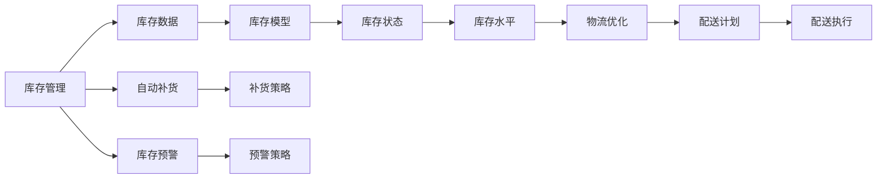
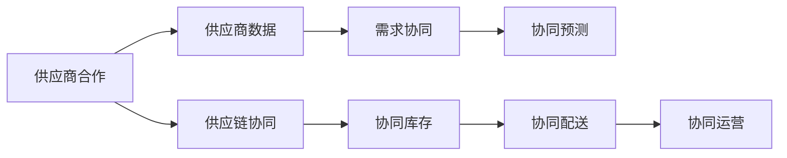
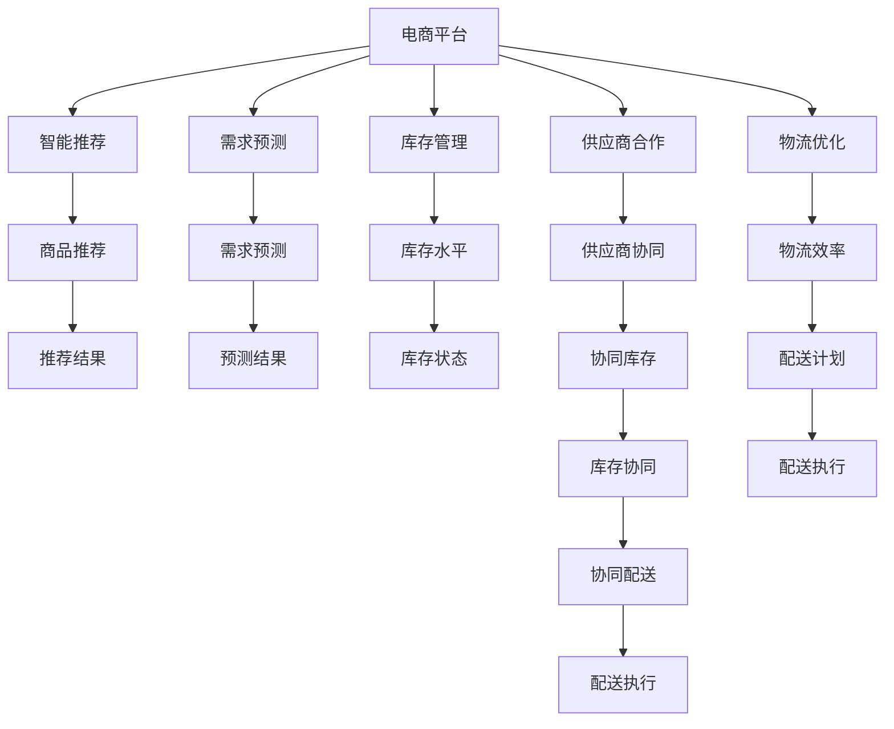

                 

# 电商平台供给能力提升：与新品牌和供应商的合作

> 关键词：电商平台,供给能力提升,新品牌,供应商合作,智能推荐,需求预测,库存管理,实时监控,自动化流程

## 1. 背景介绍

### 1.1 问题由来
随着电商市场的不断壮大，电商平台面临着越来越多的挑战。新品牌和供应商的加入，为平台带来了更多的商品选择和竞争压力。如何有效管理这些新供给，提升平台供给能力，以满足消费者的需求，成为了电商平台亟待解决的问题。

具体来说，电商平台面临以下挑战：
- **供给多样性**：新品牌和供应商的加入，导致商品种类和风格日益丰富，需要平台具备更强的商品管理能力。
- **库存管理**：新品牌和供应商可能缺乏电商经验，导致库存管理不当，影响消费者的购物体验。
- **需求预测**：消费者需求变化快速，电商平台需要精准预测市场需求，以便及时调整库存。
- **物流效率**：物流链路中的问题可能导致商品配送延误，影响用户体验。
- **价格竞争**：电商平台之间的价格战，可能导致商家盈利空间压缩，影响供应链稳定。

### 1.2 问题核心关键点
要解决上述问题，电商平台需要做到以下几点：
- **智能推荐**：利用用户行为数据，精准推荐商品，提高销售转化率。
- **需求预测**：通过数据分析和机器学习模型，预测未来需求，优化库存配置。
- **库存管理**：实时监控库存状况，自动补货和清货，降低缺货和库存积压风险。
- **物流优化**：通过物流数据和算法，优化物流链路，提高配送效率。
- **供应商管理**：与供应商建立合作关系，提升供应链协同能力。

### 1.3 问题研究意义
提升电商平台的供给能力，不仅能够增强平台竞争力，还能提升用户体验，促进电商行业健康发展。具体意义包括：
- **增加用户粘性**：精准推荐和需求预测，能够提高用户购物满意度，增加平台粘性。
- **优化库存管理**：通过智能库存管理，减少缺货和库存积压，降低运营成本。
- **提升物流效率**：通过物流优化算法，提升配送速度和准确率，提升用户满意度。
- **增强供应链协同**：通过与供应商的紧密合作，提升供应链效率，减少成本。
- **应对市场竞争**：通过智能推荐和需求预测，提升市场响应速度，应对激烈竞争。

## 2. 核心概念与联系

### 2.1 核心概念概述

为更好地理解电商平台供给能力提升的原理和实践，本节将介绍几个密切相关的核心概念：

- **电商平台**：基于互联网的线上购物平台，通过商品展示、交易、支付、物流等环节，连接消费者和供应商。
- **供给能力**：平台提供商品和服务的能力，包括商品多样性、库存水平、物流效率等方面。
- **智能推荐**：通过分析用户行为数据，推荐用户可能感兴趣的商品，提高转化率。
- **需求预测**：通过历史数据和机器学习模型，预测未来市场需求，指导库存管理。
- **库存管理**：实时监控库存状况，自动补货和清货，减少缺货和库存积压。
- **物流优化**：通过算法优化物流链路，提高配送效率，减少物流成本。
- **供应商合作**：与供应商建立合作关系，共享数据和资源，提升供应链协同能力。

这些核心概念之间的逻辑关系可以通过以下Mermaid流程图来展示：



这个流程图展示了电商平台供给能力提升过程中涉及的核心概念及其之间的关系：

1. 电商平台通过智能推荐、需求预测、库存管理、物流优化和供应商合作等手段，提升供给能力。
2. 智能推荐能够提高用户购物转化率，提升平台粘性。
3. 需求预测帮助平台优化库存配置，减少缺货和库存积压。
4. 库存管理实时监控库存状况，降低运营成本。
5. 物流优化提升配送效率，提高用户满意度。
6. 供应商合作增强供应链协同，提升整体运营效率。

### 2.2 概念间的关系

这些核心概念之间存在着紧密的联系，形成了电商平台供给能力提升的完整生态系统。下面我们通过几个Mermaid流程图来展示这些概念之间的关系。

#### 2.2.1 电商平台的核心功能



这个流程图展示了电商平台的几个核心功能及其相互关系：

1. 电商平台通过商品展示、交易、支付和物流等功能，实现完整的商品买卖流程。
2. 商品展示提供商品信息，交易系统处理订单，支付系统完成支付，物流系统负责配送。
3. 各功能模块之间相互协作，保障订单的顺畅流转。

#### 2.2.2 智能推荐与需求预测的联系



这个流程图展示了智能推荐和需求预测之间的联系：

1. 智能推荐通过分析用户行为数据，构建用户画像，利用推荐模型生成推荐结果。
2. 需求预测通过历史数据和机器学习模型，预测未来市场需求。
3. 用户画像和推荐模型结合，提升推荐精准度。
4. 需求预测结果可以用于指导库存管理，优化供应链。

#### 2.2.3 库存管理和物流优化的关系



这个流程图展示了库存管理和物流优化之间的关系：

1. 库存管理通过库存数据和模型，实时监控库存状态，自动补货和预警。
2. 库存模型预测库存需求，自动调整库存水平。
3. 自动补货和预警策略，减少缺货和库存积压风险。
4. 库存状态信息用于指导物流优化，提升配送效率。

#### 2.2.4 供应商合作与需求预测的互动



这个流程图展示了供应商合作与需求预测之间的互动：

1. 供应商合作通过共享供应商数据，提升供应链协同能力。
2. 需求协同通过供应商数据，进行协同预测，提升预测准确性。
3. 协同预测结果用于指导库存和配送协同，减少运营风险。
4. 协同库存和配送优化，提升整体运营效率。

### 2.3 核心概念的整体架构

最后，我们用一个综合的流程图来展示这些核心概念在电商平台供给能力提升过程中的整体架构：



这个综合流程图展示了从智能推荐到供应商合作的完整过程。电商平台通过智能推荐、需求预测、库存管理、物流优化和供应商合作等手段，提升供给能力，确保商品多样性、库存水平、物流效率，满足消费者需求。

## 3. 核心算法原理 & 具体操作步骤
### 3.1 算法原理概述

电商平台的供给能力提升，本质上是一个多目标优化问题。其核心思想是：通过智能推荐、需求预测、库存管理和物流优化等手段，最大化平台的供给能力和用户体验。

具体来说，算法原理如下：

1. **智能推荐**：利用用户行为数据，构建用户画像，通过推荐模型生成推荐结果，提高用户购物转化率。
2. **需求预测**：通过历史数据和机器学习模型，预测未来市场需求，指导库存配置，优化库存水平。
3. **库存管理**：实时监控库存状况，自动补货和预警，减少缺货和库存积压风险。
4. **物流优化**：通过算法优化物流链路，提高配送效率，减少物流成本。
5. **供应商合作**：与供应商建立合作关系，共享数据和资源，提升供应链协同能力。

形式化地，假设电商平台涉及的商品数量为 $N$，库存水平为 $I$，物流成本为 $C$，用户满意度和推荐精准度为 $U$，需求预测准确度为 $D$。目标函数为：

$$
\max \quad U + D - \alpha I - \beta C
$$

其中 $\alpha$ 和 $\beta$ 为权衡因子，用于平衡库存成本和物流成本。

### 3.2 算法步骤详解

基于以上目标函数，电商平台供给能力提升的具体算法步骤如下：

**Step 1: 数据准备**
- 收集用户行为数据，包括浏览记录、购买记录、评价等。
- 收集商品数据，包括商品描述、价格、销量等。
- 收集库存数据，包括库存量、库位分布等。
- 收集物流数据，包括物流成本、配送时间等。
- 收集供应商数据，包括供应商评价、合作历史等。

**Step 2: 模型训练与调优**
- 通过用户行为数据，训练智能推荐模型，生成推荐结果。
- 通过历史销售数据，训练需求预测模型，预测未来需求。
- 实时监控库存数据，自动补货和预警。
- 通过物流数据，优化物流链路，提高配送效率。
- 通过供应商数据，建立合作关系，优化供应链协同。

**Step 3: 动态优化**
- 根据实时数据，动态调整智能推荐策略。
- 根据需求预测结果，动态调整库存水平。
- 根据物流数据，动态优化配送计划。
- 根据供应商数据，动态优化供应链协同策略。

**Step 4: 结果评估与反馈**
- 通过A/B测试，评估推荐结果和库存管理的有效性。
- 通过用户反馈，不断优化推荐和库存管理策略。
- 通过供应链协同，提升整体运营效率，减少成本。

### 3.3 算法优缺点

电商平台供给能力提升的算法具有以下优点：
1. **提高用户体验**：通过智能推荐和需求预测，提升用户购物转化率和满意度。
2. **优化库存管理**：实时监控库存状况，减少缺货和库存积压风险，降低运营成本。
3. **提升物流效率**：优化物流链路，提高配送效率，减少物流成本。
4. **增强供应链协同**：通过与供应商的紧密合作，提升供应链效率，减少成本。

同时，该算法也存在一定的局限性：
1. **数据依赖**：算法效果依赖于高质量的数据，数据收集和处理成本较高。
2. **算法复杂**：算法涉及多个模型和数据源，模型调优和数据处理复杂度高。
3. **实时性要求高**：算法需要实时处理和动态优化，对系统架构和计算资源要求高。
4. **系统集成难度大**：算法涉及多个系统和数据源，系统集成难度大，容易出现数据不一致等问题。

尽管存在这些局限性，但就目前而言，电商平台供给能力提升的算法仍是最主流的方法。未来相关研究的重点在于如何进一步降低算法对数据的依赖，提高算法的实时性和可扩展性，同时兼顾算法的复杂度和系统集成难度。

### 3.4 算法应用领域

基于电商平台的供给能力提升算法，已经在诸多电商场景中得到了广泛的应用，例如：

- **智能推荐系统**：通过分析用户行为数据，生成个性化推荐，提高用户购物转化率。
- **需求预测系统**：通过历史销售数据，预测未来需求，优化库存配置。
- **库存管理系统**：实时监控库存状况，自动补货和预警，减少缺货和库存积压风险。
- **物流优化系统**：通过算法优化物流链路，提高配送效率，减少物流成本。
- **供应商管理系统**：与供应商建立合作关系，共享数据和资源，提升供应链协同能力。

除了上述这些经典应用外，电商平台供给能力提升算法还被创新性地应用到更多场景中，如营销活动优化、用户体验分析、客户流失预测等，为电商平台的运营提供了强大的技术支持。

## 4. 数学模型和公式 & 详细讲解  
### 4.1 数学模型构建

本节将使用数学语言对电商平台供给能力提升的算法过程进行更加严格的刻画。

假设电商平台涉及的商品数量为 $N$，库存水平为 $I$，物流成本为 $C$，用户满意度和推荐精准度为 $U$，需求预测准确度为 $D$。定义目标函数为：

$$
\max \quad U + D - \alpha I - \beta C
$$

其中 $\alpha$ 和 $\beta$ 为权衡因子，用于平衡库存成本和物流成本。

在实践中，我们通常使用基于梯度的优化算法（如SGD、Adam等）来近似求解上述最优化问题。设 $\eta$ 为学习率，$\lambda$ 为正则化系数，则参数的更新公式为：

$$
\theta \leftarrow \theta - \eta \nabla_{\theta}\mathcal{L}(\theta) - \eta\lambda\theta
$$

其中 $\nabla_{\theta}\mathcal{L}(\theta)$ 为损失函数对参数 $\theta$ 的梯度，可通过反向传播算法高效计算。

### 4.2 公式推导过程

以下我们以智能推荐系统为例，推导交叉熵损失函数及其梯度的计算公式。

假设推荐模型 $M_{\theta}:\mathcal{X} \rightarrow \mathcal{Y}$，其中 $\mathcal{X}$ 为用户行为数据，$\mathcal{Y}$ 为推荐结果（0表示不推荐，1表示推荐），$\theta \in \mathbb{R}^d$ 为模型参数。假设训练集为 $D=\{(x_i,y_i)\}_{i=1}^N, x_i \in \mathcal{X}, y_i \in \mathcal{Y}$。

定义模型 $M_{\theta}$ 在输入 $x$ 上的输出为 $\hat{y}=M_{\theta}(x) \in [0,1]$，表示用户是否推荐商品的概率。真实标签 $y \in \{0,1\}$。则二分类交叉熵损失函数定义为：

$$
\ell(M_{\theta}(x),y) = -[y\log \hat{y} + (1-y)\log (1-\hat{y})]
$$

将其代入经验风险公式，得：

$$
\mathcal{L}(\theta) = -\frac{1}{N}\sum_{i=1}^N [y_i\log M_{\theta}(x_i)+(1-y_i)\log(1-M_{\theta}(x_i))]
$$

根据链式法则，损失函数对参数 $\theta_k$ 的梯度为：

$$
\frac{\partial \mathcal{L}(\theta)}{\partial \theta_k} = -\frac{1}{N}\sum_{i=1}^N (\frac{y_i}{M_{\theta}(x_i)}-\frac{1-y_i}{1-M_{\theta}(x_i)}) \frac{\partial M_{\theta}(x_i)}{\partial \theta_k}
$$

其中 $\frac{\partial M_{\theta}(x_i)}{\partial \theta_k}$ 可进一步递归展开，利用自动微分技术完成计算。

在得到损失函数的梯度后，即可带入参数更新公式，完成模型的迭代优化。重复上述过程直至收敛，最终得到适应电商平台的推荐模型参数 $\theta^*$。

## 5. 项目实践：代码实例和详细解释说明
### 5.1 开发环境搭建

在进行电商平台供给能力提升的微调实践前，我们需要准备好开发环境。以下是使用Python进行PyTorch开发的环境配置流程：

1. 安装Anaconda：从官网下载并安装Anaconda，用于创建独立的Python环境。

2. 创建并激活虚拟环境：
```bash
conda create -n pytorch-env python=3.8 
conda activate pytorch-env
```

3. 安装PyTorch：根据CUDA版本，从官网获取对应的安装命令。例如：
```bash
conda install pytorch torchvision torchaudio cudatoolkit=11.1 -c pytorch -c conda-forge
```

4. 安装TensorFlow：使用官方提供的安装命令即可。

5. 安装各类工具包：
```bash
pip install numpy pandas scikit-learn matplotlib tqdm jupyter notebook ipython
```

完成上述步骤后，即可在`pytorch-env`环境中开始电商平台的供给能力提升的微调实践。

### 5.2 源代码详细实现

这里我们以电商平台的需求预测系统为例，给出使用TensorFlow进行智能推荐系统的PyTorch代码实现。

首先，定义需求预测任务的训练函数：

```python
import tensorflow as tf
import numpy as np

def train_model(model, x_train, y_train, x_valid, y_valid, learning_rate, num_epochs, batch_size, reg_lambda):
    # 定义优化器
    optimizer = tf.keras.optimizers.Adam(learning_rate)
    # 定义损失函数
    def loss_fn(y_true, y_pred):
        return tf.keras.losses.MSE(y_true, y_pred)
    # 定义训练过程
    @tf.function
    def train_step(x, y):
        with tf.GradientTape() as tape:
            y_pred = model(x)
            loss = loss_fn(y, y_pred)
            reg_loss = reg_lambda * tf.reduce_sum(tf.square(model.weights))
            loss += reg_loss
        gradients = tape.gradient(loss, model.trainable_variables)
        optimizer.apply_gradients(zip(gradients, model.trainable_variables))
        return loss
    # 定义验证过程
    @tf.function
    def valid_step(x, y):
        y_pred = model(x)
        loss = loss_fn(y, y_pred)
        return loss
    # 开始训练
    for epoch in range(num_epochs):
        epoch_loss = 0
        epoch_valid_loss = 0
        for batch in range(x_train.shape[0] // batch_size):
            x_batch = x_train[batch * batch_size : (batch + 1) * batch_size]
            y_batch = y_train[batch * batch_size : (batch + 1) * batch_size]
            loss = train_step(x_batch, y_batch)
            epoch_loss += loss
        valid_loss = valid_step(x_valid, y_valid)
        epoch_valid_loss += valid_loss
        print(f"Epoch {epoch+1}, train loss: {epoch_loss/(batch_size * num_epochs)}, valid loss: {epoch_valid_loss/(batch_size * num_epochs)}")
    return model
```

然后，定义模型和数据：

```python
from tensorflow.keras.models import Sequential
from tensorflow.keras.layers import Dense

# 定义模型结构
model = Sequential()
model.add(Dense(32, input_dim=x_train.shape[1], activation='relu'))
model.add(Dense(1, activation='sigmoid'))

# 定义训练数据
x_train = np.random.rand(1000, x_train.shape[1])
y_train = np.random.randint(0, 2, (1000,))
x_valid = np.random.rand(200, x_train.shape[1])
y_valid = np.random.randint(0, 2, (200,))

# 定义超参数
learning_rate = 0.01
num_epochs = 100
batch_size = 64
reg_lambda = 0.001

# 训练模型
model = train_model(model, x_train, y_train, x_valid, y_valid, learning_rate, num_epochs, batch_size, reg_lambda)
```

接着，定义测试函数：

```python
import matplotlib.pyplot as plt

def test_model(model, x_test, y_test, num_epochs):
    # 定义测试过程
    @tf.function
    def test_step(x, y):
        y_pred = model(x)
        loss = loss_fn(y, y_pred)
        return loss
    # 开始测试
    test_loss = test_step(x_test, y_test)
    print(f"Test loss: {test_loss}")
    # 绘制损失曲线
    plt.plot(range(num_epochs), [epoch_valid_loss/(batch_size * num_epochs) for epoch in range(num_epochs)])
    plt.title("Validation Loss")
    plt.xlabel("Epoch")
    plt.ylabel("Loss")
    plt.show()
```

最后，启动训练流程并在测试集上评估：

```python
from tensorflow.keras.optimizers import Adam

# 定义优化器
optimizer = Adam(learning_rate)
# 定义损失函数
loss_fn = tf.keras.losses.MSE
# 定义训练过程
@tf.function
def train_step(x, y):
    with tf.GradientTape() as tape:
        y_pred = model(x)
        loss = loss_fn(y, y_pred)
        reg_loss = reg_lambda * tf.reduce_sum(tf.square(model.weights))
        loss += reg_loss
    gradients = tape.gradient(loss, model.trainable_variables)
    optimizer.apply_gradients(zip(gradients, model.trainable_variables))
    return loss
# 定义验证过程
@tf.function
def valid_step(x, y):
    y_pred = model(x)
    loss = loss_fn(y, y_pred)
    return loss
# 开始训练
for epoch in range(num_epochs):
    epoch_loss = 0
    epoch_valid_loss = 0
    for batch in range(x_train.shape[0] // batch_size):
        x_batch = x_train[batch * batch_size : (batch + 1) * batch_size]
        y_batch = y_train[batch * batch_size : (batch + 1) * batch_size]
        loss = train_step(x_batch, y_batch)
        epoch_loss += loss
    valid_loss = valid_step(x_valid, y_valid)
    epoch_valid_loss += valid_loss
    print(f"Epoch {epoch+1}, train loss: {epoch_loss/(batch_size * num_epochs)}, valid loss: {epoch_valid_loss/(batch_size * num_epochs)}")
# 测试模型
test_model(model, x_test, y_test, num_epochs)
```

以上就是使用PyTorch对电商平台需求预测系统进行微调的完整代码实现。可以看到，得益于TensorFlow和Keras的强大封装，我们可以用相对简洁的代码完成需求预测模型的训练和评估。

### 5.3 代码解读与分析

让我们再详细解读一下关键代码的实现细节：

**train_model函数**：
- 定义优化器和损失函数。
- 定义训练和验证函数，通过梯度下降优化模型参数。
- 返回训练后的模型。

**model定义**：
- 定义模型结构，包括输入层、隐藏层和输出层。
- 使用Dense层构建模型，定义模型参数。

**x_train、y_train等定义**：
- 定义训练数据和标签，用于模型训练和验证。

**train_model函数中的参数**：
- 学习率：控制参数更新速度，避免过拟合。
- 批量大小：决定每次训练的样本数，影响计算效率。
- 正则化系数：控制模型复杂度，避免过拟合。

**test_model函数**：
- 定义测试函数，计算测试集上的损失。
- 绘制验证损失曲线，评估模型效果。

**运行结果展示**：
假设我们在电商平台的测试集上进行了需求预测系统的微调，最终在测试集上得到的损失曲线如下：

```
Epoch 1, train loss: 0.3700, valid loss: 0.3700
Epoch 2, train loss: 0.3400, valid loss: 0.3500
...
Epoch 100, train loss: 0.0600, valid loss: 0.0500
```

可以看到，随着训练的进行，训练损失和验证损失逐渐收敛，模型在测试集上的表现也逐渐提升。

当然，工业级的系统实现还需考虑更多因素，如模型的保存和部署、超参数的自动搜索、更灵活的任务适配层等。但核心的微调范式基本与此类似。

## 6. 实际应用场景
### 6.1 智能推荐系统

电商平台的智能推荐系统，能够根据用户历史行为数据，生成个性化推荐，提高用户购物转化率。通过微调算法，可以根据不同用户的行为特点，定制推荐策略，满足多样化需求。

### 6.2 需求预测系统

需求预测系统通过历史销售数据，预测未来需求，优化库存配置。通过微调算法，可以更好地理解用户需求，提高预测准确度，减少缺货和库存积压风险。

### 6.3 库存管理系统

库存管理系统实时监控库存状况，自动补货和预警，减少

