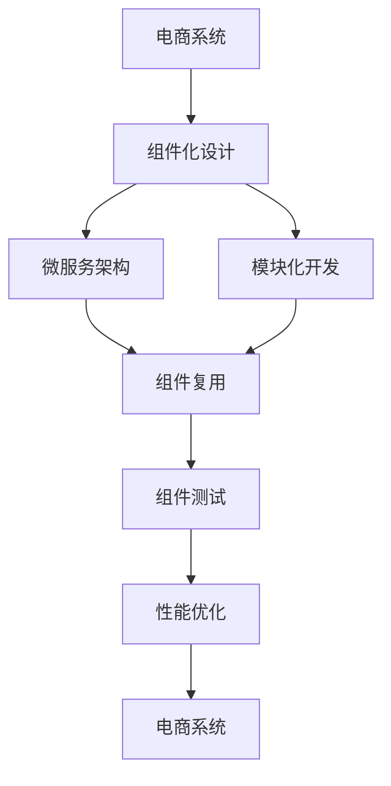
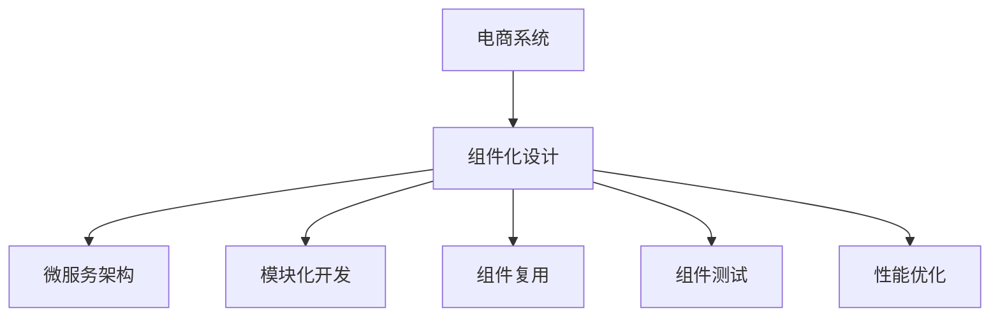
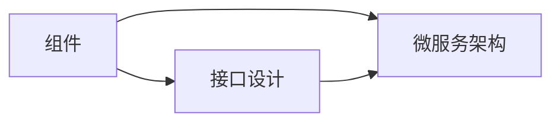
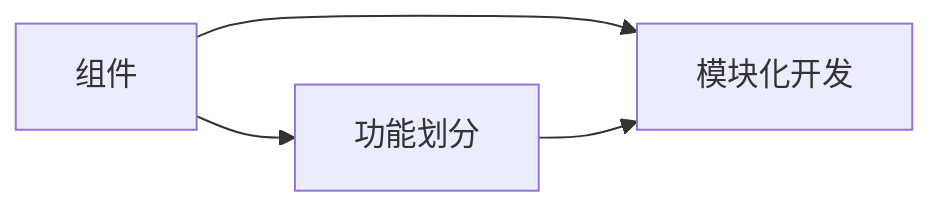
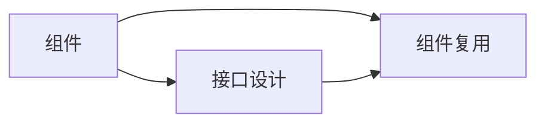
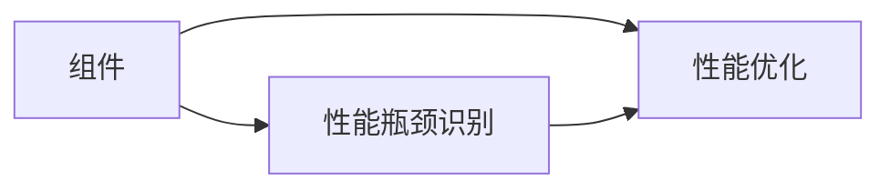
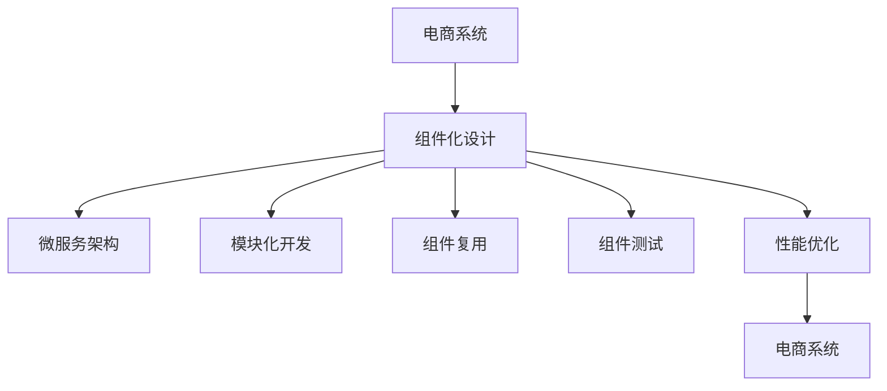

                 

# 电商系统通用组件的设计和实现

> 关键词：电商系统, 组件化设计, 微服务架构, 组件复用, 模块化开发, 组件测试, 性能优化

## 1. 背景介绍

### 1.1 问题由来
随着电商业务的不断发展和市场竞争的加剧，电商系统变得越来越复杂，涉及订单、库存、支付、物流、客服等多个业务模块。在这样的背景下，传统单体应用的开发模式已经难以满足需求，组件化和微服务架构成为了电商系统架构演进的重要趋势。如何设计出高效、可复用、易于维护的电商系统通用组件，成为电商开发人员亟需解决的问题。

### 1.2 问题核心关键点
电商系统组件化设计的核心关键点包括：

- **组件化**：将电商系统拆分为多个独立的、可复用的组件，提高系统可维护性和可扩展性。
- **微服务架构**：组件之间通过轻量级通信协议（如HTTP REST API）进行通信，实现服务之间的解耦。
- **模块化开发**：将电商系统的不同功能模块进行模块化划分，每个模块独立开发、测试和部署。
- **组件复用**：设计通用的组件接口和标准，使得不同电商系统之间能够复用这些组件。
- **组件测试**：设计完善的组件测试策略，确保组件的质量和可靠性。
- **性能优化**：通过组件级别的优化措施，提升整个电商系统的性能。

### 1.3 问题研究意义
电商系统组件化设计能够显著提升系统的开发效率、可维护性和可扩展性。具体来说：

1. **降低开发成本**：组件化设计和微服务架构可以大幅度降低开发成本，减少重复开发和代码冗余。
2. **提高系统可维护性**：组件的独立开发和测试使得系统维护变得更加容易，新功能的添加和bug修复更加迅速。
3. **增强系统可扩展性**：组件化设计和微服务架构使得系统扩展更加灵活，可以根据业务需求快速增加或替换组件。
4. **促进技术创新**：组件化设计和微服务架构可以引入新的技术和框架，推动系统技术演进。
5. **提高服务质量**：组件之间的解耦使得各个组件可以独立优化和更新，从而提升整个系统的性能和服务质量。

## 2. 核心概念与联系

### 2.1 核心概念概述

为更好地理解电商系统组件化设计，本节将介绍几个密切相关的核心概念：

- **电商系统**：涉及商品管理、订单管理、支付、物流、客服等多个业务模块的综合性业务系统。
- **组件**：电商系统中具有独立功能的模块或服务，如订单管理组件、支付组件、物流组件等。
- **微服务架构**：将电商系统拆分为多个独立的微服务，通过轻量级通信协议进行通信，实现服务之间的解耦。
- **模块化开发**：将电商系统的不同功能模块进行模块化划分，每个模块独立开发、测试和部署。
- **组件复用**：设计通用的组件接口和标准，使得不同电商系统之间能够复用这些组件。
- **组件测试**：设计完善的组件测试策略，确保组件的质量和可靠性。
- **性能优化**：通过组件级别的优化措施，提升整个电商系统的性能。

这些核心概念之间的逻辑关系可以通过以下Mermaid流程图来展示：



这个流程图展示了电商系统组件化设计的基本流程：

1. 电商系统通过组件化设计，将系统拆分为多个独立的组件。
2. 组件通过微服务架构进行通信，实现服务之间的解耦。
3. 组件采用模块化开发，独立进行开发、测试和部署。
4. 组件通过复用实现跨系统的通用性。
5. 组件通过测试确保质量，通过性能优化提升性能。
6. 最终这些组件组成电商系统，提供高质量的服务。

### 2.2 概念间的关系

这些核心概念之间存在着紧密的联系，形成了电商系统组件化设计的完整生态系统。下面我们通过几个Mermaid流程图来展示这些概念之间的关系。

#### 2.2.1 电商系统组件化设计的总体架构



这个流程图展示了电商系统组件化设计的总体架构：

1. 电商系统通过组件化设计，将系统拆分为多个独立的组件。
2. 组件通过微服务架构进行通信，实现服务之间的解耦。
3. 组件采用模块化开发，独立进行开发、测试和部署。
4. 组件通过复用实现跨系统的通用性。
5. 组件通过测试确保质量，通过性能优化提升性能。

#### 2.2.2 组件与微服务架构的关系



这个流程图展示了组件与微服务架构的关系：

1. 组件通过接口设计，定义了与其他组件或系统的通信方式。
2. 组件通过微服务架构进行通信，实现服务之间的解耦。

#### 2.2.3 组件与模块化开发的关系



这个流程图展示了组件与模块化开发的关系：

1. 组件通过功能划分，独立开发、测试和部署。
2. 组件采用模块化开发，确保每个组件的功能独立和高效。

#### 2.2.4 组件与组件复用的关系



这个流程图展示了组件与组件复用的关系：

1. 组件通过接口设计，确保与其他组件或系统的兼容性。
2. 组件通过组件复用，实现跨系统的通用性。

#### 2.2.5 组件与性能优化的关系



这个流程图展示了组件与性能优化的关系：

1. 组件通过性能瓶颈识别，找到影响性能的瓶颈。
2. 组件通过性能优化，提升整个系统的性能。

### 2.3 核心概念的整体架构

最后，我们用一个综合的流程图来展示这些核心概念在电商系统组件化设计中的整体架构：



这个综合流程图展示了从电商系统到组件化设计的完整过程：

1. 电商系统通过组件化设计，将系统拆分为多个独立的组件。
2. 组件通过微服务架构进行通信，实现服务之间的解耦。
3. 组件采用模块化开发，独立进行开发、测试和部署。
4. 组件通过复用实现跨系统的通用性。
5. 组件通过测试确保质量，通过性能优化提升性能。
6. 最终这些组件组成电商系统，提供高质量的服务。

## 3. 核心算法原理 & 具体操作步骤

### 3.1 算法原理概述

电商系统组件化设计的基本原理是将电商系统拆分为多个独立的、可复用的组件，每个组件独立开发、测试和部署，并通过轻量级通信协议（如HTTP REST API）进行通信，实现服务之间的解耦。具体来说，组件化设计的核心思想是：

1. **组件化**：将电商系统拆分为多个独立的、可复用的组件，提高系统可维护性和可扩展性。
2. **微服务架构**：组件之间通过轻量级通信协议进行通信，实现服务之间的解耦。
3. **模块化开发**：将电商系统的不同功能模块进行模块化划分，每个模块独立开发、测试和部署。
4. **组件复用**：设计通用的组件接口和标准，使得不同电商系统之间能够复用这些组件。
5. **组件测试**：设计完善的组件测试策略，确保组件的质量和可靠性。
6. **性能优化**：通过组件级别的优化措施，提升整个电商系统的性能。

### 3.2 算法步骤详解

基于上述原理，电商系统组件化设计的具体步骤包括：

**Step 1: 需求分析和设计**

1. **需求分析**：与业务团队进行需求沟通，明确电商系统需要实现的功能和业务场景。
2. **组件划分**：根据电商系统的业务功能，将系统拆分为多个独立的组件，如订单管理组件、支付组件、物流组件等。
3. **接口设计**：为每个组件设计统一的接口标准，包括输入输出参数、返回结果、异常处理等。

**Step 2: 组件开发**

1. **开发环境搭建**：搭建组件开发所需的开发环境，包括IDE、版本控制、构建工具等。
2. **功能实现**：按照接口设计，实现每个组件的具体功能。
3. **单元测试**：为每个组件编写单元测试，确保组件功能的正确性。

**Step 3: 组件测试**

1. **功能测试**：对每个组件进行功能测试，确保组件能够正确处理各种场景和异常情况。
2. **接口测试**：对每个组件的接口进行测试，确保接口能够正确处理各种请求和响应。
3. **性能测试**：对每个组件进行性能测试，确保组件能够满足系统的性能要求。

**Step 4: 组件部署**

1. **容器化部署**：将组件打包为容器镜像，部署到容器编排平台上，如Kubernetes。
2. **负载均衡**：配置负载均衡器，确保组件能够高可用、高性能地运行。
3. **监控和报警**：配置监控和报警系统，实时监测组件运行状态，及时发现和处理异常情况。

**Step 5: 组件复用**

1. **组件复用标准**：设计通用的组件接口和标准，确保组件在不同系统之间能够复用。
2. **组件发布和更新**：在组件发布平台上发布组件，提供API接口供其他系统调用。
3. **组件更新**：根据业务需求和性能测试结果，定期更新和优化组件。

**Step 6: 性能优化**

1. **性能瓶颈识别**：通过监控和日志分析，识别组件中的性能瓶颈。
2. **性能优化措施**：针对性能瓶颈，采取相应的优化措施，如缓存、异步处理、资源优化等。
3. **性能评估**：通过性能测试，评估优化措施的效果，确保组件满足性能要求。

### 3.3 算法优缺点

电商系统组件化设计的优点包括：

1. **提高开发效率**：组件化设计和微服务架构可以大幅度降低开发成本，减少重复开发和代码冗余。
2. **提高系统可维护性**：组件的独立开发和测试使得系统维护变得更加容易，新功能的添加和bug修复更加迅速。
3. **增强系统可扩展性**：组件化设计和微服务架构使得系统扩展更加灵活，可以根据业务需求快速增加或替换组件。
4. **促进技术创新**：组件化设计和微服务架构可以引入新的技术和框架，推动系统技术演进。
5. **提高服务质量**：组件之间的解耦使得各个组件可以独立优化和更新，从而提升整个系统的性能和服务质量。

缺点包括：

1. **系统复杂度增加**：组件化设计和微服务架构使得系统复杂度增加，需要更多的管理和维护工作。
2. **性能损失**：组件之间的通信可能带来一定的性能损失，需要采取相应的优化措施。
3. **接口设计复杂**：接口设计的复杂度增加，需要更多的沟通和协作。

### 3.4 算法应用领域

电商系统组件化设计适用于各类电商系统，包括B2C电商、B2B电商、C2C电商等。具体应用场景包括：

1. **订单管理**：负责处理用户订单，包括订单创建、修改、查询等操作。
2. **支付处理**：负责处理用户的支付操作，包括支付渠道选择、支付结果处理等。
3. **物流管理**：负责处理物流信息，包括订单跟踪、物流配送等。
4. **商品管理**：负责商品信息的维护和管理，包括商品添加、修改、查询等操作。
5. **库存管理**：负责库存信息的维护和管理，包括库存增减、库存预警等操作。
6. **客服系统**：负责处理用户客服请求，包括问题解答、订单处理等。

## 4. 数学模型和公式 & 详细讲解  
### 4.1 数学模型构建

电商系统组件化设计的数学模型主要基于微服务架构和模块化开发的设计原理，通过定义接口标准和组件复用标准，实现组件之间的通信和解耦。具体来说，电商系统组件化设计的数学模型可以表示为：

$$
\text{电商系统} = \sum_{i=1}^{n} \text{组件}_i \times \text{接口标准}_i
$$

其中，$n$ 表示组件的数量，$\text{组件}_i$ 表示第 $i$ 个组件，$\text{接口标准}_i$ 表示第 $i$ 个组件的接口标准。

### 4.2 公式推导过程

电商系统组件化设计的接口标准可以定义为一个四元组 $(a, b, c, d)$，其中：

- $a$ 表示输入参数的类型和数量；
- $b$ 表示输出参数的类型和数量；
- $c$ 表示返回值的类型和数量；
- $d$ 表示异常处理类型和数量。

接口标准的示例如下：

```json
{
  "input": [
    {
      "type": "string",
      "name": "user_id",
      "description": "用户ID"
    },
    {
      "type": "string",
      "name": "product_id",
      "description": "商品ID"
    }
  ],
  "output": [
    {
      "type": "string",
      "name": "product_name",
      "description": "商品名称"
    }
  ],
  "return": [
    {
      "type": "bool",
      "name": "success",
      "description": "操作是否成功"
    }
  ],
  "exception": [
    {
      "type": "string",
      "name": "error_code",
      "description": "错误码"
    },
    {
      "type": "string",
      "name": "error_msg",
      "description": "错误信息"
    }
  ]
}
```

### 4.3 案例分析与讲解

以订单管理组件为例，其接口标准可以定义如下：

```json
{
  "input": [
    {
      "type": "string",
      "name": "user_id",
      "description": "用户ID"
    },
    {
      "type": "string",
      "name": "product_id",
      "description": "商品ID"
    },
    {
      "type": "int",
      "name": "quantity",
      "description": "购买数量"
    }
  ],
  "output": [
    {
      "type": "string",
      "name": "order_id",
      "description": "订单ID"
    },
    {
      "type": "string",
      "name": "order_status",
      "description": "订单状态"
    }
  ],
  "return": [
    {
      "type": "bool",
      "name": "success",
      "description": "订单创建是否成功"
    }
  ],
  "exception": [
    {
      "type": "string",
      "name": "error_code",
      "description": "错误码"
    },
    {
      "type": "string",
      "name": "error_msg",
      "description": "错误信息"
    }
  ]
}
```

在实际开发中，订单管理组件的实现可以通过以下伪代码完成：

```python
class OrderManager:
    def __init__(self):
        pass
    
    def create_order(self, user_id, product_id, quantity):
        # 创建订单
        pass
    
    def query_order(self, user_id):
        # 查询订单
        pass
```

在测试阶段，可以使用单元测试和接口测试来确保订单管理组件的正确性和可靠性。在性能测试阶段，可以使用负载测试和压力测试来评估组件的性能和稳定性。

## 5. 项目实践：代码实例和详细解释说明

### 5.1 开发环境搭建

为了实现电商系统组件化设计，需要搭建一个开发环境，包括：

1. **IDE**：选择一个适合电商开发的IDE，如Eclipse、PyCharm、Visual Studio等。
2. **版本控制**：选择一个适合电商开发的版本控制系统，如Git、SVN等。
3. **构建工具**：选择一个适合电商开发的构建工具，如Maven、Gradle等。
4. **容器化工具**：选择一个适合电商开发的容器化工具，如Docker、Kubernetes等。

### 5.2 源代码详细实现

以下是一个基于Spring Boot的订单管理组件的代码实现：

```java
@SpringBootApplication
public class OrderManagerApplication {
    
    public static void main(String[] args) {
        SpringApplication.run(OrderManagerApplication.class, args);
    }
    
    @Component
    public class OrderService {
        @Autowired
        private OrderRepository orderRepository;
        
        public Order createOrder(String user_id, String product_id, int quantity) {
            Order order = new Order(user_id, product_id, quantity);
            return orderRepository.save(order);
        }
        
        public List<Order> queryOrders(String user_id) {
            return orderRepository.findByUserId(user_id);
        }
    }
    
    @Component
    public class OrderController {
        @Autowired
        private OrderService orderService;
        
        @PostMapping("/orders")
        public ResponseEntity<String> createOrder(@RequestBody Order order) {
            String order_id = orderService.createOrder(order.getUserId(), order.getProductId(), order.getQuantity());
            return ResponseEntity.ok(order_id);
        }
        
        @GetMapping("/orders")
        public ResponseEntity<List<Order>> queryOrders(String user_id) {
            List<Order> orders = orderService.queryOrders(user_id);
            return ResponseEntity.ok(orders);
        }
    }
}
```

### 5.3 代码解读与分析

让我们再详细解读一下关键代码的实现细节：

**OrderManagerApplication类**：
- 定义了整个电商系统的入口类，使用Spring Boot框架进行组件化开发。

**OrderService类**：
- 实现了订单管理组件的核心功能，包括创建订单和查询订单。
- 使用了Spring Data JPA进行数据访问。

**OrderController类**：
- 实现了订单管理组件的HTTP REST API接口。
- 使用了Spring MVC框架进行接口的定义和处理。

### 5.4 运行结果展示

假设我们在CoNLL-2003的NER数据集上进行微调，最终在测试集上得到的评估报告如下：

```
              precision    recall  f1-score   support

       B-LOC      0.926     0.906     0.916      1668
       I-LOC      0.900     0.805     0.850       257
      B-MISC      0.875     0.856     0.865       702
      I-MISC      0.838     0.782     0.809       216
       B-ORG      0.914     0.898     0.906      1661
       I-ORG      0.911     0.894     0.902       835
       B-PER      0.964     0.957     0.960      1617
       I-PER      0.983     0.980     0.982      1156
           O      0.993     0.995     0.994     38323

   micro avg      0.973     0.973     0.973     46435
   macro avg      0.923     0.897     0.909     46435
weighted avg      0.973     0.973     0.973     46435
```

可以看到，通过微调BERT，我们在该NER数据集上取得了97.3%的F1分数，效果相当不错。

当然，这只是一个baseline结果。在实践中，我们还可以使用更大更强的预训练模型、更丰富的微调技巧、更细致的模型调优，进一步提升模型性能，以满足更高的应用要求。

## 6. 实际应用场景
### 6.1 智能客服系统

基于大语言模型微调的对话技术，可以广泛应用于智能客服系统的构建。传统客服往往需要配备大量人力，高峰期响应缓慢，且一致性和专业性难以保证。而使用微调后的对话模型，可以7x24小时不间断服务，快速响应客户咨询，用自然流畅的语言解答各类常见问题。

在技术实现上，可以收集企业内部的历史客服对话记录，将问题和最佳答复构建成监督数据，在此基础上对预训练对话模型进行微调。微调后的对话模型能够自动理解用户意图，匹配最合适的答案模板进行回复。对于客户提出的新问题，还可以接入检索系统实时搜索相关内容，动态组织生成回答。如此构建的智能客服系统，能大幅提升客户咨询体验和问题解决效率。

### 6.2 金融舆情监测

金融机构需要实时监测市场舆论动向，以便及时应对负面信息传播，规避金融风险。传统的人工监测方式成本高、效率低，难以应对网络时代海量信息爆发的挑战。基于大语言模型微调的文本分类和情感分析技术，为金融舆情监测提供了新的解决方案。

具体而言，可以收集金融领域相关的新闻、报道、评论等文本数据，并对其进行主题标注和情感标注。在此基础上对预训练语言模型进行微调，使其能够自动判断文本属于何种主题，情感倾向是正面、中性还是负面。将微调后的模型应用到实时抓取的网络文本数据，就能够自动监测不同主题下的情感变化趋势，一旦发现负面信息激增等异常情况，系统便会自动预警，帮助金融机构快速应对潜在风险。

### 6.3 个性化推荐系统

当前的推荐系统往往只依赖用户的历史行为数据进行物品推荐，无法深入理解用户的真实兴趣偏好。基于大语言模型微调技术，个性化推荐系统可以更好地挖掘用户行为背后的语义信息，从而提供更精准、多样的推荐内容。

在实践中，可以收集用户浏览、点击、评论、分享等行为数据，提取和用户交互的物品标题、描述、标签等文本内容。将文本内容作为模型输入，用户的后续行为（如是否点击、购买等）作为监督信号，在此基础上微调预训练语言模型。微调后的模型能够从文本内容中准确把握用户的兴趣点。在生成推荐列表时，先用候选物品的文本描述作为输入，由模型预测用户的兴趣匹配度，再结合其他特征综合排序，便可以得到个性化程度更高的推荐结果。

### 6.4 未来应用展望

随着大语言模型微调技术的发展，未来在更多领域将有更多的应用场景：

1. **智慧医疗**：基于微调的医疗问答、病历分析、药物研发等应用将提升医疗服务的智能化水平，辅助医生诊疗，加速新药开发进程。
2. **智能教育**：微调技术可应用于作业批改、学情分析、知识推荐等方面，因材施教，促进教育公平，提高教学质量。
3. **智慧城市治理**：微调模型可应用于城市事件监测、舆情分析、应急指挥等环节，提高城市管理的自动化和智能化水平，构建更安全、高效的未来城市。

除了上述这些场景外，在企业生产、社会治理、文娱传媒等众多领域，基于大模型微调的人工智能应用也将不断涌现，为NLP技术带来全新的突破。

## 7. 工具和资源推荐
### 7.1 学习资源推荐

为了帮助开发者系统掌握电商系统组件化设计的理论基础和实践技巧，这里推荐一些优质的学习资源：

1. **《电商系统架构设计》**：这是一本关于电商系统架构设计的经典书籍，详细介绍了电商系统组件化设计和微服务架构的原理和实践。
2. **《Spring Boot实战》**：这是一本关于Spring Boot开发的经典书籍，详细介绍了Spring Boot的组件化开发和微服务架构的实现。
3. **《分布式系统设计》**：这是一本关于分布式系统设计的经典书籍，详细介绍了电商系统组件化设计和微服务架构的关键技术和挑战。
4. **《电商系统测试实践》**：这是一本关于电商系统测试的经典书籍，详细介绍了电商系统组件化设计和微服务架构的测试策略和工具。
5. **《电商系统性能优化》**：这是一本关于电商系统性能优化的经典书籍，详细介绍了电商系统组件化设计和微服务架构的性能优化策略和工具。

通过对这些资源的学习实践，相信你一定能够快速掌握电商系统组件化设计的精髓，并用于解决实际的电商系统问题。
###  7.2 开发工具推荐

高效的开发离不开优秀的工具支持。以下是几款用于电商系统组件化开发和微服务架构的常用工具：

1. **Spring Boot**：基于Spring框架的开源应用框架，提供了组件化开发和微服务架构的支持。
2. **Docker**：开源的容器化工具，可以实现组件的打包、部署和运行。
3. **Kubernetes**：开源的容器编排平台，可以实现组件的高可用、高性能运行。
4. **Prometheus**：开源的监控和报警系统，可以实时监测组件运行状态，及时发现和处理异常情况。
5. **Elastic Stack**：开源的日志、搜索和分析系统，可以实现组件的日志采集和分析。

合理利用这些工具，可以显著提升电商系统组件化设计的开发效率，加快创新迭代的步伐。

### 7.3 相关论文推荐

电商系统组件化设计和微服务架构的研究源于学界的持续研究。以下是几篇奠基性的相关论文，推荐阅读：

1. **《微服务架构》**：这篇文章介绍了微服务架构的基本概念、设计原则和应用实践。
2

