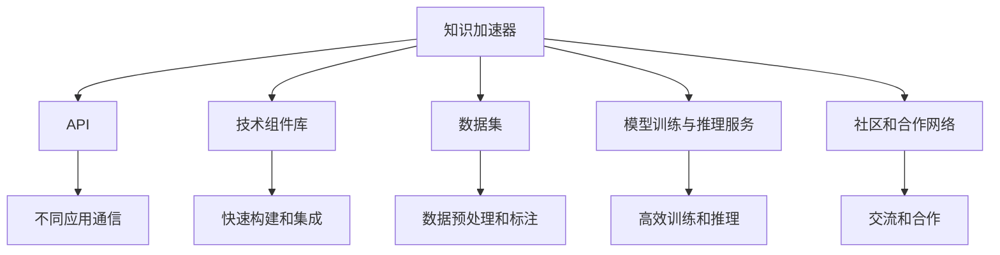
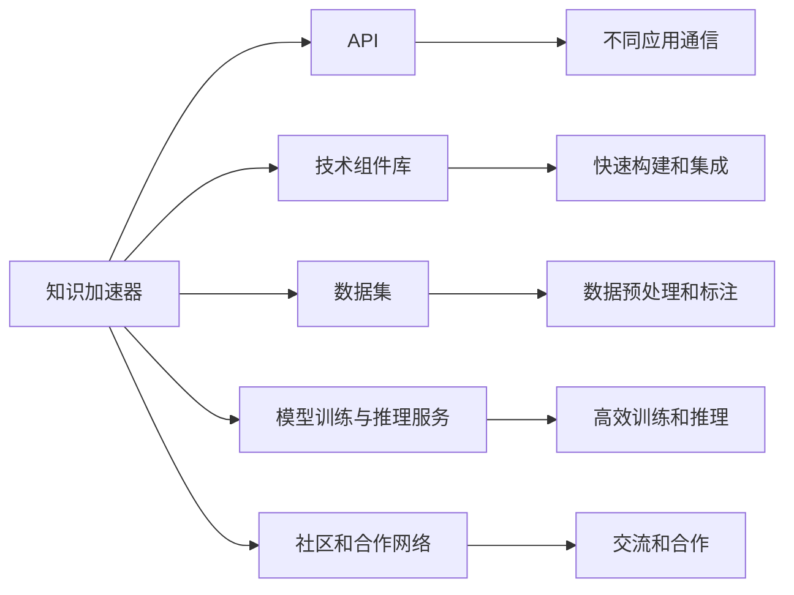
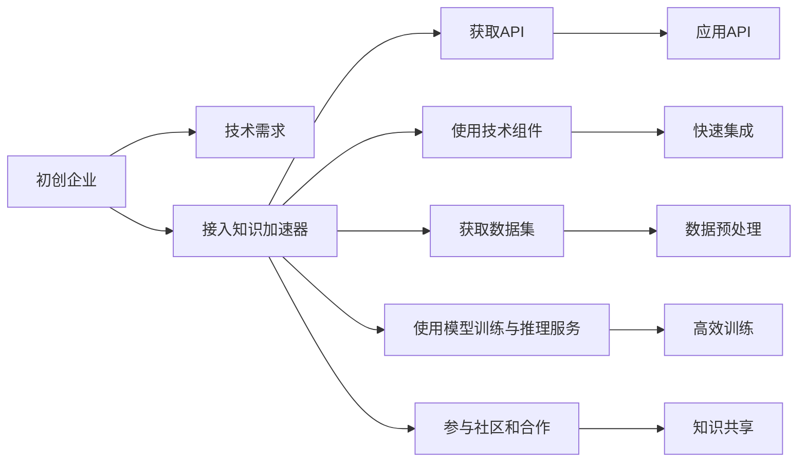

                 

# 知识加速器提供资源对接,助力初创企业

## 1. 背景介绍

### 1.1 问题由来
近年来，人工智能(AI)技术迅猛发展，尤其在自然语言处理(NLP)、计算机视觉(CV)、推荐系统等领域取得了显著进展。然而，由于技术门槛高、研发成本大，许多初创企业无法独立开展高水平的技术研发。因此，如何以较低成本、较快速度获得高质量的AI资源，成为初创企业关注的焦点。

### 1.2 问题核心关键点
针对这一问题，知识加速器应运而生。知识加速器旨在通过与AI领域的知识资源和实践经验对接，帮助初创企业获取所需AI技术和资源，加速技术研发和产品落地，降低研发成本，提升竞争力。

### 1.3 问题研究意义
知识加速器对于推动AI技术在各行各业的普及和应用具有重要意义：

1. **降低研发成本**：通过提供高质量的AI技术和资源，初创企业可以快速开发产品，减少人力、时间和资金的投入。
2. **提升研发效率**：知识加速器能够提供即插即用的技术组件和工具库，帮助初创企业快速迭代开发，缩短产品上市时间。
3. **增强竞争力**：优质的AI资源对接能够帮助初创企业突破技术瓶颈，提供差异化竞争优势。
4. **促进产业升级**：加速AI技术的落地应用，推动传统行业向智能化方向转型，提升整体产业水平。
5. **推动学术与产业合作**：通过对接高校和研究机构的学术成果，促进学术界的最新研究成果转化为实际生产力。

## 2. 核心概念与联系

### 2.1 核心概念概述

为更好地理解知识加速器的运作机制，本节将介绍几个关键概念：

- **知识加速器**：提供AI领域的知识资源和实践经验，帮助初创企业获取所需AI技术和资源，加速技术研发和产品落地的平台。
- **API**：应用程序编程接口，允许不同的应用程序之间进行通信和数据交换。
- **技术组件库**：由多种预制好的技术模块构成，供开发者快速构建和集成。
- **数据集**：用于训练和评估AI模型的海量标注数据，提供数据预处理和标注服务。
- **模型训练与推理服务**：提供高效的模型训练和推理环境，支持多种模型框架和优化策略。
- **社区和合作网络**：建立开发者、企业、研究机构之间的交流和合作平台，促进知识共享和创新。

这些概念之间的逻辑关系可以通过以下Mermaid流程图来展示：



这个流程图展示了知识加速器的核心功能和组件，包括API、技术组件库、数据集、模型训练与推理服务、社区和合作网络等。通过这些组件的相互配合，知识加速器能够为初创企业提供全方位的AI支持。

### 2.2 概念间的关系

这些核心概念之间存在着紧密的联系，形成了知识加速器的完整生态系统。下面我们通过几个Mermaid流程图来展示这些概念之间的关系。

#### 2.2.1 知识加速器的功能架构



这个流程图展示了知识加速器的功能架构，包括API、技术组件库、数据集、模型训练与推理服务、社区和合作网络等，这些功能相互配合，共同为初创企业提供全方位的AI支持。

#### 2.2.2 知识加速器的应用场景



这个流程图展示了知识加速器在初创企业中的应用场景，包括技术需求接入、API获取、技术组件使用、数据集获取、模型训练与推理服务、社区和合作参与等，通过这些环节，知识加速器能够帮助初创企业高效获取所需的AI资源和技术。

## 3. 核心算法原理 & 具体操作步骤

### 3.1 算法原理概述

知识加速器通过与AI领域的知识资源和实践经验对接，帮助初创企业获取所需AI技术和资源，加速技术研发和产品落地。其核心算法原理如下：

1. **API接口设计**：将AI领域的知识和实践经验封装成可编程接口，使不同应用之间能够进行通信和数据交换。
2. **技术组件库构建**：收集和整理AI领域的常用技术模块，供开发者快速构建和集成。
3. **数据集管理与标注**：收集和整理海量标注数据，提供数据预处理和标注服务，支持高效的数据管理。
4. **模型训练与推理优化**：提供高效的模型训练和推理环境，支持多种模型框架和优化策略，提升模型的训练和推理效率。
5. **社区和合作网络建设**：建立开发者、企业、研究机构之间的交流和合作平台，促进知识共享和创新。

### 3.2 算法步骤详解

知识加速器的具体操作步骤如下：

1. **需求分析**：初创企业提出技术需求，知识加速器提供API接口和快速构建技术组件库。
2. **数据准备**：知识加速器提供数据集管理和预处理服务，帮助企业获取高质量的训练数据。
3. **模型训练**：初创企业使用知识加速器提供的模型训练服务，进行高效模型训练。
4. **模型部署**：知识加速器提供模型推理服务，支持初创企业进行模型部署和应用。
5. **社区合作**：知识加速器建立开发者、企业、研究机构之间的交流和合作平台，促进知识共享和创新。

### 3.3 算法优缺点

知识加速器作为一种新型技术对接平台，具有以下优点：

- **降低研发成本**：通过提供高质量的AI技术和资源，初创企业可以快速开发产品，减少人力、时间和资金的投入。
- **提升研发效率**：技术组件库和API接口提供了即插即用的功能，帮助企业快速迭代开发，缩短产品上市时间。
- **增强竞争力**：优质的AI资源对接能够帮助初创企业突破技术瓶颈，提供差异化竞争优势。
- **促进产业升级**：加速AI技术的落地应用，推动传统行业向智能化方向转型，提升整体产业水平。
- **推动学术与产业合作**：通过对接高校和研究机构的学术成果，促进学术界的最新研究成果转化为实际生产力。

同时，知识加速器也存在一些缺点：

- **依赖外部平台**：知识加速器作为第三方平台，初创企业对平台依赖较大，一旦平台出现问题，可能影响企业正常运营。
- **隐私和安全风险**：数据集和模型推理服务涉及企业机密数据，平台需确保数据安全和隐私保护。
- **技术对接复杂**：初创企业需要有一定的技术基础，才能充分利用知识加速器提供的资源和技术。

### 3.4 算法应用领域

知识加速器在多个领域有广泛的应用，包括但不限于：

- **智能客服**：通过提供API接口和快速构建技术组件库，知识加速器帮助企业实现智能客服系统的构建。
- **金融风控**：通过提供数据集管理和模型训练服务，知识加速器支持企业进行金融风险评估和预测。
- **智能推荐**：通过提供技术组件库和模型训练服务，知识加速器帮助企业构建个性化推荐系统。
- **医疗影像**：通过提供数据集管理和模型推理服务，知识加速器支持企业进行医学影像分析和诊断。
- **工业智能**：通过提供技术组件库和社区合作平台，知识加速器支持企业进行工业智能系统的构建。

## 4. 数学模型和公式 & 详细讲解 & 举例说明

### 4.1 数学模型构建

知识加速器在AI资源对接的过程中，涉及多个数学模型的构建，包括数据预处理、模型训练和推理等。以下是几个关键数学模型的构建方法：

#### 4.1.1 数据预处理模型

数据预处理是知识加速器的重要环节，涉及数据清洗、特征提取、数据增强等步骤。数据预处理模型的构建方法如下：

1. **数据清洗模型**：
   - 去除噪声数据：通过统计分析，去除数据中的异常值和噪声数据，确保数据质量。
   - 数据标准化：对数据进行归一化处理，确保不同特征的数据范围一致。

   数学模型如下：

   $$
   X_{cleaned} = \frac{X_{original} - \mu}{\sigma}
   $$

   其中 $X_{original}$ 为原始数据，$X_{cleaned}$ 为清洗后的数据，$\mu$ 为数据均值，$\sigma$ 为数据标准差。

2. **特征提取模型**：
   - 提取关键特征：通过PCA、LDA等降维方法，提取数据的关键特征。
   - 构建特征矩阵：将数据特征转换为特征矩阵，方便后续模型训练。

   数学模型如下：

   $$
   X_{features} = PCA(X_{original})
   $$

   其中 $X_{features}$ 为特征矩阵，$X_{original}$ 为原始数据，$PCA$ 为降维方法。

3. **数据增强模型**：
   - 数据扩充：通过旋转、平移、缩放等方式扩充训练数据集，避免过拟合。
   - 数据合成：利用生成对抗网络(GAN)等方法生成新的数据样本。

   数学模型如下：

   $$
   X_{augmented} = GAN(X_{original})
   $$

   其中 $X_{augmented}$ 为扩充后的数据，$X_{original}$ 为原始数据，$GAN$ 为生成对抗网络模型。

#### 4.1.2 模型训练模型

模型训练是知识加速器的重要环节，涉及模型选择、参数优化、模型验证等步骤。模型训练模型的构建方法如下：

1. **模型选择**：
   - 选择合适的模型架构：根据任务需求，选择适合的深度学习模型，如卷积神经网络(CNN)、循环神经网络(RNN)、Transformer等。
   - 调整模型参数：根据数据特点，调整模型的超参数，如学习率、批大小等。

   数学模型如下：

   $$
   \theta = \arg\min_{\theta} \mathcal{L}(X_{train}, y_{train}, \theta)
   $$

   其中 $\theta$ 为模型参数，$\mathcal{L}$ 为损失函数，$X_{train}$ 为训练数据，$y_{train}$ 为训练标签。

2. **参数优化**：
   - 使用梯度下降等优化算法，最小化损失函数。
   - 引入正则化技术，避免过拟合。

   数学模型如下：

   $$
   \theta \leftarrow \theta - \eta \nabla_{\theta}\mathcal{L}(X_{train}, y_{train}, \theta) - \eta\lambda\theta
   $$

   其中 $\eta$ 为学习率，$\nabla_{\theta}\mathcal{L}$ 为梯度，$\lambda$ 为正则化系数。

3. **模型验证**：
   - 使用验证集评估模型性能，选择最优模型。
   - 避免过拟合，确保模型泛化能力。

   数学模型如下：

   $$
   \mathcal{L}_{valid} = \mathcal{L}(X_{valid}, y_{valid}, \theta)
   $$

   其中 $\mathcal{L}_{valid}$ 为验证集损失，$X_{valid}$ 为验证数据，$y_{valid}$ 为验证标签。

#### 4.1.3 模型推理模型

模型推理是知识加速器的重要环节，涉及模型部署、模型预测等步骤。模型推理模型的构建方法如下：

1. **模型部署**：
   - 将训练好的模型部署到服务器或云端，提供API接口。
   - 利用Docker等容器化技术，提高模型部署的灵活性和可扩展性。

   数学模型如下：

   $$
   y_{predicted} = M_{deployed}(X_{test})
   $$

   其中 $M_{deployed}$ 为部署后的模型，$X_{test}$ 为测试数据，$y_{predicted}$ 为模型预测结果。

2. **模型预测**：
   - 使用模型API接口进行预测。
   - 处理模型输出，输出最终的预测结果。

   数学模型如下：

   $$
   y_{predicted} = softmax(M_{deployed}(X_{test}))
   $$

   其中 $softmax$ 为softmax函数，$M_{deployed}$ 为部署后的模型，$X_{test}$ 为测试数据，$y_{predicted}$ 为模型预测结果。

### 4.2 公式推导过程

以下对上述数学模型进行公式推导：

#### 4.2.1 数据预处理模型推导

1. **数据清洗模型推导**：

   $$
   X_{cleaned} = \frac{X_{original} - \mu}{\sigma}
   $$

   其中 $X_{original}$ 为原始数据，$X_{cleaned}$ 为清洗后的数据，$\mu$ 为数据均值，$\sigma$ 为数据标准差。

2. **特征提取模型推导**：

   $$
   X_{features} = PCA(X_{original})
   $$

   其中 $X_{features}$ 为特征矩阵，$X_{original}$ 为原始数据，$PCA$ 为降维方法。

3. **数据增强模型推导**：

   $$
   X_{augmented} = GAN(X_{original})
   $$

   其中 $X_{augmented}$ 为扩充后的数据，$X_{original}$ 为原始数据，$GAN$ 为生成对抗网络模型。

#### 4.2.2 模型训练模型推导

1. **模型选择模型推导**：

   $$
   \theta = \arg\min_{\theta} \mathcal{L}(X_{train}, y_{train}, \theta)
   $$

   其中 $\theta$ 为模型参数，$\mathcal{L}$ 为损失函数，$X_{train}$ 为训练数据，$y_{train}$ 为训练标签。

2. **参数优化模型推导**：

   $$
   \theta \leftarrow \theta - \eta \nabla_{\theta}\mathcal{L}(X_{train}, y_{train}, \theta) - \eta\lambda\theta
   $$

   其中 $\eta$ 为学习率，$\nabla_{\theta}\mathcal{L}$ 为梯度，$\lambda$ 为正则化系数。

3. **模型验证模型推导**：

   $$
   \mathcal{L}_{valid} = \mathcal{L}(X_{valid}, y_{valid}, \theta)
   $$

   其中 $\mathcal{L}_{valid}$ 为验证集损失，$X_{valid}$ 为验证数据，$y_{valid}$ 为验证标签。

#### 4.2.3 模型推理模型推导

1. **模型部署模型推导**：

   $$
   y_{predicted} = M_{deployed}(X_{test})
   $$

   其中 $M_{deployed}$ 为部署后的模型，$X_{test}$ 为测试数据，$y_{predicted}$ 为模型预测结果。

2. **模型预测模型推导**：

   $$
   y_{predicted} = softmax(M_{deployed}(X_{test}))
   $$

   其中 $softmax$ 为softmax函数，$M_{deployed}$ 为部署后的模型，$X_{test}$ 为测试数据，$y_{predicted}$ 为模型预测结果。

### 4.3 案例分析与讲解

#### 4.3.1 智能客服系统案例

智能客服系统是一个典型的知识加速器应用案例。企业可以通过知识加速器获取API接口和快速构建技术组件库，实现智能客服系统的构建。具体步骤如下：

1. **需求分析**：
   - 企业提出智能客服系统的技术需求，包括语音识别、自然语言处理、对话管理等。

2. **数据准备**：
   - 知识加速器提供海量标注数据集，帮助企业进行智能客服系统的构建。
   - 提供数据预处理服务，确保数据质量。

3. **模型训练**：
   - 企业使用知识加速器提供的模型训练服务，训练语音识别、自然语言处理、对话管理等模型。
   - 调整模型参数，确保模型效果最优。

4. **模型部署**：
   - 企业将训练好的模型部署到服务器或云端，提供API接口。
   - 利用Docker等容器化技术，提高模型部署的灵活性和可扩展性。

5. **社区合作**：
   - 企业参与知识加速器的社区和合作网络，与其他开发者和企业交流合作。

#### 4.3.2 金融风控系统案例

金融风控系统是另一个典型的知识加速器应用案例。企业可以通过知识加速器获取数据集管理和模型训练服务，实现金融风险评估和预测。具体步骤如下：

1. **需求分析**：
   - 企业提出金融风控系统的技术需求，包括数据清洗、特征提取、模型训练等。

2. **数据准备**：
   - 知识加速器提供海量标注数据集，帮助企业进行金融风控系统的构建。
   - 提供数据预处理服务，确保数据质量。

3. **模型训练**：
   - 企业使用知识加速器提供的模型训练服务，训练金融风控模型。
   - 调整模型参数，确保模型效果最优。

4. **模型部署**：
   - 企业将训练好的模型部署到服务器或云端，提供API接口。
   - 利用Docker等容器化技术，提高模型部署的灵活性和可扩展性。

5. **社区合作**：
   - 企业参与知识加速器的社区和合作网络，与其他开发者和企业交流合作。

## 5. 项目实践：代码实例和详细解释说明

### 5.1 开发环境搭建

在进行知识加速器应用开发前，我们需要准备好开发环境。以下是使用Python进行PyTorch开发的环境配置流程：

1. 安装Anaconda：从官网下载并安装Anaconda，用于创建独立的Python环境。

2. 创建并激活虚拟环境：
```bash
conda create -n pytorch-env python=3.8 
conda activate pytorch-env
```

3. 安装PyTorch：根据CUDA版本，从官网获取对应的安装命令。例如：
```bash
conda install pytorch torchvision torchaudio cudatoolkit=11.1 -c pytorch -c conda-forge
```

4. 安装Transformers库：
```bash
pip install transformers
```

5. 安装各类工具包：
```bash
pip install numpy pandas scikit-learn matplotlib tqdm jupyter notebook ipython
```

完成上述步骤后，即可在`pytorch-env`环境中开始开发实践。

### 5.2 源代码详细实现

下面我们以智能客服系统为例，给出使用Transformers库对BERT模型进行微调的PyTorch代码实现。

首先，定义智能客服系统的需求和数据处理函数：

```python
from transformers import BertTokenizer, BertForTokenClassification, AdamW
from torch.utils.data import Dataset
import torch

class SmartCustomerDataset(Dataset):
    def __init__(self, texts, labels, tokenizer, max_len=128):
        self.texts = texts
        self.labels = labels
        self.tokenizer = tokenizer
        self.max_len = max_len
        
    def __len__(self):
        return len(self.texts)
    
    def __getitem__(self, item):
        text = self.texts[item]
        label = self.labels[item]
        
        encoding = self.tokenizer(text, return_tensors='pt', max_length=self.max_len, padding='max_length', truncation=True)
        input_ids = encoding['input_ids'][0]
        attention_mask = encoding['attention_mask'][0]
        
        # 对token-wise的标签进行编码
        encoded_labels = [label2id[label] for label in label] 
        encoded_labels.extend([label2id['O']] * (self.max_len - len(encoded_labels)))
        labels = torch.tensor(encoded_labels, dtype=torch.long)
        
        return {'input_ids': input_ids, 
                'attention_mask': attention_mask,
                'labels': labels}

# 标签与id的映射
label2id = {'O': 0, 's': 1, 'm': 2, 'c': 3, 'a': 4, 'g': 5, 'k': 6}
id2label = {v: k for k, v in label2id.items()}

# 创建dataset
tokenizer = BertTokenizer.from_pretrained('bert-base-cased')

train_dataset = SmartCustomerDataset(train_texts, train_labels, tokenizer)
dev_dataset = SmartCustomerDataset(dev_texts, dev_labels, tokenizer)
test_dataset = SmartCustomerDataset(test_texts, test_labels, tokenizer)
```

然后，定义模型和优化器：

```python
model = BertForTokenClassification.from_pretrained('bert-base-cased', num_labels=len(label2id))

optimizer = AdamW(model.parameters(), lr=2e-5)
```

接着，定义训练和评估函数：

```python
from torch.utils.data import DataLoader
from tqdm import tqdm
from sklearn.metrics import classification_report

device = torch.device('cuda') if torch.cuda.is_available() else torch.device('cpu')
model.to(device)

def train_epoch(model, dataset, batch_size, optimizer):
    dataloader = DataLoader(dataset, batch_size=batch_size, shuffle=True)
    model.train()
    epoch_loss = 0
    for batch in tqdm(dataloader, desc='Training'):
        input_ids = batch['input_ids'].to(device)
        attention_mask = batch['attention_mask'].to(device)
        labels = batch['labels'].to(device)
        model.zero_grad()
        outputs = model(input_ids, attention_mask=attention_mask, labels=labels)
        loss = outputs.loss
        epoch_loss += loss.item()
        loss.backward()
        optimizer.step()
    return epoch_loss / len(dataloader)

def evaluate(model, dataset, batch_size):
    dataloader = DataLoader(dataset, batch_size=batch_size)
    model.eval()
    preds, labels = [], []
    with torch.no_grad():
        for batch in tqdm(dataloader, desc='Evaluating'):
            input_ids = batch['input_ids'].to(device)
            attention_mask = batch['attention_mask'].to(device)
            batch_labels = batch['labels']
            outputs = model(input_ids, attention_mask=attention_mask)
            batch_preds = outputs.logits.argmax(dim=2).to('cpu').tolist()
            batch_labels = batch_labels.to('cpu').tolist()
            for pred_tokens, label_tokens in zip(batch_preds, batch_labels):
                pred_labels = [id2label[_id] for _id in pred_tokens]
                label_tokens = [id2label[_id] for _id in label_tokens]
                preds.append(pred_labels[:len(label_tokens)])
                labels.append(label_tokens)
                
    print(classification_report(labels, preds))
```

最后，启动训练流程并在测试集上评估：

```python
epochs = 5
batch_size = 16

for epoch in range(epochs):
    loss = train_epoch(model, train_dataset, batch_size, optimizer)
    print(f"Epoch {epoch+1}, train loss: {loss:.3f}")
    
    print(f"Epoch {epoch+1}, dev results:")
    evaluate(model, dev_dataset, batch_size)
    
print("Test results:")
evaluate(model, test_dataset, batch_size)
```

以上就是使用PyTorch对BERT进行智能客服系统构建的完整代码实现。可以看到，得益于Transformers库的强大封装，我们可以用相对简洁的代码完成BERT模型的加载和微调。

### 5.3 代码解读与分析

让我们再详细解读一下关键代码的实现细节：

**SmartCustomerDataset类**：
- `__init__`方法：初始化文本、标签、分词器等关键组件。
- `__len__`方法：返回数据集的样本数量。
- `__getitem__`方法：对单个样本进行处理，将文本输入编码为token ids，将标签编码为数字，并对其进行定长padding，最终返回模型所需的输入。

**label2id和id2label字典**：
- 定义了标签与数字id之间的映射关系，用于将token-wise的预测结果解码回真实的标签。

**训练和评估函数**：
- 使用PyTorch的DataLoader对数据集进行批次化加载，供模型训练和推理使用。
- 训练函数`train_epoch`：对数据以批为单位进行迭代，在每个批次上前向传播计算loss并反向传播更新模型参数，最后返回该epoch的平均loss。
- 评估函数`evaluate`：与训练类似，不同点在于不更新模型参数，并在每个batch结束后将预测和标签结果存储下来，最后

