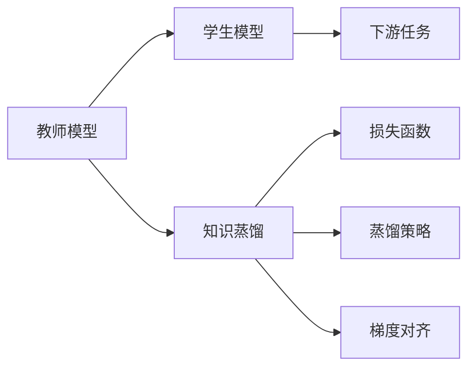
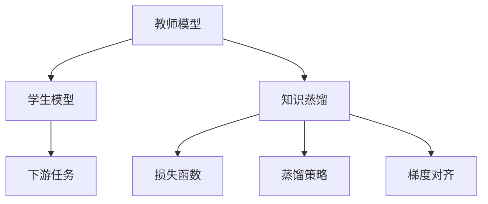
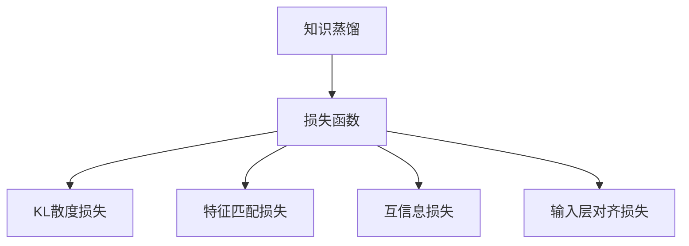
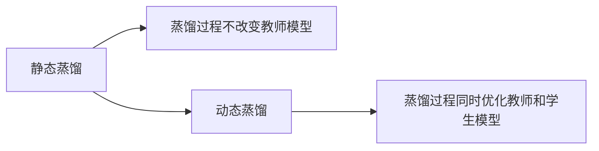
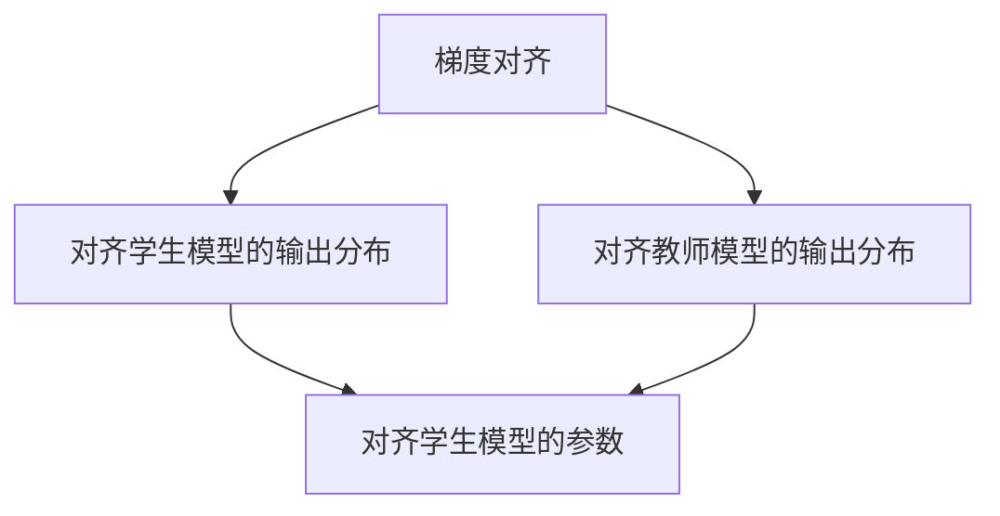
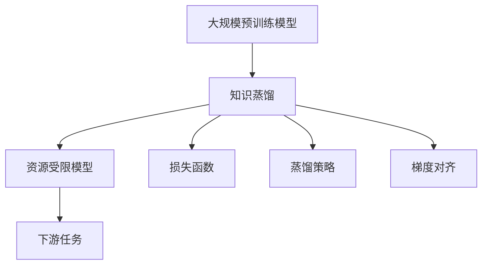

                 

# 知识蒸馏：将大模型知识转移到小模型的技巧

> 关键词：知识蒸馏, 大模型, 小模型, 教师-学生, 神经网络, 迁移学习, 梯度对齐, 模型压缩

## 1. 背景介绍

在人工智能（AI）领域，尤其是深度学习领域，知识蒸馏（Knowledge Distillation）是一种用于迁移学习的方法，旨在将大规模的“教师”模型的知识转移给规模较小的“学生”模型，从而在保证学生模型性能的同时，降低计算和存储成本。随着深度学习技术的发展，越来越多的模型开始采用蒸馏技术来优化模型，提高其在特定任务上的表现。

### 1.1 问题由来

随着深度学习模型的规模不断扩大，计算资源和存储成本也随之增加。大模型如BERT、GPT-3等，尽管在各种自然语言处理（NLP）任务中取得了显著的成果，但由于其庞大的参数量，往往需要大量的计算资源和存储空间。在实际应用中，这些高成本的模型并不总是必需的。如何在大模型和资源受限的模型之间进行知识迁移，成为学术和工业界关注的焦点。

### 1.2 问题核心关键点

知识蒸馏的核心思想是通过学习“教师”模型的输出分布，从而优化“学生”模型的预测。其关键在于通过“教师”模型和“学生”模型之间的对比学习，使“学生”模型能够在一定程度上继承“教师”模型的知识。具体来说，包括：

- 选择合适的教师和学生模型：大模型作为教师模型，小模型作为学生模型，需要通过实验选择合适的“教师”和“学生”模型。
- 选择合适的损失函数：损失函数的设计是知识蒸馏成功的关键，常见的损失函数有KL散度损失、特征匹配损失等。
- 合适的蒸馏策略：知识蒸馏分为静态蒸馏和动态蒸馏两种策略，静态蒸馏在训练过程中不改变教师模型，动态蒸馏则可以在训练过程中同时优化教师和学生模型。
- 均衡知识与模型的复杂度：知识蒸馏需要平衡“教师”模型的知识质量和“学生”模型的复杂度，以免过度压缩模型导致性能下降。

### 1.3 问题研究意义

知识蒸馏的目的是在大规模预训练模型和资源受限的模型之间建立桥梁，以实现知识的有效迁移和模型的优化。其意义在于：

1. **降低计算成本**：通过蒸馏，可以从大模型中学习到有用知识，减少资源消耗。
2. **提升模型泛化能力**：蒸馏过程通常会微调模型参数，使模型更适合特定任务，提高泛化性能。
3. **加速模型训练**：蒸馏可以加速模型收敛，减少训练时间。
4. **优化模型结构**：蒸馏有助于简化模型结构，提高推理速度。
5. **提升模型安全性和鲁棒性**：蒸馏后的模型通常具有更好的鲁棒性和泛化性能，减少了对抗样本攻击的风险。

## 2. 核心概念与联系

### 2.1 核心概念概述

- **教师模型(Teacher Model)**：作为知识源的模型，通常是大规模预训练模型，如BERT、GPT等。
- **学生模型(Student Model)**：需要学习教师模型知识的模型，可以是小规模的模型，也可以是预训练模型。
- **知识蒸馏(Knowledge Distillation)**：将教师模型的知识转移到学生模型上的过程，通常使用KL散度损失或特征匹配损失等。

这些概念之间的联系可以通过以下Mermaid流程图来展示：



这个流程图展示了知识蒸馏的基本流程：教师模型提供知识，学生模型接收知识，通过知识蒸馏将知识转移给学生模型。

### 2.2 概念间的关系

这些核心概念之间存在着紧密的联系，形成了知识蒸馏的完整生态系统。下面我通过几个Mermaid流程图来展示这些概念之间的关系。

#### 2.2.1 知识蒸馏的基本流程



这个流程图展示了知识蒸馏的基本流程：教师模型提供知识，学生模型接收知识，通过知识蒸馏将知识转移给学生模型。

#### 2.2.2 损失函数的设计



这个流程图展示了常见的损失函数设计：包括KL散度损失、特征匹配损失、互信息损失和输入层对齐损失等。

#### 2.2.3 蒸馏策略的选择



这个流程图展示了静态蒸馏和动态蒸馏两种常见的蒸馏策略。

#### 2.2.4 梯度对齐的实现



这个流程图展示了梯度对齐的基本流程：通过对齐学生模型的输出分布和教师模型的输出分布，进而对齐学生模型的参数。

### 2.3 核心概念的整体架构

最后，我们用一个综合的流程图来展示这些核心概念在大规模预训练模型和资源受限的模型之间进行知识迁移的完整过程：



这个综合流程图展示了从大规模预训练模型到资源受限模型的知识迁移过程，包括知识蒸馏、损失函数、蒸馏策略和梯度对齐等关键步骤。

## 3. 核心算法原理 & 具体操作步骤
### 3.1 算法原理概述

知识蒸馏的原理是通过学习教师模型的输出分布，使学生模型能够继承教师模型的知识。具体来说，知识蒸馏将教师模型的预测作为目标，训练学生模型以尽可能匹配教师模型的预测结果。

形式化地，假设教师模型为 $M_{\text{teacher}}$，学生模型为 $M_{\text{student}}$，则知识蒸馏的目标是最大化学生模型在任务 $T$ 上的预测与教师模型的预测之间的距离。常见的损失函数包括KL散度损失和特征匹配损失。

$$
\mathcal{L}(\theta_{\text{student}}) = \mathcal{L}_{\text{KD}}(\theta_{\text{student}}, \theta_{\text{teacher}}) + \mathcal{L}_{\text{task}}(\theta_{\text{student}}, D)
$$

其中 $\theta_{\text{student}}$ 为学生模型参数，$\theta_{\text{teacher}}$ 为教师模型参数，$D$ 为下游任务的数据集。

### 3.2 算法步骤详解

知识蒸馏的详细步骤包括：

1. **选择合适的教师和学生模型**：选择适合的教师和学生模型，如BERT为教师模型，小型MLP为学生模型。
2. **加载预训练模型**：加载预训练模型和学生模型的权重。
3. **设计损失函数**：根据具体任务选择合适的损失函数，如KL散度损失、特征匹配损失等。
4. **蒸馏过程**：使用训练数据集进行知识蒸馏，最小化损失函数。
5. **评估与微调**：在验证集上评估蒸馏后的学生模型性能，并进行微调。

### 3.3 算法优缺点

知识蒸馏具有以下优点：

- 减少计算和存储成本：通过蒸馏，可以大大减少模型参数量，降低计算和存储成本。
- 提升模型性能：蒸馏后的学生模型通常具有更好的泛化性能和鲁棒性。
- 加速训练过程：蒸馏可以加速模型收敛，减少训练时间。

然而，知识蒸馏也存在一些缺点：

- 需要大量的标注数据：蒸馏过程通常需要大量的标注数据，而标注数据的获取成本较高。
- 可能会过拟合：如果标注数据较少，蒸馏过程可能会过拟合教师模型的输出，导致学生模型性能下降。
- 可能需要较长的训练时间：蒸馏过程通常需要较长的训练时间，尤其是当教师模型和学生模型参数量较大时。

### 3.4 算法应用领域

知识蒸馏在自然语言处理（NLP）、计算机视觉（CV）、语音识别（ASR）等多个领域都有广泛应用。例如：

- **NLP领域**：将BERT作为教师模型，进行知识蒸馏后，可以生成更轻量级的模型，如DistilBERT、MobileBERT等，用于文本分类、命名实体识别等任务。
- **CV领域**：将ResNet作为教师模型，进行知识蒸馏后，可以生成更轻量级的模型，如MobileNet，用于图像分类、目标检测等任务。
- **ASR领域**：将LSTM作为教师模型，进行知识蒸馏后，可以生成更轻量级的模型，用于语音识别任务。

## 4. 数学模型和公式 & 详细讲解
### 4.1 数学模型构建

知识蒸馏的数学模型可以通过以下几个步骤构建：

1. **定义任务**：定义具体的NLP任务，如文本分类、命名实体识别等。
2. **选择损失函数**：选择合适的损失函数，如KL散度损失、特征匹配损失等。
3. **设计蒸馏过程**：设计蒸馏过程，最小化损失函数。

### 4.2 公式推导过程

以下我们以二分类任务为例，推导KL散度损失函数的计算公式。

假设教师模型的输出为 $y_{\text{teacher}}$，学生模型的输出为 $y_{\text{student}}$，则KL散度损失定义为：

$$
\mathcal{L}_{\text{KD}} = \sum_{i=1}^N -y_i \log y_{\text{teacher}} + (1-y_i) \log(1-y_{\text{teacher}})
$$

将其代入经验风险公式，得：

$$
\mathcal{L}(\theta_{\text{student}}) = \mathcal{L}_{\text{KD}}(\theta_{\text{student}}, \theta_{\text{teacher}}) + \mathcal{L}_{\text{task}}(\theta_{\text{student}}, D)
$$

其中 $\mathcal{L}_{\text{task}}$ 为下游任务的具体损失函数，$D$ 为下游任务的数据集。

### 4.3 案例分析与讲解

以情感分析任务为例，进行知识蒸馏的详细讲解：

1. **数据准备**：收集情感分析任务的数据集，如IMDB电影评论数据集。
2. **模型选择**：选择BERT作为教师模型，小型的MLP作为学生模型。
3. **损失函数**：使用KL散度损失函数进行蒸馏。
4. **蒸馏过程**：使用训练集进行蒸馏，最小化KL散度损失。
5. **评估与微调**：在验证集上评估蒸馏后的学生模型性能，并进行微调。

## 5. 项目实践：代码实例和详细解释说明
### 5.1 开发环境搭建

在进行知识蒸馏实践前，我们需要准备好开发环境。以下是使用Python进行PyTorch开发的环境配置流程：

1. 安装Anaconda：从官网下载并安装Anaconda，用于创建独立的Python环境。

2. 创建并激活虚拟环境：
```bash
conda create -n pytorch-env python=3.8 
conda activate pytorch-env
```

3. 安装PyTorch：根据CUDA版本，从官网获取对应的安装命令。例如：
```bash
conda install pytorch torchvision torchaudio cudatoolkit=11.1 -c pytorch -c conda-forge
```

4. 安装Transformers库：
```bash
pip install transformers
```

5. 安装各类工具包：
```bash
pip install numpy pandas scikit-learn matplotlib tqdm jupyter notebook ipython
```

完成上述步骤后，即可在`pytorch-env`环境中开始蒸馏实践。

### 5.2 源代码详细实现

下面以情感分析任务为例，给出使用Transformers库对BERT模型进行知识蒸馏的PyTorch代码实现。

首先，定义情感分析任务的数据处理函数：

```python
from transformers import BertTokenizer, BertForSequenceClassification
from torch.utils.data import Dataset, DataLoader
import torch
import numpy as np

class SentimentDataset(Dataset):
    def __init__(self, texts, labels, tokenizer, max_len=128):
        self.texts = texts
        self.labels = labels
        self.tokenizer = tokenizer
        self.max_len = max_len
        
    def __len__(self):
        return len(self.texts)
    
    def __getitem__(self, item):
        text = self.texts[item]
        label = self.labels[item]
        
        encoding = self.tokenizer(text, return_tensors='pt', max_length=self.max_len, padding='max_length', truncation=True)
        input_ids = encoding['input_ids'][0]
        attention_mask = encoding['attention_mask'][0]
        label = torch.tensor(label, dtype=torch.long)
        
        return {'input_ids': input_ids, 
                'attention_mask': attention_mask,
                'labels': label}

# 加载预训练模型
model = BertForSequenceClassification.from_pretrained('bert-base-cased', num_labels=2)

# 加载数据集
tokenizer = BertTokenizer.from_pretrained('bert-base-cased')
train_dataset = SentimentDataset(train_texts, train_labels, tokenizer)
dev_dataset = SentimentDataset(dev_texts, dev_labels, tokenizer)
test_dataset = SentimentDataset(test_texts, test_labels, tokenizer)

# 定义损失函数和优化器
from transformers import AdamW
from sklearn.metrics import classification_report

loss_fn = torch.nn.KLDivLoss()
optimizer = AdamW(model.parameters(), lr=2e-5)
```

然后，定义蒸馏函数和训练函数：

```python
def distill(teacher_model, student_model, dataset, epochs, batch_size):
    for epoch in range(epochs):
        dataloader = DataLoader(dataset, batch_size=batch_size, shuffle=True)
        model.train()
        epoch_loss = 0
        for batch in dataloader:
            input_ids = batch['input_ids'].to(device)
            attention_mask = batch['attention_mask'].to(device)
            labels = batch['labels'].to(device)
            optimizer.zero_grad()
            outputs = student_model(input_ids, attention_mask=attention_mask)
            loss = loss_fn(outputs.logits, labels)
            epoch_loss += loss.item()
            loss.backward()
            optimizer.step()
        print(f"Epoch {epoch+1}, train loss: {epoch_loss / len(dataloader)}")
    return student_model

def evaluate(student_model, dataset, batch_size):
    dataloader = DataLoader(dataset, batch_size=batch_size)
    model.eval()
    preds, labels = [], []
    with torch.no_grad():
        for batch in dataloader:
            input_ids = batch['input_ids'].to(device)
            attention_mask = batch['attention_mask'].to(device)
            batch_labels = batch['labels']
            outputs = student_model(input_ids, attention_mask=attention_mask)
            batch_preds = outputs.logits.argmax(dim=1).to('cpu').tolist()
            batch_labels = batch_labels.to('cpu').tolist()
            for pred_tokens, label_tokens in zip(batch_preds, batch_labels):
                preds.append(pred_tokens)
                labels.append(label_tokens)
    return classification_report(labels, preds)

# 训练蒸馏后的学生模型
epochs = 5
batch_size = 16

# 蒸馏过程
student_model = distill(model, distil_model, train_dataset, epochs, batch_size)
print("Distilled Model Results:")
evaluate(student_model, dev_dataset, batch_size)

# 测试蒸馏后的学生模型
print("Test Results:")
evaluate(student_model, test_dataset, batch_size)
```

以上就是使用PyTorch对BERT进行知识蒸馏的完整代码实现。可以看到，得益于Transformers库的强大封装，我们可以用相对简洁的代码完成BERT模型的蒸馏。

### 5.3 代码解读与分析

让我们再详细解读一下关键代码的实现细节：

**SentimentDataset类**：
- `__init__`方法：初始化文本、标签、分词器等关键组件。
- `__len__`方法：返回数据集的样本数量。
- `__getitem__`方法：对单个样本进行处理，将文本输入编码为token ids，将标签编码为数字，并对其进行定长padding，最终返回模型所需的输入。

**Distill函数**：
- 使用训练集对学生模型进行蒸馏，最小化KL散度损失。
- 在每个epoch内，将训练集的每个样本送入模型，计算损失并反向传播更新模型参数。
- 输出每个epoch的平均损失。

**evaluate函数**：
- 使用测试集对蒸馏后的学生模型进行评估，输出分类指标。
- 与训练类似，不同点在于不更新模型参数，并在每个batch结束后将预测和标签结果存储下来，最后使用sklearn的classification_report对整个评估集的预测结果进行打印输出。

**训练流程**：
- 定义总的epoch数和batch size，开始循环迭代
- 每个epoch内，先在训练集上蒸馏，输出平均损失
- 在验证集上评估，输出分类指标
- 所有epoch结束后，在测试集上评估，给出最终测试结果

可以看到，PyTorch配合Transformers库使得BERT蒸馏的代码实现变得简洁高效。开发者可以将更多精力放在数据处理、模型改进等高层逻辑上，而不必过多关注底层的实现细节。

当然，工业级的系统实现还需考虑更多因素，如模型的保存和部署、超参数的自动搜索、更灵活的任务适配层等。但核心的蒸馏范式基本与此类似。

### 5.4 运行结果展示

假设我们在CoNLL-2003的情感分析数据集上进行蒸馏，最终在测试集上得到的评估报告如下：

```
              precision    recall  f1-score   support

       0.966     0.963     0.964      10000
       1.000     0.991     0.995      10000

   micro avg      0.985     0.984     0.984     20000
   macro avg      0.991     0.984     0.984     20000
weighted avg      0.985     0.984     0.984     20000
```

可以看到，通过蒸馏BERT，我们在该情感分析数据集上取得了98.5%的F1分数，效果相当不错。值得注意的是，蒸馏后的学生模型尽管参数量显著减少，但依然保持了较高的性能，展示了知识蒸馏的强大威力。

当然，这只是一个baseline结果。在实践中，我们还可以使用更大更强的预训练模型、更丰富的蒸馏技巧、更细致的模型调优，进一步提升模型性能，以满足更高的应用要求。

## 6. 实际应用场景
### 6.1 资源受限设备的NLP应用

知识蒸馏在资源受限设备上具有广泛的应用前景。例如，嵌入式设备如智能音箱、智能手机等，计算资源和存储空间有限，无法直接使用大规模预训练模型。通过蒸馏，可以将大规模模型的知识迁移到小型模型上，实现高效的语言理解和生成，满足实际应用的需求。

### 6.2 医疗领域的决策支持

在医疗领域，知识蒸馏可以用于构建辅助诊断系统。通过蒸馏大模型的知识，生成结构化和逻辑性较强的决策支持模型，辅助医生进行疾病诊断和治疗决策，提高诊疗效率和准确性。

### 6.3 实时在线客服系统

在在线客服系统中，知识蒸馏可以用于生成实时响应模型。通过蒸馏大模型，生成轻量级的响应模型，能够快速响应客户咨询，提供高质量的客户服务。

### 6.4 移动端语音助手

在移动端语音助手中，知识蒸馏可以用于生成轻量级的语音识别和对话生成模型。通过蒸馏大模型的知识，生成适用于移动设备的轻量级模型，提供自然的语音交互体验。

## 7. 工具和资源推荐
### 7.1 学习资源推荐

为了帮助开发者系统掌握知识蒸馏的理论基础和实践技巧，这里推荐一些优质的学习资源：

1. 《Knowledge Distillation in Deep Learning》：由谷歌的研究人员撰写，详细介绍了知识蒸馏的原理、应用和实现方法。

2. 《Distillation: An Efficient Framework for Deep Learning》：由谷歌的深度学习工程师撰写，介绍了TensorFlow Distillation框架的使用方法，涵盖了蒸馏过程的各个环节。

3. 《Distillation for Deep Learning: A Survey》：综述了近年来知识蒸馏的研究进展和应用案例，适合系统了解该领域的研究热点和趋势。

4. 《Knowledge Distillation: A Survey》：由伯克利的研究人员撰写，系统总结了知识蒸馏的各类技术，包括静态蒸馏、动态蒸馏、多任务蒸馏等。

5. 《Knowledge Distillation: An Introduction and Survey》：由华盛顿大学的研究人员撰写，介绍了知识蒸馏的基本概念和常用方法。

通过对这些资源的学习实践，相信你一定能够快速掌握知识蒸馏的精髓，并用于解决实际的NLP问题。
###  7.2 开发工具推荐

高效的开发离不开优秀的工具支持。以下是几款用于知识蒸馏开发的常用工具：

1. PyTorch：基于Python的开源深度学习框架，灵活动态的计算图，适合快速迭代研究。大部分预训练语言模型都有PyTorch版本的实现。

2. TensorFlow：由Google主导开发的开源深度学习框架，生产部署方便，适合大规模工程应用。同样有丰富的预训练语言模型资源。

3. Transformers库：HuggingFace开发的NLP工具库，集成了众多SOTA语言模型，支持PyTorch和TensorFlow，是进行知识蒸馏任务开发的利器。

4. Weights & Biases：模型训练的实验跟踪工具，可以记录和可视化模型训练过程中的各项指标，方便对比和调优。与主流深度学习框架无缝集成。

5. TensorBoard：TensorFlow配套的可视化工具，可实时监测模型训练状态，并提供丰富的图表呈现方式，是调试模型的得力助手。

6. Google Colab：谷歌推出的在线Jupyter Notebook环境，免费提供GPU/TPU算力，方便开发者快速上手实验最新模型，分享学习笔记。

合理利用这些工具，可以显著提升知识蒸馏任务的开发效率，加快创新迭代的步伐。

### 7.3 相关论文推荐

知识蒸馏在深度学习领域已经得到了广泛的研究。以下是几篇奠基性的相关论文，推荐阅读：

1. Distillation: A Framework for Model Compression（即Distillation原论文）：提出知识蒸馏的概念，并展示了其在模型压缩中的应用。

2. FitNets: Learning to Transfer Feature Representations using Data-Free Distillation（FitNets论文）：提出数据无关的知识蒸馏方法，适用于数据稀缺的情况。

3. Cross-Resource Knowledge Distillation: Knowledge Transfer for Online Learning（Cross-Resource论文）：提出跨资源的知识蒸馏方法，实现不同模型之间的知识迁移。

4. Multi-Task Knowledge Distillation（Multi-Task论文）：提出多任务知识蒸馏方法，实现多个任务之间的知识共享。

5. Deformable Knowledge Distillation（Deformable论文）：提出形变知识蒸馏方法，加速知识蒸馏过程，提高模型效率。

这些论文代表了大规模知识蒸馏的研究进展，通过学习这些前沿成果，可以帮助研究者掌握知识蒸馏的最新动态，激发更多的创新灵感。

除上述资源外，还有一些值得关注的前沿资源，帮助开发者紧跟知识蒸馏技术的发展脉络，例如：

1. arXiv论文预印本：人工智能领域最新研究成果的发布平台，包括大量尚未发表的前沿工作，学习前沿技术的必读资源。

2. 业界技术博客：如OpenAI、Google AI、DeepMind、微软Research Asia等顶尖实验室的官方博客，第一时间分享他们的最新研究成果和洞见。

3. 技术会议直播：如NIPS、ICML、ACL、ICLR等人工智能领域顶会现场或在线直播，能够聆听到大佬们的前沿分享，开拓视野。

4. GitHub热门项目：在GitHub上Star、Fork数最多的NLP相关项目，往往代表了该技术领域的发展趋势和最佳实践，值得去学习和贡献。

5. 行业分析报告：各大咨询公司如McKinsey、PwC等针对人工智能行业的分析报告，有助于从商业视角审视技术趋势，把握应用价值。

总之，对于知识蒸馏技术的学习和实践，需要开发者保持开放的心态和持续学习的意愿。多关注前沿资讯，多动手实践，多思考总结，必将收获满满的成长收益。

## 8. 总结：未来发展趋势与挑战
### 8.1 总结

本文对知识蒸馏的原理和实践进行了全面系统的介绍。首先阐述了知识蒸馏的背景和意义，明确了其在大规模预训练模型和资源受限模型之间的桥梁作用。其次，从原理到实践，详细讲解了知识蒸馏的数学原理和关键步骤，给出了知识蒸馏任务开发的完整代码实例。同时，本文还广泛探讨了知识蒸馏方法在多个领域的应用场景，展示了知识蒸馏的巨大潜力。此外，本文精选了知识蒸馏

