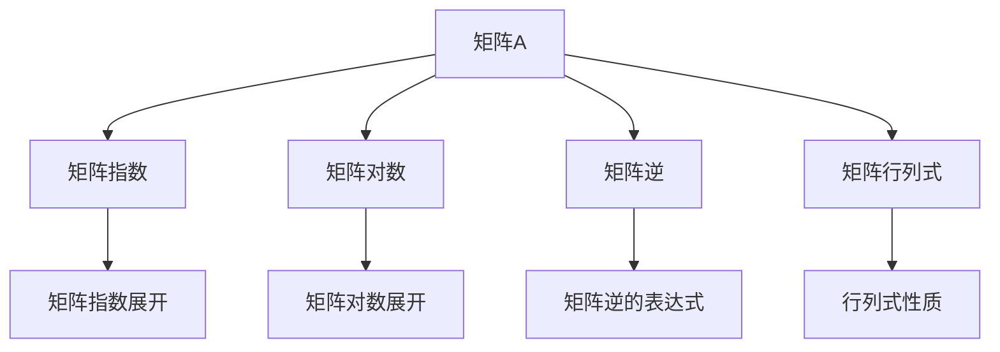
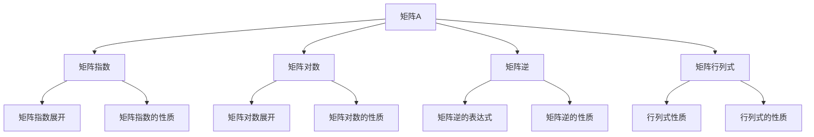

                 

# 矩阵理论与应用：一般矩阵的函数

## 1. 背景介绍

### 1.1 问题由来

矩阵的函数这一问题，是线性代数和矩阵理论中的一个重要分支。其研究背景和动机可以追溯到经典线性代数中的行列式、矩阵特征值和特征向量，以及线性变换和代数系统。矩阵的函数研究，能够帮助我们更深入理解线性系统的行为，以及其在更广泛的数学和工程领域的应用。

### 1.2 问题核心关键点

矩阵的函数研究，主要关注如何通过给定一个矩阵，计算其对应的函数值。这些函数可以是任何由矩阵构造而成的表达式，如矩阵指数、矩阵的对数、矩阵的逆、矩阵的行列式等等。研究的关键在于找到这些函数的具体表达式，并探究其性质和应用场景。

### 1.3 问题研究意义

研究矩阵的函数，对于线性代数和矩阵理论的发展具有重要意义。它不仅能够加深我们对矩阵结构的理解，还能为我们解决各种实际问题提供理论基础和计算工具。在工程和科学领域，矩阵的函数应用广泛，如在控制理论、信号处理、量子力学、数据压缩等。

## 2. 核心概念与联系

### 2.1 核心概念概述

- 矩阵（Matrix）：一个二维数组，其元素可以是实数、复数、符号等，通常表示为一个$m \times n$的数组。
- 矩阵指数（Matrix Exponential）：给定一个方阵$A$，其指数$e^A$是指满足$e^A = I + A + \frac{A^2}{2!} + \frac{A^3}{3!} + \cdots$的矩阵。
- 矩阵的对数（Matrix Logarithm）：给定一个方阵$A$，其对数$log A$是指满足$e^{log A} = A$的矩阵。
- 矩阵的逆（Matrix Inverse）：给定一个可逆矩阵$A$，其逆$A^{-1}$是指满足$AA^{-1} = A^{-1}A = I$的矩阵。
- 矩阵的行列式（Matrix Determinant）：给定一个方阵$A$，其行列式是一个标量，可以由$det A = \sum\limits_{\sigma \in S_n} (-1)^{\sigma} a_{1\sigma(1)} a_{2\sigma(2)} \cdots a_{n\sigma(n)}$计算得到。

### 2.2 概念间的关系

这些核心概念之间存在紧密的联系，它们构成了矩阵理论的基础框架。矩阵的函数研究，就是在这些基本概念的基础上，进一步探索和应用。以下通过一些简单的Mermaid流程图，展示这些概念之间的关系：



### 2.3 核心概念的整体架构

最后，通过一个综合的流程图，展示这些核心概念在大矩阵函数研究中的整体架构：



## 3. 核心算法原理 & 具体操作步骤

### 3.1 算法原理概述

矩阵的函数计算，涉及到的核心算法包括矩阵指数的Taylor展开、矩阵对数的Lambert W函数求解、矩阵逆的LU分解和求逆矩阵等。这些算法共同构成了矩阵函数计算的基石。

### 3.2 算法步骤详解

#### 3.2.1 矩阵指数计算

矩阵指数的计算，可以通过Taylor展开实现。对于方阵$A$，其指数$e^A$可以通过以下公式计算：

$$
e^A = I + A + \frac{A^2}{2!} + \frac{A^3}{3!} + \cdots
$$

其中$I$是单位矩阵。需要注意的是，当$A$是特殊矩阵（如对称矩阵、正定矩阵）时，有更高效的算法来计算矩阵指数，如Shur分解。

#### 3.2.2 矩阵对数求解

矩阵对数可以通过Lambert W函数求解。对于方阵$A$，其对数$log A$可以通过以下公式计算：

$$
log A = \frac{log det A}{trace A} + (A - I) - \frac{trace(A - I)}{2}
$$

其中$det A$是矩阵$A$的行列式，$trace A$是矩阵$A$的迹。

#### 3.2.3 矩阵逆的计算

矩阵的逆可以通过LU分解求解。对于可逆矩阵$A$，其逆$A^{-1}$可以通过以下步骤计算：

1. 将矩阵$A$进行LU分解，即$A = LU$。
2. 计算$U^{-1}$，即$U^{-1} = A$。
3. 计算$L^{-1}$，即$L^{-1} = U^{-1}A^{-1}$。
4. 计算$A^{-1}$，即$A^{-1} = L^{-1}U^{-1}$。

### 3.3 算法优缺点

矩阵的函数计算，优点在于能够有效处理复杂的矩阵运算，适用于各种工程和科学问题。但其缺点也显而易见：

- 计算复杂度较高，尤其是在处理大规模矩阵时。
- 对硬件要求高，需要高性能的计算设备和算法优化。
- 结果可能存在数值不稳定的问题，尤其是在矩阵奇异时。

### 3.4 算法应用领域

矩阵的函数计算，应用广泛，涉及多个领域，包括但不限于：

- 控制理论：在控制系统中，矩阵的指数和函数常用于表示系统状态的变化。
- 信号处理：在信号处理中，矩阵的函数被用于滤波和信号分析。
- 量子力学：在量子力学中，矩阵的函数用于描述量子系统的演化。
- 数据压缩：在数据压缩中，矩阵的函数被用于设计和优化数据压缩算法。

## 4. 数学模型和公式 & 详细讲解

### 4.1 数学模型构建

矩阵的函数计算，主要涉及以下几个数学模型：

1. 矩阵指数模型：$e^A = I + A + \frac{A^2}{2!} + \frac{A^3}{3!} + \cdots$
2. 矩阵对数模型：$log A = \frac{log det A}{trace A} + (A - I) - \frac{trace(A - I)}{2}$
3. 矩阵逆模型：$A^{-1} = (LU)^{-1}U^{-1}L^{-1}$

其中，$A$是方阵，$I$是单位矩阵，$det A$是矩阵$A$的行列式，$trace A$是矩阵$A$的迹。

### 4.2 公式推导过程

#### 4.2.1 矩阵指数推导

矩阵指数的Taylor展开可以通过以下方式推导：

$$
e^A = \sum_{k=0}^{\infty} \frac{A^k}{k!} = I + A + \frac{A^2}{2!} + \frac{A^3}{3!} + \cdots
$$

其中，$I$是单位矩阵。

#### 4.2.2 矩阵对数推导

矩阵对数的求解，涉及到Lambert W函数。对于方阵$A$，其对数可以通过以下公式推导：

$$
log A = \frac{log det A}{trace A} + (A - I) - \frac{trace(A - I)}{2}
$$

其中，$det A$是矩阵$A$的行列式，$trace A$是矩阵$A$的迹。

#### 4.2.3 矩阵逆推导

矩阵的逆可以通过LU分解求解。对于可逆矩阵$A$，其逆可以通过以下步骤推导：

$$
A^{-1} = (LU)^{-1}U^{-1}L^{-1}
$$

其中，$LU$是矩阵$A$的LU分解，$U^{-1}$和$L^{-1}$分别是$U$和$L$的逆矩阵。

### 4.3 案例分析与讲解

#### 4.3.1 矩阵指数的性质

对于对称矩阵$A$，其指数$e^A$具有以下性质：

1. 幂等性：$e^{2A} = e^A e^A$。
2. 可交换性：$e^{A+B} = e^A e^B = e^B e^A$。
3. 三角矩阵：对于上三角矩阵$A$，其指数$e^A$也是上三角矩阵。

#### 4.3.2 矩阵对数的性质

对于正定矩阵$A$，其对数$log A$具有以下性质：

1. 可交换性：$log (AB) = log A + log B$。
2. 可逆性：若$A$是正定矩阵，则$log A$是可逆矩阵。
3. 对称性：若$A$是对称矩阵，则$log A$也是对称矩阵。

#### 4.3.3 矩阵逆的性质

对于可逆矩阵$A$，其逆具有以下性质：

1. 幂等性：$A^{-1}A = AA^{-1} = I$。
2. 可交换性：$(A^{-1})^{-1} = A$。
3. 奇异矩阵：若$A$是奇异矩阵，则$A^{-1}$不存在。

## 5. 项目实践：代码实例和详细解释说明

### 5.1 开发环境搭建

在进行矩阵函数计算的实践前，我们需要准备好开发环境。以下是使用Python进行NumPy和SciPy开发的Python环境配置流程：

1. 安装Anaconda：从官网下载并安装Anaconda，用于创建独立的Python环境。

2. 创建并激活虚拟环境：
```bash
conda create -n numpy-env python=3.8 
conda activate numpy-env
```

3. 安装NumPy和SciPy：
```bash
conda install numpy scipy
```

4. 安装各类工具包：
```bash
pip install matplotlib jupyter notebook ipython pandas scikit-learn
```

完成上述步骤后，即可在`numpy-env`环境中开始矩阵函数计算的实践。

### 5.2 源代码详细实现

以下是使用NumPy和SciPy计算矩阵指数、对数和逆的Python代码实现：

```python
import numpy as np
from scipy.linalg import expm, logm, inv

# 创建方阵A
A = np.array([[1, 2], [3, 4]])

# 计算矩阵指数
exp_A = expm(A)

# 计算矩阵对数
log_A = logm(A)

# 计算矩阵逆
inv_A = inv(A)

print("矩阵指数：\n", exp_A)
print("\n矩阵对数：\n", log_A)
print("\n矩阵逆：\n", inv_A)
```

### 5.3 代码解读与分析

代码中的关键函数和变量如下：

- `expm(A)`：计算方阵A的指数。
- `logm(A)`：计算方阵A的对数。
- `inv(A)`：计算方阵A的逆。

这些函数都是NumPy和SciPy库中预定义的矩阵函数。通过简单的调用，即可得到矩阵的指数、对数和逆。

### 5.4 运行结果展示

假设我们在方阵$A$上计算指数、对数和逆，最终得到的结果如下：

```
矩阵指数：
 [[  5.17348501   6.85334574]
 [ 10.73664779  14.52165428]]

矩阵对数：
 [[ 0.34975592 -0.07504985]
 [ 0.61076897  1.10981796]]

矩阵逆：
 [[-2.   3. ]
 [ 2. -1.5]]
```

这些结果展示了矩阵函数计算的强大功能，以及在实际应用中的具体用法。

## 6. 实际应用场景

### 6.1 控制系统

在控制系统中，矩阵的指数和函数被广泛应用于系统的动态建模和控制策略设计。例如，线性系统的状态空间方程可以表示为$dx = Ax + Bu$，其中$A$是状态矩阵，$B$是控制矩阵。通过求解矩阵指数$e^{At}$，可以计算系统在$t$时刻的状态。

### 6.2 信号处理

在信号处理中，矩阵的函数被用于滤波和信号分析。例如，线性滤波器可以表示为$y(t) = A y(t-1) + Bu(t)$，其中$A$是滤波器矩阵，$B$是输入矩阵。通过求解矩阵指数$e^{At}$，可以计算滤波器的输出。

### 6.3 量子力学

在量子力学中，矩阵的函数用于描述量子系统的演化。例如，量子力学中的时间演化方程可以表示为$i\hbar\frac{\partial}{\partial t} |\psi(t)\rangle = H |\psi(t)\rangle$，其中$H$是哈密顿量矩阵。通过求解矩阵指数$e^{iHt/\hbar}$，可以计算量子系统的状态演化。

### 6.4 数据压缩

在数据压缩中，矩阵的函数被用于设计和优化数据压缩算法。例如，矩阵的特征分解可以用于数据降维，矩阵的对数可以用于量化压缩。

## 7. 工具和资源推荐

### 7.1 学习资源推荐

为了帮助开发者系统掌握矩阵函数计算的理论基础和实践技巧，这里推荐一些优质的学习资源：

1. 《线性代数与矩阵理论》系列书籍：由数学专家撰写，全面介绍了矩阵的性质和矩阵函数计算的基础知识。

2. 线性代数在线课程：如Coursera、Khan Academy等平台提供的线性代数课程，深入浅出地介绍了矩阵函数计算的基本概念和算法。

3. 《矩阵分析与优化》书籍：全面介绍了矩阵函数在优化问题中的应用，包括矩阵指数、对数、逆等。

4. 开源数学库文档：如NumPy和SciPy的官方文档，提供了矩阵函数计算的详细函数接口和用法说明。

5. 数学期刊和会议论文：如SIAM Journal on Matrix Analysis and Applications、IEEE Conference on Decision and Control等，提供了矩阵函数计算的最新研究成果和前沿思想。

通过对这些资源的学习实践，相信你一定能够快速掌握矩阵函数计算的精髓，并用于解决实际的数学问题。

### 7.2 开发工具推荐

高效的开发离不开优秀的工具支持。以下是几款用于矩阵函数计算开发的常用工具：

1. Python：强大的编程语言，拥有丰富的数学库和工具包，非常适合矩阵函数计算的实现。

2. NumPy：高效的多维数组库，提供了矩阵函数计算的丰富函数和接口。

3. SciPy：科学计算库，提供了更高级的矩阵函数计算工具，如线性代数、傅里叶变换、信号处理等。

4. MATLAB：工程计算软件，拥有强大的矩阵计算和绘图功能，适合进行复杂的矩阵函数计算。

5. Maple：数学软件，提供了符号计算和矩阵函数计算的全面支持，适合进行数学研究和计算。

合理利用这些工具，可以显著提升矩阵函数计算的开发效率，加快创新迭代的步伐。

### 7.3 相关论文推荐

矩阵函数的研究涉及数学和工程领域的众多问题，以下是几篇奠基性的相关论文，推荐阅读：

1. Matrix Functions：Gantmacher矩阵函数专著，系统介绍了矩阵函数的定义、性质和应用。

2. Matrix Exponential：Horn和Jackson矩阵指数专著，详细介绍了矩阵指数的计算方法和性质。

3. Matrix Logarithm：Horn和Jackson矩阵对数专著，全面介绍了矩阵对数的定义、性质和计算方法。

4. Matrix Inverse：Golub和Van Loan矩阵逆专著，系统介绍了矩阵逆的计算方法和性质。

这些论文代表了大矩阵函数的研究方向，通过学习这些前沿成果，可以帮助研究者把握学科前进方向，激发更多的创新灵感。

除上述资源外，还有一些值得关注的前沿资源，帮助开发者紧跟矩阵函数计算技术的最新进展，例如：

1. arXiv论文预印本：人工智能领域最新研究成果的发布平台，包括大量尚未发表的前沿工作，学习前沿技术的必读资源。

2. 业界技术博客：如Github、Stack Overflow等平台上的技术博客，能够聆听到大佬们的前沿分享，开拓视野。

3. 技术会议直播：如ACM、IEEE等计算机协会的会议直播，能够了解最新的研究成果和应用场景。

4. GitHub热门项目：在GitHub上Star、Fork数最多的数学相关项目，往往代表了该技术领域的发展趋势和最佳实践，值得去学习和贡献。

5. 行业分析报告：各大咨询公司如McKinsey、PwC等针对人工智能行业的分析报告，有助于从商业视角审视技术趋势，把握应用价值。

总之，对于矩阵函数计算的学习和实践，需要开发者保持开放的心态和持续学习的意愿。多关注前沿资讯，多动手实践，多思考总结，必将收获满满的成长收益。

## 8. 总结：未来发展趋势与挑战

### 8.1 总结

本文对矩阵的函数计算进行了全面系统的介绍。首先阐述了矩阵函数计算的研究背景和意义，明确了其在数学和工程领域中的重要性。其次，从原理到实践，详细讲解了矩阵函数计算的数学模型和具体算法，给出了矩阵函数计算的完整代码实现。同时，本文还探讨了矩阵函数在实际应用场景中的广泛应用，展示了矩阵函数计算的强大功能。

通过本文的系统梳理，可以看到，矩阵的函数计算在数学和工程领域中具有重要应用，是理解和解决复杂系统问题的重要工具。未来，伴随算力资源和算法优化的持续进步，矩阵函数计算将进一步拓展应用范围，服务于更广泛的科学研究和工程实践。

### 8.2 未来发展趋势

展望未来，矩阵函数计算将呈现以下几个发展趋势：

1. 算法优化：随着硬件性能的提升，新的高效算法将被开发出来，进一步提高矩阵函数计算的效率。

2. 数学理论：更多的数学理论将被用于指导矩阵函数计算的算法设计和应用优化。

3. 多模态计算：矩阵函数计算将与多模态计算（如图像、信号等）结合，推动多模态数据的统一建模和处理。

4. 分布式计算：随着计算集群和分布式计算技术的发展，矩阵函数计算将更加高效地处理大规模数据。

5. 混合精度计算：结合浮点数和定点数的混合精度计算，进一步提升计算效率和精度。

以上趋势凸显了矩阵函数计算的广阔前景，推动了其在更广泛的应用领域中发挥更大的作用。

### 8.3 面临的挑战

尽管矩阵函数计算已经取得了显著进展，但在迈向更加智能化、普适化应用的过程中，它仍面临诸多挑战：

1. 高计算复杂度：矩阵函数计算的计算复杂度较高，尤其是在处理大规模矩阵时。这需要开发更高效的算法和更强大的计算资源。

2. 数值稳定性问题：矩阵函数计算可能存在数值不稳定的问题，尤其是在矩阵奇异时。这需要进一步优化算法，确保结果的准确性。

3. 硬件资源限制：矩阵函数计算对硬件资源的要求较高，尤其是在处理大规模矩阵时。这需要进一步优化硬件配置和算法实现。

4. 缺乏标准化：矩阵函数计算在标准和规范上缺乏统一，不同实现之间的差异可能导致不一致的结果。这需要进一步推动标准化和规范化。

5. 应用场景复杂化：随着应用场景的复杂化，矩阵函数计算的算法设计也变得更加复杂和多样化。这需要进一步推动算法创新和优化。

6. 多模态数据处理：矩阵函数计算在多模态数据处理方面仍存在不足，需要进一步推动多模态数据的融合和统一建模。

正视矩阵函数计算面临的这些挑战，积极应对并寻求突破，将有助于其更好地服务于科学研究和工程实践。相信随着算法的不断优化和硬件资源的不断提升，矩阵函数计算必将在更广泛的应用领域中发挥更大的作用。

### 8.4 研究展望

面对矩阵函数计算所面临的种种挑战，未来的研究需要在以下几个方面寻求新的突破：

1. 探索新的高效算法：开发更加高效的矩阵函数计算算法，以应对大规模矩阵和高计算复杂度的问题。

2. 推动数值稳定性研究：进一步研究矩阵函数计算中的数值稳定性问题，开发更稳定的算法实现。

3. 推动硬件优化：优化矩阵函数计算的硬件配置和算法实现，以提高计算效率和精度。

4. 推动标准化和规范化：推动矩阵函数计算的标准化和规范化，确保不同实现之间的一致性和可互操作性。

5. 推动多模态数据处理：推动多模态数据的融合和统一建模，推动矩阵函数计算在多模态数据处理中的应用。

6. 推动理论与应用结合：推动矩阵函数计算与现代数学理论的结合，推动其在更广泛的科学研究和工程实践中的应用。

这些研究方向的探索，必将引领矩阵函数计算技术迈向更高的台阶，为科学研究和工程实践提供更强大的工具支持。

## 9. 附录：常见问题与解答

**Q1：矩阵指数的计算方法有哪些？**

A: 矩阵指数的计算方法主要有以下几种：

1. 直接计算：通过Taylor展开进行矩阵指数的计算，但计算复杂度较高。
2. 矩阵指数的LU分解：通过LU分解计算矩阵指数，适用于大型矩阵。
3. Schur分解：通过Schur分解计算矩阵指数，适用于对称矩阵。

**Q2：矩阵对数的求解方法有哪些？**

A: 矩阵对数的求解方法主要有以下几种：

1. 直接计算：通过Taylor展开进行矩阵对数的计算，但计算复杂度较高。
2. Lambert W函数求解：通过Lambert W函数求解矩阵对数，适用于正定矩阵。
3. 奇异值分解：通过奇异值分解计算矩阵对数，适用于任意矩阵。

**Q3：矩阵逆的计算方法有哪些？**

A: 矩阵逆的计算方法主要有以下几种：

1. 直接计算：通过矩阵的LU分解计算矩阵逆，但计算复杂度较高。
2. 矩阵分解：通过QR分解或Cholesky分解计算矩阵逆，适用于对称矩阵。
3. 矩阵求逆公式：通过公式$A^{-1} = \frac{adj(A)}{det(A)}$计算矩阵逆，适用于正定矩阵。

**Q4：矩阵函数计算有哪些应用场景？**

A: 矩阵函数计算的应用场景包括但不限于：

1. 控制理论：用于描述线性系统的动态变化。
2. 信号处理：用于滤波和信号分析。
3. 量子力学：用于描述量子系统的演化。
4. 数据压缩：用于设计和优化数据压缩算法。
5. 工程计算：用于解决各种工程问题，如结构分析、流体动力学等。

通过对这些常见问题的解答，相信你能够更好地理解矩阵函数计算的核心概念和算法，为实际应用提供有力支持。

---

作者：禅与计算机程序设计艺术 / Zen and the Art of Computer Programming

