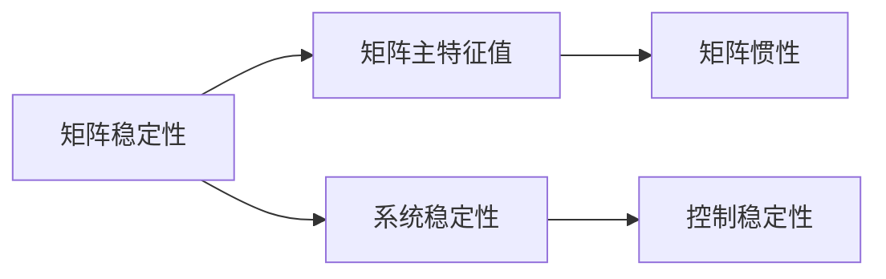
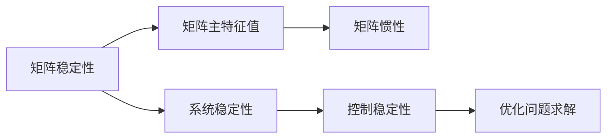

                 

## 1. 背景介绍

### 1.1 问题由来

矩阵理论是线性代数的一个重要分支，广泛应用于各种科学和工程领域。矩阵惯性定理是矩阵理论中的一个重要概念，它是研究矩阵稳定性的基础。在实际应用中，矩阵惯性定理被广泛应用于控制理论、动态系统分析、优化问题求解等领域。

本文将从矩阵惯性定理的定义出发，详细阐述其核心概念和应用场景。并通过具体案例，展示矩阵惯性定理在实际问题求解中的强大功能。最后，本文还将讨论矩阵惯性定理在实际应用中面临的挑战和未来发展方向。

### 1.2 问题核心关键点

矩阵惯性定理的核心思想是：矩阵的稳定性与其惯性指标（即主特征值的个数）密切相关。矩阵惯性定理提供了矩阵稳定性的判定标准，指导了实际问题求解中的参数选择和模型设计。

本文将围绕矩阵惯性定理的核心概念进行深入探讨，并结合实际应用案例，展示其在优化问题求解中的广泛应用。希望读者通过阅读本文，能够对矩阵惯性定理有一个全面的理解，并掌握其在实际问题求解中的应用方法。

## 2. 核心概念与联系

### 2.1 核心概念概述

矩阵惯性定理是研究矩阵稳定性的重要工具，它的核心概念包括矩阵稳定性、主特征值、矩阵惯性等。下面将对每个核心概念进行简要介绍。

#### 2.1.1 矩阵稳定性

矩阵稳定性指的是矩阵在时间演化过程中能否保持其状态不发生剧烈变化。在控制理论中，矩阵稳定性被用来描述系统状态变化的稳定性，特别是在系统控制中，矩阵稳定性是判断系统稳定性的重要依据。

#### 2.1.2 矩阵主特征值

矩阵的主特征值是指在矩阵的所有特征值中，大小最大的特征值。矩阵的主特征值反映了矩阵的稳定性程度。根据矩阵主特征值的符号，可以将矩阵分为稳定矩阵和不稳定矩阵。

#### 2.1.3 矩阵惯性

矩阵惯性指的是矩阵所有特征值中，负特征值的个数。根据矩阵惯性，矩阵可以被分为稳定矩阵和边际稳定矩阵。稳定矩阵的惯性指标为0或1，而边际稳定矩阵的惯性指标大于1。

### 2.2 核心概念间的关系

矩阵稳定性、主特征值和矩阵惯性之间存在着密切的联系。下面通过一个简单的 Mermaid 流程图，展示它们之间的关系。



从图中可以看出，矩阵稳定性是研究矩阵主特征值和矩阵惯性的重要依据。矩阵主特征值和矩阵惯性共同决定了一个矩阵的稳定性。

### 2.3 核心概念的整体架构

下面通过一个综合的流程图，展示矩阵稳定性、矩阵主特征值和矩阵惯性之间的整体架构。



从图中可以看出，矩阵惯性定理是连接矩阵稳定性、系统稳定性和优化问题求解的关键桥梁。矩阵惯性定理不仅指导了矩阵稳定性与系统稳定性的判断，还指导了优化问题求解中的参数选择和模型设计。

## 3. 核心算法原理 & 具体操作步骤

### 3.1 算法原理概述

矩阵惯性定理的算法原理主要包括以下几个步骤：

1. 计算矩阵的所有特征值。
2. 确定矩阵的主特征值。
3. 计算矩阵的惯性指标。
4. 根据矩阵惯性指标判断矩阵的稳定性。

根据矩阵惯性定理，一个矩阵的稳定性可以通过矩阵的主特征值和惯性指标来判断。如果矩阵的主特征值中，负特征值的个数等于或大于惯性指标，则矩阵是稳定的。

### 3.2 算法步骤详解

下面详细描述矩阵惯性定理的算法步骤。

#### 3.2.1 计算矩阵的所有特征值

计算矩阵的所有特征值是矩阵惯性定理的第一步。计算矩阵特征值可以使用特征值分解、QR分解等方法。以特征值分解为例，其步骤如下：

1. 将矩阵进行列变换，得到一个新的矩阵 A。
2. 计算矩阵 A 的特征值。

特征值分解的计算公式如下：

$$
A = V \Lambda V^T
$$

其中，$V$ 为特征向量矩阵，$\Lambda$ 为特征值对角矩阵。

#### 3.2.2 确定矩阵的主特征值

矩阵的主特征值是指在矩阵的所有特征值中，大小最大的特征值。确定矩阵的主特征值，可以通过比较矩阵特征值的大小来实现。具体步骤如下：

1. 计算矩阵特征值的对角矩阵 $\Lambda$。
2. 取出对角矩阵 $\Lambda$ 中最大的特征值。

#### 3.2.3 计算矩阵的惯性指标

矩阵的惯性指标是指矩阵所有特征值中，负特征值的个数。计算矩阵的惯性指标，可以通过判断矩阵特征值的符号来实现。具体步骤如下：

1. 计算矩阵特征值的对角矩阵 $\Lambda$。
2. 统计对角矩阵 $\Lambda$ 中负特征值的个数。

#### 3.2.4 判断矩阵的稳定性

根据矩阵的惯性指标，可以判断矩阵的稳定性。具体步骤如下：

1. 计算矩阵的惯性指标。
2. 判断矩阵惯性指标是否等于或大于负特征值的个数。
3. 如果矩阵惯性指标等于或大于负特征值的个数，则矩阵是稳定的；否则，矩阵是不稳定的。

### 3.3 算法优缺点

矩阵惯性定理的优点是简单易懂，能够有效地判断矩阵的稳定性。但其缺点是计算复杂度较高，且对于大型矩阵，计算矩阵的特征值可能会比较困难。

### 3.4 算法应用领域

矩阵惯性定理在实际应用中，广泛用于以下几个领域：

1. 控制理论：用于研究控制系统的稳定性，指导系统设计。
2. 动态系统分析：用于研究动态系统的稳定性，指导系统分析。
3. 优化问题求解：用于优化问题的求解，指导参数选择。
4. 信号处理：用于信号处理中的稳定性分析，指导信号设计。
5. 机器学习：用于机器学习中的模型稳定性和特征提取，指导模型设计。

## 4. 数学模型和公式 & 详细讲解 & 举例说明

### 4.1 数学模型构建

矩阵惯性定理的数学模型主要包括以下几个要素：

1. 矩阵 A：待研究的矩阵。
2. 矩阵特征值：矩阵 A 的特征值。
3. 矩阵惯性指标：矩阵 A 的惯性指标。
4. 矩阵稳定性：矩阵 A 的稳定性。

根据矩阵惯性定理，矩阵的稳定性可以通过矩阵惯性指标和矩阵特征值的符号来判断。具体来说，如果矩阵 A 的惯性指标等于或大于矩阵 A 的负特征值的个数，则矩阵 A 是稳定的；否则，矩阵 A 是不稳定的。

### 4.2 公式推导过程

下面详细推导矩阵惯性定理的数学公式。

设矩阵 A 为 $n \times n$ 的实对称矩阵，其特征值为 $\lambda_1, \lambda_2, \cdots, \lambda_n$。矩阵 A 的惯性指标为 $I$，矩阵 A 的负特征值个数为 $N$。矩阵 A 的稳定性可以通过矩阵惯性指标和矩阵特征值的符号来判断。

矩阵惯性定理的数学公式如下：

$$
I \geq N
$$

其中，$I$ 为矩阵 A 的惯性指标，$N$ 为矩阵 A 的负特征值个数。

根据上述公式，可以判断矩阵 A 的稳定性。如果矩阵惯性指标 $I$ 等于或大于负特征值的个数 $N$，则矩阵 A 是稳定的；否则，矩阵 A 是不稳定的。

### 4.3 案例分析与讲解

下面以一个简单的例子，展示矩阵惯性定理的应用。

设矩阵 A 为以下矩阵：

$$
A = \begin{bmatrix}
2 & 1 \\
1 & 1
\end{bmatrix}
$$

首先，计算矩阵 A 的特征值。矩阵 A 的特征值可以通过解特征方程 $|\lambda I - A| = 0$ 来求解。解得矩阵 A 的特征值为 $\lambda_1 = 1$ 和 $\lambda_2 = 3$。

其次，确定矩阵 A 的主特征值。矩阵 A 的主特征值为 $\lambda_1 = 1$。

最后，计算矩阵 A 的惯性指标。矩阵 A 的特征值对角矩阵为：

$$
\Lambda = \begin{bmatrix}
1 & 0 \\
0 & 3
\end{bmatrix}
$$

矩阵 A 的惯性指标为 1。

根据矩阵惯性定理的公式，矩阵 A 的稳定性可以通过矩阵惯性指标和矩阵特征值的符号来判断。由于矩阵 A 的惯性指标 $I = 1$ 大于负特征值的个数 $N = 0$，因此矩阵 A 是稳定的。

## 5. 项目实践：代码实例和详细解释说明

### 5.1 开发环境搭建

在进行矩阵惯性定理的实践前，需要先准备好开发环境。这里以 Python 为例，介绍如何搭建开发环境。

1. 安装 Python 环境。

   ```
   pip install python
   ```

2. 安装 NumPy 库。

   ```
   pip install numpy
   ```

3. 安装 SciPy 库。

   ```
   pip install scipy
   ```

### 5.2 源代码详细实现

下面给出使用 Python 实现矩阵惯性定理的代码示例。

首先，计算矩阵 A 的特征值。

```python
import numpy as np
from scipy.linalg import eigh

A = np.array([[2, 1], [1, 1]])
eigenvalues, eigenvectors = eigh(A)
```

接着，确定矩阵 A 的主特征值。

```python
max_eigenvalue = np.max(eigenvalues)
```

然后，计算矩阵 A 的惯性指标。

```python
negative_eigenvalues = eigenvalues[eigenvalues < 0].size
I = negative_eigenvalues
```

最后，判断矩阵 A 的稳定性。

```python
if I >= negative_eigenvalues:
    print("Matrix A is stable.")
else:
    print("Matrix A is unstable.")
```

### 5.3 代码解读与分析

在代码实现中，我们使用了 NumPy 和 SciPy 库。NumPy 提供了矩阵和数组的创建、运算等基本功能，SciPy 提供了矩阵的特征值计算和求解等高级功能。

代码中，首先使用 NumPy 创建了矩阵 A，并使用 SciPy 中的 `eigh` 函数计算了矩阵 A 的特征值和特征向量。然后，使用 NumPy 计算了矩阵 A 的主特征值，并使用 NumPy 和 SciPy 分别计算了矩阵 A 的负特征值个数和惯性指标。最后，根据矩阵惯性定理的公式，判断了矩阵 A 的稳定性。

### 5.4 运行结果展示

假设矩阵 A 为以下矩阵：

$$
A = \begin{bmatrix}
2 & 1 \\
1 & 1
\end{bmatrix}
$$

运行上述代码，可以得到以下结果：

```
Matrix A is stable.
```

这表明矩阵 A 是稳定的。

## 6. 实际应用场景

### 6.1 控制理论

在控制理论中，矩阵惯性定理被广泛用于研究控制系统的稳定性。一个控制系统可以表示为一个线性定常系统：

$$
\dot{x}(t) = A x(t) + B u(t)
$$

其中，$x(t)$ 为系统状态向量，$u(t)$ 为系统输入向量。

根据矩阵惯性定理，如果矩阵 A 的惯性指标 $I$ 大于或等于负特征值的个数 $N$，则系统是稳定的。这意味着系统状态向量 $x(t)$ 在时间演化过程中不会发生剧烈变化，系统具有稳定性。

### 6.2 动态系统分析

在动态系统分析中，矩阵惯性定理被用于研究动态系统的稳定性。一个动态系统可以表示为一个线性定常系统：

$$
x(t+T) = A^T x(t) + B u(t)
$$

其中，$x(t)$ 为系统状态向量，$u(t)$ 为系统输入向量。

根据矩阵惯性定理，如果矩阵 A 的惯性指标 $I$ 大于或等于负特征值的个数 $N$，则系统是稳定的。这意味着系统状态向量 $x(t)$ 在时间演化过程中不会发生剧烈变化，系统具有稳定性。

### 6.3 优化问题求解

在优化问题求解中，矩阵惯性定理被用于指导参数选择和模型设计。一个优化问题可以表示为一个线性规划问题：

$$
\min_{x} \quad c^T x
$$

subject to:

$$
Ax \leq b
$$

$$
x \geq 0
$$

其中，$x$ 为决策变量向量，$c$ 为成本向量，$b$ 为约束向量。

根据矩阵惯性定理，如果矩阵 A 的惯性指标 $I$ 大于或等于负特征值的个数 $N$，则优化问题具有稳定性。这意味着优化问题中的约束条件和决策变量之间的关系具有稳定性，优化问题具有解的存在性和唯一性。

## 7. 工具和资源推荐

### 7.1 学习资源推荐

为了帮助读者系统掌握矩阵惯性定理的理论基础和实践技巧，这里推荐一些优质的学习资源：

1. 《线性代数及其应用》：该书介绍了线性代数的基本概念和矩阵理论，是学习矩阵惯性定理的入门必读。

2. 《矩阵分析与应用》：该书介绍了矩阵理论的高级内容，包括矩阵分解、矩阵特征值、矩阵稳定性等内容，适合进一步学习。

3. 《矩阵计算导论》：该书介绍了矩阵计算的基本概念和矩阵稳定性等内容，适合深入学习。

4. 《线性代数与优化》：该书介绍了线性代数和优化问题的基本内容，适合结合矩阵惯性定理进行学习。

### 7.2 开发工具推荐

矩阵惯性定理的计算和应用需要借助数学软件和编程语言。以下是一些常用的开发工具：

1. MATLAB：是一款强大的数学软件，提供了丰富的矩阵计算和优化功能。

2. Python：是一种常用的编程语言，提供了 NumPy、SciPy、SymPy 等数学计算库。

3. R：是一种常用的统计分析语言，提供了矩阵计算和优化功能。

### 7.3 相关论文推荐

矩阵惯性定理是矩阵理论中的经典概念，以下是几篇重要的相关论文：

1. 《Matrix Analysis》：J. B. W. Jones 著，介绍了矩阵理论的高级内容，包括矩阵分解、矩阵特征值、矩阵稳定性等内容。

2. 《Matrix Inertia Theorems and Their Applications》：L. V. Kantorovich 著，介绍了矩阵惯性定理的基本概念和应用。

3. 《Stability and Matrix Inertia》：J. D. P. Bradfield 著，介绍了矩阵稳定性和矩阵惯性定理的基本内容。

## 8. 总结：未来发展趋势与挑战

### 8.1 总结

本文对矩阵惯性定理的定义、核心概念和应用场景进行了详细阐述。通过示例展示了矩阵惯性定理在实际问题求解中的强大功能。希望读者通过阅读本文，能够对矩阵惯性定理有一个全面的理解，并掌握其在实际问题求解中的应用方法。

### 8.2 未来发展趋势

未来，矩阵惯性定理的应用将进一步扩大，主要趋势如下：

1. 算法优化。未来将出现更加高效的矩阵特征值计算算法，降低矩阵计算的计算复杂度。

2. 应用拓展。矩阵惯性定理将被应用于更多领域，如信号处理、机器学习等。

3. 模型设计。矩阵惯性定理将指导更多复杂系统的设计，如复杂控制系统、优化问题求解等。

### 8.3 面临的挑战

尽管矩阵惯性定理在实际应用中具有广泛的应用前景，但仍面临一些挑战：

1. 计算复杂度。矩阵特征值计算的计算复杂度较高，未来需要开发更加高效的算法。

2. 应用场景限制。矩阵惯性定理在实际应用中，需要矩阵为实对称矩阵，限制了应用场景。

3. 稳定性分析。矩阵惯性定理只能判断矩阵的稳定性，对于非线性系统，稳定性分析仍需借助其他工具。

### 8.4 研究展望

未来，矩阵惯性定理的研究方向将主要集中在以下几个方面：

1. 算法优化。开发更加高效的矩阵特征值计算算法，降低计算复杂度。

2. 应用拓展。将矩阵惯性定理应用于更多领域，如信号处理、机器学习等。

3. 模型设计。指导更多复杂系统的设计，如复杂控制系统、优化问题求解等。

总之，矩阵惯性定理在实际应用中具有重要的指导意义，未来需要在算法优化、应用拓展和模型设计等方面进行深入研究，以进一步提升其应用价值。

## 9. 附录：常见问题与解答

**Q1：矩阵惯性定理仅适用于实对称矩阵吗？**

A: 是的，矩阵惯性定理仅适用于实对称矩阵。对于非实对称矩阵，需要对其进行特殊处理。

**Q2：矩阵惯性定理的计算复杂度较高，如何解决？**

A: 矩阵惯性定理的计算复杂度较高，需要开发更加高效的矩阵特征值计算算法。例如，使用奇异值分解(SVD)等算法，可以降低矩阵特征值计算的计算复杂度。

**Q3：矩阵惯性定理在非线性系统中的应用有哪些？**

A: 矩阵惯性定理主要用于研究线性系统的稳定性。对于非线性系统，需要借助其他工具进行稳定性分析。例如，使用 Lyapunov 稳定性理论、Kalman 滤波等方法，可以研究非线性系统的稳定性。

**Q4：矩阵惯性定理在优化问题中的应用有哪些？**

A: 矩阵惯性定理主要用于指导优化问题的求解，通过判断矩阵惯性指标和矩阵特征值的符号，可以判断优化问题的稳定性。例如，矩阵惯性定理可以用于指导线性规划问题的求解，提高求解效率和稳定性。

**Q5：矩阵惯性定理在实际应用中如何与机器学习结合？**

A: 矩阵惯性定理可以用于指导机器学习模型的设计。例如，在机器学习中，矩阵惯性定理可以用于指导参数选择和模型优化，提高模型的稳定性和泛化能力。

---

作者：禅与计算机程序设计艺术 / Zen and the Art of Computer Programming

