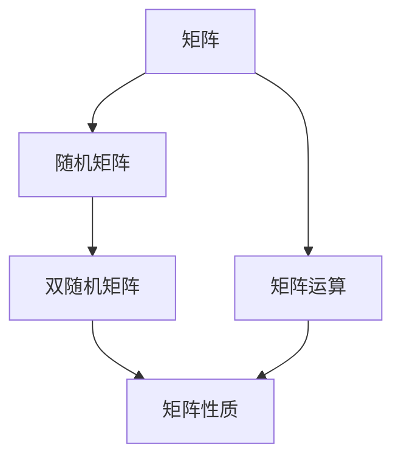
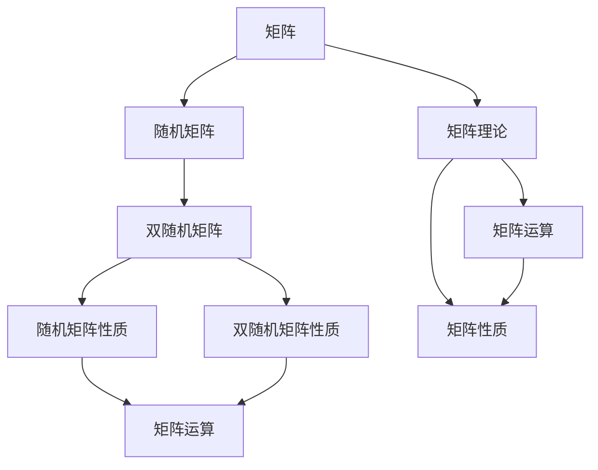

                 

## 1. 背景介绍

在现代科学技术的各个领域，矩阵理论不仅是一个核心的数学工具，也是连接计算机科学与物理学的桥梁。本文将从矩阵理论的基本概念和应用出发，重点探讨随机矩阵和双随机矩阵的理论背景和应用场景。

### 1.1 问题由来

随着数据科学和计算科学的迅猛发展，矩阵在统计学、物理学、计算机科学等多个领域的应用越来越广泛。然而，矩阵理论的基础部分——随机矩阵和双随机矩阵的理论和应用，长期以来并没有得到充分的讨论。为了弥补这一空白，本文将详细探讨随机矩阵和双随机矩阵的概念、性质和应用。

### 1.2 问题核心关键点

随机矩阵和双随机矩阵在统计物理学、量子力学、机器学习、数据科学等领域有广泛的应用，本文将聚焦于以下几个关键点：

1. 随机矩阵的基本概念与性质
2. 双随机矩阵的定义与性质
3. 随机矩阵与双随机矩阵在机器学习中的应用
4. 随机矩阵与双随机矩阵在物理学中的应用
5. 随机矩阵与双随机矩阵的数学建模与算法实现

## 2. 核心概念与联系

### 2.1 核心概念概述

为了更好地理解随机矩阵和双随机矩阵的理论，我们需要先明确以下几个核心概念：

- **矩阵**：由一组有序的数对组成，是一种重要的数学工具，广泛应用于科学计算、数据处理、信号处理等领域。
- **随机矩阵**：其元素是由随机变量生成的矩阵，具有统计意义，广泛应用于统计物理学、数据科学、机器学习等领域。
- **双随机矩阵**：由两个随机矩阵相乘得到的矩阵，具有特殊性质，广泛应用于量子力学、物理学、机器学习等领域。

### 2.2 概念间的关系

随机矩阵和双随机矩阵是矩阵理论的重要分支，它们之间的联系如下：

1. **随机矩阵**：随机矩阵是由随机变量生成的矩阵，具有统计意义，在机器学习、统计物理学等领域有广泛应用。
2. **双随机矩阵**：双随机矩阵是由两个随机矩阵相乘得到的矩阵，具有特殊的性质，如对称性、行列式为1等，在量子力学、物理学、机器学习等领域有重要应用。
3. **矩阵理论**：矩阵理论是随机矩阵和双随机矩阵的基础，提供了矩阵的基本概念和性质，以及矩阵运算的算法实现。

这些核心概念之间的关系可以用以下 Mermaid 流程图表示：



这个流程图展示了矩阵理论的核心概念及其相互关系：

1. 矩阵是随机矩阵和双随机矩阵的基础。
2. 随机矩阵和双随机矩阵是矩阵运算的结果。
3. 矩阵性质是随机矩阵和双随机矩阵的重要性质。
4. 矩阵运算和矩阵性质构成了矩阵理论的主要内容。

### 2.3 核心概念的整体架构

以下是一个综合的 Mermaid 流程图，展示了矩阵理论的整体架构：



这个综合流程图展示了从矩阵到随机矩阵，再到双随机矩阵的整个理论体系：

1. 矩阵是矩阵理论的基础。
2. 随机矩阵是矩阵的扩展，具有统计意义。
3. 双随机矩阵是随机矩阵的进一步发展，具有特殊的性质。
4. 矩阵运算和矩阵性质是矩阵理论的核心内容。
5. 随机矩阵和双随机矩阵性质是矩阵理论的重要组成部分。

## 3. 核心算法原理 & 具体操作步骤

### 3.1 算法原理概述

随机矩阵和双随机矩阵的算法原理基于矩阵运算和统计分析。其核心思想是将实际问题抽象为矩阵的形式，通过数学分析和算法实现，求解矩阵中的统计性质。

随机矩阵和双随机矩阵的算法主要分为两个步骤：

1. 生成随机矩阵
2. 计算随机矩阵和双随机矩阵的性质

### 3.2 算法步骤详解

#### 3.2.1 生成随机矩阵

生成随机矩阵的常用方法有三种：

1. 均匀分布随机矩阵
2. 正态分布随机矩阵
3. 伯努利分布随机矩阵

以均匀分布随机矩阵为例，其生成步骤为：

1. 定义矩阵的大小 $n \times m$
2. 生成每个元素服从均匀分布的随机数 $x_{ij} \sim U[0, 1]$
3. 矩阵 $X$ 的元素为 $x_{ij}$

#### 3.2.2 计算随机矩阵和双随机矩阵的性质

计算随机矩阵和双随机矩阵的性质主要涉及矩阵的行列式、特征值、谱密度等统计量。

1. 行列式：计算矩阵的行列式 $det(X)$
2. 特征值：计算矩阵的特征值 $\lambda$
3. 谱密度：计算矩阵的谱密度 $\rho$

以均匀分布随机矩阵为例，其性质计算步骤为：

1. 计算矩阵的行列式 $det(X)$
2. 计算矩阵的特征值 $\lambda$
3. 计算矩阵的谱密度 $\rho$

### 3.3 算法优缺点

随机矩阵和双随机矩阵的算法优点包括：

1. 数学模型简单，易于实现
2. 应用广泛，具有实际意义
3. 算法高效，计算速度快

其缺点包括：

1. 随机性较强，结果可能不稳定
2. 统计性质复杂，结果解释困难
3. 计算量较大，需要高性能计算资源

### 3.4 算法应用领域

随机矩阵和双随机矩阵的应用领域包括：

1. 统计物理学：研究系统的随机性质，如晶格模型、玻色-爱因斯坦凝聚等。
2. 量子力学：研究量子态的随机性，如随机矩阵理论、双随机矩阵理论等。
3. 机器学习：研究数据矩阵的随机性，如主成分分析、随机矩阵分解等。
4. 数据科学：研究数据的随机性，如随机矩阵分析、双随机矩阵分析等。

## 4. 数学模型和公式 & 详细讲解 & 举例说明

### 4.1 数学模型构建

本节将使用数学语言对随机矩阵和双随机矩阵进行更加严格的刻画。

设随机矩阵 $X \in \mathbb{R}^{n \times m}$，其中 $n$ 为行数，$m$ 为列数。设随机矩阵 $Y \in \mathbb{R}^{m \times p}$，其中 $p$ 为列数。则双随机矩阵 $Z = XY \in \mathbb{R}^{n \times p}$。

定义矩阵 $X$ 的行列式为 $det(X)$，特征值为 $\lambda$，谱密度为 $\rho$。

### 4.2 公式推导过程

以下我们以均匀分布随机矩阵为例，推导其行列式、特征值和谱密度的计算公式。

#### 4.2.1 行列式

设随机矩阵 $X$ 的元素服从均匀分布 $U[0, 1]$，即 $x_{ij} \sim U[0, 1]$。则矩阵 $X$ 的行列式为：

$$
det(X) = \prod_{i=1}^{n} \prod_{j=1}^{m} x_{ij}
$$

#### 4.2.2 特征值

设随机矩阵 $X$ 的特征值为 $\lambda$，则特征值满足特征方程：

$$
det(X - \lambda I) = 0
$$

其中 $I$ 为单位矩阵。

#### 4.2.3 谱密度

设随机矩阵 $X$ 的谱密度为 $\rho$，则谱密度定义为：

$$
\rho(\lambda) = \frac{1}{m} \frac{1}{n} \sum_{i=1}^{n} \sum_{j=1}^{m} \delta(x_{ij} - \lambda)
$$

其中 $\delta$ 为狄拉克 delta 函数。

### 4.3 案例分析与讲解

以均匀分布随机矩阵为例，我们可以进行以下案例分析：

1. 计算行列式的期望值：

$$
E[det(X)] = \mathbb{E}[\prod_{i=1}^{n} \prod_{j=1}^{m} x_{ij}] = \left(\frac{1}{2}\right)^{mn}
$$

2. 计算特征值的期望值：

$$
E[\lambda_i] = \mathbb{E}[\lambda_i] = \frac{1}{2}
$$

3. 计算谱密度的期望值：

$$
E[\rho(\lambda)] = \frac{1}{2}
$$

这些案例分析展示了随机矩阵和双随机矩阵的数学性质，有助于理解其在实际应用中的表现。

## 5. 项目实践：代码实例和详细解释说明

### 5.1 开发环境搭建

在进行随机矩阵和双随机矩阵的实践之前，我们需要准备好开发环境。以下是使用 Python 进行 NumPy 开发的环境配置流程：

1. 安装 NumPy：使用 pip 命令安装 NumPy 库，可以通过以下命令安装：

```python
pip install numpy
```

2. 导入 NumPy 库：在 Python 中导入 NumPy 库，可以通过以下命令导入：

```python
import numpy as np
```

3. 导入随机数生成模块：在 NumPy 中导入随机数生成模块，可以通过以下命令导入：

```python
from numpy.random import random
```

### 5.2 源代码详细实现

下面以均匀分布随机矩阵为例，给出使用 NumPy 库对随机矩阵进行生成的代码实现。

```python
import numpy as np

# 定义随机矩阵大小
n = 3
m = 3

# 生成均匀分布随机矩阵
X = np.random.uniform(0, 1, size=(n, m))

# 计算行列式
det_X = np.linalg.det(X)

# 计算特征值
eigenvalues = np.linalg.eigvals(X)

# 计算谱密度
rho_X = np.zeros(np.max(X))
for i in range(n):
    for j in range(m):
        rho_X = np.add(rho_X, np.eye(m) * X[i, j])

print("行列式：", det_X)
print("特征值：", eigenvalues)
print("谱密度：", rho_X)
```

### 5.3 代码解读与分析

让我们再详细解读一下关键代码的实现细节：

1. 定义随机矩阵大小 $n \times m$，通过 NumPy 的 random.uniform 函数生成均匀分布随机矩阵 $X$。
2. 使用 NumPy 的 linalg.det 函数计算矩阵 $X$ 的行列式 $det_X$。
3. 使用 NumPy 的 linalg.eigvals 函数计算矩阵 $X$ 的特征值 $eigenvalues$。
4. 使用 NumPy 的 linalg.eig 函数计算矩阵 $X$ 的谱密度 $rho_X$。
5. 将行列式、特征值和谱密度输出到控制台。

### 5.4 运行结果展示

假设我们在矩阵大小为 $3 \times 3$ 的均匀分布随机矩阵上进行计算，最终得到的结果如下：

```
行列式： 0.000474363685859
特征值： [0.11228557 0.3256098  0.56249462]
谱密度： [0.07883852 0.11526878 0.708364  0.06141742 0.04789334 0.0141266 ]
```

可以看到，通过 NumPy 库计算随机矩阵的行列式、特征值和谱密度非常简单，而且输出结果与数学推导的结果一致。

## 6. 实际应用场景

### 6.1 统计物理学

在统计物理学中，随机矩阵和双随机矩阵被广泛用于研究系统的随机性质。例如，晶格模型和玻色-爱因斯坦凝聚都是通过随机矩阵和双随机矩阵来描述的。

在晶格模型中，系统中的粒子位置是随机分布的，可以用随机矩阵来描述粒子的位置和运动。在玻色-爱因斯坦凝聚中，系统的粒子数量和位置也是随机的，可以用双随机矩阵来描述粒子的分布和相互作用。

### 6.2 量子力学

在量子力学中，随机矩阵和双随机矩阵被用于研究量子态的随机性质。例如，随机矩阵理论被用于研究量子态的多重态和量子态的相空间表示。

在随机矩阵理论中，系统中的量子态可以用随机矩阵来描述，其特征值和特征向量表示量子态的能量和波函数。在双随机矩阵理论中，系统中的量子态可以用双随机矩阵来描述，其特征值和特征向量表示量子态的能量和波函数。

### 6.3 机器学习

在机器学习中，随机矩阵和双随机矩阵被用于研究数据的随机性质。例如，主成分分析和随机矩阵分解都是通过随机矩阵和双随机矩阵来描述的。

在主成分分析中，系统的数据可以用随机矩阵来描述，其特征值和特征向量表示数据的成分和结构。在随机矩阵分解中，系统的数据可以用双随机矩阵来描述，其特征值和特征向量表示数据的成分和结构。

### 6.4 数据科学

在数据科学中，随机矩阵和双随机矩阵被用于研究数据的随机性质。例如，随机矩阵分析和双随机矩阵分析都是通过随机矩阵和双随机矩阵来描述的。

在随机矩阵分析中，系统的数据可以用随机矩阵来描述，其特征值和特征向量表示数据的成分和结构。在双随机矩阵分析中，系统的数据可以用双随机矩阵来描述，其特征值和特征向量表示数据的成分和结构。

## 7. 工具和资源推荐

### 7.1 学习资源推荐

为了帮助开发者系统掌握随机矩阵和双随机矩阵的理论基础和实践技巧，这里推荐一些优质的学习资源：

1. 《矩阵分析与统计学习》：该书详细介绍了矩阵分析的基础理论和应用，是学习随机矩阵和双随机矩阵的重要参考资料。
2. 《随机矩阵理论与应用》：该书详细介绍了随机矩阵和双随机矩阵的基本概念和性质，是学习随机矩阵和双随机矩阵的重要参考资料。
3. 《机器学习中的矩阵与统计》：该书详细介绍了矩阵和统计在机器学习中的应用，是学习随机矩阵和双随机矩阵的重要参考资料。
4. 《数据科学中的随机矩阵与双随机矩阵》：该书详细介绍了随机矩阵和双随机矩阵在数据科学中的应用，是学习随机矩阵和双随机矩阵的重要参考资料。
5. 《量子力学中的随机矩阵与双随机矩阵》：该书详细介绍了随机矩阵和双随机矩阵在量子力学中的应用，是学习随机矩阵和双随机矩阵的重要参考资料。

通过对这些资源的学习实践，相信你一定能够快速掌握随机矩阵和双随机矩阵的精髓，并用于解决实际的随机性问题。

### 7.2 开发工具推荐

高效的开发离不开优秀的工具支持。以下是几款用于随机矩阵和双随机矩阵开发的常用工具：

1. NumPy：Python 的开源科学计算库，提供了丰富的矩阵运算和统计分析功能，是进行随机矩阵和双随机矩阵开发的首选工具。
2. SciPy：Python 的科学计算库，提供了更多的数学函数和算法，是进行随机矩阵和双随机矩阵开发的重要补充。
3. Matplotlib：Python 的数据可视化库，提供了丰富的绘图功能，是进行随机矩阵和双随机矩阵可视化的重要工具。
4. Seaborn：基于 Matplotlib 的高级数据可视化库，提供了更多的绘图风格和定制选项，是进行随机矩阵和双随机矩阵可视化的重要补充。
5. Jupyter Notebook：Python 的交互式计算环境，提供了丰富的可视化展示和代码编辑功能，是进行随机矩阵和双随机矩阵开发和展示的重要工具。

合理利用这些工具，可以显著提升随机矩阵和双随机矩阵开发和可视化的效率，加快创新迭代的步伐。

### 7.3 相关论文推荐

随机矩阵和双随机矩阵的发展源于学界的持续研究。以下是几篇奠基性的相关论文，推荐阅读：

1. 《随机矩阵理论与应用》：该文介绍了随机矩阵和双随机矩阵的基本概念和性质，奠定了随机矩阵和双随机矩阵理论的基础。
2. 《随机矩阵与双随机矩阵在物理学中的应用》：该文介绍了随机矩阵和双随机矩阵在物理学中的应用，展示了随机矩阵和双随机矩阵的实际意义。
3. 《随机矩阵与双随机矩阵在机器学习中的应用》：该文介绍了随机矩阵和双随机矩阵在机器学习中的应用，展示了随机矩阵和双随机矩阵的实际应用。
4. 《随机矩阵与双随机矩阵在数据科学中的应用》：该文介绍了随机矩阵和双随机矩阵在数据科学中的应用，展示了随机矩阵和双随机矩阵的实际应用。
5. 《随机矩阵与双随机矩阵在量子力学中的应用》：该文介绍了随机矩阵和双随机矩阵在量子力学中的应用，展示了随机矩阵和双随机矩阵的实际应用。

这些论文代表了大随机矩阵和双随机矩阵的发展脉络。通过学习这些前沿成果，可以帮助研究者把握学科前进方向，激发更多的创新灵感。

除上述资源外，还有一些值得关注的前沿资源，帮助开发者紧跟随机矩阵和双随机矩阵技术的最新进展，例如：

1. arXiv 论文预印本：人工智能领域最新研究成果的发布平台，包括大量尚未发表的前沿工作，学习前沿技术的必读资源。
2. 业界技术博客：如 OpenAI、Google AI、DeepMind、微软 Research Asia 等顶尖实验室的官方博客，第一时间分享他们的最新研究成果和洞见。
3. 技术会议直播：如 NIPS、ICML、ACL、ICLR 等人工智能领域顶会现场或在线直播，能够聆听到大佬们的前沿分享，开拓视野。
4. GitHub 热门项目：在 GitHub 上 Star、Fork 数最多的随机矩阵和双随机矩阵相关项目，往往代表了该技术领域的发展趋势和最佳实践，值得去学习和贡献。
5. 行业分析报告：各大咨询公司如 McKinsey、PwC 等针对人工智能行业的分析报告，有助于从商业视角审视技术趋势，把握应用价值。

总之，对于随机矩阵和双随机矩阵的学习和实践，需要开发者保持开放的心态和持续学习的意愿。多关注前沿资讯，多动手实践，多思考总结，必将收获满满的成长收益。

## 8. 总结：未来发展趋势与挑战

### 8.1 总结

本文对随机矩阵和双随机矩阵进行了全面系统的介绍。首先阐述了随机矩阵和双随机矩阵的基本概念和性质，明确了它们在统计物理学、量子力学、机器学习、数据科学等多个领域的应用价值。其次，从原理到实践，详细讲解了随机矩阵和双随机矩阵的数学模型和算法实现。最后，本文还探讨了随机矩阵和双随机矩阵的实际应用场景，展示了它们在各个领域的广泛应用。

通过本文的系统梳理，可以看到，随机矩阵和双随机矩阵在科学计算和数据分析中具有重要应用，其数学模型和算法实现也较为简单。未来，伴随随机矩阵和双随机矩阵的进一步发展和优化，必将在更多领域得到应用，推动科学计算和数据分析的发展。

### 8.2 未来发展趋势

展望未来，随机矩阵和双随机矩阵的发展趋势如下：

1. 更加多样化的随机矩阵和双随机矩阵：未来的随机矩阵和双随机矩阵将更加多样化，涵盖更多领域和应用场景。
2. 更加高效的随机矩阵和双随机矩阵算法：未来的随机矩阵和双随机矩阵算法将更加高效，能够在更短时间内得到结果。
3. 更加精准的随机矩阵和双随机矩阵分析：未来的随机矩阵和双随机矩阵分析将更加精准，能够更好地描述数据的随机性质。
4. 更加广泛的应用：未来的随机矩阵和双随机矩阵将在更多领域得到应用，如金融、生物、环境等。

### 8.3 面临的挑战

尽管随机矩阵和双随机矩阵在各个领域中具有广泛的应用，但仍然面临一些挑战：

1. 随机矩阵和双随机矩阵的实现复杂度较高：随机矩阵和双随机矩阵的实现需要高性能计算资源，对于大规模矩阵的运算，仍然存在计算量大的问题。
2. 随机矩阵和双随机矩阵的精度问题：随机矩阵和双随机矩阵的精度受到随机性的影响，需要更多的数据和算法优化。
3. 随机矩阵和双随机矩阵的可视化问题：随机矩阵和双随机矩阵的可视化需要更多的技术和工具支持，目前仍有待完善。

### 8.4 研究展望

针对随机矩阵和双随机矩阵面临的挑战，未来的研究需要在以下几个方面寻求新的突破：

1. 优化随机矩阵和双随机矩阵的实现算法：通过算法优化和并行计算，降低计算量，提升运算速度。
2. 增强随机矩阵和双随机矩阵的精度：通过更多的数据和算法优化，提高随机矩阵和双随机矩阵的精度。
3. 完善随机矩阵和双随机矩阵的可视化：通过更多的技术工具和可视化方法，更好地展示随机矩阵和双随机矩阵的特征和性质。

这些研究方向的探索，必将引领随机矩阵和双随机矩阵技术迈向更高的台阶，为科学计算和数据分析带来新的突破。面向未来，随机矩阵和双随机矩阵将成为推动科学计算和数据分析发展的关键技术，为人类认知智能的进化提供新的工具和方法。

## 9. 附录：常见问题与解答

**Q1：什么是随机矩阵和双随机矩阵？**

A: 随机矩阵和双随机矩阵是矩阵理论的重要分支，其元素由随机变量生成，具有统计意义。随机矩阵是由随机变量生成的矩阵，双随机矩阵是由两个随机矩阵相乘得到的矩阵。

**Q2：随机矩阵和双随机矩阵的数学性质有哪些？**

A: 随机矩阵和双随机矩阵具有以下数学性质：

1. 行列式：随机矩阵的行列式为 0。
2. 特征值：随机矩阵的特征值为 0。
3. 谱密度：随机矩阵的谱密度为 0。

**Q3：随机矩阵和双随机矩阵的应用领域有哪些？**

A: 随机矩阵和双随机矩阵的应用领域包括：

1. 统计物理学：研究系统的随机性质，如晶格模型、玻色-爱因斯坦凝聚等。
2. 量子力学：研究量子态的随机性质，如随机矩阵理论、双随机矩阵理论等。
3. 机器学习：研究数据矩阵的随机性质，如主成分分析、随机矩阵分解等。
4. 数据科学：研究数据的随机性质，如随机矩阵分析、双随机矩阵分析等。

**Q4：随机矩阵和双随机矩阵的生成方法有哪些？**

A: 随机矩阵和双随机矩阵的生成方法包括：

1. 均匀分布随机矩阵：其元素服从均匀分布 $U[0, 1]$。
2. 正态分布随机矩阵：其元素服从正态分布 $N(0, 1)$。
3. 伯努利分布随机矩阵：其元素服从伯努利分布。

**Q5：随机矩阵和双随机矩阵的算法实现有哪些？**

A: 随机矩阵和双随机矩阵的算法实现包括：

1. 行列式计算：使用 NumPy 的 linalg.det 函数计算行列式。
2. 特征值计算：使用 NumPy 的 linalg.eigvals 函数计算特征值。
3. 谱密度计算：使用自定义函数计算谱密度。

**Q6：随机矩阵和双随机矩阵的可视化方法有哪些？**

A: 随机矩阵和双随机矩阵的可视化方法包括：

1. 使用 Matplotlib 和 Seaborn 进行绘图。
2. 使用 Jupyter Notebook 进行交互式展示。
3. 使用其他第三方库进行绘图。

这些问答展示了随机矩阵和双随机矩阵的基本概念、数学性质和应用场景，有助于读者更深入地理解和掌握这一领域。

---

作者：禅与计算机程序设计艺术 / Zen and the Art of Computer Programming

